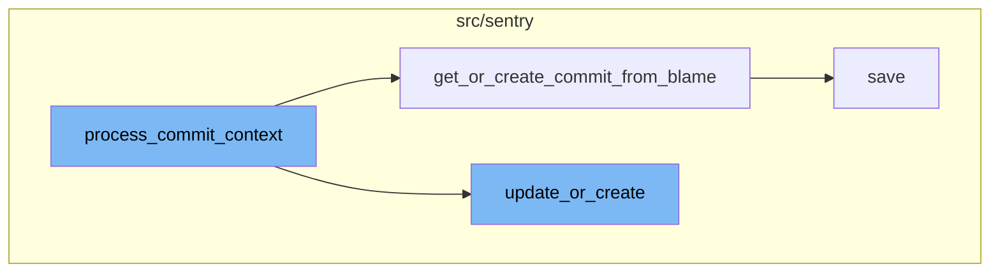

<SwmSnippet path="/src/sentry/tasks/commit_context.py" line="153">

---

# process_commit_context

The `process_commit_context` function is the main function responsible for processing the context of a commit. It starts by acquiring a lock to ensure that the processing of the commit context is thread-safe. It then retrieves the project and sets up basic logging details. The function then retrieves the code mappings for the project and identifies the first frame in the stack trace that is 'in_app'. If no such frame is found, it falls back to processing suspect commits. If a frame is found, it attempts to find the commit context for all frames. If a commit context is found, it retrieves or creates a commit from the blame information and updates or creates a group owner based on the commit information.

```python
def process_commit_context(
    self: Task,
    event_id: str,
    event_platform: str,
    event_frames: Sequence[Mapping[str, Any]],
    group_id: int,
    project_id: int,
    sdk_name: str | None = None,
) -> None:
    """
    For a given event, look at the first in_app frame, and if we can find who modified the line, we can then update who is assigned to the issue.
    """
    lock = locks.get(
        f"process-commit-context:{group_id}", duration=10, name="process_commit_context"
    )
    try:
        with lock.acquire():
            metrics.incr("sentry.tasks.process_commit_context.start")

            set_current_event_project(project_id)

```

---

</SwmSnippet>

<SwmSnippet path="/src/sentry/integrations/utils/commit_context.py" line="107">

---

# get_or_create_commit_from_blame

The `get_or_create_commit_from_blame` function is used within `process_commit_context` to retrieve or create a commit based on the blame information. It first tries to retrieve a commit with the same repository ID and commit ID from the database. If it doesn't exist, it creates a new commit with the blame information and saves it to the database.

```python
def get_or_create_commit_from_blame(
    blame: FileBlameInfo, organization_id: int, extra: Mapping[str, str | int]
) -> Commit:
    """
    From a blame object, see if a matching commit already exists in sentry_commit.
    If not, create it.
    """
    try:
        commit: Commit = Commit.objects.get(
            repository_id=blame.repo.id,
            key=blame.commit.commitId,
        )
        if commit.message == "":
            commit.message = blame.commit.commitMessage
            commit.save()

        return commit
    except Commit.DoesNotExist:
        logger.info(
            "process_commit_context_all_frames.no_commit_in_sentry",
            extra={
```

---

</SwmSnippet>

<SwmSnippet path="/src/sentry/models/dynamicsampling.py" line="163">

---

# update_or_create

The `update_or_create` function is used within `process_commit_context` to update or create a dynamic sampling rule. It first checks if a rule already exists for the given condition and organization. If it does, it updates the rule's end date, number of samples, and sample rate. If no rule exists, it creates a new rule with the provided parameters.

```python
    def update_or_create(
        condition: Any,
        start: datetime,
        end: datetime,
        project_ids: Sequence[int],
        organization_id: int,
        num_samples: int,
        sample_rate: float,
        query: str,
        created_by_id: int | None = None,
    ) -> CustomDynamicSamplingRule:
        from sentry.models.organization import Organization
        from sentry.models.project import Project

        with transaction.atomic(router.db_for_write(CustomDynamicSamplingRule)):
            # check if rule already exists for this organization
            existing_rule = CustomDynamicSamplingRule.get_rule_for_org(
                condition, organization_id, project_ids
            )

            if existing_rule is not None:
```

---

</SwmSnippet>

# Flow drill down



<SwmSnippet path="/src/sentry/tasks/commit_context.py" line="153">

---

# process_commit_context

The `process_commit_context` function is responsible for processing the context of a commit. It starts by acquiring a lock to ensure that the processing of the commit context is thread-safe. It then retrieves the project and sets up basic logging details. The function then retrieves the code mappings for the project and identifies the first frame in the stack trace that is 'in_app'. If no such frame is found, it falls back to processing suspect commits. If a frame is found, it attempts to find the commit context for all frames. If a commit context is found, it retrieves or creates a commit from the blame information and updates or creates a group owner based on the commit information.

```python
def process_commit_context(
    self: Task,
    event_id: str,
    event_platform: str,
    event_frames: Sequence[Mapping[str, Any]],
    group_id: int,
    project_id: int,
    sdk_name: str | None = None,
) -> None:
    """
    For a given event, look at the first in_app frame, and if we can find who modified the line, we can then update who is assigned to the issue.
    """
    lock = locks.get(
        f"process-commit-context:{group_id}", duration=10, name="process_commit_context"
    )
    try:
        with lock.acquire():
            metrics.incr("sentry.tasks.process_commit_context.start")

            set_current_event_project(project_id)

```

---

</SwmSnippet>

<SwmSnippet path="/src/sentry/integrations/utils/commit_context.py" line="107">

---

# get_or_create_commit_from_blame

The `get_or_create_commit_from_blame` function is used within `process_commit_context` to retrieve or create a commit based on the blame information. It first tries to retrieve a commit with the same repository ID and commit ID from the database. If it doesn't exist, it creates a new commit with the blame information and saves it to the database.

```python
def get_or_create_commit_from_blame(
    blame: FileBlameInfo, organization_id: int, extra: Mapping[str, str | int]
) -> Commit:
    """
    From a blame object, see if a matching commit already exists in sentry_commit.
    If not, create it.
    """
    try:
        commit: Commit = Commit.objects.get(
            repository_id=blame.repo.id,
            key=blame.commit.commitId,
        )
        if commit.message == "":
            commit.message = blame.commit.commitMessage
            commit.save()

        return commit
    except Commit.DoesNotExist:
        logger.info(
            "process_commit_context_all_frames.no_commit_in_sentry",
            extra={
```

---

</SwmSnippet>

<SwmSnippet path="/src/sentry/models/dynamicsampling.py" line="163">

---

# update_or_create

The `update_or_create` function is used within `process_commit_context` to update or create a dynamic sampling rule. It first checks if a rule already exists for the given condition and organization. If it does, it updates the rule's end date, number of samples, and sample rate. If no rule exists, it creates a new rule with the provided parameters.

```python
    def update_or_create(
        condition: Any,
        start: datetime,
        end: datetime,
        project_ids: Sequence[int],
        organization_id: int,
        num_samples: int,
        sample_rate: float,
        query: str,
        created_by_id: int | None = None,
    ) -> CustomDynamicSamplingRule:
        from sentry.models.organization import Organization
        from sentry.models.project import Project

        with transaction.atomic(router.db_for_write(CustomDynamicSamplingRule)):
            # check if rule already exists for this organization
            existing_rule = CustomDynamicSamplingRule.get_rule_for_org(
                condition, organization_id, project_ids
            )

            if existing_rule is not None:
```

---

</SwmSnippet>

&nbsp;

*This is an auto-generated document by Swimm AI 🌊 and has not yet been verified by a human*

<SwmMeta version="3.0.0" repo-id="Z2l0aHViJTNBJTNBc2VudHJ5LWRlbW8lM0ElM0FTd2ltbS1EZW1v" repo-name="sentry-demo" doc-type="flows"><sup>Powered by [Swimm](/)</sup></SwmMeta>
