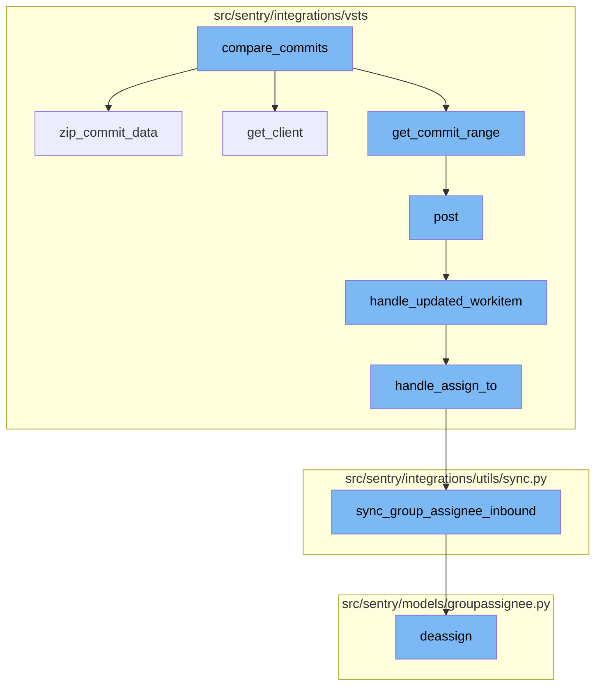
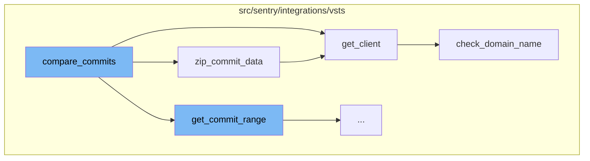
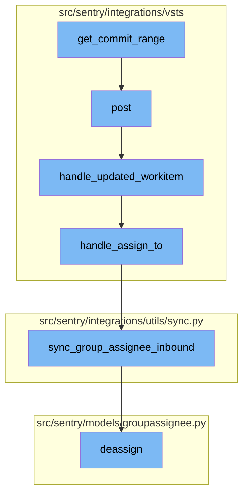

# Overview of compare_commits

The `compare_commits` function is a key part of the commit comparison process. It is used to compare commits between two given commit hashes. The function retrieves the installation and instance details, and then creates a client using these details. If the `start_sha` is not provided, it gets the commits up to the `end_sha`. If both `start_sha` and `end_sha` are provided, it gets the commit range between these two hashes.

# Client Creation

The `get_client` function is used to create a VstsApiClient instance. It checks the domain name of the default identity and raises an exception if the org_integration is not defined or if the org_integration.default_auth_id is not defined.

# Domain Name Validation

The `check_domain_name` function is used to validate the domain name of the default identity. If the domain name does not match the expected format, it updates the domain name in the model metadata and saves the model.

# Retrieving Commit Details

The `zip_commit_data` function is used to retrieve additional commit details. It iterates over the commit list and for each commit, if the comment is truncated, it makes an additional API call to get the full commit message. It also fetches the patch data for the commit. The function stops fetching patch data after reaching the maximum commit data requests limit.

# Commit Range Retrieval

The `get_commit_range` function is the first step in the flow. It takes in a repository ID, a start SHA, and an end SHA. It then makes a POST request to the VSTS API to get a range of commits between the start and end SHA in the specified repository.

# Handling POST Requests

The `post` function is the next step in the flow. It handles incoming POST requests. It extracts the event type and external ID from the request data. If the event type is 'workitem.updated', it retrieves the integration associated with the external ID and calls the `handle_updated_workitem` function with the request data and the integration.

# Handling Work Item Updates

The `handle_updated_workitem` function is called when a work item is updated. It extracts the work item ID, project ID, and assigned user from the data. It then calls the `handle_assign_to` function with the integration, work item ID, and assigned user.

# Handling Assignments

The `handle_assign_to` function is responsible for handling the assignment of a work item. It checks if there is a new assignee and if so, it parses the email of the new assignee. It then calls the `sync_group_assignee_inbound` function with the integration, email, work item ID, and a flag indicating whether to assign or not.

# Syncing Group Assignee

The `sync_group_assignee_inbound` function is responsible for syncing the assignee of a group. It retrieves the groups affected by the external issue and assigns them to the user with the specified email. If the assign flag is false, it deassigns the groups.

# Deassigning Groups

The `deassign` function is the final step in the flow. It deassigns a group from a user. It deletes the group assignee, creates an unassigned activity for the group, and syncs the Sentry assignee to external issues.



# Flow drill down

First, we'll zoom into this section of the flow:



<SwmSnippet path="/src/sentry/integrations/vsts/repository.py" line="97">

---

# compare_commits Function

The `compare_commits` function is used to compare commits between two given commit hashes. It first retrieves the installation and instance details, and then creates a client using these details. If the `start_sha` is not provided, it gets the commits up to the `end_sha`. If both `start_sha` and `end_sha` are provided, it gets the commit range between these two hashes.

```python
    def compare_commits(
        self, repo: Repository, start_sha: str | None, end_sha: str
    ) -> Sequence[Mapping[str, str]]:
        """TODO(mgaeta): This function is kinda a mess."""
        installation = self.get_installation(repo.integration_id, repo.organization_id)
        instance = repo.config["instance"]
        client = installation.get_client(base_url=instance)

        try:
            if start_sha is None:
                res = client.get_commits(repo.external_id, commit=end_sha, limit=10)
            else:
                res = client.get_commit_range(repo.external_id, start_sha, end_sha)
        except Exception as e:
            raise installation.raise_error(e)

        commits = self.zip_commit_data(repo, res["value"], repo.organization_id)
        return self._format_commits(repo, commits)
```

---

</SwmSnippet>

<SwmSnippet path="/src/sentry/integrations/vsts/integration.py" line="169">

---

# get_client Function

The `get_client` function is used to create a VstsApiClient instance. It checks the domain name of the default identity and raises an exception if the org_integration is not defined or if the org_integration.default_auth_id is not defined.

```python
    def get_client(self, base_url: str | None = None) -> VstsApiClient:
        if base_url is None:
            base_url = self.instance
        if SiloMode.get_current_mode() != SiloMode.REGION:
            if self.default_identity is None:
                self.default_identity = self.get_default_identity()
            self.check_domain_name(self.default_identity)

        if self.org_integration is None:
            raise Exception("self.org_integration is not defined")
        if self.org_integration.default_auth_id is None:
            raise Exception("self.org_integration.default_auth_id is not defined")
        return VstsApiClient(
            base_url=base_url,
            oauth_redirect_url=VstsIntegrationProvider.oauth_redirect_url,
            org_integration_id=self.org_integration.id,
            identity_id=self.org_integration.default_auth_id,
        )
```

---

</SwmSnippet>

<SwmSnippet path="/src/sentry/integrations/vsts/integration.py" line="188">

---

# check_domain_name Function

The `check_domain_name` function is used to validate the domain name of the default identity. If the domain name does not match the expected format, it updates the domain name in the model metadata and saves the model.

```python
    def check_domain_name(self, default_identity: RpcIdentity) -> None:
        if re.match("^https://.+/$", self.model.metadata["domain_name"]):
            return

        base_url = VstsIntegrationProvider.get_base_url(
            default_identity.data["access_token"], self.model.external_id
        )
        self.model.metadata["domain_name"] = base_url
        self.model.save()
```

---

</SwmSnippet>

<SwmSnippet path="/src/sentry/integrations/vsts/repository.py" line="72">

---

# zip_commit_data Function

The `zip_commit_data` function is used to retrieve additional commit details. It iterates over the commit list and for each commit, if the comment is truncated, it makes an additional API call to get the full commit message. It also fetches the patch data for the commit. The function stops fetching patch data after reaching the maximum commit data requests limit.

```python
    def zip_commit_data(
        self, repo: Repository, commit_list: Sequence[Commit], organization_id: int
    ) -> Sequence[Commit]:
        installation = self.get_installation(repo.integration_id, organization_id)
        client = installation.get_client(base_url=repo.config["instance"])
        n = 0
        for commit in commit_list:
            # Azure will truncate commit comments to only the first line.
            # We need to make an additional API call to get the full commit message.
            # This is important because issue refs could be anywhere in the commit
            # message.
            if commit.get("commentTruncated", False):
                full_commit = client.get_commit(repo.external_id, commit["commitId"])
                commit["comment"] = full_commit["comment"]

            commit["patch_set"] = self.transform_changes(
                client.get_commit_filechanges(repo.external_id, commit["commitId"])
            )
            # We only fetch patch data for 90 commits.
            n += 1
            if n > MAX_COMMIT_DATA_REQUESTS:
```

---

</SwmSnippet>

Now, lets zoom into this section of the flow:



<SwmSnippet path="/src/sentry/integrations/vsts/client.py" line="356">

---

# get_commit_range

The `get_commit_range` function is the first step in the flow. It takes in a repository ID, a start SHA, and an end SHA. It then makes a POST request to the VSTS API to get a range of commits between the start and end SHA in the specified repository.

```python
    def get_commit_range(self, repo_id: str, start_sha: str, end_sha: str) -> Response:
        return self.post(
            VstsApiPath.commits_batch.format(instance=self.base_url, repo_id=repo_id),
            data={
                "itemVersion": {"versionType": "commit", "version": start_sha},
                "compareVersion": {"versionType": "commit", "version": end_sha},
            },
        )
```

---

</SwmSnippet>

<SwmSnippet path="/src/sentry/integrations/vsts/webhooks.py" line="43">

---

# post

The `post` function is the next step in the flow. It handles incoming POST requests. It extracts the event type and external ID from the request data. If the event type is 'workitem.updated', it retrieves the integration associated with the external ID and calls the `handle_updated_workitem` function with the request data and the integration.

```python
    def post(self, request: Request, *args: Any, **kwargs: Any) -> Response:
        try:
            data = request.data
            event_type = data["eventType"]
            external_id = get_vsts_external_id(data=request.data)
        except Exception as e:
            logger.info("vsts.invalid-webhook-payload", extra={"error": str(e)})
            return self.respond(status=status.HTTP_400_BAD_REQUEST)

        # https://docs.microsoft.com/en-us/azure/devops/service-hooks/events?view=azure-devops#workitem.updated
        if event_type == "workitem.updated":
            integration = integration_service.get_integration(
                provider=PROVIDER_KEY, external_id=external_id
            )
            if integration is None:
                logger.info(
                    "vsts.integration-in-webhook-payload-does-not-exist",
                    extra={"external_id": external_id, "event_type": event_type},
                )
                return self.respond(
                    {"detail": "Integration does not exist."}, status=status.HTTP_400_BAD_REQUEST
```

---

</SwmSnippet>

<SwmSnippet path="/src/sentry/integrations/vsts/webhooks.py" line="151">

---

# handle_updated_workitem

The `handle_updated_workitem` function is called when a work item is updated. It extracts the work item ID, project ID, and assigned user from the data. It then calls the `handle_assign_to` function with the integration, work item ID, and assigned user.

```python
def handle_updated_workitem(data: Mapping[str, Any], integration: RpcIntegration) -> None:
    project: str | None = None
    try:
        external_issue_key = data["resource"]["workItemId"]
    except KeyError as e:
        logger.info(
            "vsts.updating-workitem-does-not-have-necessary-information",
            extra={"error": str(e), "integration_id": integration.id},
        )
        return

    try:
        project = data["resourceContainers"]["project"]["id"]
    except KeyError as e:
        logger.info(
            "vsts.updating-workitem-does-not-have-necessary-information",
            extra={"error": str(e), "integration_id": integration.id},
        )

    try:
        assigned_to = data["resource"]["fields"].get("System.AssignedTo")
```

---

</SwmSnippet>

<SwmSnippet path="/src/sentry/integrations/vsts/webhooks.py" line="89">

---

# handle_assign_to

The `handle_assign_to` function is responsible for handling the assignment of a work item. It checks if there is a new assignee and if so, it parses the email of the new assignee. It then calls the `sync_group_assignee_inbound` function with the integration, email, work item ID, and a flag indicating whether to assign or not.

```python
def handle_assign_to(
    integration: RpcIntegration,
    external_issue_key: str | None,
    assigned_to: Mapping[str, str] | None,
) -> None:
    if not assigned_to:
        return

    email: str | None = None
    assign = False

    new_value = assigned_to.get("newValue")
    if new_value is not None:
        email = parse_email(new_value)
        if not email:
            logger.info(
                "vsts.failed-to-parse-email-in-handle-assign-to",
                extra={
                    "error": "parse_error",
                    "integration_id": integration.id,
                    "assigned_to_values": assigned_to,
```

---

</SwmSnippet>

<SwmSnippet path="/src/sentry/integrations/utils/sync.py" line="64">

---

# sync_group_assignee_inbound

The `sync_group_assignee_inbound` function is responsible for syncing the assignee of a group. It retrieves the groups affected by the external issue and assigns them to the user with the specified email. If the assign flag is false, it deassigns the groups.

```python
def sync_group_assignee_inbound(
    integration: RpcIntegration,
    email: str | None,
    external_issue_key: str,
    assign: bool = True,
) -> Sequence[Group]:
    """
    Given an integration, user email address and an external issue key,
    assign linked groups to matching users. Checks project membership.
    Returns a list of groups that were successfully assigned.
    """

    logger = logging.getLogger(f"sentry.integrations.{integration.provider}")

    orgs_with_sync_enabled = where_should_sync(integration, "inbound_assignee")
    affected_groups = Group.objects.get_groups_by_external_issue(
        integration,
        orgs_with_sync_enabled,
        external_issue_key,
    )
    log_context = {
```

---

</SwmSnippet>

<SwmSnippet path="/src/sentry/models/groupassignee.py" line="197">

---

# deassign

The `deassign` function is the final step in the flow. It deassigns a group from a user. It deletes the group assignee, creates an unassigned activity for the group, and syncs the Sentry assignee to external issues.

```python
    def deassign(
        self,
        group: Group,
        acting_user: User | RpcUser | None = None,
        assigned_to: Team | RpcUser | None = None,
        extra: dict[str, str] | None = None,
    ) -> None:
        from sentry.integrations.utils import sync_group_assignee_outbound
        from sentry.models.activity import Activity
        from sentry.models.projectownership import ProjectOwnership

        try:
            previous_groupassignee = self.get(group=group)
        except GroupAssignee.DoesNotExist:
            previous_groupassignee = None

        affected = self.filter(group=group)[:1].count()
        self.filter(group=group).delete()

        if affected > 0:
            Activity.objects.create_group_activity(group, ActivityType.UNASSIGNED, user=acting_user)
```

---

</SwmSnippet>

&nbsp;

*This is an auto-generated document by Swimm AI 🌊 and has not yet been verified by a human*

<SwmMeta version="3.0.0" repo-id="Z2l0aHViJTNBJTNBc2VudHJ5LWRlbW8lM0ElM0FTd2ltbS1EZW1v" repo-name="sentry-demo" doc-type="flows"><sup>Powered by [Swimm](/)</sup></SwmMeta>
