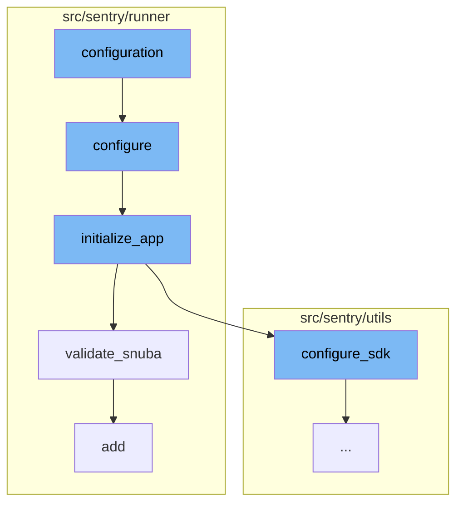
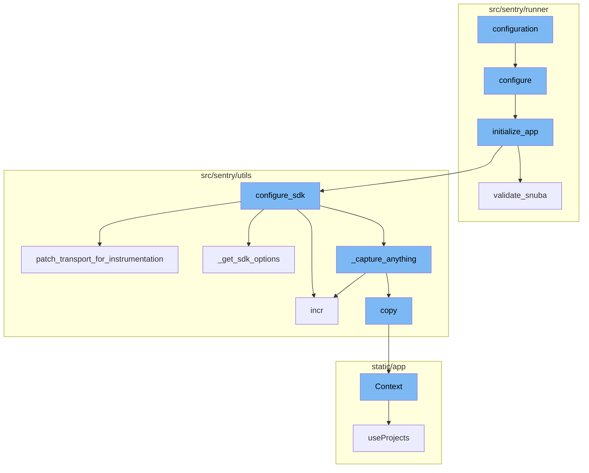
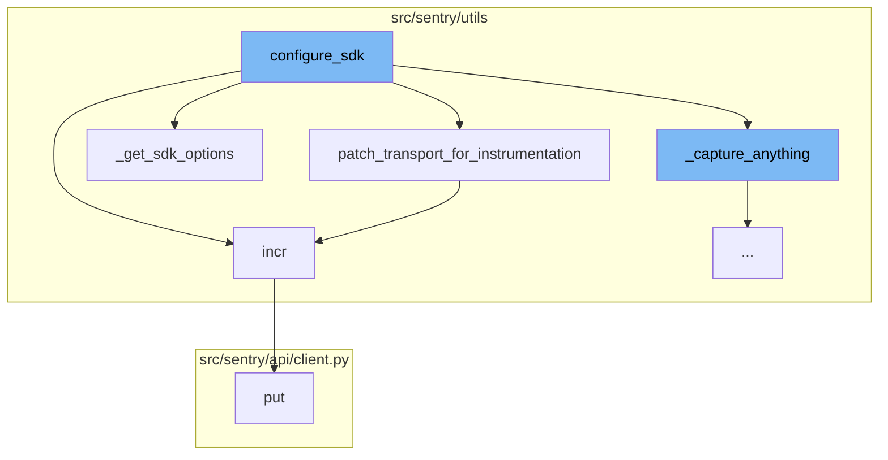
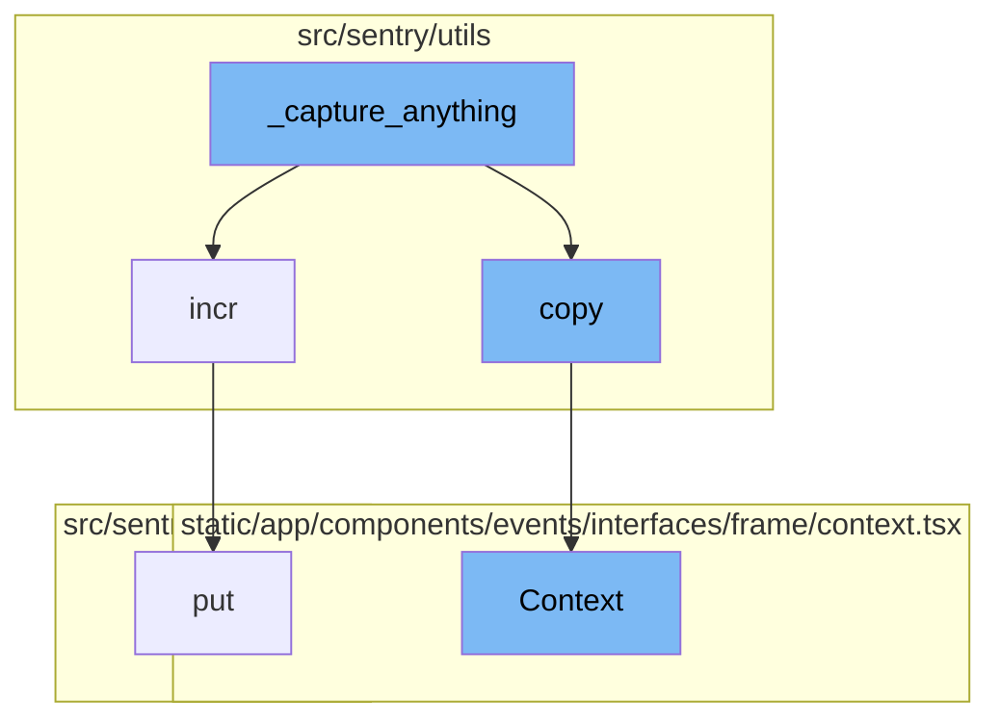

<SwmSnippet path="/src/sentry/runner/decorators.py" line="20">

---

# Configuration Flow

The configuration flow starts with the `configuration` function. This function loads and configures Sentry. It checks if the `_SENTRY_SKIP_CONFIGURATION` environment variable is not set to `1`, and if so, it imports and calls the `configure` function.

```python
def configuration(f: Callable[P, R]) -> Callable[P, R]:
    "Load and configure Sentry."
    from functools import update_wrapper

    import click

    @click.pass_context
    def inner(ctx: click.Context, *args: P.args, **kwargs: P.kwargs) -> R:
        # HACK: We can't call `configure()` from within tests
        # since we don't load config files from disk, so we
        # need a way to bypass this initialization step
        if os.environ.get("_SENTRY_SKIP_CONFIGURATION") != "1":
            from sentry.runner import configure

            configure()
        return ctx.invoke(f, *args, **kwargs)

    return update_wrapper(inner, f)
```

---

</SwmSnippet>

<SwmSnippet path="/src/sentry/runner/settings.py" line="53">

---

The `configure` function sets up the environment given two different config files. It checks if the configuration has been installed, and if not, it sets up the environment, adds additional mimetypes for static files, checks if the configuration file exists, and initializes the app.

```python
def configure(
    ctx: click.Context | None, py: str, yaml: str | None, skip_service_validation: bool = False
) -> None:
    """
    Given the two different config files, set up the environment.

    NOTE: Will only execute once, so it's safe to call multiple times.
    """
    global __installed
    if __installed:
        return

    # Make sure that our warnings are always displayed.
    warnings.filterwarnings("default", "", Warning, r"^sentry")

    # Add in additional mimetypes that are useful for our static files
    # which aren't common in default system registries
    import mimetypes

    for type, ext in (
        ("application/json", "map"),
```

---

</SwmSnippet>

<SwmSnippet path="/src/sentry/runner/initializer.py" line="306">

---

The `initialize_app` function is responsible for initializing the application with the given configuration. It sets up various settings, validates the configuration, and sets up the services.

```python
def initialize_app(config: dict[str, Any], skip_service_validation: bool = False) -> None:
    settings = config["settings"]

    # Just reuse the integration app for Single Org / Self-Hosted as
    # it doesn't make much sense to use 2 separate apps for SSO and
    # integration.
    if settings.SENTRY_SINGLE_ORGANIZATION:
        options_mapper.update(
            {
                "github-app.client-id": "GITHUB_APP_ID",
                "github-app.client-secret": "GITHUB_API_SECRET",
            }
        )

    bootstrap_options(settings, config["options"])

    logging.raiseExceptions = settings.DEBUG

    configure_structlog()

    # Commonly setups don't correctly configure themselves for production envs
```

---

</SwmSnippet>

<SwmSnippet path="/src/sentry/runner/initializer.py" line="620">

---

The `validate_snuba` function ensures that everything related to Snuba is in sync. It checks if all Snuba required backends are set and if the eventstream is Snuba compatible. If not, it raises a ConfigurationError.

```python
def validate_snuba() -> None:
    """
    Make sure everything related to Snuba is in sync.

    This covers a few cases:

    * When you have features related to Snuba, you must also
      have Snuba fully configured correctly to continue.
    * If you have Snuba specific search/tagstore/tsdb backends,
      you must also have a Snuba compatible eventstream backend
      otherwise no data will be written into Snuba.
    * If you only have Snuba related eventstream, yell that you
      probably want the other backends otherwise things are weird.
    """
    if not settings.DEBUG:
        return

    has_all_snuba_required_backends = (
        settings.SENTRY_SEARCH
        in (
            "sentry.search.snuba.EventsDatasetSnubaSearchBackend",
```

---

</SwmSnippet>

<SwmSnippet path="/src/sentry/runner/commands/permissions.py" line="37">

---

The `add` function adds a permission to a user. It creates a new UserPermission object and saves it to the database.

```python
def add(user: str, permission: str) -> None:
    "Add a permission to a user."
    from django.db import IntegrityError, transaction

    from sentry.models.userpermission import UserPermission

    user_inst = user_param_to_user(user)

    try:
        with transaction.atomic(router.db_for_write(UserPermission)):
            UserPermission.objects.create(user=user_inst, permission=permission)
    except IntegrityError:
        click.echo(f"Permission already exists for `{user_inst.username}`")
    else:
        click.echo(f"Added permission `{permission}` to `{user_inst.username}`")
```

---

</SwmSnippet>

<SwmSnippet path="/src/sentry/utils/sdk.py" line="275">

---

The `configure_sdk` function is the starting point of the configuration flow. It sets up the SDK for Sentry, including the transport mechanism for sending events and metrics to Sentry. It also includes the `_capture_anything` method which is responsible for capturing events and metrics.

```python
def configure_sdk():
    """
    Setup and initialize the Sentry SDK.
    """
    sdk_options, dsns = _get_sdk_options()

    internal_project_key = get_project_key()

    if dsns.sentry4sentry:
        transport = make_transport(get_options(dsn=dsns.sentry4sentry, **sdk_options))
        sentry4sentry_transport = patch_transport_for_instrumentation(transport, "upstream")
    else:
        sentry4sentry_transport = None

    if dsns.sentry_saas:
        transport = make_transport(get_options(dsn=dsns.sentry_saas, **sdk_options))
        sentry_saas_transport = patch_transport_for_instrumentation(transport, "relay")
    elif settings.IS_DEV and not settings.SENTRY_USE_RELAY:
        sentry_saas_transport = None
    elif internal_project_key and internal_project_key.dsn_private:
        transport = make_transport(get_options(dsn=internal_project_key.dsn_private, **sdk_options))
```

---

</SwmSnippet>

<SwmSnippet path="/src/sentry/utils/sdk.py" line="237">

---

The `patch_transport_for_instrumentation` function is called within `configure_sdk`. It modifies the transport mechanism to include metrics about the number of events sent to Sentry. This is done by patching the `_send_request` method of the transport object.

```python
# Patches transport functions to add metrics to improve resolution around events sent to our ingest.
# Leaving this in to keep a permanent measurement of sdk requests vs ingest.
def patch_transport_for_instrumentation(transport, transport_name):
    _send_request = transport._send_request
    if _send_request:

        def patched_send_request(*args, **kwargs):
            metrics.incr(f"internal.sent_requests.{transport_name}.events")
            return _send_request(*args, **kwargs)

        transport._send_request = patched_send_request
    return transport
```

---

</SwmSnippet>

<SwmSnippet path="/src/sentry/utils/metrics.py" line="101">

---

The `incr` function is used to increment a metric. It is called within `patch_transport_for_instrumentation` to count the number of events sent, and within `configure_sdk` to count the number of SDK configurations.

```python
    def incr(
        self,
        key: str,
        instance: str | None = None,
        tags: Tags | None = None,
        amount: int = 1,
        sample_rate: float = settings.SENTRY_METRICS_SAMPLE_RATE,
    ) -> None:
        if not self._started:
            self._start()
        self.q.put((key, instance, tags, amount, sample_rate))
```

---

</SwmSnippet>

<SwmSnippet path="/src/sentry/utils/sdk.py" line="256">

---

The `_get_sdk_options` function is called within `configure_sdk` to fetch the SDK configuration options. These options include settings for event reporting, transaction sampling, and release information.

```python
def _get_sdk_options() -> tuple[SdkConfig, Dsns]:
    sdk_options = settings.SENTRY_SDK_CONFIG.copy()
    sdk_options["send_client_reports"] = True
    sdk_options["traces_sampler"] = traces_sampler
    sdk_options["before_send_transaction"] = before_send_transaction
    sdk_options["before_send"] = before_send
    sdk_options["release"] = (
        f"backend@{sdk_options['release']}" if "release" in sdk_options else None
    )

    # Modify SENTRY_SDK_CONFIG in your deployment scripts to specify your desired DSN
    dsns = Dsns(
        sentry4sentry=sdk_options.pop("dsn", None),
        sentry_saas=sdk_options.pop("relay_dsn", None),
    )

    return sdk_options, dsns
```

---

</SwmSnippet>

<SwmSnippet path="/src/sentry/api/client.py" line="119">

---

The `put` function is called within `incr` to send the updated metric to Sentry.

```python
    def put(self, *args, **kwargs):
        return self.request("PUT", *args, **kwargs)
```

---

</SwmSnippet>

<SwmSnippet path="/src/sentry/utils/sdk.py" line="334">

---

The `_capture_anything` function is the starting point of the configuration flow. It captures any event and increments a metric if the event is sent upstream. It also checks if the SDK upstream metrics are enabled and filters out statsd envelope items unless allowed by a separate sample rate.

```python
        def _capture_anything(self, method_name, *args, **kwargs):
            # Sentry4Sentry (upstream) should get the event first because
            # it is most isolated from the sentry installation.
            if sentry4sentry_transport:
                metrics.incr("internal.captured.events.upstream")
                # TODO(mattrobenolt): Bring this back safely.
                # from sentry import options
                # install_id = options.get('sentry:install-id')
                # if install_id:
                #     event.setdefault('tags', {})['install-id'] = install_id
                s4s_args = args
                # We want to control whether we want to send metrics at the s4s upstream.
                if (
                    not settings.SENTRY_SDK_UPSTREAM_METRICS_ENABLED
                    and method_name == "capture_envelope"
                ):
                    args_list = list(args)
                    envelope = args_list[0]
                    # We filter out all the statsd envelope items, which contain custom metrics sent by the SDK.
                    # unless we allow them via a separate sample rate.
                    safe_items = [
```

---

</SwmSnippet>

<SwmSnippet path="/src/sentry/utils/metrics.py" line="101">

---

The `incr` function is called within `_capture_anything` to increment a metric. This function is used to increase the count of a specific metric key.

```python
    def incr(
        self,
        key: str,
        instance: str | None = None,
        tags: Tags | None = None,
        amount: int = 1,
        sample_rate: float = settings.SENTRY_METRICS_SAMPLE_RATE,
    ) -> None:
        if not self._started:
            self._start()
        self.q.put((key, instance, tags, amount, sample_rate))
```

---

</SwmSnippet>

<SwmSnippet path="/src/sentry/utils/services.py" line="42">

---

The `copy` function is used to create a copy of the current context. This is used in `_capture_anything` to create a copy of the envelope for safe items.

```python
        self.backends = backends

    def copy(self) -> Context:
        return Context(self.request, self.backends.copy())
```

---

</SwmSnippet>

<SwmSnippet path="/static/app/components/events/interfaces/frame/context.tsx" line="66">

---

The `Context` function is used to display the context of a frame in the Sentry UI. It is the final step in the configuration flow, where the copied context is displayed.

```tsx
function Context({
  hasContextVars = false,
  hasContextSource = false,
  hasContextRegisters = false,
  isExpanded = false,
  hasAssembly = false,
  emptySourceNotation = false,
  registers,
  frame,
  event,
  className,
  frameMeta,
  registersMeta,
  platform,
}: Props) {
  const organization = useOrganization();

  const {projects} = useProjects();
  const project = useMemo(
    () => projects.find(p => p.id === event.projectID),
    [projects, event]
```

---

</SwmSnippet>

<SwmSnippet path="/src/sentry/utils/metrics.py" line="101">

---

The `incr` function is called again to increment a metric if the event is safe and sent to the relay.

```python
    def incr(
        self,
        key: str,
        instance: str | None = None,
        tags: Tags | None = None,
        amount: int = 1,
        sample_rate: float = settings.SENTRY_METRICS_SAMPLE_RATE,
    ) -> None:
        if not self._started:
            self._start()
        self.q.put((key, instance, tags, amount, sample_rate))
```

---

</SwmSnippet>

<SwmSnippet path="/src/sentry/api/client.py" line="119">

---

The `put` function is used to make a PUT request. This is not directly related to the configuration flow but is part of the overall functionality of the Sentry SDK.

```python
    def put(self, *args, **kwargs):
        return self.request("PUT", *args, **kwargs)
```

---

</SwmSnippet>





# Flow drill down

First, we'll zoom into this section of the flow:


<SwmSnippet path="/src/sentry/runner/decorators.py" line="20">

---

# Configuration Flow

The configuration flow starts with the `configuration` function. This function loads and configures Sentry. It checks if the `_SENTRY_SKIP_CONFIGURATION` environment variable is not set to `1`, and if so, it imports and calls the `configure` function.

```python
def configuration(f: Callable[P, R]) -> Callable[P, R]:
    "Load and configure Sentry."
    from functools import update_wrapper

    import click

    @click.pass_context
    def inner(ctx: click.Context, *args: P.args, **kwargs: P.kwargs) -> R:
        # HACK: We can't call `configure()` from within tests
        # since we don't load config files from disk, so we
        # need a way to bypass this initialization step
        if os.environ.get("_SENTRY_SKIP_CONFIGURATION") != "1":
            from sentry.runner import configure

            configure()
        return ctx.invoke(f, *args, **kwargs)

    return update_wrapper(inner, f)
```

---

</SwmSnippet>

<SwmSnippet path="/src/sentry/runner/settings.py" line="53">

---

The `configure` function sets up the environment given two different config files. It checks if the configuration has been installed, and if not, it sets up the environment, adds additional mimetypes for static files, checks if the configuration file exists, and initializes the app.

```python
def configure(
    ctx: click.Context | None, py: str, yaml: str | None, skip_service_validation: bool = False
) -> None:
    """
    Given the two different config files, set up the environment.

    NOTE: Will only execute once, so it's safe to call multiple times.
    """
    global __installed
    if __installed:
        return

    # Make sure that our warnings are always displayed.
    warnings.filterwarnings("default", "", Warning, r"^sentry")

    # Add in additional mimetypes that are useful for our static files
    # which aren't common in default system registries
    import mimetypes

    for type, ext in (
        ("application/json", "map"),
```

---

</SwmSnippet>

<SwmSnippet path="/src/sentry/runner/initializer.py" line="306">

---

The `initialize_app` function is responsible for initializing the application with the given configuration. It sets up various settings, validates the configuration, and sets up the services.

```python
def initialize_app(config: dict[str, Any], skip_service_validation: bool = False) -> None:
    settings = config["settings"]

    # Just reuse the integration app for Single Org / Self-Hosted as
    # it doesn't make much sense to use 2 separate apps for SSO and
    # integration.
    if settings.SENTRY_SINGLE_ORGANIZATION:
        options_mapper.update(
            {
                "github-app.client-id": "GITHUB_APP_ID",
                "github-app.client-secret": "GITHUB_API_SECRET",
            }
        )

    bootstrap_options(settings, config["options"])

    logging.raiseExceptions = settings.DEBUG

    configure_structlog()

    # Commonly setups don't correctly configure themselves for production envs
```

---

</SwmSnippet>

<SwmSnippet path="/src/sentry/runner/initializer.py" line="620">

---

The `validate_snuba` function ensures that everything related to Snuba is in sync. It checks if all Snuba required backends are set and if the eventstream is Snuba compatible. If not, it raises a ConfigurationError.

```python
def validate_snuba() -> None:
    """
    Make sure everything related to Snuba is in sync.

    This covers a few cases:

    * When you have features related to Snuba, you must also
      have Snuba fully configured correctly to continue.
    * If you have Snuba specific search/tagstore/tsdb backends,
      you must also have a Snuba compatible eventstream backend
      otherwise no data will be written into Snuba.
    * If you only have Snuba related eventstream, yell that you
      probably want the other backends otherwise things are weird.
    """
    if not settings.DEBUG:
        return

    has_all_snuba_required_backends = (
        settings.SENTRY_SEARCH
        in (
            "sentry.search.snuba.EventsDatasetSnubaSearchBackend",
```

---

</SwmSnippet>

<SwmSnippet path="/src/sentry/runner/commands/permissions.py" line="37">

---

The `add` function adds a permission to a user. It creates a new UserPermission object and saves it to the database.

```python
def add(user: str, permission: str) -> None:
    "Add a permission to a user."
    from django.db import IntegrityError, transaction

    from sentry.models.userpermission import UserPermission

    user_inst = user_param_to_user(user)

    try:
        with transaction.atomic(router.db_for_write(UserPermission)):
            UserPermission.objects.create(user=user_inst, permission=permission)
    except IntegrityError:
        click.echo(f"Permission already exists for `{user_inst.username}`")
    else:
        click.echo(f"Added permission `{permission}` to `{user_inst.username}`")
```

---

</SwmSnippet>

Now, lets zoom into this section of the flow:



<SwmSnippet path="/src/sentry/utils/sdk.py" line="275">

---

# Configuration Flow

The `configure_sdk` function is the starting point of the configuration flow. It sets up the SDK for Sentry, including the transport mechanism for sending events and metrics to Sentry. It also includes the `_capture_anything` method which is responsible for capturing events and metrics.

```python
def configure_sdk():
    """
    Setup and initialize the Sentry SDK.
    """
    sdk_options, dsns = _get_sdk_options()

    internal_project_key = get_project_key()

    if dsns.sentry4sentry:
        transport = make_transport(get_options(dsn=dsns.sentry4sentry, **sdk_options))
        sentry4sentry_transport = patch_transport_for_instrumentation(transport, "upstream")
    else:
        sentry4sentry_transport = None

    if dsns.sentry_saas:
        transport = make_transport(get_options(dsn=dsns.sentry_saas, **sdk_options))
        sentry_saas_transport = patch_transport_for_instrumentation(transport, "relay")
    elif settings.IS_DEV and not settings.SENTRY_USE_RELAY:
        sentry_saas_transport = None
    elif internal_project_key and internal_project_key.dsn_private:
        transport = make_transport(get_options(dsn=internal_project_key.dsn_private, **sdk_options))
```

---

</SwmSnippet>

<SwmSnippet path="/src/sentry/utils/sdk.py" line="237">

---

The `patch_transport_for_instrumentation` function is called within `configure_sdk`. It modifies the transport mechanism to include metrics about the number of events sent to Sentry. This is done by patching the `_send_request` method of the transport object.

```python
# Patches transport functions to add metrics to improve resolution around events sent to our ingest.
# Leaving this in to keep a permanent measurement of sdk requests vs ingest.
def patch_transport_for_instrumentation(transport, transport_name):
    _send_request = transport._send_request
    if _send_request:

        def patched_send_request(*args, **kwargs):
            metrics.incr(f"internal.sent_requests.{transport_name}.events")
            return _send_request(*args, **kwargs)

        transport._send_request = patched_send_request
    return transport
```

---

</SwmSnippet>

<SwmSnippet path="/src/sentry/utils/metrics.py" line="101">

---

The `incr` function is used to increment a metric. It is called within `patch_transport_for_instrumentation` to count the number of events sent, and within `configure_sdk` to count the number of SDK configurations.

```python
    def incr(
        self,
        key: str,
        instance: str | None = None,
        tags: Tags | None = None,
        amount: int = 1,
        sample_rate: float = settings.SENTRY_METRICS_SAMPLE_RATE,
    ) -> None:
        if not self._started:
            self._start()
        self.q.put((key, instance, tags, amount, sample_rate))
```

---

</SwmSnippet>

<SwmSnippet path="/src/sentry/utils/sdk.py" line="256">

---

The `_get_sdk_options` function is called within `configure_sdk` to fetch the SDK configuration options. These options include settings for event reporting, transaction sampling, and release information.

```python
def _get_sdk_options() -> tuple[SdkConfig, Dsns]:
    sdk_options = settings.SENTRY_SDK_CONFIG.copy()
    sdk_options["send_client_reports"] = True
    sdk_options["traces_sampler"] = traces_sampler
    sdk_options["before_send_transaction"] = before_send_transaction
    sdk_options["before_send"] = before_send
    sdk_options["release"] = (
        f"backend@{sdk_options['release']}" if "release" in sdk_options else None
    )

    # Modify SENTRY_SDK_CONFIG in your deployment scripts to specify your desired DSN
    dsns = Dsns(
        sentry4sentry=sdk_options.pop("dsn", None),
        sentry_saas=sdk_options.pop("relay_dsn", None),
    )

    return sdk_options, dsns
```

---

</SwmSnippet>

<SwmSnippet path="/src/sentry/api/client.py" line="119">

---

The `put` function is called within `incr` to send the updated metric to Sentry.

```python
    def put(self, *args, **kwargs):
        return self.request("PUT", *args, **kwargs)
```

---

</SwmSnippet>

Now, lets zoom into this section of the flow:



<SwmSnippet path="/src/sentry/utils/sdk.py" line="334">

---

# Configuration Flow

The `_capture_anything` function is the starting point of the configuration flow. It captures any event and increments a metric if the event is sent upstream. It also checks if the SDK upstream metrics are enabled and filters out statsd envelope items unless allowed by a separate sample rate.

```python
        def _capture_anything(self, method_name, *args, **kwargs):
            # Sentry4Sentry (upstream) should get the event first because
            # it is most isolated from the sentry installation.
            if sentry4sentry_transport:
                metrics.incr("internal.captured.events.upstream")
                # TODO(mattrobenolt): Bring this back safely.
                # from sentry import options
                # install_id = options.get('sentry:install-id')
                # if install_id:
                #     event.setdefault('tags', {})['install-id'] = install_id
                s4s_args = args
                # We want to control whether we want to send metrics at the s4s upstream.
                if (
                    not settings.SENTRY_SDK_UPSTREAM_METRICS_ENABLED
                    and method_name == "capture_envelope"
                ):
                    args_list = list(args)
                    envelope = args_list[0]
                    # We filter out all the statsd envelope items, which contain custom metrics sent by the SDK.
                    # unless we allow them via a separate sample rate.
                    safe_items = [
```

---

</SwmSnippet>

<SwmSnippet path="/src/sentry/utils/metrics.py" line="101">

---

The `incr` function is called within `_capture_anything` to increment a metric. This function is used to increase the count of a specific metric key.

```python
    def incr(
        self,
        key: str,
        instance: str | None = None,
        tags: Tags | None = None,
        amount: int = 1,
        sample_rate: float = settings.SENTRY_METRICS_SAMPLE_RATE,
    ) -> None:
        if not self._started:
            self._start()
        self.q.put((key, instance, tags, amount, sample_rate))
```

---

</SwmSnippet>

<SwmSnippet path="/src/sentry/utils/services.py" line="42">

---

The `copy` function is used to create a copy of the current context. This is used in `_capture_anything` to create a copy of the envelope for safe items.

```python
        self.backends = backends

    def copy(self) -> Context:
        return Context(self.request, self.backends.copy())
```

---

</SwmSnippet>

<SwmSnippet path="/static/app/components/events/interfaces/frame/context.tsx" line="66">

---

The `Context` function is used to display the context of a frame in the Sentry UI. It is the final step in the configuration flow, where the copied context is displayed.

```tsx
function Context({
  hasContextVars = false,
  hasContextSource = false,
  hasContextRegisters = false,
  isExpanded = false,
  hasAssembly = false,
  emptySourceNotation = false,
  registers,
  frame,
  event,
  className,
  frameMeta,
  registersMeta,
  platform,
}: Props) {
  const organization = useOrganization();

  const {projects} = useProjects();
  const project = useMemo(
    () => projects.find(p => p.id === event.projectID),
    [projects, event]
```

---

</SwmSnippet>

<SwmSnippet path="/src/sentry/utils/metrics.py" line="101">

---

The `incr` function is called again to increment a metric if the event is safe and sent to the relay.

```python
    def incr(
        self,
        key: str,
        instance: str | None = None,
        tags: Tags | None = None,
        amount: int = 1,
        sample_rate: float = settings.SENTRY_METRICS_SAMPLE_RATE,
    ) -> None:
        if not self._started:
            self._start()
        self.q.put((key, instance, tags, amount, sample_rate))
```

---

</SwmSnippet>

<SwmSnippet path="/src/sentry/api/client.py" line="119">

---

The `put` function is used to make a PUT request. This is not directly related to the configuration flow but is part of the overall functionality of the Sentry SDK.

```python
    def put(self, *args, **kwargs):
        return self.request("PUT", *args, **kwargs)
```

---

</SwmSnippet>

&nbsp;

*This is an auto-generated document by Swimm AI 🌊 and has not yet been verified by a human*

<SwmMeta version="3.0.0" repo-id="Z2l0aHViJTNBJTNBc2VudHJ5LWRlbW8lM0ElM0FTd2ltbS1EZW1v" repo-name="sentry-demo" doc-type="flows"><sup>Powered by [Swimm](/)</sup></SwmMeta>
