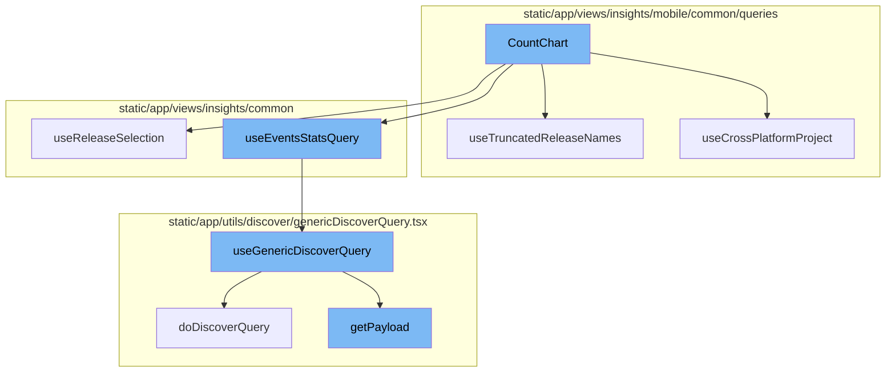
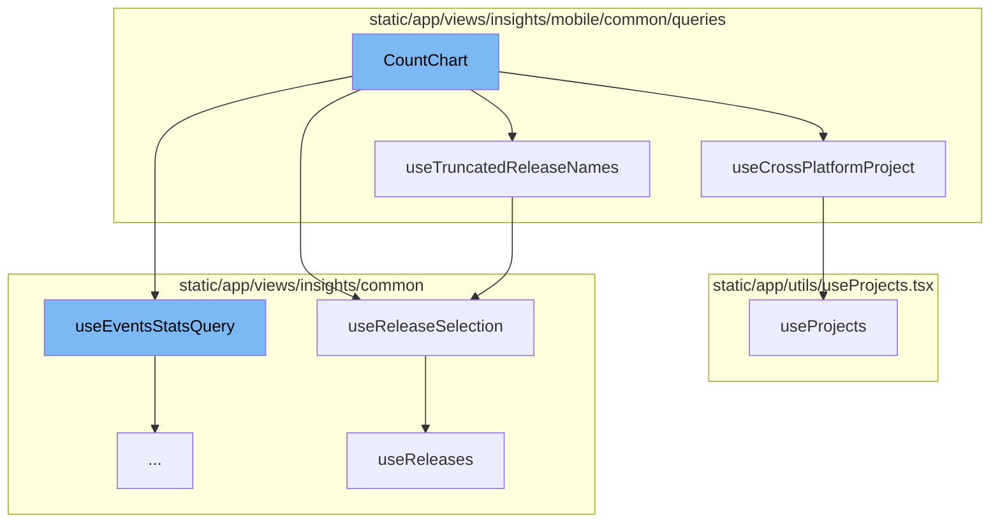
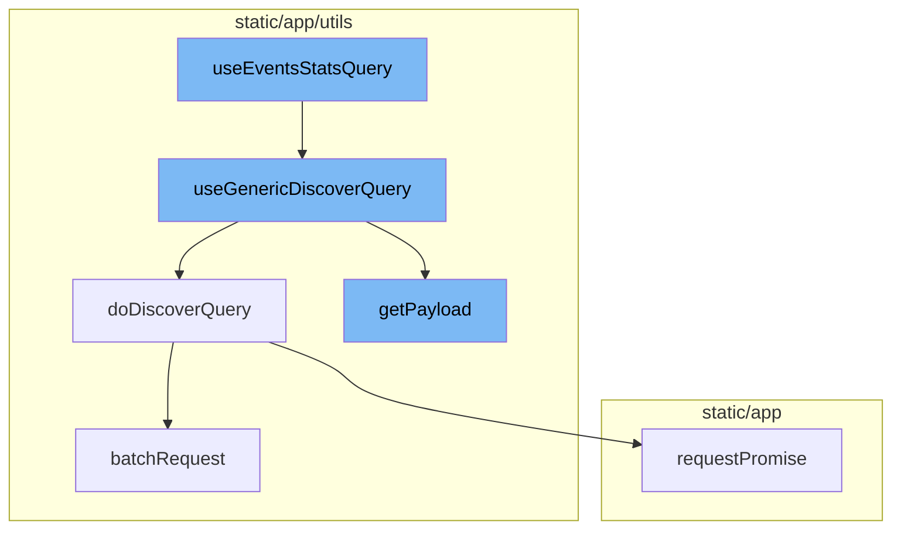

# CountChart Overview

CountChart is a component that renders a chart based on the count of events. It uses several hooks to gather the necessary data and conditions for the chart. The chart's height is passed as a prop.

## useTruncatedReleaseNames Hook

useTruncatedReleaseNames is a custom hook that truncates the release names to a specified length. It uses the useReleaseSelection hook to get the primary and secondary release names, and then truncates them.

## useReleaseSelection Hook

useReleaseSelection is a custom hook that provides the primary and secondary releases. It uses the useReleases hook to get the releases data and then determines the primary and secondary releases based on the data and location query.

## useCrossPlatformProject Hook

useCrossPlatformProject is a custom hook that provides information about the project's platform. It uses the usePageFilters and useProjects hooks to get the necessary data and then determines if the project is cross-platform and the selected platform.

## useProjects Hook

useProjects is a custom hook that provides the projects from the ProjectsStore. It also provides a way to select specific project slugs, and search for more projects that may not be in the project store.

## useReleases Hook

useReleases is a custom hook that provides the releases data. It uses the useApiQuery hook to get the releases data from the API and then processes the data to provide the releases stats.

## useEventsStatsQuery Function

The useEventsStatsQuery function is the starting point of the CountChart flow. It prepares the necessary parameters and calls the useGenericDiscoverQuery function. The parameters include event view details, location, organization slug, and request payload. The function returns the result of the useGenericDiscoverQuery function, which includes the data and loading status.

## useGenericDiscoverQuery Function

The useGenericDiscoverQuery function is a generic function for making API requests to the Discover endpoint. It prepares the API payload by calling the getPayload function and makes the API request by calling the doDiscoverQuery function. The function returns the response data, error, status code, and response metadata.

## doDiscoverQuery Function

The doDiscoverQuery function makes the actual API request. If the queryBatching option is provided, it calls the batchRequest function. Otherwise, it makes the API request directly. The function implements a retry mechanism for failed requests.

## getPayload Function

The getPayload function prepares the API payload based on the provided props. It either calls the getRequestPayload function or the getEventsAPIPayload function of the event view. It also includes additional parameters like cursor, limit, pagination, and referrer in the payload.



# Flow drill down

First, we'll zoom into this section of the flow:



<SwmSnippet path="/static/app/views/insights/mobile/appStarts/components/charts/countChart.tsx" line="63">

---

# CountChart Function

The `CountChart` function is a component that renders a chart based on the count of events. It uses several hooks to gather the necessary data and conditions for the chart. The chart's height is passed as a prop.

```tsx
export function CountChart({chartHeight}: Props) {
  const location = useLocation();
  const pageFilter = usePageFilters();
  const {
    primaryRelease,
    secondaryRelease,
    isLoading: isReleasesLoading,
  } = useReleaseSelection();
  const {isProjectCrossPlatform, selectedPlatform} = useCrossPlatformProject();

  const appStartType =
    decodeScalar(location.query[SpanMetricsField.APP_START_TYPE]) ?? COLD_START_TYPE;

  const query = new MutableSearch([`span.op:app.start.${appStartType}`]);

  if (isProjectCrossPlatform) {
    query.addFilterValue('os.name', selectedPlatform);
  }

  const queryString = `${appendReleaseFilters(
    query,
```

---

</SwmSnippet>

<SwmSnippet path="/static/app/views/insights/mobile/common/queries/useTruncatedRelease.tsx" line="5">

---

## useTruncatedReleaseNames Hook

`useTruncatedReleaseNames` is a custom hook that truncates the release names to a specified length. It uses the `useReleaseSelection` hook to get the primary and secondary release names, and then truncates them.

```tsx
function useTruncatedReleaseNames(truncation?: number) {
  const {primaryRelease, secondaryRelease} = useReleaseSelection();

  const truncatedPrimaryRelease = formatVersionAndCenterTruncate(
    primaryRelease ?? '',
    truncation ?? MAX_CHART_RELEASE_CHARS
  );
  const truncatedSecondaryRelease = formatVersionAndCenterTruncate(
    secondaryRelease ?? '',
    truncation ?? MAX_CHART_RELEASE_CHARS
  );

  return {truncatedPrimaryRelease, truncatedSecondaryRelease};
}
```

---

</SwmSnippet>

<SwmSnippet path="/static/app/views/insights/common/queries/useReleases.tsx" line="116">

---

## useReleaseSelection Hook

`useReleaseSelection` is a custom hook that provides the primary and secondary releases. It uses the `useReleases` hook to get the releases data and then determines the primary and secondary releases based on the data and location query.

```tsx
export function useReleaseSelection(): {
  isLoading: boolean;
  primaryRelease: string | undefined;
  secondaryRelease: string | undefined;
} {
  const location = useLocation();

  const {data: releases, isLoading} = useReleases();

  // If there are more than 1 release, the first one should be the older one
  const primaryRelease =
    decodeScalar(location.query.primaryRelease) ??
    (releases && releases.length > 1 ? releases?.[1]?.version : releases?.[0]?.version);

  // If there are more than 1 release, the second one should be the newest one
  const secondaryRelease =
    decodeScalar(location.query.secondaryRelease) ??
    (releases && releases.length > 1 ? releases?.[0]?.version : undefined);

  return {primaryRelease, secondaryRelease, isLoading};
}
```

---

</SwmSnippet>

<SwmSnippet path="/static/app/views/insights/mobile/common/queries/useCrossPlatformProject.tsx" line="13">

---

## useCrossPlatformProject Hook

`useCrossPlatformProject` is a custom hook that provides information about the project's platform. It uses the `usePageFilters` and `useProjects` hooks to get the necessary data and then determines if the project is cross-platform and the selected platform.

```tsx
function useCrossPlatformProject() {
  const {selection} = usePageFilters();
  const {projects} = useProjects();
  const location = useLocation();

  const project = useMemo(() => {
    if (selection.projects.length !== 1) {
      return null;
    }

    return projects.find(p => p.id === String(selection.projects)) ?? null;
  }, [projects, selection.projects]);

  const isProjectCrossPlatform = useMemo(
    () => !!(project && isCrossPlatform(project)),
    [project]
  );

  const selectedPlatform =
    decodeScalar(location.query[PLATFORM_QUERY_PARAM]) ??
    localStorage.getItem(PLATFORM_LOCAL_STORAGE_KEY) ??
```

---

</SwmSnippet>

<SwmSnippet path="/static/app/utils/useProjects.tsx" line="141">

---

## useProjects Hook

`useProjects` is a custom hook that provides the projects from the ProjectsStore. It also provides a way to select specific project slugs, and search for more projects that may not be in the project store.

```tsx
/**
 * Provides projects from the ProjectsStore
 *
 * This hook also provides a way to select specific project slugs, and search
 * (type-ahead) for more projects that may not be in the project store.
 *
 * NOTE: Currently ALL projects are always loaded, but this hook is designed
 * for future-compat in a world where we do _not_ load all projects.
 */
function useProjects({limit, slugs, orgId: propOrgId}: Options = {}) {
  const api = useApi();

  const organization = useOrganization({allowNull: true});
  const store = useLegacyStore(ProjectsStore);

  const orgId = propOrgId ?? organization?.slug ?? organization?.slug;

  const storeSlugs = new Set(store.projects.map(t => t.slug));
  const slugsToLoad = slugs?.filter(slug => !storeSlugs.has(slug)) ?? [];
  const shouldLoadSlugs = slugsToLoad.length > 0;

```

---

</SwmSnippet>

<SwmSnippet path="/static/app/views/insights/common/queries/useReleases.tsx" line="116">

---

## useReleaseSelection Hook (Revisited)

`useReleaseSelection` is revisited here to provide the primary and secondary releases for the `useTruncatedReleaseNames` hook.

```tsx
export function useReleaseSelection(): {
  isLoading: boolean;
  primaryRelease: string | undefined;
  secondaryRelease: string | undefined;
} {
  const location = useLocation();

  const {data: releases, isLoading} = useReleases();

  // If there are more than 1 release, the first one should be the older one
  const primaryRelease =
    decodeScalar(location.query.primaryRelease) ??
    (releases && releases.length > 1 ? releases?.[1]?.version : releases?.[0]?.version);

  // If there are more than 1 release, the second one should be the newest one
  const secondaryRelease =
    decodeScalar(location.query.secondaryRelease) ??
    (releases && releases.length > 1 ? releases?.[0]?.version : undefined);

  return {primaryRelease, secondaryRelease, isLoading};
}
```

---

</SwmSnippet>

<SwmSnippet path="/static/app/views/insights/common/queries/useReleases.tsx" line="17">

---

## useReleases Hook

`useReleases` is a custom hook that provides the releases data. It uses the `useApiQuery` hook to get the releases data from the API and then processes the data to provide the releases stats.

```tsx
export function useReleases(searchTerm?: string) {
  const organization = useOrganization();
  const location = useLocation();
  const {selection, isReady} = usePageFilters();
  const {environments, projects} = selection;
  const api = useApi();

  const releaseResults = useApiQuery<Release[]>(
    [
      `/organizations/${organization.slug}/releases/`,
      {
        query: {
          project: projects,
          per_page: 50,
          environment: environments,
          query: searchTerm,
          sort: 'date',
        },
      },
    ],
    {staleTime: Infinity, enabled: isReady, retry: false}
```

---

</SwmSnippet>

<SwmSnippet path="/static/app/views/insights/mobile/common/queries/useTruncatedRelease.tsx" line="5">

---

## useTruncatedReleaseNames Hook (Revisited)

`useTruncatedReleaseNames` is revisited here to provide the truncated primary and secondary releases for the chart title and subtitle.

```tsx
function useTruncatedReleaseNames(truncation?: number) {
  const {primaryRelease, secondaryRelease} = useReleaseSelection();

  const truncatedPrimaryRelease = formatVersionAndCenterTruncate(
    primaryRelease ?? '',
    truncation ?? MAX_CHART_RELEASE_CHARS
  );
  const truncatedSecondaryRelease = formatVersionAndCenterTruncate(
    secondaryRelease ?? '',
    truncation ?? MAX_CHART_RELEASE_CHARS
  );

  return {truncatedPrimaryRelease, truncatedSecondaryRelease};
}
```

---

</SwmSnippet>

Now, lets zoom into this section of the flow:



<SwmSnippet path="/static/app/views/insights/common/utils/useEventsStatsQuery.tsx" line="13">

---

# useEventsStatsQuery

The `useEventsStatsQuery` function is the starting point of the CountChart flow. It prepares the necessary parameters and calls the `useGenericDiscoverQuery` function. The parameters include event view details, location, organization slug, and request payload. The function returns the result of the `useGenericDiscoverQuery` function, which includes the data and loading status.

```tsx
export function useEventsStatsQuery({
  eventView,
  enabled,
  referrer,
  initialData,
  excludeOther = false,
}: {
  eventView: EventView;
  enabled?: boolean;
  excludeOther?: boolean;
  initialData?: MultiSeriesEventsStats;
  referrer?: string;
}) {
  const location = useLocation();
  const organization = useOrganization();
  const result = useGenericDiscoverQuery<MultiSeriesEventsStats, DiscoverQueryProps>({
    route: 'events-stats',
    eventView,
    location,
    orgSlug: organization.slug,
    getRequestPayload: () => ({
```

---

</SwmSnippet>

<SwmSnippet path="/static/app/utils/discover/genericDiscoverQuery.tsx" line="419">

---

# useGenericDiscoverQuery

The `useGenericDiscoverQuery` function is a generic function for making API requests to the Discover endpoint. It prepares the API payload by calling the `getPayload` function and makes the API request by calling the `doDiscoverQuery` function. The function returns the response data, error, status code, and response metadata.

```tsx
export function useGenericDiscoverQuery<T, P>(props: Props<T, P>) {
  const api = useApi();
  const {orgSlug, route, options} = props;
  const url = `/organizations/${orgSlug}/${route}/`;
  const apiPayload = getPayload<T, P>(props);

  const res = useQuery<[T, string | undefined, ResponseMeta<T> | undefined], QueryError>(
    [route, apiPayload],
    ({signal: _signal}) =>
      doDiscoverQuery<T>(api, url, apiPayload, {
        queryBatching: props.queryBatching,
        skipAbort: props.skipAbort,
      }),
    options
  );

  return {
    ...res,
    data: res.data?.[0] ?? undefined,
    error: parseError(res.error),
    statusCode: res.data?.[1] ?? undefined,
```

---

</SwmSnippet>

<SwmSnippet path="/static/app/utils/discover/genericDiscoverQuery.tsx" line="337">

---

# doDiscoverQuery

The `doDiscoverQuery` function makes the actual API request. If the `queryBatching` option is provided, it calls the `batchRequest` function. Otherwise, it makes the API request directly. The function implements a retry mechanism for failed requests.

```tsx
export async function doDiscoverQuery<T>(
  api: Client,
  url: string,
  params: DiscoverQueryRequestParams,
  options: {
    queryBatching?: QueryBatching;
    retry?: RetryOptions;
    skipAbort?: boolean;
  } = {}
): Promise<[T, string | undefined, ResponseMeta<T> | undefined]> {
  const {queryBatching, retry, skipAbort} = options;
  if (queryBatching?.batchRequest) {
    return queryBatching.batchRequest(api, url, {
      query: params,
      includeAllArgs: true,
    });
  }

  const baseTimeout = retry?.baseTimeout ?? BASE_TIMEOUT;
  const timeoutMultiplier = retry?.timeoutMultiplier ?? TIMEOUT_MULTIPLIER;
  const statusCodes = retry?.statusCodes ?? [];
```

---

</SwmSnippet>

<SwmSnippet path="/static/app/utils/discover/genericDiscoverQuery.tsx" line="386">

---

# getPayload

The `getPayload` function prepares the API payload based on the provided props. It either calls the `getRequestPayload` function or the `getEventsAPIPayload` function of the event view. It also includes additional parameters like cursor, limit, pagination, and referrer in the payload.

```tsx
function getPayload<T, P>(props: Props<T, P>) {
  const {
    cursor,
    limit,
    noPagination,
    referrer,
    getRequestPayload,
    eventView,
    location,
    forceAppendRawQueryString,
  } = props;
  const payload = getRequestPayload
    ? getRequestPayload(props)
    : eventView.getEventsAPIPayload(location, forceAppendRawQueryString);

  if (cursor !== undefined) {
    payload.cursor = cursor;
  }
  if (limit) {
    payload.per_page = limit;
  }
```

---

</SwmSnippet>

&nbsp;

*This is an auto-generated document by Swimm AI 🌊 and has not yet been verified by a human*

<SwmMeta version="3.0.0" repo-id="Z2l0aHViJTNBJTNBc2VudHJ5LWRlbW8lM0ElM0FTd2ltbS1EZW1v" repo-name="sentry-demo" doc-type="flows"><sup>Powered by [Swimm](/)</sup></SwmMeta>
