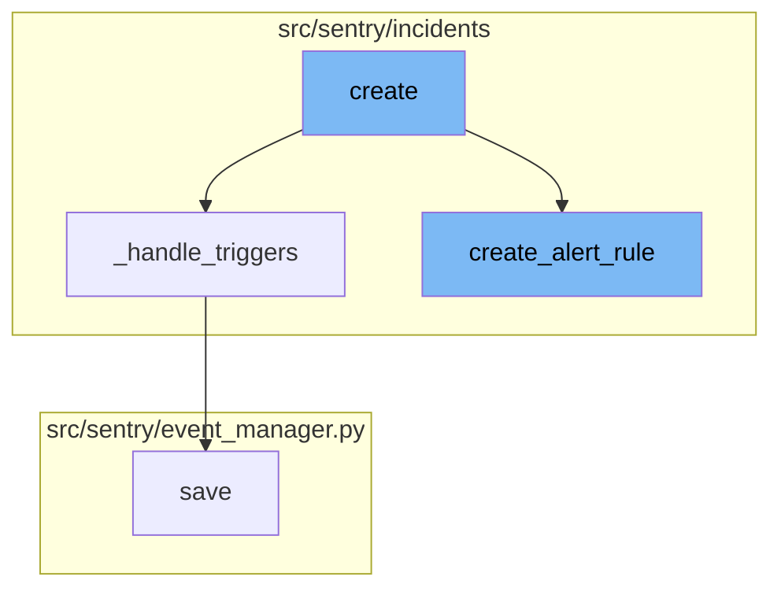

<SwmSnippet path="/src/sentry/incidents/serializers/alert_rule.py" line="467">

---

# Create Flow

The `create` function is the entry point of the flow. It validates the data, checks if the organization's subscription count exceeds the maximum limit, and initiates a database transaction. It then removes the 'triggers' from the validated data and calls the `create_alert_rule` function. After the alert rule is created, it handles the triggers using the `_handle_triggers` function and finally returns the alert rule.

```python
    def create(self, validated_data):
        org_subscription_count = QuerySubscription.objects.filter(
            project__organization_id=self.context["organization"].id,
            status__in=(
                QuerySubscription.Status.ACTIVE.value,
                QuerySubscription.Status.CREATING.value,
                QuerySubscription.Status.UPDATING.value,
            ),
        ).count()

        if org_subscription_count >= settings.MAX_QUERY_SUBSCRIPTIONS_PER_ORG:
            raise serializers.ValidationError(
                f"You may not exceed {settings.MAX_QUERY_SUBSCRIPTIONS_PER_ORG} metric alerts per organization"
            )
        with transaction.atomic(router.db_for_write(AlertRule)):
            triggers = validated_data.pop("triggers")
            alert_rule = create_alert_rule(
                user=self.context.get("user", None),
                organization=self.context["organization"],
                ip_address=self.context.get("ip_address"),
                **validated_data,
```

---

</SwmSnippet>

<SwmSnippet path="/src/sentry/incidents/logic.py" line="497">

---

# Create Alert Rule

The `create_alert_rule` function is responsible for creating an alert rule for an organization. It takes in various parameters like organization, projects, name, query, aggregate, time_window, threshold_type, threshold_period, and others. It validates the monitor type, calculates the resolution, creates a snuba query, and creates an alert rule. If the user is provided, it creates an audit entry. It also handles the case if all projects are included. Finally, it subscribes the projects to the alert rule, creates an alert rule activity, schedules an update project config, and returns the alert rule.

```python
def create_alert_rule(
    organization,
    projects,
    name,
    query,
    aggregate,
    time_window,
    threshold_type,
    threshold_period,
    owner: Actor | None = None,
    resolve_threshold=None,
    environment=None,
    include_all_projects=False,
    excluded_projects=None,
    query_type: SnubaQuery.Type = SnubaQuery.Type.ERROR,
    dataset=Dataset.Events,
    user=None,
    event_types=None,
    comparison_delta: int | None = None,
    monitor_type: AlertRuleMonitorTypeInt = AlertRuleMonitorTypeInt.CONTINUOUS,
    activation_condition: AlertRuleActivationConditionType | None = None,
```

---

</SwmSnippet>

<SwmSnippet path="/src/sentry/incidents/serializers/alert_rule.py" line="512">

---

# Handle Triggers

The `_handle_triggers` function is responsible for handling the triggers of an alert rule. It deletes the triggers that are not present in the incoming data and for each trigger data, it gets the trigger instance if it exists or sets it to None. It then validates the trigger serializer and saves it. If there's a channel lookup timeout error, it raises the error.

```python
    def _handle_triggers(self, alert_rule, triggers):
        channel_lookup_timeout_error = None
        if triggers is not None:
            # Delete triggers we don't have present in the incoming data
            trigger_ids = [x["id"] for x in triggers if "id" in x]
            triggers_to_delete = AlertRuleTrigger.objects.filter(alert_rule=alert_rule).exclude(
                id__in=trigger_ids
            )
            for trigger in triggers_to_delete:
                delete_alert_rule_trigger(trigger)

            for trigger_data in triggers:
                if "id" in trigger_data:
                    trigger_instance = AlertRuleTrigger.objects.get(
                        alert_rule=alert_rule, id=trigger_data["id"]
                    )
                else:
                    trigger_instance = None

                trigger_serializer = AlertRuleTriggerSerializer(
                    context={
```

---

</SwmSnippet>

<SwmSnippet path="/src/sentry/event_manager.py" line="442">

---

# Save Function

The `save` function is responsible for saving the event after normalizing and processing it. It saves adjacent models such as releases and environments to postgres and writes the event into the eventstream. It handles different types of events like transaction and generic. It also handles the case of duplicate event IDs that fall on the same day.

```python
    def save(
        self,
        project_id: int | None,
        raw: bool = False,
        assume_normalized: bool = False,
        start_time: float | None = None,
        cache_key: str | None = None,
        skip_send_first_transaction: bool = False,
        has_attachments: bool = False,
    ) -> Event:
        """
        After normalizing and processing an event, save adjacent models such as
        releases and environments to postgres and write the event into
        eventstream. From there it will be picked up by Snuba and
        post-processing.

        We re-insert events with duplicate IDs into Snuba, which is responsible
        for deduplicating events. Since deduplication in Snuba is on the primary
        key (based on event ID, project ID and day), events with same IDs are only
        deduplicated if their timestamps fall on the same day. The latest event
        always wins and overwrites the value of events received earlier in that day.
```

---

</SwmSnippet>

# Flow drill down



<SwmSnippet path="/src/sentry/incidents/serializers/alert_rule.py" line="467">

---

# Create Flow

The `create` function is the entry point of the flow. It validates the data, checks if the organization's subscription count exceeds the maximum limit, and initiates a database transaction. It then removes the 'triggers' from the validated data and calls the `create_alert_rule` function. After the alert rule is created, it handles the triggers using the `_handle_triggers` function and finally returns the alert rule.

```python
    def create(self, validated_data):
        org_subscription_count = QuerySubscription.objects.filter(
            project__organization_id=self.context["organization"].id,
            status__in=(
                QuerySubscription.Status.ACTIVE.value,
                QuerySubscription.Status.CREATING.value,
                QuerySubscription.Status.UPDATING.value,
            ),
        ).count()

        if org_subscription_count >= settings.MAX_QUERY_SUBSCRIPTIONS_PER_ORG:
            raise serializers.ValidationError(
                f"You may not exceed {settings.MAX_QUERY_SUBSCRIPTIONS_PER_ORG} metric alerts per organization"
            )
        with transaction.atomic(router.db_for_write(AlertRule)):
            triggers = validated_data.pop("triggers")
            alert_rule = create_alert_rule(
                user=self.context.get("user", None),
                organization=self.context["organization"],
                ip_address=self.context.get("ip_address"),
                **validated_data,
```

---

</SwmSnippet>

<SwmSnippet path="/src/sentry/incidents/logic.py" line="497">

---

# Create Alert Rule

The `create_alert_rule` function is responsible for creating an alert rule for an organization. It takes in various parameters like organization, projects, name, query, aggregate, time_window, threshold_type, threshold_period, and others. It validates the monitor type, calculates the resolution, creates a snuba query, and creates an alert rule. If the user is provided, it creates an audit entry. It also handles the case if all projects are included. Finally, it subscribes the projects to the alert rule, creates an alert rule activity, schedules an update project config, and returns the alert rule.

```python
def create_alert_rule(
    organization,
    projects,
    name,
    query,
    aggregate,
    time_window,
    threshold_type,
    threshold_period,
    owner: Actor | None = None,
    resolve_threshold=None,
    environment=None,
    include_all_projects=False,
    excluded_projects=None,
    query_type: SnubaQuery.Type = SnubaQuery.Type.ERROR,
    dataset=Dataset.Events,
    user=None,
    event_types=None,
    comparison_delta: int | None = None,
    monitor_type: AlertRuleMonitorTypeInt = AlertRuleMonitorTypeInt.CONTINUOUS,
    activation_condition: AlertRuleActivationConditionType | None = None,
```

---

</SwmSnippet>

<SwmSnippet path="/src/sentry/incidents/serializers/alert_rule.py" line="512">

---

# Handle Triggers

The `_handle_triggers` function is responsible for handling the triggers of an alert rule. It deletes the triggers that are not present in the incoming data and for each trigger data, it gets the trigger instance if it exists or sets it to None. It then validates the trigger serializer and saves it. If there's a channel lookup timeout error, it raises the error.

```python
    def _handle_triggers(self, alert_rule, triggers):
        channel_lookup_timeout_error = None
        if triggers is not None:
            # Delete triggers we don't have present in the incoming data
            trigger_ids = [x["id"] for x in triggers if "id" in x]
            triggers_to_delete = AlertRuleTrigger.objects.filter(alert_rule=alert_rule).exclude(
                id__in=trigger_ids
            )
            for trigger in triggers_to_delete:
                delete_alert_rule_trigger(trigger)

            for trigger_data in triggers:
                if "id" in trigger_data:
                    trigger_instance = AlertRuleTrigger.objects.get(
                        alert_rule=alert_rule, id=trigger_data["id"]
                    )
                else:
                    trigger_instance = None

                trigger_serializer = AlertRuleTriggerSerializer(
                    context={
```

---

</SwmSnippet>

<SwmSnippet path="/src/sentry/event_manager.py" line="442">

---

# Save Function

The `save` function is responsible for saving the event after normalizing and processing it. It saves adjacent models such as releases and environments to postgres and writes the event into the eventstream. It handles different types of events like transaction and generic. It also handles the case of duplicate event IDs that fall on the same day.

```python
    def save(
        self,
        project_id: int | None,
        raw: bool = False,
        assume_normalized: bool = False,
        start_time: float | None = None,
        cache_key: str | None = None,
        skip_send_first_transaction: bool = False,
        has_attachments: bool = False,
    ) -> Event:
        """
        After normalizing and processing an event, save adjacent models such as
        releases and environments to postgres and write the event into
        eventstream. From there it will be picked up by Snuba and
        post-processing.

        We re-insert events with duplicate IDs into Snuba, which is responsible
        for deduplicating events. Since deduplication in Snuba is on the primary
        key (based on event ID, project ID and day), events with same IDs are only
        deduplicated if their timestamps fall on the same day. The latest event
        always wins and overwrites the value of events received earlier in that day.
```

---

</SwmSnippet>

&nbsp;

*This is an auto-generated document by Swimm AI 🌊 and has not yet been verified by a human*

<SwmMeta version="3.0.0" repo-id="Z2l0aHViJTNBJTNBc2VudHJ5LWRlbW8lM0ElM0FTd2ltbS1EZW1v" repo-name="sentry-demo" doc-type="flows"><sup>Powered by [Swimm](/)</sup></SwmMeta>
