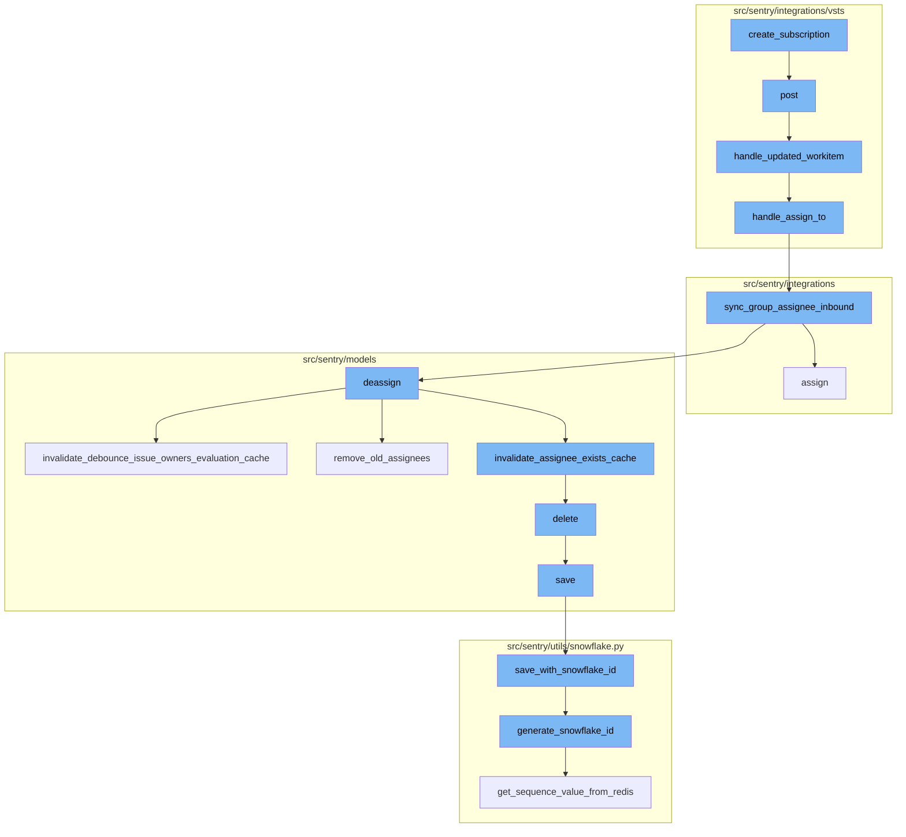
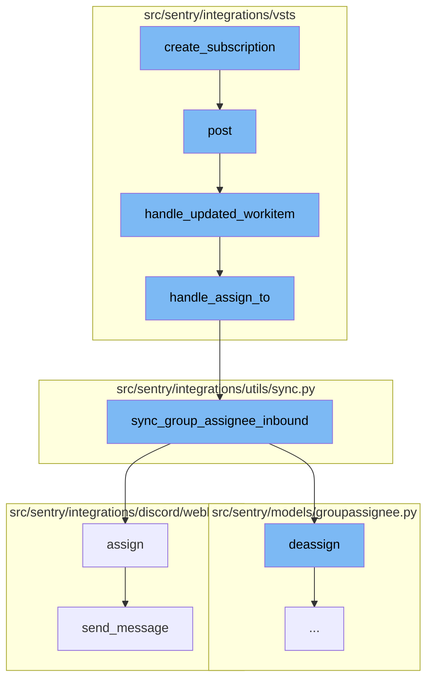
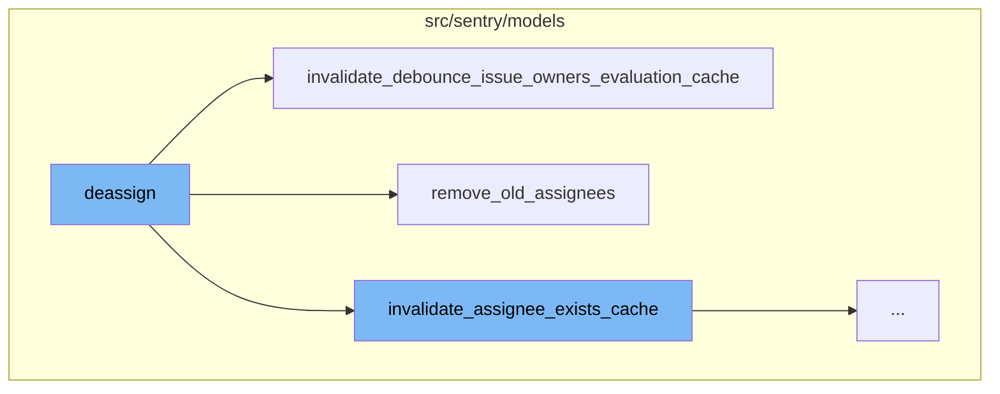
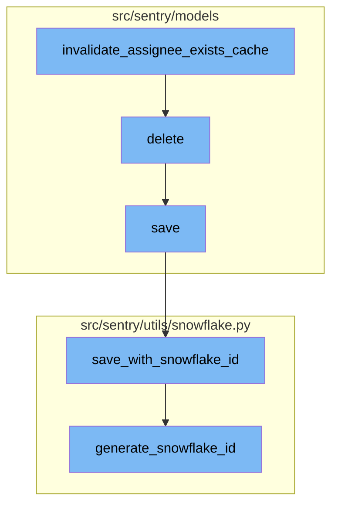

<SwmSnippet path="/src/sentry/integrations/vsts/client.py" line="117">

---

# Create Subscription

The `create_subscription` function is used to create a subscription with the VSTS API. It sends a POST request with the necessary data, including the event type and the URL for the webhook.

```python
    def create_subscription(self, shared_secret: str) -> Response:
        return self.post(
            VstsApiPath.subscriptions.format(instance=self.base_url),
            data={
                "publisherId": "tfs",
                "eventType": "workitem.updated",
                "resourceVersion": "1.0",
                "consumerId": "webHooks",
                "consumerActionId": "httpRequest",
                "consumerInputs": {
                    "url": absolute_uri("/extensions/vsts/issue-updated/"),
                    "resourceDetailsToSend": "all",
                    "httpHeaders": f"shared-secret:{shared_secret}",
                },
            },
        )
```

---

</SwmSnippet>

<SwmSnippet path="/src/sentry/integrations/vsts/webhooks.py" line="43">

---

# Post

The `post` function is the webhook endpoint that receives the event from VSTS. It validates the payload and if the event type is 'workitem.updated', it retrieves the integration and calls the `handle_updated_workitem` function.

```python
    def post(self, request: Request, *args: Any, **kwargs: Any) -> Response:
        try:
            data = request.data
            event_type = data["eventType"]
            external_id = get_vsts_external_id(data=request.data)
        except Exception as e:
            logger.info("vsts.invalid-webhook-payload", extra={"error": str(e)})
            return self.respond(status=status.HTTP_400_BAD_REQUEST)

        # https://docs.microsoft.com/en-us/azure/devops/service-hooks/events?view=azure-devops#workitem.updated
        if event_type == "workitem.updated":
            integration = integration_service.get_integration(
                provider=PROVIDER_KEY, external_id=external_id
            )
            if integration is None:
                logger.info(
                    "vsts.integration-in-webhook-payload-does-not-exist",
                    extra={"external_id": external_id, "event_type": event_type},
                )
                return self.respond(
                    {"detail": "Integration does not exist."}, status=status.HTTP_400_BAD_REQUEST
```

---

</SwmSnippet>

<SwmSnippet path="/src/sentry/integrations/vsts/webhooks.py" line="151">

---

# Handle Updated Workitem

The `handle_updated_workitem` function handles the event when a work item is updated in VSTS. It extracts the necessary information from the payload and calls the `handle_assign_to` function to handle the assignment of the work item.

```python
def handle_updated_workitem(data: Mapping[str, Any], integration: RpcIntegration) -> None:
    project: str | None = None
    try:
        external_issue_key = data["resource"]["workItemId"]
    except KeyError as e:
        logger.info(
            "vsts.updating-workitem-does-not-have-necessary-information",
            extra={"error": str(e), "integration_id": integration.id},
        )
        return

    try:
        project = data["resourceContainers"]["project"]["id"]
    except KeyError as e:
        logger.info(
            "vsts.updating-workitem-does-not-have-necessary-information",
            extra={"error": str(e), "integration_id": integration.id},
        )

    try:
        assigned_to = data["resource"]["fields"].get("System.AssignedTo")
```

---

</SwmSnippet>

<SwmSnippet path="/src/sentry/integrations/vsts/webhooks.py" line="89">

---

# Handle Assign To

The `handle_assign_to` function handles the assignment of the work item. It parses the new assignee from the payload and calls the `sync_group_assignee_inbound` function to sync the assignee with Sentry.

```python
def handle_assign_to(
    integration: RpcIntegration,
    external_issue_key: str | None,
    assigned_to: Mapping[str, str] | None,
) -> None:
    if not assigned_to:
        return

    email: str | None = None
    assign = False

    new_value = assigned_to.get("newValue")
    if new_value is not None:
        email = parse_email(new_value)
        if not email:
            logger.info(
                "vsts.failed-to-parse-email-in-handle-assign-to",
                extra={
                    "error": "parse_error",
                    "integration_id": integration.id,
                    "assigned_to_values": assigned_to,
```

---

</SwmSnippet>

<SwmSnippet path="/src/sentry/integrations/utils/sync.py" line="64">

---

# Sync Group Assignee Inbound

The `sync_group_assignee_inbound` function syncs the assignee of the work item with Sentry. If the assignee is to be unassigned, it calls the `deassign` function. Otherwise, it assigns the work item to the user in Sentry.

```python
def sync_group_assignee_inbound(
    integration: RpcIntegration,
    email: str | None,
    external_issue_key: str,
    assign: bool = True,
) -> Sequence[Group]:
    """
    Given an integration, user email address and an external issue key,
    assign linked groups to matching users. Checks project membership.
    Returns a list of groups that were successfully assigned.
    """

    logger = logging.getLogger(f"sentry.integrations.{integration.provider}")

    orgs_with_sync_enabled = where_should_sync(integration, "inbound_assignee")
    affected_groups = Group.objects.get_groups_by_external_issue(
        integration,
        orgs_with_sync_enabled,
        external_issue_key,
    )
    log_context = {
```

---

</SwmSnippet>

<SwmSnippet path="/src/sentry/integrations/discord/webhooks/message_component.py" line="137">

---

# Assign

The `assign` function is used to assign the work item to a user in Discord. It updates the group with the new assignee and sends a message to Discord to notify about the assignment.

```python
    def assign(self) -> Response:
        assignee = self.request.get_selected_options()[0]

        self.update_group(
            {
                "assignedTo": assignee,
                "integration": ActivityIntegration.DISCORD.value,
            }
        )

        logger.info(
            "discord.assign.dialog",
            extra={
                "assignee": assignee,
                "user": self.request.user,
            },
        )

        assert self.request.user is not None

        analytics.record(
```

---

</SwmSnippet>

<SwmSnippet path="/src/sentry/integrations/discord/webhooks/handler.py" line="24">

---

# Send Message

The `send_message` function is used to send a message to Discord. It can either send a new message or update an existing one.

```python
    def send_message(self, message: str | DiscordMessageBuilder, update: bool = False) -> Response:
        """Sends a new follow up message."""
        response_type = DiscordResponseTypes.UPDATE if update else DiscordResponseTypes.MESSAGE

        if isinstance(message, str):
            message = DiscordMessageBuilder(
                content=message, flags=DiscordMessageFlags().set_ephemeral()
            )
        return Response(
            {
                "type": response_type,
                "data": message.build(),
            },
            status=200,
        )
```

---

</SwmSnippet>

<SwmSnippet path="/src/sentry/models/groupassignee.py" line="197">

---

# Deassign

The `deassign` function is responsible for removing the assignment of a group. It first checks if there is a previous assignee for the group. If there is, it deletes the assignment and creates an activity log for the unassignment. It also clears the ownership cache for the deassigned group and syncs the Sentry assignee to external issues if the feature is enabled.

```python
    def deassign(
        self,
        group: Group,
        acting_user: User | RpcUser | None = None,
        assigned_to: Team | RpcUser | None = None,
        extra: dict[str, str] | None = None,
    ) -> None:
        from sentry.integrations.utils import sync_group_assignee_outbound
        from sentry.models.activity import Activity
        from sentry.models.projectownership import ProjectOwnership

        try:
            previous_groupassignee = self.get(group=group)
        except GroupAssignee.DoesNotExist:
            previous_groupassignee = None

        affected = self.filter(group=group)[:1].count()
        self.filter(group=group).delete()

        if affected > 0:
            Activity.objects.create_group_activity(group, ActivityType.UNASSIGNED, user=acting_user)
```

---

</SwmSnippet>

<SwmSnippet path="/src/sentry/models/groupowner.py" line="125">

---

# Invalidate Debounce Issue Owners Evaluation Cache

The `invalidate_debounce_issue_owners_evaluation_cache` function is called within the `deassign` function. It clears the debounce issue owners cache for the group. If a group ID is provided, it clears the cache for that group. Otherwise, it clears the cache for all groups in a project that had an event within a certain time window.

```python
    def invalidate_debounce_issue_owners_evaluation_cache(cls, project_id, group_id=None):
        """
        If `group_id` is provided, clear the debounce issue owners cache for that group, else clear
        the cache of all groups for a project that had an event within the
        ISSUE_OWNERS_DEBOUNCE_DURATION window.
        """
        if group_id:
            cache.delete(ISSUE_OWNERS_DEBOUNCE_KEY(group_id))
            return

        # Get all the groups for a project that had an event within the ISSUE_OWNERS_DEBOUNCE_DURATION window.
        # Any groups without events in that window would have expired their TTL in the cache.
        queryset = Group.objects.filter(
            project_id=project_id,
            last_seen__gte=timezone.now() - timedelta(seconds=ISSUE_OWNERS_DEBOUNCE_DURATION),
        ).values_list("id", flat=True)

        # Run cache invalidation in batches
        group_id_iter = queryset.iterator(chunk_size=1000)
        while True:
            group_ids = list(itertools.islice(group_id_iter, 1000))
```

---

</SwmSnippet>

<SwmSnippet path="/src/sentry/models/groupassignee.py" line="65">

---

# Remove Old Assignees

The `remove_old_assignees` function is also called within the `deassign` function. It removes the old assignees from the group. If the previous assignee was a team and the feature 'team-workflow-notifications' is enabled, it deletes the group subscription for the team. If the previous assignee was a user, it deletes the group subscription for the user.

```python
    def remove_old_assignees(
        self,
        group: Group,
        previous_assignee: GroupAssignee | None,
        new_assignee_id: int | None = None,
        new_assignee_type: str | None = None,
    ) -> None:
        from sentry.models.team import Team

        if not previous_assignee:
            return

        if (
            features.has("organizations:team-workflow-notifications", group.organization)
            and previous_assignee.team
        ):
            GroupSubscription.objects.filter(
                group=group,
                project=group.project,
                team=previous_assignee.team,
                reason=GroupSubscriptionReason.assigned,
```

---

</SwmSnippet>

<SwmSnippet path="/src/sentry/models/groupowner.py" line="152">

---

# Invalidate Assignee Exists Cache

The `invalidate_assignee_exists_cache` function is used to clear the assignee exists cache for a specific group or for all groups within a project that had an event within the `ASSIGNEE_EXISTS_DURATION` window. This is done in batches for efficiency.

```python
    def invalidate_assignee_exists_cache(cls, project_id, group_id=None):
        """
        If `group_id` is provided, clear the assignee exists cache for that group, else
        clear the cache of all groups for a project that had an event within the
        ASSIGNEE_EXISTS_DURATION window.
        """
        if group_id:
            cache.delete(ASSIGNEE_EXISTS_KEY(group_id))
            return

        # Get all the groups for a project that had an event within the ASSIGNEE_EXISTS_DURATION window.
        # Any groups without events in that window would have expired their TTL in the cache.
        queryset = Group.objects.filter(
            project_id=project_id,
            last_seen__gte=timezone.now() - timedelta(seconds=ASSIGNEE_EXISTS_DURATION),
        ).values_list("id", flat=True)

        # Run cache invalidation in batches
        group_id_iter = queryset.iterator(chunk_size=1000)
        while True:
            group_ids = list(itertools.islice(group_id_iter, 1000))
```

---

</SwmSnippet>

<SwmSnippet path="/src/sentry/models/project.py" line="722">

---

# Delete Project

The `delete` function is used to remove a project. It manually cascades the deletion due to the absence of a foreign key relationship. It also removes notification settings for the project.

```python
    def delete(self, **kwargs):
        # There is no foreign key relationship so we have to manually cascade.
        notifications_service.remove_notification_settings_for_project(project_id=self.id)

        with outbox_context(transaction.atomic(router.db_for_write(Project))):
            Project.outbox_for_update(self.id, self.organization_id).save()
            return super().delete(**kwargs)
```

---

</SwmSnippet>

<SwmSnippet path="/src/sentry/models/project.py" line="365">

---

# Save Project

The `save` function is used to save a project. If the project doesn't have a slug, it generates one. If the `SENTRY_USE_SNOWFLAKE` setting is enabled, it saves the project with a snowflake ID.

```python
    def save(self, *args, **kwargs):
        if not self.slug:
            lock = locks.get(
                f"slug:project:{self.organization_id}", duration=5, name="project_slug"
            )
            with TimedRetryPolicy(10)(lock.acquire):
                slugify_instance(
                    self,
                    self.name,
                    organization=self.organization,
                    reserved=RESERVED_PROJECT_SLUGS,
                    max_length=50,
                )

        if SENTRY_USE_SNOWFLAKE:
            snowflake_redis_key = "project_snowflake_key"
            save_with_snowflake_id(
                instance=self,
                snowflake_redis_key=snowflake_redis_key,
                save_callback=lambda: super(Project, self).save(*args, **kwargs),
            )
```

---

</SwmSnippet>

<SwmSnippet path="/src/sentry/utils/snowflake.py" line="47">

---

# Save with Snowflake ID

The `save_with_snowflake_id` function is used to save a model instance with a snowflake ID. It generates a new snowflake ID if the instance doesn't have one and then attempts to save the instance.

```python
def save_with_snowflake_id(
    instance: BaseModel, snowflake_redis_key: str, save_callback: Callable[[], object]
) -> None:
    assert uses_snowflake_id(
        instance.__class__
    ), "Only models decorated with uses_snowflake_id can be saved with save_with_snowflake_id()"

    for _ in range(settings.MAX_REDIS_SNOWFLAKE_RETRY_COUNTER):
        if not instance.id:
            instance.id = generate_snowflake_id(snowflake_redis_key)
        try:
            with enforce_constraints(transaction.atomic(using=router.db_for_write(type(instance)))):
                save_callback()
            return
        except IntegrityError:
            instance.id = None  # type: ignore[assignment]  # see typeddjango/django-stubs#2014
    raise MaxSnowflakeRetryError
```

---

</SwmSnippet>

<SwmSnippet path="/src/sentry/utils/snowflake.py" line="113">

---

# Generate Snowflake ID

The `generate_snowflake_id` function is used to generate a unique snowflake ID. It uses various segment values such as version ID, region ID, and time difference to generate the ID.

```python
def generate_snowflake_id(redis_key: str) -> int:
    segment_values = {}

    segment_values[VERSION_ID] = msb_0_ordering(settings.SNOWFLAKE_VERSION_ID, VERSION_ID.length)

    try:
        segment_values[REGION_ID] = get_local_region().snowflake_id
    except RegionContextError:  # expected if running in monolith mode
        segment_values[REGION_ID] = NULL_REGION_ID

    current_time = datetime.now().timestamp()
    # supports up to 130 years
    segment_values[TIME_DIFFERENCE] = int(current_time - settings.SENTRY_SNOWFLAKE_EPOCH_START)

    snowflake_id = 0
    (
        segment_values[TIME_DIFFERENCE],
        segment_values[REGION_SEQUENCE],
    ) = get_sequence_value_from_redis(redis_key, segment_values[TIME_DIFFERENCE])

    for segment in BIT_SEGMENT_SCHEMA:
```

---

</SwmSnippet>



# Flow drill down

First, we'll zoom into this section of the flow:



<SwmSnippet path="/src/sentry/integrations/vsts/client.py" line="117">

---

# create_subscription

The `create_subscription` function is used to create a subscription with the VSTS API. It sends a POST request with the necessary data, including the event type and the URL for the webhook.

```python
    def create_subscription(self, shared_secret: str) -> Response:
        return self.post(
            VstsApiPath.subscriptions.format(instance=self.base_url),
            data={
                "publisherId": "tfs",
                "eventType": "workitem.updated",
                "resourceVersion": "1.0",
                "consumerId": "webHooks",
                "consumerActionId": "httpRequest",
                "consumerInputs": {
                    "url": absolute_uri("/extensions/vsts/issue-updated/"),
                    "resourceDetailsToSend": "all",
                    "httpHeaders": f"shared-secret:{shared_secret}",
                },
            },
        )
```

---

</SwmSnippet>

<SwmSnippet path="/src/sentry/integrations/vsts/webhooks.py" line="43">

---

# post

The `post` function is the webhook endpoint that receives the event from VSTS. It validates the payload and if the event type is 'workitem.updated', it retrieves the integration and calls the `handle_updated_workitem` function.

```python
    def post(self, request: Request, *args: Any, **kwargs: Any) -> Response:
        try:
            data = request.data
            event_type = data["eventType"]
            external_id = get_vsts_external_id(data=request.data)
        except Exception as e:
            logger.info("vsts.invalid-webhook-payload", extra={"error": str(e)})
            return self.respond(status=status.HTTP_400_BAD_REQUEST)

        # https://docs.microsoft.com/en-us/azure/devops/service-hooks/events?view=azure-devops#workitem.updated
        if event_type == "workitem.updated":
            integration = integration_service.get_integration(
                provider=PROVIDER_KEY, external_id=external_id
            )
            if integration is None:
                logger.info(
                    "vsts.integration-in-webhook-payload-does-not-exist",
                    extra={"external_id": external_id, "event_type": event_type},
                )
                return self.respond(
                    {"detail": "Integration does not exist."}, status=status.HTTP_400_BAD_REQUEST
```

---

</SwmSnippet>

<SwmSnippet path="/src/sentry/integrations/vsts/webhooks.py" line="151">

---

# handle_updated_workitem

The `handle_updated_workitem` function handles the event when a work item is updated in VSTS. It extracts the necessary information from the payload and calls the `handle_assign_to` function to handle the assignment of the work item.

```python
def handle_updated_workitem(data: Mapping[str, Any], integration: RpcIntegration) -> None:
    project: str | None = None
    try:
        external_issue_key = data["resource"]["workItemId"]
    except KeyError as e:
        logger.info(
            "vsts.updating-workitem-does-not-have-necessary-information",
            extra={"error": str(e), "integration_id": integration.id},
        )
        return

    try:
        project = data["resourceContainers"]["project"]["id"]
    except KeyError as e:
        logger.info(
            "vsts.updating-workitem-does-not-have-necessary-information",
            extra={"error": str(e), "integration_id": integration.id},
        )

    try:
        assigned_to = data["resource"]["fields"].get("System.AssignedTo")
```

---

</SwmSnippet>

<SwmSnippet path="/src/sentry/integrations/vsts/webhooks.py" line="89">

---

# handle_assign_to

The `handle_assign_to` function handles the assignment of the work item. It parses the new assignee from the payload and calls the `sync_group_assignee_inbound` function to sync the assignee with Sentry.

```python
def handle_assign_to(
    integration: RpcIntegration,
    external_issue_key: str | None,
    assigned_to: Mapping[str, str] | None,
) -> None:
    if not assigned_to:
        return

    email: str | None = None
    assign = False

    new_value = assigned_to.get("newValue")
    if new_value is not None:
        email = parse_email(new_value)
        if not email:
            logger.info(
                "vsts.failed-to-parse-email-in-handle-assign-to",
                extra={
                    "error": "parse_error",
                    "integration_id": integration.id,
                    "assigned_to_values": assigned_to,
```

---

</SwmSnippet>

<SwmSnippet path="/src/sentry/integrations/utils/sync.py" line="64">

---

# sync_group_assignee_inbound

The `sync_group_assignee_inbound` function syncs the assignee of the work item with Sentry. If the assignee is to be unassigned, it calls the `deassign` function. Otherwise, it assigns the work item to the user in Sentry.

```python
def sync_group_assignee_inbound(
    integration: RpcIntegration,
    email: str | None,
    external_issue_key: str,
    assign: bool = True,
) -> Sequence[Group]:
    """
    Given an integration, user email address and an external issue key,
    assign linked groups to matching users. Checks project membership.
    Returns a list of groups that were successfully assigned.
    """

    logger = logging.getLogger(f"sentry.integrations.{integration.provider}")

    orgs_with_sync_enabled = where_should_sync(integration, "inbound_assignee")
    affected_groups = Group.objects.get_groups_by_external_issue(
        integration,
        orgs_with_sync_enabled,
        external_issue_key,
    )
    log_context = {
```

---

</SwmSnippet>

<SwmSnippet path="/src/sentry/integrations/discord/webhooks/message_component.py" line="137">

---

# assign

The `assign` function is used to assign the work item to a user in Discord. It updates the group with the new assignee and sends a message to Discord to notify about the assignment.

```python
    def assign(self) -> Response:
        assignee = self.request.get_selected_options()[0]

        self.update_group(
            {
                "assignedTo": assignee,
                "integration": ActivityIntegration.DISCORD.value,
            }
        )

        logger.info(
            "discord.assign.dialog",
            extra={
                "assignee": assignee,
                "user": self.request.user,
            },
        )

        assert self.request.user is not None

        analytics.record(
```

---

</SwmSnippet>

<SwmSnippet path="/src/sentry/integrations/discord/webhooks/handler.py" line="24">

---

# send_message

The `send_message` function is used to send a message to Discord. It can either send a new message or update an existing one.

```python
    def send_message(self, message: str | DiscordMessageBuilder, update: bool = False) -> Response:
        """Sends a new follow up message."""
        response_type = DiscordResponseTypes.UPDATE if update else DiscordResponseTypes.MESSAGE

        if isinstance(message, str):
            message = DiscordMessageBuilder(
                content=message, flags=DiscordMessageFlags().set_ephemeral()
            )
        return Response(
            {
                "type": response_type,
                "data": message.build(),
            },
            status=200,
        )
```

---

</SwmSnippet>

Now, lets zoom into this section of the flow:



<SwmSnippet path="/src/sentry/models/groupassignee.py" line="197">

---

# Deassign Function

The `deassign` function is responsible for removing the assignment of a group. It first checks if there is a previous assignee for the group. If there is, it deletes the assignment and creates an activity log for the unassignment. It also clears the ownership cache for the deassigned group and syncs the Sentry assignee to external issues if the feature is enabled.

```python
    def deassign(
        self,
        group: Group,
        acting_user: User | RpcUser | None = None,
        assigned_to: Team | RpcUser | None = None,
        extra: dict[str, str] | None = None,
    ) -> None:
        from sentry.integrations.utils import sync_group_assignee_outbound
        from sentry.models.activity import Activity
        from sentry.models.projectownership import ProjectOwnership

        try:
            previous_groupassignee = self.get(group=group)
        except GroupAssignee.DoesNotExist:
            previous_groupassignee = None

        affected = self.filter(group=group)[:1].count()
        self.filter(group=group).delete()

        if affected > 0:
            Activity.objects.create_group_activity(group, ActivityType.UNASSIGNED, user=acting_user)
```

---

</SwmSnippet>

<SwmSnippet path="/src/sentry/models/groupowner.py" line="125">

---

# Invalidate Debounce Issue Owners Evaluation Cache Function

The `invalidate_debounce_issue_owners_evaluation_cache` function is called within the `deassign` function. It clears the debounce issue owners cache for the group. If a group ID is provided, it clears the cache for that group. Otherwise, it clears the cache for all groups in a project that had an event within a certain time window.

```python
    def invalidate_debounce_issue_owners_evaluation_cache(cls, project_id, group_id=None):
        """
        If `group_id` is provided, clear the debounce issue owners cache for that group, else clear
        the cache of all groups for a project that had an event within the
        ISSUE_OWNERS_DEBOUNCE_DURATION window.
        """
        if group_id:
            cache.delete(ISSUE_OWNERS_DEBOUNCE_KEY(group_id))
            return

        # Get all the groups for a project that had an event within the ISSUE_OWNERS_DEBOUNCE_DURATION window.
        # Any groups without events in that window would have expired their TTL in the cache.
        queryset = Group.objects.filter(
            project_id=project_id,
            last_seen__gte=timezone.now() - timedelta(seconds=ISSUE_OWNERS_DEBOUNCE_DURATION),
        ).values_list("id", flat=True)

        # Run cache invalidation in batches
        group_id_iter = queryset.iterator(chunk_size=1000)
        while True:
            group_ids = list(itertools.islice(group_id_iter, 1000))
```

---

</SwmSnippet>

<SwmSnippet path="/src/sentry/models/groupassignee.py" line="65">

---

# Remove Old Assignees Function

The `remove_old_assignees` function is also called within the `deassign` function. It removes the old assignees from the group. If the previous assignee was a team and the feature 'team-workflow-notifications' is enabled, it deletes the group subscription for the team. If the previous assignee was a user, it deletes the group subscription for the user.

```python
    def remove_old_assignees(
        self,
        group: Group,
        previous_assignee: GroupAssignee | None,
        new_assignee_id: int | None = None,
        new_assignee_type: str | None = None,
    ) -> None:
        from sentry.models.team import Team

        if not previous_assignee:
            return

        if (
            features.has("organizations:team-workflow-notifications", group.organization)
            and previous_assignee.team
        ):
            GroupSubscription.objects.filter(
                group=group,
                project=group.project,
                team=previous_assignee.team,
                reason=GroupSubscriptionReason.assigned,
```

---

</SwmSnippet>

Now, lets zoom into this section of the flow:



<SwmSnippet path="/src/sentry/models/groupowner.py" line="152">

---

# Invalidate Assignee Exists Cache

The `invalidate_assignee_exists_cache` function is used to clear the assignee exists cache for a specific group or for all groups within a project that had an event within the `ASSIGNEE_EXISTS_DURATION` window. This is done in batches for efficiency.

```python
    def invalidate_assignee_exists_cache(cls, project_id, group_id=None):
        """
        If `group_id` is provided, clear the assignee exists cache for that group, else
        clear the cache of all groups for a project that had an event within the
        ASSIGNEE_EXISTS_DURATION window.
        """
        if group_id:
            cache.delete(ASSIGNEE_EXISTS_KEY(group_id))
            return

        # Get all the groups for a project that had an event within the ASSIGNEE_EXISTS_DURATION window.
        # Any groups without events in that window would have expired their TTL in the cache.
        queryset = Group.objects.filter(
            project_id=project_id,
            last_seen__gte=timezone.now() - timedelta(seconds=ASSIGNEE_EXISTS_DURATION),
        ).values_list("id", flat=True)

        # Run cache invalidation in batches
        group_id_iter = queryset.iterator(chunk_size=1000)
        while True:
            group_ids = list(itertools.islice(group_id_iter, 1000))
```

---

</SwmSnippet>

<SwmSnippet path="/src/sentry/models/project.py" line="722">

---

# Delete Project

The `delete` function is used to remove a project. It manually cascades the deletion due to the absence of a foreign key relationship. It also removes notification settings for the project.

```python
    def delete(self, **kwargs):
        # There is no foreign key relationship so we have to manually cascade.
        notifications_service.remove_notification_settings_for_project(project_id=self.id)

        with outbox_context(transaction.atomic(router.db_for_write(Project))):
            Project.outbox_for_update(self.id, self.organization_id).save()
            return super().delete(**kwargs)
```

---

</SwmSnippet>

<SwmSnippet path="/src/sentry/models/project.py" line="365">

---

# Save Project

The `save` function is used to save a project. If the project doesn't have a slug, it generates one. If the `SENTRY_USE_SNOWFLAKE` setting is enabled, it saves the project with a snowflake ID.

```python
    def save(self, *args, **kwargs):
        if not self.slug:
            lock = locks.get(
                f"slug:project:{self.organization_id}", duration=5, name="project_slug"
            )
            with TimedRetryPolicy(10)(lock.acquire):
                slugify_instance(
                    self,
                    self.name,
                    organization=self.organization,
                    reserved=RESERVED_PROJECT_SLUGS,
                    max_length=50,
                )

        if SENTRY_USE_SNOWFLAKE:
            snowflake_redis_key = "project_snowflake_key"
            save_with_snowflake_id(
                instance=self,
                snowflake_redis_key=snowflake_redis_key,
                save_callback=lambda: super(Project, self).save(*args, **kwargs),
            )
```

---

</SwmSnippet>

<SwmSnippet path="/src/sentry/utils/snowflake.py" line="47">

---

# Save with Snowflake ID

The `save_with_snowflake_id` function is used to save a model instance with a snowflake ID. It generates a new snowflake ID if the instance doesn't have one and then attempts to save the instance.

```python
def save_with_snowflake_id(
    instance: BaseModel, snowflake_redis_key: str, save_callback: Callable[[], object]
) -> None:
    assert uses_snowflake_id(
        instance.__class__
    ), "Only models decorated with uses_snowflake_id can be saved with save_with_snowflake_id()"

    for _ in range(settings.MAX_REDIS_SNOWFLAKE_RETRY_COUNTER):
        if not instance.id:
            instance.id = generate_snowflake_id(snowflake_redis_key)
        try:
            with enforce_constraints(transaction.atomic(using=router.db_for_write(type(instance)))):
                save_callback()
            return
        except IntegrityError:
            instance.id = None  # type: ignore[assignment]  # see typeddjango/django-stubs#2014
    raise MaxSnowflakeRetryError
```

---

</SwmSnippet>

<SwmSnippet path="/src/sentry/utils/snowflake.py" line="113">

---

# Generate Snowflake ID

The `generate_snowflake_id` function is used to generate a unique snowflake ID. It uses various segment values such as version ID, region ID, and time difference to generate the ID.

```python
def generate_snowflake_id(redis_key: str) -> int:
    segment_values = {}

    segment_values[VERSION_ID] = msb_0_ordering(settings.SNOWFLAKE_VERSION_ID, VERSION_ID.length)

    try:
        segment_values[REGION_ID] = get_local_region().snowflake_id
    except RegionContextError:  # expected if running in monolith mode
        segment_values[REGION_ID] = NULL_REGION_ID

    current_time = datetime.now().timestamp()
    # supports up to 130 years
    segment_values[TIME_DIFFERENCE] = int(current_time - settings.SENTRY_SNOWFLAKE_EPOCH_START)

    snowflake_id = 0
    (
        segment_values[TIME_DIFFERENCE],
        segment_values[REGION_SEQUENCE],
    ) = get_sequence_value_from_redis(redis_key, segment_values[TIME_DIFFERENCE])

    for segment in BIT_SEGMENT_SCHEMA:
```

---

</SwmSnippet>

&nbsp;

*This is an auto-generated document by Swimm AI 🌊 and has not yet been verified by a human*

<SwmMeta version="3.0.0" repo-id="Z2l0aHViJTNBJTNBc2VudHJ5LWRlbW8lM0ElM0FTd2ltbS1EZW1v" repo-name="sentry-demo" doc-type="flows"><sup>Powered by [Swimm](/)</sup></SwmMeta>
