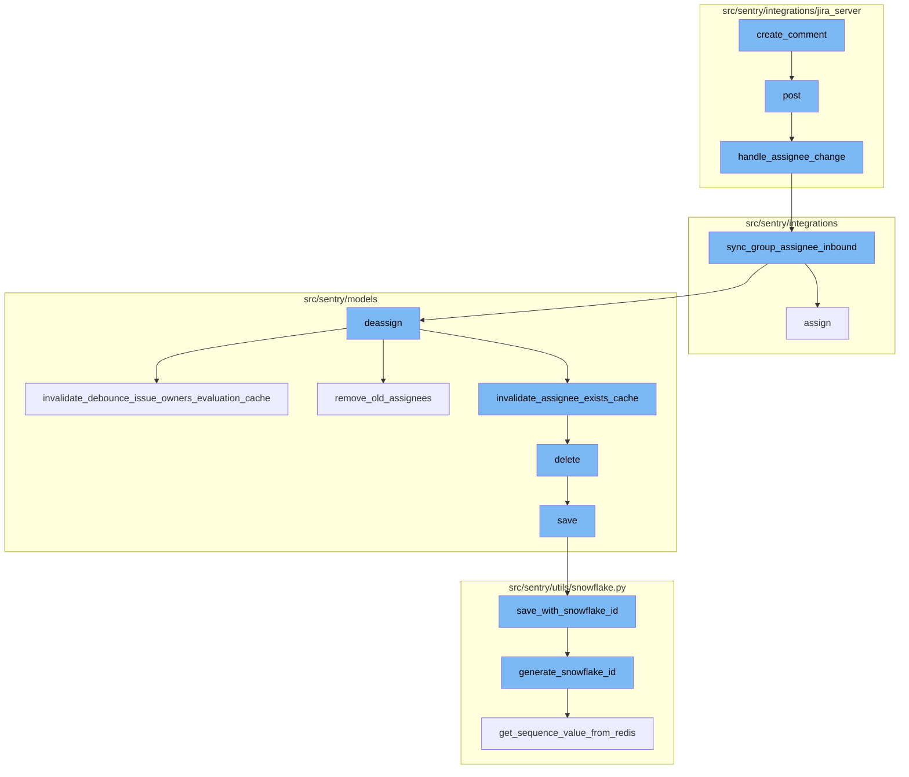
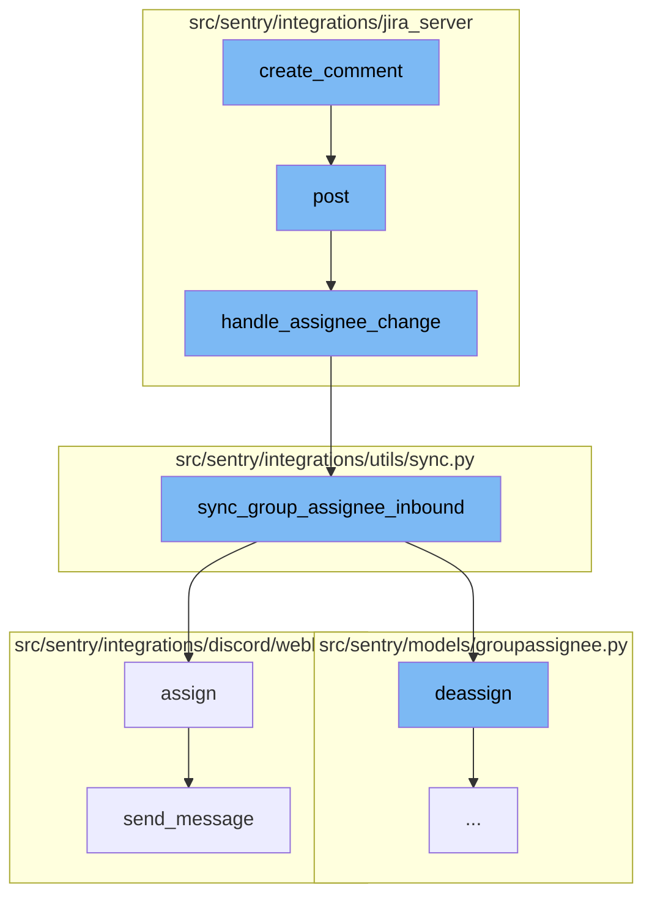
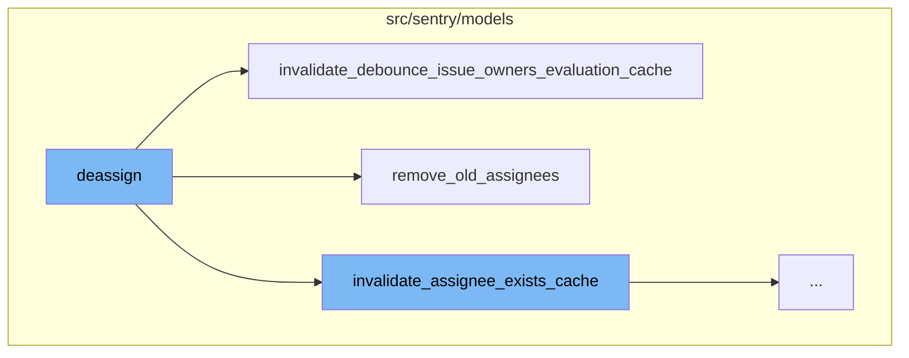
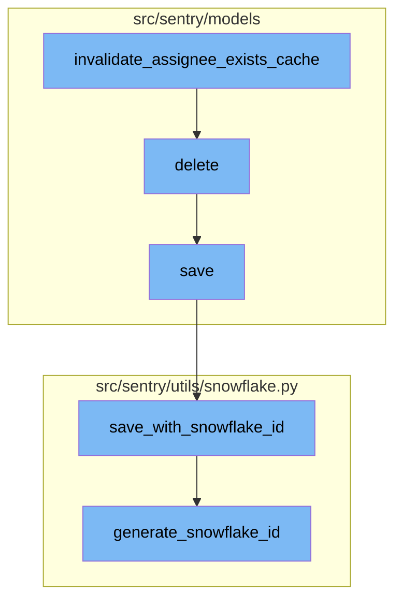

# Overview of 'create_comment' Process

The 'create_comment' process is a sequence of operations that allows users to create and post comments in the system. It starts with the 'create_comment' function, which initiates the creation of a new comment on a specific issue. This is followed by the 'post' function that handles the request to post the comment. If the assignee of the issue has changed, the 'handle_assignee_change' function is triggered to sync the group assignee inbound. The 'sync_group_assignee_inbound' function then assigns linked groups to matching users or deassigns the group if the assign parameter is set to False. The 'assign' function updates the group with the selected assignee and logs the assignment. Finally, the 'send_message' function sends a new follow-up message indicating that the assignee has been updated.

# Deassigning the Group

If the assign parameter in the 'sync_group_assignee_inbound' function is set to False, the 'deassign' function is triggered. This function is responsible for removing the assignment of a group. It first checks if there is a previous assignee for the group. If there is, it deletes the assignment and creates an activity log for the unassignment. It also invalidates the assignee cache for the group and debounces the issue owners evaluation cache.

# Saving the Project

The 'save' function is used to save a project. If the project does not have a slug, it generates one. If the 'SENTRY_USE_SNOWFLAKE' setting is enabled, it saves the project with a snowflake ID using the 'save_with_snowflake_id' function. Otherwise, it simply saves the project.

# Generating a Snowflake ID

The 'generate_snowflake_id' function is used to generate a snowflake ID. It first sets the segment values for the version ID and region ID. It then calculates the time difference from the 'SENTRY_SNOWFLAKE_EPOCH_START' setting and gets the sequence value from Redis. Finally, it validates and returns the generated snowflake ID.



# Flow drill down

First, we'll zoom into this section of the flow:



<SwmSnippet path="/src/sentry/integrations/jira_server/client.py" line="113">

---

# Creating a Comment

The `create_comment` function is used to create a new comment on a specific issue. It does this by making a POST request to the `COMMENTS_URL` with the issue key and the comment data.

```python
    def create_comment(self, issue_key, comment):
        return self.post(self.COMMENTS_URL % issue_key, data={"body": comment})
```

---

</SwmSnippet>

<SwmSnippet path="/src/sentry/integrations/jira_server/webhooks.py" line="63">

---

# Posting the Comment

The `post` function is responsible for handling the request to post the comment. It first clears any existing tags and context, then attempts to get the integration from the token. If the token is invalid, it logs a warning and returns a 400 response. If the token is valid, it proceeds to handle the assignee change.

```python
    def post(self, request: Request, token, *args, **kwargs) -> Response:
        clear_tags_and_context()
        extra = {}
        try:
            integration = get_integration_from_token(token)
            extra["integration_id"] = integration.id
        except ValueError as err:
            extra.update({"token": token, "error": str(err)})
            logger.warning("token-validation-error", extra=extra)
            metrics.incr("jira_server.webhook.invalid_token")
            return self.respond(status=400)

        data = request.data

        # Note: If we ever process more webhooks from jira server
        # we also need to update JiraServerRequestParser
        if not data.get("changelog"):
            logger.info("missing-changelog", extra=extra)
            return self.respond()

        try:
```

---

</SwmSnippet>

<SwmSnippet path="/src/sentry/integrations/jira_server/utils/api.py" line="25">

---

# Handling Assignee Change

The `handle_assignee_change` function checks if the assignee has changed. If the assignee has changed, it syncs the group assignee inbound. If there is no assignee, it assumes the issue was unassigned and syncs the group assignee inbound with assign set to False.

```python
def handle_assignee_change(
    integration: RpcIntegration | Integration,
    data: Mapping[str, Any],
) -> None:
    assignee_changed = any(
        item for item in data["changelog"]["items"] if item["field"] == "assignee"
    )
    if not assignee_changed:
        return

    fields = data["issue"]["fields"]

    # If there is no assignee, assume it was unassigned.
    assignee = fields.get("assignee")
    issue_key = data["issue"]["key"]

    if assignee is None:
        sync_group_assignee_inbound(integration, None, issue_key, assign=False)
        return

    email = get_assignee_email(integration, assignee)
```

---

</SwmSnippet>

<SwmSnippet path="/src/sentry/integrations/utils/sync.py" line="64">

---

# Syncing Group Assignee Inbound

The `sync_group_assignee_inbound` function assigns linked groups to matching users. If the assign parameter is set to False, it deassigns the group. Otherwise, it assigns the group to the user.

```python
def sync_group_assignee_inbound(
    integration: RpcIntegration,
    email: str | None,
    external_issue_key: str,
    assign: bool = True,
) -> Sequence[Group]:
    """
    Given an integration, user email address and an external issue key,
    assign linked groups to matching users. Checks project membership.
    Returns a list of groups that were successfully assigned.
    """

    logger = logging.getLogger(f"sentry.integrations.{integration.provider}")

    orgs_with_sync_enabled = where_should_sync(integration, "inbound_assignee")
    affected_groups = Group.objects.get_groups_by_external_issue(
        integration,
        orgs_with_sync_enabled,
        external_issue_key,
    )
    log_context = {
```

---

</SwmSnippet>

<SwmSnippet path="/src/sentry/integrations/discord/webhooks/message_component.py" line="137">

---

# Assigning the Group

The `assign` function updates the group with the selected assignee and logs the assignment. It then sends a message indicating that the assignee has been updated.

```python
    def assign(self) -> Response:
        assignee = self.request.get_selected_options()[0]

        self.update_group(
            {
                "assignedTo": assignee,
                "integration": ActivityIntegration.DISCORD.value,
            }
        )

        logger.info(
            "discord.assign.dialog",
            extra={
                "assignee": assignee,
                "user": self.request.user,
            },
        )

        assert self.request.user is not None

        analytics.record(
```

---

</SwmSnippet>

<SwmSnippet path="/src/sentry/integrations/discord/webhooks/handler.py" line="24">

---

# Sending the Message

The `send_message` function sends a new follow-up message. If the update parameter is set to True, it updates the existing message. Otherwise, it sends a new message.

```python
    def send_message(self, message: str | DiscordMessageBuilder, update: bool = False) -> Response:
        """Sends a new follow up message."""
        response_type = DiscordResponseTypes.UPDATE if update else DiscordResponseTypes.MESSAGE

        if isinstance(message, str):
            message = DiscordMessageBuilder(
                content=message, flags=DiscordMessageFlags().set_ephemeral()
            )
        return Response(
            {
                "type": response_type,
                "data": message.build(),
            },
            status=200,
        )
```

---

</SwmSnippet>

Now, lets zoom into this section of the flow:



<SwmSnippet path="/src/sentry/models/groupassignee.py" line="197">

---

# Deassign Function

The `deassign` function is responsible for removing the assignment of a group. It first checks if there is a previous assignee for the group. If there is, it deletes the assignment and creates an activity log for the unassignment. It also invalidates the assignee cache for the group and debounces the issue owners evaluation cache.

```python
    def deassign(
        self,
        group: Group,
        acting_user: User | RpcUser | None = None,
        assigned_to: Team | RpcUser | None = None,
        extra: dict[str, str] | None = None,
    ) -> None:
        from sentry.integrations.utils import sync_group_assignee_outbound
        from sentry.models.activity import Activity
        from sentry.models.projectownership import ProjectOwnership

        try:
            previous_groupassignee = self.get(group=group)
        except GroupAssignee.DoesNotExist:
            previous_groupassignee = None

        affected = self.filter(group=group)[:1].count()
        self.filter(group=group).delete()

        if affected > 0:
            Activity.objects.create_group_activity(group, ActivityType.UNASSIGNED, user=acting_user)
```

---

</SwmSnippet>

<SwmSnippet path="/src/sentry/models/groupowner.py" line="125">

---

# Invalidate Debounce Issue Owners Evaluation Cache Function

The `invalidate_debounce_issue_owners_evaluation_cache` function is called within the `deassign` function. It clears the debounce issue owners cache for the group. If a group id is provided, it clears the cache for that group. Otherwise, it clears the cache for all groups in a project that had an event within a certain time window.

```python
    def invalidate_debounce_issue_owners_evaluation_cache(cls, project_id, group_id=None):
        """
        If `group_id` is provided, clear the debounce issue owners cache for that group, else clear
        the cache of all groups for a project that had an event within the
        ISSUE_OWNERS_DEBOUNCE_DURATION window.
        """
        if group_id:
            cache.delete(ISSUE_OWNERS_DEBOUNCE_KEY(group_id))
            return

        # Get all the groups for a project that had an event within the ISSUE_OWNERS_DEBOUNCE_DURATION window.
        # Any groups without events in that window would have expired their TTL in the cache.
        queryset = Group.objects.filter(
            project_id=project_id,
            last_seen__gte=timezone.now() - timedelta(seconds=ISSUE_OWNERS_DEBOUNCE_DURATION),
        ).values_list("id", flat=True)

        # Run cache invalidation in batches
        group_id_iter = queryset.iterator(chunk_size=1000)
        while True:
            group_ids = list(itertools.islice(group_id_iter, 1000))
```

---

</SwmSnippet>

<SwmSnippet path="/src/sentry/models/groupassignee.py" line="65">

---

# Remove Old Assignees Function

The `remove_old_assignees` function is also called within the `deassign` function. It removes the old assignees of a group. If the previous assignee is a team and the organization has team workflow notifications enabled, it deletes the group subscription for the team. If the previous assignee is a user, it deletes the group subscription for the user.

```python
    def remove_old_assignees(
        self,
        group: Group,
        previous_assignee: GroupAssignee | None,
        new_assignee_id: int | None = None,
        new_assignee_type: str | None = None,
    ) -> None:
        from sentry.models.team import Team

        if not previous_assignee:
            return

        if (
            features.has("organizations:team-workflow-notifications", group.organization)
            and previous_assignee.team
        ):
            GroupSubscription.objects.filter(
                group=group,
                project=group.project,
                team=previous_assignee.team,
                reason=GroupSubscriptionReason.assigned,
```

---

</SwmSnippet>

Now, lets zoom into this section of the flow:



<SwmSnippet path="/src/sentry/models/groupowner.py" line="152">

---

# Invalidate Assignee Exists Cache

The `invalidate_assignee_exists_cache` function is responsible for clearing the assignee exists cache. If a specific `group_id` is provided, it clears the cache for that group. Otherwise, it clears the cache for all groups in a project that had an event within the `ASSIGNEE_EXISTS_DURATION` window.

```python
    def invalidate_assignee_exists_cache(cls, project_id, group_id=None):
        """
        If `group_id` is provided, clear the assignee exists cache for that group, else
        clear the cache of all groups for a project that had an event within the
        ASSIGNEE_EXISTS_DURATION window.
        """
        if group_id:
            cache.delete(ASSIGNEE_EXISTS_KEY(group_id))
            return

        # Get all the groups for a project that had an event within the ASSIGNEE_EXISTS_DURATION window.
        # Any groups without events in that window would have expired their TTL in the cache.
        queryset = Group.objects.filter(
            project_id=project_id,
            last_seen__gte=timezone.now() - timedelta(seconds=ASSIGNEE_EXISTS_DURATION),
        ).values_list("id", flat=True)

        # Run cache invalidation in batches
        group_id_iter = queryset.iterator(chunk_size=1000)
        while True:
            group_ids = list(itertools.islice(group_id_iter, 1000))
```

---

</SwmSnippet>

<SwmSnippet path="/src/sentry/models/project.py" line="722">

---

# Delete Project

The `delete` function is used to delete a project. It first removes the notification settings for the project and then saves the project's outbox for update before deleting the project.

```python
    def delete(self, **kwargs):
        # There is no foreign key relationship so we have to manually cascade.
        notifications_service.remove_notification_settings_for_project(project_id=self.id)

        with outbox_context(transaction.atomic(router.db_for_write(Project))):
            Project.outbox_for_update(self.id, self.organization_id).save()
            return super().delete(**kwargs)
```

---

</SwmSnippet>

<SwmSnippet path="/src/sentry/models/project.py" line="365">

---

# Save Project

The `save` function is used to save a project. If the project does not have a slug, it generates one. If the `SENTRY_USE_SNOWFLAKE` setting is enabled, it saves the project with a snowflake ID using the `save_with_snowflake_id` function. Otherwise, it simply saves the project.

```python
    def save(self, *args, **kwargs):
        if not self.slug:
            lock = locks.get(
                f"slug:project:{self.organization_id}", duration=5, name="project_slug"
            )
            with TimedRetryPolicy(10)(lock.acquire):
                slugify_instance(
                    self,
                    self.name,
                    organization=self.organization,
                    reserved=RESERVED_PROJECT_SLUGS,
                    max_length=50,
                )

        if SENTRY_USE_SNOWFLAKE:
            snowflake_redis_key = "project_snowflake_key"
            save_with_snowflake_id(
                instance=self,
                snowflake_redis_key=snowflake_redis_key,
                save_callback=lambda: super(Project, self).save(*args, **kwargs),
            )
```

---

</SwmSnippet>

<SwmSnippet path="/src/sentry/utils/snowflake.py" line="47">

---

# Save with Snowflake ID

The `save_with_snowflake_id` function is used to save a model instance with a snowflake ID. It generates a new snowflake ID if the instance does not have one and then tries to save the instance. If an `IntegrityError` occurs, it resets the instance's ID and raises a `MaxSnowflakeRetryError`.

```python
def save_with_snowflake_id(
    instance: BaseModel, snowflake_redis_key: str, save_callback: Callable[[], object]
) -> None:
    assert uses_snowflake_id(
        instance.__class__
    ), "Only models decorated with uses_snowflake_id can be saved with save_with_snowflake_id()"

    for _ in range(settings.MAX_REDIS_SNOWFLAKE_RETRY_COUNTER):
        if not instance.id:
            instance.id = generate_snowflake_id(snowflake_redis_key)
        try:
            with enforce_constraints(transaction.atomic(using=router.db_for_write(type(instance)))):
                save_callback()
            return
        except IntegrityError:
            instance.id = None  # type: ignore[assignment]  # see typeddjango/django-stubs#2014
    raise MaxSnowflakeRetryError
```

---

</SwmSnippet>

<SwmSnippet path="/src/sentry/utils/snowflake.py" line="113">

---

# Generate Snowflake ID

The `generate_snowflake_id` function is used to generate a snowflake ID. It first sets the segment values for the version ID and region ID. It then calculates the time difference from the `SENTRY_SNOWFLAKE_EPOCH_START` setting and gets the sequence value from Redis. Finally, it validates and returns the generated snowflake ID.

```python
def generate_snowflake_id(redis_key: str) -> int:
    segment_values = {}

    segment_values[VERSION_ID] = msb_0_ordering(settings.SNOWFLAKE_VERSION_ID, VERSION_ID.length)

    try:
        segment_values[REGION_ID] = get_local_region().snowflake_id
    except RegionContextError:  # expected if running in monolith mode
        segment_values[REGION_ID] = NULL_REGION_ID

    current_time = datetime.now().timestamp()
    # supports up to 130 years
    segment_values[TIME_DIFFERENCE] = int(current_time - settings.SENTRY_SNOWFLAKE_EPOCH_START)

    snowflake_id = 0
    (
        segment_values[TIME_DIFFERENCE],
        segment_values[REGION_SEQUENCE],
    ) = get_sequence_value_from_redis(redis_key, segment_values[TIME_DIFFERENCE])

    for segment in BIT_SEGMENT_SCHEMA:
```

---

</SwmSnippet>

&nbsp;

*This is an auto-generated document by Swimm AI 🌊 and has not yet been verified by a human*

<SwmMeta version="3.0.0" repo-id="Z2l0aHViJTNBJTNBc2VudHJ5LWRlbW8lM0ElM0FTd2ltbS1EZW1v" repo-name="sentry-demo" doc-type="flows"><sup>Powered by [Swimm](/)</sup></SwmMeta>
