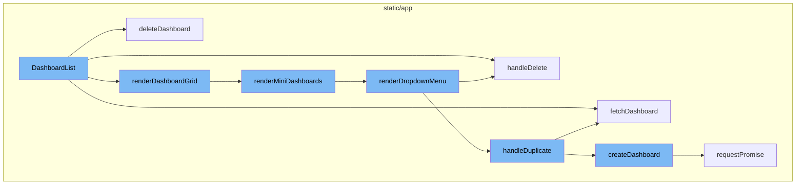
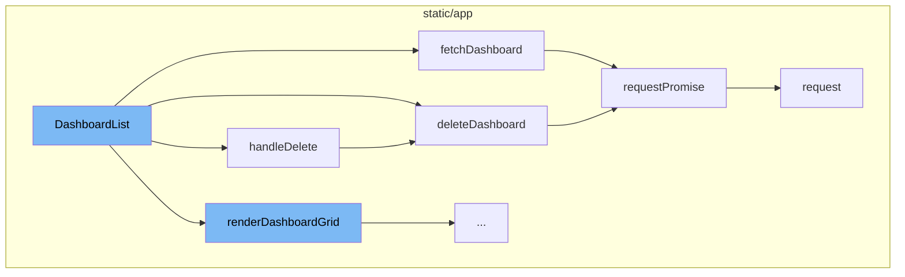
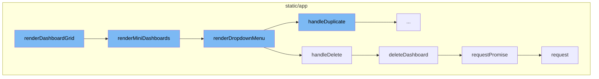
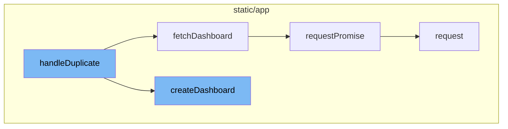

# DashboardList Overview

DashboardList is a key component in managing and rendering dashboards. It provides functionalities such as deleting, duplicating, and fetching dashboards. It also handles the rendering of the dashboard grid and the dropdown menu for each dashboard.

# Deleting a Dashboard

The deletion of a dashboard is handled by the `handleDelete` function. This function triggers the `deleteDashboard` function, which sends a DELETE request to the server to remove the selected dashboard.

# Fetching a Dashboard

The `fetchDashboard` function retrieves the details of a specific dashboard. It sends a GET request to the server and handles the response.

# Rendering the Dashboard Grid

The `renderDashboardGrid` function checks if there are any dashboards. If there are no dashboards, it displays a message. Otherwise, it calls the `renderMiniDashboards` function to render each dashboard.

# Rendering Mini Dashboards

The `renderMiniDashboards` function maps over the dashboards and returns a `DashboardCard` for each dashboard. It also calls the `renderDropdownMenu` function for each dashboard.

# Rendering the Dropdown Menu

The `renderDropdownMenu` function creates a dropdown menu for each dashboard with options to duplicate or delete the dashboard. It calls the `handleDuplicate` and `handleDelete` functions based on the user's selection.

# Duplicating a Dashboard

The `handleDuplicate` function is responsible for duplicating a dashboard. It first fetches the details of the dashboard to be duplicated using the `fetchDashboard` function. Then, it creates a new dashboard using the `createDashboard` function.

# Creating a Dashboard

The `createDashboard` function is used to create a new dashboard. It sends a POST request to the server with the new dashboard's details.

# API Request Handling

The `requestPromise` function is a utility function that handles API requests. It takes a path and options as parameters, creates a new Promise, and uses the `request` function to send the request. It handles both successful and error responses.



# Flow drill down

First, we'll zoom into this section of the flow:



<SwmSnippet path="/static/app/views/dashboards/manage/dashboardList.tsx" line="42">

---

# DashboardList Functionality

The `DashboardList` function is the main component that handles the rendering and management of dashboards. It includes several sub-functions that handle specific tasks such as deleting, duplicating, and fetching dashboards.

```tsx
function DashboardList({
  api,
  organization,
  location,
  dashboards,
  pageLinks,
  onDashboardsChange,
}: Props) {
  function handleDelete(dashboard: DashboardListItem) {
    deleteDashboard(api, organization.slug, dashboard.id)
      .then(() => {
        trackAnalytics('dashboards_manage.delete', {
          organization,
          dashboard_id: parseInt(dashboard.id, 10),
        });
        onDashboardsChange();
        addSuccessMessage(t('Dashboard deleted'));
      })
      .catch(() => {
        addErrorMessage(t('Error deleting Dashboard'));
      });
```

---

</SwmSnippet>

<SwmSnippet path="/static/app/views/dashboards/manage/dashboardList.tsx" line="50">

---

## Deleting a Dashboard

The `handleDelete` function is triggered when a user wants to delete a dashboard. It calls the `deleteDashboard` function, passing the necessary parameters, and handles the response, displaying success or error messages accordingly.

```tsx
  function handleDelete(dashboard: DashboardListItem) {
    deleteDashboard(api, organization.slug, dashboard.id)
      .then(() => {
        trackAnalytics('dashboards_manage.delete', {
          organization,
          dashboard_id: parseInt(dashboard.id, 10),
        });
        onDashboardsChange();
        addSuccessMessage(t('Dashboard deleted'));
      })
      .catch(() => {
        addErrorMessage(t('Error deleting Dashboard'));
      });
  }
```

---

</SwmSnippet>

<SwmSnippet path="/static/app/actionCreators/dashboards.tsx" line="173">

---

The `deleteDashboard` function makes an API request to delete a specific dashboard. It uses the `requestPromise` function from the API module to send a DELETE request to the server.

```tsx
export function deleteDashboard(
  api: Client,
  orgId: string,
  dashboardId: string
): Promise<undefined> {
  const promise: Promise<undefined> = api.requestPromise(
    `/organizations/${orgId}/dashboards/${dashboardId}/`,
    {
      method: 'DELETE',
    }
  );

  promise.catch(response => {
    const errorResponse = response?.responseJSON ?? null;

    if (errorResponse) {
      const errors = flattenErrors(errorResponse, {});
      addErrorMessage(errors[Object.keys(errors)[0]] as string);
    } else {
      addErrorMessage(t('Unable to delete dashboard'));
    }
```

---

</SwmSnippet>

<SwmSnippet path="/static/app/actionCreators/dashboards.tsx" line="100">

---

## Fetching a Dashboard

The `fetchDashboard` function is used to retrieve the details of a specific dashboard. It makes a GET request to the server using the `requestPromise` function from the API module.

```tsx
export function fetchDashboard(
  api: Client,
  orgId: string,
  dashboardId: string
): Promise<DashboardDetails> {
  const promise: Promise<DashboardDetails> = api.requestPromise(
    `/organizations/${orgId}/dashboards/${dashboardId}/`,
    {
      method: 'GET',
    }
  );

  promise.catch(response => {
    const errorResponse = response?.responseJSON ?? null;

    if (errorResponse) {
      const errors = flattenErrors(errorResponse, {});
      addErrorMessage(errors[Object.keys(errors)[0]] as string);
    } else {
      addErrorMessage(t('Unable to load dashboard'));
    }
```

---

</SwmSnippet>

<SwmSnippet path="/static/app/api.tsx" line="656">

---

## API Request Handling

The `requestPromise` function is a utility function that handles API requests. It takes a path and options as parameters, creates a new Promise, and uses the `request` function to send the request. It handles both successful and error responses.

```tsx
  requestPromise<IncludeAllArgsType extends boolean>(
    path: string,
    {
      includeAllArgs,
      ...options
    }: {includeAllArgs?: IncludeAllArgsType} & Readonly<RequestOptions> = {}
  ): Promise<IncludeAllArgsType extends true ? ApiResult : any> {
    // Create an error object here before we make any async calls so that we
    // have a helpful stack trace if it errors
    //
    // This *should* get logged to Sentry only if the promise rejection is not handled
    // (since SDK captures unhandled rejections). Ideally we explicitly ignore rejection
    // or handle with a user friendly error message
    const preservedError = new Error('API Request Error');

    return new Promise((resolve, reject) =>
      this.request(path, {
        ...options,
        preservedError,
        success: (data, textStatus, resp) => {
          if (includeAllArgs) {
```

---

</SwmSnippet>

Now, lets zoom into this section of the flow:



<SwmSnippet path="/static/app/views/dashboards/manage/dashboardList.tsx" line="153">

---

# DashboardList Flow

The `renderDashboardGrid` function checks if there are any dashboards. If there are no dashboards, it displays a message. Otherwise, it calls the `renderMiniDashboards` function.

```tsx
  function renderDashboardGrid() {
    if (!dashboards?.length) {
      return (
        <EmptyStateWarning>
          <p>{t('Sorry, no Dashboards match your filters.')}</p>
        </EmptyStateWarning>
      );
    }
    return <DashboardGrid>{renderMiniDashboards()}</DashboardGrid>;
  }
```

---

</SwmSnippet>

<SwmSnippet path="/static/app/views/dashboards/manage/dashboardList.tsx" line="131">

---

The `renderMiniDashboards` function maps over the dashboards and returns a `DashboardCard` for each dashboard. It also calls the `renderDropdownMenu` function for each dashboard.

```tsx
  function renderMiniDashboards() {
    return dashboards?.map((dashboard, index) => {
      return (
        <DashboardCard
          key={`${index}-${dashboard.id}`}
          title={dashboard.title}
          to={{
            pathname: `/organizations/${organization.slug}/dashboard/${dashboard.id}/`,
            query: {...location.query},
          }}
          detail={tn('%s widget', '%s widgets', dashboard.widgetPreview.length)}
          dateStatus={
            dashboard.dateCreated ? <TimeSince date={dashboard.dateCreated} /> : undefined
          }
          createdBy={dashboard.createdBy}
          renderWidgets={() => renderGridPreview(dashboard)}
          renderContextMenu={() => renderDropdownMenu(dashboard)}
        />
      );
    });
  }
```

---

</SwmSnippet>

<SwmSnippet path="/static/app/views/dashboards/manage/dashboardList.tsx" line="82">

---

The `renderDropdownMenu` function creates a dropdown menu for each dashboard with options to duplicate or delete the dashboard. It calls the `handleDuplicate` and `handleDelete` functions based on the user's selection.

```tsx
  function renderDropdownMenu(dashboard: DashboardListItem) {
    const menuItems: MenuItemProps[] = [
      {
        key: 'dashboard-duplicate',
        label: t('Duplicate'),
        onAction: () => handleDuplicate(dashboard),
      },
      {
        key: 'dashboard-delete',
        label: t('Delete'),
        priority: 'danger',
        onAction: () => {
          openConfirmModal({
            message: t('Are you sure you want to delete this dashboard?'),
            priority: 'danger',
            onConfirm: () => handleDelete(dashboard),
          });
        },
      },
    ];

```

---

</SwmSnippet>

<SwmSnippet path="/static/app/views/dashboards/manage/dashboardList.tsx" line="50">

---

The `handleDelete` function calls the `deleteDashboard` function to delete the selected dashboard.

```tsx
  function handleDelete(dashboard: DashboardListItem) {
    deleteDashboard(api, organization.slug, dashboard.id)
      .then(() => {
        trackAnalytics('dashboards_manage.delete', {
          organization,
          dashboard_id: parseInt(dashboard.id, 10),
        });
        onDashboardsChange();
        addSuccessMessage(t('Dashboard deleted'));
      })
      .catch(() => {
        addErrorMessage(t('Error deleting Dashboard'));
      });
  }
```

---

</SwmSnippet>

<SwmSnippet path="/static/app/actionCreators/dashboards.tsx" line="173">

---

The `deleteDashboard` function sends a DELETE request to the server to delete the selected dashboard. It uses the `requestPromise` function to send the request.

```tsx
export function deleteDashboard(
  api: Client,
  orgId: string,
  dashboardId: string
): Promise<undefined> {
  const promise: Promise<undefined> = api.requestPromise(
    `/organizations/${orgId}/dashboards/${dashboardId}/`,
    {
      method: 'DELETE',
    }
  );

  promise.catch(response => {
    const errorResponse = response?.responseJSON ?? null;

    if (errorResponse) {
      const errors = flattenErrors(errorResponse, {});
      addErrorMessage(errors[Object.keys(errors)[0]] as string);
    } else {
      addErrorMessage(t('Unable to delete dashboard'));
    }
```

---

</SwmSnippet>

<SwmSnippet path="/static/app/api.tsx" line="656">

---

The `requestPromise` function is a generic function to send requests to the server. It is used by the `deleteDashboard` function to send the DELETE request.

```tsx
  requestPromise<IncludeAllArgsType extends boolean>(
    path: string,
    {
      includeAllArgs,
      ...options
    }: {includeAllArgs?: IncludeAllArgsType} & Readonly<RequestOptions> = {}
  ): Promise<IncludeAllArgsType extends true ? ApiResult : any> {
    // Create an error object here before we make any async calls so that we
    // have a helpful stack trace if it errors
    //
    // This *should* get logged to Sentry only if the promise rejection is not handled
    // (since SDK captures unhandled rejections). Ideally we explicitly ignore rejection
    // or handle with a user friendly error message
    const preservedError = new Error('API Request Error');

    return new Promise((resolve, reject) =>
      this.request(path, {
        ...options,
        preservedError,
        success: (data, textStatus, resp) => {
          if (includeAllArgs) {
```

---

</SwmSnippet>

Now, lets zoom into this section of the flow:



<SwmSnippet path="/static/app/views/dashboards/manage/dashboardList.tsx" line="65">

---

# handleDuplicate Function

The `handleDuplicate` function is responsible for duplicating a dashboard. It first fetches the details of the dashboard to be duplicated using the `fetchDashboard` function. Then, it creates a new dashboard using the `createDashboard` function. If the duplication is successful, it triggers an analytics event and displays a success message. If an error occurs during the process, it displays an error message.

```tsx
  async function handleDuplicate(dashboard: DashboardListItem) {
    try {
      const dashboardDetail = await fetchDashboard(api, organization.slug, dashboard.id);
      const newDashboard = cloneDashboard(dashboardDetail);
      newDashboard.widgets.map(widget => (widget.id = undefined));
      await createDashboard(api, organization.slug, newDashboard, true);
      trackAnalytics('dashboards_manage.duplicate', {
        organization,
        dashboard_id: parseInt(dashboard.id, 10),
      });
      onDashboardsChange();
      addSuccessMessage(t('Dashboard duplicated'));
    } catch (e) {
      addErrorMessage(t('Error duplicating Dashboard'));
    }
  }
```

---

</SwmSnippet>

<SwmSnippet path="/static/app/actionCreators/dashboards.tsx" line="100">

---

# fetchDashboard Function

The `fetchDashboard` function is used to fetch the details of a specific dashboard. It makes a GET request to the dashboard's endpoint and returns a promise. If an error occurs during the request, it displays an error message.

```tsx
export function fetchDashboard(
  api: Client,
  orgId: string,
  dashboardId: string
): Promise<DashboardDetails> {
  const promise: Promise<DashboardDetails> = api.requestPromise(
    `/organizations/${orgId}/dashboards/${dashboardId}/`,
    {
      method: 'GET',
    }
  );

  promise.catch(response => {
    const errorResponse = response?.responseJSON ?? null;

    if (errorResponse) {
      const errors = flattenErrors(errorResponse, {});
      addErrorMessage(errors[Object.keys(errors)[0]] as string);
    } else {
      addErrorMessage(t('Unable to load dashboard'));
    }
```

---

</SwmSnippet>

<SwmSnippet path="/static/app/actionCreators/dashboards.tsx" line="39">

---

# createDashboard Function

The `createDashboard` function is used to create a new dashboard. It makes a POST request to the dashboard's endpoint with the new dashboard's details. If an error occurs during the request, it displays an error message.

```tsx
export function createDashboard(
  api: Client,
  orgSlug: string,
  newDashboard: DashboardDetails,
  duplicate?: boolean
): Promise<DashboardDetails> {
  const {title, widgets, projects, environment, period, start, end, filters, utc} =
    newDashboard;

  const promise: Promise<DashboardDetails> = api.requestPromise(
    `/organizations/${orgSlug}/dashboards/`,
    {
      method: 'POST',
      data: {
        title,
        widgets: widgets.map(widget => omit(widget, ['tempId'])),
        duplicate,
        projects,
        environment,
        period,
        start,
```

---

</SwmSnippet>

<SwmSnippet path="/static/app/api.tsx" line="656">

---

# requestPromise Method

The `requestPromise` method is a wrapper around the `request` method. It returns a promise that resolves with the response data if the request is successful, or rejects with an error object if the request fails.

```tsx
  requestPromise<IncludeAllArgsType extends boolean>(
    path: string,
    {
      includeAllArgs,
      ...options
    }: {includeAllArgs?: IncludeAllArgsType} & Readonly<RequestOptions> = {}
  ): Promise<IncludeAllArgsType extends true ? ApiResult : any> {
    // Create an error object here before we make any async calls so that we
    // have a helpful stack trace if it errors
    //
    // This *should* get logged to Sentry only if the promise rejection is not handled
    // (since SDK captures unhandled rejections). Ideally we explicitly ignore rejection
    // or handle with a user friendly error message
    const preservedError = new Error('API Request Error');

    return new Promise((resolve, reject) =>
      this.request(path, {
        ...options,
        preservedError,
        success: (data, textStatus, resp) => {
          if (includeAllArgs) {
```

---

</SwmSnippet>

&nbsp;

*This is an auto-generated document by Swimm AI 🌊 and has not yet been verified by a human*

<SwmMeta version="3.0.0" repo-id="Z2l0aHViJTNBJTNBc2VudHJ5LWRlbW8lM0ElM0FTd2ltbS1EZW1v" repo-name="sentry-demo" doc-type="flows"><sup>Powered by [Swimm](/)</sup></SwmMeta>
