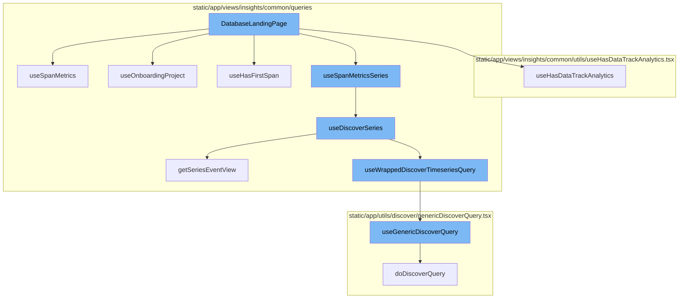
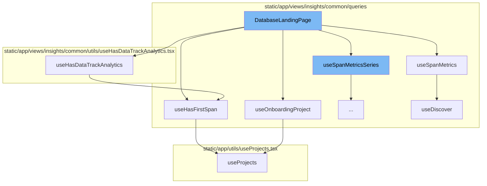
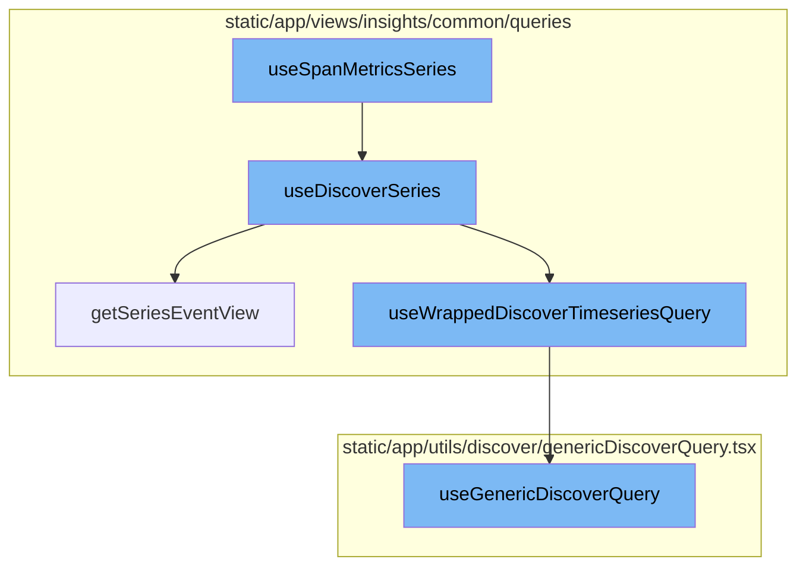

# DatabaseLandingPage Overview

The DatabaseLandingPage is a central component that orchestrates the display of database insights. It leverages several hooks to fetch and manage data, and handles user interactions such as search and navigation.

## Data Fetching and Management

The DatabaseLandingPage uses the `useSpanMetrics` hook to fetch span metrics data from the Discover service. This data is used to populate the database insights charts and tables. The `useHasDataTrackAnalytics` hook is used to track analytics events related to the database insights. It checks if the module has ever sent data and sends an analytics event accordingly.

## User Onboarding and Data Tracking

The `useOnboardingProject` hook is used to determine if the user is in the onboarding process. If the user is onboarding, the hook returns the onboarding project. This information is used to customize the user interface accordingly. The `useHasFirstSpan` hook checks if the current project selection has received a first insight span. This information is used to determine if the module has ever sent data, which is then tracked by the `useHasDataTrackAnalytics` hook.

## Data Processing and Display

The `useSpanMetricsSeries` function is a hook that wraps around the `useDiscoverSeries` function. It passes the options and referrer to `useDiscoverSeries` along with a specific dataset, `DiscoverDatasets.SPANS_METRICS`. The `useDiscoverSeries` function is a hook that takes in options, a dataset, and a referrer. It uses the `usePageFilters` hook to get page filters and the `getSeriesEventView` function to create an event view. It then uses the `useWrappedDiscoverTimeseriesQuery` function to get the result and parses the data into a specific format.



# Flow drill down

First, we'll zoom into this section of the flow:



<SwmSnippet path="/static/app/views/insights/database/views/databaseLandingPage.tsx" line="53">

---

# DatabaseLandingPage Function

The `DatabaseLandingPage` function is the main component of the database landing page. It uses several hooks to fetch and manage data related to the database insights. It also handles user interactions such as search and navigation.

```tsx
export function DatabaseLandingPage() {
  const organization = useOrganization();
  const moduleName = ModuleName.DB;
  const location = useLocation();
  const onboardingProject = useOnboardingProject();
  const hasModuleData = useHasFirstSpan(moduleName);

  const selectedAggregate = DEFAULT_DURATION_AGGREGATE;
  const spanDescription = decodeScalar(location.query?.['span.description'], '');
  const spanAction = decodeScalar(location.query?.['span.action']);
  const spanDomain = decodeScalar(location.query?.['span.domain']);

  const sortField = decodeScalar(location.query?.[QueryParameterNames.SPANS_SORT]);

  let sort = decodeSorts(sortField).filter(isAValidSort)[0];
  if (!sort) {
    sort = DEFAULT_SORT;
  }

  const handleSearch = (newQuery: string) => {
    trackAnalytics('insight.general.search', {
```

---

</SwmSnippet>

<SwmSnippet path="/static/app/views/insights/common/queries/useDiscover.ts" line="38">

---

## useSpanMetrics Hook

The `useSpanMetrics` hook is used in the `DatabaseLandingPage` function to fetch span metrics data from the Discover service. The data fetched by this hook is used to populate the database insights charts and tables.

```typescript
export const useSpanMetrics = <Fields extends SpanMetricsProperty[]>(
  options: UseMetricsOptions<Fields> = {},
  referrer: string
) => {
  return useDiscover<Fields, SpanMetricsResponse>(
    options,
    DiscoverDatasets.SPANS_METRICS,
    referrer
  );
};
```

---

</SwmSnippet>

<SwmSnippet path="/static/app/views/insights/common/utils/useHasDataTrackAnalytics.tsx" line="10">

---

## useHasDataTrackAnalytics Hook

The `useHasDataTrackAnalytics` hook is used to track analytics events related to the database insights. It checks if the module has ever sent data and sends an analytics event accordingly.

```tsx
export function useHasDataTrackAnalytics(module: ModuleName, analyticEvent: string) {
  const organization = useOrganization();
  const pageFilters = usePageFilters();
  const hasEverSentData = useHasFirstSpan(module);

  Sentry.withScope(scope => {
    scope.setTag(`insights.${module}.hasEverSentData`, hasEverSentData);
  });

  const projects = JSON.stringify(pageFilters.selection.projects);

  useEffect(() => {
    trackAnalytics(analyticEvent, {
      organization,
      has_ever_sent_data: hasEverSentData,
    });
  }, [organization, hasEverSentData, analyticEvent, projects]);
}
```

---

</SwmSnippet>

<SwmSnippet path="/static/app/views/insights/common/queries/useOnboardingProject.tsx" line="6">

---

## useOnboardingProject Hook

The `useOnboardingProject` hook is used to determine if the user is in the onboarding process. If the user is onboarding, the hook returns the onboarding project. This information is used to customize the user interface accordingly.

```tsx
export function useOnboardingProject(): Project | undefined {
  const {projects} = useProjects();
  const pageFilters = usePageFilters();
  if (projects.length === 0) {
    return undefined;
  }

  // Current selection is 'my projects' or 'all projects'
  if (
    pageFilters.selection.projects.length === 0 ||
    pageFilters.selection.projects[0] === ALL_ACCESS_PROJECTS
  ) {
    const filtered = projects.filter(p => p.firstTransactionEvent === false);
    if (filtered.length === projects.length) {
      return filtered[0];
    }
  }

  // Any other subset of projects.
  const filtered = projects.filter(
    p =>
```

---

</SwmSnippet>

<SwmSnippet path="/static/app/views/insights/common/queries/useHasFirstSpan.tsx" line="30">

---

## useHasFirstSpan Hook

The `useHasFirstSpan` hook checks if the current project selection has received a first insight span. This information is used to determine if the module has ever sent data, which is then tracked by the `useHasDataTrackAnalytics` hook.

```tsx
/* Returns whether the module and current project selection has received a first insight span */
export function useHasFirstSpan(module: ModuleName): boolean {
  const {projects: allProjects} = useProjects();
  const pageFilters = usePageFilters();

  // Unsupported modules. Remove MOBILE_UI from this list once released.
  if ((excludedModuleNames as readonly ModuleName[]).includes(module)) return false;

  let selectedProjects: Project[] = [];
  // There are three cases for the selected pageFilter projects:
  //  - [] empty list represents "My Projects"
  //  - [-1] represents "All Projects"
  //  - [.., ..] otherwise, represents a list of project IDs
  if (pageFilters.selection.projects.length === 0) {
    selectedProjects = allProjects.filter(p => p.isMember);
  } else if (
    pageFilters.selection.projects.length === 1 &&
    pageFilters.selection.projects[0] === -1
  ) {
    selectedProjects = allProjects;
  } else {
```

---

</SwmSnippet>

Now, lets zoom into this section of the flow:



<SwmSnippet path="/static/app/views/insights/common/queries/useDiscoverSeries.ts" line="30">

---

# useSpanMetricsSeries

The `useSpanMetricsSeries` function is a hook that wraps around the `useDiscoverSeries` function. It passes the options and referrer to `useDiscoverSeries` along with a specific dataset, `DiscoverDatasets.SPANS_METRICS`.

```typescript
export const useSpanMetricsSeries = <Fields extends SpanMetricsProperty[]>(
  options: UseMetricsSeriesOptions<Fields> = {},
  referrer: string
) => {
  return useDiscoverSeries<Fields>(options, DiscoverDatasets.SPANS_METRICS, referrer);
};
```

---

</SwmSnippet>

<SwmSnippet path="/static/app/views/insights/common/queries/useDiscoverSeries.ts" line="56">

---

# useDiscoverSeries

The `useDiscoverSeries` function is a hook that takes in options, a dataset, and a referrer. It uses the `usePageFilters` hook to get page filters and the `getSeriesEventView` function to create an event view. It then uses the `useWrappedDiscoverTimeseriesQuery` function to get the result and parses the data into a specific format.

```typescript
const useDiscoverSeries = <T extends string[]>(
  options: UseMetricsSeriesOptions<T> = {},
  dataset: DiscoverDatasets,
  referrer: string
) => {
  const {search = undefined, yAxis = [], interval = undefined} = options;

  const pageFilters = usePageFilters();

  const eventView = getSeriesEventView(
    search,
    undefined,
    pageFilters.selection,
    yAxis,
    undefined,
    dataset
  );

  if (interval) {
    eventView.interval = interval;
  }
```

---

</SwmSnippet>

<SwmSnippet path="/static/app/views/insights/common/queries/getSeriesEventView.tsx" line="12">

---

# getSeriesEventView

The `getSeriesEventView` function takes in search parameters, fields, page filters, yAxis, top events, and a dataset. It calculates the interval for the yAxis selection and returns an EventView object.

```tsx
export function getSeriesEventView(
  search: MutableSearch | undefined,
  fields: string[] = [],
  pageFilters: PageFilters,
  yAxis: string[],
  topEvents?: number,
  dataset?: DiscoverDatasets
) {
  // Pick the highest possible interval for the given yAxis selection. Find the ideal interval for each function, then choose the largest one. This results in the lowest granularity, but best performance.
  const interval = sortBy(
    yAxis.map(yAxisFunctionName => {
      const parseResult = parseFunction(yAxisFunctionName);

      if (!parseResult) {
        return DEFAULT_INTERVAL;
      }

      return getIntervalForMetricFunction(parseResult.name, pageFilters.datetime);
    }),
    result => {
      return intervalToMilliseconds(result);
```

---

</SwmSnippet>

<SwmSnippet path="/static/app/views/insights/common/queries/useSpansQuery.tsx" line="63">

---

# useWrappedDiscoverTimeseriesQuery

The `useWrappedDiscoverTimeseriesQuery` function is a hook that takes in an event view, enabled flag, initial data, referrer, cursor, and overridden route. It uses the `useGenericDiscoverQuery` function to get the result and processes the result data.

```tsx
export function useWrappedDiscoverTimeseriesQuery<T>({
  eventView,
  enabled,
  initialData,
  referrer,
  cursor,
  overriddenRoute,
}: {
  eventView: EventView;
  cursor?: string;
  enabled?: boolean;
  initialData?: any;
  overriddenRoute?: string;
  referrer?: string;
}) {
  const location = useLocation();
  const organization = useOrganization();
  const {isReady: pageFiltersReady} = usePageFilters();
  const result = useGenericDiscoverQuery<
    {
      data: any[];
```

---

</SwmSnippet>

<SwmSnippet path="/static/app/utils/discover/genericDiscoverQuery.tsx" line="419">

---

# useGenericDiscoverQuery

The `useGenericDiscoverQuery` function is a hook that takes in props and uses the `useQuery` function to make a discover query. It returns the result along with parsed error, status code, and response.

```tsx
export function useGenericDiscoverQuery<T, P>(props: Props<T, P>) {
  const api = useApi();
  const {orgSlug, route, options} = props;
  const url = `/organizations/${orgSlug}/${route}/`;
  const apiPayload = getPayload<T, P>(props);

  const res = useQuery<[T, string | undefined, ResponseMeta<T> | undefined], QueryError>(
    [route, apiPayload],
    ({signal: _signal}) =>
      doDiscoverQuery<T>(api, url, apiPayload, {
        queryBatching: props.queryBatching,
        skipAbort: props.skipAbort,
      }),
    options
  );

  return {
    ...res,
    data: res.data?.[0] ?? undefined,
    error: parseError(res.error),
    statusCode: res.data?.[1] ?? undefined,
```

---

</SwmSnippet>

&nbsp;

*This is an auto-generated document by Swimm AI 🌊 and has not yet been verified by a human*

<SwmMeta version="3.0.0" repo-id="Z2l0aHViJTNBJTNBc2VudHJ5LWRlbW8lM0ElM0FTd2ltbS1EZW1v" repo-name="sentry-demo" doc-type="flows"><sup>Powered by [Swimm](/)</sup></SwmMeta>
