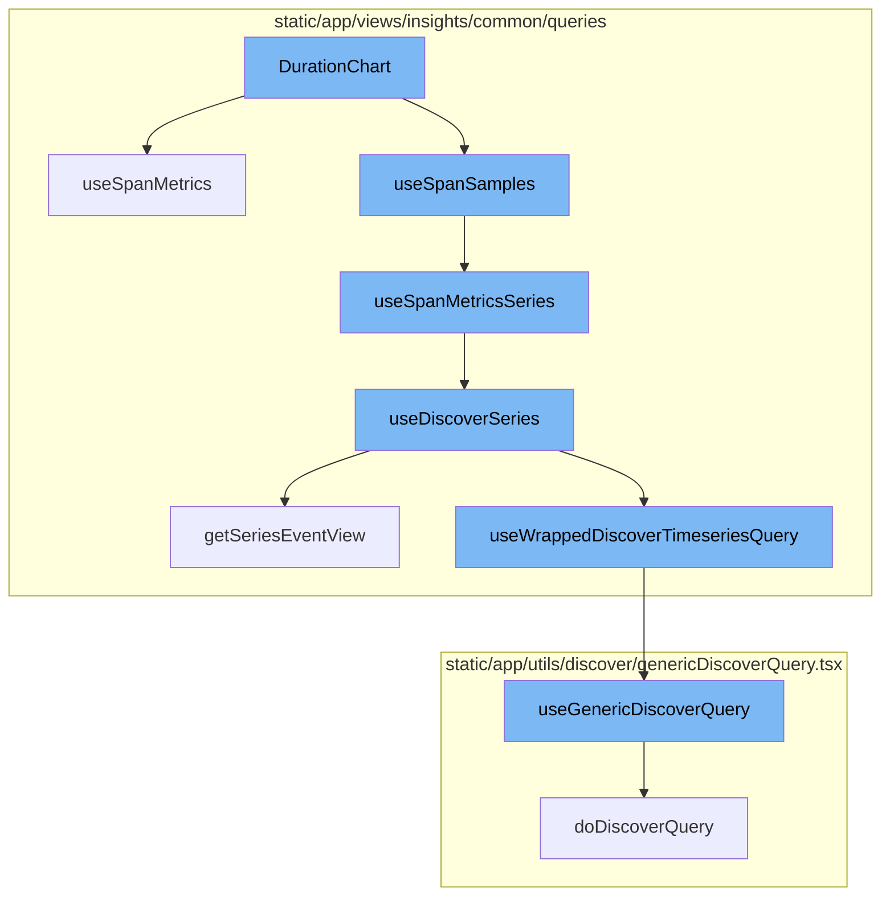
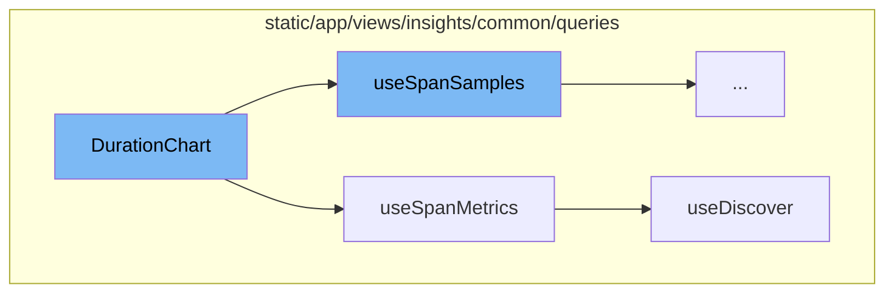
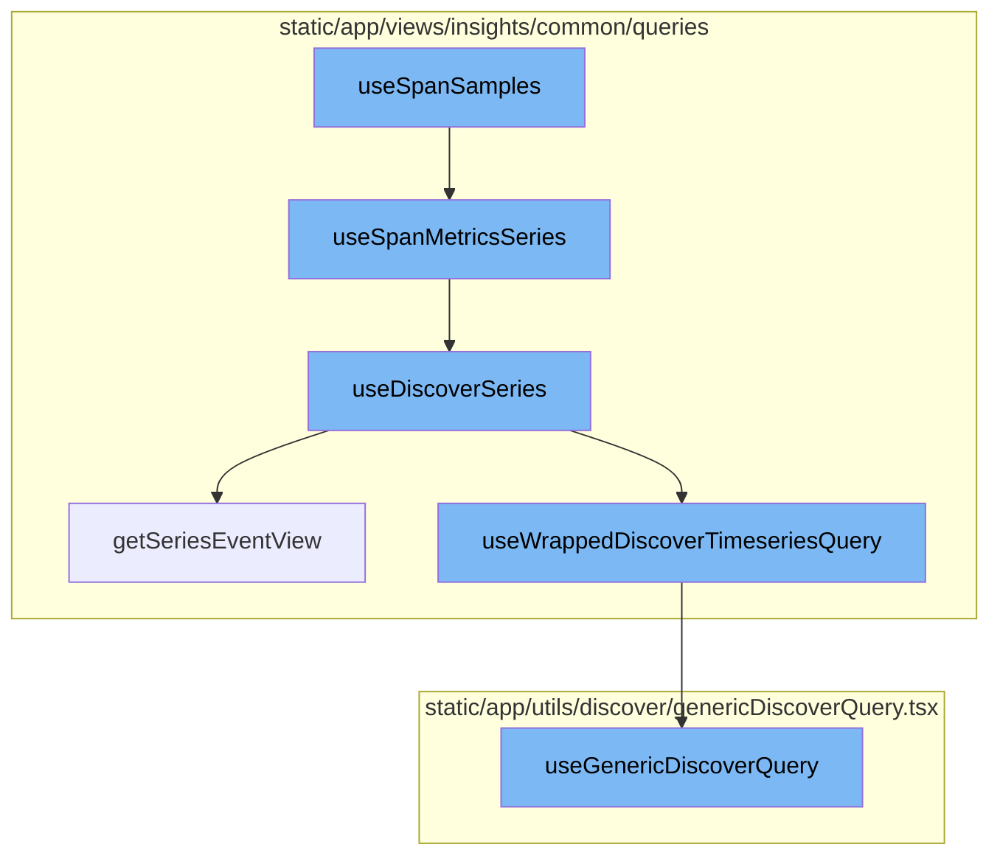

# Overview of DurationChart

The `DurationChart` is a component that visualizes span metrics data in a chart format. It starts by setting up page errors and filters using `usePageAlert` and `usePageFilters` hooks respectively. It then fetches span metrics data using the `useSpanMetrics` hook and calculates averages and other metrics. The component also handles chart interactions such as clicks and mouse leave events.

# Fetching Span Metrics Data

The `useSpanMetrics` function is a custom hook that fetches span metrics data. It uses the `useDiscover` function to fetch the data, passing along options and a referrer as parameters.

# Fetching Data from Discover Datasets

The `useDiscover` function is a custom hook that fetches data from the Discover datasets. It uses the `usePageFilters` hook to get page filters and the `getEventView` function to create an event view. It then fetches the data using the `useWrappedDiscoverTimeseriesQuery` function and returns the result.

# Fetching Span Samples

The `useSpanSamples` function prepares the necessary data and makes an API request to fetch span samples. It constructs a query based on the options and uses the `useQuery` hook to make the API request.

# Fetching Span Metrics Series

The `useSpanMetricsSeries` function is a wrapper around the `useDiscoverSeries` function. It passes the options and a referrer string to `useDiscoverSeries` and returns the result.

# Fetching Discover Series

The `useDiscoverSeries` function fetches a series of data based on the provided options. It constructs an `EventView` object based on the options and fetches the data using the `useWrappedDiscoverTimeseriesQuery` function.

# Constructing EventView Object

The `getSeriesEventView` function constructs an `EventView` object based on the provided parameters. This object specifies the parameters for the data series to be fetched.

# Fetching Data Series

The `useWrappedDiscoverTimeseriesQuery` function fetches the data series. It takes an `EventView` object as a parameter, constructs the API request payload based on this object, and makes the API request using the `useGenericDiscoverQuery` function.

# Making API Request

The `useGenericDiscoverQuery` function makes the actual API request. It takes the API request payload as a parameter, makes the API request, and returns the result.



# Flow drill down

First, we'll zoom into this section of the flow:



<SwmSnippet path="/static/app/views/insights/common/views/spanSummaryPage/sampleList/durationChart/index.tsx" line="40">

---

# DurationChart Function

The `DurationChart` function is the starting point of the flow. It uses the `usePageAlert` and `usePageFilters` hooks to set page errors and filters respectively. It also defines a `filters` object that includes the transaction name. The function then uses the `useSpanMetrics` hook to fetch span metrics data and uses this data to calculate averages and other metrics. The function also defines several handlers for chart interactions such as clicks and mouse leave events.

```tsx
function DurationChart({
  groupId,
  transactionName,
  onClickSample,
  onMouseLeaveSample,
  onMouseOverSample,
  highlightedSpanId,
  transactionMethod,
  additionalFields,
  release,
  spanSearch,
  platform,
  additionalFilters,
}: Props) {
  const {setPageError} = usePageAlert();
  const pageFilter = usePageFilters();

  const filters: SpanMetricsQueryFilters = {
    'span.group': groupId,
    transaction: transactionName,
  };
```

---

</SwmSnippet>

<SwmSnippet path="/static/app/views/insights/common/queries/useDiscover.ts" line="38">

---

# useSpanMetrics Function

The `useSpanMetrics` function is a custom hook that uses the `useDiscover` function to fetch span metrics data. It takes options and a referrer as parameters and passes them along to the `useDiscover` function.

```typescript
export const useSpanMetrics = <Fields extends SpanMetricsProperty[]>(
  options: UseMetricsOptions<Fields> = {},
  referrer: string
) => {
  return useDiscover<Fields, SpanMetricsResponse>(
    options,
    DiscoverDatasets.SPANS_METRICS,
    referrer
  );
};
```

---

</SwmSnippet>

<SwmSnippet path="/static/app/views/insights/common/queries/useDiscover.ts" line="60">

---

# useDiscover Function

The `useDiscover` function is a custom hook that fetches data from the Discover datasets. It takes options, a dataset, and a referrer as parameters. It uses the `usePageFilters` hook to get page filters and the `getEventView` function to create an event view. It then uses the `useWrappedDiscoverQuery` function to fetch the data and returns the result along with the data and a flag indicating whether the query is enabled.

```typescript
const useDiscover = <T extends Extract<keyof ResponseType, string>[], ResponseType>(
  options: UseMetricsOptions<T> = {},
  dataset: DiscoverDatasets,
  referrer: string
) => {
  const {
    fields = [],
    search = undefined,
    sorts = [],
    limit,
    cursor,
    pageFilters: pageFiltersFromOptions,
  } = options;

  const pageFilters = usePageFilters();

  const eventView = getEventView(
    search,
    fields,
    sorts,
    pageFiltersFromOptions ?? pageFilters.selection,
```

---

</SwmSnippet>

Now, lets zoom into this section of the flow:



<SwmSnippet path="/static/app/views/insights/common/queries/useSpanSamples.tsx" line="43">

---

# useSpanSamples

The `useSpanSamples` function is the starting point of the flow. It prepares the necessary data and makes an API request to fetch span samples. The function takes in options as parameters, constructs a query based on these options, and then uses the `useQuery` hook to make the API request. The result of the API request is then returned.

```tsx
export const useSpanSamples = (options: Options) => {
  const organization = useOrganization();
  const url = `/api/0/organizations/${organization.slug}/spans-samples/`;
  const api = useApi();
  const pageFilter = usePageFilters();
  const {
    groupId,
    transactionName,
    transactionMethod,
    release,
    spanSearch,
    additionalFields,
  } = options;
  const location = useLocation();

  const query = spanSearch !== undefined ? spanSearch.copy() : new MutableSearch([]);
  query.addFilterValue(SPAN_GROUP, groupId);
  query.addFilterValue('transaction', transactionName);

  const filters: SpanMetricsQueryFilters = {
    transaction: transactionName,
```

---

</SwmSnippet>

<SwmSnippet path="/static/app/views/insights/common/queries/useDiscoverSeries.ts" line="30">

---

# useSpanMetricsSeries

The `useSpanMetricsSeries` function is a wrapper around the `useDiscoverSeries` function. It passes the options and a referrer string to `useDiscoverSeries` and returns the result.

```typescript
export const useSpanMetricsSeries = <Fields extends SpanMetricsProperty[]>(
  options: UseMetricsSeriesOptions<Fields> = {},
  referrer: string
) => {
  return useDiscoverSeries<Fields>(options, DiscoverDatasets.SPANS_METRICS, referrer);
};
```

---

</SwmSnippet>

<SwmSnippet path="/static/app/views/insights/common/queries/useDiscoverSeries.ts" line="56">

---

# useDiscoverSeries

The `useDiscoverSeries` function is used to fetch a series of data based on the provided options. It constructs an `EventView` object based on the options and then uses the `useWrappedDiscoverTimeseriesQuery` function to fetch the data. The data is then parsed and returned.

```typescript
const useDiscoverSeries = <T extends string[]>(
  options: UseMetricsSeriesOptions<T> = {},
  dataset: DiscoverDatasets,
  referrer: string
) => {
  const {search = undefined, yAxis = [], interval = undefined} = options;

  const pageFilters = usePageFilters();

  const eventView = getSeriesEventView(
    search,
    undefined,
    pageFilters.selection,
    yAxis,
    undefined,
    dataset
  );

  if (interval) {
    eventView.interval = interval;
  }
```

---

</SwmSnippet>

<SwmSnippet path="/static/app/views/insights/common/queries/getSeriesEventView.tsx" line="12">

---

# getSeriesEventView

The `getSeriesEventView` function is used to construct an `EventView` object based on the provided parameters. This object is used to specify the parameters for the data series that is to be fetched.

```tsx
export function getSeriesEventView(
  search: MutableSearch | undefined,
  fields: string[] = [],
  pageFilters: PageFilters,
  yAxis: string[],
  topEvents?: number,
  dataset?: DiscoverDatasets
) {
  // Pick the highest possible interval for the given yAxis selection. Find the ideal interval for each function, then choose the largest one. This results in the lowest granularity, but best performance.
  const interval = sortBy(
    yAxis.map(yAxisFunctionName => {
      const parseResult = parseFunction(yAxisFunctionName);

      if (!parseResult) {
        return DEFAULT_INTERVAL;
      }

      return getIntervalForMetricFunction(parseResult.name, pageFilters.datetime);
    }),
    result => {
      return intervalToMilliseconds(result);
```

---

</SwmSnippet>

<SwmSnippet path="/static/app/views/insights/common/queries/useSpansQuery.tsx" line="63">

---

# useWrappedDiscoverTimeseriesQuery

The `useWrappedDiscoverTimeseriesQuery` function is used to fetch the data series. It takes an `EventView` object as a parameter, constructs the API request payload based on this object, and then uses the `useGenericDiscoverQuery` function to make the API request. The result of the API request is then processed and returned.

```tsx
export function useWrappedDiscoverTimeseriesQuery<T>({
  eventView,
  enabled,
  initialData,
  referrer,
  cursor,
  overriddenRoute,
}: {
  eventView: EventView;
  cursor?: string;
  enabled?: boolean;
  initialData?: any;
  overriddenRoute?: string;
  referrer?: string;
}) {
  const location = useLocation();
  const organization = useOrganization();
  const {isReady: pageFiltersReady} = usePageFilters();
  const result = useGenericDiscoverQuery<
    {
      data: any[];
```

---

</SwmSnippet>

<SwmSnippet path="/static/app/utils/discover/genericDiscoverQuery.tsx" line="419">

---

# useGenericDiscoverQuery

The `useGenericDiscoverQuery` function is used to make the actual API request. It takes the API request payload as a parameter, makes the API request, and then returns the result.

```tsx
export function useGenericDiscoverQuery<T, P>(props: Props<T, P>) {
  const api = useApi();
  const {orgSlug, route, options} = props;
  const url = `/organizations/${orgSlug}/${route}/`;
  const apiPayload = getPayload<T, P>(props);

  const res = useQuery<[T, string | undefined, ResponseMeta<T> | undefined], QueryError>(
    [route, apiPayload],
    ({signal: _signal}) =>
      doDiscoverQuery<T>(api, url, apiPayload, {
        queryBatching: props.queryBatching,
        skipAbort: props.skipAbort,
      }),
    options
  );

  return {
    ...res,
    data: res.data?.[0] ?? undefined,
    error: parseError(res.error),
    statusCode: res.data?.[1] ?? undefined,
```

---

</SwmSnippet>

&nbsp;

*This is an auto-generated document by Swimm AI 🌊 and has not yet been verified by a human*

<SwmMeta version="3.0.0" repo-id="Z2l0aHViJTNBJTNBc2VudHJ5LWRlbW8lM0ElM0FTd2ltbS1EZW1v" repo-name="sentry-demo" doc-type="flows"><sup>Powered by [Swimm](/)</sup></SwmMeta>
