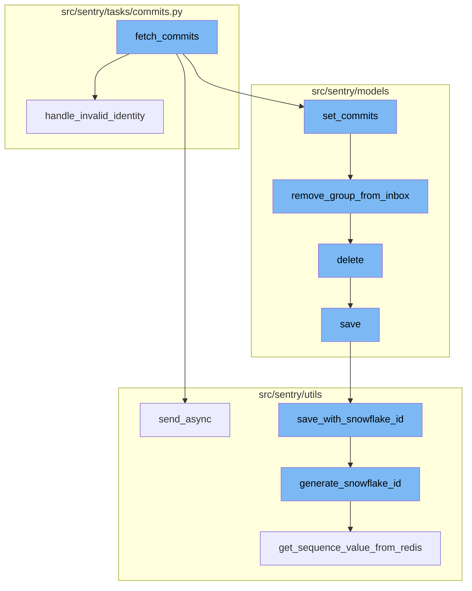
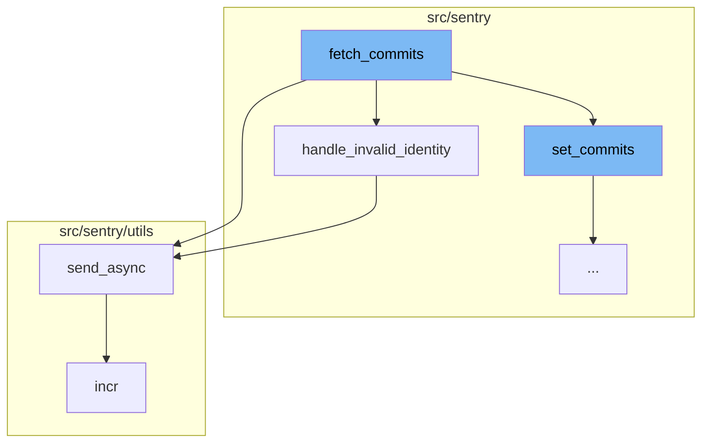
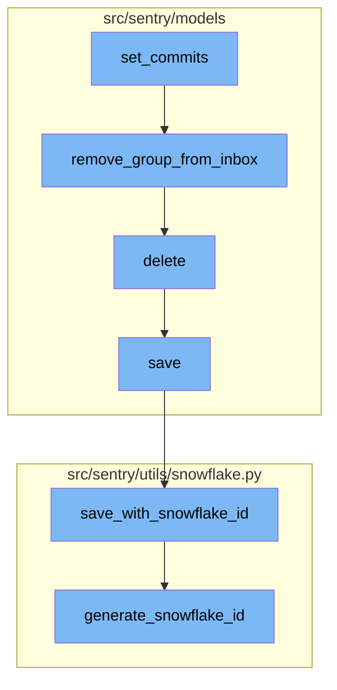

<SwmSnippet path="/src/sentry/tasks/commits.py" line="77">

---

# Fetch Commits Flow

The `fetch_commits` function is the starting point of the flow. It is responsible for fetching commits related to a release. It retrieves the release and user details, and then iterates over the provided refs to fetch commits from the repository. If any error occurs during this process, it is handled and logged accordingly. If the error is due to an invalid identity, the `handle_invalid_identity` function is called.

```python
def fetch_commits(release_id: int, user_id: int, refs, prev_release_id=None, **kwargs):
    # TODO(dcramer): this function could use some cleanup/refactoring as it's a bit unwieldy
    commit_list = []

    release = Release.objects.get(id=release_id)
    set_tag("organization.slug", release.organization.slug)
    # TODO: Need a better way to error handle no user_id. We need the SDK to be able to call this without user context
    # to autoassociate commits to releases
    user = user_service.get_user(user_id) if user_id is not None else None
    # user = User.objects.get(id=user_id) if user_id is not None else None
    prev_release = None
    if prev_release_id is not None:
        try:
            prev_release = Release.objects.get(id=prev_release_id)
        except Release.DoesNotExist:
            pass

    for ref in refs:
        repo = (
            Repository.objects.filter(
                organization_id=release.organization_id,
```

---

</SwmSnippet>

<SwmSnippet path="/src/sentry/tasks/commits.py" line="60">

---

# Handling Invalid Identity

The `handle_invalid_identity` function is called when an InvalidIdentity error is encountered during the fetch commits process. This function generates an email to notify the user about the invalid identity and then deletes the invalid identity.

```python
def handle_invalid_identity(identity, commit_failure=False):
    # email the user
    msg = generate_invalid_identity_email(identity, commit_failure)
    msg.send_async(to=[identity.user.email])

    # now remove the identity, as its invalid
    identity.delete()
```

---

</SwmSnippet>

<SwmSnippet path="/src/sentry/utils/email/message_builder.py" line="232">

---

# Sending Emails Asynchronously

The `send_async` function is used to send emails asynchronously. It is called within the `handle_invalid_identity` function to send an email to the user about the invalid identity. It builds the email message and then queues it for sending.

```python
    def send_async(
        self,
        to: Iterable[str] | None = None,
        cc: Sequence[str] | None = None,
        bcc: Sequence[str] | None = None,
    ) -> None:
        from sentry.tasks.email import send_email, send_email_control

        fmt = options.get("system.logging-format")
        messages = self.get_built_messages(to, cc=cc, bcc=bcc)
        extra: MutableMapping[str, str | tuple[str]] = {"message_type": self.type}
        loggable = [v for k, v in self.context.items() if hasattr(v, "id")]
        for context in loggable:
            extra[f"{type(context).__name__.lower()}_id"] = context.id

        log_mail_queued = partial(logger.info, "mail.queued", extra=extra)
        for message in messages:
            send_email_task = send_email.delay
            if SiloMode.get_current_mode() == SiloMode.CONTROL:
                send_email_task = send_email_control.delay
            safe_execute(send_email_task, message=message)
```

---

</SwmSnippet>

<SwmSnippet path="/src/sentry/utils/metrics.py" line="101">

---

# Incrementing Metrics

The `incr` function is used to increment a metric. It is called after the `send_async` function to increment the 'email.queued' metric.

```python
    def incr(
        self,
        key: str,
        instance: str | None = None,
        tags: Tags | None = None,
        amount: int = 1,
        sample_rate: float = settings.SENTRY_METRICS_SAMPLE_RATE,
    ) -> None:
        if not self._started:
```

---

</SwmSnippet>

<SwmSnippet path="/src/sentry/models/release.py" line="648">

---

# Setting Commits

The `set_commits` function is the next step in the flow. It binds a list of commits to a release, replacing any existing commit log. It also sorts the commit list in reverse order based on the timestamp. The function then processes each commit, creating or updating the corresponding `Commit` and `ReleaseCommit` objects.

```python
    def set_commits(self, commit_list):
        """
        Bind a list of commits to this release.

        This will clear any existing commit log and replace it with the given
        commits.
        """

        # Sort commit list in reverse order
        commit_list.sort(key=lambda commit: commit.get("timestamp", 0), reverse=True)

        # TODO(dcramer): this function could use some cleanup/refactoring as it's a bit unwieldy
        from sentry.models.commit import Commit
        from sentry.models.commitauthor import CommitAuthor
        from sentry.models.group import Group, GroupStatus
        from sentry.models.grouplink import GroupLink
        from sentry.models.groupresolution import GroupResolution
        from sentry.models.pullrequest import PullRequest
        from sentry.models.releasecommit import ReleaseCommit
        from sentry.models.releaseheadcommit import ReleaseHeadCommit
        from sentry.models.repository import Repository
```

---

</SwmSnippet>

<SwmSnippet path="/src/sentry/models/groupinbox.py" line="96">

---

# Removing Group from Inbox

The `remove_group_from_inbox` function is the next step in the flow. It removes a group from the inbox. If the action is `MARK_REVIEWED` and a user is provided, it creates an `Activity` object and records the group history.

```python
def remove_group_from_inbox(group, action=None, user=None, referrer=None):
    try:
        group_inbox = GroupInbox.objects.get(group=group)
        group_inbox.delete()

        if action is GroupInboxRemoveAction.MARK_REVIEWED and user is not None:
            Activity.objects.create(
                project_id=group_inbox.group.project_id,
                group_id=group_inbox.group_id,
                type=ActivityType.MARK_REVIEWED.value,
                user_id=user.id,
            )
            record_group_history(group, GroupHistoryStatus.REVIEWED, actor=user)
    except GroupInbox.DoesNotExist:
        pass
```

---

</SwmSnippet>

<SwmSnippet path="/src/sentry/models/project.py" line="722">

---

# Deleting Project

The `delete` function is then called. It removes notification settings for the project and saves the project's state in the outbox before deleting the project.

```python
    def delete(self, **kwargs):
        # There is no foreign key relationship so we have to manually cascade.
        notifications_service.remove_notification_settings_for_project(project_id=self.id)

        with outbox_context(transaction.atomic(router.db_for_write(Project))):
            Project.outbox_for_update(self.id, self.organization_id).save()
            return super().delete(**kwargs)
```

---

</SwmSnippet>

<SwmSnippet path="/src/sentry/models/project.py" line="365">

---

# Saving Project

The `save` function is the next step in the flow. It generates a slug for the project if it doesn't already have one. If the project uses a snowflake ID, it calls `save_with_snowflake_id` to save the project with a snowflake ID.

```python
    def save(self, *args, **kwargs):
        if not self.slug:
            lock = locks.get(
                f"slug:project:{self.organization_id}", duration=5, name="project_slug"
            )
            with TimedRetryPolicy(10)(lock.acquire):
                slugify_instance(
                    self,
                    self.name,
                    organization=self.organization,
                    reserved=RESERVED_PROJECT_SLUGS,
                    max_length=50,
                )

        if SENTRY_USE_SNOWFLAKE:
            snowflake_redis_key = "project_snowflake_key"
            save_with_snowflake_id(
                instance=self,
                snowflake_redis_key=snowflake_redis_key,
                save_callback=lambda: super(Project, self).save(*args, **kwargs),
            )
```

---

</SwmSnippet>

<SwmSnippet path="/src/sentry/utils/snowflake.py" line="47">

---

# Saving with Snowflake ID

The `save_with_snowflake_id` function is called next. It asserts that the model uses a snowflake ID, then tries to generate a snowflake ID and save the instance. If an `IntegrityError` occurs, it resets the instance's ID and raises a `MaxSnowflakeRetryError`.

```python
def save_with_snowflake_id(
    instance: BaseModel, snowflake_redis_key: str, save_callback: Callable[[], object]
) -> None:
    assert uses_snowflake_id(
        instance.__class__
    ), "Only models decorated with uses_snowflake_id can be saved with save_with_snowflake_id()"

    for _ in range(settings.MAX_REDIS_SNOWFLAKE_RETRY_COUNTER):
        if not instance.id:
            instance.id = generate_snowflake_id(snowflake_redis_key)
        try:
            with enforce_constraints(transaction.atomic(using=router.db_for_write(type(instance)))):
                save_callback()
            return
        except IntegrityError:
            instance.id = None  # type: ignore[assignment]  # see typeddjango/django-stubs#2014
    raise MaxSnowflakeRetryError
```

---

</SwmSnippet>

<SwmSnippet path="/src/sentry/utils/snowflake.py" line="113">

---

# Generating Snowflake ID

The final step in the flow is the `generate_snowflake_id` function. It generates a snowflake ID by combining various segment values, including a version ID, region ID, and time difference. It then validates the generated snowflake ID before returning it.

```python
def generate_snowflake_id(redis_key: str) -> int:
    segment_values = {}

    segment_values[VERSION_ID] = msb_0_ordering(settings.SNOWFLAKE_VERSION_ID, VERSION_ID.length)

    try:
        segment_values[REGION_ID] = get_local_region().snowflake_id
    except RegionContextError:  # expected if running in monolith mode
        segment_values[REGION_ID] = NULL_REGION_ID

    current_time = datetime.now().timestamp()
    # supports up to 130 years
    segment_values[TIME_DIFFERENCE] = int(current_time - settings.SENTRY_SNOWFLAKE_EPOCH_START)

    snowflake_id = 0
    (
        segment_values[TIME_DIFFERENCE],
        segment_values[REGION_SEQUENCE],
    ) = get_sequence_value_from_redis(redis_key, segment_values[TIME_DIFFERENCE])

    for segment in BIT_SEGMENT_SCHEMA:
```

---

</SwmSnippet>



# Flow drill down

First, we'll zoom into this section of the flow:



<SwmSnippet path="/src/sentry/tasks/commits.py" line="77">

---

# Fetch Commits Flow

The `fetch_commits` function is the starting point of the flow. It is responsible for fetching commits related to a release. It retrieves the release and user details, and then iterates over the provided refs to fetch commits from the repository. If any error occurs during this process, it is handled and logged accordingly. If the error is due to an invalid identity, the `handle_invalid_identity` function is called.

```python
def fetch_commits(release_id: int, user_id: int, refs, prev_release_id=None, **kwargs):
    # TODO(dcramer): this function could use some cleanup/refactoring as it's a bit unwieldy
    commit_list = []

    release = Release.objects.get(id=release_id)
    set_tag("organization.slug", release.organization.slug)
    # TODO: Need a better way to error handle no user_id. We need the SDK to be able to call this without user context
    # to autoassociate commits to releases
    user = user_service.get_user(user_id) if user_id is not None else None
    # user = User.objects.get(id=user_id) if user_id is not None else None
    prev_release = None
    if prev_release_id is not None:
        try:
            prev_release = Release.objects.get(id=prev_release_id)
        except Release.DoesNotExist:
            pass

    for ref in refs:
        repo = (
            Repository.objects.filter(
                organization_id=release.organization_id,
```

---

</SwmSnippet>

<SwmSnippet path="/src/sentry/tasks/commits.py" line="60">

---

# Handling Invalid Identity

The `handle_invalid_identity` function is called when an InvalidIdentity error is encountered during the fetch commits process. This function generates an email to notify the user about the invalid identity and then deletes the invalid identity.

```python
def handle_invalid_identity(identity, commit_failure=False):
    # email the user
    msg = generate_invalid_identity_email(identity, commit_failure)
    msg.send_async(to=[identity.user.email])

    # now remove the identity, as its invalid
    identity.delete()
```

---

</SwmSnippet>

<SwmSnippet path="/src/sentry/utils/email/message_builder.py" line="232">

---

# Sending Emails Asynchronously

The `send_async` function is used to send emails asynchronously. It is called within the `handle_invalid_identity` function to send an email to the user about the invalid identity. It builds the email message and then queues it for sending.

```python
    def send_async(
        self,
        to: Iterable[str] | None = None,
        cc: Sequence[str] | None = None,
        bcc: Sequence[str] | None = None,
    ) -> None:
        from sentry.tasks.email import send_email, send_email_control

        fmt = options.get("system.logging-format")
        messages = self.get_built_messages(to, cc=cc, bcc=bcc)
        extra: MutableMapping[str, str | tuple[str]] = {"message_type": self.type}
        loggable = [v for k, v in self.context.items() if hasattr(v, "id")]
        for context in loggable:
            extra[f"{type(context).__name__.lower()}_id"] = context.id

        log_mail_queued = partial(logger.info, "mail.queued", extra=extra)
        for message in messages:
            send_email_task = send_email.delay
            if SiloMode.get_current_mode() == SiloMode.CONTROL:
                send_email_task = send_email_control.delay
            safe_execute(send_email_task, message=message)
```

---

</SwmSnippet>

<SwmSnippet path="/src/sentry/utils/metrics.py" line="101">

---

# Incrementing Metrics

The `incr` function is used to increment a metric. It is called after the `send_async` function to increment the 'email.queued' metric.

```python
    def incr(
        self,
        key: str,
        instance: str | None = None,
        tags: Tags | None = None,
        amount: int = 1,
        sample_rate: float = settings.SENTRY_METRICS_SAMPLE_RATE,
    ) -> None:
        if not self._started:
```

---

</SwmSnippet>

Now, lets zoom into this section of the flow:



<SwmSnippet path="/src/sentry/models/release.py" line="648">

---

# Fetch Commits Flow

The `set_commits` function is the starting point of the flow. It binds a list of commits to a release, replacing any existing commit log. It also sorts the commit list in reverse order based on the timestamp. The function then processes each commit, creating or updating the corresponding `Commit` and `ReleaseCommit` objects.

```python
    def set_commits(self, commit_list):
        """
        Bind a list of commits to this release.

        This will clear any existing commit log and replace it with the given
        commits.
        """

        # Sort commit list in reverse order
        commit_list.sort(key=lambda commit: commit.get("timestamp", 0), reverse=True)

        # TODO(dcramer): this function could use some cleanup/refactoring as it's a bit unwieldy
        from sentry.models.commit import Commit
        from sentry.models.commitauthor import CommitAuthor
        from sentry.models.group import Group, GroupStatus
        from sentry.models.grouplink import GroupLink
        from sentry.models.groupresolution import GroupResolution
        from sentry.models.pullrequest import PullRequest
        from sentry.models.releasecommit import ReleaseCommit
        from sentry.models.releaseheadcommit import ReleaseHeadCommit
        from sentry.models.repository import Repository
```

---

</SwmSnippet>

<SwmSnippet path="/src/sentry/models/groupinbox.py" line="96">

---

The `remove_group_from_inbox` function is the next step in the flow. It removes a group from the inbox. If the action is `MARK_REVIEWED` and a user is provided, it creates an `Activity` object and records the group history.

```python
def remove_group_from_inbox(group, action=None, user=None, referrer=None):
    try:
        group_inbox = GroupInbox.objects.get(group=group)
        group_inbox.delete()

        if action is GroupInboxRemoveAction.MARK_REVIEWED and user is not None:
            Activity.objects.create(
                project_id=group_inbox.group.project_id,
                group_id=group_inbox.group_id,
                type=ActivityType.MARK_REVIEWED.value,
                user_id=user.id,
            )
            record_group_history(group, GroupHistoryStatus.REVIEWED, actor=user)
    except GroupInbox.DoesNotExist:
        pass
```

---

</SwmSnippet>

<SwmSnippet path="/src/sentry/models/project.py" line="722">

---

The `delete` function is then called. It removes notification settings for the project and saves the project's state in the outbox before deleting the project.

```python
    def delete(self, **kwargs):
        # There is no foreign key relationship so we have to manually cascade.
        notifications_service.remove_notification_settings_for_project(project_id=self.id)

        with outbox_context(transaction.atomic(router.db_for_write(Project))):
            Project.outbox_for_update(self.id, self.organization_id).save()
            return super().delete(**kwargs)
```

---

</SwmSnippet>

<SwmSnippet path="/src/sentry/models/project.py" line="365">

---

The `save` function is the next step in the flow. It generates a slug for the project if it doesn't already have one. If the project uses a snowflake ID, it calls `save_with_snowflake_id` to save the project with a snowflake ID.

```python
    def save(self, *args, **kwargs):
        if not self.slug:
            lock = locks.get(
                f"slug:project:{self.organization_id}", duration=5, name="project_slug"
            )
            with TimedRetryPolicy(10)(lock.acquire):
                slugify_instance(
                    self,
                    self.name,
                    organization=self.organization,
                    reserved=RESERVED_PROJECT_SLUGS,
                    max_length=50,
                )

        if SENTRY_USE_SNOWFLAKE:
            snowflake_redis_key = "project_snowflake_key"
            save_with_snowflake_id(
                instance=self,
                snowflake_redis_key=snowflake_redis_key,
                save_callback=lambda: super(Project, self).save(*args, **kwargs),
            )
```

---

</SwmSnippet>

<SwmSnippet path="/src/sentry/utils/snowflake.py" line="47">

---

The `save_with_snowflake_id` function is called next. It asserts that the model uses a snowflake ID, then tries to generate a snowflake ID and save the instance. If an `IntegrityError` occurs, it resets the instance's ID and raises a `MaxSnowflakeRetryError`.

```python
def save_with_snowflake_id(
    instance: BaseModel, snowflake_redis_key: str, save_callback: Callable[[], object]
) -> None:
    assert uses_snowflake_id(
        instance.__class__
    ), "Only models decorated with uses_snowflake_id can be saved with save_with_snowflake_id()"

    for _ in range(settings.MAX_REDIS_SNOWFLAKE_RETRY_COUNTER):
        if not instance.id:
            instance.id = generate_snowflake_id(snowflake_redis_key)
        try:
            with enforce_constraints(transaction.atomic(using=router.db_for_write(type(instance)))):
                save_callback()
            return
        except IntegrityError:
            instance.id = None  # type: ignore[assignment]  # see typeddjango/django-stubs#2014
    raise MaxSnowflakeRetryError
```

---

</SwmSnippet>

<SwmSnippet path="/src/sentry/utils/snowflake.py" line="113">

---

The final step in the flow is the `generate_snowflake_id` function. It generates a snowflake ID by combining various segment values, including a version ID, region ID, and time difference. It then validates the generated snowflake ID before returning it.

```python
def generate_snowflake_id(redis_key: str) -> int:
    segment_values = {}

    segment_values[VERSION_ID] = msb_0_ordering(settings.SNOWFLAKE_VERSION_ID, VERSION_ID.length)

    try:
        segment_values[REGION_ID] = get_local_region().snowflake_id
    except RegionContextError:  # expected if running in monolith mode
        segment_values[REGION_ID] = NULL_REGION_ID

    current_time = datetime.now().timestamp()
    # supports up to 130 years
    segment_values[TIME_DIFFERENCE] = int(current_time - settings.SENTRY_SNOWFLAKE_EPOCH_START)

    snowflake_id = 0
    (
        segment_values[TIME_DIFFERENCE],
        segment_values[REGION_SEQUENCE],
    ) = get_sequence_value_from_redis(redis_key, segment_values[TIME_DIFFERENCE])

    for segment in BIT_SEGMENT_SCHEMA:
```

---

</SwmSnippet>

&nbsp;

*This is an auto-generated document by Swimm AI 🌊 and has not yet been verified by a human*

<SwmMeta version="3.0.0" repo-id="Z2l0aHViJTNBJTNBc2VudHJ5LWRlbW8lM0ElM0FTd2ltbS1EZW1v" repo-name="sentry-demo" doc-type="flows"><sup>Powered by [Swimm](/)</sup></SwmMeta>
