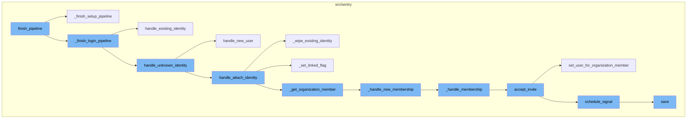
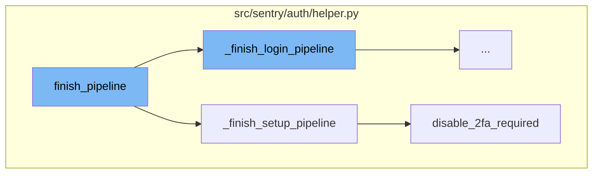
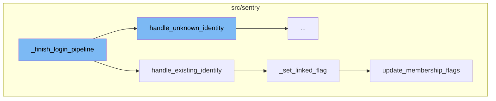
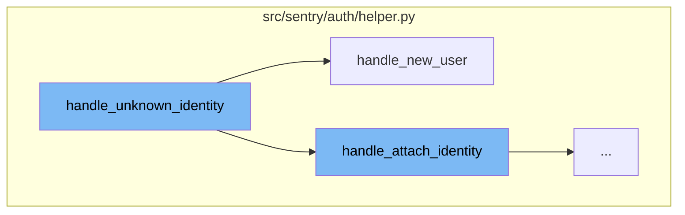
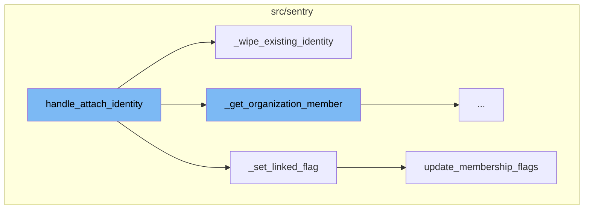
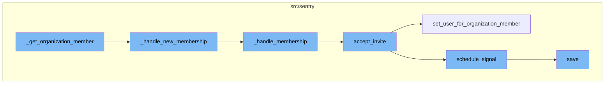

# Overview of finish_pipeline

The `finish_pipeline` function is a crucial part of the authentication process in Sentry. It is responsible for completing an authentication pipeline, which involves fetching state data and building an identity based on it. Depending on the flow state, it either completes the login pipeline or the setup pipeline.

# Login Pipeline

The login pipeline is executed both with anonymous and authenticated users. If the identity is already linked, the user is logged in and redirected immediately. Otherwise, the user is presented with a confirmation window that will show them the new account that will be created. If they're already authenticated, an optional button to associate the identity with their account is presented.

# Setup Pipeline

The setup pipeline is responsible for configuring SSO for an organization. It checks the user's authentication and membership, disables 2FA requirement, creates an AuthProvider, attaches the identity to the user, marks SSO as complete, schedules a signal for SSO enabled, records an audit log, sends an email for missing links, and finally redirects to the auth provider settings page.

# Handling Existing Identity

If the identity is already linked, the system updates the identity, checks the membership of the user, and handles the login process. If the user is not a member, it creates a new membership.

# Handling Unknown Identity

If a user logs in and an AuthIdentity is not present, the system attempts to answer whether there's an existing user with the same email address, an existing user via authentication that should be merged, or if a new user should be created based on this identity. Depending on the operation, it may call `handle_attach_identity` or `handle_new_user`.

# Handling New User

If a new user needs to be created, the system creates a new user with a unique username, the email from the identity, and the name from the identity (if available). It then creates an AuthIdentity for the new user and sends confirmation emails. Finally, it handles new membership for the created AuthIdentity.

# Handling Attach Identity

If the operation is 'confirm' and the user is authenticated or the account is verified, the system attaches the identity to the existing user. It first tries to identify the user by the SSO provider's user ID. If no identity is found, it creates a new one. If an existing identity is found, it checks if the user ID of the existing identity matches the current user's ID. If they don't match, it wipes out the existing identity. After that, it updates the identity with the new data and sets the `last_verified` and `last_synced` fields to the current time.

# Handling Membership

The system checks if the user is currently pending invite acceptance or if an existing invite exists for the email provided by the identity provider. If an invite can be accepted, it does so. Otherwise, it handles new membership creation.



# Flow drill down

First, we'll zoom into this section of the flow:



<SwmSnippet path="/src/sentry/auth/helper.py" line="761">

---

# finish_pipeline Function

The `finish_pipeline` function is the entry point for completing an authentication pipeline. It fetches the state data and builds an identity based on it. Depending on the flow state, it either completes the login pipeline or the setup pipeline.

```python
    def finish_pipeline(self) -> HttpResponseBase:
        data = self.fetch_state()

        # The state data may have expired, in which case the state data will
        # simply be None.
        if not data:
            return self.error(ERR_INVALID_IDENTITY)

        try:
            identity = self.provider.build_identity(data)
        except IdentityNotValid as error:
            return self.error(str(error) or ERR_INVALID_IDENTITY)

        if self.state.flow == self.FLOW_LOGIN:
            # create identity and authenticate the user
            response = self._finish_login_pipeline(identity)
        elif self.state.flow == self.FLOW_SETUP_PROVIDER:
            # Configuring the SSO Auth provider
            response = self._finish_setup_pipeline(identity)
        else:
            raise Exception(f"Unrecognized flow value: {self.state.flow}")
```

---

</SwmSnippet>

<SwmSnippet path="/src/sentry/auth/helper.py" line="856">

---

# \_finish_setup_pipeline Function

The `_finish_setup_pipeline` function is called when the flow state is `FLOW_SETUP_PROVIDER`. This function is responsible for configuring SSO for an organization. It checks the user's authentication and membership, disables 2FA requirement, creates an AuthProvider, attaches the identity to the user, marks SSO as complete, schedules a signal for SSO enabled, records an audit log, sends an email for missing links, and finally redirects to the auth provider settings page.

```python
    def _finish_setup_pipeline(self, identity: Mapping[str, Any]) -> HttpResponseRedirect:
        """
        the setup flow here is configuring SSO for an organization.
        It does that by creating the auth provider as well as an OrgMember identity linked to the active user
        """
        request = self.request
        if not request.user.is_authenticated:
            return self.error(ERR_NOT_AUTHED)

        if request.user.id != self.state.uid:
            return self.error(ERR_UID_MISMATCH)

        data = self.fetch_state()
        config = self.provider.build_config(state=data)

        om = organization_service.check_membership_by_id(
            organization_id=self.organization.id, user_id=request.user.id
        )
        if om is None:
            return self.error(ERR_UID_MISMATCH)

```

---

</SwmSnippet>

<SwmSnippet path="/src/sentry/auth/helper.py" line="967">

---

# disable_2fa_required Function

The `disable_2fa_required` function is called within `_finish_setup_pipeline`. It checks if 2FA is required for the organization and if so, it disables it. This is done because only SSO or 2FA can be enabled at a time. An audit entry is created for this action.

```python
    def disable_2fa_required(self) -> None:
        require_2fa = self.organization.flags.require_2fa

        if not require_2fa:
            return

        organization_service.update_flags(
            organization_id=self.organization.id,
            flags=RpcOrganizationFlagsUpdate(require_2fa=False),
        )

        logger.info(
            "Require 2fa disabled during sso setup", extra={"organization_id": self.organization.id}
        )
        create_audit_entry(
            request=self.request,
            organization=self.organization,
            target_object=self.organization.id,
            event=audit_log.get_event_id("ORG_EDIT"),
            data={"require_2fa": "to False when enabling SSO"},
        )
```

---

</SwmSnippet>

Now, lets zoom into this section of the flow:



<SwmSnippet path="/src/sentry/auth/helper.py" line="795">

---

# Finish Pipeline Flow

The `_finish_login_pipeline` function is the starting point of the flow. It handles the completion of the login process. Depending on whether the identity is already linked or not, it branches out to handle different scenarios.

```python
    def _finish_login_pipeline(self, identity: Mapping[str, Any]) -> HttpResponse:
        """
        The login flow executes both with anonymous and authenticated users.

        Upon completion a few branches exist:

        If the identity is already linked, the user should be logged in
        and redirected immediately.

        Otherwise, the user is presented with a confirmation window. That window
        will show them the new account that will be created, and if they're
        already authenticated an optional button to associate the identity with
        their account.
        """
        auth_provider = self.provider_model
        assert auth_provider is not None
        user_id = identity["id"]

        lock = locks.get(
            f"sso:auth:{auth_provider.id}:{md5_text(user_id).hexdigest()}",
            duration=5,
```

---

</SwmSnippet>

<SwmSnippet path="/src/sentry/auth/helper.py" line="182">

---

The `handle_existing_identity` function is called when the identity is already linked. It updates the identity, checks the membership of the user, and handles the login process. If the user is not a member, it creates a new membership.

```python
    def handle_existing_identity(
        self,
        state: AuthHelperSessionStore,
        auth_identity: AuthIdentity,
    ) -> HttpResponseRedirect:
        # TODO(dcramer): this is very similar to attach
        now = timezone.now()
        auth_identity.update(
            data=self.provider.update_identity(
                new_data=self.identity.get("data", {}), current_data=auth_identity.data
            ),
            last_verified=now,
            last_synced=now,
        )

        member = organization_service.check_membership_by_id(
            organization_id=self.organization.id, user_id=auth_identity.user.id
        )
        if member is None:
            # this is likely the case when someone was removed from the org
            # but still has access to rejoin
```

---

</SwmSnippet>

<SwmSnippet path="/src/sentry/auth/helper.py" line="175">

---

The `_set_linked_flag` function is called when the user is already a member. It sets the `sso__linked` flag to true, indicating that the user's identity is linked.

```python
    def _set_linked_flag(member: RpcOrganizationMember) -> None:
        if member.flags.sso__invalid or not member.flags.sso__linked:
            member.flags.sso__invalid = False
            member.flags.sso__linked = True

            organization_service.update_membership_flags(organization_member=member)
```

---

</SwmSnippet>

<SwmSnippet path="/src/sentry/organizations/services/organization/impl.py" line="472">

---

The `update_membership_flags` function is called to update the membership flags in the database. It is the final step in the flow, ensuring that the user's membership status is correctly updated.

```python
        # It might be nice to return an RpcTeamMember to represent what we just
        # created, but doing so would require a list of project IDs. We can implement
        # that if a return value is needed in the future.

    def update_membership_flags(self, *, organization_member: RpcOrganizationMember) -> None:
        model = OrganizationMember.objects.get(id=organization_member.id)
        model.flags = self._deserialize_member_flags(organization_member.flags)
        model.save()
```

---

</SwmSnippet>

Now, lets zoom into this section of the flow:



<SwmSnippet path="/src/sentry/auth/helper.py" line="490">

---

# handle_unknown_identity

The `handle_unknown_identity` function is activated when a user logs in and an AuthIdentity is not present. It attempts to answer whether there's an existing user with the same email address, an existing user via authentication that should be merged, or if a new user should be created based on this identity. Depending on the operation (`op`), it may call `handle_attach_identity` or `handle_new_user`.

```python
    def handle_unknown_identity(
        self,
        state: AuthHelperSessionStore,
    ) -> HttpResponse:
        """
        Flow is activated upon a user logging in to where an AuthIdentity is
        not present.

        XXX(dcramer): this docstring is out of date

        The flow will attempt to answer the following:

        - Is there an existing user with the same email address? Should they be
          merged?

        - Is there an existing user (via authentication) that should be merged?

        - Should I create a new user based on this identity?
        """
        op = self.request.POST.get("op")

```

---

</SwmSnippet>

<SwmSnippet path="/src/sentry/auth/helper.py" line="614">

---

# handle_new_user

The `handle_new_user` function is called when a new user needs to be created. It creates a new user with a unique username, the email from the identity, and the name from the identity (if available). It then creates an AuthIdentity for the new user and sends confirmation emails. Finally, it handles new membership for the created AuthIdentity.

```python
    def handle_new_user(self) -> AuthIdentity:
        user = User.objects.create(
            username=uuid4().hex,
            email=self.identity["email"],
            name=self.identity.get("name", "")[:200],
        )

        if settings.TERMS_URL and settings.PRIVACY_URL:
            user.update(flags=F("flags").bitor(User.flags.newsletter_consent_prompt))

        try:
            with transaction.atomic(router.db_for_write(AuthIdentity)):
                auth_identity = AuthIdentity.objects.create(
                    auth_provider=self.auth_provider,
                    user=user,
                    ident=self.identity["id"],
                    data=self.identity.get("data", {}),
                )
        except IntegrityError:
            auth_identity = self._get_auth_identity(ident=self.identity["id"])
            auth_identity.update(user=user, data=self.identity.get("data", {}))
```

---

</SwmSnippet>

<SwmSnippet path="/src/sentry/auth/helper.py" line="490">

---

# handle_attach_identity

The `handle_attach_identity` function is called within `handle_unknown_identity` when the operation is 'confirm' and the user is authenticated or the account is verified. It is responsible for attaching the identity to the existing user.

```python
    def handle_unknown_identity(
        self,
        state: AuthHelperSessionStore,
    ) -> HttpResponse:
        """
        Flow is activated upon a user logging in to where an AuthIdentity is
        not present.

        XXX(dcramer): this docstring is out of date

        The flow will attempt to answer the following:

        - Is there an existing user with the same email address? Should they be
          merged?

        - Is there an existing user (via authentication) that should be merged?

        - Should I create a new user based on this identity?
        """
        op = self.request.POST.get("op")

```

---

</SwmSnippet>

Now, lets zoom into this section of the flow:



<SwmSnippet path="/src/sentry/auth/helper.py" line="311">

---

# handle_attach_identity

The `handle_attach_identity` function is responsible for attaching or re-attaching an identity to an already authenticated user. It first tries to identify the user by the SSO provider's user ID. If no identity is found, it creates a new one. If an existing identity is found, it checks if the user ID of the existing identity matches the current user's ID. If they don't match, it calls the `_wipe_existing_identity` function to wipe out the existing identity. After that, it updates the identity with the new data and sets the `last_verified` and `last_synced` fields to the current time. If the member is not provided, it gets the organization member associated with the identity and sets the linked flag for the member.

```python
    def handle_attach_identity(self, member: RpcOrganizationMember | None = None) -> AuthIdentity:
        """
        Given an already authenticated user, attach or re-attach an identity.
        """
        # prioritize identifying by the SSO provider's user ID
        with transaction.atomic(router.db_for_write(AuthIdentity)):
            auth_identity = self._get_auth_identity(ident=self.identity["id"])
            if auth_identity is None:
                # otherwise look for an already attached identity
                # this can happen if the SSO provider's internal ID changes
                auth_identity = self._get_auth_identity(user_id=self.user.id)

            if auth_identity is None:
                auth_is_new = True
                auth_identity = AuthIdentity.objects.create(
                    auth_provider=self.auth_provider,
                    user_id=self.user.id,
                    ident=self.identity["id"],
                    data=self.identity.get("data", {}),
                )
            else:
```

---

</SwmSnippet>

<SwmSnippet path="/src/sentry/auth/helper.py" line="390">

---

# \_wipe_existing_identity

The `_wipe_existing_identity` function is called when the user ID of the existing identity does not match the current user's ID. It deletes all identities associated with the current user and the auth provider, excluding the current identity. This is done to avoid a constraint violation that might occur if an identity exists for both (provider, user) and (provider, ident).

```python
    def _wipe_existing_identity(self, auth_identity: AuthIdentity) -> Any:
        # it's possible the user has an existing identity, let's wipe it out
        # so that the new identifier gets used (other we'll hit a constraint)
        # violation since one might exist for (provider, user) as well as
        # (provider, ident)
        with outbox_context(transaction.atomic(router.db_for_write(AuthIdentity))):
            deletion_result = (
                AuthIdentity.objects.exclude(id=auth_identity.id)
                .filter(auth_provider=self.auth_provider, user_id=self.user.id)
                .delete()
            )

            for outbox in self.auth_provider.outboxes_for_mark_invalid_sso(auth_identity.user_id):
                outbox.save()

        return deletion_result
```

---

</SwmSnippet>

<SwmSnippet path="/src/sentry/auth/helper.py" line="175">

---

# \_set_linked_flag

The `_set_linked_flag` function is called to set the linked flag for the member. It checks if the member's SSO is invalid or not linked. If either condition is true, it sets the `sso__invalid` flag to False and the `sso__linked` flag to True. After that, it calls the `update_membership_flags` function to update the member's flags in the database.

```python
    def _set_linked_flag(member: RpcOrganizationMember) -> None:
        if member.flags.sso__invalid or not member.flags.sso__linked:
            member.flags.sso__invalid = False
            member.flags.sso__linked = True

            organization_service.update_membership_flags(organization_member=member)
```

---

</SwmSnippet>

<SwmSnippet path="/src/sentry/organizations/services/organization/impl.py" line="476">

---

# update_membership_flags

The `update_membership_flags` function is called by `_set_linked_flag` to update the member's flags in the database. It gets the member from the database, deserializes the flags, and saves the member.

```python
    def update_membership_flags(self, *, organization_member: RpcOrganizationMember) -> None:
        model = OrganizationMember.objects.get(id=organization_member.id)
        model.flags = self._deserialize_member_flags(organization_member.flags)
        model.save()
```

---

</SwmSnippet>

Now, lets zoom into this section of the flow:



<SwmSnippet path="/src/sentry/auth/helper.py" line="407">

---

## \_get_organization_member Function

The `_get_organization_member` function checks if the user has an associated member. If not, it creates a new membership based on the `auth_identity` email. If a member is not found, it calls the `_handle_new_membership` function.

```python
    def _get_organization_member(self, auth_identity: AuthIdentity) -> RpcOrganizationMember:
        """
        Check to see if the user has a member associated, if not, create a new membership
        based on the auth_identity email.
        """
        member = organization_service.check_membership_by_id(
            organization_id=self.organization.id, user_id=self.user.id
        )
        if member is None:
            return self._handle_new_membership(auth_identity)
        return member
```

---

</SwmSnippet>

<SwmSnippet path="/src/sentry/auth/helper.py" line="282">

---

## \_handle_new_membership Function

The `_handle_new_membership` function handles the creation of a new membership. It calls the `_handle_membership` function and records an audit log for the new membership.

```python
    def _handle_new_membership(self, auth_identity: AuthIdentity) -> RpcOrganizationMember:
        user, om = self._handle_membership(
            request=self.request,
            organization=self.organization,
            auth_identity=auth_identity,
        )

        log_service.record_audit_log(
            event=AuditLogEvent(
                organization_id=self.organization.id,
                date_added=timezone.now(),
                event_id=audit_log.get_event_id("MEMBER_ADD"),
                actor_user_id=user.id,
                actor_label=user.username,
                ip_address=self.request.META["REMOTE_ADDR"],
                target_object_id=om.id,
                data=om.get_audit_log_metadata(user.email),
                target_user_id=user.id,
            )
        )

```

---

</SwmSnippet>

<SwmSnippet path="/src/sentry/auth/helper.py" line="238">

---

## \_handle_membership Function

The `_handle_membership` function checks if the user is currently pending invite acceptance or if an existing invite exists for the email provided by the identity provider. If an invite can be accepted, it does so. Otherwise, it handles new membership creation.

```python
    def _handle_membership(
        self,
        request: Request,
        organization: RpcOrganization,
        auth_identity: AuthIdentity,
    ) -> tuple[User, RpcOrganizationMember]:
        user = User.objects.get(id=auth_identity.user_id)

        # If the user is either currently *pending* invite acceptance (as indicated
        # from the invite token and member id in the session) OR an existing invite exists on this
        # organization for the email provided by the identity provider.
        invite_helper = ApiInviteHelper.from_session_or_email(
            request=request, organization_id=organization.id, email=user.email, logger=logger
        )

        # If we are able to accept an existing invite for the user for this
        # organization, do so, otherwise handle new membership
        if invite_helper:
            if invite_helper.invite_approved:
                rpc_om = invite_helper.accept_invite(user)
                assert rpc_om
```

---

</SwmSnippet>

<SwmSnippet path="/src/sentry/api/invite_helper.py" line="214">

---

## accept_invite Function

The `accept_invite` function handles the acceptance of an invite. If the user is able to accept an existing invite for the organization, it does so. Otherwise, it sets the user for the organization member and schedules a signal.

```python
    def accept_invite(self, user: User | None = None) -> RpcOrganizationMember | None:
        member = self.invite_context.member
        assert member

        if user is None:
            user = self.request.user

        if self.member_already_exists:
            self.handle_member_already_exists()
            if self.invite_context.invite_organization_member_id is not None:
                organization_service.delete_organization_member(
                    organization_member_id=self.invite_context.invite_organization_member_id,
                    organization_id=self.invite_context.organization.id,
                )
            return None

        try:
            provider = AuthProvider.objects.get(organization_id=self.invite_context.organization.id)
        except AuthProvider.DoesNotExist:
            provider = None

```

---

</SwmSnippet>

<SwmSnippet path="/src/sentry/organizations/services/organization/impl.py" line="293">

---

## set_user_for_organization_member Function

The `set_user_for_organization_member` function sets the user for the organization member. If the organization member does not exist, it creates a new one.

```python
    def set_user_for_organization_member(
        self,
        *,
        organization_member_id: int,
        organization_id: int,
        user_id: int,
    ) -> RpcOrganizationMember | None:
        with transaction.atomic(router.db_for_write(OrganizationMember)):
            try:
                org_member = OrganizationMember.objects.get(
                    user_id=user_id, organization_id=organization_id
                )
                return serialize_member(org_member)
            except OrganizationMember.DoesNotExist:
                try:
                    org_member = OrganizationMember.objects.get(
                        id=organization_member_id, organization_id=organization_id
                    )
                    org_member.set_user(user_id)
                    org_member.save()
                except OrganizationMember.DoesNotExist:
```

---

</SwmSnippet>

<SwmSnippet path="/src/sentry/organizations/services/organization/impl.py" line="796">

---

## schedule_signal Function

The `schedule_signal` function schedules a signal to be sent. It adds the signal to the `ControlOutbox`.

```python
    def schedule_signal(
        self, signal: Signal, organization_id: int, args: Mapping[str, str | int | None]
    ) -> None:
        with outbox_context(flush=False):
            payload: Any = {
                "args": args,
                "signal": int(RpcOrganizationSignal.from_signal(signal)),
            }
            for region_name in find_regions_for_orgs([organization_id]):
                ControlOutbox(
                    shard_scope=OutboxScope.ORGANIZATION_SCOPE,
                    shard_identifier=organization_id,
                    region_name=region_name,
                    category=OutboxCategory.SEND_SIGNAL,
                    object_identifier=ControlOutbox.next_object_identifier(),
                    payload=payload,
                ).save()
```

---

</SwmSnippet>

<SwmSnippet path="/src/sentry/event_manager.py" line="442">

---

## save Function

The `save` function saves adjacent models such as releases and environments to postgres and writes the event into the eventstream. It handles the normalization and processing of an event.

```python
    def save(
        self,
        project_id: int | None,
        raw: bool = False,
        assume_normalized: bool = False,
        start_time: float | None = None,
        cache_key: str | None = None,
        skip_send_first_transaction: bool = False,
        has_attachments: bool = False,
    ) -> Event:
        """
        After normalizing and processing an event, save adjacent models such as
        releases and environments to postgres and write the event into
        eventstream. From there it will be picked up by Snuba and
        post-processing.

        We re-insert events with duplicate IDs into Snuba, which is responsible
        for deduplicating events. Since deduplication in Snuba is on the primary
        key (based on event ID, project ID and day), events with same IDs are only
        deduplicated if their timestamps fall on the same day. The latest event
        always wins and overwrites the value of events received earlier in that day.
```

---

</SwmSnippet>

# Where is this flow used?

This flow is used once, in a flow starting from `finish_pipeline:::mainFlowStyle` as represented in the following diagram:

```mermaid
graph TD;

classDef mainFlowStyle color:#000000,fill:#7CB9F4
classDef rootsStyle color:#000000,fill:#00FFF4
classDef Style1 color:#000000,fill:#00FFAA
classDef Style2 color:#000000,fill:#FFFF00
classDef Style3 color:#000000,fill:#AA7CB9
```

&nbsp;

*This is an auto-generated document by Swimm AI 🌊 and has not yet been verified by a human*

<SwmMeta version="3.0.0" repo-id="Z2l0aHViJTNBJTNBc2VudHJ5LWRlbW8lM0ElM0FTd2ltbS1EZW1v" repo-name="sentry-demo" doc-type="flows"><sup>Powered by [Swimm](/)</sup></SwmMeta>
