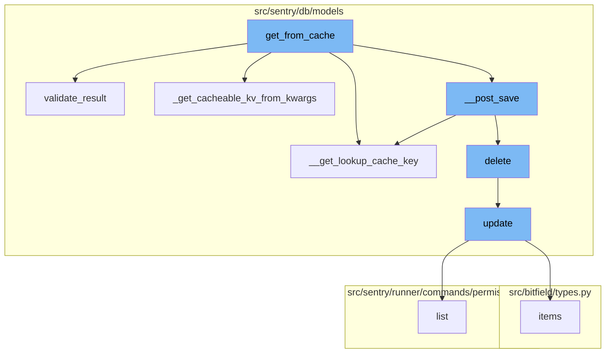
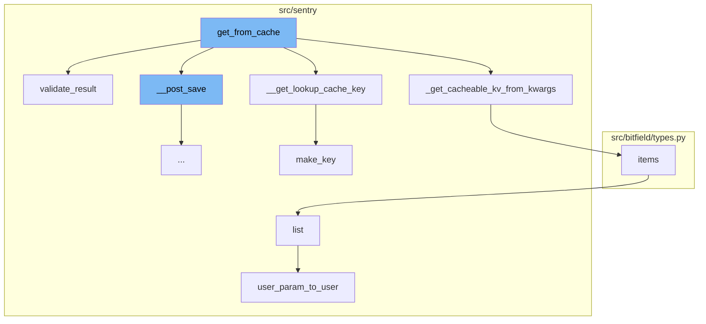
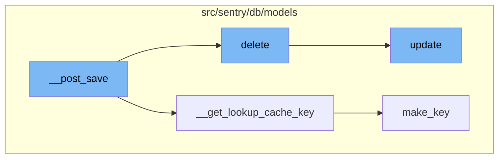
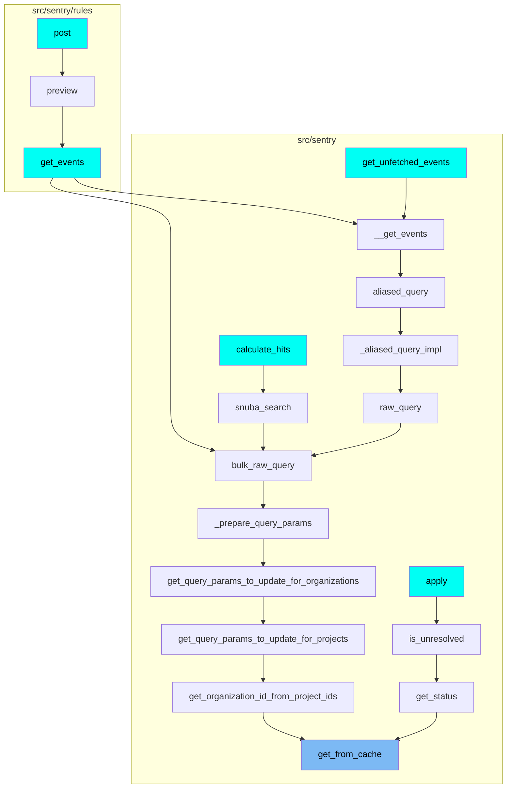

The 'get_from_cache' function is a wrapper around QuerySet.get which supports caching of the intermediate value. It is responsible for making sure the cache key is cleared on save. It raises a ValueError if the query cannot be cached.

The function starts by checking if the cache fields are set. If not, it raises a ValueError. It then calls the '\_get_cacheable_kv_from_kwargs' function to get a cacheable key-value pair from the provided arguments.

The 'get_from_cache' function then generates a cache key for the lookup using the '\__get_lookup_cache_key' function. It also sets up a local cache.

The function then validates the instance retrieved from the cache using the 'validate_result' function. If the instance is not valid, it deletes the cache key and retrieves the instance from the database.

Finally, the 'get_from_cache' function ensures the instance is pushed into the cache after it is retrieved from the database by calling the '\__post_save' function.



# Flow drill down

First, we'll zoom into this section of the flow:



<SwmSnippet path="/src/sentry/db/models/manager/base.py" line="281">

---

# get_from_cache function

The `get_from_cache` function is a wrapper around QuerySet.get which supports caching of the intermediate value. It is responsible for making sure the cache key is cleared on save. It raises a ValueError if the query cannot be cached.

```python
    def get_from_cache(
        self, use_replica: bool = settings.SENTRY_MODEL_CACHE_USE_REPLICA, **kwargs: Any
    ) -> M:
        """
        Wrapper around QuerySet.get which supports caching of the
        intermediate value.  Callee is responsible for making sure
        the cache key is cleared on save.
        """
        if not self.cache_fields:
            raise ValueError("We cannot cache this query. Just hit the database.")

        key, pk_name, value = self._get_cacheable_kv_from_kwargs(kwargs)
        if key not in self.cache_fields and key != pk_name:
            raise ValueError("We cannot cache this query. Just hit the database.")

        cache_key = self.__get_lookup_cache_key(**{key: value})
        local_cache = self._get_local_cache()

        def validate_result(inst: Any) -> M:
            if isinstance(inst, self.model) and (key != pk_name or int(value) == inst.pk):
                return inst
```

---

</SwmSnippet>

<SwmSnippet path="/src/sentry/db/models/manager/base.py" line="344">

---

## \_get_cacheable_kv_from_kwargs function

The `_get_cacheable_kv_from_kwargs` function is called within `get_from_cache`. It is used to get a cacheable key-value pair from the provided arguments. It raises a ValueError if the query cannot be cached.

```python
    def _get_cacheable_kv_from_kwargs(self, kwargs: Mapping[str, Any]) -> tuple[str, str, int]:
        if not kwargs or len(kwargs) > 1:
            raise ValueError("We cannot cache this query. Just hit the database.")

        key, value = next(iter(kwargs.items()))
        pk_name = self.model._meta.pk.name
        if key == "pk":
            key = pk_name
        # We store everything by key references (vs instances)
        if isinstance(value, Model):
            value = value.pk
        # Kill __exact since it's the default behavior
        if key.endswith("__exact"):
            key = key.split("__exact", 1)[0]
        return key, pk_name, value
```

---

</SwmSnippet>

<SwmSnippet path="/src/sentry/db/models/manager/base.py" line="259">

---

## \__get_lookup_cache_key function

The `__get_lookup_cache_key` function is used within `get_from_cache` to generate a cache key for the lookup.

```python
    def __get_lookup_cache_key(self, **kwargs: Any) -> str:
        return make_key(self.model, "modelcache", kwargs)
```

---

</SwmSnippet>

<SwmSnippet path="/src/sentry/db/models/manager/base.py" line="299">

---

## validate_result function

The `validate_result` function is used within `get_from_cache` to validate the instance retrieved from the cache. If the instance is not valid, it deletes the cache key and retrieves the instance from the database.

```python
        def validate_result(inst: Any) -> M:
            if isinstance(inst, self.model) and (key != pk_name or int(value) == inst.pk):
                return inst

            if settings.DEBUG:
                raise ValueError("Unexpected value type returned from cache")
            logger.error(
                "Cache response returned invalid value",
                extra={"instance": inst, "key": key, "model": str(self.model)},
            )
            if local_cache is not None and cache_key in local_cache:
                del local_cache[cache_key]
            cache.delete(cache_key, version=self.cache_version)
            return self.using_replica().get(**kwargs) if use_replica else self.get(**kwargs)
```

---

</SwmSnippet>

<SwmSnippet path="/src/sentry/db/models/manager/base.py" line="324">

---

## \__post_save function

The `__post_save` function is called within `get_from_cache` to ensure the instance is pushed into the cache after it is retrieved from the database.

```python
            self.__post_save(instance=result)
```

---

</SwmSnippet>

Now, lets zoom into this section of the flow:



<SwmSnippet path="/src/sentry/db/models/manager/base.py" line="188">

---

# get_from_cache Flow

The `__post_save` function is the starting point of the flow. It pushes changes to an instance into the cache and removes invalid (changed) lookup values. It uses the `__get_lookup_cache_key` function to generate the cache key and the `cache.set` function to store the instance in the cache.

```python
    def __post_save(self, instance: M, **kwargs: Any) -> None:
        """
        Pushes changes to an instance into the cache, and removes invalid (changed)
        lookup values.
        """
        pk_name = instance._meta.pk.name
        pk_names = ("pk", pk_name)
        pk_val = instance.pk
        for key in self.cache_fields:
            if key in pk_names:
                continue
            # store pointers
            value = self.__value_for_field(instance, key)
            cache.set(
                key=self.__get_lookup_cache_key(**{key: value}),
                value=pk_val,
                timeout=self.cache_ttl,
                version=self.cache_version,
            )

        # Ensure we don't serialize the database into the cache
```

---

</SwmSnippet>

<SwmSnippet path="/src/sentry/db/models/manager/base.py" line="259">

---

The `__get_lookup_cache_key` function is used to generate a unique cache key for the instance. It uses the `make_key` function to create the key.

```python
    def __get_lookup_cache_key(self, **kwargs: Any) -> str:
        return make_key(self.model, "modelcache", kwargs)
```

---

</SwmSnippet>

<SwmSnippet path="/src/sentry/db/models/paranoia.py" line="24">

---

The `delete` function is called next in the flow. It marks the instance as deleted by updating the `date_deleted` attribute to the current time.

```python
    def delete(self) -> tuple[int, dict[str, int]]:
        self.update(date_deleted=timezone.now())
        return _bogus_delete_return_value()
```

---

</SwmSnippet>

<SwmSnippet path="/src/sentry/db/models/query.py" line="86">

---

The `update` function is used to update specified attributes on the instance. It is used in the `delete` function to set the `date_deleted` attribute.

```python
def update(instance: BaseModel, using: str | None = None, **kwargs: Any) -> int:
    """
    Updates specified attributes on the current instance.
    """
    assert instance.pk, "Cannot update an instance that has not yet been created."

    using = using or router.db_for_write(instance.__class__, instance=instance)

    for field in instance._meta.fields:
        if getattr(field, "auto_now", False) and field.name not in kwargs:
            kwargs[field.name] = field.pre_save(instance, False)

    affected = (
        instance.__class__.objects.using(using)
        .filter(pk=instance.pk)
        # Disable the post update query signal since we're going to send a more specific `post_save` signal here.
        .with_post_update_signal(False)
        .update(**kwargs)
    )
    for k, v in kwargs.items():
        setattr(instance, k, _handle_value(instance, v))
```

---

</SwmSnippet>

<SwmSnippet path="/src/sentry/db/models/manager/base.py" line="61">

---

The `make_key` function is used to generate a unique key for the cache. It is used in the `__get_lookup_cache_key` function.

```python
def make_key(model: Any, prefix: str, kwargs: Mapping[str, Model | int | str]) -> str:
    kwargs_bits = []
    for k, v in sorted(kwargs.items()):
        k = __prep_key(model, k)
        v = smart_str(__prep_value(model, k, v))
        kwargs_bits.append(f"{k}={v}")
    kwargs_bits_str = ":".join(kwargs_bits)

    return f"{prefix}:{model.__name__}:{md5_text(kwargs_bits_str).hexdigest()}"
```

---

</SwmSnippet>

# Where is this flow used?

This flow is used multiple times in the codebase as represented in the following diagram:

(Note - these are only some of the entry points of this flow)



&nbsp;

*This is an auto-generated document by Swimm AI 🌊 and has not yet been verified by a human*

<SwmMeta version="3.0.0" repo-id="Z2l0aHViJTNBJTNBc2VudHJ5LWRlbW8lM0ElM0FTd2ltbS1EZW1v" repo-name="sentry-demo" doc-type="flows"><sup>Powered by [Swimm](/)</sup></SwmMeta>
