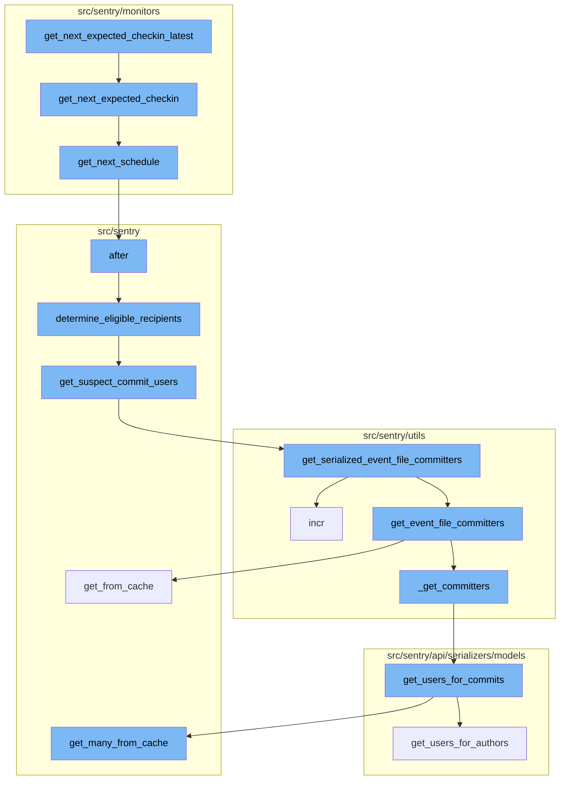
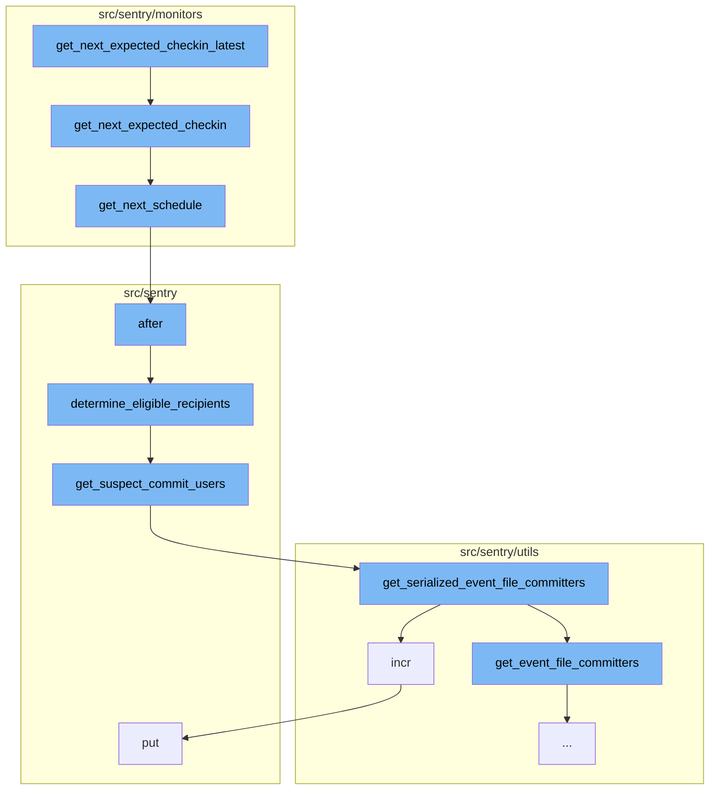
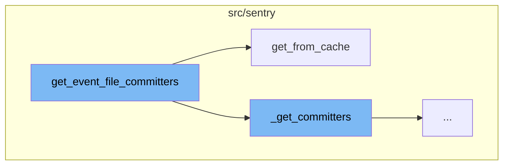
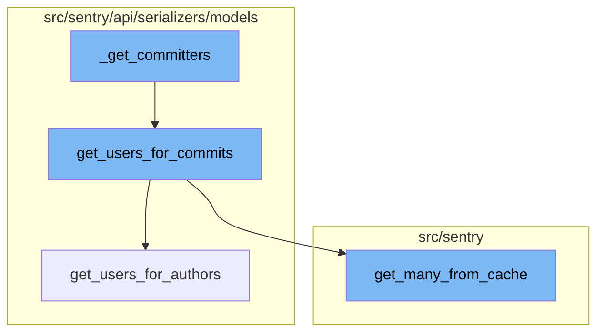

<SwmSnippet path="/src/sentry/monitors/models.py" line="348">

---

# get_next_expected_checkin_latest Function

The `get_next_expected_checkin_latest` function computes the latest time we will expect the next checkin at given the most recent checkin time. This is determined by the user-configured margin. It uses the `get_next_expected_checkin` function to get the next expected checkin time.

```python
    def get_next_expected_checkin_latest(self, last_checkin: datetime) -> datetime:
        """
        Computes the latest time we will expect the next checkin at given the
        most recent checkin time. This is determined by the user-configured
        margin.
        """
        from sentry.monitors.utils import get_checkin_margin

        next_checkin = self.get_next_expected_checkin(last_checkin)
        return next_checkin + get_checkin_margin(self.config.get("checkin_margin"))
```

---

</SwmSnippet>

<SwmSnippet path="/src/sentry/monitors/models.py" line="340">

---

# get_next_expected_checkin Function

The `get_next_expected_checkin` function computes the next expected checkin time given the most recent checkin time. It uses the `get_next_schedule` function to determine the next timestamp for a schedule from the reference timestamp.

```python
    def get_next_expected_checkin(self, last_checkin: datetime) -> datetime:
        """
        Computes the next expected checkin time given the most recent checkin time
        """
        from sentry.monitors.schedule import get_next_schedule

        return get_next_schedule(last_checkin.astimezone(self.timezone), self.schedule)
```

---

</SwmSnippet>

<SwmSnippet path="/src/sentry/monitors/schedule.py" line="18">

---

# get_next_schedule Function

The `get_next_schedule` function determines the next timestamp for a schedule from the reference timestamp. It supports both crontab and interval schedule types.

```python
def get_next_schedule(
    reference_ts: datetime,
    schedule: ScheduleConfig,
) -> datetime:
    """
    Given the schedule type and schedule, determine the next timestamp for a
    schedule from the reference_ts

    Examples:

    >>> get_next_schedule('05:30', CrontabSchedule('0 * * * *'))
    >>> 06:00

    >>> get_next_schedule('05:30', CrontabSchedule('30 * * * *'))
    >>> 06:30

    >>> get_next_schedule('05:35', IntervalSchedule(interval=2, unit='hour'))
    >>> 07:35
    """
    # Ensure we clamp the expected time down to the minute, that is the level
    # of granularity we're able to support
```

---

</SwmSnippet>

<SwmSnippet path="/src/sentry/mail/actions.py" line="37">

---

# after Function

The `after` function is used to determine the eligible recipients for a notification after an event. It uses the `determine_eligible_recipients` function to either get the individual recipient from the target type/id or the owners as determined by rules for this project and event.

```python
    def after(self, event, notification_uuid: str | None = None):
        group = event.group
        extra = {
            "event_id": event.event_id,
            "group_id": group.id,
            "notification_uuid": notification_uuid,
        }
        group = event.group

        target_type = ActionTargetType(self.data["targetType"])
        target_identifier = self.data.get("targetIdentifier", None)
        skip_digests = self.data.get("skipDigests", False)

        fallthrough_choice = self.data.get("fallthroughType", None)
        fallthrough_type = (
            FallthroughChoiceType(fallthrough_choice)
            if fallthrough_choice
            else FallthroughChoiceType.ACTIVE_MEMBERS
        )

        if not determine_eligible_recipients(
```

---

</SwmSnippet>

<SwmSnippet path="/src/sentry/notifications/utils/participants.py" line="292">

---

# determine_eligible_recipients Function

The `determine_eligible_recipients` function gets the individual recipient from the target type/id or the owners as determined by rules for this project and event. It uses the `get_suspect_commit_users` function to get a list of users that are suspect committers for the given event.

```python
def determine_eligible_recipients(
    project: Project,
    target_type: ActionTargetType,
    target_identifier: int | None = None,
    event: Event | None = None,
    fallthrough_choice: FallthroughChoiceType | None = None,
) -> Iterable[Actor]:
    """
    Either get the individual recipient from the target type/id or the
    owners as determined by rules for this project and event.
    """
    if not (project and project.teams.exists()):
        logger.debug("Tried to send notification to invalid project: %s", project)

    elif target_type == ActionTargetType.MEMBER:
        user = get_user_from_identifier(project, target_identifier)
        if user:
            return [Actor.from_object(user)]

    elif target_type == ActionTargetType.TEAM:
        team = get_team_from_identifier(project, target_identifier)
```

---

</SwmSnippet>

<SwmSnippet path="/src/sentry/notifications/utils/participants.py" line="265">

---

# get_suspect_commit_users Function

The `get_suspect_commit_users` function returns a list of users that are suspect committers for the given event. It uses the `get_serialized_event_file_committers` function to get the serialized event file committers.

```python
def get_suspect_commit_users(project: Project, event: Event) -> list[RpcUser]:
    """
    Returns a list of users that are suspect committers for the given event.

    `project`: The project that the event is associated to
    `event`: The event that suspect committers are wanted for
    """

    committers: Sequence[AuthorCommitsSerialized] = get_serialized_event_file_committers(
        project, event
    )
    user_emails = [committer["author"]["email"] for committer in committers]  # type: ignore[index]
    suspect_committers = user_service.get_many_by_email(emails=user_emails, is_verified=True)
    in_project_user_ids = set(
        OrganizationMember.objects.filter(
            teams__projectteam__project__in=[project],
            user_id__in=[owner.id for owner in suspect_committers],
        ).values_list("user_id", flat=True)
    )

    return [committer for committer in suspect_committers if committer.id in in_project_user_ids]
```

---

</SwmSnippet>

<SwmSnippet path="/src/sentry/utils/committers.py" line="295">

---

# get_serialized_event_file_committers Function

The `get_serialized_event_file_committers` function gets the serialized event file committers. It uses the `incr` function to increment a metric.

```python
def get_serialized_event_file_committers(
    project: Project, event: Event, frame_limit: int = 25
) -> Sequence[AuthorCommitsSerialized]:

    group_owners = GroupOwner.objects.filter(
        group_id=event.group_id,
        project=project,
        organization_id=project.organization_id,
        type=GroupOwnerType.SUSPECT_COMMIT.value,
        context__isnull=False,
    ).order_by("-date_added")

    if len(group_owners) > 0:
        owner = next(filter(lambda go: go.context.get("commitId"), group_owners), None)
        if not owner:
            return []
        commit = Commit.objects.get(id=owner.context.get("commitId"))
        commit_author = commit.author

        if not commit_author:
            return []
```

---

</SwmSnippet>

<SwmSnippet path="/src/sentry/utils/metrics.py" line="101">

---

# incr Function

The `incr` function increments a metric. It is used to track the number of notifications sent.

```python
    def incr(
        self,
        key: str,
        instance: str | None = None,
        tags: Tags | None = None,
        amount: int = 1,
        sample_rate: float = settings.SENTRY_METRICS_SAMPLE_RATE,
    ) -> None:
        if not self._started:
            self._start()
        self.q.put((key, instance, tags, amount, sample_rate))
```

---

</SwmSnippet>

<SwmSnippet path="/src/sentry/utils/committers.py" line="232">

---

# get_event_file_committers Function

The `get_event_file_committers` function is responsible for retrieving the committers of a file associated with an event. It fetches the group associated with the event from the cache, retrieves the relevant releases and commits, and processes the event frames to identify the relevant file paths. It then matches these paths with the commits to identify the committers.

```python
def get_event_file_committers(
    project: Project,
    group_id: int,
    event_frames: Sequence[Mapping[str, Any]],
    event_platform: str,
    frame_limit: int = 25,
    sdk_name: str | None = None,
) -> Sequence[AuthorCommits]:
    group = Group.objects.get_from_cache(id=group_id)

    first_release_version = group.get_first_release()
    if not first_release_version:
        raise Release.DoesNotExist

    releases = get_previous_releases(project, first_release_version)
    if not releases:
        raise Release.DoesNotExist

    commits = _get_commits(releases)
    if not commits:
        raise Commit.DoesNotExist
```

---

</SwmSnippet>

<SwmSnippet path="/src/sentry/db/models/manager/base.py" line="281">

---

# get_from_cache Function

The `get_from_cache` function is used within `get_event_file_committers` to retrieve the group associated with the event from the cache. This function is a wrapper around QuerySet.get and supports caching of the intermediate value. It ensures that the cache key is cleared on save and handles cases where the required data is not found in the cache.

```python
    def get_from_cache(
        self, use_replica: bool = settings.SENTRY_MODEL_CACHE_USE_REPLICA, **kwargs: Any
    ) -> M:
        """
        Wrapper around QuerySet.get which supports caching of the
        intermediate value.  Callee is responsible for making sure
        the cache key is cleared on save.
        """
        if not self.cache_fields:
            raise ValueError("We cannot cache this query. Just hit the database.")

        key, pk_name, value = self._get_cacheable_kv_from_kwargs(kwargs)
        if key not in self.cache_fields and key != pk_name:
            raise ValueError("We cannot cache this query. Just hit the database.")

        cache_key = self.__get_lookup_cache_key(**{key: value})
        local_cache = self._get_local_cache()

        def validate_result(inst: Any) -> M:
            if isinstance(inst, self.model) and (key != pk_name or int(value) == inst.pk):
                return inst
```

---

</SwmSnippet>

<SwmSnippet path="/src/sentry/utils/committers.py" line="149">

---

# \_get_committers Function

The `_get_committers` function is used to extract unique committers from the provided annotated frames and commits. It organizes them based on a heuristic where the first frame is worth 5 points, the second is worth 4, and so on. The function then returns a sequence of author commits.

```python
def _get_committers(
    annotated_frames: Sequence[AnnotatedFrame],
    commits: Sequence[tuple[Commit, int]],
) -> Sequence[AuthorCommits]:
    # extract the unique committers and return their serialized sentry accounts
    committers: MutableMapping[int, int] = defaultdict(int)

    # organize them by this heuristic (first frame is worth 5 points, second is worth 4, etc.)
    limit = 5
    for annotated_frame in annotated_frames:
        if limit == 0:
            break
        for commit, score in annotated_frame["commits"]:
            if not commit.author_id:
                continue
            committers[commit.author_id] += limit
            limit -= 1
            if limit == 0:
                break

    author_users: Mapping[str, Author] = get_users_for_commits([c for c, _ in commits])
```

---

</SwmSnippet>

<SwmSnippet path="/src/sentry/api/serializers/models/commit.py" line="12">

---

# get_users_for_commits Function

The `get_users_for_commits` function retrieves users associated with the commits. It first fetches authors from the cache and if authors exist, it returns users for these authors. If the authors do not exist, it returns an empty dictionary.

```python
def get_users_for_commits(item_list, user=None) -> Mapping[str, Author]:
    authors = list(
        CommitAuthor.objects.get_many_from_cache([i.author_id for i in item_list if i.author_id])
    )

    if authors:
        org_ids = {item.organization_id for item in item_list}
        if len(org_ids) == 1:
            return get_users_for_authors(organization_id=org_ids.pop(), authors=authors, user=user)
    return {}
```

---

</SwmSnippet>

<SwmSnippet path="/src/sentry/api/serializers/models/release.py" line="224">

---

# get_users_for_authors Function

The `get_users_for_authors` function returns a dictionary mapping author_id to user, if a Sentry user object exists for that email. If there is no matching Sentry user, a dictionary representation of that author is returned. The function fetches users from the cache and if missed, it filters users based on the emails provided in the commits and that belong to the organization associated with the release.

```python
def get_users_for_authors(organization_id, authors, user=None) -> Mapping[str, Author]:
    """
    Returns a dictionary of author_id => user, if a Sentry
    user object exists for that email. If there is no matching
    Sentry user, a {user, email} dict representation of that
    author is returned.
    e.g.
    {
        '<author-id-1>': serialized(<User id=1, ...>),
        '<author-id-2>': {'email': 'not-a-user@example.com', 'name': 'dunno'},
        '<author-id-3>': serialized(<User id=3, ...>),
        ...
    }
    """
    results = {}

    fetched = cache.get_many(
        [_user_to_author_cache_key(organization_id, author) for author in authors]
    )
    if fetched:
        missed = []
```

---

</SwmSnippet>

<SwmSnippet path="/src/sentry/db/models/manager/base.py" line="360">

---

# get_many_from_cache Function

The `get_many_from_cache` function is a wrapper around `QuerySet.filter(pk__in=values)` which supports caching of the intermediate value. It fetches results from the cache and if missed, it fetches from the database. The function ensures that the cache is updated with the database results.

```python
    def get_many_from_cache(self, values: Collection[str | int], key: str = "pk") -> Sequence[Any]:
        """
        Wrapper around `QuerySet.filter(pk__in=values)` which supports caching of
        the intermediate value.  Callee is responsible for making sure the
        cache key is cleared on save.

        NOTE: We can only query by primary key or some other unique identifier.
        It is not possible to e.g. run `Project.objects.get_many_from_cache([1,
        2, 3], key="organization_id")` and get back all projects belonging to
        those orgs. The length of the return value is bounded by the length of
        `values`.

        For most models, if one attempts to use a non-PK value this will just
        degrade to a DB query, like with `get_from_cache`.
        """

        pk_name = self.model._meta.pk.name

        if key == "pk":
            key = pk_name

```

---

</SwmSnippet>



# Flow drill down

First, we'll zoom into this section of the flow:



<SwmSnippet path="/src/sentry/monitors/models.py" line="348">

---

# get_next_expected_checkin_latest Function

The `get_next_expected_checkin_latest` function computes the latest time we will expect the next checkin at given the most recent checkin time. This is determined by the user-configured margin. It uses the `get_next_expected_checkin` function to get the next expected checkin time.

```python
    def get_next_expected_checkin_latest(self, last_checkin: datetime) -> datetime:
        """
        Computes the latest time we will expect the next checkin at given the
        most recent checkin time. This is determined by the user-configured
        margin.
        """
        from sentry.monitors.utils import get_checkin_margin

        next_checkin = self.get_next_expected_checkin(last_checkin)
        return next_checkin + get_checkin_margin(self.config.get("checkin_margin"))
```

---

</SwmSnippet>

<SwmSnippet path="/src/sentry/monitors/models.py" line="340">

---

# get_next_expected_checkin Function

The `get_next_expected_checkin` function computes the next expected checkin time given the most recent checkin time. It uses the `get_next_schedule` function to determine the next timestamp for a schedule from the reference timestamp.

```python
    def get_next_expected_checkin(self, last_checkin: datetime) -> datetime:
        """
        Computes the next expected checkin time given the most recent checkin time
        """
        from sentry.monitors.schedule import get_next_schedule

        return get_next_schedule(last_checkin.astimezone(self.timezone), self.schedule)
```

---

</SwmSnippet>

<SwmSnippet path="/src/sentry/monitors/schedule.py" line="18">

---

# get_next_schedule Function

The `get_next_schedule` function determines the next timestamp for a schedule from the reference timestamp. It supports both crontab and interval schedule types.

```python
def get_next_schedule(
    reference_ts: datetime,
    schedule: ScheduleConfig,
) -> datetime:
    """
    Given the schedule type and schedule, determine the next timestamp for a
    schedule from the reference_ts

    Examples:

    >>> get_next_schedule('05:30', CrontabSchedule('0 * * * *'))
    >>> 06:00

    >>> get_next_schedule('05:30', CrontabSchedule('30 * * * *'))
    >>> 06:30

    >>> get_next_schedule('05:35', IntervalSchedule(interval=2, unit='hour'))
    >>> 07:35
    """
    # Ensure we clamp the expected time down to the minute, that is the level
    # of granularity we're able to support
```

---

</SwmSnippet>

<SwmSnippet path="/src/sentry/mail/actions.py" line="37">

---

# after Function

The `after` function is used to determine the eligible recipients for a notification after an event. It uses the `determine_eligible_recipients` function to either get the individual recipient from the target type/id or the owners as determined by rules for this project and event.

```python
    def after(self, event, notification_uuid: str | None = None):
        group = event.group
        extra = {
            "event_id": event.event_id,
            "group_id": group.id,
            "notification_uuid": notification_uuid,
        }
        group = event.group

        target_type = ActionTargetType(self.data["targetType"])
        target_identifier = self.data.get("targetIdentifier", None)
        skip_digests = self.data.get("skipDigests", False)

        fallthrough_choice = self.data.get("fallthroughType", None)
        fallthrough_type = (
            FallthroughChoiceType(fallthrough_choice)
            if fallthrough_choice
            else FallthroughChoiceType.ACTIVE_MEMBERS
        )

        if not determine_eligible_recipients(
```

---

</SwmSnippet>

<SwmSnippet path="/src/sentry/notifications/utils/participants.py" line="292">

---

# determine_eligible_recipients Function

The `determine_eligible_recipients` function gets the individual recipient from the target type/id or the owners as determined by rules for this project and event. It uses the `get_suspect_commit_users` function to get a list of users that are suspect committers for the given event.

```python
def determine_eligible_recipients(
    project: Project,
    target_type: ActionTargetType,
    target_identifier: int | None = None,
    event: Event | None = None,
    fallthrough_choice: FallthroughChoiceType | None = None,
) -> Iterable[Actor]:
    """
    Either get the individual recipient from the target type/id or the
    owners as determined by rules for this project and event.
    """
    if not (project and project.teams.exists()):
        logger.debug("Tried to send notification to invalid project: %s", project)

    elif target_type == ActionTargetType.MEMBER:
        user = get_user_from_identifier(project, target_identifier)
        if user:
            return [Actor.from_object(user)]

    elif target_type == ActionTargetType.TEAM:
        team = get_team_from_identifier(project, target_identifier)
```

---

</SwmSnippet>

<SwmSnippet path="/src/sentry/notifications/utils/participants.py" line="265">

---

# get_suspect_commit_users Function

The `get_suspect_commit_users` function returns a list of users that are suspect committers for the given event. It uses the `get_serialized_event_file_committers` function to get the serialized event file committers.

```python
def get_suspect_commit_users(project: Project, event: Event) -> list[RpcUser]:
    """
    Returns a list of users that are suspect committers for the given event.

    `project`: The project that the event is associated to
    `event`: The event that suspect committers are wanted for
    """

    committers: Sequence[AuthorCommitsSerialized] = get_serialized_event_file_committers(
        project, event
    )
    user_emails = [committer["author"]["email"] for committer in committers]  # type: ignore[index]
    suspect_committers = user_service.get_many_by_email(emails=user_emails, is_verified=True)
    in_project_user_ids = set(
        OrganizationMember.objects.filter(
            teams__projectteam__project__in=[project],
            user_id__in=[owner.id for owner in suspect_committers],
        ).values_list("user_id", flat=True)
    )

    return [committer for committer in suspect_committers if committer.id in in_project_user_ids]
```

---

</SwmSnippet>

<SwmSnippet path="/src/sentry/utils/committers.py" line="295">

---

# get_serialized_event_file_committers Function

The `get_serialized_event_file_committers` function gets the serialized event file committers. It uses the `incr` function to increment a metric.

```python
def get_serialized_event_file_committers(
    project: Project, event: Event, frame_limit: int = 25
) -> Sequence[AuthorCommitsSerialized]:

    group_owners = GroupOwner.objects.filter(
        group_id=event.group_id,
        project=project,
        organization_id=project.organization_id,
        type=GroupOwnerType.SUSPECT_COMMIT.value,
        context__isnull=False,
    ).order_by("-date_added")

    if len(group_owners) > 0:
        owner = next(filter(lambda go: go.context.get("commitId"), group_owners), None)
        if not owner:
            return []
        commit = Commit.objects.get(id=owner.context.get("commitId"))
        commit_author = commit.author

        if not commit_author:
            return []
```

---

</SwmSnippet>

<SwmSnippet path="/src/sentry/utils/metrics.py" line="101">

---

# incr Function

The `incr` function increments a metric. It is used to track the number of notifications sent.

```python
    def incr(
        self,
        key: str,
        instance: str | None = None,
        tags: Tags | None = None,
        amount: int = 1,
        sample_rate: float = settings.SENTRY_METRICS_SAMPLE_RATE,
    ) -> None:
        if not self._started:
            self._start()
        self.q.put((key, instance, tags, amount, sample_rate))
```

---

</SwmSnippet>

Now, lets zoom into this section of the flow:



# get_next_expected_checkin_latest Flow

The `get_next_expected_checkin_latest` function is a part of a larger flow that involves retrieving and processing data related to check-ins in the system.

<SwmSnippet path="/src/sentry/utils/committers.py" line="232">

---

## get_event_file_committers Function

The `get_event_file_committers` function is responsible for retrieving the committers of a file associated with an event. It fetches the group associated with the event from the cache, retrieves the relevant releases and commits, and processes the event frames to identify the relevant file paths. It then matches these paths with the commits to identify the committers.

```python
def get_event_file_committers(
    project: Project,
    group_id: int,
    event_frames: Sequence[Mapping[str, Any]],
    event_platform: str,
    frame_limit: int = 25,
    sdk_name: str | None = None,
) -> Sequence[AuthorCommits]:
    group = Group.objects.get_from_cache(id=group_id)

    first_release_version = group.get_first_release()
    if not first_release_version:
        raise Release.DoesNotExist

    releases = get_previous_releases(project, first_release_version)
    if not releases:
        raise Release.DoesNotExist

    commits = _get_commits(releases)
    if not commits:
        raise Commit.DoesNotExist
```

---

</SwmSnippet>

<SwmSnippet path="/src/sentry/db/models/manager/base.py" line="281">

---

### get_from_cache Function

The `get_from_cache` function is used within `get_event_file_committers` to retrieve the group associated with the event from the cache. This function is a wrapper around QuerySet.get and supports caching of the intermediate value. It ensures that the cache key is cleared on save and handles cases where the required data is not found in the cache.

```python
    def get_from_cache(
        self, use_replica: bool = settings.SENTRY_MODEL_CACHE_USE_REPLICA, **kwargs: Any
    ) -> M:
        """
        Wrapper around QuerySet.get which supports caching of the
        intermediate value.  Callee is responsible for making sure
        the cache key is cleared on save.
        """
        if not self.cache_fields:
            raise ValueError("We cannot cache this query. Just hit the database.")

        key, pk_name, value = self._get_cacheable_kv_from_kwargs(kwargs)
        if key not in self.cache_fields and key != pk_name:
            raise ValueError("We cannot cache this query. Just hit the database.")

        cache_key = self.__get_lookup_cache_key(**{key: value})
        local_cache = self._get_local_cache()

        def validate_result(inst: Any) -> M:
            if isinstance(inst, self.model) and (key != pk_name or int(value) == inst.pk):
                return inst
```

---

</SwmSnippet>

<SwmSnippet path="/src/sentry/utils/committers.py" line="292">

---

## \_get_committers Function

The `_get_committers` function is called within `get_event_file_committers` to process the annotated frames and relevant commits and return the committers. This function is a part of the flow but its definition is not provided in the context.

```python
    return _get_committers(annotated_frames, relevant_commits)
```

---

</SwmSnippet>

Now, lets zoom into this section of the flow:



<SwmSnippet path="/src/sentry/utils/committers.py" line="149">

---

# \_get_committers Function

The `_get_committers` function is used to extract unique committers from the provided annotated frames and commits. It organizes them based on a heuristic where the first frame is worth 5 points, the second is worth 4, and so on. The function then returns a sequence of author commits.

```python
def _get_committers(
    annotated_frames: Sequence[AnnotatedFrame],
    commits: Sequence[tuple[Commit, int]],
) -> Sequence[AuthorCommits]:
    # extract the unique committers and return their serialized sentry accounts
    committers: MutableMapping[int, int] = defaultdict(int)

    # organize them by this heuristic (first frame is worth 5 points, second is worth 4, etc.)
    limit = 5
    for annotated_frame in annotated_frames:
        if limit == 0:
            break
        for commit, score in annotated_frame["commits"]:
            if not commit.author_id:
                continue
            committers[commit.author_id] += limit
            limit -= 1
            if limit == 0:
                break

    author_users: Mapping[str, Author] = get_users_for_commits([c for c, _ in commits])
```

---

</SwmSnippet>

<SwmSnippet path="/src/sentry/api/serializers/models/commit.py" line="12">

---

# get_users_for_commits Function

The `get_users_for_commits` function retrieves users associated with the commits. It first fetches authors from the cache and if authors exist, it returns users for these authors. If the authors do not exist, it returns an empty dictionary.

```python
def get_users_for_commits(item_list, user=None) -> Mapping[str, Author]:
    authors = list(
        CommitAuthor.objects.get_many_from_cache([i.author_id for i in item_list if i.author_id])
    )

    if authors:
        org_ids = {item.organization_id for item in item_list}
        if len(org_ids) == 1:
            return get_users_for_authors(organization_id=org_ids.pop(), authors=authors, user=user)
    return {}
```

---

</SwmSnippet>

<SwmSnippet path="/src/sentry/api/serializers/models/release.py" line="224">

---

# get_users_for_authors Function

The `get_users_for_authors` function returns a dictionary mapping author_id to user, if a Sentry user object exists for that email. If there is no matching Sentry user, a dictionary representation of that author is returned. The function fetches users from the cache and if missed, it filters users based on the emails provided in the commits and that belong to the organization associated with the release.

```python
def get_users_for_authors(organization_id, authors, user=None) -> Mapping[str, Author]:
    """
    Returns a dictionary of author_id => user, if a Sentry
    user object exists for that email. If there is no matching
    Sentry user, a {user, email} dict representation of that
    author is returned.
    e.g.
    {
        '<author-id-1>': serialized(<User id=1, ...>),
        '<author-id-2>': {'email': 'not-a-user@example.com', 'name': 'dunno'},
        '<author-id-3>': serialized(<User id=3, ...>),
        ...
    }
    """
    results = {}

    fetched = cache.get_many(
        [_user_to_author_cache_key(organization_id, author) for author in authors]
    )
    if fetched:
        missed = []
```

---

</SwmSnippet>

<SwmSnippet path="/src/sentry/db/models/manager/base.py" line="360">

---

# get_many_from_cache Function

The `get_many_from_cache` function is a wrapper around `QuerySet.filter(pk__in=values)` which supports caching of the intermediate value. It fetches results from the cache and if missed, it fetches from the database. The function ensures that the cache is updated with the database results.

```python
    def get_many_from_cache(self, values: Collection[str | int], key: str = "pk") -> Sequence[Any]:
        """
        Wrapper around `QuerySet.filter(pk__in=values)` which supports caching of
        the intermediate value.  Callee is responsible for making sure the
        cache key is cleared on save.

        NOTE: We can only query by primary key or some other unique identifier.
        It is not possible to e.g. run `Project.objects.get_many_from_cache([1,
        2, 3], key="organization_id")` and get back all projects belonging to
        those orgs. The length of the return value is bounded by the length of
        `values`.

        For most models, if one attempts to use a non-PK value this will just
        degrade to a DB query, like with `get_from_cache`.
        """

        pk_name = self.model._meta.pk.name

        if key == "pk":
            key = pk_name

```

---

</SwmSnippet>

&nbsp;

*This is an auto-generated document by Swimm AI 🌊 and has not yet been verified by a human*

<SwmMeta version="3.0.0" repo-id="Z2l0aHViJTNBJTNBc2VudHJ5LWRlbW8lM0ElM0FTd2ltbS1EZW1v" repo-name="sentry-demo" doc-type="flows"><sup>Powered by [Swimm](/)</sup></SwmMeta>
