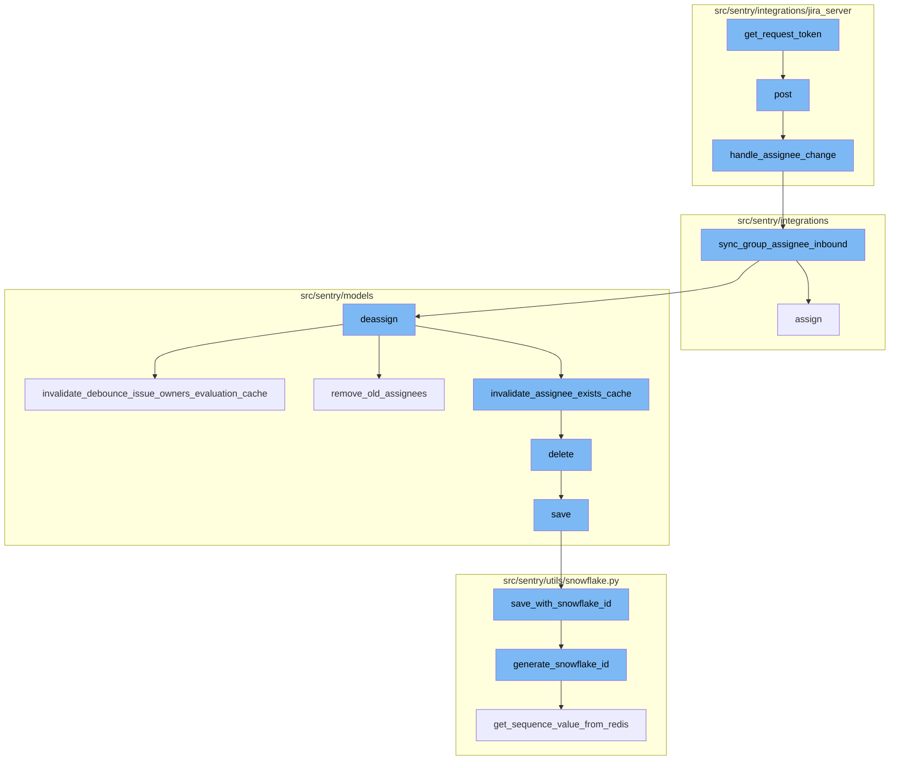
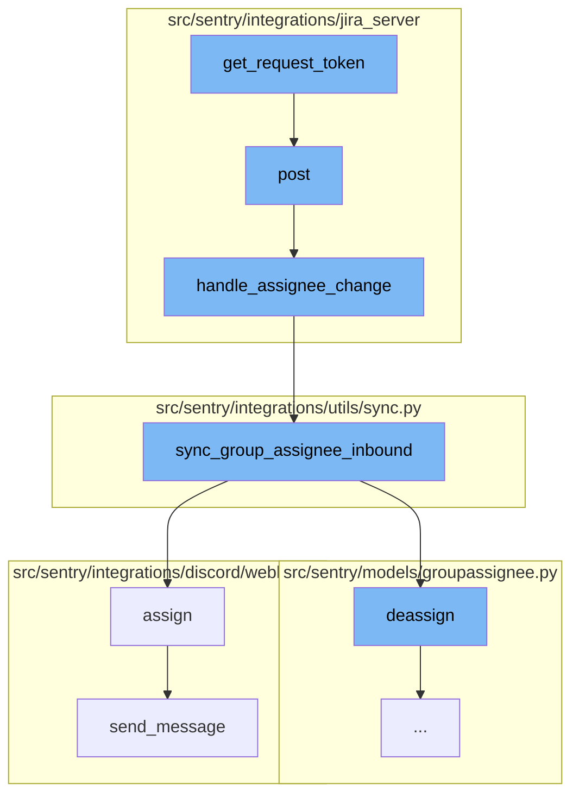
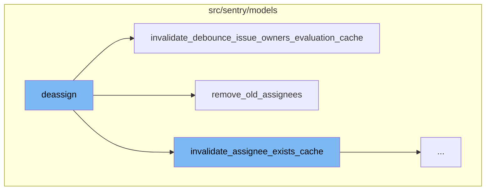
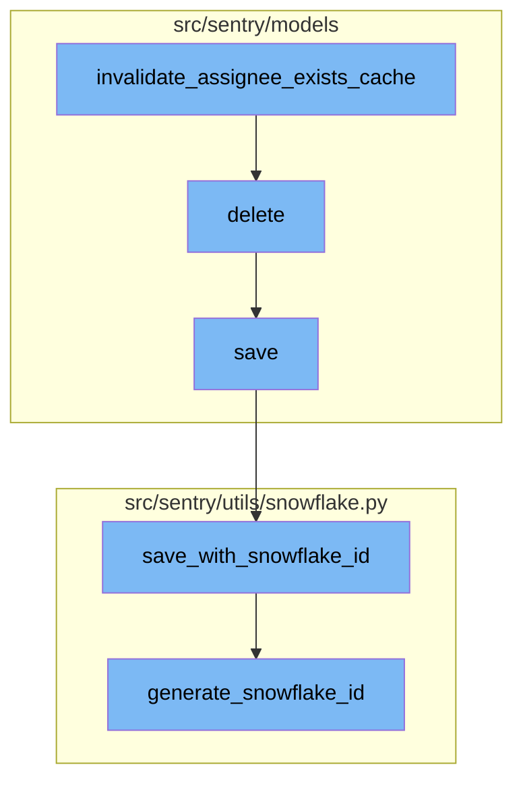

<SwmSnippet path="/src/sentry/integrations/jira_server/client.py" line="242">

---

# get_request_token

The `get_request_token` function is the initial step in the OAuth flow. It retrieves a request token from a specified URL, which is then used to authenticate the user.

```python
    def get_request_token(self):
        """
        Step 1 of the oauth flow.
        Get a request token that we can have the user verify.
        """
        url = self.request_token_url.format(self.base_url)
        resp = self.post(url, allow_text=True)
        return dict(parse_qsl(resp.text))
```

---

</SwmSnippet>

<SwmSnippet path="/src/sentry/integrations/jira_server/webhooks.py" line="63">

---

# post

The `post` function is called after `get_request_token`. It handles the incoming request, clears any existing tags and context, and attempts to get the integration from the token. If the data contains a 'changelog', it calls the `handle_assignee_change` function.

```python
    def post(self, request: Request, token, *args, **kwargs) -> Response:
        clear_tags_and_context()
        extra = {}
        try:
            integration = get_integration_from_token(token)
            extra["integration_id"] = integration.id
        except ValueError as err:
            extra.update({"token": token, "error": str(err)})
            logger.warning("token-validation-error", extra=extra)
            metrics.incr("jira_server.webhook.invalid_token")
            return self.respond(status=400)

        data = request.data

        # Note: If we ever process more webhooks from jira server
        # we also need to update JiraServerRequestParser
        if not data.get("changelog"):
            logger.info("missing-changelog", extra=extra)
            return self.respond()

        try:
```

---

</SwmSnippet>

<SwmSnippet path="/src/sentry/integrations/jira_server/utils/api.py" line="25">

---

# handle_assignee_change

The `handle_assignee_change` function checks if the assignee field has changed. If there is no assignee, it assumes the issue was unassigned and calls the `sync_group_assignee_inbound` function with assign set to False. If there is an assignee, it retrieves the assignee's email and calls the `sync_group_assignee_inbound` function with assign set to True.

```python
def handle_assignee_change(
    integration: RpcIntegration | Integration,
    data: Mapping[str, Any],
) -> None:
    assignee_changed = any(
        item for item in data["changelog"]["items"] if item["field"] == "assignee"
    )
    if not assignee_changed:
        return

    fields = data["issue"]["fields"]

    # If there is no assignee, assume it was unassigned.
    assignee = fields.get("assignee")
    issue_key = data["issue"]["key"]

    if assignee is None:
        sync_group_assignee_inbound(integration, None, issue_key, assign=False)
        return

    email = get_assignee_email(integration, assignee)
```

---

</SwmSnippet>

<SwmSnippet path="/src/sentry/integrations/utils/sync.py" line="64">

---

# sync_group_assignee_inbound

The `sync_group_assignee_inbound` function assigns linked groups to matching users based on the provided email and external issue key. If assign is set to False, it deassigns the group.

```python
def sync_group_assignee_inbound(
    integration: RpcIntegration,
    email: str | None,
    external_issue_key: str,
    assign: bool = True,
) -> Sequence[Group]:
    """
    Given an integration, user email address and an external issue key,
    assign linked groups to matching users. Checks project membership.
    Returns a list of groups that were successfully assigned.
    """

    logger = logging.getLogger(f"sentry.integrations.{integration.provider}")

    orgs_with_sync_enabled = where_should_sync(integration, "inbound_assignee")
    affected_groups = Group.objects.get_groups_by_external_issue(
        integration,
        orgs_with_sync_enabled,
        external_issue_key,
    )
    log_context = {
```

---

</SwmSnippet>

<SwmSnippet path="/src/sentry/integrations/discord/webhooks/message_component.py" line="137">

---

# assign

The `assign` function is called if the `sync_group_assignee_inbound` function was called with assign set to True. It updates the group with the selected assignee and sends a message indicating that the assignee was updated.

```python
    def assign(self) -> Response:
        assignee = self.request.get_selected_options()[0]

        self.update_group(
            {
                "assignedTo": assignee,
                "integration": ActivityIntegration.DISCORD.value,
            }
        )

        logger.info(
            "discord.assign.dialog",
            extra={
                "assignee": assignee,
                "user": self.request.user,
            },
        )

        assert self.request.user is not None

        analytics.record(
```

---

</SwmSnippet>

<SwmSnippet path="/src/sentry/integrations/discord/webhooks/handler.py" line="24">

---

# send_message

The `send_message` function sends a new follow-up message. If the message is a string, it creates a new DiscordMessageBuilder instance with the message and sends it.

```python
    def send_message(self, message: str | DiscordMessageBuilder, update: bool = False) -> Response:
        """Sends a new follow up message."""
        response_type = DiscordResponseTypes.UPDATE if update else DiscordResponseTypes.MESSAGE

        if isinstance(message, str):
            message = DiscordMessageBuilder(
                content=message, flags=DiscordMessageFlags().set_ephemeral()
            )
        return Response(
            {
                "type": response_type,
                "data": message.build(),
            },
            status=200,
        )
```

---

</SwmSnippet>

<SwmSnippet path="/src/sentry/models/groupassignee.py" line="197">

---

# deassign

The `deassign` function is used to remove the assignment of a group. It first checks if there is a previous assignee for the group and if so, it deletes the assignment. It then creates an activity for the unassignment and records the group history. It also invalidates the assignee cache for the group and syncs the Sentry assignee to external issues.

```python
    def deassign(
        self,
        group: Group,
        acting_user: User | RpcUser | None = None,
        assigned_to: Team | RpcUser | None = None,
        extra: dict[str, str] | None = None,
    ) -> None:
        from sentry.integrations.utils import sync_group_assignee_outbound
        from sentry.models.activity import Activity
        from sentry.models.projectownership import ProjectOwnership

        try:
            previous_groupassignee = self.get(group=group)
        except GroupAssignee.DoesNotExist:
            previous_groupassignee = None

        affected = self.filter(group=group)[:1].count()
        self.filter(group=group).delete()

        if affected > 0:
            Activity.objects.create_group_activity(group, ActivityType.UNASSIGNED, user=acting_user)
```

---

</SwmSnippet>

<SwmSnippet path="/src/sentry/models/groupowner.py" line="125">

---

# invalidate_debounce_issue_owners_evaluation_cache

The `invalidate_debounce_issue_owners_evaluation_cache` function is used to clear the debounce issue owners cache for a group or for all groups in a project that had an event within a certain time window. This is done to ensure that the issue owners are evaluated correctly.

```python
    def invalidate_debounce_issue_owners_evaluation_cache(cls, project_id, group_id=None):
        """
        If `group_id` is provided, clear the debounce issue owners cache for that group, else clear
        the cache of all groups for a project that had an event within the
        ISSUE_OWNERS_DEBOUNCE_DURATION window.
        """
        if group_id:
            cache.delete(ISSUE_OWNERS_DEBOUNCE_KEY(group_id))
            return

        # Get all the groups for a project that had an event within the ISSUE_OWNERS_DEBOUNCE_DURATION window.
        # Any groups without events in that window would have expired their TTL in the cache.
        queryset = Group.objects.filter(
            project_id=project_id,
            last_seen__gte=timezone.now() - timedelta(seconds=ISSUE_OWNERS_DEBOUNCE_DURATION),
        ).values_list("id", flat=True)

        # Run cache invalidation in batches
        group_id_iter = queryset.iterator(chunk_size=1000)
        while True:
            group_ids = list(itertools.islice(group_id_iter, 1000))
```

---

</SwmSnippet>

<SwmSnippet path="/src/sentry/models/groupassignee.py" line="65">

---

# remove_old_assignees

The `remove_old_assignees` function is used to remove the old assignees of a group. It checks if the previous assignee is a team and if so, it deletes the group subscription for the team. If the previous assignee is a user, it deletes the group subscription for the user.

```python
    def remove_old_assignees(
        self,
        group: Group,
        previous_assignee: GroupAssignee | None,
        new_assignee_id: int | None = None,
        new_assignee_type: str | None = None,
    ) -> None:
        from sentry.models.team import Team

        if not previous_assignee:
            return

        if (
            features.has("organizations:team-workflow-notifications", group.organization)
            and previous_assignee.team
        ):
            GroupSubscription.objects.filter(
                group=group,
                project=group.project,
                team=previous_assignee.team,
                reason=GroupSubscriptionReason.assigned,
```

---

</SwmSnippet>

<SwmSnippet path="/src/sentry/models/groupowner.py" line="152">

---

# invalidate_assignee_exists_cache

The `invalidate_assignee_exists_cache` function is responsible for clearing the assignee exists cache. If a group id is provided, it clears the cache for that specific group. Otherwise, it clears the cache for all groups within a project that had an event within the `ASSIGNEE_EXISTS_DURATION` window.

```python
    def invalidate_assignee_exists_cache(cls, project_id, group_id=None):
        """
        If `group_id` is provided, clear the assignee exists cache for that group, else
        clear the cache of all groups for a project that had an event within the
        ASSIGNEE_EXISTS_DURATION window.
        """
        if group_id:
            cache.delete(ASSIGNEE_EXISTS_KEY(group_id))
            return

        # Get all the groups for a project that had an event within the ASSIGNEE_EXISTS_DURATION window.
        # Any groups without events in that window would have expired their TTL in the cache.
        queryset = Group.objects.filter(
            project_id=project_id,
            last_seen__gte=timezone.now() - timedelta(seconds=ASSIGNEE_EXISTS_DURATION),
        ).values_list("id", flat=True)

        # Run cache invalidation in batches
        group_id_iter = queryset.iterator(chunk_size=1000)
        while True:
            group_ids = list(itertools.islice(group_id_iter, 1000))
```

---

</SwmSnippet>

<SwmSnippet path="/src/sentry/models/project.py" line="722">

---

# delete

The `delete` function is used to delete a project. It first removes the notification settings for the project and then saves the project's outbox for update before deleting the project.

```python
    def delete(self, **kwargs):
        # There is no foreign key relationship so we have to manually cascade.
        notifications_service.remove_notification_settings_for_project(project_id=self.id)

        with outbox_context(transaction.atomic(router.db_for_write(Project))):
            Project.outbox_for_update(self.id, self.organization_id).save()
            return super().delete(**kwargs)
```

---

</SwmSnippet>

<SwmSnippet path="/src/sentry/models/project.py" line="365">

---

# save

The `save` function is used to save a project. If the project does not have a slug, it generates one. If the `SENTRY_USE_SNOWFLAKE` setting is enabled, it saves the project with a snowflake id using the `save_with_snowflake_id` function.

```python
    def save(self, *args, **kwargs):
        if not self.slug:
            lock = locks.get(
                f"slug:project:{self.organization_id}", duration=5, name="project_slug"
            )
            with TimedRetryPolicy(10)(lock.acquire):
                slugify_instance(
                    self,
                    self.name,
                    organization=self.organization,
                    reserved=RESERVED_PROJECT_SLUGS,
                    max_length=50,
                )

        if SENTRY_USE_SNOWFLAKE:
            snowflake_redis_key = "project_snowflake_key"
            save_with_snowflake_id(
                instance=self,
                snowflake_redis_key=snowflake_redis_key,
                save_callback=lambda: super(Project, self).save(*args, **kwargs),
            )
```

---

</SwmSnippet>

<SwmSnippet path="/src/sentry/utils/snowflake.py" line="47">

---

# save_with_snowflake_id

The `save_with_snowflake_id` function is used to save an instance of a model with a snowflake id. If the instance does not have an id, it generates a snowflake id using the `generate_snowflake_id` function and then saves the instance.

```python
def save_with_snowflake_id(
    instance: BaseModel, snowflake_redis_key: str, save_callback: Callable[[], object]
) -> None:
    assert uses_snowflake_id(
        instance.__class__
    ), "Only models decorated with uses_snowflake_id can be saved with save_with_snowflake_id()"

    for _ in range(settings.MAX_REDIS_SNOWFLAKE_RETRY_COUNTER):
        if not instance.id:
            instance.id = generate_snowflake_id(snowflake_redis_key)
        try:
            with enforce_constraints(transaction.atomic(using=router.db_for_write(type(instance)))):
                save_callback()
            return
        except IntegrityError:
            instance.id = None  # type: ignore[assignment]  # see typeddjango/django-stubs#2014
    raise MaxSnowflakeRetryError
```

---

</SwmSnippet>

<SwmSnippet path="/src/sentry/utils/snowflake.py" line="113">

---

# generate_snowflake_id

The `generate_snowflake_id` function is used to generate a snowflake id. It first gets the segment values for the version id and region id. Then it calculates the time difference from the `SENTRY_SNOWFLAKE_EPOCH_START` setting. Finally, it gets the sequence value from Redis and generates the snowflake id.

```python
def generate_snowflake_id(redis_key: str) -> int:
    segment_values = {}

    segment_values[VERSION_ID] = msb_0_ordering(settings.SNOWFLAKE_VERSION_ID, VERSION_ID.length)

    try:
        segment_values[REGION_ID] = get_local_region().snowflake_id
    except RegionContextError:  # expected if running in monolith mode
        segment_values[REGION_ID] = NULL_REGION_ID

    current_time = datetime.now().timestamp()
    # supports up to 130 years
    segment_values[TIME_DIFFERENCE] = int(current_time - settings.SENTRY_SNOWFLAKE_EPOCH_START)

    snowflake_id = 0
    (
        segment_values[TIME_DIFFERENCE],
        segment_values[REGION_SEQUENCE],
    ) = get_sequence_value_from_redis(redis_key, segment_values[TIME_DIFFERENCE])

    for segment in BIT_SEGMENT_SCHEMA:
```

---

</SwmSnippet>



# Flow drill down

First, we'll zoom into this section of the flow:



<SwmSnippet path="/src/sentry/integrations/jira_server/client.py" line="242">

---

# get_request_token

The `get_request_token` function is the first step in the OAuth flow. It retrieves a request token from the specified URL, which is then used to verify the user.

```python
    def get_request_token(self):
        """
        Step 1 of the oauth flow.
        Get a request token that we can have the user verify.
        """
        url = self.request_token_url.format(self.base_url)
        resp = self.post(url, allow_text=True)
        return dict(parse_qsl(resp.text))
```

---

</SwmSnippet>

<SwmSnippet path="/src/sentry/integrations/jira_server/webhooks.py" line="63">

---

# post

The `post` function is called next, which handles the incoming request. It clears any existing tags and context, and attempts to get the integration from the token. If the data contains a 'changelog', it calls the `handle_assignee_change` function.

```python
    def post(self, request: Request, token, *args, **kwargs) -> Response:
        clear_tags_and_context()
        extra = {}
        try:
            integration = get_integration_from_token(token)
            extra["integration_id"] = integration.id
        except ValueError as err:
            extra.update({"token": token, "error": str(err)})
            logger.warning("token-validation-error", extra=extra)
            metrics.incr("jira_server.webhook.invalid_token")
            return self.respond(status=400)

        data = request.data

        # Note: If we ever process more webhooks from jira server
        # we also need to update JiraServerRequestParser
        if not data.get("changelog"):
            logger.info("missing-changelog", extra=extra)
            return self.respond()

        try:
```

---

</SwmSnippet>

<SwmSnippet path="/src/sentry/integrations/jira_server/utils/api.py" line="25">

---

# handle_assignee_change

The `handle_assignee_change` function checks if the assignee field has changed. If there is no assignee, it assumes the issue was unassigned and calls the `sync_group_assignee_inbound` function with assign set to False. If there is an assignee, it retrieves the assignee's email and calls the `sync_group_assignee_inbound` function with assign set to True.

```python
def handle_assignee_change(
    integration: RpcIntegration | Integration,
    data: Mapping[str, Any],
) -> None:
    assignee_changed = any(
        item for item in data["changelog"]["items"] if item["field"] == "assignee"
    )
    if not assignee_changed:
        return

    fields = data["issue"]["fields"]

    # If there is no assignee, assume it was unassigned.
    assignee = fields.get("assignee")
    issue_key = data["issue"]["key"]

    if assignee is None:
        sync_group_assignee_inbound(integration, None, issue_key, assign=False)
        return

    email = get_assignee_email(integration, assignee)
```

---

</SwmSnippet>

<SwmSnippet path="/src/sentry/integrations/utils/sync.py" line="64">

---

# sync_group_assignee_inbound

The `sync_group_assignee_inbound` function assigns linked groups to matching users based on the provided email and external issue key. If assign is set to False, it deassigns the group.

```python
def sync_group_assignee_inbound(
    integration: RpcIntegration,
    email: str | None,
    external_issue_key: str,
    assign: bool = True,
) -> Sequence[Group]:
    """
    Given an integration, user email address and an external issue key,
    assign linked groups to matching users. Checks project membership.
    Returns a list of groups that were successfully assigned.
    """

    logger = logging.getLogger(f"sentry.integrations.{integration.provider}")

    orgs_with_sync_enabled = where_should_sync(integration, "inbound_assignee")
    affected_groups = Group.objects.get_groups_by_external_issue(
        integration,
        orgs_with_sync_enabled,
        external_issue_key,
    )
    log_context = {
```

---

</SwmSnippet>

<SwmSnippet path="/src/sentry/integrations/discord/webhooks/message_component.py" line="137">

---

# assign

The `assign` function is called if the `sync_group_assignee_inbound` function was called with assign set to True. It updates the group with the selected assignee and sends a message indicating that the assignee was updated.

```python
    def assign(self) -> Response:
        assignee = self.request.get_selected_options()[0]

        self.update_group(
            {
                "assignedTo": assignee,
                "integration": ActivityIntegration.DISCORD.value,
            }
        )

        logger.info(
            "discord.assign.dialog",
            extra={
                "assignee": assignee,
                "user": self.request.user,
            },
        )

        assert self.request.user is not None

        analytics.record(
```

---

</SwmSnippet>

<SwmSnippet path="/src/sentry/integrations/discord/webhooks/handler.py" line="24">

---

# send_message

The `send_message` function sends a new follow-up message. If the message is a string, it creates a new DiscordMessageBuilder instance with the message and sends it.

```python
    def send_message(self, message: str | DiscordMessageBuilder, update: bool = False) -> Response:
        """Sends a new follow up message."""
        response_type = DiscordResponseTypes.UPDATE if update else DiscordResponseTypes.MESSAGE

        if isinstance(message, str):
            message = DiscordMessageBuilder(
                content=message, flags=DiscordMessageFlags().set_ephemeral()
            )
        return Response(
            {
                "type": response_type,
                "data": message.build(),
            },
            status=200,
        )
```

---

</SwmSnippet>

Now, lets zoom into this section of the flow:



<SwmSnippet path="/src/sentry/models/groupassignee.py" line="197">

---

# Deassign Function

The `deassign` function is used to remove the assignment of a group. It first checks if there is a previous assignee for the group and if so, it deletes the assignment. It then creates an activity for the unassignment and records the group history. It also invalidates the assignee cache for the group and syncs the Sentry assignee to external issues.

```python
    def deassign(
        self,
        group: Group,
        acting_user: User | RpcUser | None = None,
        assigned_to: Team | RpcUser | None = None,
        extra: dict[str, str] | None = None,
    ) -> None:
        from sentry.integrations.utils import sync_group_assignee_outbound
        from sentry.models.activity import Activity
        from sentry.models.projectownership import ProjectOwnership

        try:
            previous_groupassignee = self.get(group=group)
        except GroupAssignee.DoesNotExist:
            previous_groupassignee = None

        affected = self.filter(group=group)[:1].count()
        self.filter(group=group).delete()

        if affected > 0:
            Activity.objects.create_group_activity(group, ActivityType.UNASSIGNED, user=acting_user)
```

---

</SwmSnippet>

<SwmSnippet path="/src/sentry/models/groupowner.py" line="125">

---

# Invalidate Debounce Issue Owners Evaluation Cache Function

The `invalidate_debounce_issue_owners_evaluation_cache` function is used to clear the debounce issue owners cache for a group or for all groups in a project that had an event within a certain time window. This is done to ensure that the issue owners are evaluated correctly.

```python
    def invalidate_debounce_issue_owners_evaluation_cache(cls, project_id, group_id=None):
        """
        If `group_id` is provided, clear the debounce issue owners cache for that group, else clear
        the cache of all groups for a project that had an event within the
        ISSUE_OWNERS_DEBOUNCE_DURATION window.
        """
        if group_id:
            cache.delete(ISSUE_OWNERS_DEBOUNCE_KEY(group_id))
            return

        # Get all the groups for a project that had an event within the ISSUE_OWNERS_DEBOUNCE_DURATION window.
        # Any groups without events in that window would have expired their TTL in the cache.
        queryset = Group.objects.filter(
            project_id=project_id,
            last_seen__gte=timezone.now() - timedelta(seconds=ISSUE_OWNERS_DEBOUNCE_DURATION),
        ).values_list("id", flat=True)

        # Run cache invalidation in batches
        group_id_iter = queryset.iterator(chunk_size=1000)
        while True:
            group_ids = list(itertools.islice(group_id_iter, 1000))
```

---

</SwmSnippet>

<SwmSnippet path="/src/sentry/models/groupassignee.py" line="65">

---

# Remove Old Assignees Function

The `remove_old_assignees` function is used to remove the old assignees of a group. It checks if the previous assignee is a team and if so, it deletes the group subscription for the team. If the previous assignee is a user, it deletes the group subscription for the user.

```python
    def remove_old_assignees(
        self,
        group: Group,
        previous_assignee: GroupAssignee | None,
        new_assignee_id: int | None = None,
        new_assignee_type: str | None = None,
    ) -> None:
        from sentry.models.team import Team

        if not previous_assignee:
            return

        if (
            features.has("organizations:team-workflow-notifications", group.organization)
            and previous_assignee.team
        ):
            GroupSubscription.objects.filter(
                group=group,
                project=group.project,
                team=previous_assignee.team,
                reason=GroupSubscriptionReason.assigned,
```

---

</SwmSnippet>

Now, lets zoom into this section of the flow:



<SwmSnippet path="/src/sentry/models/groupowner.py" line="152">

---

## Invalidate Assignee Exists Cache

The `invalidate_assignee_exists_cache` function is responsible for clearing the assignee exists cache. If a group id is provided, it clears the cache for that specific group. Otherwise, it clears the cache for all groups within a project that had an event within the `ASSIGNEE_EXISTS_DURATION` window.

```python
    def invalidate_assignee_exists_cache(cls, project_id, group_id=None):
        """
        If `group_id` is provided, clear the assignee exists cache for that group, else
        clear the cache of all groups for a project that had an event within the
        ASSIGNEE_EXISTS_DURATION window.
        """
        if group_id:
            cache.delete(ASSIGNEE_EXISTS_KEY(group_id))
            return

        # Get all the groups for a project that had an event within the ASSIGNEE_EXISTS_DURATION window.
        # Any groups without events in that window would have expired their TTL in the cache.
        queryset = Group.objects.filter(
            project_id=project_id,
            last_seen__gte=timezone.now() - timedelta(seconds=ASSIGNEE_EXISTS_DURATION),
        ).values_list("id", flat=True)

        # Run cache invalidation in batches
        group_id_iter = queryset.iterator(chunk_size=1000)
        while True:
            group_ids = list(itertools.islice(group_id_iter, 1000))
```

---

</SwmSnippet>

<SwmSnippet path="/src/sentry/models/project.py" line="722">

---

## Delete Project

The `delete` function is used to delete a project. It first removes the notification settings for the project and then saves the project's outbox for update before deleting the project.

```python
    def delete(self, **kwargs):
        # There is no foreign key relationship so we have to manually cascade.
        notifications_service.remove_notification_settings_for_project(project_id=self.id)

        with outbox_context(transaction.atomic(router.db_for_write(Project))):
            Project.outbox_for_update(self.id, self.organization_id).save()
            return super().delete(**kwargs)
```

---

</SwmSnippet>

<SwmSnippet path="/src/sentry/models/project.py" line="365">

---

## Save Project

The `save` function is used to save a project. If the project does not have a slug, it generates one. If the `SENTRY_USE_SNOWFLAKE` setting is enabled, it saves the project with a snowflake id using the `save_with_snowflake_id` function.

```python
    def save(self, *args, **kwargs):
        if not self.slug:
            lock = locks.get(
                f"slug:project:{self.organization_id}", duration=5, name="project_slug"
            )
            with TimedRetryPolicy(10)(lock.acquire):
                slugify_instance(
                    self,
                    self.name,
                    organization=self.organization,
                    reserved=RESERVED_PROJECT_SLUGS,
                    max_length=50,
                )

        if SENTRY_USE_SNOWFLAKE:
            snowflake_redis_key = "project_snowflake_key"
            save_with_snowflake_id(
                instance=self,
                snowflake_redis_key=snowflake_redis_key,
                save_callback=lambda: super(Project, self).save(*args, **kwargs),
            )
```

---

</SwmSnippet>

<SwmSnippet path="/src/sentry/utils/snowflake.py" line="47">

---

## Save with Snowflake ID

The `save_with_snowflake_id` function is used to save an instance of a model with a snowflake id. If the instance does not have an id, it generates a snowflake id using the `generate_snowflake_id` function and then saves the instance.

```python
def save_with_snowflake_id(
    instance: BaseModel, snowflake_redis_key: str, save_callback: Callable[[], object]
) -> None:
    assert uses_snowflake_id(
        instance.__class__
    ), "Only models decorated with uses_snowflake_id can be saved with save_with_snowflake_id()"

    for _ in range(settings.MAX_REDIS_SNOWFLAKE_RETRY_COUNTER):
        if not instance.id:
            instance.id = generate_snowflake_id(snowflake_redis_key)
        try:
            with enforce_constraints(transaction.atomic(using=router.db_for_write(type(instance)))):
                save_callback()
            return
        except IntegrityError:
            instance.id = None  # type: ignore[assignment]  # see typeddjango/django-stubs#2014
    raise MaxSnowflakeRetryError
```

---

</SwmSnippet>

<SwmSnippet path="/src/sentry/utils/snowflake.py" line="113">

---

## Generate Snowflake ID

The `generate_snowflake_id` function is used to generate a snowflake id. It first gets the segment values for the version id and region id. Then it calculates the time difference from the `SENTRY_SNOWFLAKE_EPOCH_START` setting. Finally, it gets the sequence value from Redis and generates the snowflake id.

```python
def generate_snowflake_id(redis_key: str) -> int:
    segment_values = {}

    segment_values[VERSION_ID] = msb_0_ordering(settings.SNOWFLAKE_VERSION_ID, VERSION_ID.length)

    try:
        segment_values[REGION_ID] = get_local_region().snowflake_id
    except RegionContextError:  # expected if running in monolith mode
        segment_values[REGION_ID] = NULL_REGION_ID

    current_time = datetime.now().timestamp()
    # supports up to 130 years
    segment_values[TIME_DIFFERENCE] = int(current_time - settings.SENTRY_SNOWFLAKE_EPOCH_START)

    snowflake_id = 0
    (
        segment_values[TIME_DIFFERENCE],
        segment_values[REGION_SEQUENCE],
    ) = get_sequence_value_from_redis(redis_key, segment_values[TIME_DIFFERENCE])

    for segment in BIT_SEGMENT_SCHEMA:
```

---

</SwmSnippet>

&nbsp;

*This is an auto-generated document by Swimm AI 🌊 and has not yet been verified by a human*

<SwmMeta version="3.0.0" repo-id="Z2l0aHViJTNBJTNBc2VudHJ5LWRlbW8lM0ElM0FTd2ltbS1EZW1v" repo-name="sentry-demo" doc-type="flows"><sup>Powered by [Swimm](/)</sup></SwmMeta>
