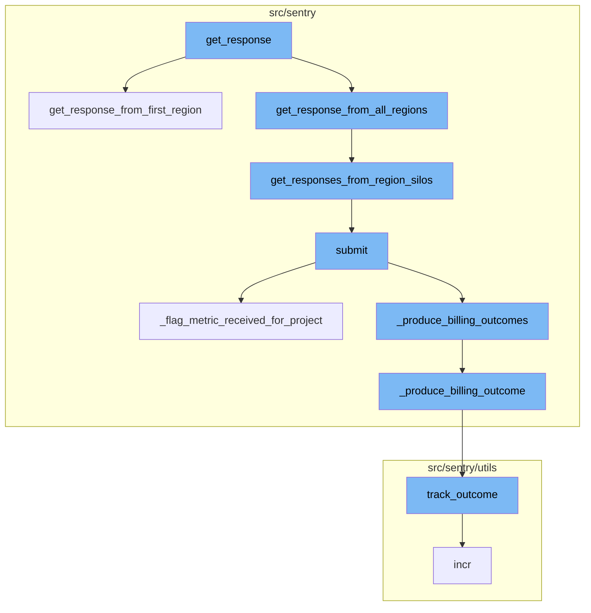
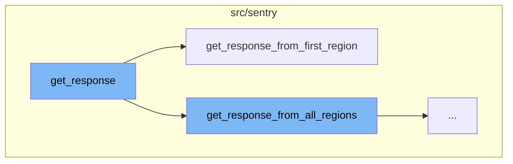
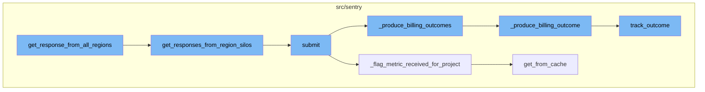

<SwmSnippet path="/src/sentry/middleware/integrations/parsers/slack.py" line="122">

---

# get_response

The `get_response` function is the entry point for handling Slack Webhook Requests. It first checks if the request is from a control class or an event challenge, in which case it gets a response from the control silo. If not, it retrieves the regions from the organizations and based on the view class and action options, it decides whether to get a response from all regions or just the first one.

```python
    def get_response(self):
        """
        Slack Webhook Requests all require synchronous responses.
        """
        if self.view_class in self.control_classes:
            return self.get_response_from_control_silo()

        # Handle event interactions challenge request
        data = None
        try:
            data = orjson.loads(self.request.body)
        except orjson.JSONDecodeError:
            pass
        if data and is_event_challenge(data):
            return self.get_response_from_control_silo()

        try:
            regions = self.get_regions_from_organizations()
        except Integration.DoesNotExist:
            # Alert, as there may be a misconfiguration issue
            sentry_sdk.capture_exception()
```

---

</SwmSnippet>

<SwmSnippet path="/src/sentry/integrations/middleware/hybrid_cloud/parser.py" line="303">

---

# get_response_from_first_region

The `get_response_from_first_region` function is called when the Slack webhook request needs to be handled by the first region only. It retrieves the regions from the organizations, gets the responses from the region silos for the first region, and returns the response. If there is an error, it raises a SiloClientError.

```python
    def get_response_from_first_region(self):
        regions = self.get_regions_from_organizations()
        first_region = regions[0]
        response_map = self.get_responses_from_region_silos(regions=[first_region])
        region_result = response_map[first_region.name]
        if region_result.error is not None:
            # We want to fail loudly so that devs know this error happened on the region silo (for now)
            error = SiloClientError(region_result.error)
            metrics.incr(
                self._METRIC_FAILURE_KEY + ".get_response_from_first_region_error",
                sample_rate=1.0,
                tags={"path": self.request.path, "error": str(error)},
            )
            raise SiloClientError(error)
        return region_result.response
```

---

</SwmSnippet>

<SwmSnippet path="/src/sentry/integrations/middleware/hybrid_cloud/parser.py" line="319">

---

# get_response_from_all_regions

The `get_response_from_all_regions` function is the starting point of the flow. It retrieves responses from all regions by calling `get_responses_from_region_silos` with the regions obtained from `get_regions_from_organizations`. It then filters out successful responses and raises an error if there are none.

```python
    def get_response_from_all_regions(self):
        regions = self.get_regions_from_organizations()
        response_map = self.get_responses_from_region_silos(regions=regions)
        successful_responses = [
            result for result in response_map.values() if result.response is not None
        ]
        if len(successful_responses) == 0:
            error_map_str = ", ".join(
                f"{region}: {result.error}" for region, result in response_map.items()
            )
            metrics.incr(
                self._METRIC_FAILURE_KEY + ".get_response_from_all_regions_error",
                sample_rate=1.0,
                tags={"path": self.request.path, "errors": error_map_str},
            )
            raise SiloClientError("No successful region responses", error_map_str)
        return successful_responses[0].response
```

---

</SwmSnippet>

<SwmSnippet path="/src/sentry/integrations/middleware/hybrid_cloud/parser.py" line="168">

---

# get_responses_from_region_silos

The `get_responses_from_region_silos` function handles requests for a given list of regions. It uses a ThreadPoolExecutor to get responses from each region in parallel. The function returns a mapping of region names to responses or exceptions.

```python
    def get_responses_from_region_silos(
        self, regions: Sequence[Region]
    ) -> Mapping[str, RegionResult]:
        """
        Used to handle the requests on a given list of regions (synchronously).
        Returns a mapping of region name to response/exception.
        """
        self.ensure_control_silo()

        region_to_response_map = {}

        with ThreadPoolExecutor(max_workers=len(regions)) as executor:
            future_to_region = {
                executor.submit(self.get_response_from_region_silo, region): region
                for region in regions
            }
            for future in as_completed(future_to_region):
                region = future_to_region[future]
                try:
                    region_response = future.result()
                # This will capture errors from this silo and any 4xx/5xx responses from others
```

---

</SwmSnippet>

<SwmSnippet path="/src/sentry/ingest/billing_metrics_consumer.py" line="77">

---

# submit

The `submit` function is called with a message as an argument. It extracts the payload from the message and calls `_produce_billing_outcomes` and `_flag_metric_received_for_project` with the payload.

```python
    def submit(self, message: Message[KafkaPayload]) -> None:
        assert not self.__closed

        payload = self._get_payload(message)

        self._produce_billing_outcomes(payload)
        self._flag_metric_received_for_project(payload)

        self.__next_step.submit(message)
```

---

</SwmSnippet>

<SwmSnippet path="/src/sentry/ingest/billing_metrics_consumer.py" line="157">

---

# \_flag_metric_received_for_project

The `_flag_metric_received_for_project` function checks if the metric received is a custom metric. If it is, and if the metric flag for the project has not been updated yet, it sends a signal that the first custom metric was received and updates the cache.

```python
    def _flag_metric_received_for_project(self, generic_metric: GenericMetric) -> None:
        try:
            org_id = generic_metric["org_id"]
            project_id = generic_metric["project_id"]
            metric_mri = self._resolve(generic_metric["mapping_meta"], generic_metric["metric_id"])

            parsed_mri = parse_mri(metric_mri)
            if parsed_mri is None or not is_custom_metric(parsed_mri):
                return

            # If the cache key is present, it means that we have already updated the metric flag for this project.
            cache_key = _get_project_flag_updated_cache_key(org_id, project_id)
            if cache.get(cache_key) is not None:
                return

            project = Project.objects.get_from_cache(id=project_id)

            if not project.flags.has_custom_metrics:
                first_custom_metric_received.send_robust(project=project, sender=project)

            cache.set(cache_key, "1", CACHE_TTL_IN_SECONDS)
```

---

</SwmSnippet>

<SwmSnippet path="/src/sentry/db/models/manager/base.py" line="281">

---

# get_from_cache

The `get_from_cache` function is a wrapper around QuerySet.get which supports caching of the intermediate value. It retrieves the value from the cache if it exists, otherwise, it fetches the value from the database and stores it in the cache.

```python
    def get_from_cache(
        self, use_replica: bool = settings.SENTRY_MODEL_CACHE_USE_REPLICA, **kwargs: Any
    ) -> M:
        """
        Wrapper around QuerySet.get which supports caching of the
        intermediate value.  Callee is responsible for making sure
        the cache key is cleared on save.
        """
        if not self.cache_fields:
            raise ValueError("We cannot cache this query. Just hit the database.")

        key, pk_name, value = self._get_cacheable_kv_from_kwargs(kwargs)
        if key not in self.cache_fields and key != pk_name:
            raise ValueError("We cannot cache this query. Just hit the database.")

        cache_key = self.__get_lookup_cache_key(**{key: value})
        local_cache = self._get_local_cache()

        def validate_result(inst: Any) -> M:
            if isinstance(inst, self.model) and (key != pk_name or int(value) == inst.pk):
                return inst
```

---

</SwmSnippet>

<SwmSnippet path="/src/sentry/ingest/billing_metrics_consumer.py" line="124">

---

# \_produce_billing_outcomes

The `_produce_billing_outcomes` function counts the processed items from the generic metric and calls `_produce_billing_outcome` for each category and quantity.

```python
    def _produce_billing_outcomes(self, generic_metric: GenericMetric) -> None:
        for category, quantity in self._count_processed_items(generic_metric).items():
            self._produce_billing_outcome(
                org_id=generic_metric["org_id"],
                project_id=generic_metric["project_id"],
                category=category,
                quantity=quantity,
            )
```

---

</SwmSnippet>

<SwmSnippet path="/src/sentry/ingest/billing_metrics_consumer.py" line="133">

---

# \_produce_billing_outcome

The `_produce_billing_outcome` function calls `track_outcome` with the organization id, project id, category, and quantity. It only proceeds if the quantity is greater than 0.

```python
    def _produce_billing_outcome(
        self, *, org_id: int, project_id: int, category: DataCategory, quantity: int
    ) -> None:
        if quantity < 1:
            return

        # track_outcome does not guarantee to deliver the outcome, making this
        # an at-most-once delivery.
        #
        # If it turns out that we drop too many outcomes on shutdown,
        # we may have to revisit this part to achieve a
        # better approximation of exactly-once delivery.
        track_outcome(
            org_id=org_id,
            project_id=project_id,
            key_id=None,
            outcome=Outcome.ACCEPTED,
            reason=None,
            timestamp=datetime.now(timezone.utc),
            event_id=None,
            category=category,
```

---

</SwmSnippet>

<SwmSnippet path="/src/sentry/utils/outcomes.py" line="40">

---

# track_outcome

The `track_outcome` function is a central point to track organization/project counters per incoming event. It sends the outcome message to Kafka which is used by Snuba to serve data for SnubaTSDB and RedisSnubaTSDB.

```python
def track_outcome(
    org_id: int,
    project_id: int,
    key_id: int | None,
    outcome: Outcome,
    reason: str | None = None,
    timestamp: datetime | None = None,
    event_id: str | None = None,
    category: DataCategory | None = None,
    quantity: int | None = None,
) -> None:
    """
    This is a central point to track org/project counters per incoming event.
    NB: This should only ever be called once per incoming event, which means
    it should only be called at the point we know the final outcome for the
    event (invalid, rate_limited, accepted, discarded, etc.)

    This sends the "outcome" message to Kafka which is used by Snuba to serve
    data for SnubaTSDB and RedisSnubaTSDB, such as # of rate-limited/filtered
    events.
    """
```

---

</SwmSnippet>



# Flow drill down

First, we'll zoom into this section of the flow:



<SwmSnippet path="/src/sentry/middleware/integrations/parsers/slack.py" line="122">

---

# get_response Function

The `get_response` function is the entry point for handling Slack Webhook Requests. It first checks if the request is from a control class or an event challenge, in which case it gets a response from the control silo. If not, it retrieves the regions from the organizations and based on the view class and action options, it decides whether to get a response from all regions or just the first one.

```python
    def get_response(self):
        """
        Slack Webhook Requests all require synchronous responses.
        """
        if self.view_class in self.control_classes:
            return self.get_response_from_control_silo()

        # Handle event interactions challenge request
        data = None
        try:
            data = orjson.loads(self.request.body)
        except orjson.JSONDecodeError:
            pass
        if data and is_event_challenge(data):
            return self.get_response_from_control_silo()

        try:
            regions = self.get_regions_from_organizations()
        except Integration.DoesNotExist:
            # Alert, as there may be a misconfiguration issue
            sentry_sdk.capture_exception()
```

---

</SwmSnippet>

<SwmSnippet path="/src/sentry/integrations/middleware/hybrid_cloud/parser.py" line="303">

---

# get_response_from_first_region Function

The `get_response_from_first_region` function is called when the Slack webhook request needs to be handled by the first region only. It retrieves the regions from the organizations, gets the responses from the region silos for the first region, and returns the response. If there is an error, it raises a SiloClientError.

```python
    def get_response_from_first_region(self):
        regions = self.get_regions_from_organizations()
        first_region = regions[0]
        response_map = self.get_responses_from_region_silos(regions=[first_region])
        region_result = response_map[first_region.name]
        if region_result.error is not None:
            # We want to fail loudly so that devs know this error happened on the region silo (for now)
            error = SiloClientError(region_result.error)
            metrics.incr(
                self._METRIC_FAILURE_KEY + ".get_response_from_first_region_error",
                sample_rate=1.0,
                tags={"path": self.request.path, "error": str(error)},
            )
            raise SiloClientError(error)
        return region_result.response
```

---

</SwmSnippet>

Now, lets zoom into this section of the flow:



<SwmSnippet path="/src/sentry/integrations/middleware/hybrid_cloud/parser.py" line="319">

---

## get_response_from_all_regions

The `get_response_from_all_regions` function is the starting point of the flow. It retrieves responses from all regions by calling `get_responses_from_region_silos` with the regions obtained from `get_regions_from_organizations`. It then filters out successful responses and raises an error if there are none.

```python
    def get_response_from_all_regions(self):
        regions = self.get_regions_from_organizations()
        response_map = self.get_responses_from_region_silos(regions=regions)
        successful_responses = [
            result for result in response_map.values() if result.response is not None
        ]
        if len(successful_responses) == 0:
            error_map_str = ", ".join(
                f"{region}: {result.error}" for region, result in response_map.items()
            )
            metrics.incr(
                self._METRIC_FAILURE_KEY + ".get_response_from_all_regions_error",
                sample_rate=1.0,
                tags={"path": self.request.path, "errors": error_map_str},
            )
            raise SiloClientError("No successful region responses", error_map_str)
        return successful_responses[0].response
```

---

</SwmSnippet>

<SwmSnippet path="/src/sentry/integrations/middleware/hybrid_cloud/parser.py" line="168">

---

## get_responses_from_region_silos

The `get_responses_from_region_silos` function handles requests for a given list of regions. It uses a ThreadPoolExecutor to get responses from each region in parallel. The function returns a mapping of region names to responses or exceptions.

```python
    def get_responses_from_region_silos(
        self, regions: Sequence[Region]
    ) -> Mapping[str, RegionResult]:
        """
        Used to handle the requests on a given list of regions (synchronously).
        Returns a mapping of region name to response/exception.
        """
        self.ensure_control_silo()

        region_to_response_map = {}

        with ThreadPoolExecutor(max_workers=len(regions)) as executor:
            future_to_region = {
                executor.submit(self.get_response_from_region_silo, region): region
                for region in regions
            }
            for future in as_completed(future_to_region):
                region = future_to_region[future]
                try:
                    region_response = future.result()
                # This will capture errors from this silo and any 4xx/5xx responses from others
```

---

</SwmSnippet>

<SwmSnippet path="/src/sentry/ingest/billing_metrics_consumer.py" line="77">

---

## submit

The `submit` function is called with a message as an argument. It extracts the payload from the message and calls `_produce_billing_outcomes` and `_flag_metric_received_for_project` with the payload.

```python
    def submit(self, message: Message[KafkaPayload]) -> None:
        assert not self.__closed

        payload = self._get_payload(message)

        self._produce_billing_outcomes(payload)
        self._flag_metric_received_for_project(payload)

        self.__next_step.submit(message)
```

---

</SwmSnippet>

<SwmSnippet path="/src/sentry/ingest/billing_metrics_consumer.py" line="157">

---

## \_flag_metric_received_for_project

The `_flag_metric_received_for_project` function checks if the metric received is a custom metric. If it is, and if the metric flag for the project has not been updated yet, it sends a signal that the first custom metric was received and updates the cache.

```python
    def _flag_metric_received_for_project(self, generic_metric: GenericMetric) -> None:
        try:
            org_id = generic_metric["org_id"]
            project_id = generic_metric["project_id"]
            metric_mri = self._resolve(generic_metric["mapping_meta"], generic_metric["metric_id"])

            parsed_mri = parse_mri(metric_mri)
            if parsed_mri is None or not is_custom_metric(parsed_mri):
                return

            # If the cache key is present, it means that we have already updated the metric flag for this project.
            cache_key = _get_project_flag_updated_cache_key(org_id, project_id)
            if cache.get(cache_key) is not None:
                return

            project = Project.objects.get_from_cache(id=project_id)

            if not project.flags.has_custom_metrics:
                first_custom_metric_received.send_robust(project=project, sender=project)

            cache.set(cache_key, "1", CACHE_TTL_IN_SECONDS)
```

---

</SwmSnippet>

<SwmSnippet path="/src/sentry/db/models/manager/base.py" line="281">

---

## get_from_cache

The `get_from_cache` function is a wrapper around QuerySet.get which supports caching of the intermediate value. It retrieves the value from the cache if it exists, otherwise, it fetches the value from the database and stores it in the cache.

```python
    def get_from_cache(
        self, use_replica: bool = settings.SENTRY_MODEL_CACHE_USE_REPLICA, **kwargs: Any
    ) -> M:
        """
        Wrapper around QuerySet.get which supports caching of the
        intermediate value.  Callee is responsible for making sure
        the cache key is cleared on save.
        """
        if not self.cache_fields:
            raise ValueError("We cannot cache this query. Just hit the database.")

        key, pk_name, value = self._get_cacheable_kv_from_kwargs(kwargs)
        if key not in self.cache_fields and key != pk_name:
            raise ValueError("We cannot cache this query. Just hit the database.")

        cache_key = self.__get_lookup_cache_key(**{key: value})
        local_cache = self._get_local_cache()

        def validate_result(inst: Any) -> M:
            if isinstance(inst, self.model) and (key != pk_name or int(value) == inst.pk):
                return inst
```

---

</SwmSnippet>

<SwmSnippet path="/src/sentry/ingest/billing_metrics_consumer.py" line="124">

---

## \_produce_billing_outcomes

The `_produce_billing_outcomes` function counts the processed items from the generic metric and calls `_produce_billing_outcome` for each category and quantity.

```python
    def _produce_billing_outcomes(self, generic_metric: GenericMetric) -> None:
        for category, quantity in self._count_processed_items(generic_metric).items():
            self._produce_billing_outcome(
                org_id=generic_metric["org_id"],
                project_id=generic_metric["project_id"],
                category=category,
                quantity=quantity,
            )
```

---

</SwmSnippet>

<SwmSnippet path="/src/sentry/ingest/billing_metrics_consumer.py" line="133">

---

## \_produce_billing_outcome

The `_produce_billing_outcome` function calls `track_outcome` with the organization id, project id, category, and quantity. It only proceeds if the quantity is greater than 0.

```python
    def _produce_billing_outcome(
        self, *, org_id: int, project_id: int, category: DataCategory, quantity: int
    ) -> None:
        if quantity < 1:
            return

        # track_outcome does not guarantee to deliver the outcome, making this
        # an at-most-once delivery.
        #
        # If it turns out that we drop too many outcomes on shutdown,
        # we may have to revisit this part to achieve a
        # better approximation of exactly-once delivery.
        track_outcome(
            org_id=org_id,
            project_id=project_id,
            key_id=None,
            outcome=Outcome.ACCEPTED,
            reason=None,
            timestamp=datetime.now(timezone.utc),
            event_id=None,
            category=category,
```

---

</SwmSnippet>

<SwmSnippet path="/src/sentry/utils/outcomes.py" line="40">

---

## track_outcome

The `track_outcome` function is a central point to track organization/project counters per incoming event. It sends the outcome message to Kafka which is used by Snuba to serve data for SnubaTSDB and RedisSnubaTSDB.

```python
def track_outcome(
    org_id: int,
    project_id: int,
    key_id: int | None,
    outcome: Outcome,
    reason: str | None = None,
    timestamp: datetime | None = None,
    event_id: str | None = None,
    category: DataCategory | None = None,
    quantity: int | None = None,
) -> None:
    """
    This is a central point to track org/project counters per incoming event.
    NB: This should only ever be called once per incoming event, which means
    it should only be called at the point we know the final outcome for the
    event (invalid, rate_limited, accepted, discarded, etc.)

    This sends the "outcome" message to Kafka which is used by Snuba to serve
    data for SnubaTSDB and RedisSnubaTSDB, such as # of rate-limited/filtered
    events.
    """
```

---

</SwmSnippet>

&nbsp;

*This is an auto-generated document by Swimm AI 🌊 and has not yet been verified by a human*

<SwmMeta version="3.0.0" repo-id="Z2l0aHViJTNBJTNBc2VudHJ5LWRlbW8lM0ElM0FTd2ltbS1EZW1v" repo-name="sentry-demo" doc-type="flows"><sup>Powered by [Swimm](/)</sup></SwmMeta>
