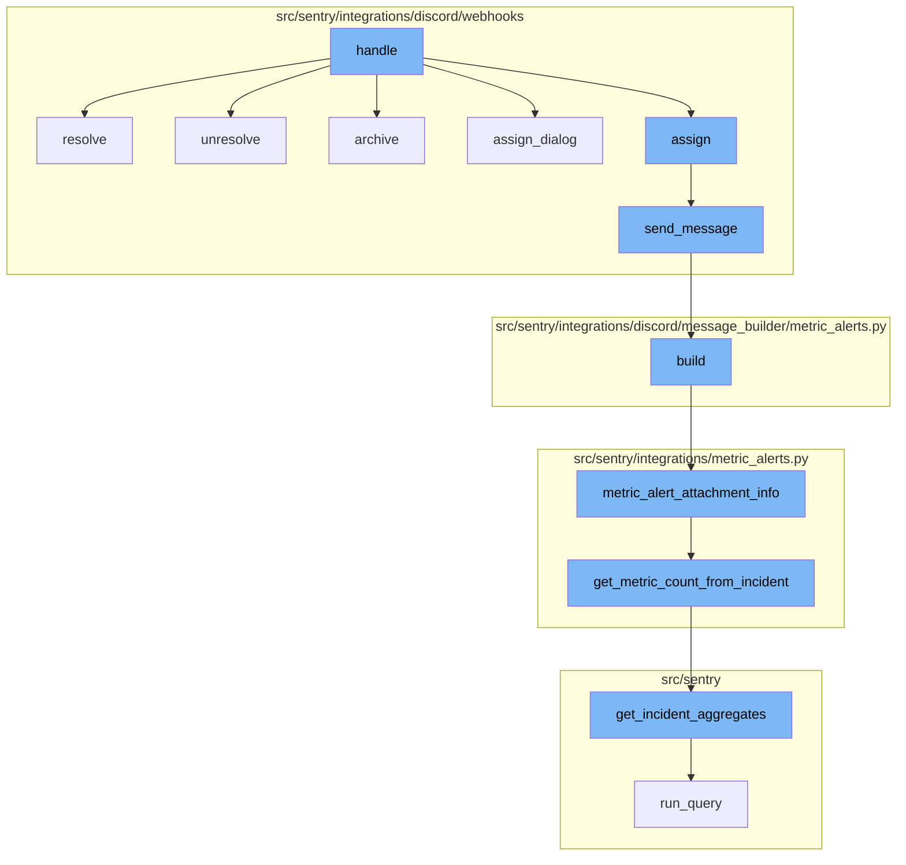
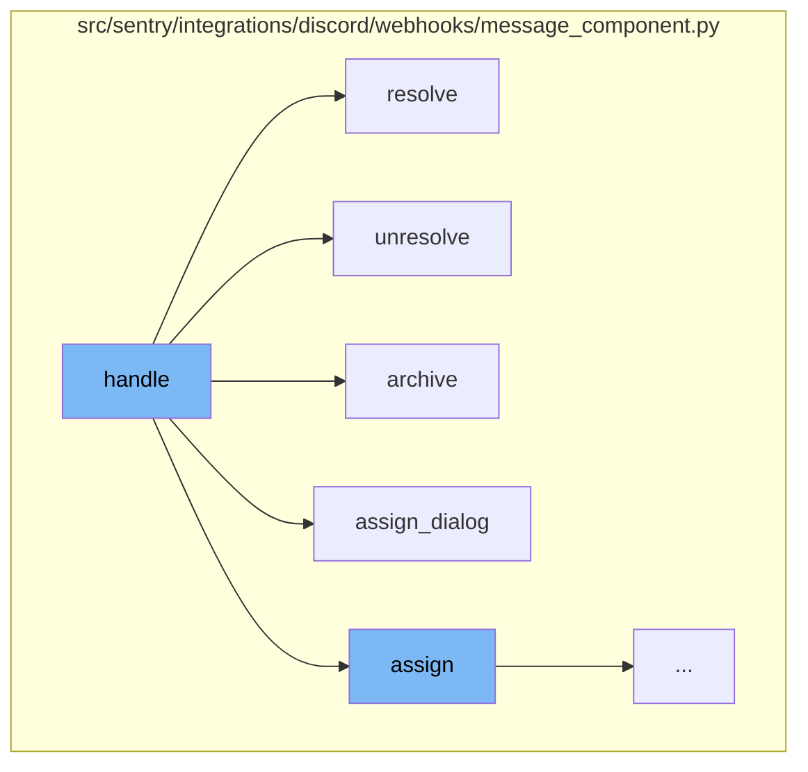
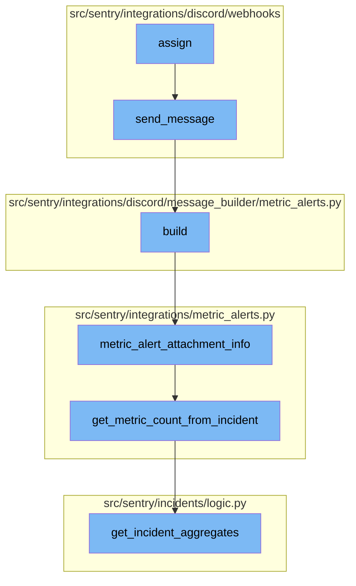

<SwmSnippet path="/src/sentry/integrations/discord/webhooks/message_component.py" line="70">

---

# Handle Function

The `handle` function is the entry point for handling Discord message components. It checks the custom_id of the request and calls the appropriate function based on the custom_id. For example, if the custom_id starts with `CustomIds.ASSIGN_DIALOG`, it calls the `assign_dialog` function.

```python
    def handle(self) -> Response:
        logging_data = self.request.logging_data

        if self.request.user is None:
            logger.warning("discord.interaction.component.not_linked", extra={**logging_data})
            return self.send_message(NO_IDENTITY)
        self.user = self.request.user

        if (not self.group_id) or (not self.group):
            return self.send_message(INVALID_GROUP_ID)

        if not self.group.organization.has_access(self.user):
            logger.warning(
                "discord.interaction.component.not_in_org",
                extra={"org_slug": self.group.organization.slug, **logging_data},
            )
            return self.send_message(NOT_IN_ORG)

        if self.custom_id.startswith(CustomIds.ASSIGN_DIALOG):
            logger.info("discord.interaction.component.assign_dialog", extra={**logging_data})
            return self.assign_dialog()
```

---

</SwmSnippet>

<SwmSnippet path="/src/sentry/integrations/discord/webhooks/message_component.py" line="180">

---

# Resolve Function

The `resolve` function is called when the custom_id starts with `CustomIds.RESOLVE`. It updates the status of the group to resolved and sends a message to the user.

```python
    def resolve(self) -> Response:
        status: dict[str, object] = {
            "status": STATUS_TO_STRING_LOOKUP[GroupHistoryStatus.RESOLVED],
        }
        message = RESOLVED

        selected_option = ""
        if self.request.is_select_component():
            selected_option = self.request.get_selected_options()[0]

        if selected_option == "inNextRelease":
            status["statusDetails"] = {"inNextRelease": True}
            message = RESOLVED_IN_NEXT_RELEASE
        elif selected_option == "inCurrentRelease":
            status["statusDetails"] = {"inRelease": "latest"}
            message = RESOLVED_IN_CURRENT_RELEASE

        self.update_group(status)
        return self.send_message(message, update=self.request.is_select_component())
```

---

</SwmSnippet>

<SwmSnippet path="/src/sentry/integrations/discord/webhooks/message_component.py" line="200">

---

# Unresolve Function

The `unresolve` function is called when the custom_id starts with `CustomIds.UNRESOLVE`. It updates the status of the group to unresolved and sends a message to the user.

```python
    def unresolve(self, from_mark_ongoing: bool = False) -> Response:
        self.update_group(
            {
                "status": STATUS_TO_STRING_LOOKUP[GroupHistoryStatus.UNRESOLVED],
                "substatus": SUBSTATUS_TO_STR[GroupSubStatus.ONGOING],
            }
        )

        if from_mark_ongoing:
            return self.send_message(MARKED_ONGOING)
        return self.send_message(UNRESOLVED)
```

---

</SwmSnippet>

<SwmSnippet path="/src/sentry/integrations/discord/webhooks/message_component.py" line="212">

---

# Archive Function

The `archive` function is called when the custom_id starts with `CustomIds.ARCHIVE`. It updates the status of the group to ignored and sends a message to the user.

```python
    def archive(self) -> Response:
        self.update_group(
            {
                "status": STATUS_TO_STRING_LOOKUP[GroupHistoryStatus.IGNORED],
                "substatus": SUBSTATUS_TO_STR[GroupSubStatus.UNTIL_ESCALATING],
            }
        )
        return self.send_message(ARCHIVE_UNTIL_ESCALATES)
```

---

</SwmSnippet>

<SwmSnippet path="/src/sentry/integrations/discord/webhooks/message_component.py" line="122">

---

# Assign Dialog Function

The `assign_dialog` function is called when the custom_id starts with `CustomIds.ASSIGN_DIALOG`. It creates a Discord select menu for the user to select an assignee for the group.

```python
    def assign_dialog(self) -> Response:
        if (not self.group_id) or (not self.group):
            return self.send_message(INVALID_GROUP_ID)

        assign_selector = DiscordSelectMenu(
            custom_id=f"{CustomIds.ASSIGN}:{self.group_id}",
            placeholder="Select Assignee...",
            options=get_assign_selector_options(self.group),
        )
        message = DiscordMessageBuilder(
            components=[DiscordActionRow([assign_selector])],
            flags=DiscordMessageFlags().set_ephemeral(),
        )
        return self.send_message(message)
```

---

</SwmSnippet>

<SwmSnippet path="/src/sentry/integrations/discord/webhooks/message_component.py" line="93">

---

# Assign Function

The `assign` function is called when the custom_id starts with `CustomIds.ASSIGN`. It assigns the selected user to the group.

```python
            logger.info(
                "discord.interaction.component.assign",
                extra={**logging_data, "assign_to": self.request.get_selected_options()[0]},
            )
            return self.assign()
```

---

</SwmSnippet>

<SwmSnippet path="/src/sentry/integrations/discord/webhooks/handler.py" line="24">

---

# Send Message Function

The `send_message` function is the next step in the flow. It sends a follow-up message to Discord. The function takes a message and an optional update flag. If the message is a string, it is converted into a DiscordMessageBuilder object. The function then returns a response with the message data.

```python
    def send_message(self, message: str | DiscordMessageBuilder, update: bool = False) -> Response:
        """Sends a new follow up message."""
        response_type = DiscordResponseTypes.UPDATE if update else DiscordResponseTypes.MESSAGE

        if isinstance(message, str):
            message = DiscordMessageBuilder(
                content=message, flags=DiscordMessageFlags().set_ephemeral()
            )
        return Response(
            {
                "type": response_type,
                "data": message.build(),
            },
            status=200,
        )
```

---

</SwmSnippet>

<SwmSnippet path="/src/sentry/integrations/discord/message_builder/metric_alerts.py" line="30">

---

# Build Function

The `build` function is the third step in the flow. It builds a dictionary with the alert rule, incident, new status, and metric value. The function then constructs a URL and embeds it in the message. The function returns the built message.

```python
    def build(self, notification_uuid: str | None = None) -> dict[str, object]:
        data = metric_alert_attachment_info(
            self.alert_rule, self.incident, self.new_status, self.metric_value
        )
        url = f"{data['title_link']}&referrer=discord"
        if notification_uuid:
            url += f"&notification_uuid={notification_uuid}"

        embeds = [
            DiscordMessageEmbed(
                title=data["title"],
                url=url,
                description=f"{data['text']}{get_started_at(data['date_started'])}",
                color=LEVEL_TO_COLOR[INCIDENT_COLOR_MAPPING.get(data["status"], "")],
                image=DiscordMessageEmbedImage(url=self.chart_url) if self.chart_url else None,
            )
        ]

        return self._build(embeds=embeds)
```

---

</SwmSnippet>

<SwmSnippet path="/src/sentry/integrations/metric_alerts.py" line="151">

---

# Metric Alert Attachment Info Function

The `metric_alert_attachment_info` function is the fourth step in the flow. It generates information for the metric alert attachment. The function takes an alert rule, an optional incident, new status, and metric value. It then calculates the status and constructs a URL for the alert details. The function returns a dictionary with the alert information.

```python
def metric_alert_attachment_info(
    alert_rule: AlertRule,
    selected_incident: Incident | None = None,
    new_status: IncidentStatus | None = None,
    metric_value: float | None = None,
):
    latest_incident = None
    if selected_incident is None:
        try:
            # Use .get() instead of .first() to avoid sorting table by id
            latest_incident = Incident.objects.filter(
                id__in=Incident.objects.filter(alert_rule=alert_rule)
                .values("alert_rule_id")
                .annotate(incident_id=Max("id"))
                .values("incident_id")
            ).get()
        except Incident.DoesNotExist:
            latest_incident = None

    if new_status:
        status = INCIDENT_STATUS[new_status]
```

---

</SwmSnippet>

<SwmSnippet path="/src/sentry/integrations/metric_alerts.py" line="40">

---

# Get Metric Count From Incident Function

The `get_metric_count_from_incident` function is the fifth step in the flow. It returns the current or last count of an incident aggregate. The function takes an incident and returns the count of the incident aggregates.

```python
def get_metric_count_from_incident(incident: Incident) -> str:
    """Returns the current or last count of an incident aggregate."""
    incident_trigger = (
        IncidentTrigger.objects.filter(incident=incident).order_by("-date_modified").first()
    )
    if incident_trigger:
        alert_rule_trigger = incident_trigger.alert_rule_trigger
        # TODO: If we're relying on this and expecting possible delays between a
        # trigger fired and this function running, then this could actually be
        # incorrect if they changed the trigger's time window in this time period.
        # Should we store it?
        start = incident_trigger.date_modified - timedelta(
            seconds=alert_rule_trigger.alert_rule.snuba_query.time_window
        )
        end = incident_trigger.date_modified
    else:
        start, end = None, None

    return get_incident_aggregates(incident=incident, start=start, end=end).get("count")
```

---

</SwmSnippet>

<SwmSnippet path="/src/sentry/incidents/logic.py" line="406">

---

# Get Incident Aggregates Function

The `get_incident_aggregates` function is the final step in the flow. It calculates aggregate stats across the life of an incident or the provided range. The function takes an incident, optional start and end dates, and a windowed stats flag. It then runs a query to get the incident aggregates and returns the aggregated result.

```python
def get_incident_aggregates(
    incident: Incident,
    start: datetime | None = None,
    end: datetime | None = None,
    windowed_stats: bool = False,
) -> dict[str, float | int]:
    """
    Calculates aggregate stats across the life of an incident, or the provided range.
    """
    snuba_query = incident.alert_rule.snuba_query
    entity_subscription = get_entity_subscription_from_snuba_query(
        snuba_query,
        incident.organization_id,
    )
    query_builder = build_incident_query_builder(
        incident, entity_subscription, start, end, windowed_stats
    )
    try:
        results = query_builder.run_query(referrer="incidents.get_incident_aggregates")
    except Exception:
        metrics.incr(
```

---

</SwmSnippet>



# Flow drill down

First, we'll zoom into this section of the flow:



<SwmSnippet path="/src/sentry/integrations/discord/webhooks/message_component.py" line="70">

---

# Handle Function

The `handle` function is the entry point for handling Discord message components. It checks the custom_id of the request and calls the appropriate function based on the custom_id. For example, if the custom_id starts with `CustomIds.ASSIGN_DIALOG`, it calls the `assign_dialog` function.

```python
    def handle(self) -> Response:
        logging_data = self.request.logging_data

        if self.request.user is None:
            logger.warning("discord.interaction.component.not_linked", extra={**logging_data})
            return self.send_message(NO_IDENTITY)
        self.user = self.request.user

        if (not self.group_id) or (not self.group):
            return self.send_message(INVALID_GROUP_ID)

        if not self.group.organization.has_access(self.user):
            logger.warning(
                "discord.interaction.component.not_in_org",
                extra={"org_slug": self.group.organization.slug, **logging_data},
            )
            return self.send_message(NOT_IN_ORG)

        if self.custom_id.startswith(CustomIds.ASSIGN_DIALOG):
            logger.info("discord.interaction.component.assign_dialog", extra={**logging_data})
            return self.assign_dialog()
```

---

</SwmSnippet>

<SwmSnippet path="/src/sentry/integrations/discord/webhooks/message_component.py" line="180">

---

# Resolve Function

The `resolve` function is called when the custom_id starts with `CustomIds.RESOLVE`. It updates the status of the group to resolved and sends a message to the user.

```python
    def resolve(self) -> Response:
        status: dict[str, object] = {
            "status": STATUS_TO_STRING_LOOKUP[GroupHistoryStatus.RESOLVED],
        }
        message = RESOLVED

        selected_option = ""
        if self.request.is_select_component():
            selected_option = self.request.get_selected_options()[0]

        if selected_option == "inNextRelease":
            status["statusDetails"] = {"inNextRelease": True}
            message = RESOLVED_IN_NEXT_RELEASE
        elif selected_option == "inCurrentRelease":
            status["statusDetails"] = {"inRelease": "latest"}
            message = RESOLVED_IN_CURRENT_RELEASE

        self.update_group(status)
        return self.send_message(message, update=self.request.is_select_component())
```

---

</SwmSnippet>

<SwmSnippet path="/src/sentry/integrations/discord/webhooks/message_component.py" line="200">

---

# Unresolve Function

The `unresolve` function is called when the custom_id starts with `CustomIds.UNRESOLVE`. It updates the status of the group to unresolved and sends a message to the user.

```python
    def unresolve(self, from_mark_ongoing: bool = False) -> Response:
        self.update_group(
            {
                "status": STATUS_TO_STRING_LOOKUP[GroupHistoryStatus.UNRESOLVED],
                "substatus": SUBSTATUS_TO_STR[GroupSubStatus.ONGOING],
            }
        )

        if from_mark_ongoing:
            return self.send_message(MARKED_ONGOING)
        return self.send_message(UNRESOLVED)
```

---

</SwmSnippet>

<SwmSnippet path="/src/sentry/integrations/discord/webhooks/message_component.py" line="212">

---

# Archive Function

The `archive` function is called when the custom_id starts with `CustomIds.ARCHIVE`. It updates the status of the group to ignored and sends a message to the user.

```python
    def archive(self) -> Response:
        self.update_group(
            {
                "status": STATUS_TO_STRING_LOOKUP[GroupHistoryStatus.IGNORED],
                "substatus": SUBSTATUS_TO_STR[GroupSubStatus.UNTIL_ESCALATING],
            }
        )
        return self.send_message(ARCHIVE_UNTIL_ESCALATES)
```

---

</SwmSnippet>

<SwmSnippet path="/src/sentry/integrations/discord/webhooks/message_component.py" line="122">

---

# Assign Dialog Function

The `assign_dialog` function is called when the custom_id starts with `CustomIds.ASSIGN_DIALOG`. It creates a Discord select menu for the user to select an assignee for the group.

```python
    def assign_dialog(self) -> Response:
        if (not self.group_id) or (not self.group):
            return self.send_message(INVALID_GROUP_ID)

        assign_selector = DiscordSelectMenu(
            custom_id=f"{CustomIds.ASSIGN}:{self.group_id}",
            placeholder="Select Assignee...",
            options=get_assign_selector_options(self.group),
        )
        message = DiscordMessageBuilder(
            components=[DiscordActionRow([assign_selector])],
            flags=DiscordMessageFlags().set_ephemeral(),
        )
        return self.send_message(message)
```

---

</SwmSnippet>

<SwmSnippet path="/src/sentry/integrations/discord/webhooks/message_component.py" line="93">

---

# Assign Function

The `assign` function is called when the custom_id starts with `CustomIds.ASSIGN`. It assigns the selected user to the group.

```python
            logger.info(
                "discord.interaction.component.assign",
                extra={**logging_data, "assign_to": self.request.get_selected_options()[0]},
            )
            return self.assign()
```

---

</SwmSnippet>

Now, lets zoom into this section of the flow:



<SwmSnippet path="/src/sentry/integrations/discord/webhooks/message_component.py" line="137">

---

# Assign Function

The `assign` function is the first step in the flow. It is responsible for assigning a selected option to an assignee. It then updates the group with the assigned user and sends a message to Discord with the updated assignee information.

```python
    def assign(self) -> Response:
        assignee = self.request.get_selected_options()[0]

        self.update_group(
            {
                "assignedTo": assignee,
                "integration": ActivityIntegration.DISCORD.value,
            }
        )

        logger.info(
            "discord.assign.dialog",
            extra={
                "assignee": assignee,
                "user": self.request.user,
            },
        )

        assert self.request.user is not None

        analytics.record(
```

---

</SwmSnippet>

<SwmSnippet path="/src/sentry/integrations/discord/webhooks/handler.py" line="24">

---

# Send Message Function

The `send_message` function is the next step in the flow. It sends a follow-up message to Discord. The function takes a message and an optional update flag. If the message is a string, it is converted into a DiscordMessageBuilder object. The function then returns a response with the message data.

```python
    def send_message(self, message: str | DiscordMessageBuilder, update: bool = False) -> Response:
        """Sends a new follow up message."""
        response_type = DiscordResponseTypes.UPDATE if update else DiscordResponseTypes.MESSAGE

        if isinstance(message, str):
            message = DiscordMessageBuilder(
                content=message, flags=DiscordMessageFlags().set_ephemeral()
            )
        return Response(
            {
                "type": response_type,
                "data": message.build(),
            },
            status=200,
        )
```

---

</SwmSnippet>

<SwmSnippet path="/src/sentry/integrations/discord/message_builder/metric_alerts.py" line="30">

---

# Build Function

The `build` function is the third step in the flow. It builds a dictionary with the alert rule, incident, new status, and metric value. The function then constructs a URL and embeds it in the message. The function returns the built message.

```python
    def build(self, notification_uuid: str | None = None) -> dict[str, object]:
        data = metric_alert_attachment_info(
            self.alert_rule, self.incident, self.new_status, self.metric_value
        )
        url = f"{data['title_link']}&referrer=discord"
        if notification_uuid:
            url += f"&notification_uuid={notification_uuid}"

        embeds = [
            DiscordMessageEmbed(
                title=data["title"],
                url=url,
                description=f"{data['text']}{get_started_at(data['date_started'])}",
                color=LEVEL_TO_COLOR[INCIDENT_COLOR_MAPPING.get(data["status"], "")],
                image=DiscordMessageEmbedImage(url=self.chart_url) if self.chart_url else None,
            )
        ]

        return self._build(embeds=embeds)
```

---

</SwmSnippet>

<SwmSnippet path="/src/sentry/integrations/metric_alerts.py" line="151">

---

# Metric Alert Attachment Info Function

The `metric_alert_attachment_info` function is the fourth step in the flow. It generates information for the metric alert attachment. The function takes an alert rule, an optional incident, new status, and metric value. It then calculates the status and constructs a URL for the alert details. The function returns a dictionary with the alert information.

```python
def metric_alert_attachment_info(
    alert_rule: AlertRule,
    selected_incident: Incident | None = None,
    new_status: IncidentStatus | None = None,
    metric_value: float | None = None,
):
    latest_incident = None
    if selected_incident is None:
        try:
            # Use .get() instead of .first() to avoid sorting table by id
            latest_incident = Incident.objects.filter(
                id__in=Incident.objects.filter(alert_rule=alert_rule)
                .values("alert_rule_id")
                .annotate(incident_id=Max("id"))
                .values("incident_id")
            ).get()
        except Incident.DoesNotExist:
            latest_incident = None

    if new_status:
        status = INCIDENT_STATUS[new_status]
```

---

</SwmSnippet>

<SwmSnippet path="/src/sentry/integrations/metric_alerts.py" line="40">

---

# Get Metric Count From Incident Function

The `get_metric_count_from_incident` function is the fifth step in the flow. It returns the current or last count of an incident aggregate. The function takes an incident and returns the count of the incident aggregates.

```python
def get_metric_count_from_incident(incident: Incident) -> str:
    """Returns the current or last count of an incident aggregate."""
    incident_trigger = (
        IncidentTrigger.objects.filter(incident=incident).order_by("-date_modified").first()
    )
    if incident_trigger:
        alert_rule_trigger = incident_trigger.alert_rule_trigger
        # TODO: If we're relying on this and expecting possible delays between a
        # trigger fired and this function running, then this could actually be
        # incorrect if they changed the trigger's time window in this time period.
        # Should we store it?
        start = incident_trigger.date_modified - timedelta(
            seconds=alert_rule_trigger.alert_rule.snuba_query.time_window
        )
        end = incident_trigger.date_modified
    else:
        start, end = None, None

    return get_incident_aggregates(incident=incident, start=start, end=end).get("count")
```

---

</SwmSnippet>

<SwmSnippet path="/src/sentry/incidents/logic.py" line="406">

---

# Get Incident Aggregates Function

The `get_incident_aggregates` function is the final step in the flow. It calculates aggregate stats across the life of an incident or the provided range. The function takes an incident, optional start and end dates, and a windowed stats flag. It then runs a query to get the incident aggregates and returns the aggregated result.

```python
def get_incident_aggregates(
    incident: Incident,
    start: datetime | None = None,
    end: datetime | None = None,
    windowed_stats: bool = False,
) -> dict[str, float | int]:
    """
    Calculates aggregate stats across the life of an incident, or the provided range.
    """
    snuba_query = incident.alert_rule.snuba_query
    entity_subscription = get_entity_subscription_from_snuba_query(
        snuba_query,
        incident.organization_id,
    )
    query_builder = build_incident_query_builder(
        incident, entity_subscription, start, end, windowed_stats
    )
    try:
        results = query_builder.run_query(referrer="incidents.get_incident_aggregates")
    except Exception:
        metrics.incr(
```

---

</SwmSnippet>

&nbsp;

*This is an auto-generated document by Swimm AI 🌊 and has not yet been verified by a human*

<SwmMeta version="3.0.0" repo-id="Z2l0aHViJTNBJTNBc2VudHJ5LWRlbW8lM0ElM0FTd2ltbS1EZW1v" repo-name="sentry-demo" doc-type="flows"><sup>Powered by [Swimm](/)</sup></SwmMeta>
