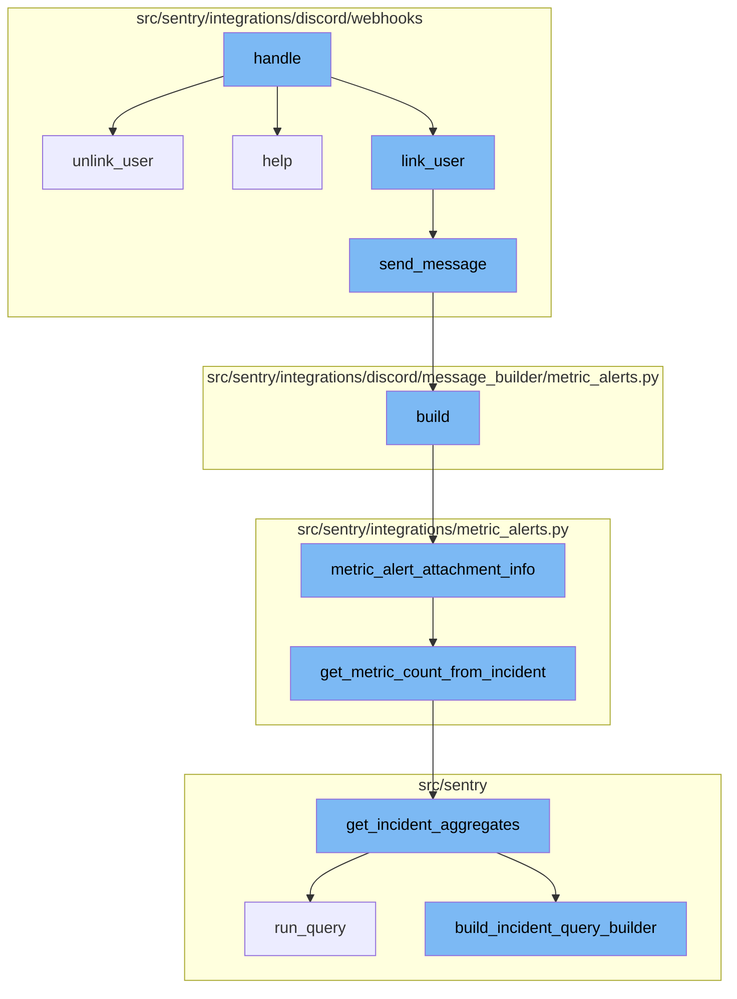
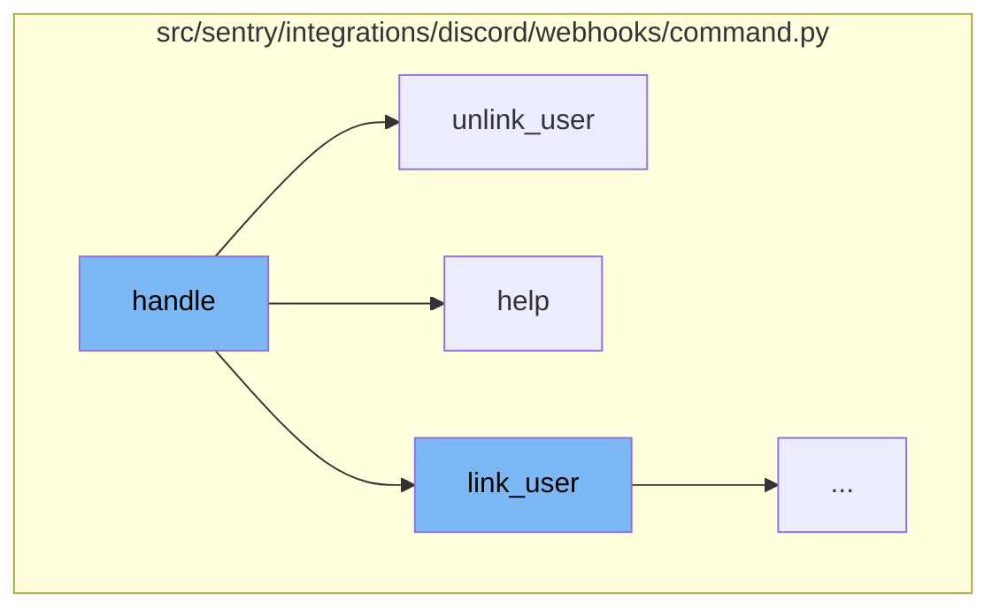
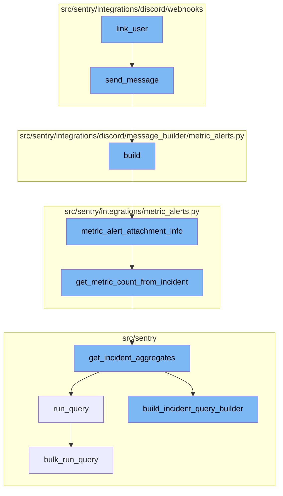

<SwmSnippet path="/src/sentry/integrations/discord/webhooks/command.py" line="38">

---

# Handle Function

The `handle` function is the entry point for handling commands. It retrieves the command name from the request and based on the command name, it delegates the handling to the appropriate function (`link_user`, `unlink_user`, or `help`). If the command is unknown, it logs a warning and returns the help message.

```python
    def handle(self) -> Response:
        command_name = self.request.get_command_name()
        logging_data = self.request.logging_data

        if command_name == DiscordCommandNames.LINK:
            return self.link_user()
        elif command_name == DiscordCommandNames.UNLINK:
            return self.unlink_user()
        elif command_name == DiscordCommandNames.HELP:
            return self.help()

        logger.warning(
            "discord.interaction.command.unknown", extra={"command": command_name, **logging_data}
        )
        return self.help()
```

---

</SwmSnippet>

<SwmSnippet path="/src/sentry/integrations/discord/webhooks/command.py" line="77">

---

# Unlink User Function

The `unlink_user` function is called when the command to unlink a user is received. It first checks if the request has an identity. If not, it sends a not linked message. If the request does have an identity, it builds an unlinking URL and sends a message with this URL.

```python
    def unlink_user(self) -> Response:
        if not self.request.has_identity():
            return self.send_message(NOT_LINKED_MESSAGE)

        # if self.request.has_identity() then these must not be None
        assert self.request.integration is not None
        assert self.request.user_id is not None

        unlink_url = build_unlinking_url(
            integration=self.request.integration,
            discord_id=self.request.user_id,
        )

        return self.send_message(UNLINK_USER_MESSAGE.format(url=unlink_url))
```

---

</SwmSnippet>

<SwmSnippet path="/src/sentry/integrations/discord/webhooks/command.py" line="92">

---

# Help Function

The `help` function is called when the help command is received. It simply sends a help message.

```python
    def help(self) -> Response:
        return self.send_message(HELP_MESSAGE)
```

---

</SwmSnippet>

<SwmSnippet path="/src/sentry/integrations/discord/webhooks/command.py" line="54">

---

# Linking User

The `link_user` function is the first step in the flow. It checks if the request has an identity. If it does, it sends a message indicating that the user is already linked. If the request lacks an integration or user ID, it logs a warning and sends a message about missing data. If all checks pass, it builds a linking URL and sends a message to link the user.

```python
    def link_user(self) -> Response:
        if self.request.has_identity():
            return self.send_message(
                ALREADY_LINKED_MESSAGE.format(email=self.request.get_identity_str())
            )

        if not self.request.integration or not self.request.user_id:
            logger.warning(
                "discord.interaction.command.missing.integration",
                extra={
                    "hasIntegration": bool(self.request.integration),
                    "hasUserId": self.request.user_id,
                },
            )
            return self.send_message(MISSING_DATA_MESSAGE)

        link_url = build_linking_url(
            integration=self.request.integration,
            discord_id=self.request.user_id,
        )

```

---

</SwmSnippet>

<SwmSnippet path="/src/sentry/integrations/discord/webhooks/handler.py" line="24">

---

# Sending Message

The `send_message` function is used to send a follow-up message. It checks if the message is a string and, if so, it creates a new `DiscordMessageBuilder` instance. It then returns a `Response` object with the message type and data.

```python
    def send_message(self, message: str | DiscordMessageBuilder, update: bool = False) -> Response:
        """Sends a new follow up message."""
        response_type = DiscordResponseTypes.UPDATE if update else DiscordResponseTypes.MESSAGE

        if isinstance(message, str):
            message = DiscordMessageBuilder(
                content=message, flags=DiscordMessageFlags().set_ephemeral()
            )
        return Response(
            {
                "type": response_type,
                "data": message.build(),
            },
            status=200,
        )
```

---

</SwmSnippet>

<SwmSnippet path="/src/sentry/integrations/discord/message_builder/metric_alerts.py" line="30">

---

# Building Message

The `build` function is used to construct the message. It calls the `metric_alert_attachment_info` function to get the data for the message, constructs a URL, and builds the message embeds. The function returns the built message.

```python
    def build(self, notification_uuid: str | None = None) -> dict[str, object]:
        data = metric_alert_attachment_info(
            self.alert_rule, self.incident, self.new_status, self.metric_value
        )
        url = f"{data['title_link']}&referrer=discord"
        if notification_uuid:
            url += f"&notification_uuid={notification_uuid}"

        embeds = [
            DiscordMessageEmbed(
                title=data["title"],
                url=url,
                description=f"{data['text']}{get_started_at(data['date_started'])}",
                color=LEVEL_TO_COLOR[INCIDENT_COLOR_MAPPING.get(data["status"], "")],
                image=DiscordMessageEmbedImage(url=self.chart_url) if self.chart_url else None,
            )
        ]

        return self._build(embeds=embeds)
```

---

</SwmSnippet>

<SwmSnippet path="/src/sentry/integrations/metric_alerts.py" line="151">

---

# Metric Alert Attachment Info

The `metric_alert_attachment_info` function gathers information about the metric alert. It determines the status of the incident, constructs a title and a title link, and gets the metric value. It then returns a dictionary with all the gathered information.

```python
def metric_alert_attachment_info(
    alert_rule: AlertRule,
    selected_incident: Incident | None = None,
    new_status: IncidentStatus | None = None,
    metric_value: float | None = None,
):
    latest_incident = None
    if selected_incident is None:
        try:
            # Use .get() instead of .first() to avoid sorting table by id
            latest_incident = Incident.objects.filter(
                id__in=Incident.objects.filter(alert_rule=alert_rule)
                .values("alert_rule_id")
                .annotate(incident_id=Max("id"))
                .values("incident_id")
            ).get()
        except Incident.DoesNotExist:
            latest_incident = None

    if new_status:
        status = INCIDENT_STATUS[new_status]
```

---

</SwmSnippet>

<SwmSnippet path="/src/sentry/integrations/metric_alerts.py" line="40">

---

# Getting Metric Count from Incident

The `get_metric_count_from_incident` function retrieves the current or last count of an incident aggregate. It does this by getting the incident trigger and calculating the start and end times based on the alert rule's time window. It then calls the `get_incident_aggregates` function to get the count.

```python
def get_metric_count_from_incident(incident: Incident) -> str:
    """Returns the current or last count of an incident aggregate."""
    incident_trigger = (
        IncidentTrigger.objects.filter(incident=incident).order_by("-date_modified").first()
    )
    if incident_trigger:
        alert_rule_trigger = incident_trigger.alert_rule_trigger
        # TODO: If we're relying on this and expecting possible delays between a
        # trigger fired and this function running, then this could actually be
        # incorrect if they changed the trigger's time window in this time period.
        # Should we store it?
        start = incident_trigger.date_modified - timedelta(
            seconds=alert_rule_trigger.alert_rule.snuba_query.time_window
        )
        end = incident_trigger.date_modified
    else:
        start, end = None, None

    return get_incident_aggregates(incident=incident, start=start, end=end).get("count")
```

---

</SwmSnippet>

<SwmSnippet path="/src/sentry/incidents/logic.py" line="406">

---

# Getting Incident Aggregates

The `get_incident_aggregates` function calculates aggregate stats across the life of an incident or the provided range. It builds a query using the `build_incident_query_builder` function and runs the query. The function then returns the aggregated result.

```python
def get_incident_aggregates(
    incident: Incident,
    start: datetime | None = None,
    end: datetime | None = None,
    windowed_stats: bool = False,
) -> dict[str, float | int]:
    """
    Calculates aggregate stats across the life of an incident, or the provided range.
    """
    snuba_query = incident.alert_rule.snuba_query
    entity_subscription = get_entity_subscription_from_snuba_query(
        snuba_query,
        incident.organization_id,
    )
    query_builder = build_incident_query_builder(
        incident, entity_subscription, start, end, windowed_stats
    )
    try:
        results = query_builder.run_query(referrer="incidents.get_incident_aggregates")
    except Exception:
        metrics.incr(
```

---

</SwmSnippet>

<SwmSnippet path="/src/sentry/incidents/logic.py" line="331">

---

# Building Incident Query Builder

The `build_incident_query_builder` function constructs a query to fetch incident data. It calculates the time range, gets the project IDs associated with the incident, and builds the query. It then adds conditions to the query and sets a limit before returning the query builder.

```python
def build_incident_query_builder(
    incident: Incident,
    entity_subscription: EntitySubscription,
    start: datetime | None = None,
    end: datetime | None = None,
    windowed_stats: bool = False,
) -> BaseQueryBuilder:
    snuba_query = incident.alert_rule.snuba_query
    start, end = calculate_incident_time_range(incident, start, end, windowed_stats=windowed_stats)
    project_ids = list(
        IncidentProject.objects.filter(incident=incident).values_list("project_id", flat=True)
    )
    query_builder = entity_subscription.build_query_builder(
        query=snuba_query.query,
        project_ids=project_ids,
        environment=snuba_query.environment,
        params={
            "organization_id": incident.organization_id,
            "project_id": project_ids,
            "start": start,
            "end": end,
```

---

</SwmSnippet>

<SwmSnippet path="/src/sentry/snuba/metrics_layer/query.py" line="143">

---

# Running Query

The `run_query` function is the entry point for executing a metrics query in Snuba. It calls the `bulk_run_query` function to execute the query.

```python
def run_query(request: Request) -> Mapping[str, Any]:
    """
    Entrypoint for executing a metrics query in Snuba.
    """
    return bulk_run_query([request])[0]
```

---

</SwmSnippet>

<SwmSnippet path="/src/sentry/snuba/metrics_layer/query.py" line="81">

---

# Bulk Running Query

The `bulk_run_query` function executes a list of metrics queries in Snuba. It sets up the metrics query, resolves the metrics query, and then runs the Snuba queries. It then converts the Snuba results and returns them.

```python
def bulk_run_query(requests: list[Request]) -> list[Mapping[str, Any]]:
    """
    Entrypoint for executing a list of metrics queries in Snuba.

    This function is used to execute multiple metrics queries in a single request.
    """
    if not requests:
        return []

    queries = []
    for request in requests:
        request, start, end = _setup_metrics_query(request)
        queries.append([request, start, end])

    logging_tags = {"referrer": request.tenant_ids["referrer"] or "unknown", "lang": "mql"}

    for q in queries:
        q[0], reverse_mappings, mappings = _resolve_metrics_query(q[0], logging_tags)
        q.extend([reverse_mappings, mappings])

    try:
```

---

</SwmSnippet>



# Flow drill down

First, we'll zoom into this section of the flow:



<SwmSnippet path="/src/sentry/integrations/discord/webhooks/command.py" line="38">

---

# Handle Function

The `handle` function is the entry point for handling commands. It retrieves the command name from the request and based on the command name, it delegates the handling to the appropriate function (`link_user`, `unlink_user`, or `help`). If the command is unknown, it logs a warning and returns the help message.

```python
    def handle(self) -> Response:
        command_name = self.request.get_command_name()
        logging_data = self.request.logging_data

        if command_name == DiscordCommandNames.LINK:
            return self.link_user()
        elif command_name == DiscordCommandNames.UNLINK:
            return self.unlink_user()
        elif command_name == DiscordCommandNames.HELP:
            return self.help()

        logger.warning(
            "discord.interaction.command.unknown", extra={"command": command_name, **logging_data}
        )
        return self.help()
```

---

</SwmSnippet>

<SwmSnippet path="/src/sentry/integrations/discord/webhooks/command.py" line="77">

---

# Unlink User Function

The `unlink_user` function is called when the command to unlink a user is received. It first checks if the request has an identity. If not, it sends a not linked message. If the request does have an identity, it builds an unlinking URL and sends a message with this URL.

```python
    def unlink_user(self) -> Response:
        if not self.request.has_identity():
            return self.send_message(NOT_LINKED_MESSAGE)

        # if self.request.has_identity() then these must not be None
        assert self.request.integration is not None
        assert self.request.user_id is not None

        unlink_url = build_unlinking_url(
            integration=self.request.integration,
            discord_id=self.request.user_id,
        )

        return self.send_message(UNLINK_USER_MESSAGE.format(url=unlink_url))
```

---

</SwmSnippet>

<SwmSnippet path="/src/sentry/integrations/discord/webhooks/command.py" line="92">

---

# Help Function

The `help` function is called when the help command is received. It simply sends a help message.

```python
    def help(self) -> Response:
        return self.send_message(HELP_MESSAGE)
```

---

</SwmSnippet>

Now, lets zoom into this section of the flow:



<SwmSnippet path="/src/sentry/integrations/discord/webhooks/command.py" line="54">

---

# Linking User

The `link_user` function is the first step in the flow. It checks if the request has an identity. If it does, it sends a message indicating that the user is already linked. If the request lacks an integration or user ID, it logs a warning and sends a message about missing data. If all checks pass, it builds a linking URL and sends a message to link the user.

```python
    def link_user(self) -> Response:
        if self.request.has_identity():
            return self.send_message(
                ALREADY_LINKED_MESSAGE.format(email=self.request.get_identity_str())
            )

        if not self.request.integration or not self.request.user_id:
            logger.warning(
                "discord.interaction.command.missing.integration",
                extra={
                    "hasIntegration": bool(self.request.integration),
                    "hasUserId": self.request.user_id,
                },
            )
            return self.send_message(MISSING_DATA_MESSAGE)

        link_url = build_linking_url(
            integration=self.request.integration,
            discord_id=self.request.user_id,
        )

```

---

</SwmSnippet>

<SwmSnippet path="/src/sentry/integrations/discord/webhooks/handler.py" line="24">

---

# Sending Message

The `send_message` function is used to send a follow-up message. It checks if the message is a string and, if so, it creates a new `DiscordMessageBuilder` instance. It then returns a `Response` object with the message type and data.

```python
    def send_message(self, message: str | DiscordMessageBuilder, update: bool = False) -> Response:
        """Sends a new follow up message."""
        response_type = DiscordResponseTypes.UPDATE if update else DiscordResponseTypes.MESSAGE

        if isinstance(message, str):
            message = DiscordMessageBuilder(
                content=message, flags=DiscordMessageFlags().set_ephemeral()
            )
        return Response(
            {
                "type": response_type,
                "data": message.build(),
            },
            status=200,
        )
```

---

</SwmSnippet>

<SwmSnippet path="/src/sentry/integrations/discord/message_builder/metric_alerts.py" line="30">

---

# Building Message

The `build` function is used to construct the message. It calls the `metric_alert_attachment_info` function to get the data for the message, constructs a URL, and builds the message embeds. The function returns the built message.

```python
    def build(self, notification_uuid: str | None = None) -> dict[str, object]:
        data = metric_alert_attachment_info(
            self.alert_rule, self.incident, self.new_status, self.metric_value
        )
        url = f"{data['title_link']}&referrer=discord"
        if notification_uuid:
            url += f"&notification_uuid={notification_uuid}"

        embeds = [
            DiscordMessageEmbed(
                title=data["title"],
                url=url,
                description=f"{data['text']}{get_started_at(data['date_started'])}",
                color=LEVEL_TO_COLOR[INCIDENT_COLOR_MAPPING.get(data["status"], "")],
                image=DiscordMessageEmbedImage(url=self.chart_url) if self.chart_url else None,
            )
        ]

        return self._build(embeds=embeds)
```

---

</SwmSnippet>

<SwmSnippet path="/src/sentry/integrations/metric_alerts.py" line="151">

---

# Metric Alert Attachment Info

The `metric_alert_attachment_info` function gathers information about the metric alert. It determines the status of the incident, constructs a title and a title link, and gets the metric value. It then returns a dictionary with all the gathered information.

```python
def metric_alert_attachment_info(
    alert_rule: AlertRule,
    selected_incident: Incident | None = None,
    new_status: IncidentStatus | None = None,
    metric_value: float | None = None,
):
    latest_incident = None
    if selected_incident is None:
        try:
            # Use .get() instead of .first() to avoid sorting table by id
            latest_incident = Incident.objects.filter(
                id__in=Incident.objects.filter(alert_rule=alert_rule)
                .values("alert_rule_id")
                .annotate(incident_id=Max("id"))
                .values("incident_id")
            ).get()
        except Incident.DoesNotExist:
            latest_incident = None

    if new_status:
        status = INCIDENT_STATUS[new_status]
```

---

</SwmSnippet>

<SwmSnippet path="/src/sentry/integrations/metric_alerts.py" line="40">

---

# Getting Metric Count from Incident

The `get_metric_count_from_incident` function retrieves the current or last count of an incident aggregate. It does this by getting the incident trigger and calculating the start and end times based on the alert rule's time window. It then calls the `get_incident_aggregates` function to get the count.

```python
def get_metric_count_from_incident(incident: Incident) -> str:
    """Returns the current or last count of an incident aggregate."""
    incident_trigger = (
        IncidentTrigger.objects.filter(incident=incident).order_by("-date_modified").first()
    )
    if incident_trigger:
        alert_rule_trigger = incident_trigger.alert_rule_trigger
        # TODO: If we're relying on this and expecting possible delays between a
        # trigger fired and this function running, then this could actually be
        # incorrect if they changed the trigger's time window in this time period.
        # Should we store it?
        start = incident_trigger.date_modified - timedelta(
            seconds=alert_rule_trigger.alert_rule.snuba_query.time_window
        )
        end = incident_trigger.date_modified
    else:
        start, end = None, None

    return get_incident_aggregates(incident=incident, start=start, end=end).get("count")
```

---

</SwmSnippet>

<SwmSnippet path="/src/sentry/incidents/logic.py" line="406">

---

# Getting Incident Aggregates

The `get_incident_aggregates` function calculates aggregate stats across the life of an incident or the provided range. It builds a query using the `build_incident_query_builder` function and runs the query. The function then returns the aggregated result.

```python
def get_incident_aggregates(
    incident: Incident,
    start: datetime | None = None,
    end: datetime | None = None,
    windowed_stats: bool = False,
) -> dict[str, float | int]:
    """
    Calculates aggregate stats across the life of an incident, or the provided range.
    """
    snuba_query = incident.alert_rule.snuba_query
    entity_subscription = get_entity_subscription_from_snuba_query(
        snuba_query,
        incident.organization_id,
    )
    query_builder = build_incident_query_builder(
        incident, entity_subscription, start, end, windowed_stats
    )
    try:
        results = query_builder.run_query(referrer="incidents.get_incident_aggregates")
    except Exception:
        metrics.incr(
```

---

</SwmSnippet>

<SwmSnippet path="/src/sentry/incidents/logic.py" line="331">

---

# Building Incident Query Builder

The `build_incident_query_builder` function constructs a query to fetch incident data. It calculates the time range, gets the project IDs associated with the incident, and builds the query. It then adds conditions to the query and sets a limit before returning the query builder.

```python
def build_incident_query_builder(
    incident: Incident,
    entity_subscription: EntitySubscription,
    start: datetime | None = None,
    end: datetime | None = None,
    windowed_stats: bool = False,
) -> BaseQueryBuilder:
    snuba_query = incident.alert_rule.snuba_query
    start, end = calculate_incident_time_range(incident, start, end, windowed_stats=windowed_stats)
    project_ids = list(
        IncidentProject.objects.filter(incident=incident).values_list("project_id", flat=True)
    )
    query_builder = entity_subscription.build_query_builder(
        query=snuba_query.query,
        project_ids=project_ids,
        environment=snuba_query.environment,
        params={
            "organization_id": incident.organization_id,
            "project_id": project_ids,
            "start": start,
            "end": end,
```

---

</SwmSnippet>

<SwmSnippet path="/src/sentry/snuba/metrics_layer/query.py" line="143">

---

# Running Query

The `run_query` function is the entry point for executing a metrics query in Snuba. It calls the `bulk_run_query` function to execute the query.

```python
def run_query(request: Request) -> Mapping[str, Any]:
    """
    Entrypoint for executing a metrics query in Snuba.
    """
    return bulk_run_query([request])[0]
```

---

</SwmSnippet>

<SwmSnippet path="/src/sentry/snuba/metrics_layer/query.py" line="81">

---

# Bulk Running Query

The `bulk_run_query` function executes a list of metrics queries in Snuba. It sets up the metrics query, resolves the metrics query, and then runs the Snuba queries. It then converts the Snuba results and returns them.

```python
def bulk_run_query(requests: list[Request]) -> list[Mapping[str, Any]]:
    """
    Entrypoint for executing a list of metrics queries in Snuba.

    This function is used to execute multiple metrics queries in a single request.
    """
    if not requests:
        return []

    queries = []
    for request in requests:
        request, start, end = _setup_metrics_query(request)
        queries.append([request, start, end])

    logging_tags = {"referrer": request.tenant_ids["referrer"] or "unknown", "lang": "mql"}

    for q in queries:
        q[0], reverse_mappings, mappings = _resolve_metrics_query(q[0], logging_tags)
        q.extend([reverse_mappings, mappings])

    try:
```

---

</SwmSnippet>

&nbsp;

*This is an auto-generated document by Swimm AI 🌊 and has not yet been verified by a human*

<SwmMeta version="3.0.0" repo-id="Z2l0aHViJTNBJTNBc2VudHJ5LWRlbW8lM0ElM0FTd2ltbS1EZW1v" repo-name="sentry-demo" doc-type="flows"><sup>Powered by [Swimm](/)</sup></SwmMeta>
