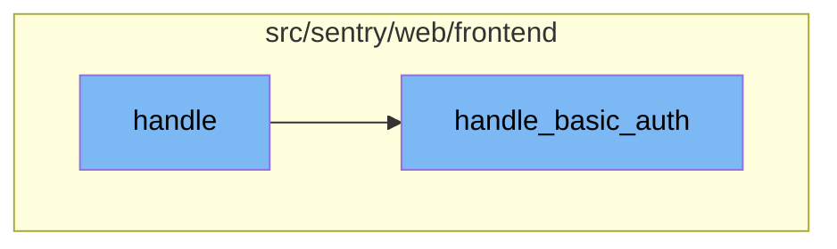

<SwmSnippet path="/src/sentry/web/frontend/auth_organization_login.py" line="61">

---

# Handle Function

The `handle` function is a method in the `AuthOrganizationLoginView` class. It takes in a request and an organization slug as parameters. The function retrieves the organization context based on the slug. If the organization context is not found, it redirects to the login page. If the organization context is found, it checks if the request method is a POST request. If it is, it initiates the login process. It then checks if an auth provider exists for the organization. If no auth provider is found, it calls the `handle_basic_auth` method.

```python
    def handle(self, request: Request, organization_slug) -> HttpResponseBase:
        org_context = organization_service.get_organization_by_slug(
            slug=organization_slug, only_visible=True
        )
        if org_context is None:
            return self.redirect(reverse("sentry-login"))
        organization = org_context.organization

        request.session.set_test_cookie()

        # check on POST to handle
        # multiple tabs case well now that we include redirect in url
        if request.method == "POST":
            referrer = None
            if request.session.get("_referrer") is not None:
                referrer = request.session.pop("_referrer")
            next_uri = self.get_next_uri(request)
            initiate_login(request, next_uri, referrer)

        try:
            auth_provider = AuthProvider.objects.get(organization_id=organization.id)
```

---

</SwmSnippet>

<SwmSnippet path="/src/sentry/web/frontend/auth_login.py" line="558">

---

# Handle Basic Auth Function

The `handle_basic_auth` function is a method in the `AuthLoginView` class. It handles GET and POST requests for registration and login. It checks if the request method is GET and if the organization exists. If it does, it redirects to the organization's auth page. If the request method is POST, it checks if the operation is a login attempt. If it is, it validates the login form and logs in the user if the form is valid. If the user is not active, it redirects to the reactivate account page. If the user is active, it checks the login state of the organization and sets the active organization if the user is not a superuser.

```python
    def handle_basic_auth(self, request: Request, **kwargs) -> HttpResponseBase:
        """
        Legacy handler that handles GET and POST requests for registration and login.
        This is still here because it's used by OAuthAuthorizeView and AuthOrganizationLoginView.
        It will be removed once we decouple those classes from this method TODO(@EricHasegawa).
        """
        op = request.POST.get("op")
        organization = kwargs.pop("organization", None)

        if request.method == "GET" and request.subdomain and self.org_exists(request):
            urls = [
                reverse("sentry-auth-organization", args=[request.subdomain]),
                reverse("sentry-register"),
            ]
            # Only redirect if the URL is not register or login paths.
            if request.path_info not in urls:
                url_prefix = generate_organization_url(request.subdomain)
                url = absolute_uri(urls[0], url_prefix=url_prefix)
                if request.GET:
                    url = f"{url}?{request.GET.urlencode()}"
                return HttpResponseRedirect(url)
```

---

</SwmSnippet>

# Flow drill down



<SwmSnippet path="/src/sentry/web/frontend/auth_organization_login.py" line="61">

---

# Handle Function

The `handle` function is a method in the `AuthOrganizationLoginView` class. It takes in a request and an organization slug as parameters. The function retrieves the organization context based on the slug. If the organization context is not found, it redirects to the login page. If the organization context is found, it checks if the request method is a POST request. If it is, it initiates the login process. It then checks if an auth provider exists for the organization. If no auth provider is found, it calls the `handle_basic_auth` method.

```python
    def handle(self, request: Request, organization_slug) -> HttpResponseBase:
        org_context = organization_service.get_organization_by_slug(
            slug=organization_slug, only_visible=True
        )
        if org_context is None:
            return self.redirect(reverse("sentry-login"))
        organization = org_context.organization

        request.session.set_test_cookie()

        # check on POST to handle
        # multiple tabs case well now that we include redirect in url
        if request.method == "POST":
            referrer = None
            if request.session.get("_referrer") is not None:
                referrer = request.session.pop("_referrer")
            next_uri = self.get_next_uri(request)
            initiate_login(request, next_uri, referrer)

        try:
            auth_provider = AuthProvider.objects.get(organization_id=organization.id)
```

---

</SwmSnippet>

<SwmSnippet path="/src/sentry/web/frontend/auth_login.py" line="558">

---

# Handle Basic Auth Function

The `handle_basic_auth` function is a method in the `AuthLoginView` class. It handles GET and POST requests for registration and login. It checks if the request method is GET and if the organization exists. If it does, it redirects to the organization's auth page. If the request method is POST, it checks if the operation is a login attempt. If it is, it validates the login form and logs in the user if the form is valid. If the user is not active, it redirects to the reactivate account page. If the user is active, it checks the login state of the organization and sets the active organization if the user is not a superuser.

```python
    def handle_basic_auth(self, request: Request, **kwargs) -> HttpResponseBase:
        """
        Legacy handler that handles GET and POST requests for registration and login.
        This is still here because it's used by OAuthAuthorizeView and AuthOrganizationLoginView.
        It will be removed once we decouple those classes from this method TODO(@EricHasegawa).
        """
        op = request.POST.get("op")
        organization = kwargs.pop("organization", None)

        if request.method == "GET" and request.subdomain and self.org_exists(request):
            urls = [
                reverse("sentry-auth-organization", args=[request.subdomain]),
                reverse("sentry-register"),
            ]
            # Only redirect if the URL is not register or login paths.
            if request.path_info not in urls:
                url_prefix = generate_organization_url(request.subdomain)
                url = absolute_uri(urls[0], url_prefix=url_prefix)
                if request.GET:
                    url = f"{url}?{request.GET.urlencode()}"
                return HttpResponseRedirect(url)
```

---

</SwmSnippet>

&nbsp;

*This is an auto-generated document by Swimm AI 🌊 and has not yet been verified by a human*

<SwmMeta version="3.0.0" repo-id="Z2l0aHViJTNBJTNBc2VudHJ5LWRlbW8lM0ElM0FTd2ltbS1EZW1v" repo-name="sentry-demo" doc-type="flows"><sup>Powered by [Swimm](/)</sup></SwmMeta>
