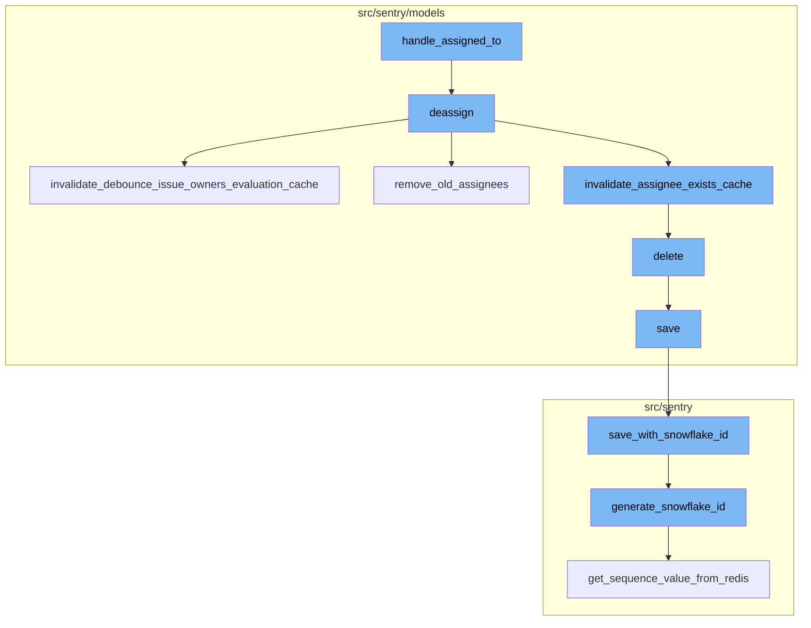
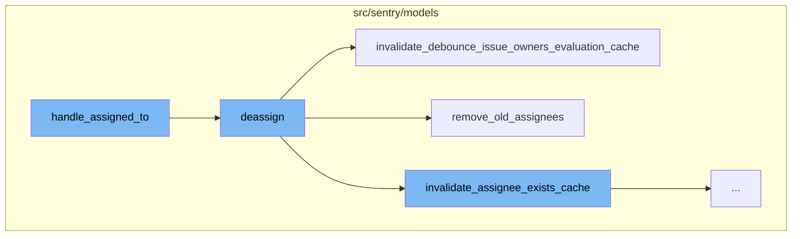
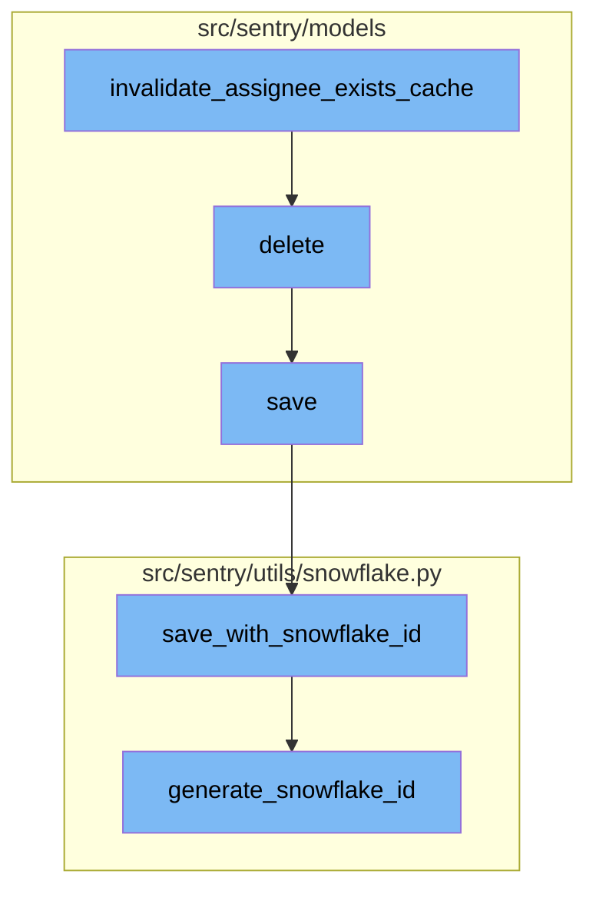
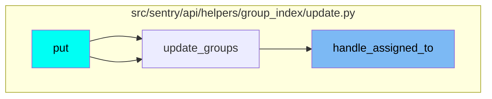

# Overview of handle_assigned_to

The `handle_assigned_to` function is a key part of the assignment management process in Sentry. It is responsible for assigning or deassigning a group to an actor, which can be a user or a team. This function also logs the manual issue assignment analytics.

# Deassign Function

When there is no actor assigned, the `deassign` function is called. This function removes the assignment from the group, logs the unassignment activity, clears the ownership cache for the deassigned group, and syncs the Sentry assignee to external issues.

# Invalidate Debounce Issue Owners Evaluation Cache

The `invalidate_debounce_issue_owners_evaluation_cache` function is part of the deassignment process. It clears the debounce issue owners cache for the group or for all groups for a project that had an event within a certain time window.

# Remove Old Assignees

The `remove_old_assignees` function is also part of the deassignment process. It removes the previous assignee from the group. If the new assignee is a team that the old assignee (a user) is in, they are not removed.

# Invalidate Assignee Exists Cache

The `invalidate_assignee_exists_cache` function is used to clear the assignee exists cache. If a group ID is provided, the cache for that specific group is cleared. Otherwise, the cache for all groups within a project that had an event within the `ASSIGNEE_EXISTS_DURATION` window is cleared.

# Delete Project

The `delete` function is used to delete a project. It manually cascades the deletion due to the lack of a foreign key relationship. It also removes notification settings for the project.

# Save Project

The `save` function is used to save a project. If the project doesn't have a slug, it generates one. If the `SENTRY_USE_SNOWFLAKE` setting is enabled, it saves the project with a snowflake ID.

# Save with Snowflake ID

The `save_with_snowflake_id` function is used to save an instance of a model with a snowflake ID. It generates a new snowflake ID if the instance doesn't have one and saves the instance.

# Generate Snowflake ID

The `generate_snowflake_id` function is used to generate a unique snowflake ID. It uses various segment values such as version ID, region ID, and time difference to generate the ID.

# Usage of the Flow

This flow is used multiple times in the codebase, particularly in the `update_groups` function which is part of the `put` method in the `src/sentry/api/helpers/group_index/update.py` file.



# Flow drill down

First, we'll zoom into this section of the flow:



<SwmSnippet path="/src/sentry/api/helpers/group_index/update.py" line="867">

---

# handle_assigned_to Function

The `handle_assigned_to` function is responsible for managing the assignment of a group. It either assigns a new actor to the group or removes existing assignees. It also logs the manual issue assignment analytics. If an actor is assigned, the function resolves the actor and assigns them to each group in the group list. If no actor is assigned, the function deassigns the group.

```python
def handle_assigned_to(
    assigned_actor: Actor,
    assigned_by: str | None,
    integration: str | None,
    group_list: list[Group],
    project_lookup: dict[int, Project],
    acting_user: User | None,
) -> ActorSerializerResponse | None:
    """
    Handle the assignedTo field on a group update.

    This sets a new assignee or removes existing assignees, and logs the
    manual.issue_assignment analytic.
    """
    assigned_by = (
        assigned_by if assigned_by in ["assignee_selector", "suggested_assignee"] else None
    )
    extra = (
        {"integration": integration}
        if integration in [ActivityIntegration.SLACK.value, ActivityIntegration.MSTEAMS.value]
        else dict()
```

---

</SwmSnippet>

<SwmSnippet path="/src/sentry/models/groupassignee.py" line="197">

---

# deassign Function

The `deassign` function is called when there is no actor assigned in the `handle_assigned_to` function. It removes the assignment from the group and logs the unassignment activity. It also clears the ownership cache for the deassigned group and syncs the Sentry assignee to external issues.

```python
    def deassign(
        self,
        group: Group,
        acting_user: User | RpcUser | None = None,
        assigned_to: Team | RpcUser | None = None,
        extra: dict[str, str] | None = None,
    ) -> None:
        from sentry.integrations.utils import sync_group_assignee_outbound
        from sentry.models.activity import Activity
        from sentry.models.projectownership import ProjectOwnership

        try:
            previous_groupassignee = self.get(group=group)
        except GroupAssignee.DoesNotExist:
            previous_groupassignee = None

        affected = self.filter(group=group)[:1].count()
        self.filter(group=group).delete()

        if affected > 0:
            Activity.objects.create_group_activity(group, ActivityType.UNASSIGNED, user=acting_user)
```

---

</SwmSnippet>

<SwmSnippet path="/src/sentry/models/groupowner.py" line="125">

---

# invalidate_debounce_issue_owners_evaluation_cache Function

The `invalidate_debounce_issue_owners_evaluation_cache` function is called within the `deassign` function. It clears the debounce issue owners cache for the group or for all groups for a project that had an event within a certain time window.

```python
    def invalidate_debounce_issue_owners_evaluation_cache(cls, project_id, group_id=None):
        """
        If `group_id` is provided, clear the debounce issue owners cache for that group, else clear
        the cache of all groups for a project that had an event within the
        ISSUE_OWNERS_DEBOUNCE_DURATION window.
        """
        if group_id:
            cache.delete(ISSUE_OWNERS_DEBOUNCE_KEY(group_id))
            return

        # Get all the groups for a project that had an event within the ISSUE_OWNERS_DEBOUNCE_DURATION window.
        # Any groups without events in that window would have expired their TTL in the cache.
        queryset = Group.objects.filter(
            project_id=project_id,
            last_seen__gte=timezone.now() - timedelta(seconds=ISSUE_OWNERS_DEBOUNCE_DURATION),
        ).values_list("id", flat=True)

        # Run cache invalidation in batches
        group_id_iter = queryset.iterator(chunk_size=1000)
        while True:
            group_ids = list(itertools.islice(group_id_iter, 1000))
```

---

</SwmSnippet>

<SwmSnippet path="/src/sentry/models/groupassignee.py" line="65">

---

# remove_old_assignees Function

The `remove_old_assignees` function is also called within the `deassign` function. It removes the previous assignee from the group. If the new assignee is a team that the old assignee (a user) is in, they are not removed.

```python
    def remove_old_assignees(
        self,
        group: Group,
        previous_assignee: GroupAssignee | None,
        new_assignee_id: int | None = None,
        new_assignee_type: str | None = None,
    ) -> None:
        from sentry.models.team import Team

        if not previous_assignee:
            return

        if (
            features.has("organizations:team-workflow-notifications", group.organization)
            and previous_assignee.team
        ):
            GroupSubscription.objects.filter(
                group=group,
                project=group.project,
                team=previous_assignee.team,
                reason=GroupSubscriptionReason.assigned,
```

---

</SwmSnippet>

Now, lets zoom into this section of the flow:



<SwmSnippet path="/src/sentry/models/groupowner.py" line="152">

---

## Invalidate Assignee Exists Cache

The `invalidate_assignee_exists_cache` function is used to clear the assignee exists cache. If a group ID is provided, the cache for that specific group is cleared. Otherwise, the cache for all groups within a project that had an event within the `ASSIGNEE_EXISTS_DURATION` window is cleared.

```python
    def invalidate_assignee_exists_cache(cls, project_id, group_id=None):
        """
        If `group_id` is provided, clear the assignee exists cache for that group, else
        clear the cache of all groups for a project that had an event within the
        ASSIGNEE_EXISTS_DURATION window.
        """
        if group_id:
            cache.delete(ASSIGNEE_EXISTS_KEY(group_id))
            return

        # Get all the groups for a project that had an event within the ASSIGNEE_EXISTS_DURATION window.
        # Any groups without events in that window would have expired their TTL in the cache.
        queryset = Group.objects.filter(
            project_id=project_id,
            last_seen__gte=timezone.now() - timedelta(seconds=ASSIGNEE_EXISTS_DURATION),
        ).values_list("id", flat=True)

        # Run cache invalidation in batches
        group_id_iter = queryset.iterator(chunk_size=1000)
        while True:
            group_ids = list(itertools.islice(group_id_iter, 1000))
```

---

</SwmSnippet>

<SwmSnippet path="/src/sentry/models/project.py" line="722">

---

## Delete Project

The `delete` function is used to delete a project. It manually cascades the deletion due to the lack of a foreign key relationship. It also removes notification settings for the project.

```python
    def delete(self, **kwargs):
        # There is no foreign key relationship so we have to manually cascade.
        notifications_service.remove_notification_settings_for_project(project_id=self.id)

        with outbox_context(transaction.atomic(router.db_for_write(Project))):
            Project.outbox_for_update(self.id, self.organization_id).save()
            return super().delete(**kwargs)
```

---

</SwmSnippet>

<SwmSnippet path="/src/sentry/models/project.py" line="365">

---

## Save Project

The `save` function is used to save a project. If the project doesn't have a slug, it generates one. If the `SENTRY_USE_SNOWFLAKE` setting is enabled, it saves the project with a snowflake ID.

```python
    def save(self, *args, **kwargs):
        if not self.slug:
            lock = locks.get(
                f"slug:project:{self.organization_id}", duration=5, name="project_slug"
            )
            with TimedRetryPolicy(10)(lock.acquire):
                slugify_instance(
                    self,
                    self.name,
                    organization=self.organization,
                    reserved=RESERVED_PROJECT_SLUGS,
                    max_length=50,
                )

        if SENTRY_USE_SNOWFLAKE:
            snowflake_redis_key = "project_snowflake_key"
            save_with_snowflake_id(
                instance=self,
                snowflake_redis_key=snowflake_redis_key,
                save_callback=lambda: super(Project, self).save(*args, **kwargs),
            )
```

---

</SwmSnippet>

<SwmSnippet path="/src/sentry/utils/snowflake.py" line="47">

---

## Save with Snowflake ID

The `save_with_snowflake_id` function is used to save an instance of a model with a snowflake ID. It generates a new snowflake ID if the instance doesn't have one and saves the instance.

```python
def save_with_snowflake_id(
    instance: BaseModel, snowflake_redis_key: str, save_callback: Callable[[], object]
) -> None:
    assert uses_snowflake_id(
        instance.__class__
    ), "Only models decorated with uses_snowflake_id can be saved with save_with_snowflake_id()"

    for _ in range(settings.MAX_REDIS_SNOWFLAKE_RETRY_COUNTER):
        if not instance.id:
            instance.id = generate_snowflake_id(snowflake_redis_key)
        try:
            with enforce_constraints(transaction.atomic(using=router.db_for_write(type(instance)))):
                save_callback()
            return
        except IntegrityError:
            instance.id = None  # type: ignore[assignment]  # see typeddjango/django-stubs#2014
    raise MaxSnowflakeRetryError
```

---

</SwmSnippet>

<SwmSnippet path="/src/sentry/utils/snowflake.py" line="113">

---

## Generate Snowflake ID

The `generate_snowflake_id` function is used to generate a unique snowflake ID. It uses various segment values such as version ID, region ID, and time difference to generate the ID.

```python
def generate_snowflake_id(redis_key: str) -> int:
    segment_values = {}

    segment_values[VERSION_ID] = msb_0_ordering(settings.SNOWFLAKE_VERSION_ID, VERSION_ID.length)

    try:
        segment_values[REGION_ID] = get_local_region().snowflake_id
    except RegionContextError:  # expected if running in monolith mode
        segment_values[REGION_ID] = NULL_REGION_ID

    current_time = datetime.now().timestamp()
    # supports up to 130 years
    segment_values[TIME_DIFFERENCE] = int(current_time - settings.SENTRY_SNOWFLAKE_EPOCH_START)

    snowflake_id = 0
    (
        segment_values[TIME_DIFFERENCE],
        segment_values[REGION_SEQUENCE],
    ) = get_sequence_value_from_redis(redis_key, segment_values[TIME_DIFFERENCE])

    for segment in BIT_SEGMENT_SCHEMA:
```

---

</SwmSnippet>

# Where is this flow used?

This flow is used multiple times in the codebase as represented in the following diagram:



&nbsp;

*This is an auto-generated document by Swimm AI 🌊 and has not yet been verified by a human*

<SwmMeta version="3.0.0" repo-id="Z2l0aHViJTNBJTNBc2VudHJ5LWRlbW8lM0ElM0FTd2ltbS1EZW1v" repo-name="sentry-demo" doc-type="flows"><sup>Powered by [Swimm](/)</sup></SwmMeta>
