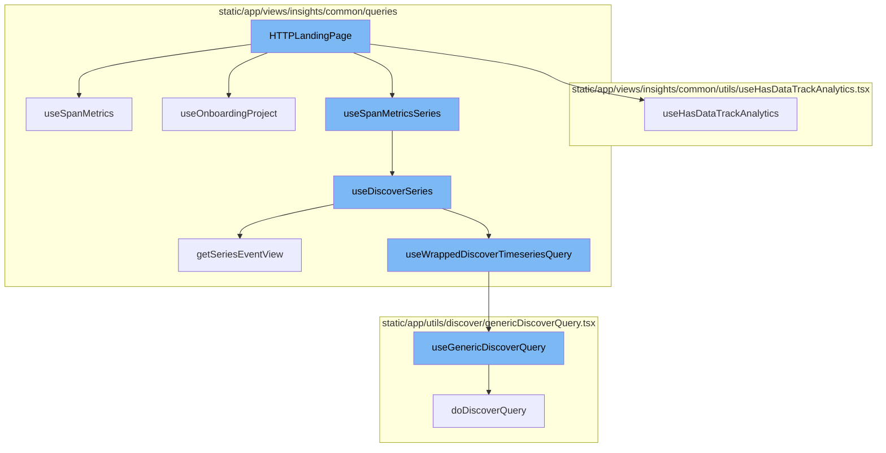
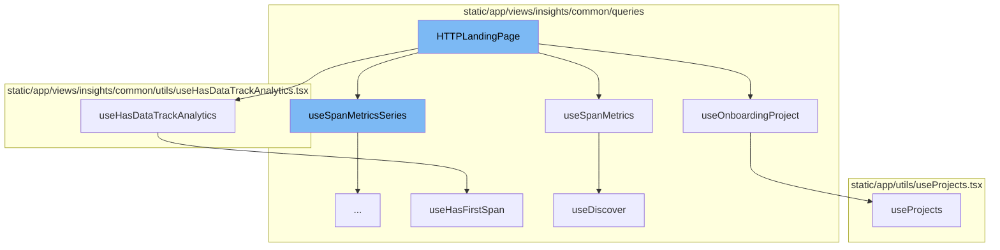
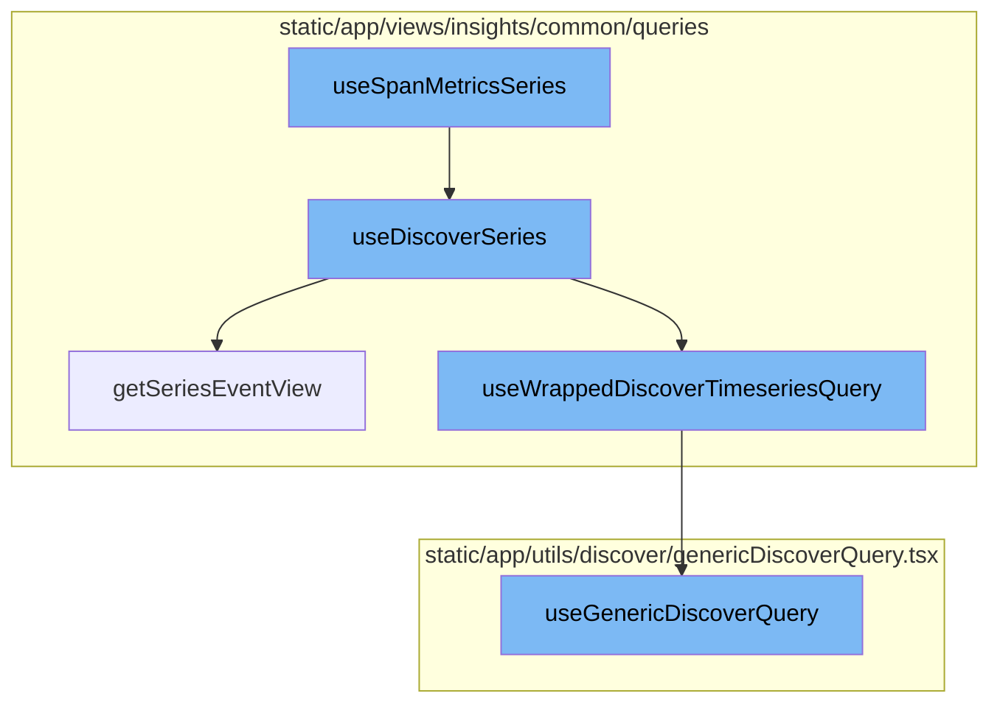

# HTTPLandingPage Overview

The HTTPLandingPage is a central component in the HTTP landing page. It uses several hooks to fetch and manage data, and it renders the HTTP landing page's UI. The function uses the organization and location from the hooks `useOrganization` and `useLocation`. It also uses the `useOnboardingProject` hook to get the onboarding project. The function then decodes the sort field and the location query. It sets up filters for the charts and tables, and defines a handler for search functionality. The function then uses the `useSpanMetricsSeries` hook three times to fetch data for throughput, duration, and response code charts. It also uses the `useSpanMetrics` hook to fetch data for the domains list. The function then uses the `useSynchronizeCharts` and `useHasDataTrackAnalytics` hooks for chart synchronization and analytics tracking. Finally, the function renders the HTTP landing page's UI.

# useSpanMetrics Hook

The `useSpanMetrics` hook is used to fetch span metrics data. It uses the `useDiscover` hook with the `DiscoverDatasets.SPANS_METRICS` dataset and the provided options and referrer.

# useHasDataTrackAnalytics Hook

The `useHasDataTrackAnalytics` hook is used to track analytics for the HTTP landing page. It uses the `useOrganization` and `usePageFilters` hooks to get the organization and page filters. It also uses the `useHasFirstSpan` hook to check if the module has ever sent data. The hook then sets a tag in Sentry and tracks an analytics event.

# useOnboardingProject Hook

The `useOnboardingProject` hook is used to get the onboarding project. It uses the `useProjects` and `usePageFilters` hooks to get the projects and page filters. The hook then filters the projects based on the current selection and returns the first project that has not sent a transaction event yet.

# useProjects Hook

The `useProjects` hook is used to get projects from the ProjectsStore. It provides a way to select specific project slugs, and search for more projects that may not be in the project store. The hook loads specified team slugs and updates the `initiallyLoaded` state when the project store finishes loading.

# useHasFirstSpan Hook

The `useHasFirstSpan` hook is used to check if the module and current project selection has received a first insight span. It uses the `useProjects` and `usePageFilters` hooks to get the projects and page filters. The hook then checks if any of the selected projects has sent a first insight span for the module.

# useDiscover Hook

The `useDiscover` hook is used to fetch discover data. It uses the `useWrappedDiscoverTimeseriesQuery` hook with the provided event view, limit, enabled state, referrer, and cursor. The hook then returns the result with the data, enabled state, and other properties.

# useSpanMetricsSeries Function

The `useSpanMetricsSeries` function is a hook that uses the `useDiscoverSeries` function with specific parameters to fetch span metrics data.

# useDiscoverSeries Function

The `useDiscoverSeries` function is a hook that fetches metrics series data. It uses the `getSeriesEventView` function to create an event view and the `useWrappedDiscoverTimeseriesQuery` function to fetch the data.

# getSeriesEventView Function

The `getSeriesEventView` function creates an event view based on the provided parameters. This event view is used to fetch the data in the `useWrappedDiscoverTimeseriesQuery` function.

# useWrappedDiscoverTimeseriesQuery Function

The `useWrappedDiscoverTimeseriesQuery` function is a hook that fetches timeseries data based on the provided event view. It uses the `useGenericDiscoverQuery` function to fetch the data.

# useGenericDiscoverQuery Function

The `useGenericDiscoverQuery` function is a hook that fetches data from the Discover API based on the provided parameters. This is the final step in the flow where the data is fetched and returned.



# Flow drill down

First, we'll zoom into this section of the flow:



<SwmSnippet path="/static/app/views/insights/http/views/httpLandingPage.tsx" line="48">

---

# HTTPLandingPage Function

The `HTTPLandingPage` function is the main component of the HTTP landing page. It uses several hooks to fetch and manage data, and it renders the HTTP landing page's UI. The function uses the organization and location from the hooks `useOrganization` and `useLocation`. It also uses the `useOnboardingProject` hook to get the onboarding project. The function then decodes the sort field and the location query. It sets up filters for the charts and tables, and defines a handler for search functionality. The function then uses the `useSpanMetricsSeries` hook three times to fetch data for throughput, duration, and response code charts. It also uses the `useSpanMetrics` hook to fetch data for the domains list. The function then uses the `useSynchronizeCharts` and `useHasDataTrackAnalytics` hooks for chart synchronization and analytics tracking. Finally, the function renders the HTTP landing page's UI.

```tsx
export function HTTPLandingPage() {
  const organization = useOrganization();
  const location = useLocation();
  const onboardingProject = useOnboardingProject();

  const sortField = decodeScalar(location.query?.[QueryParameterNames.DOMAINS_SORT]);

  // TODO: Pull this using `useLocationQuery` below
  const sort = decodeSorts(sortField).filter(isAValidSort).at(0) ?? DEFAULT_SORT;

  const query = useLocationQuery({
    fields: {
      'span.domain': decodeScalar,
    },
  });

  const chartFilters = {
    ...BASE_FILTERS,
  };

  const tableFilters = {
```

---

</SwmSnippet>

<SwmSnippet path="/static/app/views/insights/common/queries/useDiscover.ts" line="38">

---

# useSpanMetrics Hook

The `useSpanMetrics` hook is used to fetch span metrics data. It uses the `useDiscover` hook with the `DiscoverDatasets.SPANS_METRICS` dataset and the provided options and referrer.

```typescript
export const useSpanMetrics = <Fields extends SpanMetricsProperty[]>(
  options: UseMetricsOptions<Fields> = {},
  referrer: string
) => {
  return useDiscover<Fields, SpanMetricsResponse>(
    options,
    DiscoverDatasets.SPANS_METRICS,
    referrer
  );
};
```

---

</SwmSnippet>

<SwmSnippet path="/static/app/views/insights/common/utils/useHasDataTrackAnalytics.tsx" line="10">

---

# useHasDataTrackAnalytics Hook

The `useHasDataTrackAnalytics` hook is used to track analytics for the HTTP landing page. It uses the `useOrganization` and `usePageFilters` hooks to get the organization and page filters. It also uses the `useHasFirstSpan` hook to check if the module has ever sent data. The hook then sets a tag in Sentry and tracks an analytics event.

```tsx
export function useHasDataTrackAnalytics(module: ModuleName, analyticEvent: string) {
  const organization = useOrganization();
  const pageFilters = usePageFilters();
  const hasEverSentData = useHasFirstSpan(module);

  Sentry.withScope(scope => {
    scope.setTag(`insights.${module}.hasEverSentData`, hasEverSentData);
  });

  const projects = JSON.stringify(pageFilters.selection.projects);

  useEffect(() => {
    trackAnalytics(analyticEvent, {
      organization,
      has_ever_sent_data: hasEverSentData,
    });
  }, [organization, hasEverSentData, analyticEvent, projects]);
}
```

---

</SwmSnippet>

<SwmSnippet path="/static/app/views/insights/common/queries/useOnboardingProject.tsx" line="6">

---

# useOnboardingProject Hook

The `useOnboardingProject` hook is used to get the onboarding project. It uses the `useProjects` and `usePageFilters` hooks to get the projects and page filters. The hook then filters the projects based on the current selection and returns the first project that has not sent a transaction event yet.

```tsx
export function useOnboardingProject(): Project | undefined {
  const {projects} = useProjects();
  const pageFilters = usePageFilters();
  if (projects.length === 0) {
    return undefined;
  }

  // Current selection is 'my projects' or 'all projects'
  if (
    pageFilters.selection.projects.length === 0 ||
    pageFilters.selection.projects[0] === ALL_ACCESS_PROJECTS
  ) {
    const filtered = projects.filter(p => p.firstTransactionEvent === false);
    if (filtered.length === projects.length) {
      return filtered[0];
    }
  }

  // Any other subset of projects.
  const filtered = projects.filter(
    p =>
```

---

</SwmSnippet>

<SwmSnippet path="/static/app/utils/useProjects.tsx" line="141">

---

# useProjects Hook

The `useProjects` hook is used to get projects from the ProjectsStore. It provides a way to select specific project slugs, and search for more projects that may not be in the project store. The hook loads specified team slugs and updates the `initiallyLoaded` state when the project store finishes loading.

```tsx
/**
 * Provides projects from the ProjectsStore
 *
 * This hook also provides a way to select specific project slugs, and search
 * (type-ahead) for more projects that may not be in the project store.
 *
 * NOTE: Currently ALL projects are always loaded, but this hook is designed
 * for future-compat in a world where we do _not_ load all projects.
 */
function useProjects({limit, slugs, orgId: propOrgId}: Options = {}) {
  const api = useApi();

  const organization = useOrganization({allowNull: true});
  const store = useLegacyStore(ProjectsStore);

  const orgId = propOrgId ?? organization?.slug ?? organization?.slug;

  const storeSlugs = new Set(store.projects.map(t => t.slug));
  const slugsToLoad = slugs?.filter(slug => !storeSlugs.has(slug)) ?? [];
  const shouldLoadSlugs = slugsToLoad.length > 0;

```

---

</SwmSnippet>

<SwmSnippet path="/static/app/views/insights/common/queries/useHasFirstSpan.tsx" line="30">

---

# useHasFirstSpan Hook

The `useHasFirstSpan` hook is used to check if the module and current project selection has received a first insight span. It uses the `useProjects` and `usePageFilters` hooks to get the projects and page filters. The hook then checks if any of the selected projects has sent a first insight span for the module.

```tsx
/* Returns whether the module and current project selection has received a first insight span */
export function useHasFirstSpan(module: ModuleName): boolean {
  const {projects: allProjects} = useProjects();
  const pageFilters = usePageFilters();

  // Unsupported modules. Remove MOBILE_UI from this list once released.
  if ((excludedModuleNames as readonly ModuleName[]).includes(module)) return false;

  let selectedProjects: Project[] = [];
  // There are three cases for the selected pageFilter projects:
  //  - [] empty list represents "My Projects"
  //  - [-1] represents "All Projects"
  //  - [.., ..] otherwise, represents a list of project IDs
  if (pageFilters.selection.projects.length === 0) {
    selectedProjects = allProjects.filter(p => p.isMember);
  } else if (
    pageFilters.selection.projects.length === 1 &&
    pageFilters.selection.projects[0] === -1
  ) {
    selectedProjects = allProjects;
  } else {
```

---

</SwmSnippet>

<SwmSnippet path="/static/app/views/insights/common/queries/useDiscover.ts" line="60">

---

# useDiscover Hook

The `useDiscover` hook is used to fetch discover data. It uses the `useWrappedDiscoverQuery` hook with the provided event view, limit, enabled state, referrer, and cursor. The hook then returns the result with the data, enabled state, and other properties.

```typescript
const useDiscover = <T extends Extract<keyof ResponseType, string>[], ResponseType>(
  options: UseMetricsOptions<T> = {},
  dataset: DiscoverDatasets,
  referrer: string
) => {
  const {
    fields = [],
    search = undefined,
    sorts = [],
    limit,
    cursor,
    pageFilters: pageFiltersFromOptions,
  } = options;

  const pageFilters = usePageFilters();

  const eventView = getEventView(
    search,
    fields,
    sorts,
    pageFiltersFromOptions ?? pageFilters.selection,
```

---

</SwmSnippet>

Now, lets zoom into this section of the flow:



<SwmSnippet path="/static/app/views/insights/common/queries/useDiscoverSeries.ts" line="30">

---

# HTTPLandingPage Flow

The flow begins with the `useSpanMetricsSeries` function. This function is a hook that uses the `useDiscoverSeries` function with specific parameters to fetch span metrics data.

```typescript
export const useSpanMetricsSeries = <Fields extends SpanMetricsProperty[]>(
  options: UseMetricsSeriesOptions<Fields> = {},
  referrer: string
) => {
  return useDiscoverSeries<Fields>(options, DiscoverDatasets.SPANS_METRICS, referrer);
};
```

---

</SwmSnippet>

<SwmSnippet path="/static/app/views/insights/common/queries/useDiscoverSeries.ts" line="56">

---

The `useDiscoverSeries` function is a hook that fetches metrics series data. It uses the `getSeriesEventView` function to create an event view and the `useWrappedDiscoverTimeseriesQuery` function to fetch the data.

```typescript
const useDiscoverSeries = <T extends string[]>(
  options: UseMetricsSeriesOptions<T> = {},
  dataset: DiscoverDatasets,
  referrer: string
) => {
  const {search = undefined, yAxis = [], interval = undefined} = options;

  const pageFilters = usePageFilters();

  const eventView = getSeriesEventView(
    search,
    undefined,
    pageFilters.selection,
    yAxis,
    undefined,
    dataset
  );

  if (interval) {
    eventView.interval = interval;
  }
```

---

</SwmSnippet>

<SwmSnippet path="/static/app/views/insights/common/queries/getSeriesEventView.tsx" line="12">

---

The `getSeriesEventView` function creates an event view based on the provided parameters. This event view is used to fetch the data in the `useWrappedDiscoverTimeseriesQuery` function.

```tsx
export function getSeriesEventView(
  search: MutableSearch | undefined,
  fields: string[] = [],
  pageFilters: PageFilters,
  yAxis: string[],
  topEvents?: number,
  dataset?: DiscoverDatasets
) {
  // Pick the highest possible interval for the given yAxis selection. Find the ideal interval for each function, then choose the largest one. This results in the lowest granularity, but best performance.
  const interval = sortBy(
    yAxis.map(yAxisFunctionName => {
      const parseResult = parseFunction(yAxisFunctionName);

      if (!parseResult) {
        return DEFAULT_INTERVAL;
      }

      return getIntervalForMetricFunction(parseResult.name, pageFilters.datetime);
    }),
    result => {
      return intervalToMilliseconds(result);
```

---

</SwmSnippet>

<SwmSnippet path="/static/app/views/insights/common/queries/useSpansQuery.tsx" line="63">

---

The `useWrappedDiscoverTimeseriesQuery` function is a hook that fetches timeseries data based on the provided event view. It uses the `useGenericDiscoverQuery` function to fetch the data.

```tsx
export function useWrappedDiscoverTimeseriesQuery<T>({
  eventView,
  enabled,
  initialData,
  referrer,
  cursor,
  overriddenRoute,
}: {
  eventView: EventView;
  cursor?: string;
  enabled?: boolean;
  initialData?: any;
  overriddenRoute?: string;
  referrer?: string;
}) {
  const location = useLocation();
  const organization = useOrganization();
  const {isReady: pageFiltersReady} = usePageFilters();
  const result = useGenericDiscoverQuery<
    {
      data: any[];
```

---

</SwmSnippet>

<SwmSnippet path="/static/app/utils/discover/genericDiscoverQuery.tsx" line="419">

---

The `useGenericDiscoverQuery` function is a hook that fetches data from the Discover API based on the provided parameters. This is the final step in the flow where the data is fetched and returned.

```tsx
export function useGenericDiscoverQuery<T, P>(props: Props<T, P>) {
  const api = useApi();
  const {orgSlug, route, options} = props;
  const url = `/organizations/${orgSlug}/${route}/`;
  const apiPayload = getPayload<T, P>(props);

  const res = useQuery<[T, string | undefined, ResponseMeta<T> | undefined], QueryError>(
    [route, apiPayload],
    ({signal: _signal}) =>
      doDiscoverQuery<T>(api, url, apiPayload, {
        queryBatching: props.queryBatching,
        skipAbort: props.skipAbort,
      }),
    options
  );

  return {
    ...res,
    data: res.data?.[0] ?? undefined,
    error: parseError(res.error),
    statusCode: res.data?.[1] ?? undefined,
```

---

</SwmSnippet>

&nbsp;

*This is an auto-generated document by Swimm AI 🌊 and has not yet been verified by a human*

<SwmMeta version="3.0.0" repo-id="Z2l0aHViJTNBJTNBc2VudHJ5LWRlbW8lM0ElM0FTd2ltbS1EZW1v" repo-name="sentry-demo" doc-type="flows"><sup>Powered by [Swimm](/)</sup></SwmMeta>
