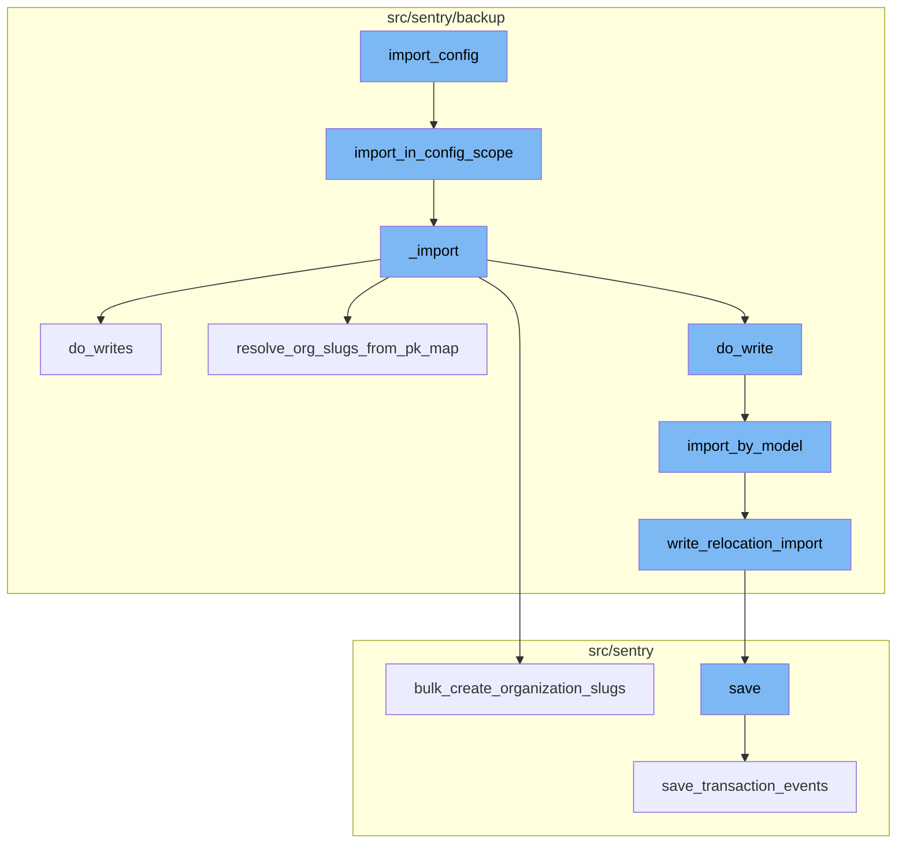
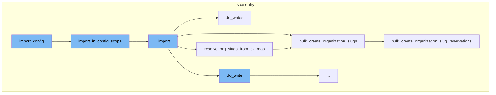
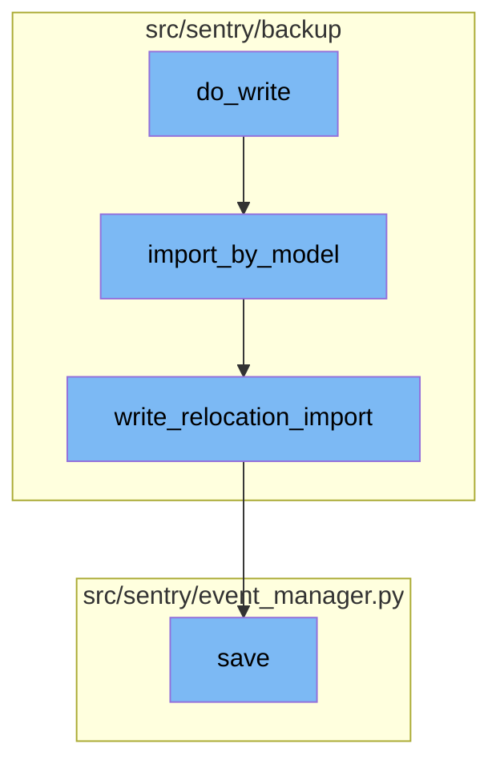

# Overview of import_config

The `import_config` function is the starting point of the import process in Sentry. It is responsible for importing all the necessary configurations and administrator accounts needed to set up a Sentry instance. The function takes several parameters including the source file, decryption keys, and various flags.

<SwmSnippet path="/src/sentry/runner/commands/backup.py" line="816">

---

# Overview of import_config

Here is the `import_config` function. It calls the `import_in_config_scope` function, passing along the parameters it received.

```python
def import_config(
    src: IO[bytes],
    decrypt_with: IO[bytes],
    decrypt_with_gcp_kms: IO[bytes],
    findings_file: IO[str],
    merge_users: bool,
    no_prompt: bool,
    overwrite_configs: bool,
    silent: bool,
) -> None:
    """
    Import all configuration and administrator accounts needed to set up this Sentry instance.
    """

    from sentry.backup.imports import import_in_config_scope

    printer = get_printer(silent=silent, no_prompt=no_prompt)
    with write_import_findings(findings_file, printer):
        import_in_config_scope(
            src,
            decryptor=get_decryptor_from_flags(decrypt_with, decrypt_with_gcp_kms),
```

---

</SwmSnippet>

# import_in_config_scope Function

The `import_in_config_scope` function is responsible for performing an import in the `Config` scope. This means it imports all models required to globally configure and administrate a Sentry instance from the provided source file.

<SwmSnippet path="/src/sentry/backup/imports.py" line="551">

---

# import_in_config_scope Function

Here is the `import_in_config_scope` function. It calls the `_import` function to perform the actual import.

```python
def import_in_config_scope(
    src: IO[bytes],
    *,
    decryptor: Decryptor | None = None,
    flags: ImportFlags | None = None,
    user_filter: set[str] | None = None,
    printer: Printer,
):
    """
    Perform an import in the `Config` scope, meaning that we will import all models required to
    globally configure and administrate a Sentry instance from the provided `src` file. This
    requires importing all users in the supplied file, including those with administrator
    privileges.

    Like imports in the `Global` scope, superuser and administrator privileges are not sanitized.
    Unlike the `Global` scope, however, user-specific authentication information 2FA methods and
    social login connections are not retained.
    """

    # Import here to prevent circular module resolutions.
    from sentry.models.user import User
```

---

</SwmSnippet>

# \_import Function

The `_import` function is the core of the import process. It reads the content from the source file, parses it into models, and then writes these models into the database. It also resolves organization slugs and creates slug reservations.

<SwmSnippet path="/src/sentry/backup/imports.py" line="86">

---

# \_import Function

Here is the `_import` function. It calls several other functions to perform the actual import, including `do_writes`, `resolve_org_slugs_from_pk_map`, and `bulk_create_organization_slugs`.

```python
def _import(
    src: IO[bytes],
    scope: ImportScope,
    *,
    decryptor: Decryptor | None = None,
    flags: ImportFlags | None = None,
    filter_by: Filter | None = None,
    printer: Printer,
):
    """
    Imports core data for a Sentry installation.

    It is generally preferable to avoid calling this function directly, as there are certain
    combinations of input parameters that should not be used together. Instead, use one of the other
    wrapper functions in this file, named `import_in_XXX_scope()`.
    """

    # Import here to prevent circular module resolutions.
    from sentry.models.email import Email
    from sentry.models.organization import Organization
    from sentry.models.organizationmember import OrganizationMember
```

---

</SwmSnippet>

# do_writes Function

The `do_writes` function is responsible for writing the imported models into the database. It iterates over the models and calls the `do_write` function for each one.

<SwmSnippet path="/src/sentry/backup/imports.py" line="395">

---

# do_writes Function

Here is the `do_writes` function. It calls the `do_write` function for each model.

```python
    def do_writes(pk_map: PrimaryKeyMap) -> None:
        nonlocal deferred_org_auth_tokens, import_write_context

        for model_name, json_data, offset in yield_json_models(content):
            if model_name == org_auth_token_model_name:
                deferred_org_auth_tokens.append(json_data)
                continue

            do_write(import_write_context, pk_map, model_name, json_data, offset)
```

---

</SwmSnippet>

# resolve_org_slugs_from_pk_map Function

The `resolve_org_slugs_from_pk_map` function resolves slugs for all imported organization models and reconciles their slug globally by issuing a slug update. It calls the `bulk_create_organization_slugs` function to create slug reservations.

<SwmSnippet path="/src/sentry/backup/imports.py" line="405">

---

# resolve_org_slugs_from_pk_map Function

Here is the `resolve_org_slugs_from_pk_map` function. It calls the `bulk_create_organization_slugs` function to create slug reservations.

```python
    # Resolves slugs for all imported organization models via the PrimaryKeyMap and reconciles
    # their slug globally via control silo by issuing a slug update.
    def resolve_org_slugs_from_pk_map(pk_map: PrimaryKeyMap):
        from sentry.services.organization import organization_provisioning_service

        org_pk_mapping = pk_map.mapping[str(org_model_name)]
        if not org_pk_mapping:
            return

        slug_mapping: dict[int, str] = {}
        for old_primary_key in org_pk_mapping:
            org_id, _, org_slug = org_pk_mapping[old_primary_key]
            slug_mapping[org_id] = org_slug or ""

        if len(slug_mapping) > 0:
            # HACK(azaslavsky): Okay, this gets a bit complicated, but bear with me: the following
            # `bulk_create...` calls will result in some actions on the control silo that call back
            # into this region. So the client (this region) calls the server (the control silo)
            # which may need to make one or more calls back into the client (this region). Because
            # some of our `OrganizationMemberTeam` outboxes may not be drained due to the HACK we
            # performed in `import_export/impl.py` (see that file for more details), there may be a
```

---

</SwmSnippet>

# bulk_create_organization_slugs Function

The `bulk_create_organization_slugs` function is responsible for creating slug reservations for imported organizations. It calls the `bulk_create_organization_slug_reservations` function to perform the actual slug reservation creation.

<SwmSnippet path="/src/sentry/services/organization/provisioning.py" line="141">

---

# bulk_create_organization_slugs Function

Here is the `bulk_create_organization_slugs` function. It calls the `bulk_create_organization_slug_reservations` function to create slug reservations.

```python
    def bulk_create_organization_slugs(
        self, slug_mapping: dict[int, str], region_name: str | None = None
    ):
        """
        CAUTION: DO NOT USE THIS OUTSIDE OF THE IMPORT/RELOCATION CONTEXT

        Organizations are meant to be provisioned via the
         `provision_organization_in_region` method, which handles both slug
         reservation and organization creation.

        Bulk creates slug reservations for imported organizations that already
        exist on the region. Each target organization is provided as a tuple of
        Organization ID (int) and base slug (str).

        :param org_ids_and_slugs: A set of tuples containing an organization ID
        and base slug.
        :param region_name: The region where the imported organizations exist
        :return:
        """
        destination_region_name = self._validate_or_default_region(region_name=region_name)

```

---

</SwmSnippet>

# bulk_create_organization_slug_reservations Function

The `bulk_create_organization_slug_reservations` function creates slug reservations for imported organizations that already exist on the region. It also validates that the primary slug has been updated.

<SwmSnippet path="/src/sentry/hybridcloud/services/control_organization_provisioning/impl.py" line="256">

---

# bulk_create_organization_slug_reservations Function

Here is the `bulk_create_organization_slug_reservations` function. It creates slug reservations for imported organizations.

```python
    def bulk_create_organization_slug_reservations(
        self,
        *,
        region_name: str,
        slug_mapping: dict[int, str],
    ) -> None:
        slug_reservations_to_create: list[OrganizationSlugReservation] = []

        with outbox_context(transaction.atomic(router.db_for_write(OrganizationSlugReservation))):
            for org_id, slug in slug_mapping.items():
                slug_reservation = OrganizationSlugReservation(
                    slug=self._generate_org_slug(slug=slug, region_name=region_name),
                    organization_id=org_id,
                    reservation_type=OrganizationSlugReservationType.TEMPORARY_RENAME_ALIAS.value,
                    user_id=-1,
                    region_name=region_name,
                )
                slug_reservation.save(unsafe_write=True)

                slug_reservations_to_create.append(slug_reservation)

```

---

</SwmSnippet>

# do_write Function

The `do_write` function is responsible for writing a single model. It first checks if the model has any dependencies. If not, it returns. Otherwise, it retrieves the model's dependencies and the appropriate importer for the model. It then calls the `import_by_model` function with the necessary parameters.

<SwmSnippet path="/src/sentry/backup/imports.py" line="295">

---

# do_write Function

Here is the `do_write` function. It calls the `import_by_model` function to import the model.

```python
    # Perform the write of a single model.
    def do_write(
        import_write_context: ImportWriteContext,
        pk_map: PrimaryKeyMap,
        model_name: NormalizedModelName,
        json_data: Any,
        offset: int,
    ) -> None:
        model_relations = import_write_context.dependencies.get(model_name)
        if not model_relations:
            return

        dep_models = {get_model_name(d) for d in model_relations.get_dependencies_for_relocation()}
        import_by_model = ImportExportService.get_importer_for_model(model_relations.model)
        model_name_str = str(model_name)
        min_ordinal = offset + 1

        extra = {
            "model_name": model_name_str,
            "import_uuid": flags.import_uuid,
            "min_ordinal": min_ordinal,
```

---

</SwmSnippet>

# import_by_model Function

The `import_by_model` function is responsible for importing a model. It first checks if the model can be imported based on its name, scope, and flags. If the model can be imported, it deserializes the JSON data and writes the model instance to the database. If the model instance already exists, it updates the existing instance. If the model instance does not exist, it creates a new instance.

<SwmSnippet path="/src/sentry/backup/services/import_export/impl.py" line="104">

---

# import_by_model Function

Here is the `import_by_model` function. It deserializes the JSON data and writes the model instance to the database.

```python
    """

    def import_by_model(
        self,
        *,
        model_name: str,
        scope: RpcImportScope | None = None,
        flags: RpcImportFlags,
        filter_by: list[RpcFilter],
        pk_map: RpcPrimaryKeyMap,
        json_data: str,
        min_ordinal: int,
    ) -> RpcImportResult:
        if min_ordinal < 1:
            return RpcImportError(
                kind=RpcImportErrorKind.InvalidMinOrdinal,
                on=InstanceID(model_name),
                reason=f"The model `{model_name}` was offset with an invalid `min_ordinal` of `{min_ordinal}`",
            )

        batch_model_name = NormalizedModelName(model_name)
```

---

</SwmSnippet>

# write_relocation_import Function

The `write_relocation_import` function is responsible for writing the model instance to the database. It first checks if the model instance has a unique set of fields that could potentially cause collisions. If the model instance has a unique set of fields, it checks if an existing model instance with the same unique set of fields already exists. If an existing model instance exists, it either reuses the existing data or overwrites the existing data based on the flags. If an existing model instance does not exist, it writes the model instance as usual.

<SwmSnippet path="/src/sentry/backup/mixins.py" line="13">

---

# write_relocation_import Function

Here is the `write_relocation_import` function. It checks if an existing model instance with the same unique set of fields already exists. If an existing model instance exists, it either reuses the existing data or overwrites the existing data based on the flags.

```python
    """

    # TODO(getsentry/team-ospo#190): Clean up the type checking in this method.
    def write_relocation_import(
        self, scope: ImportScope, flags: ImportFlags
    ) -> tuple[int, ImportKind] | None:
        # Get all unique sets that will potentially cause collisions.
        uniq_sets = dependencies()[get_model_name(self)].get_uniques_without_foreign_keys()  # type: ignore[arg-type]

        # Don't use this mixin for models with multiple unique sets; write custom logic instead.
        assert len(uniq_sets) <= 1

        # Must set `__relocation_custom_ordinal__` on models that use this mixin.
        assert getattr(self.__class__, "__relocation_custom_ordinal__", None) is not None

        if self.get_relocation_scope() == RelocationScope.Config:  # type: ignore[attr-defined]
            if len(uniq_sets) == 1:
                uniq_set = uniq_sets[0]
                query = dict()
                for uniq_field_name in uniq_set:
                    if getattr(self, uniq_field_name, None) is not None:
```

---

</SwmSnippet>

# save Function

The `save` function is responsible for saving the event after normalizing and processing it. It first checks if the event has been normalized. If not, it normalizes the event. It then writes the event to the eventstream. If the event is a transaction, it saves the transaction event. If the event is a generic event, it saves the generic event. Otherwise, it saves the error event.

<SwmSnippet path="/src/sentry/event_manager.py" line="442">

---

# save Function

Here is the `save` function. It saves the event after normalizing and processing it.

```python
    def save(
        self,
        project_id: int | None,
        raw: bool = False,
        assume_normalized: bool = False,
        start_time: float | None = None,
        cache_key: str | None = None,
        skip_send_first_transaction: bool = False,
        has_attachments: bool = False,
    ) -> Event:
        """
        After normalizing and processing an event, save adjacent models such as
        releases and environments to postgres and write the event into
        eventstream. From there it will be picked up by Snuba and
        post-processing.

        We re-insert events with duplicate IDs into Snuba, which is responsible
        for deduplicating events. Since deduplication in Snuba is on the primary
        key (based on event ID, project ID and day), events with same IDs are only
        deduplicated if their timestamps fall on the same day. The latest event
        always wins and overwrites the value of events received earlier in that day.
```

---

</SwmSnippet>



# Flow drill down

First, we'll zoom into this section of the flow:



<SwmSnippet path="/src/sentry/runner/commands/backup.py" line="816">

---

# import_config Function

The `import_config` function is the entry point for the import process. It takes several parameters including the source file, decryption keys, and various flags. It then calls the `import_in_config_scope` function, passing along these parameters.

```python
def import_config(
    src: IO[bytes],
    decrypt_with: IO[bytes],
    decrypt_with_gcp_kms: IO[bytes],
    findings_file: IO[str],
    merge_users: bool,
    no_prompt: bool,
    overwrite_configs: bool,
    silent: bool,
) -> None:
    """
    Import all configuration and administrator accounts needed to set up this Sentry instance.
    """

    from sentry.backup.imports import import_in_config_scope

    printer = get_printer(silent=silent, no_prompt=no_prompt)
    with write_import_findings(findings_file, printer):
        import_in_config_scope(
            src,
            decryptor=get_decryptor_from_flags(decrypt_with, decrypt_with_gcp_kms),
```

---

</SwmSnippet>

<SwmSnippet path="/src/sentry/backup/imports.py" line="551">

---

# import_in_config_scope Function

The `import_in_config_scope` function is responsible for performing an import in the `Config` scope. This means it imports all models required to globally configure and administrate a Sentry instance from the provided source file. It calls the `_import` function to perform the actual import.

```python
def import_in_config_scope(
    src: IO[bytes],
    *,
    decryptor: Decryptor | None = None,
    flags: ImportFlags | None = None,
    user_filter: set[str] | None = None,
    printer: Printer,
):
    """
    Perform an import in the `Config` scope, meaning that we will import all models required to
    globally configure and administrate a Sentry instance from the provided `src` file. This
    requires importing all users in the supplied file, including those with administrator
    privileges.

    Like imports in the `Global` scope, superuser and administrator privileges are not sanitized.
    Unlike the `Global` scope, however, user-specific authentication information 2FA methods and
    social login connections are not retained.
    """

    # Import here to prevent circular module resolutions.
    from sentry.models.user import User
```

---

</SwmSnippet>

<SwmSnippet path="/src/sentry/backup/imports.py" line="86">

---

# \_import Function

The `_import` function is the core of the import process. It reads the content from the source file, parses it into models, and then writes these models into the database. It also resolves organization slugs and creates slug reservations.

```python
def _import(
    src: IO[bytes],
    scope: ImportScope,
    *,
    decryptor: Decryptor | None = None,
    flags: ImportFlags | None = None,
    filter_by: Filter | None = None,
    printer: Printer,
):
    """
    Imports core data for a Sentry installation.

    It is generally preferable to avoid calling this function directly, as there are certain
    combinations of input parameters that should not be used together. Instead, use one of the other
    wrapper functions in this file, named `import_in_XXX_scope()`.
    """

    # Import here to prevent circular module resolutions.
    from sentry.models.email import Email
    from sentry.models.organization import Organization
    from sentry.models.organizationmember import OrganizationMember
```

---

</SwmSnippet>

<SwmSnippet path="/src/sentry/backup/imports.py" line="395">

---

# do_writes Function

The `do_writes` function is responsible for writing the imported models into the database. It iterates over the models and calls the `do_write` function for each one.

```python
    def do_writes(pk_map: PrimaryKeyMap) -> None:
        nonlocal deferred_org_auth_tokens, import_write_context

        for model_name, json_data, offset in yield_json_models(content):
            if model_name == org_auth_token_model_name:
                deferred_org_auth_tokens.append(json_data)
                continue

            do_write(import_write_context, pk_map, model_name, json_data, offset)
```

---

</SwmSnippet>

<SwmSnippet path="/src/sentry/backup/imports.py" line="405">

---

# resolve_org_slugs_from_pk_map Function

The `resolve_org_slugs_from_pk_map` function resolves slugs for all imported organization models and reconciles their slug globally by issuing a slug update. It calls the `bulk_create_organization_slugs` function to create slug reservations.

```python
    # Resolves slugs for all imported organization models via the PrimaryKeyMap and reconciles
    # their slug globally via control silo by issuing a slug update.
    def resolve_org_slugs_from_pk_map(pk_map: PrimaryKeyMap):
        from sentry.services.organization import organization_provisioning_service

        org_pk_mapping = pk_map.mapping[str(org_model_name)]
        if not org_pk_mapping:
            return

        slug_mapping: dict[int, str] = {}
        for old_primary_key in org_pk_mapping:
            org_id, _, org_slug = org_pk_mapping[old_primary_key]
            slug_mapping[org_id] = org_slug or ""

        if len(slug_mapping) > 0:
            # HACK(azaslavsky): Okay, this gets a bit complicated, but bear with me: the following
            # `bulk_create...` calls will result in some actions on the control silo that call back
            # into this region. So the client (this region) calls the server (the control silo)
            # which may need to make one or more calls back into the client (this region). Because
            # some of our `OrganizationMemberTeam` outboxes may not be drained due to the HACK we
            # performed in `import_export/impl.py` (see that file for more details), there may be a
```

---

</SwmSnippet>

<SwmSnippet path="/src/sentry/services/organization/provisioning.py" line="141">

---

# bulk_create_organization_slugs Function

The `bulk_create_organization_slugs` function is responsible for creating slug reservations for imported organizations. It calls the `bulk_create_organization_slug_reservations` function to perform the actual slug reservation creation.

```python
    def bulk_create_organization_slugs(
        self, slug_mapping: dict[int, str], region_name: str | None = None
    ):
        """
        CAUTION: DO NOT USE THIS OUTSIDE OF THE IMPORT/RELOCATION CONTEXT

        Organizations are meant to be provisioned via the
         `provision_organization_in_region` method, which handles both slug
         reservation and organization creation.

        Bulk creates slug reservations for imported organizations that already
        exist on the region. Each target organization is provided as a tuple of
        Organization ID (int) and base slug (str).

        :param org_ids_and_slugs: A set of tuples containing an organization ID
        and base slug.
        :param region_name: The region where the imported organizations exist
        :return:
        """
        destination_region_name = self._validate_or_default_region(region_name=region_name)

```

---

</SwmSnippet>

<SwmSnippet path="/src/sentry/hybridcloud/services/control_organization_provisioning/impl.py" line="256">

---

# bulk_create_organization_slug_reservations Function

The `bulk_create_organization_slug_reservations` function creates slug reservations for imported organizations that already exist on the region. It also validates that the primary slug has been updated.

```python
    def bulk_create_organization_slug_reservations(
        self,
        *,
        region_name: str,
        slug_mapping: dict[int, str],
    ) -> None:
        slug_reservations_to_create: list[OrganizationSlugReservation] = []

        with outbox_context(transaction.atomic(router.db_for_write(OrganizationSlugReservation))):
            for org_id, slug in slug_mapping.items():
                slug_reservation = OrganizationSlugReservation(
                    slug=self._generate_org_slug(slug=slug, region_name=region_name),
                    organization_id=org_id,
                    reservation_type=OrganizationSlugReservationType.TEMPORARY_RENAME_ALIAS.value,
                    user_id=-1,
                    region_name=region_name,
                )
                slug_reservation.save(unsafe_write=True)

                slug_reservations_to_create.append(slug_reservation)

```

---

</SwmSnippet>

Now, lets zoom into this section of the flow:



<SwmSnippet path="/src/sentry/backup/imports.py" line="295">

---

# do_write Function

The `do_write` function is responsible for writing a single model. It first checks if the model has any dependencies. If not, it returns. Otherwise, it retrieves the model's dependencies and the appropriate importer for the model. It then calls the `import_by_model` function with the necessary parameters.

```python
    # Perform the write of a single model.
    def do_write(
        import_write_context: ImportWriteContext,
        pk_map: PrimaryKeyMap,
        model_name: NormalizedModelName,
        json_data: Any,
        offset: int,
    ) -> None:
        model_relations = import_write_context.dependencies.get(model_name)
        if not model_relations:
            return

        dep_models = {get_model_name(d) for d in model_relations.get_dependencies_for_relocation()}
        import_by_model = ImportExportService.get_importer_for_model(model_relations.model)
        model_name_str = str(model_name)
        min_ordinal = offset + 1

        extra = {
            "model_name": model_name_str,
            "import_uuid": flags.import_uuid,
            "min_ordinal": min_ordinal,
```

---

</SwmSnippet>

<SwmSnippet path="/src/sentry/backup/services/import_export/impl.py" line="104">

---

# import_by_model Function

The `import_by_model` function is responsible for importing a model. It first checks if the model can be imported based on its name, scope, and flags. If the model can be imported, it deserializes the JSON data and writes the model instance to the database. If the model instance already exists, it updates the existing instance. If the model instance does not exist, it creates a new instance.

```python
    """

    def import_by_model(
        self,
        *,
        model_name: str,
        scope: RpcImportScope | None = None,
        flags: RpcImportFlags,
        filter_by: list[RpcFilter],
        pk_map: RpcPrimaryKeyMap,
        json_data: str,
        min_ordinal: int,
    ) -> RpcImportResult:
        if min_ordinal < 1:
            return RpcImportError(
                kind=RpcImportErrorKind.InvalidMinOrdinal,
                on=InstanceID(model_name),
                reason=f"The model `{model_name}` was offset with an invalid `min_ordinal` of `{min_ordinal}`",
            )

        batch_model_name = NormalizedModelName(model_name)
```

---

</SwmSnippet>

<SwmSnippet path="/src/sentry/backup/mixins.py" line="13">

---

# write_relocation_import Function

The `write_relocation_import` function is responsible for writing the model instance to the database. It first checks if the model instance has a unique set of fields that could potentially cause collisions. If the model instance has a unique set of fields, it checks if an existing model instance with the same unique set of fields already exists. If an existing model instance exists, it either reuses the existing data or overwrites the existing data based on the flags. If an existing model instance does not exist, it writes the model instance as usual.

```python
    """

    # TODO(getsentry/team-ospo#190): Clean up the type checking in this method.
    def write_relocation_import(
        self, scope: ImportScope, flags: ImportFlags
    ) -> tuple[int, ImportKind] | None:
        # Get all unique sets that will potentially cause collisions.
        uniq_sets = dependencies()[get_model_name(self)].get_uniques_without_foreign_keys()  # type: ignore[arg-type]

        # Don't use this mixin for models with multiple unique sets; write custom logic instead.
        assert len(uniq_sets) <= 1

        # Must set `__relocation_custom_ordinal__` on models that use this mixin.
        assert getattr(self.__class__, "__relocation_custom_ordinal__", None) is not None

        if self.get_relocation_scope() == RelocationScope.Config:  # type: ignore[attr-defined]
            if len(uniq_sets) == 1:
                uniq_set = uniq_sets[0]
                query = dict()
                for uniq_field_name in uniq_set:
                    if getattr(self, uniq_field_name, None) is not None:
```

---

</SwmSnippet>

<SwmSnippet path="/src/sentry/event_manager.py" line="442">

---

# save Function

The `save` function is responsible for saving the event after normalizing and processing it. It first checks if the event has been normalized. If not, it normalizes the event. It then writes the event to the eventstream. If the event is a transaction, it saves the transaction event. If the event is a generic event, it saves the generic event. Otherwise, it saves the error event.

```python
    def save(
        self,
        project_id: int | None,
        raw: bool = False,
        assume_normalized: bool = False,
        start_time: float | None = None,
        cache_key: str | None = None,
        skip_send_first_transaction: bool = False,
        has_attachments: bool = False,
    ) -> Event:
        """
        After normalizing and processing an event, save adjacent models such as
        releases and environments to postgres and write the event into
        eventstream. From there it will be picked up by Snuba and
        post-processing.

        We re-insert events with duplicate IDs into Snuba, which is responsible
        for deduplicating events. Since deduplication in Snuba is on the primary
        key (based on event ID, project ID and day), events with same IDs are only
        deduplicated if their timestamps fall on the same day. The latest event
        always wins and overwrites the value of events received earlier in that day.
```

---

</SwmSnippet>

&nbsp;

*This is an auto-generated document by Swimm AI 🌊 and has not yet been verified by a human*

<SwmMeta version="3.0.0" repo-id="Z2l0aHViJTNBJTNBc2VudHJ5LWRlbW8lM0ElM0FTd2ltbS1EZW1v" repo-name="sentry-demo" doc-type="flows"><sup>Powered by [Swimm](/)</sup></SwmMeta>
