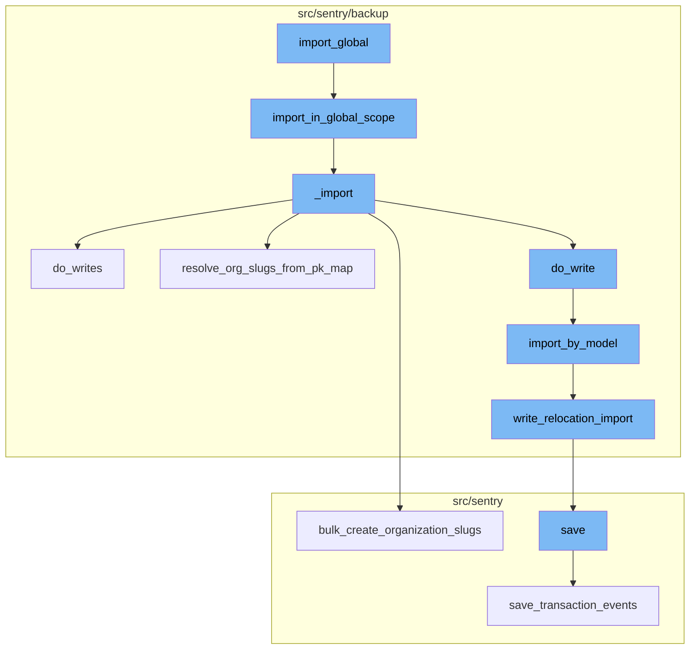
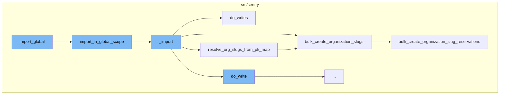
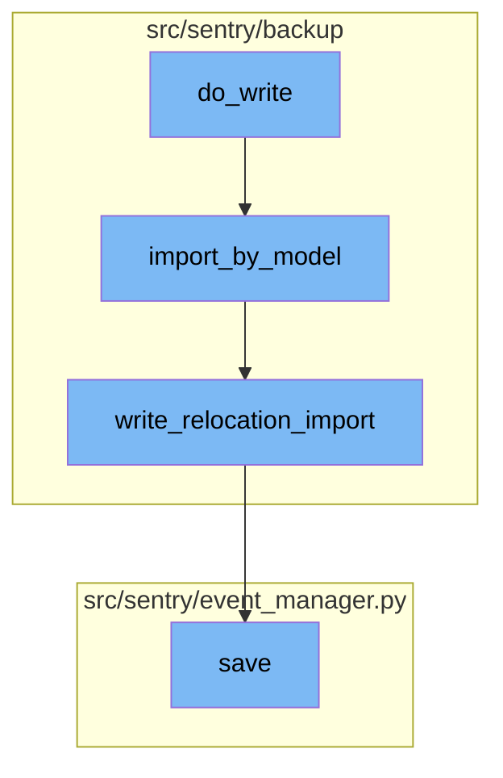

# Overview of import_global

The `import_global` function is the entry point of the import process in Sentry. It initiates the import process by taking in various parameters including the source file, decryption keys, and flags for user interaction. It then calls the `import_in_global_scope` function to start the import process.

<SwmSnippet path="/src/sentry/runner/commands/backup.py" line="873">

---

# Overview of import_global

Here is the definition of the `import_global` function. It takes in various parameters including the source file, decryption keys, and flags for user interaction. It then calls the `import_in_global_scope` function to start the import process.

```python
def import_global(
    src: IO[bytes],
    decrypt_with: IO[bytes],
    decrypt_with_gcp_kms: IO[bytes],
    findings_file: IO[str],
    no_prompt: bool,
    silent: bool,
) -> None:
    """
    Import all Sentry data from an exported JSON file.
    """

    from sentry.backup.imports import import_in_global_scope

    printer = get_printer(silent=silent, no_prompt=no_prompt)
    if SiloMode.get_current_mode() == SiloMode.MONOLITH and not is_split_db():
        confirmed = printer.confirm(
            """Proceeding with this operation will irrecoverably delete all existing
            low-volume data - are you sure want to continue?"""
        )
        if not confirmed:
```

---

</SwmSnippet>

# Import in Global Scope

The `import_in_global_scope` function is responsible for performing an import in the `Global` scope. This means that all models will be imported from the provided source file. It calls the `_import` function to start the actual import process.

<SwmSnippet path="/src/sentry/backup/imports.py" line="583">

---

# Import in Global Scope

Here is the definition of the `import_in_global_scope` function. It performs an import in the `Global` scope, meaning that all models will be imported from the provided source file. It then calls the `_import` function to start the actual import process.

```python
def import_in_global_scope(
    src: IO[bytes],
    *,
    decryptor: Decryptor | None = None,
    flags: ImportFlags | None = None,
    printer: Printer,
):
    """
    Perform an import in the `Global` scope, meaning that all models will be imported from the
    provided source file. Because a `Global` import is really only useful when restoring to a fresh
    Sentry instance, some behaviors in this scope are different from the others. In particular,
    superuser privileges are not sanitized. This method can be thought of as a "pure"
    backup/restore, simply serializing and deserializing a (partial) snapshot of the database state.
    """

    return _import(
        src,
        ImportScope.Global,
        decryptor=decryptor,
        flags=flags,
        printer=printer,
```

---

</SwmSnippet>

# Core Import Process

The `_import` function is the core of the import process. It reads the JSON models from the source file, writes them to the database, and resolves organization slugs.

<SwmSnippet path="/src/sentry/backup/imports.py" line="86">

---

# Core Import Process

Here is the definition of the `_import` function. It reads the JSON models from the source file, writes them to the database, and resolves organization slugs.

```python
def _import(
    src: IO[bytes],
    scope: ImportScope,
    *,
    decryptor: Decryptor | None = None,
    flags: ImportFlags | None = None,
    filter_by: Filter | None = None,
    printer: Printer,
):
    """
    Imports core data for a Sentry installation.

    It is generally preferable to avoid calling this function directly, as there are certain
    combinations of input parameters that should not be used together. Instead, use one of the other
    wrapper functions in this file, named `import_in_XXX_scope()`.
    """

    # Import here to prevent circular module resolutions.
    from sentry.models.email import Email
    from sentry.models.organization import Organization
    from sentry.models.organizationmember import OrganizationMember
```

---

</SwmSnippet>

# Writing Imported Data

The `do_writes` function is responsible for writing the imported data to the database. It iterates over the JSON models and calls the `do_write` function for each model.

<SwmSnippet path="/src/sentry/backup/imports.py" line="395">

---

# Writing Imported Data

Here is the definition of the `do_writes` function. It iterates over the JSON models and calls the `do_write` function for each model.

```python
    def do_writes(pk_map: PrimaryKeyMap) -> None:
        nonlocal deferred_org_auth_tokens, import_write_context

        for model_name, json_data, offset in yield_json_models(content):
            if model_name == org_auth_token_model_name:
                deferred_org_auth_tokens.append(json_data)
                continue

            do_write(import_write_context, pk_map, model_name, json_data, offset)
```

---

</SwmSnippet>

# Resolving Organization Slugs

The `resolve_org_slugs_from_pk_map` function is responsible for resolving organization slugs from the PrimaryKeyMap and reconciling their slug globally. It calls the `bulk_create_organization_slugs` function to create slug reservations for imported organizations.

<SwmSnippet path="/src/sentry/backup/imports.py" line="405">

---

# Resolving Organization Slugs

Here is the definition of the `resolve_org_slugs_from_pk_map` function. It resolves organization slugs from the PrimaryKeyMap and reconciles their slug globally. It then calls the `bulk_create_organization_slugs` function to create slug reservations for imported organizations.

```python
    # Resolves slugs for all imported organization models via the PrimaryKeyMap and reconciles
    # their slug globally via control silo by issuing a slug update.
    def resolve_org_slugs_from_pk_map(pk_map: PrimaryKeyMap):
        from sentry.services.organization import organization_provisioning_service

        org_pk_mapping = pk_map.mapping[str(org_model_name)]
        if not org_pk_mapping:
            return

        slug_mapping: dict[int, str] = {}
        for old_primary_key in org_pk_mapping:
            org_id, _, org_slug = org_pk_mapping[old_primary_key]
            slug_mapping[org_id] = org_slug or ""

        if len(slug_mapping) > 0:
            # HACK(azaslavsky): Okay, this gets a bit complicated, but bear with me: the following
            # `bulk_create...` calls will result in some actions on the control silo that call back
            # into this region. So the client (this region) calls the server (the control silo)
            # which may need to make one or more calls back into the client (this region). Because
            # some of our `OrganizationMemberTeam` outboxes may not be drained due to the HACK we
            # performed in `import_export/impl.py` (see that file for more details), there may be a
```

---

</SwmSnippet>

# Creating Slug Reservations

The `bulk_create_organization_slugs` function is responsible for creating slug reservations for imported organizations that already exist on the region. It calls the `bulk_create_organization_slug_reservations` function to create the slug reservations.

<SwmSnippet path="/src/sentry/services/organization/provisioning.py" line="141">

---

# Creating Slug Reservations

Here is the definition of the `bulk_create_organization_slugs` function. It creates slug reservations for imported organizations that already exist on the region. It then calls the `bulk_create_organization_slug_reservations` function to create the slug reservations.

```python
    def bulk_create_organization_slugs(
        self, slug_mapping: dict[int, str], region_name: str | None = None
    ):
        """
        CAUTION: DO NOT USE THIS OUTSIDE OF THE IMPORT/RELOCATION CONTEXT

        Organizations are meant to be provisioned via the
         `provision_organization_in_region` method, which handles both slug
         reservation and organization creation.

        Bulk creates slug reservations for imported organizations that already
        exist on the region. Each target organization is provided as a tuple of
        Organization ID (int) and base slug (str).

        :param org_ids_and_slugs: A set of tuples containing an organization ID
        and base slug.
        :param region_name: The region where the imported organizations exist
        :return:
        """
        destination_region_name = self._validate_or_default_region(region_name=region_name)

```

---

</SwmSnippet>

# Saving the Event

The `save` function is the final step in the flow. It is responsible for saving the event after normalizing and processing it. It saves adjacent models such as releases and environments to the database and writes the event into the eventstream.

<SwmSnippet path="/src/sentry/event_manager.py" line="442">

---

# Saving the Event

Here is the definition of the `save` function. It saves the event after normalizing and processing it. It saves adjacent models such as releases and environments to the database and writes the event into the eventstream.

```python
    def save(
        self,
        project_id: int | None,
        raw: bool = False,
        assume_normalized: bool = False,
        start_time: float | None = None,
        cache_key: str | None = None,
        skip_send_first_transaction: bool = False,
        has_attachments: bool = False,
    ) -> Event:
        """
        After normalizing and processing an event, save adjacent models such as
        releases and environments to postgres and write the event into
        eventstream. From there it will be picked up by Snuba and
        post-processing.

        We re-insert events with duplicate IDs into Snuba, which is responsible
        for deduplicating events. Since deduplication in Snuba is on the primary
        key (based on event ID, project ID and day), events with same IDs are only
        deduplicated if their timestamps fall on the same day. The latest event
        always wins and overwrites the value of events received earlier in that day.
```

---

</SwmSnippet>



# Flow drill down

First, we'll zoom into this section of the flow:



<SwmSnippet path="/src/sentry/runner/commands/backup.py" line="873">

---

# Import Global Flow

The `import_global` function is the entry point of the import process. It takes in various parameters including the source file, decryption keys, and flags for user interaction. It then calls the `import_in_global_scope` function to start the import process.

```python
def import_global(
    src: IO[bytes],
    decrypt_with: IO[bytes],
    decrypt_with_gcp_kms: IO[bytes],
    findings_file: IO[str],
    no_prompt: bool,
    silent: bool,
) -> None:
    """
    Import all Sentry data from an exported JSON file.
    """

    from sentry.backup.imports import import_in_global_scope

    printer = get_printer(silent=silent, no_prompt=no_prompt)
    if SiloMode.get_current_mode() == SiloMode.MONOLITH and not is_split_db():
        confirmed = printer.confirm(
            """Proceeding with this operation will irrecoverably delete all existing
            low-volume data - are you sure want to continue?"""
        )
        if not confirmed:
```

---

</SwmSnippet>

<SwmSnippet path="/src/sentry/backup/imports.py" line="583">

---

The `import_in_global_scope` function is responsible for performing an import in the `Global` scope. This means that all models will be imported from the provided source file. It calls the `_import` function to start the actual import process.

```python
def import_in_global_scope(
    src: IO[bytes],
    *,
    decryptor: Decryptor | None = None,
    flags: ImportFlags | None = None,
    printer: Printer,
):
    """
    Perform an import in the `Global` scope, meaning that all models will be imported from the
    provided source file. Because a `Global` import is really only useful when restoring to a fresh
    Sentry instance, some behaviors in this scope are different from the others. In particular,
    superuser privileges are not sanitized. This method can be thought of as a "pure"
    backup/restore, simply serializing and deserializing a (partial) snapshot of the database state.
    """

    return _import(
        src,
        ImportScope.Global,
        decryptor=decryptor,
        flags=flags,
        printer=printer,
```

---

</SwmSnippet>

<SwmSnippet path="/src/sentry/backup/imports.py" line="86">

---

The `_import` function is the core of the import process. It reads the JSON models from the source file, writes them to the database, and resolves organization slugs.

```python
def _import(
    src: IO[bytes],
    scope: ImportScope,
    *,
    decryptor: Decryptor | None = None,
    flags: ImportFlags | None = None,
    filter_by: Filter | None = None,
    printer: Printer,
):
    """
    Imports core data for a Sentry installation.

    It is generally preferable to avoid calling this function directly, as there are certain
    combinations of input parameters that should not be used together. Instead, use one of the other
    wrapper functions in this file, named `import_in_XXX_scope()`.
    """

    # Import here to prevent circular module resolutions.
    from sentry.models.email import Email
    from sentry.models.organization import Organization
    from sentry.models.organizationmember import OrganizationMember
```

---

</SwmSnippet>

<SwmSnippet path="/src/sentry/backup/imports.py" line="395">

---

The `do_writes` function is responsible for writing the imported data to the database. It iterates over the JSON models and calls the `do_write` function for each model.

```python
    def do_writes(pk_map: PrimaryKeyMap) -> None:
        nonlocal deferred_org_auth_tokens, import_write_context

        for model_name, json_data, offset in yield_json_models(content):
            if model_name == org_auth_token_model_name:
                deferred_org_auth_tokens.append(json_data)
                continue

            do_write(import_write_context, pk_map, model_name, json_data, offset)
```

---

</SwmSnippet>

<SwmSnippet path="/src/sentry/backup/imports.py" line="405">

---

The `resolve_org_slugs_from_pk_map` function is responsible for resolving organization slugs from the PrimaryKeyMap and reconciling their slug globally. It calls the `bulk_create_organization_slugs` function to create slug reservations for imported organizations.

```python
    # Resolves slugs for all imported organization models via the PrimaryKeyMap and reconciles
    # their slug globally via control silo by issuing a slug update.
    def resolve_org_slugs_from_pk_map(pk_map: PrimaryKeyMap):
        from sentry.services.organization import organization_provisioning_service

        org_pk_mapping = pk_map.mapping[str(org_model_name)]
        if not org_pk_mapping:
            return

        slug_mapping: dict[int, str] = {}
        for old_primary_key in org_pk_mapping:
            org_id, _, org_slug = org_pk_mapping[old_primary_key]
            slug_mapping[org_id] = org_slug or ""

        if len(slug_mapping) > 0:
            # HACK(azaslavsky): Okay, this gets a bit complicated, but bear with me: the following
            # `bulk_create...` calls will result in some actions on the control silo that call back
            # into this region. So the client (this region) calls the server (the control silo)
            # which may need to make one or more calls back into the client (this region). Because
            # some of our `OrganizationMemberTeam` outboxes may not be drained due to the HACK we
            # performed in `import_export/impl.py` (see that file for more details), there may be a
```

---

</SwmSnippet>

<SwmSnippet path="/src/sentry/services/organization/provisioning.py" line="141">

---

The `bulk_create_organization_slugs` function is responsible for creating slug reservations for imported organizations that already exist on the region. It calls the `bulk_create_organization_slug_reservations` function to create the slug reservations.

```python
    def bulk_create_organization_slugs(
        self, slug_mapping: dict[int, str], region_name: str | None = None
    ):
        """
        CAUTION: DO NOT USE THIS OUTSIDE OF THE IMPORT/RELOCATION CONTEXT

        Organizations are meant to be provisioned via the
         `provision_organization_in_region` method, which handles both slug
         reservation and organization creation.

        Bulk creates slug reservations for imported organizations that already
        exist on the region. Each target organization is provided as a tuple of
        Organization ID (int) and base slug (str).

        :param org_ids_and_slugs: A set of tuples containing an organization ID
        and base slug.
        :param region_name: The region where the imported organizations exist
        :return:
        """
        destination_region_name = self._validate_or_default_region(region_name=region_name)

```

---

</SwmSnippet>

<SwmSnippet path="/src/sentry/hybridcloud/services/control_organization_provisioning/impl.py" line="256">

---

The `bulk_create_organization_slug_reservations` function is responsible for creating slug reservations for imported organizations. It creates a new `OrganizationSlugReservation` for each organization and validates that the primary slug has been updated.

```python
    def bulk_create_organization_slug_reservations(
        self,
        *,
        region_name: str,
        slug_mapping: dict[int, str],
    ) -> None:
        slug_reservations_to_create: list[OrganizationSlugReservation] = []

        with outbox_context(transaction.atomic(router.db_for_write(OrganizationSlugReservation))):
            for org_id, slug in slug_mapping.items():
                slug_reservation = OrganizationSlugReservation(
                    slug=self._generate_org_slug(slug=slug, region_name=region_name),
                    organization_id=org_id,
                    reservation_type=OrganizationSlugReservationType.TEMPORARY_RENAME_ALIAS.value,
                    user_id=-1,
                    region_name=region_name,
                )
                slug_reservation.save(unsafe_write=True)

                slug_reservations_to_create.append(slug_reservation)

```

---

</SwmSnippet>

Now, lets zoom into this section of the flow:



<SwmSnippet path="/src/sentry/backup/imports.py" line="295">

---

# The import_global Flow

The `do_write` function is the first step in the focused section of the flow. It is responsible for writing a single model. It retrieves the model relations and dependencies, and then calls the `import_by_model` function to import the model.

```python
    # Perform the write of a single model.
    def do_write(
        import_write_context: ImportWriteContext,
        pk_map: PrimaryKeyMap,
        model_name: NormalizedModelName,
        json_data: Any,
        offset: int,
    ) -> None:
        model_relations = import_write_context.dependencies.get(model_name)
        if not model_relations:
            return

        dep_models = {get_model_name(d) for d in model_relations.get_dependencies_for_relocation()}
        import_by_model = ImportExportService.get_importer_for_model(model_relations.model)
        model_name_str = str(model_name)
        min_ordinal = offset + 1

        extra = {
            "model_name": model_name_str,
            "import_uuid": flags.import_uuid,
            "min_ordinal": min_ordinal,
```

---

</SwmSnippet>

<SwmSnippet path="/src/sentry/backup/services/import_export/impl.py" line="104">

---

The `import_by_model` function is the second step in the flow. It is responsible for importing a model. It validates the model, checks for existing instances of the model, and then writes the model instance to the database using the `write_relocation_import` function.

```python
    """

    def import_by_model(
        self,
        *,
        model_name: str,
        scope: RpcImportScope | None = None,
        flags: RpcImportFlags,
        filter_by: list[RpcFilter],
        pk_map: RpcPrimaryKeyMap,
        json_data: str,
        min_ordinal: int,
    ) -> RpcImportResult:
        if min_ordinal < 1:
            return RpcImportError(
                kind=RpcImportErrorKind.InvalidMinOrdinal,
                on=InstanceID(model_name),
                reason=f"The model `{model_name}` was offset with an invalid `min_ordinal` of `{min_ordinal}`",
            )

        batch_model_name = NormalizedModelName(model_name)
```

---

</SwmSnippet>

<SwmSnippet path="/src/sentry/backup/mixins.py" line="13">

---

The `write_relocation_import` function is the third step in the flow. It is responsible for writing the model instance to the database. It checks for potential collisions with unique sets and then writes the model instance to the database.

```python
    """

    # TODO(getsentry/team-ospo#190): Clean up the type checking in this method.
    def write_relocation_import(
        self, scope: ImportScope, flags: ImportFlags
    ) -> tuple[int, ImportKind] | None:
        # Get all unique sets that will potentially cause collisions.
        uniq_sets = dependencies()[get_model_name(self)].get_uniques_without_foreign_keys()  # type: ignore[arg-type]

        # Don't use this mixin for models with multiple unique sets; write custom logic instead.
        assert len(uniq_sets) <= 1

        # Must set `__relocation_custom_ordinal__` on models that use this mixin.
        assert getattr(self.__class__, "__relocation_custom_ordinal__", None) is not None

        if self.get_relocation_scope() == RelocationScope.Config:  # type: ignore[attr-defined]
            if len(uniq_sets) == 1:
                uniq_set = uniq_sets[0]
                query = dict()
                for uniq_field_name in uniq_set:
                    if getattr(self, uniq_field_name, None) is not None:
```

---

</SwmSnippet>

<SwmSnippet path="/src/sentry/event_manager.py" line="442">

---

The `save` function is the final step in the flow. It is responsible for saving the event after normalizing and processing it. It saves adjacent models such as releases and environments to the database and writes the event into the eventstream.

```python
    def save(
        self,
        project_id: int | None,
        raw: bool = False,
        assume_normalized: bool = False,
        start_time: float | None = None,
        cache_key: str | None = None,
        skip_send_first_transaction: bool = False,
        has_attachments: bool = False,
    ) -> Event:
        """
        After normalizing and processing an event, save adjacent models such as
        releases and environments to postgres and write the event into
        eventstream. From there it will be picked up by Snuba and
        post-processing.

        We re-insert events with duplicate IDs into Snuba, which is responsible
        for deduplicating events. Since deduplication in Snuba is on the primary
        key (based on event ID, project ID and day), events with same IDs are only
        deduplicated if their timestamps fall on the same day. The latest event
        always wins and overwrites the value of events received earlier in that day.
```

---

</SwmSnippet>

&nbsp;

*This is an auto-generated document by Swimm AI 🌊 and has not yet been verified by a human*

<SwmMeta version="3.0.0" repo-id="Z2l0aHViJTNBJTNBc2VudHJ5LWRlbW8lM0ElM0FTd2ltbS1EZW1v" repo-name="sentry-demo" doc-type="flows"><sup>Powered by [Swimm](/)</sup></SwmMeta>
