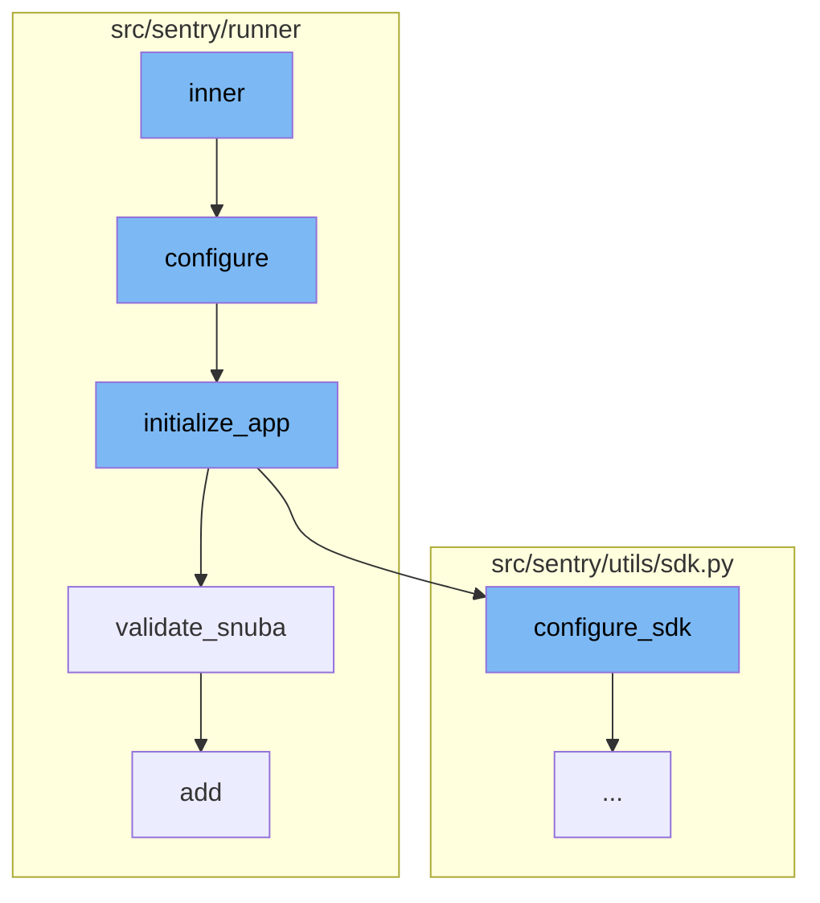
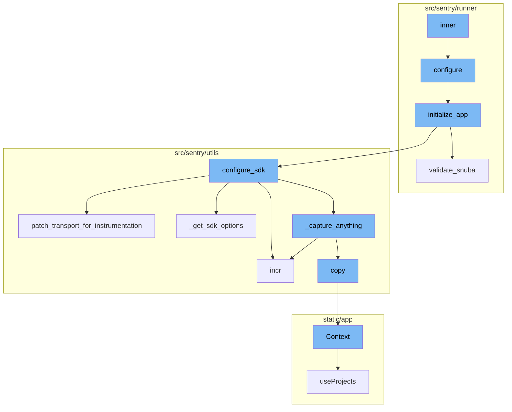
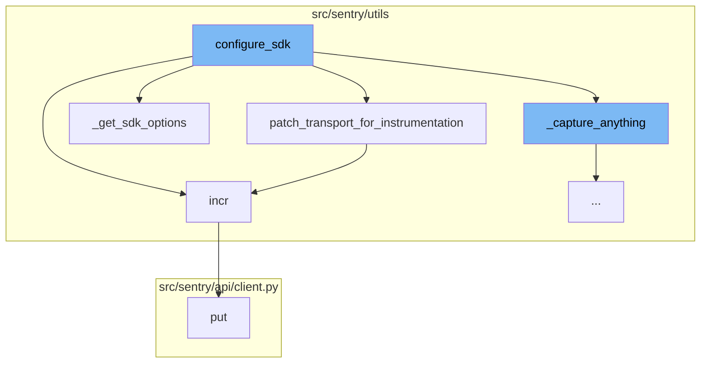
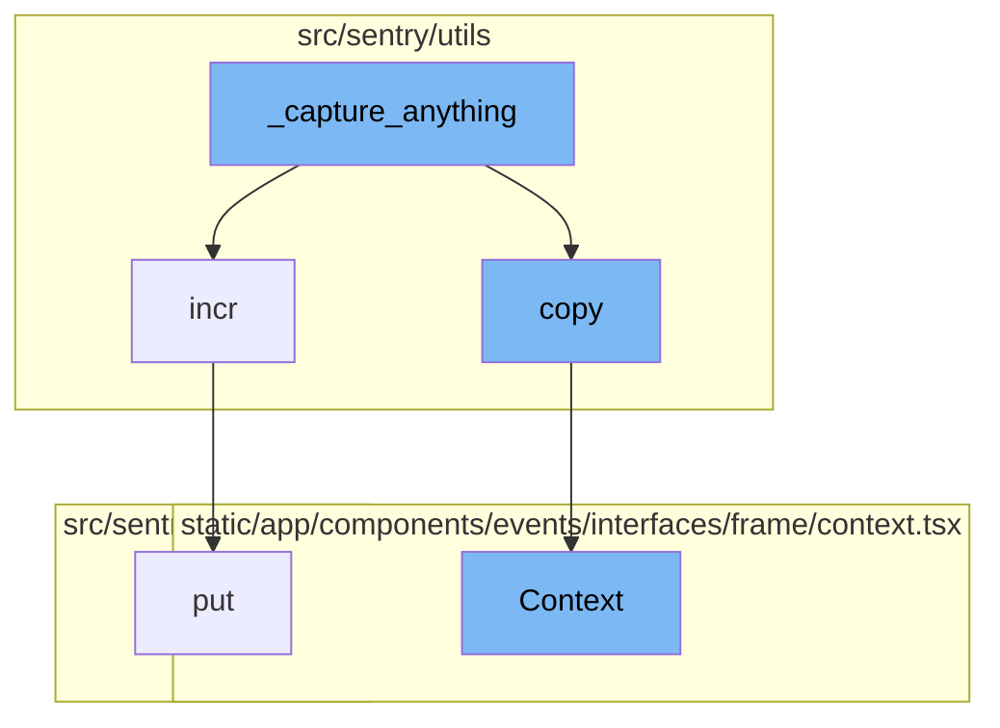

<SwmSnippet path="/src/sentry/runner/decorators.py" line="27">

---

# Inner Function

The `inner` function is a decorator that takes in a click context and any number of arguments. It checks if the `_SENTRY_SKIP_CONFIGURATION` environment variable is not set to '1'. If this condition is met, it imports and calls the `configure` function from `sentry.runner`. Finally, it invokes the decorated function with the provided arguments.

```python
    def inner(ctx: click.Context, *args: P.args, **kwargs: P.kwargs) -> R:
        # HACK: We can't call `configure()` from within tests
        # since we don't load config files from disk, so we
        # need a way to bypass this initialization step
        if os.environ.get("_SENTRY_SKIP_CONFIGURATION") != "1":
            from sentry.runner import configure

            configure()
        return ctx.invoke(f, *args, **kwargs)
```

---

</SwmSnippet>

<SwmSnippet path="/src/sentry/runner/settings.py" line="53">

---

# Configure Function

The `configure` function is responsible for setting up the environment given two different config files. It ensures that warnings are always displayed, adds additional mimetypes for static files, checks if the config files exist, and sets up autoreload for the config.yml file if needed. It also sets the `DJANGO_SETTINGS_MODULE` environment variable and calls the `initialize_app` function.

```python
def configure(
    ctx: click.Context | None, py: str, yaml: str | None, skip_service_validation: bool = False
) -> None:
    """
    Given the two different config files, set up the environment.

    NOTE: Will only execute once, so it's safe to call multiple times.
    """
    global __installed
    if __installed:
        return

    # Make sure that our warnings are always displayed.
    warnings.filterwarnings("default", "", Warning, r"^sentry")

    # Add in additional mimetypes that are useful for our static files
    # which aren't common in default system registries
    import mimetypes

    for type, ext in (
        ("application/json", "map"),
```

---

</SwmSnippet>

<SwmSnippet path="/src/sentry/runner/initializer.py" line="306">

---

# Initialize_app Function

The `initialize_app` function takes in a config dictionary and a boolean flag `skip_service_validation`. It sets up various settings, validates regions, configures the SDK, sets up services, and validates Snuba. It also dynamically sets the `CSRF_TRUSTED_ORIGINS` for self-hosted settings.

```python
def initialize_app(config: dict[str, Any], skip_service_validation: bool = False) -> None:
    settings = config["settings"]

    # Just reuse the integration app for Single Org / Self-Hosted as
    # it doesn't make much sense to use 2 separate apps for SSO and
    # integration.
    if settings.SENTRY_SINGLE_ORGANIZATION:
        options_mapper.update(
            {
                "github-app.client-id": "GITHUB_APP_ID",
                "github-app.client-secret": "GITHUB_API_SECRET",
            }
        )

    bootstrap_options(settings, config["options"])

    logging.raiseExceptions = settings.DEBUG

    configure_structlog()

    # Commonly setups don't correctly configure themselves for production envs
```

---

</SwmSnippet>

<SwmSnippet path="/src/sentry/runner/initializer.py" line="620">

---

# Validate_snuba Function

The `validate_snuba` function ensures that everything related to Snuba is in sync. It checks if all Snuba required backends are set and if the eventstream is Snuba compatible. It also checks if any features that require Snuba are enabled and if they are, it ensures that Snuba is correctly configured.

```python
def validate_snuba() -> None:
    """
    Make sure everything related to Snuba is in sync.

    This covers a few cases:

    * When you have features related to Snuba, you must also
      have Snuba fully configured correctly to continue.
    * If you have Snuba specific search/tagstore/tsdb backends,
      you must also have a Snuba compatible eventstream backend
      otherwise no data will be written into Snuba.
    * If you only have Snuba related eventstream, yell that you
      probably want the other backends otherwise things are weird.
    """
    if not settings.DEBUG:
        return

    has_all_snuba_required_backends = (
        settings.SENTRY_SEARCH
        in (
            "sentry.search.snuba.EventsDatasetSnubaSearchBackend",
```

---

</SwmSnippet>

<SwmSnippet path="/src/sentry/runner/commands/permissions.py" line="37">

---

# Add Function

The `add` function is used to add a permission to a user. It takes in a user and a permission as arguments. It creates a `UserPermission` object and saves it to the database. If the permission already exists for the user, it informs the user about it.

```python
def add(user: str, permission: str) -> None:
    "Add a permission to a user."
    from django.db import IntegrityError, transaction

    from sentry.models.userpermission import UserPermission

    user_inst = user_param_to_user(user)

    try:
        with transaction.atomic(router.db_for_write(UserPermission)):
            UserPermission.objects.create(user=user_inst, permission=permission)
    except IntegrityError:
        click.echo(f"Permission already exists for `{user_inst.username}`")
    else:
        click.echo(f"Added permission `{permission}` to `{user_inst.username}`")
```

---

</SwmSnippet>

<SwmSnippet path="/src/sentry/utils/sdk.py" line="275">

---

# Configure_sdk Function

The `configure_sdk` function is the starting point of the inner flow. It contains the definition of `MultiplexingTransport` class and its methods. The `_capture_anything` method is particularly important as it is responsible for capturing events and sending them to Sentry.

```python
def configure_sdk():
    """
    Setup and initialize the Sentry SDK.
    """
    sdk_options, dsns = _get_sdk_options()

    internal_project_key = get_project_key()

    if dsns.sentry4sentry:
        transport = make_transport(get_options(dsn=dsns.sentry4sentry, **sdk_options))
        sentry4sentry_transport = patch_transport_for_instrumentation(transport, "upstream")
    else:
        sentry4sentry_transport = None

    if dsns.sentry_saas:
        transport = make_transport(get_options(dsn=dsns.sentry_saas, **sdk_options))
        sentry_saas_transport = patch_transport_for_instrumentation(transport, "relay")
    elif settings.IS_DEV and not settings.SENTRY_USE_RELAY:
        sentry_saas_transport = None
    elif internal_project_key and internal_project_key.dsn_private:
        transport = make_transport(get_options(dsn=internal_project_key.dsn_private, **sdk_options))
```

---

</SwmSnippet>

<SwmSnippet path="/src/sentry/utils/sdk.py" line="237">

---

# Patch_transport_for_instrumentation Function

The `patch_transport_for_instrumentation` function is called within `configure_sdk`. It modifies the transport's `_send_request` method to increment a metric before sending a request. This helps in measuring the number of SDK requests sent to the ingest.

```python
# Patches transport functions to add metrics to improve resolution around events sent to our ingest.
# Leaving this in to keep a permanent measurement of sdk requests vs ingest.
def patch_transport_for_instrumentation(transport, transport_name):
    _send_request = transport._send_request
    if _send_request:

        def patched_send_request(*args, **kwargs):
            metrics.incr(f"internal.sent_requests.{transport_name}.events")
            return _send_request(*args, **kwargs)

        transport._send_request = patched_send_request
    return transport
```

---

</SwmSnippet>

<SwmSnippet path="/src/sentry/utils/metrics.py" line="101">

---

# Incr Function

The `incr` function is used to increment a metric. It is called within `patch_transport_for_instrumentation` and `configure_sdk` to measure the number of events and requests.

```python
    def incr(
        self,
        key: str,
        instance: str | None = None,
        tags: Tags | None = None,
        amount: int = 1,
        sample_rate: float = settings.SENTRY_METRICS_SAMPLE_RATE,
    ) -> None:
        if not self._started:
            self._start()
        self.q.put((key, instance, tags, amount, sample_rate))
```

---

</SwmSnippet>

<SwmSnippet path="/src/sentry/utils/sdk.py" line="256">

---

# \_get_sdk_options Function

The `_get_sdk_options` function is called within `configure_sdk` to get the SDK options. These options are used to configure the SDK.

```python
def _get_sdk_options() -> tuple[SdkConfig, Dsns]:
    sdk_options = settings.SENTRY_SDK_CONFIG.copy()
    sdk_options["send_client_reports"] = True
    sdk_options["traces_sampler"] = traces_sampler
    sdk_options["before_send_transaction"] = before_send_transaction
    sdk_options["before_send"] = before_send
    sdk_options["release"] = (
        f"backend@{sdk_options['release']}" if "release" in sdk_options else None
    )

    # Modify SENTRY_SDK_CONFIG in your deployment scripts to specify your desired DSN
    dsns = Dsns(
        sentry4sentry=sdk_options.pop("dsn", None),
        sentry_saas=sdk_options.pop("relay_dsn", None),
    )

    return sdk_options, dsns
```

---

</SwmSnippet>

<SwmSnippet path="/src/sentry/api/client.py" line="119">

---

# Put Function

The `put` function is used to make a PUT request. It is part of the inner flow but is not directly called within the `_capture_anything` function.

```python
    def put(self, *args, **kwargs):
        return self.request("PUT", *args, **kwargs)
```

---

</SwmSnippet>

<SwmSnippet path="/src/sentry/utils/sdk.py" line="334">

---

# \_capture_anything Function

The `_capture_anything` function is a part of the inner flow. It is responsible for capturing events and metrics. It first checks if the `sentry4sentry_transport` is available, if so, it increments the internal captured events upstream. It then checks if the `SENTRY_SDK_UPSTREAM_METRICS_ENABLED` setting is disabled and the method name is `capture_envelope`, if so, it filters out all the statsd envelope items, which contain custom metrics sent by the SDK, unless they are allowed via a separate sample rate. Finally, it checks if the `sentry_saas_transport` is available and if the current event is safe, if so, it increments the internal captured events relay.

```python
        def _capture_anything(self, method_name, *args, **kwargs):
            # Sentry4Sentry (upstream) should get the event first because
            # it is most isolated from the sentry installation.
            if sentry4sentry_transport:
                metrics.incr("internal.captured.events.upstream")
                # TODO(mattrobenolt): Bring this back safely.
                # from sentry import options
                # install_id = options.get('sentry:install-id')
                # if install_id:
                #     event.setdefault('tags', {})['install-id'] = install_id
                s4s_args = args
                # We want to control whether we want to send metrics at the s4s upstream.
                if (
                    not settings.SENTRY_SDK_UPSTREAM_METRICS_ENABLED
                    and method_name == "capture_envelope"
                ):
                    args_list = list(args)
                    envelope = args_list[0]
                    # We filter out all the statsd envelope items, which contain custom metrics sent by the SDK.
                    # unless we allow them via a separate sample rate.
                    safe_items = [
```

---

</SwmSnippet>

<SwmSnippet path="/src/sentry/utils/services.py" line="42">

---

# Copy Function

The `copy` function is used to create a copy of the current context. It is called within the `_capture_anything` function to create a copy of the envelope for the `sentry4sentry_transport` and `sentry_saas_transport`.

```python
        self.backends = backends

    def copy(self) -> Context:
        return Context(self.request, self.backends.copy())
```

---

</SwmSnippet>

<SwmSnippet path="/static/app/components/events/interfaces/frame/context.tsx" line="66">

---

# Context Function

The `Context` function is used to display the context of a frame in the Sentry UI. It takes various properties as parameters, such as whether it has context variables, source, registers, assembly, etc. It also takes the frame, event, and platform as parameters. It uses these parameters to display the context of the frame, including the source code, variables, registers, and assembly.

```tsx
function Context({
  hasContextVars = false,
  hasContextSource = false,
  hasContextRegisters = false,
  isExpanded = false,
  hasAssembly = false,
  emptySourceNotation = false,
  registers,
  frame,
  event,
  className,
  frameMeta,
  registersMeta,
  platform,
}: Props) {
  const organization = useOrganization();

  const {projects} = useProjects();
  const project = useMemo(
    () => projects.find(p => p.id === event.projectID),
    [projects, event]
```

---

</SwmSnippet>





# Flow drill down

First, we'll zoom into this section of the flow:


<SwmSnippet path="/src/sentry/runner/decorators.py" line="27">

---

# Inner Function

The `inner` function is a decorator that takes in a click context and any number of arguments. It checks if the `_SENTRY_SKIP_CONFIGURATION` environment variable is not set to '1'. If this condition is met, it imports and calls the `configure` function from `sentry.runner`. Finally, it invokes the decorated function with the provided arguments.

```python
    def inner(ctx: click.Context, *args: P.args, **kwargs: P.kwargs) -> R:
        # HACK: We can't call `configure()` from within tests
        # since we don't load config files from disk, so we
        # need a way to bypass this initialization step
        if os.environ.get("_SENTRY_SKIP_CONFIGURATION") != "1":
            from sentry.runner import configure

            configure()
        return ctx.invoke(f, *args, **kwargs)
```

---

</SwmSnippet>

<SwmSnippet path="/src/sentry/runner/settings.py" line="53">

---

# Configure Function

The `configure` function is responsible for setting up the environment given two different config files. It ensures that warnings are always displayed, adds additional mimetypes for static files, checks if the config files exist, and sets up autoreload for the config.yml file if needed. It also sets the `DJANGO_SETTINGS_MODULE` environment variable and calls the `initialize_app` function.

```python
def configure(
    ctx: click.Context | None, py: str, yaml: str | None, skip_service_validation: bool = False
) -> None:
    """
    Given the two different config files, set up the environment.

    NOTE: Will only execute once, so it's safe to call multiple times.
    """
    global __installed
    if __installed:
        return

    # Make sure that our warnings are always displayed.
    warnings.filterwarnings("default", "", Warning, r"^sentry")

    # Add in additional mimetypes that are useful for our static files
    # which aren't common in default system registries
    import mimetypes

    for type, ext in (
        ("application/json", "map"),
```

---

</SwmSnippet>

<SwmSnippet path="/src/sentry/runner/initializer.py" line="306">

---

# Initialize_app Function

The `initialize_app` function takes in a config dictionary and a boolean flag `skip_service_validation`. It sets up various settings, validates regions, configures the SDK, sets up services, and validates Snuba. It also dynamically sets the `CSRF_TRUSTED_ORIGINS` for self-hosted settings.

```python
def initialize_app(config: dict[str, Any], skip_service_validation: bool = False) -> None:
    settings = config["settings"]

    # Just reuse the integration app for Single Org / Self-Hosted as
    # it doesn't make much sense to use 2 separate apps for SSO and
    # integration.
    if settings.SENTRY_SINGLE_ORGANIZATION:
        options_mapper.update(
            {
                "github-app.client-id": "GITHUB_APP_ID",
                "github-app.client-secret": "GITHUB_API_SECRET",
            }
        )

    bootstrap_options(settings, config["options"])

    logging.raiseExceptions = settings.DEBUG

    configure_structlog()

    # Commonly setups don't correctly configure themselves for production envs
```

---

</SwmSnippet>

<SwmSnippet path="/src/sentry/runner/initializer.py" line="620">

---

# Validate_snuba Function

The `validate_snuba` function ensures that everything related to Snuba is in sync. It checks if all Snuba required backends are set and if the eventstream is Snuba compatible. It also checks if any features that require Snuba are enabled and if they are, it ensures that Snuba is correctly configured.

```python
def validate_snuba() -> None:
    """
    Make sure everything related to Snuba is in sync.

    This covers a few cases:

    * When you have features related to Snuba, you must also
      have Snuba fully configured correctly to continue.
    * If you have Snuba specific search/tagstore/tsdb backends,
      you must also have a Snuba compatible eventstream backend
      otherwise no data will be written into Snuba.
    * If you only have Snuba related eventstream, yell that you
      probably want the other backends otherwise things are weird.
    """
    if not settings.DEBUG:
        return

    has_all_snuba_required_backends = (
        settings.SENTRY_SEARCH
        in (
            "sentry.search.snuba.EventsDatasetSnubaSearchBackend",
```

---

</SwmSnippet>

<SwmSnippet path="/src/sentry/runner/commands/permissions.py" line="37">

---

# Add Function

The `add` function is used to add a permission to a user. It takes in a user and a permission as arguments. It creates a `UserPermission` object and saves it to the database. If the permission already exists for the user, it informs the user about it.

```python
def add(user: str, permission: str) -> None:
    "Add a permission to a user."
    from django.db import IntegrityError, transaction

    from sentry.models.userpermission import UserPermission

    user_inst = user_param_to_user(user)

    try:
        with transaction.atomic(router.db_for_write(UserPermission)):
            UserPermission.objects.create(user=user_inst, permission=permission)
    except IntegrityError:
        click.echo(f"Permission already exists for `{user_inst.username}`")
    else:
        click.echo(f"Added permission `{permission}` to `{user_inst.username}`")
```

---

</SwmSnippet>

Now, lets zoom into this section of the flow:



<SwmSnippet path="/src/sentry/utils/sdk.py" line="275">

---

# Inner Flow

The `configure_sdk` function is the starting point of the inner flow. It contains the definition of `MultiplexingTransport` class and its methods. The `_capture_anything` method is particularly important as it is responsible for capturing events and sending them to Sentry.

```python
def configure_sdk():
    """
    Setup and initialize the Sentry SDK.
    """
    sdk_options, dsns = _get_sdk_options()

    internal_project_key = get_project_key()

    if dsns.sentry4sentry:
        transport = make_transport(get_options(dsn=dsns.sentry4sentry, **sdk_options))
        sentry4sentry_transport = patch_transport_for_instrumentation(transport, "upstream")
    else:
        sentry4sentry_transport = None

    if dsns.sentry_saas:
        transport = make_transport(get_options(dsn=dsns.sentry_saas, **sdk_options))
        sentry_saas_transport = patch_transport_for_instrumentation(transport, "relay")
    elif settings.IS_DEV and not settings.SENTRY_USE_RELAY:
        sentry_saas_transport = None
    elif internal_project_key and internal_project_key.dsn_private:
        transport = make_transport(get_options(dsn=internal_project_key.dsn_private, **sdk_options))
```

---

</SwmSnippet>

<SwmSnippet path="/src/sentry/utils/sdk.py" line="237">

---

The `patch_transport_for_instrumentation` function is called within `configure_sdk`. It modifies the transport's `_send_request` method to increment a metric before sending a request. This helps in measuring the number of SDK requests sent to the ingest.

```python
# Patches transport functions to add metrics to improve resolution around events sent to our ingest.
# Leaving this in to keep a permanent measurement of sdk requests vs ingest.
def patch_transport_for_instrumentation(transport, transport_name):
    _send_request = transport._send_request
    if _send_request:

        def patched_send_request(*args, **kwargs):
            metrics.incr(f"internal.sent_requests.{transport_name}.events")
            return _send_request(*args, **kwargs)

        transport._send_request = patched_send_request
    return transport
```

---

</SwmSnippet>

<SwmSnippet path="/src/sentry/utils/metrics.py" line="101">

---

The `incr` function is used to increment a metric. It is called within `patch_transport_for_instrumentation` and `configure_sdk` to measure the number of events and requests.

```python
    def incr(
        self,
        key: str,
        instance: str | None = None,
        tags: Tags | None = None,
        amount: int = 1,
        sample_rate: float = settings.SENTRY_METRICS_SAMPLE_RATE,
    ) -> None:
        if not self._started:
            self._start()
        self.q.put((key, instance, tags, amount, sample_rate))
```

---

</SwmSnippet>

<SwmSnippet path="/src/sentry/utils/sdk.py" line="256">

---

The `_get_sdk_options` function is called within `configure_sdk` to get the SDK options. These options are used to configure the SDK.

```python
def _get_sdk_options() -> tuple[SdkConfig, Dsns]:
    sdk_options = settings.SENTRY_SDK_CONFIG.copy()
    sdk_options["send_client_reports"] = True
    sdk_options["traces_sampler"] = traces_sampler
    sdk_options["before_send_transaction"] = before_send_transaction
    sdk_options["before_send"] = before_send
    sdk_options["release"] = (
        f"backend@{sdk_options['release']}" if "release" in sdk_options else None
    )

    # Modify SENTRY_SDK_CONFIG in your deployment scripts to specify your desired DSN
    dsns = Dsns(
        sentry4sentry=sdk_options.pop("dsn", None),
        sentry_saas=sdk_options.pop("relay_dsn", None),
    )

    return sdk_options, dsns
```

---

</SwmSnippet>

<SwmSnippet path="/src/sentry/api/client.py" line="119">

---

The `put` function is called within `incr` to send a PUT request. This is part of the metrics incrementing process.

```python
    def put(self, *args, **kwargs):
        return self.request("PUT", *args, **kwargs)
```

---

</SwmSnippet>

Now, lets zoom into this section of the flow:



<SwmSnippet path="/src/sentry/utils/sdk.py" line="334">

---

# \_capture_anything Function

The `_capture_anything` function is a part of the inner flow. It is responsible for capturing events and metrics. It first checks if the `sentry4sentry_transport` is available, if so, it increments the internal captured events upstream. It then checks if the `SENTRY_SDK_UPSTREAM_METRICS_ENABLED` setting is disabled and the method name is `capture_envelope`, if so, it filters out all the statsd envelope items, which contain custom metrics sent by the SDK, unless they are allowed via a separate sample rate. Finally, it checks if the `sentry_saas_transport` is available and if the current event is safe, if so, it increments the internal captured events relay.

```python
        def _capture_anything(self, method_name, *args, **kwargs):
            # Sentry4Sentry (upstream) should get the event first because
            # it is most isolated from the sentry installation.
            if sentry4sentry_transport:
                metrics.incr("internal.captured.events.upstream")
                # TODO(mattrobenolt): Bring this back safely.
                # from sentry import options
                # install_id = options.get('sentry:install-id')
                # if install_id:
                #     event.setdefault('tags', {})['install-id'] = install_id
                s4s_args = args
                # We want to control whether we want to send metrics at the s4s upstream.
                if (
                    not settings.SENTRY_SDK_UPSTREAM_METRICS_ENABLED
                    and method_name == "capture_envelope"
                ):
                    args_list = list(args)
                    envelope = args_list[0]
                    # We filter out all the statsd envelope items, which contain custom metrics sent by the SDK.
                    # unless we allow them via a separate sample rate.
                    safe_items = [
```

---

</SwmSnippet>

<SwmSnippet path="/src/sentry/utils/metrics.py" line="101">

---

# incr Function

The `incr` function is used to increment a metric. It is called within the `_capture_anything` function to increment the internal captured events upstream and relay. It takes a key, instance, tags, amount, and sample rate as parameters.

```python
    def incr(
        self,
        key: str,
        instance: str | None = None,
        tags: Tags | None = None,
        amount: int = 1,
        sample_rate: float = settings.SENTRY_METRICS_SAMPLE_RATE,
    ) -> None:
        if not self._started:
            self._start()
        self.q.put((key, instance, tags, amount, sample_rate))
```

---

</SwmSnippet>

<SwmSnippet path="/src/sentry/utils/services.py" line="42">

---

# copy Function

The `copy` function is used to create a copy of the current context. It is called within the `_capture_anything` function to create a copy of the envelope for the `sentry4sentry_transport` and `sentry_saas_transport`.

```python
        self.backends = backends

    def copy(self) -> Context:
        return Context(self.request, self.backends.copy())
```

---

</SwmSnippet>

<SwmSnippet path="/static/app/components/events/interfaces/frame/context.tsx" line="66">

---

# Context Function

The `Context` function is used to display the context of a frame in the Sentry UI. It takes various properties as parameters, such as whether it has context variables, source, registers, assembly, etc. It also takes the frame, event, and platform as parameters. It uses these parameters to display the context of the frame, including the source code, variables, registers, and assembly.

```tsx
function Context({
  hasContextVars = false,
  hasContextSource = false,
  hasContextRegisters = false,
  isExpanded = false,
  hasAssembly = false,
  emptySourceNotation = false,
  registers,
  frame,
  event,
  className,
  frameMeta,
  registersMeta,
  platform,
}: Props) {
  const organization = useOrganization();

  const {projects} = useProjects();
  const project = useMemo(
    () => projects.find(p => p.id === event.projectID),
    [projects, event]
```

---

</SwmSnippet>

<SwmSnippet path="/src/sentry/api/client.py" line="119">

---

# put Function

The `put` function is used to make a PUT request. It is part of the inner flow but is not directly called within the `_capture_anything` function.

```python
    def put(self, *args, **kwargs):
        return self.request("PUT", *args, **kwargs)
```

---

</SwmSnippet>

&nbsp;

*This is an auto-generated document by Swimm AI 🌊 and has not yet been verified by a human*

<SwmMeta version="3.0.0" repo-id="Z2l0aHViJTNBJTNBc2VudHJ5LWRlbW8lM0ElM0FTd2ltbS1EZW1v" repo-name="sentry-demo" doc-type="flows"><sup>Powered by [Swimm](/)</sup></SwmMeta>
