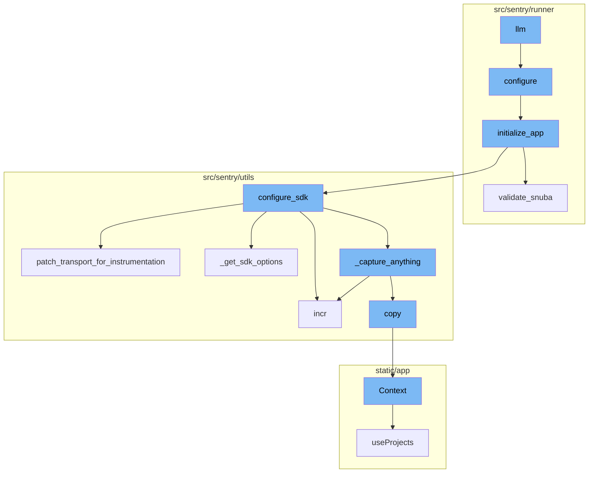
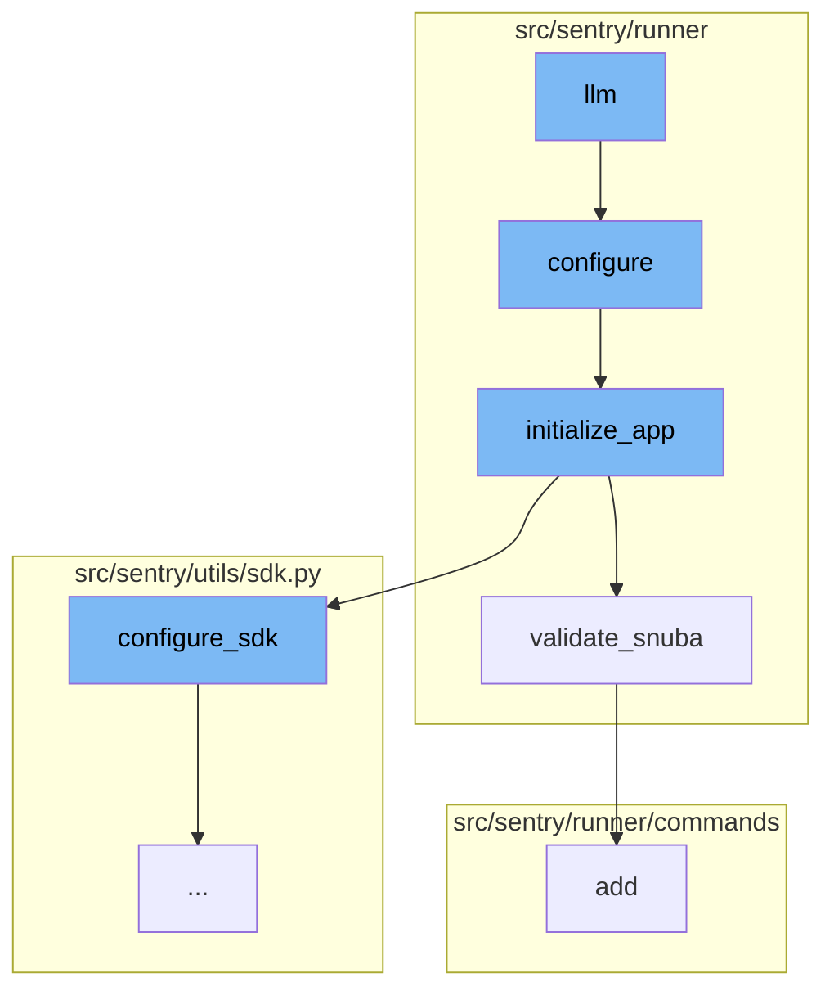
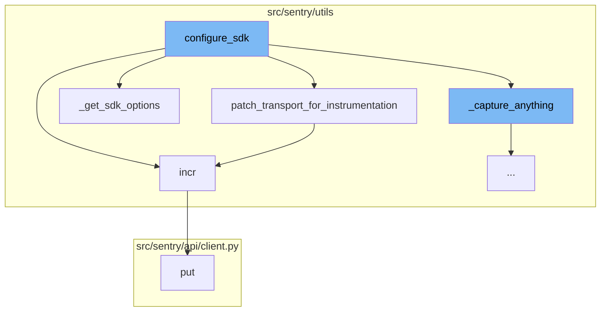
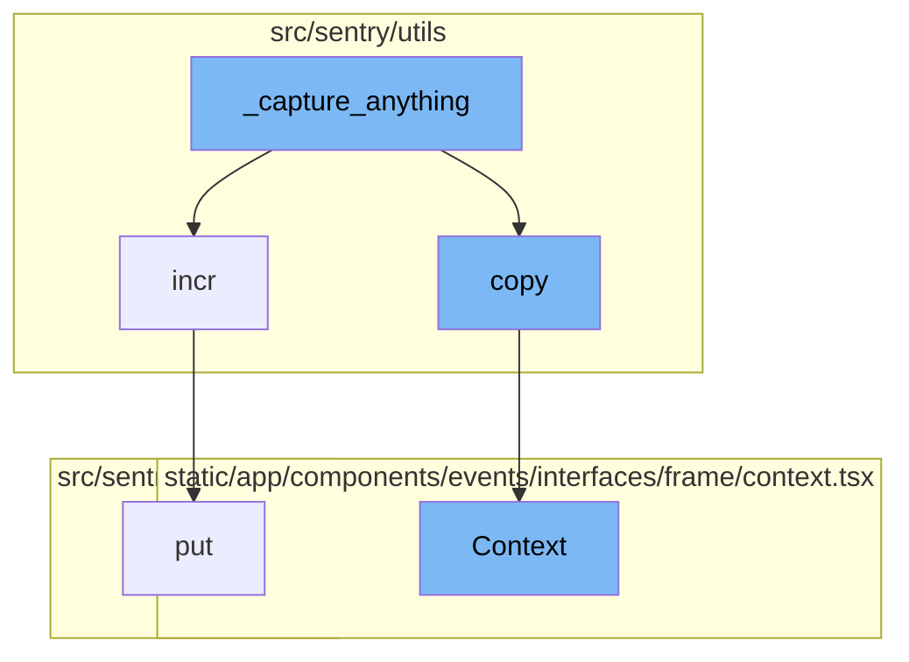

# Overview of llm

The `llm` function is a command tool for testing different LLM providers. It is the entry point for the LLM flow in the Sentry application. The function starts by importing and running the `configure` function.

# Configure Function

The `configure` function sets up the environment given two different config files. It ensures warnings are always displayed and adds additional mimetypes for static files. It also checks if the configuration file exists and if not, raises an exception. Finally, it calls the `initialize_app` function.

# Initialize App Function

The `initialize_app` function is responsible for setting up the application. It configures settings, validates configurations, and sets up services. It also calls the `validate_snuba` function and `configure_sdk` function.

# Validate Snuba Function

The `validate_snuba` function ensures everything related to Snuba is in sync. It checks if all Snuba required backends are set and if Snuba compatible eventstream is configured. If not, it raises a ConfigurationError.

# Configure SDK Function

The `configure_sdk` function is responsible for setting up the SDK, which includes configuring the transport layer and capturing any events. It also calls other functions like `patch_transport_for_instrumentation`, `incr`, `_get_sdk_options`, and `_capture_anything`.

# Patch Transport for Instrumentation Function

`patch_transport_for_instrumentation` is a function that modifies the transport layer to add metrics for better resolution around events sent to the ingest. It's called within `configure_sdk`.

# Incr Function

`incr` is a function used to increment a metric. It's used within `configure_sdk` and `patch_transport_for_instrumentation` to track the number of events and requests.

# Get SDK Options Function

`_get_sdk_options` is a function that retrieves the SDK configuration options. It's called within `configure_sdk` to get the necessary configuration for the SDK.

# Capture Anything Function

`_capture_anything` is a function that captures any event or error. It's called within `configure_sdk` to ensure that any event or error is captured and sent to Sentry.

# Put Function

`put` is a function that makes a PUT request. It's called within `incr` to send the incremented metric to the server.

# Copy Function

The `copy` function is called within `_capture_anything` to create a copy of the envelope with safe items only. This is done to ensure that the original envelope is not modified when filtering out statsd items.

# Context Function

The `Context` function is used to display the context of a frame in the Sentry UI. It takes a number of props related to the frame and its context, and returns a component that displays the source code, variables, registers, and assembly for the frame.



# Flow drill down

First, we'll zoom into this section of the flow:



<SwmSnippet path="/src/sentry/runner/commands/llm.py" line="6">

---

# LLM Flow

The `llm` function is the entry point for the LLM flow. It's a command tool for testing different LLM providers. It starts by importing and running the `configure` function.

```python
def llm(usecase: str) -> None:
    """
    a quick command tool for testing different LLM providers. make sure your options are set up!
    """
    from sentry.runner import configure

    configure()
    from sentry.llm.usecases import LLMUseCase, complete_prompt

    llm_response = complete_prompt(
        usecase=LLMUseCase(usecase),
        prompt="prompt here",
        message="message here",
    )

    click.echo(llm_response)
```

---

</SwmSnippet>

<SwmSnippet path="/src/sentry/runner/settings.py" line="53">

---

## Configure Function

The `configure` function sets up the environment given two different config files. It ensures warnings are always displayed and adds additional mimetypes for static files. It also checks if the configuration file exists and if not, raises an exception. Finally, it calls the `initialize_app` function.

```python
def configure(
    ctx: click.Context | None, py: str, yaml: str | None, skip_service_validation: bool = False
) -> None:
    """
    Given the two different config files, set up the environment.

    NOTE: Will only execute once, so it's safe to call multiple times.
    """
    global __installed
    if __installed:
        return

    # Make sure that our warnings are always displayed.
    warnings.filterwarnings("default", "", Warning, r"^sentry")

    # Add in additional mimetypes that are useful for our static files
    # which aren't common in default system registries
    import mimetypes

    for type, ext in (
        ("application/json", "map"),
```

---

</SwmSnippet>

<SwmSnippet path="/src/sentry/runner/initializer.py" line="306">

---

### Initialize App Function

The `initialize_app` function is responsible for setting up the application. It configures settings, validates configurations, and sets up services. It also calls the `validate_snuba` function and `configure_sdk` function.

```python
def initialize_app(config: dict[str, Any], skip_service_validation: bool = False) -> None:
    settings = config["settings"]

    # Just reuse the integration app for Single Org / Self-Hosted as
    # it doesn't make much sense to use 2 separate apps for SSO and
    # integration.
    if settings.SENTRY_SINGLE_ORGANIZATION:
        options_mapper.update(
            {
                "github-app.client-id": "GITHUB_APP_ID",
                "github-app.client-secret": "GITHUB_API_SECRET",
            }
        )

    bootstrap_options(settings, config["options"])

    logging.raiseExceptions = settings.DEBUG

    configure_structlog()

    # Commonly setups don't correctly configure themselves for production envs
```

---

</SwmSnippet>

<SwmSnippet path="/src/sentry/runner/initializer.py" line="620">

---

#### Validate Snuba Function

The `validate_snuba` function ensures everything related to Snuba is in sync. It checks if all Snuba required backends are set and if Snuba compatible eventstream is configured. If not, it raises a ConfigurationError.

```python
def validate_snuba() -> None:
    """
    Make sure everything related to Snuba is in sync.

    This covers a few cases:

    * When you have features related to Snuba, you must also
      have Snuba fully configured correctly to continue.
    * If you have Snuba specific search/tagstore/tsdb backends,
      you must also have a Snuba compatible eventstream backend
      otherwise no data will be written into Snuba.
    * If you only have Snuba related eventstream, yell that you
      probably want the other backends otherwise things are weird.
    """
    if not settings.DEBUG:
        return

    has_all_snuba_required_backends = (
        settings.SENTRY_SEARCH
        in (
            "sentry.search.snuba.EventsDatasetSnubaSearchBackend",
```

---

</SwmSnippet>

Now, lets zoom into this section of the flow:



<SwmSnippet path="/src/sentry/utils/sdk.py" line="275">

---

# llm Flow

The `configure_sdk` function is the starting point of the flow. It's responsible for setting up the SDK, which includes configuring the transport layer and capturing any events. It also calls other functions like `patch_transport_for_instrumentation`, `incr`, `_get_sdk_options`, and `_capture_anything`.

```python
def configure_sdk():
    """
    Setup and initialize the Sentry SDK.
    """
    sdk_options, dsns = _get_sdk_options()

    internal_project_key = get_project_key()

    if dsns.sentry4sentry:
        transport = make_transport(get_options(dsn=dsns.sentry4sentry, **sdk_options))
        sentry4sentry_transport = patch_transport_for_instrumentation(transport, "upstream")
    else:
        sentry4sentry_transport = None

    if dsns.sentry_saas:
        transport = make_transport(get_options(dsn=dsns.sentry_saas, **sdk_options))
        sentry_saas_transport = patch_transport_for_instrumentation(transport, "relay")
    elif settings.IS_DEV and not settings.SENTRY_USE_RELAY:
        sentry_saas_transport = None
    elif internal_project_key and internal_project_key.dsn_private:
        transport = make_transport(get_options(dsn=internal_project_key.dsn_private, **sdk_options))
```

---

</SwmSnippet>

<SwmSnippet path="/src/sentry/utils/sdk.py" line="237">

---

`patch_transport_for_instrumentation` is a function that modifies the transport layer to add metrics for better resolution around events sent to the ingest. It's called within `configure_sdk`.

```python
# Patches transport functions to add metrics to improve resolution around events sent to our ingest.
# Leaving this in to keep a permanent measurement of sdk requests vs ingest.
def patch_transport_for_instrumentation(transport, transport_name):
    _send_request = transport._send_request
    if _send_request:

        def patched_send_request(*args, **kwargs):
            metrics.incr(f"internal.sent_requests.{transport_name}.events")
            return _send_request(*args, **kwargs)

        transport._send_request = patched_send_request
    return transport
```

---

</SwmSnippet>

<SwmSnippet path="/src/sentry/utils/metrics.py" line="101">

---

`incr` is a function used to increment a metric. It's used within `configure_sdk` and `patch_transport_for_instrumentation` to track the number of events and requests.

```python
    def incr(
        self,
        key: str,
        instance: str | None = None,
        tags: Tags | None = None,
        amount: int = 1,
        sample_rate: float = settings.SENTRY_METRICS_SAMPLE_RATE,
    ) -> None:
        if not self._started:
            self._start()
        self.q.put((key, instance, tags, amount, sample_rate))
```

---

</SwmSnippet>

<SwmSnippet path="/src/sentry/utils/sdk.py" line="256">

---

`_get_sdk_options` is a function that retrieves the SDK configuration options. It's called within `configure_sdk` to get the necessary configuration for the SDK.

```python
def _get_sdk_options() -> tuple[SdkConfig, Dsns]:
    sdk_options = settings.SENTRY_SDK_CONFIG.copy()
    sdk_options["send_client_reports"] = True
    sdk_options["traces_sampler"] = traces_sampler
    sdk_options["before_send_transaction"] = before_send_transaction
    sdk_options["before_send"] = before_send
    sdk_options["release"] = (
        f"backend@{sdk_options['release']}" if "release" in sdk_options else None
    )

    # Modify SENTRY_SDK_CONFIG in your deployment scripts to specify your desired DSN
    dsns = Dsns(
        sentry4sentry=sdk_options.pop("dsn", None),
        sentry_saas=sdk_options.pop("relay_dsn", None),
    )

    return sdk_options, dsns
```

---

</SwmSnippet>

<SwmSnippet path="/src/sentry/utils/sdk.py" line="334">

---

`_capture_anything` is a function that captures any event or error. It's called within `configure_sdk` to ensure that any event or error is captured and sent to Sentry.

```python
        def _capture_anything(self, method_name, *args, **kwargs):
            # Sentry4Sentry (upstream) should get the event first because
            # it is most isolated from the sentry installation.
```

---

</SwmSnippet>

<SwmSnippet path="/src/sentry/api/client.py" line="119">

---

`put` is a function that makes a PUT request. It's called within `incr` to send the incremented metric to the server.

```python
    def put(self, *args, **kwargs):
        return self.request("PUT", *args, **kwargs)
```

---

</SwmSnippet>

Now, lets zoom into this section of the flow:



<SwmSnippet path="/src/sentry/utils/sdk.py" line="334">

---

# \_capture_anything function

The `_capture_anything` function is the starting point of the flow. It is responsible for capturing events and metrics. It checks if the `SENTRY_SDK_UPSTREAM_METRICS_ENABLED` setting is enabled and the method name is `capture_envelope`. If these conditions are met, it filters out all the statsd envelope items, which contain custom metrics sent by the SDK, unless they are allowed via a separate sample rate. It then sends these metrics to the `sentry4sentry_transport`.

```python
        def _capture_anything(self, method_name, *args, **kwargs):
            # Sentry4Sentry (upstream) should get the event first because
            # it is most isolated from the sentry installation.
            if sentry4sentry_transport:
                metrics.incr("internal.captured.events.upstream")
                # TODO(mattrobenolt): Bring this back safely.
                # from sentry import options
                # install_id = options.get('sentry:install-id')
                # if install_id:
                #     event.setdefault('tags', {})['install-id'] = install_id
                s4s_args = args
                # We want to control whether we want to send metrics at the s4s upstream.
                if (
                    not settings.SENTRY_SDK_UPSTREAM_METRICS_ENABLED
                    and method_name == "capture_envelope"
                ):
                    args_list = list(args)
                    envelope = args_list[0]
                    # We filter out all the statsd envelope items, which contain custom metrics sent by the SDK.
                    # unless we allow them via a separate sample rate.
                    safe_items = [
```

---

</SwmSnippet>

<SwmSnippet path="/src/sentry/utils/metrics.py" line="101">

---

# incr function

The `incr` function is called within `_capture_anything` to increment a metric. It takes a key, an optional instance, optional tags, an amount to increment by, and a sample rate. If the metrics system has not started, it starts it and then puts the metric in the queue to be processed.

```python
    def incr(
        self,
        key: str,
        instance: str | None = None,
        tags: Tags | None = None,
        amount: int = 1,
        sample_rate: float = settings.SENTRY_METRICS_SAMPLE_RATE,
    ) -> None:
        if not self._started:
            self._start()
        self.q.put((key, instance, tags, amount, sample_rate))
```

---

</SwmSnippet>

<SwmSnippet path="/src/sentry/utils/services.py" line="42">

---

# copy function

The `copy` function is called within `_capture_anything` to create a copy of the envelope with safe items only. This is done to ensure that the original envelope is not modified when filtering out statsd items.

```python
        self.backends = backends

    def copy(self) -> Context:
        return Context(self.request, self.backends.copy())
```

---

</SwmSnippet>

<SwmSnippet path="/static/app/components/events/interfaces/frame/context.tsx" line="66">

---

# Context function

The `Context` function is used to display the context of a frame in the Sentry UI. It takes a number of props related to the frame and its context, and returns a component that displays the source code, variables, registers, and assembly for the frame.

```tsx
function Context({
  hasContextVars = false,
  hasContextSource = false,
  hasContextRegisters = false,
  isExpanded = false,
  hasAssembly = false,
  emptySourceNotation = false,
  registers,
  frame,
  event,
  className,
  frameMeta,
  registersMeta,
  platform,
}: Props) {
  const organization = useOrganization();

  const {projects} = useProjects();
  const project = useMemo(
    () => projects.find(p => p.id === event.projectID),
    [projects, event]
```

---

</SwmSnippet>

<SwmSnippet path="/src/sentry/api/client.py" line="119">

---

# put function

The `put` function is used to make a PUT request. It is part of the API client and is used to update resources on the server.

```python
    def put(self, *args, **kwargs):
        return self.request("PUT", *args, **kwargs)
```

---

</SwmSnippet>

&nbsp;

*This is an auto-generated document by Swimm AI 🌊 and has not yet been verified by a human*

<SwmMeta version="3.0.0" repo-id="Z2l0aHViJTNBJTNBc2VudHJ5LWRlbW8lM0ElM0FTd2ltbS1EZW1v" repo-name="sentry-demo" doc-type="flows"><sup>Powered by [Swimm](/)</sup></SwmMeta>
