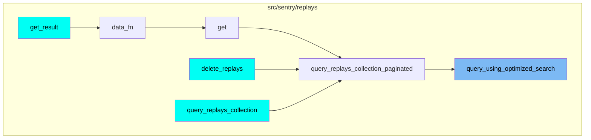
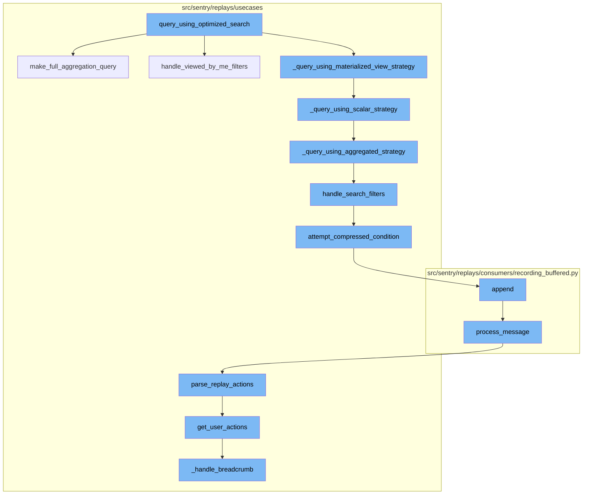
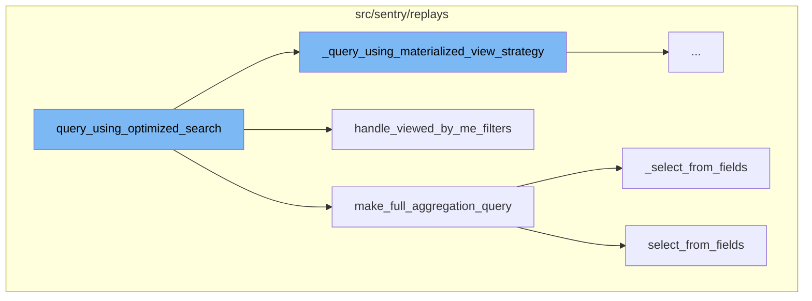
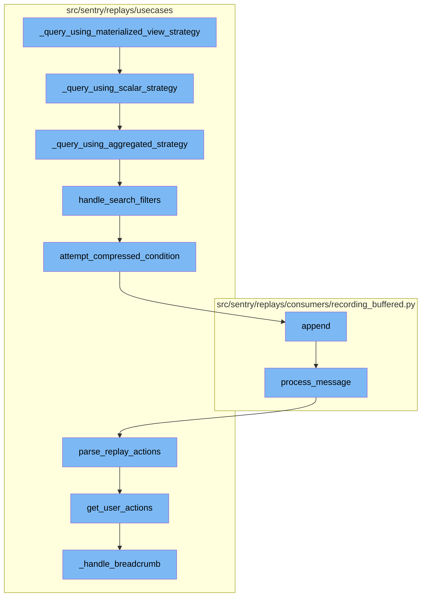

# Overview

The `query_using_optimized_search` function is a key component of the Sentry application. It is designed to execute a search query in an optimized manner, taking into account various parameters such as fields, search filters, environments, sort order, pagination details, organization, project ids, and time period. The function processes the environments and 'viewed_by_me' filters, then chooses the appropriate strategy to execute the query based on the preferred source. The result of the query is then paginated and the final aggregation step is performed.

# Detailed Flow

The flow of the `query_using_optimized_search` function can be broken down into several steps. First, it handles 'viewed_by_me' filters which are not valid Snuba fields but are convenience aliases for the frontend. Then, it creates a query to fetch every replay in the set. If fields are provided, it uses the `select_from_fields` function to select the fields, otherwise it selects all values from the `QUERY_ALIAS_COLUMN_MAP`. Next, it checks if the search filters and sort parameters can be handled by the materialized view strategy. If not, it falls back to the scalar strategy. If the scalar strategy also cannot handle the parameters, it falls back to the aggregated strategy. The function then converts the search filters into snuba conditions and attempts to compress the conditions for query optimization. Finally, it processes the message, decodes it, extracts headers and recording data, and appends an upload event to the state object for later processing.

# Usage

This flow is used multiple times in the codebase. It is invoked when querying replays collection paginated, deleting replays, and getting results from the data function.





# Flow drill down

First, we'll zoom into this section of the flow:



<SwmSnippet path="/src/sentry/replays/usecases/query/__init__.py" line="197">

---

# query_using_optimized_search

The `query_using_optimized_search` function is the main entry point for executing a search query. It takes in various parameters such as fields, search filters, environments, sort order, pagination details, organization, project ids, and time period. It also accepts an optional user id and a preferred source which defaults to 'scalar'. The function first processes the environments and 'viewed_by_me' filters. Then, based on the preferred source, it chooses the appropriate strategy to execute the query. The result of the query is then paginated and the final aggregation step is performed where the replay ids are used as the only filter.

```python
def query_using_optimized_search(
    fields: list[str],
    search_filters: Sequence[SearchFilter | str | ParenExpression],
    environments: list[str],
    sort: str | None,
    pagination: Paginators,
    organization: Organization | None,
    project_ids: list[int],
    period_start: datetime,
    period_stop: datetime,
    request_user_id: int | None = None,
    preferred_source: PREFERRED_SOURCE = "scalar",
):
    tenant_id = _make_tenant_id(organization)

    # Environments is provided to us outside of the ?query= url parameter. It's stil filtered like
    # the values in that parameter so let's shove it inside and process it like any other filter.
    if environments:
        search_filters = [
            *search_filters,
            SearchFilter(SearchKey("environment"), "IN", SearchValue(environments)),
```

---

</SwmSnippet>

<SwmSnippet path="/src/sentry/replays/usecases/query/__init__.py" line="53">

---

## handle_viewed_by_me_filters

The `handle_viewed_by_me_filters` function is used to translate 'viewed_by_me' filters which are not valid Snuba fields but are convenience aliases for the frontend. It iterates over the search filters and replaces 'viewed_by_me' filters with 'viewed_by_id' filters.

```python
def handle_viewed_by_me_filters(
    search_filters: Sequence[SearchFilter | str | ParenExpression], request_user_id: int | None
) -> Sequence[SearchFilter | str | ParenExpression]:
    """Translate "viewed_by_me" as it's not a valid Snuba field, but a convenience alias for the frontend"""
    new_filters = []
    for search_filter in search_filters:
        if (
            not isinstance(search_filter, SearchFilter)
            or search_filter.key.name not in VIEWED_BY_ME_KEY_ALIASES
        ):
            new_filters.append(search_filter)
            continue

        # since the value is boolean, negations (!) are not supported
        if search_filter.operator != "=":
            raise ParseError(f"Invalid operator specified for `{search_filter.key.name}`")

        value = search_filter.value.value
        if not isinstance(value, str) or value.lower() not in ["true", "false"]:
            raise ParseError(f"Could not parse value for `{search_filter.key.name}`")
        value = value.lower() == "true"
```

---

</SwmSnippet>

<SwmSnippet path="/src/sentry/replays/usecases/query/__init__.py" line="408">

---

## make_full_aggregation_query

The `make_full_aggregation_query` function is used to create a query to fetch every replay in the set. It takes in parameters such as fields, replay ids, project ids, and time period. It also accepts an optional user id. The function selects the fields to be fetched based on the provided fields and constructs the query with conditions and group by clause.

```python
def make_full_aggregation_query(
    fields: list[str],
    replay_ids: list[str],
    project_ids: list[int],
    period_start: datetime,
    period_end: datetime,
    request_user_id: int | None,
) -> Query:
    """Return a query to fetch every replay in the set.

    Arguments:
        fields -- if non-empty, used to query a subset of fields. Corresponds to the keys in QUERY_ALIAS_COLUMN_MAP.
    """
    from sentry.replays.query import QUERY_ALIAS_COLUMN_MAP, compute_has_viewed, select_from_fields

    def _select_from_fields() -> list[Column | Function]:
        if fields:
            return select_from_fields(list(set(fields)), user_id=request_user_id)
        else:
            return list(QUERY_ALIAS_COLUMN_MAP.values()) + [compute_has_viewed(request_user_id)]

```

---

</SwmSnippet>

<SwmSnippet path="/src/sentry/replays/usecases/query/__init__.py" line="423">

---

### \_select_from_fields

The `_select_from_fields` function is used to select the fields to be fetched in the query. If fields are provided, it uses the `select_from_fields` function to select the fields, otherwise it selects all values from the `QUERY_ALIAS_COLUMN_MAP`.

```python
    def _select_from_fields() -> list[Column | Function]:
        if fields:
            return select_from_fields(list(set(fields)), user_id=request_user_id)
        else:
            return list(QUERY_ALIAS_COLUMN_MAP.values()) + [compute_has_viewed(request_user_id)]
```

---

</SwmSnippet>

<SwmSnippet path="/src/sentry/replays/query.py" line="819">

---

#### select_from_fields

The `select_from_fields` function is used to return a list of columns to select. It iterates over the collected aliases from the fields and appends the corresponding column or function to the selection.

```python
def select_from_fields(fields: list[str], user_id: int | None) -> list[Column | Function]:
    """Return a list of columns to select."""
    selection = []
    for alias in collect_aliases(fields):
        if alias == "has_viewed":
            selection.append(compute_has_viewed(user_id))
        else:
            selection.append(QUERY_ALIAS_COLUMN_MAP[alias])

    return selection
```

---

</SwmSnippet>

Now, lets zoom into this section of the flow:



<SwmSnippet path="/src/sentry/replays/usecases/query/__init__.py" line="293">

---

# Query Using Optimized Search

The `_query_using_materialized_view_strategy` function is the first step in the flow. It checks if the search filters and sort parameters can be handled by the materialized view strategy. If not, it falls back to the scalar strategy.

```python
def _query_using_materialized_view_strategy(
    search_filters: Sequence[SearchFilter | str | ParenExpression],
    sort: str | None,
    project_ids: list[int],
    period_start: datetime,
    period_stop: datetime,
):
    if not mv.can_search(search_filters) or not mv.can_sort(sort or DEFAULT_SORT_FIELD):
        return _query_using_scalar_strategy(
            search_filters,
            sort,
            project_ids,
            period_start,
            period_stop,
        )

    orderby = handle_ordering(mv.sort_config, sort or "-" + DEFAULT_SORT_FIELD)

    having: list[Condition] = handle_search_filters(mv.search_config, search_filters)
    having.append(Condition(Function("minMerge", parameters=[Column("min_segment_id")]), Op.EQ, 0))

```

---

</SwmSnippet>

<SwmSnippet path="/src/sentry/replays/usecases/query/__init__.py" line="334">

---

The `_query_using_scalar_strategy` function is the second step in the flow. It checks if the search filters and sort parameters can be handled by the scalar strategy. If not, it falls back to the aggregated strategy.

```python
def _query_using_scalar_strategy(
    search_filters: Sequence[SearchFilter | str | ParenExpression],
    sort: str | None,
    project_ids: list[int],
    period_start: datetime,
    period_stop: datetime,
):
    if not can_scalar_search_subquery(search_filters) or not sort_is_scalar_compatible(
        sort or DEFAULT_SORT_FIELD
    ):
        return _query_using_aggregated_strategy(
            search_filters,
            sort,
            project_ids,
            period_start,
            period_stop,
        )

    # NOTE: This query may return replay-ids which do not have a segment_id 0 row. These replays
    # will be removed from the final output and could lead to pagination peculiarities. In
    # practice, this is not expected to be noticable by the end-user.
```

---

</SwmSnippet>

<SwmSnippet path="/src/sentry/replays/usecases/query/__init__.py" line="379">

---

The `_query_using_aggregated_strategy` function is the third step in the flow. It handles the search filters and sort parameters using the aggregated strategy.

```python
def _query_using_aggregated_strategy(
    search_filters: Sequence[SearchFilter | str | ParenExpression],
    sort: str | None,
    project_ids: list[int],
    period_start: datetime,
    period_stop: datetime,
):
    orderby = handle_ordering(agg_sort_config, sort or "-" + DEFAULT_SORT_FIELD)

    having: list[Condition] = handle_search_filters(agg_search_config, search_filters)
    having.append(Condition(Function("min", parameters=[Column("segment_id")]), Op.EQ, 0))

    query = Query(
        match=Entity("replays"),
        select=[Column("replay_id")],
        where=[
            Condition(Column("project_id"), Op.IN, project_ids),
            Condition(Column("timestamp"), Op.LT, period_stop),
            Condition(Column("timestamp"), Op.GTE, period_start),
        ],
        having=having,
```

---

</SwmSnippet>

<SwmSnippet path="/src/sentry/replays/usecases/query/__init__.py" line="92">

---

The `handle_search_filters` function is the fourth step in the flow. It converts the search filters into snuba conditions.

```python
def handle_search_filters(
    search_config: dict[str, FieldProtocol],
    search_filters: Sequence[SearchFilter | str | ParenExpression],
) -> list[Condition]:
    """Convert search filters to snuba conditions."""
    result: list[Condition] = []
    look_back = None
    for search_filter in search_filters:
        # SearchFilters are transformed into Conditions and appended to the result set.  If they
        # are top level filters they are implicitly AND'ed in the WHERE/HAVING clause.  Otherwise
        # explicit operators are used.
        if isinstance(search_filter, SearchFilter):
            try:
                condition = search_filter_to_condition(search_config, search_filter)
                if condition is None:
                    raise ParseError(f"Unsupported search field: {search_filter.key.name}")
            except OperatorNotSupported:
                raise ParseError(f"Invalid operator specified for `{search_filter.key.name}`")
            except CouldNotParseValue:
                raise ParseError(f"Could not parse value for `{search_filter.key.name}`")

```

---

</SwmSnippet>

<SwmSnippet path="/src/sentry/replays/usecases/query/__init__.py" line="137">

---

The `attempt_compressed_condition` function is the fifth step in the flow. It attempts to compress the conditions for query optimization.

```python
def attempt_compressed_condition(
    result: list[Expression],
    condition: Condition,
    condition_type: And | Or,
):
    """Unnecessary query optimization.

    Improves legibility for query debugging. Clickhouse would flatten these nested OR statements
    internally anyway.

    (block OR block) OR block => (block OR block OR block)
    """
    if isinstance(result[-1], condition_type):
        result[-1].conditions.append(condition)
    else:
        result.append(condition_type([result.pop(), condition]))
```

---

</SwmSnippet>

<SwmSnippet path="/src/sentry/replays/consumers/recording_buffered.py" line="205">

---

The `append` function is the sixth step in the flow. It appends the message to the buffer for processing.

```python
    def append(self, message: BaseValue[KafkaPayload]) -> None:
        process_message(self, message.payload.value)
```

---

</SwmSnippet>

<SwmSnippet path="/src/sentry/replays/consumers/recording_buffered.py" line="219">

---

The `process_message` function is the seventh step in the flow. It processes the message, decodes it, extracts headers and recording data, and appends an upload event to the state object for later processing.

```python
def process_message(buffer: RecordingBuffer, message: bytes) -> None:
    with sentry_sdk.start_span(op="replays.consumer.recording.decode_kafka_message"):
        try:
            decoded_message: ReplayRecording = RECORDINGS_CODEC.decode(message)
        except ValidationError:
            # TODO: DLQ
            logger.exception("Could not decode recording message.")
            return None

    try:
        headers, recording_data = process_headers(cast_payload_bytes(decoded_message["payload"]))
    except Exception:
        # TODO: DLQ
        logger.exception(
            "Recording headers could not be extracted %s", decoded_message["replay_id"]
        )
        return None

    recording_segment = RecordingSegmentStorageMeta(
        project_id=decoded_message["project_id"],
        replay_id=decoded_message["replay_id"],
```

---

</SwmSnippet>

<SwmSnippet path="/src/sentry/replays/usecases/ingest/dom_index.py" line="84">

---

The `parse_replay_actions` function is the eighth step in the flow. It parses the RRWeb payload to a ReplayActionsEvent.

```python
def parse_replay_actions(
    project_id: int,
    replay_id: str,
    retention_days: int,
    segment_data: list[dict[str, Any]],
    replay_event: dict[str, Any] | None,
) -> ReplayActionsEvent | None:
    """Parse RRWeb payload to ReplayActionsEvent."""
    actions = get_user_actions(project_id, replay_id, segment_data, replay_event)
    if len(actions) == 0:
        return None

    payload = create_replay_actions_payload(replay_id, actions)
    return create_replay_actions_event(replay_id, project_id, retention_days, payload)
```

---

</SwmSnippet>

<SwmSnippet path="/src/sentry/replays/usecases/ingest/dom_index.py" line="155">

---

The `get_user_actions` function is the ninth step in the flow. It returns a list of ReplayActionsEventPayloadClick types.

```python
def get_user_actions(
    project_id: int,
    replay_id: str,
    events: list[dict[str, Any]],
    replay_event: dict[str, Any] | None,
) -> list[ReplayActionsEventPayloadClick]:
    """Return a list of ReplayActionsEventPayloadClick types.

    The node object is a partially destructured HTML element with an additional RRWeb
    identifier included. Node objects are not recursive and truncate their children. Text is
    extracted and stored on the textContent key.

    For example, the follow DOM element:

        <div id="a" class="b c">Hello<span>, </span>world!</div>

    Would be destructured as:

        {
            "id": 217,
            "tagName": "div",
```

---

</SwmSnippet>

<SwmSnippet path="/src/sentry/replays/usecases/ingest/dom_index.py" line="394">

---

The `_handle_breadcrumb` function is the final step in the flow. It handles the breadcrumb event and creates a click event if necessary.

```python
def _handle_breadcrumb(
    event: dict[str, Any], project_id: int, replay_id: str, replay_event: dict[str, Any] | None
) -> ReplayActionsEventPayloadClick | None:

    click = None

    payload = event["data"].get("payload", {})
    if not isinstance(payload, dict):
        return None

    category = payload.get("category")
    if category == "ui.slowClickDetected":
        is_timeout_reason = payload["data"].get("endReason") == "timeout"
        is_target_tagname = payload["data"].get("node", {}).get("tagName") in (
            "a",
            "button",
            "input",
        )
        timeout = payload["data"].get("timeAfterClickMs", 0) or payload["data"].get(
            "timeafterclickms", 0
        )
```

---

</SwmSnippet>

# Where is this flow used?

This flow is used multiple times in the codebase as represented in the following diagram:


&nbsp;

*This is an auto-generated document by Swimm AI 🌊 and has not yet been verified by a human*

<SwmMeta version="3.0.0" repo-id="Z2l0aHViJTNBJTNBc2VudHJ5LWRlbW8lM0ElM0FTd2ltbS1EZW1v" repo-name="sentry-demo" doc-type="flows"><sup>Powered by [Swimm](/)</sup></SwmMeta>
