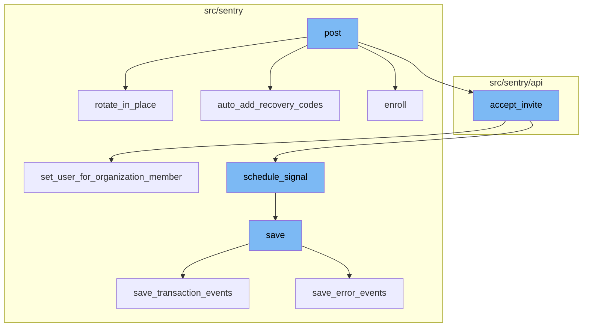
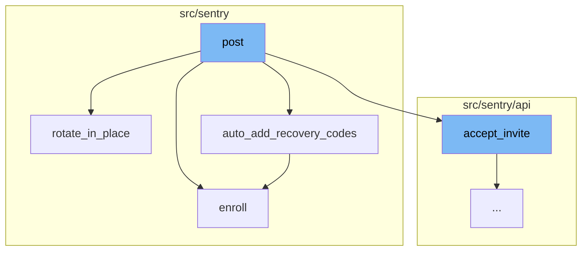
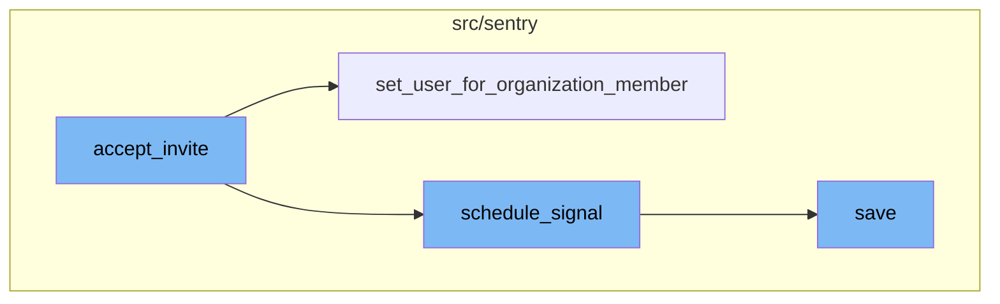

<SwmSnippet path="/src/sentry/api/endpoints/user_authenticator_enroll.py" line="169">

---

# Post Function

The `post` function is the starting point of the flow. It is responsible for enrolling a user in an authenticator interface. It checks if the user is rate-limited, validates the provided data, and then proceeds to enroll the user in the authenticator interface. If the interface allows rotation, it calls the `rotate_in_place` function. If the enrollment is successful, it calls the `auto_add_recovery_codes` function to add recovery codes for the user. Finally, if there is a pending organization invite, it accepts the invite.

``````````````````````````````````python
    def post(self, request: Request, user, interface_id) -> HttpResponse:
        """
        Enroll in authenticator interface
        `````````````````````````````````

        :pparam string user_id: user id or "me" for current user
        :pparam string interface_id: interface id

        :auth: required
        """
        if ratelimiter.backend.is_limited(
            f"auth:authenticator-enroll:{request.user.id}:{interface_id}",
            limit=10,
            window=86400,  # 10 per day should be fine
        ):
            return HttpResponse(
                "You have made too many authenticator enrollment attempts. Please try again later.",
                content_type="text/plain",
                status=429,
            )

``````````````````````````````````

---

</SwmSnippet>

<SwmSnippet path="/src/sentry/auth/authenticators/base.py" line="168">

---

# Rotate in Place Function

The `rotate_in_place` function is called when the authenticator interface allows rotation. It updates the authenticator's configuration and resets its last used timestamp.

```python
    def rotate_in_place(self) -> None:
        if not self.allow_rotation_in_place:
            raise Exception("This interface does not allow rotation in place")
        if self.authenticator is None:
            raise Exception("There is no Authenticator to rotate")

        self.authenticator.config = self.config
        self.authenticator.created_at = timezone.now()
        self.authenticator.last_used_at = None
        self.authenticator.save()
```

---

</SwmSnippet>

<SwmSnippet path="/src/sentry/models/authenticator.py" line="67">

---

# Auto Add Recovery Codes Function

The `auto_add_recovery_codes` function is called to add recovery codes for the user. It checks if a backup interface is already set up for the user. If not, it enrolls the user in the `RecoveryCodeInterface`.

```python
    def auto_add_recovery_codes(self, user, force=False):
        """This automatically adds the recovery code backup interface in
        case no backup interface is currently set for the user.  Returns
        the interface that was added.
        """
        from sentry.auth.authenticators.recovery_code import RecoveryCodeInterface

        has_authenticators = False

        # If we're not forcing, check for a backup interface already setup
        # or if it's missing, we'll need to set it.
        if not force:
            for authenticator in Authenticator.objects.filter(
                user_id=user.id, type__in=[a.type for a in available_authenticators()]
            ):
                iface = authenticator.interface
                if iface.is_backup_interface:
                    return
                has_authenticators = True

        if has_authenticators or force:
```

---

</SwmSnippet>

<SwmSnippet path="/src/sentry/auth/authenticators/base.py" line="143">

---

# Enroll Function

The `enroll` function is invoked to enroll a user for an interface. If the user is already enrolled, an error is raised. If the interface disallows new enrollment, an exception is raised. If the authenticator is not set, a new one is created and saved.

```python
        """
        # This method needs to be empty for the default
        # `requires_activation` property to make sense.

    def enroll(self, user: User) -> None:
        """Invoked to enroll a user for this interface.  If already enrolled
        an error is raised.

        If `disallow_new_enrollment` is `True`, raises exception: `NewEnrollmentDisallowed`.
        """
        from sentry.models.authenticator import Authenticator

        if self.disallow_new_enrollment:
            raise NewEnrollmentDisallowed

        if self.authenticator is None:
            self.authenticator = Authenticator.objects.create(
                user_id=user.id, type=self.type, config=self.config
            )
        else:
            if not self.allow_multi_enrollment:
```

---

</SwmSnippet>

<SwmSnippet path="/src/sentry/api/invite_helper.py" line="214">

---

# Accepting an Invite

The `accept_invite` function is the first step in the post flow. It is responsible for handling the acceptance of an invite by a user. If the user is not provided, it defaults to the request user. It checks if the member already exists and handles it accordingly. If SSO is required, it checks for a valid AuthIdentity. It then calls the `set_user_for_organization_member` function to set the user for the organization member.

```python
    def accept_invite(self, user: User | None = None) -> RpcOrganizationMember | None:
        member = self.invite_context.member
        assert member

        if user is None:
            user = self.request.user

        if self.member_already_exists:
            self.handle_member_already_exists()
            if self.invite_context.invite_organization_member_id is not None:
                organization_service.delete_organization_member(
                    organization_member_id=self.invite_context.invite_organization_member_id,
                    organization_id=self.invite_context.organization.id,
                )
            return None

        try:
            provider = AuthProvider.objects.get(organization_id=self.invite_context.organization.id)
        except AuthProvider.DoesNotExist:
            provider = None

```

---

</SwmSnippet>

<SwmSnippet path="/src/sentry/organizations/services/organization/impl.py" line="293">

---

# Setting User for Organization Member

The `set_user_for_organization_member` function is called within `accept_invite`. It attempts to get the organization member with the provided user_id and organization_id. If it doesn't exist, it gets the organization member with the provided organization_member_id and organization_id, sets the user for the organization member, and saves the organization member.

```python
    def set_user_for_organization_member(
        self,
        *,
        organization_member_id: int,
        organization_id: int,
        user_id: int,
    ) -> RpcOrganizationMember | None:
        with transaction.atomic(router.db_for_write(OrganizationMember)):
            try:
                org_member = OrganizationMember.objects.get(
                    user_id=user_id, organization_id=organization_id
                )
                return serialize_member(org_member)
            except OrganizationMember.DoesNotExist:
                try:
                    org_member = OrganizationMember.objects.get(
                        id=organization_member_id, organization_id=organization_id
                    )
                    org_member.set_user(user_id)
                    org_member.save()
                except OrganizationMember.DoesNotExist:
```

---

</SwmSnippet>

<SwmSnippet path="/src/sentry/organizations/services/organization/impl.py" line="796">

---

# Scheduling a Signal

The `schedule_signal` function is called after setting the user for the organization member in `accept_invite`. It schedules a signal to be sent. It creates a payload with the provided arguments and signal, and saves it to the ControlOutbox for each region of the organization.

```python
    def schedule_signal(
        self, signal: Signal, organization_id: int, args: Mapping[str, str | int | None]
    ) -> None:
        with outbox_context(flush=False):
            payload: Any = {
                "args": args,
                "signal": int(RpcOrganizationSignal.from_signal(signal)),
            }
            for region_name in find_regions_for_orgs([organization_id]):
                ControlOutbox(
                    shard_scope=OutboxScope.ORGANIZATION_SCOPE,
                    shard_identifier=organization_id,
                    region_name=region_name,
                    category=OutboxCategory.SEND_SIGNAL,
                    object_identifier=ControlOutbox.next_object_identifier(),
                    payload=payload,
                ).save()
```

---

</SwmSnippet>

<SwmSnippet path="/src/sentry/event_manager.py" line="442">

---

# Saving the Event

The `save` function is the final step in the post flow. It is responsible for saving an event after it has been normalized and processed. It saves adjacent models such as releases and environments to postgres and writes the event into the eventstream. It handles different types of events differently, such as transactions and generic events.

```python
    def save(
        self,
        project_id: int | None,
        raw: bool = False,
        assume_normalized: bool = False,
        start_time: float | None = None,
        cache_key: str | None = None,
        skip_send_first_transaction: bool = False,
        has_attachments: bool = False,
    ) -> Event:
        """
        After normalizing and processing an event, save adjacent models such as
        releases and environments to postgres and write the event into
        eventstream. From there it will be picked up by Snuba and
        post-processing.

        We re-insert events with duplicate IDs into Snuba, which is responsible
        for deduplicating events. Since deduplication in Snuba is on the primary
        key (based on event ID, project ID and day), events with same IDs are only
        deduplicated if their timestamps fall on the same day. The latest event
        always wins and overwrites the value of events received earlier in that day.
```

---

</SwmSnippet>



# Flow drill down

First, we'll zoom into this section of the flow:



<SwmSnippet path="/src/sentry/api/endpoints/user_authenticator_enroll.py" line="169">

---

# Post Function

The `post` function is the starting point of the flow. It is responsible for enrolling a user in an authenticator interface. It checks if the user is rate-limited, validates the provided data, and then proceeds to enroll the user in the authenticator interface. If the interface allows rotation, it calls the `rotate_in_place` function. If the enrollment is successful, it calls the `auto_add_recovery_codes` function to add recovery codes for the user. Finally, if there is a pending organization invite, it accepts the invite.

``````````````````````````````````python
    def post(self, request: Request, user, interface_id) -> HttpResponse:
        """
        Enroll in authenticator interface
        `````````````````````````````````

        :pparam string user_id: user id or "me" for current user
        :pparam string interface_id: interface id

        :auth: required
        """
        if ratelimiter.backend.is_limited(
            f"auth:authenticator-enroll:{request.user.id}:{interface_id}",
            limit=10,
            window=86400,  # 10 per day should be fine
        ):
            return HttpResponse(
                "You have made too many authenticator enrollment attempts. Please try again later.",
                content_type="text/plain",
                status=429,
            )

``````````````````````````````````

---

</SwmSnippet>

<SwmSnippet path="/src/sentry/auth/authenticators/base.py" line="168">

---

# Rotate in Place Function

The `rotate_in_place` function is called when the authenticator interface allows rotation. It updates the authenticator's configuration and resets its last used timestamp.

```python
    def rotate_in_place(self) -> None:
        if not self.allow_rotation_in_place:
            raise Exception("This interface does not allow rotation in place")
        if self.authenticator is None:
            raise Exception("There is no Authenticator to rotate")

        self.authenticator.config = self.config
        self.authenticator.created_at = timezone.now()
        self.authenticator.last_used_at = None
        self.authenticator.save()
```

---

</SwmSnippet>

<SwmSnippet path="/src/sentry/models/authenticator.py" line="67">

---

# Auto Add Recovery Codes Function

The `auto_add_recovery_codes` function is called to add recovery codes for the user. It checks if a backup interface is already set up for the user. If not, it enrolls the user in the `RecoveryCodeInterface`.

```python
    def auto_add_recovery_codes(self, user, force=False):
        """This automatically adds the recovery code backup interface in
        case no backup interface is currently set for the user.  Returns
        the interface that was added.
        """
        from sentry.auth.authenticators.recovery_code import RecoveryCodeInterface

        has_authenticators = False

        # If we're not forcing, check for a backup interface already setup
        # or if it's missing, we'll need to set it.
        if not force:
            for authenticator in Authenticator.objects.filter(
                user_id=user.id, type__in=[a.type for a in available_authenticators()]
            ):
                iface = authenticator.interface
                if iface.is_backup_interface:
                    return
                has_authenticators = True

        if has_authenticators or force:
```

---

</SwmSnippet>

<SwmSnippet path="/src/sentry/auth/authenticators/base.py" line="143">

---

# Enroll Function

The `enroll` function is invoked to enroll a user for an interface. If the user is already enrolled, an error is raised. If the interface disallows new enrollment, an exception is raised. If the authenticator is not set, a new one is created and saved.

```python
        """
        # This method needs to be empty for the default
        # `requires_activation` property to make sense.

    def enroll(self, user: User) -> None:
        """Invoked to enroll a user for this interface.  If already enrolled
        an error is raised.

        If `disallow_new_enrollment` is `True`, raises exception: `NewEnrollmentDisallowed`.
        """
        from sentry.models.authenticator import Authenticator

        if self.disallow_new_enrollment:
            raise NewEnrollmentDisallowed

        if self.authenticator is None:
            self.authenticator = Authenticator.objects.create(
                user_id=user.id, type=self.type, config=self.config
            )
        else:
            if not self.allow_multi_enrollment:
```

---

</SwmSnippet>

Now, lets zoom into this section of the flow:



<SwmSnippet path="/src/sentry/api/invite_helper.py" line="214">

---

# Accepting an Invite

The `accept_invite` function is the first step in the post flow. It is responsible for handling the acceptance of an invite by a user. If the user is not provided, it defaults to the request user. It checks if the member already exists and handles it accordingly. If SSO is required, it checks for a valid AuthIdentity. It then calls the `set_user_for_organization_member` function to set the user for the organization member.

```python
    def accept_invite(self, user: User | None = None) -> RpcOrganizationMember | None:
        member = self.invite_context.member
        assert member

        if user is None:
            user = self.request.user

        if self.member_already_exists:
            self.handle_member_already_exists()
            if self.invite_context.invite_organization_member_id is not None:
                organization_service.delete_organization_member(
                    organization_member_id=self.invite_context.invite_organization_member_id,
                    organization_id=self.invite_context.organization.id,
                )
            return None

        try:
            provider = AuthProvider.objects.get(organization_id=self.invite_context.organization.id)
        except AuthProvider.DoesNotExist:
            provider = None

```

---

</SwmSnippet>

<SwmSnippet path="/src/sentry/organizations/services/organization/impl.py" line="293">

---

# Setting User for Organization Member

The `set_user_for_organization_member` function is called within `accept_invite`. It attempts to get the organization member with the provided user_id and organization_id. If it doesn't exist, it gets the organization member with the provided organization_member_id and organization_id, sets the user for the organization member, and saves the organization member.

```python
    def set_user_for_organization_member(
        self,
        *,
        organization_member_id: int,
        organization_id: int,
        user_id: int,
    ) -> RpcOrganizationMember | None:
        with transaction.atomic(router.db_for_write(OrganizationMember)):
            try:
                org_member = OrganizationMember.objects.get(
                    user_id=user_id, organization_id=organization_id
                )
                return serialize_member(org_member)
            except OrganizationMember.DoesNotExist:
                try:
                    org_member = OrganizationMember.objects.get(
                        id=organization_member_id, organization_id=organization_id
                    )
                    org_member.set_user(user_id)
                    org_member.save()
                except OrganizationMember.DoesNotExist:
```

---

</SwmSnippet>

<SwmSnippet path="/src/sentry/organizations/services/organization/impl.py" line="796">

---

# Scheduling a Signal

The `schedule_signal` function is called after setting the user for the organization member in `accept_invite`. It schedules a signal to be sent. It creates a payload with the provided arguments and signal, and saves it to the ControlOutbox for each region of the organization.

```python
    def schedule_signal(
        self, signal: Signal, organization_id: int, args: Mapping[str, str | int | None]
    ) -> None:
        with outbox_context(flush=False):
            payload: Any = {
                "args": args,
                "signal": int(RpcOrganizationSignal.from_signal(signal)),
            }
            for region_name in find_regions_for_orgs([organization_id]):
                ControlOutbox(
                    shard_scope=OutboxScope.ORGANIZATION_SCOPE,
                    shard_identifier=organization_id,
                    region_name=region_name,
                    category=OutboxCategory.SEND_SIGNAL,
                    object_identifier=ControlOutbox.next_object_identifier(),
                    payload=payload,
                ).save()
```

---

</SwmSnippet>

<SwmSnippet path="/src/sentry/event_manager.py" line="442">

---

# Saving the Event

The `save` function is the final step in the post flow. It is responsible for saving an event after it has been normalized and processed. It saves adjacent models such as releases and environments to postgres and writes the event into the eventstream. It handles different types of events differently, such as transactions and generic events.

```python
    def save(
        self,
        project_id: int | None,
        raw: bool = False,
        assume_normalized: bool = False,
        start_time: float | None = None,
        cache_key: str | None = None,
        skip_send_first_transaction: bool = False,
        has_attachments: bool = False,
    ) -> Event:
        """
        After normalizing and processing an event, save adjacent models such as
        releases and environments to postgres and write the event into
        eventstream. From there it will be picked up by Snuba and
        post-processing.

        We re-insert events with duplicate IDs into Snuba, which is responsible
        for deduplicating events. Since deduplication in Snuba is on the primary
        key (based on event ID, project ID and day), events with same IDs are only
        deduplicated if their timestamps fall on the same day. The latest event
        always wins and overwrites the value of events received earlier in that day.
```

---

</SwmSnippet>

&nbsp;

*This is an auto-generated document by Swimm AI 🌊 and has not yet been verified by a human*

<SwmMeta version="3.0.0" repo-id="Z2l0aHViJTNBJTNBc2VudHJ5LWRlbW8lM0ElM0FTd2ltbS1EZW1v" repo-name="sentry-demo" doc-type="flows"><sup>Powered by [Swimm](/)</sup></SwmMeta>
