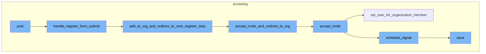

<SwmSnippet path="/src/sentry/web/frontend/auth_login.py" line="216">

---

## Post Function

The `post` function is the entry point of the flow. It handles the HTTP POST request. Depending on the operation (`op`) specified in the request, it either redirects to Single Sign-On (SSO) or handles the registration or login form submission.

```python
    def post(self, request: Request, **kwargs) -> HttpResponse:
        op = request.POST.get("op")
        if op == "sso" and request.POST.get("organization"):
            return self.redirect_post_to_sso(request=request)

        organization: RpcOrganization | None = kwargs.pop("organization", None)

        if self.can_register(request=request):
            return self.handle_register_form_submit(
                request=request, organization=organization, **kwargs
            )
        else:
            assert op == "login"
            return self.handle_login_form_submit(request=request, organization=organization)
```

---

</SwmSnippet>

<SwmSnippet path="/src/sentry/web/frontend/auth_login.py" line="266">

---

## Handle Register Form Submit

The `handle_register_form_submit` function validates the registration form. If the form is valid, it creates a new user and proceeds to the next registration step. If the form is not valid, it returns the form with its errors displayed.

```python
    def handle_register_form_submit(
        self, request: Request, organization: RpcOrganization, **kwargs
    ) -> HttpResponse:
        """
        Validates a completed register form, redirecting to the next
        step or returning the form with its errors displayed.
        """
        context = self.get_default_context(request=request, **kwargs)

        register_form = self.initialize_register_form(request=request)
        if register_form.is_valid():
            user = self.handle_new_user_creation(
                request=request, register_form=register_form, organization=organization
            )
            return self.add_to_org_and_redirect_to_next_register_step(request=request, user=user)
        else:
            context.update(
                {
                    "op": "register",
                    "register_form": register_form,
                    "CAN_REGISTER": True,
```

---

</SwmSnippet>

<SwmSnippet path="/src/sentry/web/frontend/auth_login.py" line="323">

---

## Add to Organization and Redirect to Next Register Step

The `add_to_org_and_redirect_to_next_register_step` function adds the user to their organization, accepts any pending invites, and redirects the user to their next step. If the application is in single organization mode and there's no pending invitation, the user is associated with the only organization.

```python
    def add_to_org_and_redirect_to_next_register_step(
        self, request: Request, user: User
    ) -> HttpResponseBase:
        """
        Given a valid register form, adds them to their org, accepts their invite, and
        redirects the user to their next step.
        """

        # Attempt to directly accept any pending invites
        invite_helper = ApiInviteHelper.from_session(request=request, logger=logger)

        # In single org mode, associate the user to the only organization.
        #
        # XXX: Only do this if there isn't a pending invitation. The user
        # may need to configure 2FA in which case, we don't want to make
        # the association for them.
        if settings.SENTRY_SINGLE_ORGANIZATION and not invite_helper:
            self.add_single_org_user_to_org(user=user)

        if invite_helper and invite_helper.valid_request:
            return self.accept_invite_and_redirect_to_org(
```

---

</SwmSnippet>

<SwmSnippet path="/src/sentry/web/frontend/auth_login.py" line="360">

---

## Accept Invite and Redirect to Organization

The `accept_invite_and_redirect_to_org` function accepts an invite on behalf of a user and redirects them to their organization login.

```python
    def accept_invite_and_redirect_to_org(
        self, request: Request, invite_helper: ApiInviteHelper
    ) -> HttpResponseBase:
        """
        Accepts an invite on behalf of a user and redirects them to their org login
        """
        invite_helper.accept_invite()
        org_slug = invite_helper.invite_context.organization.slug
        self.determine_active_organization(request=request, organization_slug=org_slug)
        response = self.redirect_to_org(request=request)
        remove_invite_details_from_session(request=request)
        return response
```

---

</SwmSnippet>

<SwmSnippet path="/src/sentry/api/invite_helper.py" line="214">

---

## Accept Invite

The `accept_invite` function accepts an invite for a user. If the user is already a member, it handles the existing member scenario. If the user is not a member, it sets the user for the organization member and schedules a signal for the member joined event.

```python
    def accept_invite(self, user: User | None = None) -> RpcOrganizationMember | None:
        member = self.invite_context.member
        assert member

        if user is None:
            user = self.request.user

        if self.member_already_exists:
            self.handle_member_already_exists()
            if self.invite_context.invite_organization_member_id is not None:
                organization_service.delete_organization_member(
                    organization_member_id=self.invite_context.invite_organization_member_id,
                    organization_id=self.invite_context.organization.id,
                )
            return None

        try:
            provider = AuthProvider.objects.get(organization_id=self.invite_context.organization.id)
        except AuthProvider.DoesNotExist:
            provider = None

```

---

</SwmSnippet>

<SwmSnippet path="/src/sentry/organizations/services/organization/impl.py" line="293">

---

## Set User for Organization Member

The `set_user_for_organization_member` function sets a user for an organization member. If the user is already a member of the organization, it returns the member. If the user is not a member, it sets the user for the organization member and saves the changes.

```python
    def set_user_for_organization_member(
        self,
        *,
        organization_member_id: int,
        organization_id: int,
        user_id: int,
    ) -> RpcOrganizationMember | None:
        with transaction.atomic(router.db_for_write(OrganizationMember)):
            try:
                org_member = OrganizationMember.objects.get(
                    user_id=user_id, organization_id=organization_id
                )
                return serialize_member(org_member)
            except OrganizationMember.DoesNotExist:
                try:
                    org_member = OrganizationMember.objects.get(
                        id=organization_member_id, organization_id=organization_id
                    )
                    org_member.set_user(user_id)
                    org_member.save()
                except OrganizationMember.DoesNotExist:
```

---

</SwmSnippet>

<SwmSnippet path="/src/sentry/organizations/services/organization/impl.py" line="796">

---

## Schedule Signal

The `schedule_signal` function schedules a signal for the member joined event. It adds the signal to the outbox for the organization scope.

```python
    def schedule_signal(
        self, signal: Signal, organization_id: int, args: Mapping[str, str | int | None]
    ) -> None:
        with outbox_context(flush=False):
            payload: Any = {
                "args": args,
                "signal": int(RpcOrganizationSignal.from_signal(signal)),
            }
            for region_name in find_regions_for_orgs([organization_id]):
                ControlOutbox(
                    shard_scope=OutboxScope.ORGANIZATION_SCOPE,
                    shard_identifier=organization_id,
                    region_name=region_name,
                    category=OutboxCategory.SEND_SIGNAL,
                    object_identifier=ControlOutbox.next_object_identifier(),
                    payload=payload,
                ).save()
```

---

</SwmSnippet>

<SwmSnippet path="/src/sentry/event_manager.py" line="442">

---

## Save Event

The `save` function saves the event after normalizing and processing it. It saves adjacent models such as releases and environments to the database and writes the event into the event stream. From there, it will be picked up by Snuba and post-processing.

```python
    def save(
        self,
        project_id: int | None,
        raw: bool = False,
        assume_normalized: bool = False,
        start_time: float | None = None,
        cache_key: str | None = None,
        skip_send_first_transaction: bool = False,
        has_attachments: bool = False,
    ) -> Event:
        """
        After normalizing and processing an event, save adjacent models such as
        releases and environments to postgres and write the event into
        eventstream. From there it will be picked up by Snuba and
        post-processing.

        We re-insert events with duplicate IDs into Snuba, which is responsible
        for deduplicating events. Since deduplication in Snuba is on the primary
        key (based on event ID, project ID and day), events with same IDs are only
        deduplicated if their timestamps fall on the same day. The latest event
        always wins and overwrites the value of events received earlier in that day.
```

---

</SwmSnippet>

# Flow drill down



<SwmSnippet path="/src/sentry/web/frontend/auth_login.py" line="216">

---

# Post Function

The `post` function is the entry point of the flow. It handles the HTTP POST request. Depending on the operation (`op`) specified in the request, it either redirects to Single Sign-On (SSO) or handles the registration or login form submission.

```python
    def post(self, request: Request, **kwargs) -> HttpResponse:
        op = request.POST.get("op")
        if op == "sso" and request.POST.get("organization"):
            return self.redirect_post_to_sso(request=request)

        organization: RpcOrganization | None = kwargs.pop("organization", None)

        if self.can_register(request=request):
            return self.handle_register_form_submit(
                request=request, organization=organization, **kwargs
            )
        else:
            assert op == "login"
            return self.handle_login_form_submit(request=request, organization=organization)
```

---

</SwmSnippet>

<SwmSnippet path="/src/sentry/web/frontend/auth_login.py" line="266">

---

# Handle Register Form Submit

The `handle_register_form_submit` function validates the registration form. If the form is valid, it creates a new user and proceeds to the next registration step. If the form is not valid, it returns the form with its errors displayed.

```python
    def handle_register_form_submit(
        self, request: Request, organization: RpcOrganization, **kwargs
    ) -> HttpResponse:
        """
        Validates a completed register form, redirecting to the next
        step or returning the form with its errors displayed.
        """
        context = self.get_default_context(request=request, **kwargs)

        register_form = self.initialize_register_form(request=request)
        if register_form.is_valid():
            user = self.handle_new_user_creation(
                request=request, register_form=register_form, organization=organization
            )
            return self.add_to_org_and_redirect_to_next_register_step(request=request, user=user)
        else:
            context.update(
                {
                    "op": "register",
                    "register_form": register_form,
                    "CAN_REGISTER": True,
```

---

</SwmSnippet>

<SwmSnippet path="/src/sentry/web/frontend/auth_login.py" line="323">

---

# Add to Organization and Redirect to Next Register Step

The `add_to_org_and_redirect_to_next_register_step` function adds the user to their organization, accepts any pending invites, and redirects the user to their next step. If the application is in single organization mode and there's no pending invitation, the user is associated with the only organization.

```python
    def add_to_org_and_redirect_to_next_register_step(
        self, request: Request, user: User
    ) -> HttpResponseBase:
        """
        Given a valid register form, adds them to their org, accepts their invite, and
        redirects the user to their next step.
        """

        # Attempt to directly accept any pending invites
        invite_helper = ApiInviteHelper.from_session(request=request, logger=logger)

        # In single org mode, associate the user to the only organization.
        #
        # XXX: Only do this if there isn't a pending invitation. The user
        # may need to configure 2FA in which case, we don't want to make
        # the association for them.
        if settings.SENTRY_SINGLE_ORGANIZATION and not invite_helper:
            self.add_single_org_user_to_org(user=user)

        if invite_helper and invite_helper.valid_request:
            return self.accept_invite_and_redirect_to_org(
```

---

</SwmSnippet>

<SwmSnippet path="/src/sentry/web/frontend/auth_login.py" line="360">

---

# Accept Invite and Redirect to Organization

The `accept_invite_and_redirect_to_org` function accepts an invite on behalf of a user and redirects them to their organization login.

```python
    def accept_invite_and_redirect_to_org(
        self, request: Request, invite_helper: ApiInviteHelper
    ) -> HttpResponseBase:
        """
        Accepts an invite on behalf of a user and redirects them to their org login
        """
        invite_helper.accept_invite()
        org_slug = invite_helper.invite_context.organization.slug
        self.determine_active_organization(request=request, organization_slug=org_slug)
        response = self.redirect_to_org(request=request)
        remove_invite_details_from_session(request=request)
        return response
```

---

</SwmSnippet>

<SwmSnippet path="/src/sentry/api/invite_helper.py" line="214">

---

# Accept Invite

The `accept_invite` function accepts an invite for a user. If the user is already a member, it handles the existing member scenario. If the user is not a member, it sets the user for the organization member and schedules a signal for the member joined event.

```python
    def accept_invite(self, user: User | None = None) -> RpcOrganizationMember | None:
        member = self.invite_context.member
        assert member

        if user is None:
            user = self.request.user

        if self.member_already_exists:
            self.handle_member_already_exists()
            if self.invite_context.invite_organization_member_id is not None:
                organization_service.delete_organization_member(
                    organization_member_id=self.invite_context.invite_organization_member_id,
                    organization_id=self.invite_context.organization.id,
                )
            return None

        try:
            provider = AuthProvider.objects.get(organization_id=self.invite_context.organization.id)
        except AuthProvider.DoesNotExist:
            provider = None

```

---

</SwmSnippet>

<SwmSnippet path="/src/sentry/organizations/services/organization/impl.py" line="293">

---

# Set User for Organization Member

The `set_user_for_organization_member` function sets a user for an organization member. If the user is already a member of the organization, it returns the member. If the user is not a member, it sets the user for the organization member and saves the changes.

```python
    def set_user_for_organization_member(
        self,
        *,
        organization_member_id: int,
        organization_id: int,
        user_id: int,
    ) -> RpcOrganizationMember | None:
        with transaction.atomic(router.db_for_write(OrganizationMember)):
            try:
                org_member = OrganizationMember.objects.get(
                    user_id=user_id, organization_id=organization_id
                )
                return serialize_member(org_member)
            except OrganizationMember.DoesNotExist:
                try:
                    org_member = OrganizationMember.objects.get(
                        id=organization_member_id, organization_id=organization_id
                    )
                    org_member.set_user(user_id)
                    org_member.save()
                except OrganizationMember.DoesNotExist:
```

---

</SwmSnippet>

<SwmSnippet path="/src/sentry/organizations/services/organization/impl.py" line="796">

---

# Schedule Signal

The `schedule_signal` function schedules a signal for the member joined event. It adds the signal to the outbox for the organization scope.

```python
    def schedule_signal(
        self, signal: Signal, organization_id: int, args: Mapping[str, str | int | None]
    ) -> None:
        with outbox_context(flush=False):
            payload: Any = {
                "args": args,
                "signal": int(RpcOrganizationSignal.from_signal(signal)),
            }
            for region_name in find_regions_for_orgs([organization_id]):
                ControlOutbox(
                    shard_scope=OutboxScope.ORGANIZATION_SCOPE,
                    shard_identifier=organization_id,
                    region_name=region_name,
                    category=OutboxCategory.SEND_SIGNAL,
                    object_identifier=ControlOutbox.next_object_identifier(),
                    payload=payload,
                ).save()
```

---

</SwmSnippet>

<SwmSnippet path="/src/sentry/event_manager.py" line="442">

---

# Save Event

The `save` function saves the event after normalizing and processing it. It saves adjacent models such as releases and environments to the database and writes the event into the event stream. From there, it will be picked up by Snuba and post-processing.

```python
    def save(
        self,
        project_id: int | None,
        raw: bool = False,
        assume_normalized: bool = False,
        start_time: float | None = None,
        cache_key: str | None = None,
        skip_send_first_transaction: bool = False,
        has_attachments: bool = False,
    ) -> Event:
        """
        After normalizing and processing an event, save adjacent models such as
        releases and environments to postgres and write the event into
        eventstream. From there it will be picked up by Snuba and
        post-processing.

        We re-insert events with duplicate IDs into Snuba, which is responsible
        for deduplicating events. Since deduplication in Snuba is on the primary
        key (based on event ID, project ID and day), events with same IDs are only
        deduplicated if their timestamps fall on the same day. The latest event
        always wins and overwrites the value of events received earlier in that day.
```

---

</SwmSnippet>

&nbsp;

*This is an auto-generated document by Swimm AI 🌊 and has not yet been verified by a human*

<SwmMeta version="3.0.0" repo-id="Z2l0aHViJTNBJTNBc2VudHJ5LWRlbW8lM0ElM0FTd2ltbS1EZW1v" repo-name="sentry-demo" doc-type="flows"><sup>Powered by [Swimm](/)</sup></SwmMeta>
