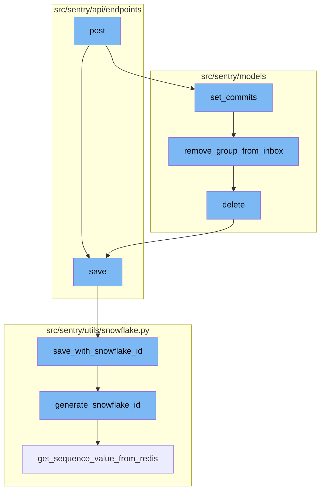
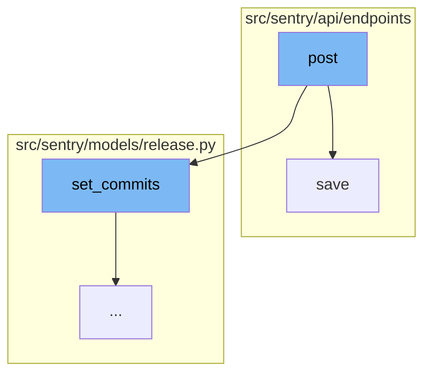
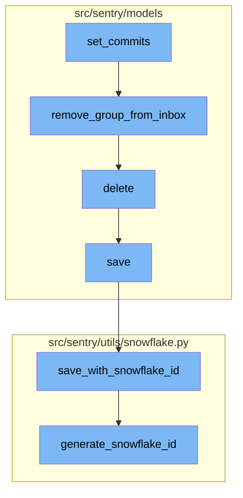

<SwmSnippet path="/src/sentry/api/endpoints/project_releases.py" line="84">

---

# Post Function

The `post` function is responsible for creating a new release and/or associating a project with a release. It takes in a request and a project as parameters. The function first validates the data in the request. If the data is valid, it creates a new release with the validated data. If the release already exists, it retrieves the existing release. The function then updates the status of the release if necessary, adds the project to the release, and sets any commits associated with the release.

```````````````````````````````````python
    def post(self, request: Request, project) -> Response:
        """
        Create a New Release for a Project
        ``````````````````````````````````

        Create a new release and/or associate a project with a release.
        Release versions that are the same across multiple projects
        within an Organization will be treated as the same release in Sentry.

        Releases are used by Sentry to improve its error reporting abilities
        by correlating first seen events with the release that might have
        introduced the problem.

        Releases are also necessary for sourcemaps and other debug features
        that require manual upload for functioning well.

        :pparam string organization_id_or_slug: the id or slug of the organization the
                                          release belongs to.
        :pparam string project_id_or_slug: the id or slug of the project to create a
                                     release for.
        :param string version: a version identifier for this release.  Can
```````````````````````````````````

---

</SwmSnippet>

<SwmSnippet path="/src/sentry/api/endpoints/organization_details.py" line="449">

---

# Save Function

The `save` function is used to save the changes made to an organization. It first retrieves the organization from the context and initializes a dictionary to track the changes. The function then iterates over the organization options and updates the values if they are present in the validated data. If the value of an option has changed, it saves the new value and records the change. The function also updates the flags and other fields of the organization based on the validated data. Finally, it saves the organization and returns it along with the changes.

```python
    def save(self):
        from sentry import features

        org = self.context["organization"]
        changed_data = {}
        if not hasattr(org, "__data"):
            update_tracked_data(org)

        data = self.validated_data

        for key, option, type_, default_value in ORG_OPTIONS:
            if key not in data:
                continue
            try:
                option_inst = OrganizationOption.objects.get(organization=org, key=option)
                update_tracked_data(option_inst)
            except OrganizationOption.DoesNotExist:
                OrganizationOption.objects.set_value(
                    organization=org, key=option, value=type_(data[key])
                )

```

---

</SwmSnippet>

<SwmSnippet path="/src/sentry/models/release.py" line="648">

---

# Set Commits Function

The `set_commits` function is the first step in the post flow. It binds a list of commits to a release, clearing any existing commit log and replacing it with the given commits. It also sorts the commit list in reverse order based on the timestamp.

```python
    def set_commits(self, commit_list):
        """
        Bind a list of commits to this release.

        This will clear any existing commit log and replace it with the given
        commits.
        """

        # Sort commit list in reverse order
        commit_list.sort(key=lambda commit: commit.get("timestamp", 0), reverse=True)

        # TODO(dcramer): this function could use some cleanup/refactoring as it's a bit unwieldy
        from sentry.models.commit import Commit
        from sentry.models.commitauthor import CommitAuthor
        from sentry.models.group import Group, GroupStatus
        from sentry.models.grouplink import GroupLink
        from sentry.models.groupresolution import GroupResolution
        from sentry.models.pullrequest import PullRequest
        from sentry.models.releasecommit import ReleaseCommit
        from sentry.models.releaseheadcommit import ReleaseHeadCommit
        from sentry.models.repository import Repository
```

---

</SwmSnippet>

<SwmSnippet path="/src/sentry/models/groupinbox.py" line="96">

---

# Remove Group from Inbox Function

The `remove_group_from_inbox` function is the next step in the post flow. It removes a group from the inbox. If the action is `GroupInboxRemoveAction.MARK_REVIEWED` and a user is provided, it creates an activity marking the group as reviewed.

```python
def remove_group_from_inbox(group, action=None, user=None, referrer=None):
    try:
        group_inbox = GroupInbox.objects.get(group=group)
        group_inbox.delete()

        if action is GroupInboxRemoveAction.MARK_REVIEWED and user is not None:
            Activity.objects.create(
                project_id=group_inbox.group.project_id,
                group_id=group_inbox.group_id,
                type=ActivityType.MARK_REVIEWED.value,
                user_id=user.id,
            )
            record_group_history(group, GroupHistoryStatus.REVIEWED, actor=user)
    except GroupInbox.DoesNotExist:
        pass
```

---

</SwmSnippet>

<SwmSnippet path="/src/sentry/models/project.py" line="722">

---

# Delete Function

The `delete` function is the third step in the post flow. It deletes a project and removes the notification settings for the project.

```python
    def delete(self, **kwargs):
        # There is no foreign key relationship so we have to manually cascade.
        notifications_service.remove_notification_settings_for_project(project_id=self.id)

        with outbox_context(transaction.atomic(router.db_for_write(Project))):
            Project.outbox_for_update(self.id, self.organization_id).save()
            return super().delete(**kwargs)
```

---

</SwmSnippet>

<SwmSnippet path="/src/sentry/models/project.py" line="365">

---

# Save Function

The `save` function is the fourth step in the post flow. It saves a project. If the project doesn't have a slug, it generates one. If `SENTRY_USE_SNOWFLAKE` is true, it saves the project with a snowflake id.

```python
    def save(self, *args, **kwargs):
        if not self.slug:
            lock = locks.get(
                f"slug:project:{self.organization_id}", duration=5, name="project_slug"
            )
            with TimedRetryPolicy(10)(lock.acquire):
                slugify_instance(
                    self,
                    self.name,
                    organization=self.organization,
                    reserved=RESERVED_PROJECT_SLUGS,
                    max_length=50,
                )

        if SENTRY_USE_SNOWFLAKE:
            snowflake_redis_key = "project_snowflake_key"
            save_with_snowflake_id(
                instance=self,
                snowflake_redis_key=snowflake_redis_key,
                save_callback=lambda: super(Project, self).save(*args, **kwargs),
            )
```

---

</SwmSnippet>

<SwmSnippet path="/src/sentry/utils/snowflake.py" line="47">

---

# Save with Snowflake ID Function

The `save_with_snowflake_id` function is the fifth step in the post flow. It saves a model instance with a snowflake id. If the instance doesn't have an id, it generates a snowflake id and tries to save the instance.

```python
def save_with_snowflake_id(
    instance: BaseModel, snowflake_redis_key: str, save_callback: Callable[[], object]
) -> None:
    assert uses_snowflake_id(
        instance.__class__
    ), "Only models decorated with uses_snowflake_id can be saved with save_with_snowflake_id()"

    for _ in range(settings.MAX_REDIS_SNOWFLAKE_RETRY_COUNTER):
        if not instance.id:
            instance.id = generate_snowflake_id(snowflake_redis_key)
        try:
            with enforce_constraints(transaction.atomic(using=router.db_for_write(type(instance)))):
                save_callback()
            return
        except IntegrityError:
            instance.id = None  # type: ignore[assignment]  # see typeddjango/django-stubs#2014
    raise MaxSnowflakeRetryError
```

---

</SwmSnippet>

<SwmSnippet path="/src/sentry/utils/snowflake.py" line="113">

---

# Generate Snowflake ID Function

The `generate_snowflake_id` function is the final step in the post flow. It generates a snowflake id based on the current time, region, and a sequence value from Redis.

```python
def generate_snowflake_id(redis_key: str) -> int:
    segment_values = {}

    segment_values[VERSION_ID] = msb_0_ordering(settings.SNOWFLAKE_VERSION_ID, VERSION_ID.length)

    try:
        segment_values[REGION_ID] = get_local_region().snowflake_id
    except RegionContextError:  # expected if running in monolith mode
        segment_values[REGION_ID] = NULL_REGION_ID

    current_time = datetime.now().timestamp()
    # supports up to 130 years
    segment_values[TIME_DIFFERENCE] = int(current_time - settings.SENTRY_SNOWFLAKE_EPOCH_START)

    snowflake_id = 0
    (
        segment_values[TIME_DIFFERENCE],
        segment_values[REGION_SEQUENCE],
    ) = get_sequence_value_from_redis(redis_key, segment_values[TIME_DIFFERENCE])

    for segment in BIT_SEGMENT_SCHEMA:
```

---

</SwmSnippet>



# Flow drill down

First, we'll zoom into this section of the flow:



<SwmSnippet path="/src/sentry/api/endpoints/project_releases.py" line="84">

---

# Post Function

The `post` function is responsible for creating a new release and/or associating a project with a release. It takes in a request and a project as parameters. The function first validates the data in the request. If the data is valid, it creates a new release with the validated data. If the release already exists, it retrieves the existing release. The function then updates the status of the release if necessary, adds the project to the release, and sets any commits associated with the release.

```````````````````````````````````python
    def post(self, request: Request, project) -> Response:
        """
        Create a New Release for a Project
        ``````````````````````````````````

        Create a new release and/or associate a project with a release.
        Release versions that are the same across multiple projects
        within an Organization will be treated as the same release in Sentry.

        Releases are used by Sentry to improve its error reporting abilities
        by correlating first seen events with the release that might have
        introduced the problem.

        Releases are also necessary for sourcemaps and other debug features
        that require manual upload for functioning well.

        :pparam string organization_id_or_slug: the id or slug of the organization the
                                          release belongs to.
        :pparam string project_id_or_slug: the id or slug of the project to create a
                                     release for.
        :param string version: a version identifier for this release.  Can
```````````````````````````````````

---

</SwmSnippet>

<SwmSnippet path="/src/sentry/api/endpoints/organization_details.py" line="449">

---

# Save Function

The `save` function is used to save the changes made to an organization. It first retrieves the organization from the context and initializes a dictionary to track the changes. The function then iterates over the organization options and updates the values if they are present in the validated data. If the value of an option has changed, it saves the new value and records the change. The function also updates the flags and other fields of the organization based on the validated data. Finally, it saves the organization and returns it along with the changes.

```python
    def save(self):
        from sentry import features

        org = self.context["organization"]
        changed_data = {}
        if not hasattr(org, "__data"):
            update_tracked_data(org)

        data = self.validated_data

        for key, option, type_, default_value in ORG_OPTIONS:
            if key not in data:
                continue
            try:
                option_inst = OrganizationOption.objects.get(organization=org, key=option)
                update_tracked_data(option_inst)
            except OrganizationOption.DoesNotExist:
                OrganizationOption.objects.set_value(
                    organization=org, key=option, value=type_(data[key])
                )

```

---

</SwmSnippet>

Now, lets zoom into this section of the flow:



<SwmSnippet path="/src/sentry/models/release.py" line="648">

---

# Post Flow

The `set_commits` function is the first step in the post flow. It binds a list of commits to a release, clearing any existing commit log and replacing it with the given commits. It also sorts the commit list in reverse order based on the timestamp.

```python
    def set_commits(self, commit_list):
        """
        Bind a list of commits to this release.

        This will clear any existing commit log and replace it with the given
        commits.
        """

        # Sort commit list in reverse order
        commit_list.sort(key=lambda commit: commit.get("timestamp", 0), reverse=True)

        # TODO(dcramer): this function could use some cleanup/refactoring as it's a bit unwieldy
        from sentry.models.commit import Commit
        from sentry.models.commitauthor import CommitAuthor
        from sentry.models.group import Group, GroupStatus
        from sentry.models.grouplink import GroupLink
        from sentry.models.groupresolution import GroupResolution
        from sentry.models.pullrequest import PullRequest
        from sentry.models.releasecommit import ReleaseCommit
        from sentry.models.releaseheadcommit import ReleaseHeadCommit
        from sentry.models.repository import Repository
```

---

</SwmSnippet>

<SwmSnippet path="/src/sentry/models/groupinbox.py" line="96">

---

The `remove_group_from_inbox` function is the next step in the post flow. It removes a group from the inbox. If the action is `GroupInboxRemoveAction.MARK_REVIEWED` and a user is provided, it creates an activity marking the group as reviewed.

```python
def remove_group_from_inbox(group, action=None, user=None, referrer=None):
    try:
        group_inbox = GroupInbox.objects.get(group=group)
        group_inbox.delete()

        if action is GroupInboxRemoveAction.MARK_REVIEWED and user is not None:
            Activity.objects.create(
                project_id=group_inbox.group.project_id,
                group_id=group_inbox.group_id,
                type=ActivityType.MARK_REVIEWED.value,
                user_id=user.id,
            )
            record_group_history(group, GroupHistoryStatus.REVIEWED, actor=user)
    except GroupInbox.DoesNotExist:
        pass
```

---

</SwmSnippet>

<SwmSnippet path="/src/sentry/models/project.py" line="722">

---

The `delete` function is the third step in the post flow. It deletes a project and removes the notification settings for the project.

```python
    def delete(self, **kwargs):
        # There is no foreign key relationship so we have to manually cascade.
        notifications_service.remove_notification_settings_for_project(project_id=self.id)

        with outbox_context(transaction.atomic(router.db_for_write(Project))):
            Project.outbox_for_update(self.id, self.organization_id).save()
            return super().delete(**kwargs)
```

---

</SwmSnippet>

<SwmSnippet path="/src/sentry/models/project.py" line="365">

---

The `save` function is the fourth step in the post flow. It saves a project. If the project doesn't have a slug, it generates one. If `SENTRY_USE_SNOWFLAKE` is true, it saves the project with a snowflake id.

```python
    def save(self, *args, **kwargs):
        if not self.slug:
            lock = locks.get(
                f"slug:project:{self.organization_id}", duration=5, name="project_slug"
            )
            with TimedRetryPolicy(10)(lock.acquire):
                slugify_instance(
                    self,
                    self.name,
                    organization=self.organization,
                    reserved=RESERVED_PROJECT_SLUGS,
                    max_length=50,
                )

        if SENTRY_USE_SNOWFLAKE:
            snowflake_redis_key = "project_snowflake_key"
            save_with_snowflake_id(
                instance=self,
                snowflake_redis_key=snowflake_redis_key,
                save_callback=lambda: super(Project, self).save(*args, **kwargs),
            )
```

---

</SwmSnippet>

<SwmSnippet path="/src/sentry/utils/snowflake.py" line="47">

---

The `save_with_snowflake_id` function is the fifth step in the post flow. It saves a model instance with a snowflake id. If the instance doesn't have an id, it generates a snowflake id and tries to save the instance.

```python
def save_with_snowflake_id(
    instance: BaseModel, snowflake_redis_key: str, save_callback: Callable[[], object]
) -> None:
    assert uses_snowflake_id(
        instance.__class__
    ), "Only models decorated with uses_snowflake_id can be saved with save_with_snowflake_id()"

    for _ in range(settings.MAX_REDIS_SNOWFLAKE_RETRY_COUNTER):
        if not instance.id:
            instance.id = generate_snowflake_id(snowflake_redis_key)
        try:
            with enforce_constraints(transaction.atomic(using=router.db_for_write(type(instance)))):
                save_callback()
            return
        except IntegrityError:
            instance.id = None  # type: ignore[assignment]  # see typeddjango/django-stubs#2014
    raise MaxSnowflakeRetryError
```

---

</SwmSnippet>

<SwmSnippet path="/src/sentry/utils/snowflake.py" line="113">

---

The `generate_snowflake_id` function is the final step in the post flow. It generates a snowflake id based on the current time, region, and a sequence value from Redis.

```python
def generate_snowflake_id(redis_key: str) -> int:
    segment_values = {}

    segment_values[VERSION_ID] = msb_0_ordering(settings.SNOWFLAKE_VERSION_ID, VERSION_ID.length)

    try:
        segment_values[REGION_ID] = get_local_region().snowflake_id
    except RegionContextError:  # expected if running in monolith mode
        segment_values[REGION_ID] = NULL_REGION_ID

    current_time = datetime.now().timestamp()
    # supports up to 130 years
    segment_values[TIME_DIFFERENCE] = int(current_time - settings.SENTRY_SNOWFLAKE_EPOCH_START)

    snowflake_id = 0
    (
        segment_values[TIME_DIFFERENCE],
        segment_values[REGION_SEQUENCE],
    ) = get_sequence_value_from_redis(redis_key, segment_values[TIME_DIFFERENCE])

    for segment in BIT_SEGMENT_SCHEMA:
```

---

</SwmSnippet>

&nbsp;

*This is an auto-generated document by Swimm AI 🌊 and has not yet been verified by a human*

<SwmMeta version="3.0.0" repo-id="Z2l0aHViJTNBJTNBc2VudHJ5LWRlbW8lM0ElM0FTd2ltbS1EZW1v" repo-name="sentry-demo" doc-type="flows"><sup>Powered by [Swimm](/)</sup></SwmMeta>
