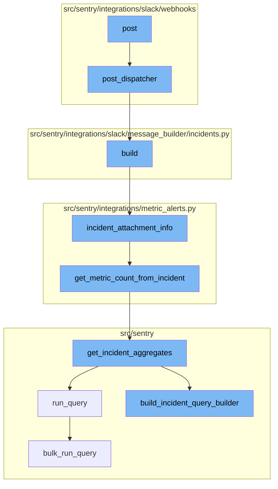

<SwmSnippet path="/src/sentry/integrations/slack/webhooks/command.py" line="165">

---

# Post Function

The `post` function is the entry point for handling requests. It validates the incoming request and if successful, it delegates the request handling to the `post_dispatcher` function.

```python
    def post(self, request: Request) -> Response:
        try:
            slack_request = self.slack_request_class(request)
            slack_request.validate()
        except SlackRequestError as e:
            if e.status == status.HTTP_403_FORBIDDEN:
                metrics.incr(
                    self._METRICS_FAILURE_KEY + ".slack-commands-endpoint.forbidden",
                    sample_rate=1.0,
                )
                return self.respond(SlackDisconnectedMessageBuilder().build())
            metrics.incr(
                self._METRICS_FAILURE_KEY + ".slack-commands-endpoint.validation_error",
                sample_rate=1.0,
            )
            return self.respond(status=e.status)

        metrics.incr(self._METRICS_SUCCESS_KEY + ".slack-commands-endpoint", sample_rate=1.0)
        return super().post_dispatcher(slack_request)
```

---

</SwmSnippet>

<SwmSnippet path="/src/sentry/integrations/slack/webhooks/base.py" line="42">

---

# Post Dispatcher Function

The `post_dispatcher` function is responsible for routing the request to the appropriate handler based on the command received in the request.

```python
    def post_dispatcher(self, request: SlackDMRequest) -> Response:
        """
        All Slack commands are handled by this endpoint. This block just
        validates the request and dispatches it to the right handler.
        """
        command, args = request.get_command_and_args()

        if command in ["help", "", "support", "docs"]:
            return self.respond(SlackHelpMessageBuilder(command=command).build())

        if command == "link":
            if not args:
                return self.link_user(request)

            if args[0] == "team":
                return self.link_team(request)

        if command == "unlink":
            if not args:
                return self.unlink_user(request)

```

---

</SwmSnippet>

<SwmSnippet path="/src/sentry/integrations/slack/message_builder/incidents.py" line="48">

---

# Build Function

The `build` function constructs the message to be sent as a response. It uses the `incident_attachment_info` function to gather the necessary data for the message.

```python
    def build(self) -> SlackBody:
        data = incident_attachment_info(
            self.incident,
            self.new_status,
            self.metric_value,
            self.notification_uuid,
            referrer="metric_alert_slack",
        )
        blocks = [
            self.get_markdown_block(text=f"{data['text']}\n{get_started_at(data['ts'])}"),
        ]
        alert_rule = self.action.alert_rule_trigger.alert_rule

        if (
            alert_rule.description
            and features.has(
                "organizations:slack-metric-alert-description", self.incident.organization
            )
            and not self.new_status == IncidentStatus.CLOSED
        ):
            description = self.get_markdown_block(text=f"*Notes*: {alert_rule.description}")
```

---

</SwmSnippet>

<SwmSnippet path="/src/sentry/integrations/metric_alerts.py" line="106">

---

# Incident Attachment Info Function

The `incident_attachment_info` function retrieves detailed information about an incident. If the metric value is not provided, it calls the `get_metric_count_from_incident` function to fetch it.

```python
def incident_attachment_info(
    incident: Incident,
    new_status: IncidentStatus,
    metric_value=None,
    notification_uuid=None,
    referrer="metric_alert",
):
    alert_rule = incident.alert_rule

    status = INCIDENT_STATUS[new_status]

    if metric_value is None:
        metric_value = get_metric_count_from_incident(incident)

    text = get_incident_status_text(alert_rule, metric_value)
    title = f"{status}: {alert_rule.name}"

    title_link_params = {
        "alert": str(incident.identifier),
        "referrer": referrer,
    }
```

---

</SwmSnippet>

<SwmSnippet path="/src/sentry/integrations/metric_alerts.py" line="40">

---

# Get Metric Count From Incident Function

The `get_metric_count_from_incident` function retrieves the current or last count of an incident aggregate. It uses the `get_incident_aggregates` function to get the count.

```python
def get_metric_count_from_incident(incident: Incident) -> str:
    """Returns the current or last count of an incident aggregate."""
    incident_trigger = (
        IncidentTrigger.objects.filter(incident=incident).order_by("-date_modified").first()
    )
    if incident_trigger:
        alert_rule_trigger = incident_trigger.alert_rule_trigger
        # TODO: If we're relying on this and expecting possible delays between a
        # trigger fired and this function running, then this could actually be
        # incorrect if they changed the trigger's time window in this time period.
        # Should we store it?
        start = incident_trigger.date_modified - timedelta(
            seconds=alert_rule_trigger.alert_rule.snuba_query.time_window
        )
        end = incident_trigger.date_modified
    else:
        start, end = None, None

    return get_incident_aggregates(incident=incident, start=start, end=end).get("count")
```

---

</SwmSnippet>

<SwmSnippet path="/src/sentry/incidents/logic.py" line="406">

---

# Get Incident Aggregates Function

The `get_incident_aggregates` function calculates aggregate stats across the life of an incident. It uses the `build_incident_query_builder` function to construct the query.

```python
def get_incident_aggregates(
    incident: Incident,
    start: datetime | None = None,
    end: datetime | None = None,
    windowed_stats: bool = False,
) -> dict[str, float | int]:
    """
    Calculates aggregate stats across the life of an incident, or the provided range.
    """
    snuba_query = incident.alert_rule.snuba_query
    entity_subscription = get_entity_subscription_from_snuba_query(
        snuba_query,
        incident.organization_id,
    )
    query_builder = build_incident_query_builder(
        incident, entity_subscription, start, end, windowed_stats
    )
    try:
        results = query_builder.run_query(referrer="incidents.get_incident_aggregates")
    except Exception:
        metrics.incr(
```

---

</SwmSnippet>

<SwmSnippet path="/src/sentry/incidents/logic.py" line="331">

---

# Build Incident Query Builder Function

The `build_incident_query_builder` function constructs the query to fetch incident aggregates. It sets up the conditions and limits for the query.

```python
def build_incident_query_builder(
    incident: Incident,
    entity_subscription: EntitySubscription,
    start: datetime | None = None,
    end: datetime | None = None,
    windowed_stats: bool = False,
) -> BaseQueryBuilder:
    snuba_query = incident.alert_rule.snuba_query
    start, end = calculate_incident_time_range(incident, start, end, windowed_stats=windowed_stats)
    project_ids = list(
        IncidentProject.objects.filter(incident=incident).values_list("project_id", flat=True)
    )
    query_builder = entity_subscription.build_query_builder(
        query=snuba_query.query,
        project_ids=project_ids,
        environment=snuba_query.environment,
        params={
            "organization_id": incident.organization_id,
            "project_id": project_ids,
            "start": start,
            "end": end,
```

---

</SwmSnippet>

<SwmSnippet path="/src/sentry/snuba/metrics_layer/query.py" line="143">

---

# Run Query Function

The `run_query` function is the entry point for executing a metrics query in Snuba. It uses the `bulk_run_query` function to execute the query.

```python
def run_query(request: Request) -> Mapping[str, Any]:
    """
    Entrypoint for executing a metrics query in Snuba.
    """
    return bulk_run_query([request])[0]
```

---

</SwmSnippet>

<SwmSnippet path="/src/sentry/snuba/metrics_layer/query.py" line="81">

---

# Bulk Run Query Function

The `bulk_run_query` function executes a list of metrics queries in Snuba. It sets up the queries, executes them, and processes the results.

```python
def bulk_run_query(requests: list[Request]) -> list[Mapping[str, Any]]:
    """
    Entrypoint for executing a list of metrics queries in Snuba.

    This function is used to execute multiple metrics queries in a single request.
    """
    if not requests:
        return []

    queries = []
    for request in requests:
        request, start, end = _setup_metrics_query(request)
        queries.append([request, start, end])

    logging_tags = {"referrer": request.tenant_ids["referrer"] or "unknown", "lang": "mql"}

    for q in queries:
        q[0], reverse_mappings, mappings = _resolve_metrics_query(q[0], logging_tags)
        q.extend([reverse_mappings, mappings])

    try:
```

---

</SwmSnippet>



# Flow drill down


<SwmSnippet path="/src/sentry/integrations/slack/webhooks/command.py" line="165">

---

# Post Function

The `post` function is the entry point for handling requests. It validates the incoming request and if successful, it delegates the request handling to the `post_dispatcher` function.

```python
    def post(self, request: Request) -> Response:
        try:
            slack_request = self.slack_request_class(request)
            slack_request.validate()
        except SlackRequestError as e:
            if e.status == status.HTTP_403_FORBIDDEN:
                metrics.incr(
                    self._METRICS_FAILURE_KEY + ".slack-commands-endpoint.forbidden",
                    sample_rate=1.0,
                )
                return self.respond(SlackDisconnectedMessageBuilder().build())
            metrics.incr(
                self._METRICS_FAILURE_KEY + ".slack-commands-endpoint.validation_error",
                sample_rate=1.0,
            )
            return self.respond(status=e.status)

        metrics.incr(self._METRICS_SUCCESS_KEY + ".slack-commands-endpoint", sample_rate=1.0)
        return super().post_dispatcher(slack_request)
```

---

</SwmSnippet>

<SwmSnippet path="/src/sentry/integrations/slack/webhooks/base.py" line="42">

---

# Post Dispatcher Function

The `post_dispatcher` function is responsible for routing the request to the appropriate handler based on the command received in the request.

```python
    def post_dispatcher(self, request: SlackDMRequest) -> Response:
        """
        All Slack commands are handled by this endpoint. This block just
        validates the request and dispatches it to the right handler.
        """
        command, args = request.get_command_and_args()

        if command in ["help", "", "support", "docs"]:
            return self.respond(SlackHelpMessageBuilder(command=command).build())

        if command == "link":
            if not args:
                return self.link_user(request)

            if args[0] == "team":
                return self.link_team(request)

        if command == "unlink":
            if not args:
                return self.unlink_user(request)

```

---

</SwmSnippet>

<SwmSnippet path="/src/sentry/integrations/slack/message_builder/incidents.py" line="48">

---

# Build Function

The `build` function constructs the message to be sent as a response. It uses the `incident_attachment_info` function to gather the necessary data for the message.

```python
    def build(self) -> SlackBody:
        data = incident_attachment_info(
            self.incident,
            self.new_status,
            self.metric_value,
            self.notification_uuid,
            referrer="metric_alert_slack",
        )
        blocks = [
            self.get_markdown_block(text=f"{data['text']}\n{get_started_at(data['ts'])}"),
        ]
        alert_rule = self.action.alert_rule_trigger.alert_rule

        if (
            alert_rule.description
            and features.has(
                "organizations:slack-metric-alert-description", self.incident.organization
            )
            and not self.new_status == IncidentStatus.CLOSED
        ):
            description = self.get_markdown_block(text=f"*Notes*: {alert_rule.description}")
```

---

</SwmSnippet>

<SwmSnippet path="/src/sentry/integrations/metric_alerts.py" line="106">

---

# Incident Attachment Info Function

The `incident_attachment_info` function retrieves detailed information about an incident. If the metric value is not provided, it calls the `get_metric_count_from_incident` function to fetch it.

```python
def incident_attachment_info(
    incident: Incident,
    new_status: IncidentStatus,
    metric_value=None,
    notification_uuid=None,
    referrer="metric_alert",
):
    alert_rule = incident.alert_rule

    status = INCIDENT_STATUS[new_status]

    if metric_value is None:
        metric_value = get_metric_count_from_incident(incident)

    text = get_incident_status_text(alert_rule, metric_value)
    title = f"{status}: {alert_rule.name}"

    title_link_params = {
        "alert": str(incident.identifier),
        "referrer": referrer,
    }
```

---

</SwmSnippet>

<SwmSnippet path="/src/sentry/integrations/metric_alerts.py" line="40">

---

# Get Metric Count From Incident Function

The `get_metric_count_from_incident` function retrieves the current or last count of an incident aggregate. It uses the `get_incident_aggregates` function to get the count.

```python
def get_metric_count_from_incident(incident: Incident) -> str:
    """Returns the current or last count of an incident aggregate."""
    incident_trigger = (
        IncidentTrigger.objects.filter(incident=incident).order_by("-date_modified").first()
    )
    if incident_trigger:
        alert_rule_trigger = incident_trigger.alert_rule_trigger
        # TODO: If we're relying on this and expecting possible delays between a
        # trigger fired and this function running, then this could actually be
        # incorrect if they changed the trigger's time window in this time period.
        # Should we store it?
        start = incident_trigger.date_modified - timedelta(
            seconds=alert_rule_trigger.alert_rule.snuba_query.time_window
        )
        end = incident_trigger.date_modified
    else:
        start, end = None, None

    return get_incident_aggregates(incident=incident, start=start, end=end).get("count")
```

---

</SwmSnippet>

<SwmSnippet path="/src/sentry/incidents/logic.py" line="406">

---

# Get Incident Aggregates Function

The `get_incident_aggregates` function calculates aggregate stats across the life of an incident. It uses the `build_incident_query_builder` function to construct the query.

```python
def get_incident_aggregates(
    incident: Incident,
    start: datetime | None = None,
    end: datetime | None = None,
    windowed_stats: bool = False,
) -> dict[str, float | int]:
    """
    Calculates aggregate stats across the life of an incident, or the provided range.
    """
    snuba_query = incident.alert_rule.snuba_query
    entity_subscription = get_entity_subscription_from_snuba_query(
        snuba_query,
        incident.organization_id,
    )
    query_builder = build_incident_query_builder(
        incident, entity_subscription, start, end, windowed_stats
    )
    try:
        results = query_builder.run_query(referrer="incidents.get_incident_aggregates")
    except Exception:
        metrics.incr(
```

---

</SwmSnippet>

<SwmSnippet path="/src/sentry/incidents/logic.py" line="331">

---

# Build Incident Query Builder Function

The `build_incident_query_builder` function constructs the query to fetch incident aggregates. It sets up the conditions and limits for the query.

```python
def build_incident_query_builder(
    incident: Incident,
    entity_subscription: EntitySubscription,
    start: datetime | None = None,
    end: datetime | None = None,
    windowed_stats: bool = False,
) -> BaseQueryBuilder:
    snuba_query = incident.alert_rule.snuba_query
    start, end = calculate_incident_time_range(incident, start, end, windowed_stats=windowed_stats)
    project_ids = list(
        IncidentProject.objects.filter(incident=incident).values_list("project_id", flat=True)
    )
    query_builder = entity_subscription.build_query_builder(
        query=snuba_query.query,
        project_ids=project_ids,
        environment=snuba_query.environment,
        params={
            "organization_id": incident.organization_id,
            "project_id": project_ids,
            "start": start,
            "end": end,
```

---

</SwmSnippet>

<SwmSnippet path="/src/sentry/snuba/metrics_layer/query.py" line="143">

---

# Run Query Function

The `run_query` function is the entry point for executing a metrics query in Snuba. It uses the `bulk_run_query` function to execute the query.

```python
def run_query(request: Request) -> Mapping[str, Any]:
    """
    Entrypoint for executing a metrics query in Snuba.
    """
    return bulk_run_query([request])[0]
```

---

</SwmSnippet>

<SwmSnippet path="/src/sentry/snuba/metrics_layer/query.py" line="81">

---

# Bulk Run Query Function

The `bulk_run_query` function executes a list of metrics queries in Snuba. It sets up the queries, executes them, and processes the results.

```python
def bulk_run_query(requests: list[Request]) -> list[Mapping[str, Any]]:
    """
    Entrypoint for executing a list of metrics queries in Snuba.

    This function is used to execute multiple metrics queries in a single request.
    """
    if not requests:
        return []

    queries = []
    for request in requests:
        request, start, end = _setup_metrics_query(request)
        queries.append([request, start, end])

    logging_tags = {"referrer": request.tenant_ids["referrer"] or "unknown", "lang": "mql"}

    for q in queries:
        q[0], reverse_mappings, mappings = _resolve_metrics_query(q[0], logging_tags)
        q.extend([reverse_mappings, mappings])

    try:
```

---

</SwmSnippet>

&nbsp;

*This is an auto-generated document by Swimm AI 🌊 and has not yet been verified by a human*

<SwmMeta version="3.0.0" repo-id="Z2l0aHViJTNBJTNBc2VudHJ5LWRlbW8lM0ElM0FTd2ltbS1EZW1v" repo-name="sentry-demo" doc-type="flows"><sup>Powered by [Swimm](/)</sup></SwmMeta>
