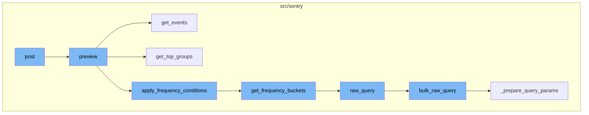
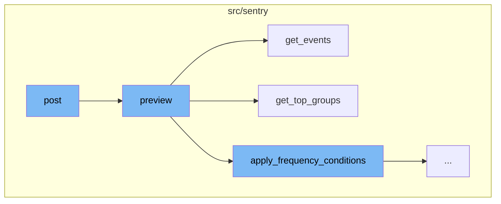
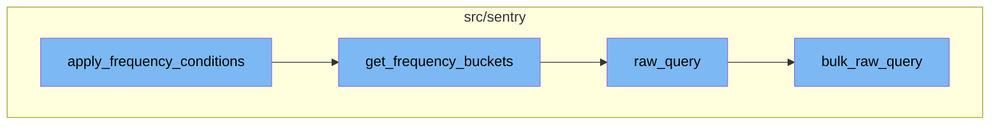

# Overview

The 'post' function is a crucial part of the Sentry application. It serves as the entry point for a flow that involves several steps, including previewing, retrieving events, grouping, and applying frequency conditions. This flow is designed to handle and process incoming requests and data.

<SwmSnippet path="/src/sentry/api/endpoints/project_rule_preview.py" line="30">

---

# Post Function

The `post` function is the entry point of the flow. It takes in a request and a project as parameters. The function validates the data in the request and then calls the `preview` function with the validated data and the project.

```python
    def post(self, request: Request, project) -> Response:
        """
        Get a list of alert triggers in past 2 weeks for given rules

            {method} {path}
            {{
                "conditions": [],
                "filters": [],
                "actionMatch": "all",
                "filterMatch": "all",
                "frequency": 60,
                "endpoint": datetime or None
            }}

        """
        serializer = RulePreviewSerializer(
            context={"project": project, "organization": project.organization}, data=request.data
        )

        if not serializer.is_valid():
            raise ValidationError
```

---

</SwmSnippet>

<SwmSnippet path="/src/sentry/rules/history/preview.py" line="52">

---

# Preview Function

The `preview` function takes in several parameters including the project, conditions, filters, and frequency. It categorizes the conditions into issue state conditions and frequency conditions. It then retrieves the issue state activity and filters. If there are frequency conditions, it applies them using the `apply_frequency_conditions` function.

```python
def preview(
    project: Project,
    conditions: Conditions,
    filters: Conditions,
    condition_match: str,
    filter_match: str,
    frequency_minutes: int,
    end: datetime | None = None,
) -> dict[int, datetime] | None:
    """
    Returns groups that would have triggered the given conditions and filters in the past 2 weeks
    """
    issue_state_conditions, frequency_conditions = categorize_conditions(conditions)

    # must have at least one condition to filter activity
    if not issue_state_conditions and not frequency_conditions:
        return None
    # all the issue state conditions are mutually exclusive
    elif len(issue_state_conditions) > 1 and condition_match == "all":
        return {}

```

---

</SwmSnippet>

<SwmSnippet path="/src/sentry/rules/history/preview.py" line="293">

---

# Get Events Function

The `get_events` function retrieves events that have caused issue state changes. It queries events by group_id and event_id. The function returns a dictionary where the keys are event_ids and the values are the corresponding events.

```python
def get_events(
    project: Project,
    group_activity: GroupActivityMap,
    columns: dict[Dataset, list[str]],
    start: datetime,
    end: datetime,
) -> dict[str, Any]:
    """
    Returns events that have caused issue state changes.
    """
    group_ids = defaultdict(list)
    event_ids = defaultdict(list)
    dataset_map = get_group_dataset(list(group_activity.keys()))
    for group, activities in group_activity.items():
        dataset = dataset_map[group]
        for activity in activities:
            if activity.type == ConditionActivityType.CREATE_ISSUE:
                group_ids[dataset].append(activity.group_id)
            elif activity.type in (
                ConditionActivityType.REGRESSION,
                ConditionActivityType.REAPPEARED,
```

---

</SwmSnippet>

<SwmSnippet path="/src/sentry/rules/history/preview.py" line="216">

---

# Get Top Groups Function

The `get_top_groups` function filters the activity to contain only groups that have the most events in the past 2 weeks. If no groups are provided because there are no issue state change conditions, it returns the top groups overall.

```python
def get_top_groups(
    project: Project,
    start: datetime,
    end: datetime,
    condition_activity: GroupActivityMap,
    dataset_map: dict[int, Dataset],
    has_issue_state_condition: bool = True,
) -> GroupActivityMap:
    """
    Filters the activity to contain only groups that have the most events (out of the given groups) in the past 2 weeks.
    If no groups are provided because there are no issue state change conditions, returns the top groups overall.

    Since frequency conditions require snuba query(s), we need to limit the number groups we process.
    """
    if has_issue_state_condition:
        datasets = {dataset_map.get(group) for group in condition_activity.keys()}
    else:
        # condition_activity will be empty because there are no issue state conditions.
        # So, we look to find top groups over all datasets
        datasets = set(DATASET_TO_COLUMN_NAME.keys())
    group_ids = list(condition_activity.keys())
```

---

</SwmSnippet>

<SwmSnippet path="/src/sentry/rules/history/preview.py" line="388">

---

# Apply Frequency Conditions Function

The `apply_frequency_conditions` function applies frequency conditions to issue state activity. It takes in parameters such as project, start and end time, group activity, frequency conditions, condition match, dataset map, and a boolean indicating if there is an issue state condition. It processes these parameters and applies the frequency conditions to the group activity. The function returns the filtered group activity.

```python
def apply_frequency_conditions(
    project: Project,
    start: datetime,
    end: datetime,
    group_activity: GroupActivityMap,
    frequency_conditions: Conditions,
    condition_match: str,
    dataset_map: dict[int, Dataset],
    has_issue_state_condition: bool,
) -> GroupActivityMap:
    """
    Applies frequency conditions to issue state activity.
    """
    condition_types = defaultdict(list)
    for condition_data in frequency_conditions:
        condition_cls = rules.get(condition_data["id"])
        if condition_cls is None:
            raise PreviewException
        condition_types[condition_data["id"]].append(
            condition_cls(project=project, data=condition_data)
        )
```

---

</SwmSnippet>

<SwmSnippet path="/src/sentry/rules/history/preview.py" line="502">

---

# Get Frequency Buckets Function

The `get_frequency_buckets` function is used to put the events of a group into buckets and returns the bucket counts. It takes in parameters such as project, start and end time, group id, dataset, and aggregate. It uses these parameters to query the data and fill in the empty buckets while accumulating the sum. The function returns the buckets.

```python
def get_frequency_buckets(
    project: Project,
    start: datetime,
    end: datetime,
    group_id: int,
    dataset: Dataset,
    aggregate: tuple[str, str],
) -> dict[datetime, int]:
    """
    Puts the events of a group into buckets, and returns the bucket counts.
    """
    kwargs = get_update_kwargs_for_group(
        dataset,
        group_id,
        {
            "dataset": dataset,
            "start": start,
            "end": end,
            "filter_keys": {"project_id": [project.id]},
            "aggregations": [
                ("toStartOfFiveMinute", "timestamp", "roundedTime"),
```

---

</SwmSnippet>

<SwmSnippet path="/src/sentry/utils/snuba.py" line="812">

---

# Raw Query Function

The `raw_query` function sends a query to snuba. It takes in parameters such as dataset, start and end time, groupby, conditions, filter keys, aggregations, rollup, referrer, is group release, use cache, and other keyword arguments. It uses these parameters to create snuba query parameters and sends the query to snuba. The function returns the result of the query.

```python
def raw_query(
    dataset=None,
    start=None,
    end=None,
    groupby=None,
    conditions=None,
    filter_keys=None,
    aggregations=None,
    rollup=None,
    referrer=None,
    is_grouprelease=False,
    use_cache=False,
    **kwargs,
) -> Mapping[str, Any]:
    """
    Sends a query to snuba.  See `SnubaQueryParams` docstring for param
    descriptions.
    """

    if referrer:
        kwargs["tenant_ids"] = kwargs.get("tenant_ids") or dict()
```

---

</SwmSnippet>

<SwmSnippet path="/src/sentry/utils/snuba.py" line="959">

---

# Bulk Raw Query Function

The `bulk_raw_query` function is used to make queries using the old JSON format for Snuba queries. It takes in a list of snuba query parameters, referrer, and a boolean indicating if cache should be used. It prepares the query parameters and sends the request to snuba. The function returns the result of the queries.

```python
# TODO: This is the endpoint that accepts legacy (non-SnQL/MQL queries)
# It should eventually be removed
def bulk_raw_query(
    snuba_param_list: Sequence[SnubaQueryParams],
    referrer: str | None = None,
    use_cache: bool | None = False,
) -> ResultSet:
    """
    Used to make queries using the (very) old JSON format for Snuba queries. Queries submitted here
    will be converted to SnQL queries before being sent to Snuba.
    """
    params = [_prepare_query_params(param, referrer) for param in snuba_param_list]
    snuba_requests = [
        SnubaRequest(
            request=json_to_snql(query, query["dataset"]),
            referrer=referrer,
            forward=forward,
            reverse=reverse,
        )
        for query, forward, reverse in params
    ]
```

---

</SwmSnippet>



# Flow drill down

First, we'll zoom into this section of the flow:



<SwmSnippet path="/src/sentry/api/endpoints/project_rule_preview.py" line="30">

---

# Post Function

The `post` function is the entry point of the flow. It takes in a request and a project as parameters. The function validates the data in the request and then calls the `preview` function with the validated data and the project.

```python
    def post(self, request: Request, project) -> Response:
        """
        Get a list of alert triggers in past 2 weeks for given rules

            {method} {path}
            {{
                "conditions": [],
                "filters": [],
                "actionMatch": "all",
                "filterMatch": "all",
                "frequency": 60,
                "endpoint": datetime or None
            }}

        """
        serializer = RulePreviewSerializer(
            context={"project": project, "organization": project.organization}, data=request.data
        )

        if not serializer.is_valid():
            raise ValidationError
```

---

</SwmSnippet>

<SwmSnippet path="/src/sentry/rules/history/preview.py" line="52">

---

# Preview Function

The `preview` function takes in several parameters including the project, conditions, filters, and frequency. It categorizes the conditions into issue state conditions and frequency conditions. It then retrieves the issue state activity and filters. If there are frequency conditions, it applies them using the `apply_frequency_conditions` function.

```python
def preview(
    project: Project,
    conditions: Conditions,
    filters: Conditions,
    condition_match: str,
    filter_match: str,
    frequency_minutes: int,
    end: datetime | None = None,
) -> dict[int, datetime] | None:
    """
    Returns groups that would have triggered the given conditions and filters in the past 2 weeks
    """
    issue_state_conditions, frequency_conditions = categorize_conditions(conditions)

    # must have at least one condition to filter activity
    if not issue_state_conditions and not frequency_conditions:
        return None
    # all the issue state conditions are mutually exclusive
    elif len(issue_state_conditions) > 1 and condition_match == "all":
        return {}

```

---

</SwmSnippet>

<SwmSnippet path="/src/sentry/rules/history/preview.py" line="293">

---

# Get Events Function

The `get_events` function retrieves events that have caused issue state changes. It queries events by group_id and event_id. The function returns a dictionary where the keys are event_ids and the values are the corresponding events.

```python
def get_events(
    project: Project,
    group_activity: GroupActivityMap,
    columns: dict[Dataset, list[str]],
    start: datetime,
    end: datetime,
) -> dict[str, Any]:
    """
    Returns events that have caused issue state changes.
    """
    group_ids = defaultdict(list)
    event_ids = defaultdict(list)
    dataset_map = get_group_dataset(list(group_activity.keys()))
    for group, activities in group_activity.items():
        dataset = dataset_map[group]
        for activity in activities:
            if activity.type == ConditionActivityType.CREATE_ISSUE:
                group_ids[dataset].append(activity.group_id)
            elif activity.type in (
                ConditionActivityType.REGRESSION,
                ConditionActivityType.REAPPEARED,
```

---

</SwmSnippet>

<SwmSnippet path="/src/sentry/rules/history/preview.py" line="216">

---

# Get Top Groups Function

The `get_top_groups` function filters the activity to contain only groups that have the most events in the past 2 weeks. If no groups are provided because there are no issue state change conditions, it returns the top groups overall.

```python
def get_top_groups(
    project: Project,
    start: datetime,
    end: datetime,
    condition_activity: GroupActivityMap,
    dataset_map: dict[int, Dataset],
    has_issue_state_condition: bool = True,
) -> GroupActivityMap:
    """
    Filters the activity to contain only groups that have the most events (out of the given groups) in the past 2 weeks.
    If no groups are provided because there are no issue state change conditions, returns the top groups overall.

    Since frequency conditions require snuba query(s), we need to limit the number groups we process.
    """
    if has_issue_state_condition:
        datasets = {dataset_map.get(group) for group in condition_activity.keys()}
    else:
        # condition_activity will be empty because there are no issue state conditions.
        # So, we look to find top groups over all datasets
        datasets = set(DATASET_TO_COLUMN_NAME.keys())
    group_ids = list(condition_activity.keys())
```

---

</SwmSnippet>

Now, lets zoom into this section of the flow:



<SwmSnippet path="/src/sentry/rules/history/preview.py" line="388">

---

# apply_frequency_conditions Function

The `apply_frequency_conditions` function applies frequency conditions to issue state activity. It takes in parameters such as project, start and end time, group activity, frequency conditions, condition match, dataset map, and a boolean indicating if there is an issue state condition. It processes these parameters and applies the frequency conditions to the group activity. The function returns the filtered group activity.

```python
def apply_frequency_conditions(
    project: Project,
    start: datetime,
    end: datetime,
    group_activity: GroupActivityMap,
    frequency_conditions: Conditions,
    condition_match: str,
    dataset_map: dict[int, Dataset],
    has_issue_state_condition: bool,
) -> GroupActivityMap:
    """
    Applies frequency conditions to issue state activity.
    """
    condition_types = defaultdict(list)
    for condition_data in frequency_conditions:
        condition_cls = rules.get(condition_data["id"])
        if condition_cls is None:
            raise PreviewException
        condition_types[condition_data["id"]].append(
            condition_cls(project=project, data=condition_data)
        )
```

---

</SwmSnippet>

<SwmSnippet path="/src/sentry/rules/history/preview.py" line="502">

---

# get_frequency_buckets Function

The `get_frequency_buckets` function is used to put the events of a group into buckets and returns the bucket counts. It takes in parameters such as project, start and end time, group id, dataset, and aggregate. It uses these parameters to query the data and fill in the empty buckets while accumulating the sum. The function returns the buckets.

```python
def get_frequency_buckets(
    project: Project,
    start: datetime,
    end: datetime,
    group_id: int,
    dataset: Dataset,
    aggregate: tuple[str, str],
) -> dict[datetime, int]:
    """
    Puts the events of a group into buckets, and returns the bucket counts.
    """
    kwargs = get_update_kwargs_for_group(
        dataset,
        group_id,
        {
            "dataset": dataset,
            "start": start,
            "end": end,
            "filter_keys": {"project_id": [project.id]},
            "aggregations": [
                ("toStartOfFiveMinute", "timestamp", "roundedTime"),
```

---

</SwmSnippet>

<SwmSnippet path="/src/sentry/utils/snuba.py" line="812">

---

# raw_query Function

The `raw_query` function sends a query to snuba. It takes in parameters such as dataset, start and end time, groupby, conditions, filter keys, aggregations, rollup, referrer, is group release, use cache, and other keyword arguments. It uses these parameters to create snuba query parameters and sends the query to snuba. The function returns the result of the query.

```python
def raw_query(
    dataset=None,
    start=None,
    end=None,
    groupby=None,
    conditions=None,
    filter_keys=None,
    aggregations=None,
    rollup=None,
    referrer=None,
    is_grouprelease=False,
    use_cache=False,
    **kwargs,
) -> Mapping[str, Any]:
    """
    Sends a query to snuba.  See `SnubaQueryParams` docstring for param
    descriptions.
    """

    if referrer:
        kwargs["tenant_ids"] = kwargs.get("tenant_ids") or dict()
```

---

</SwmSnippet>

<SwmSnippet path="/src/sentry/utils/snuba.py" line="959">

---

# bulk_raw_query Function

The `bulk_raw_query` function is used to make queries using the old JSON format for Snuba queries. It takes in a list of snuba query parameters, referrer, and a boolean indicating if cache should be used. It prepares the query parameters and sends the request to snuba. The function returns the result of the queries.

```python
# TODO: This is the endpoint that accepts legacy (non-SnQL/MQL queries)
# It should eventually be removed
def bulk_raw_query(
    snuba_param_list: Sequence[SnubaQueryParams],
    referrer: str | None = None,
    use_cache: bool | None = False,
) -> ResultSet:
    """
    Used to make queries using the (very) old JSON format for Snuba queries. Queries submitted here
    will be converted to SnQL queries before being sent to Snuba.
    """
    params = [_prepare_query_params(param, referrer) for param in snuba_param_list]
    snuba_requests = [
        SnubaRequest(
            request=json_to_snql(query, query["dataset"]),
            referrer=referrer,
            forward=forward,
            reverse=reverse,
        )
        for query, forward, reverse in params
    ]
```

---

</SwmSnippet>

&nbsp;

*This is an auto-generated document by Swimm AI 🌊 and has not yet been verified by a human*

<SwmMeta version="3.0.0" repo-id="Z2l0aHViJTNBJTNBc2VudHJ5LWRlbW8lM0ElM0FTd2ltbS1EZW1v" repo-name="sentry-demo" doc-type="flows"><sup>Powered by [Swimm](/)</sup></SwmMeta>
