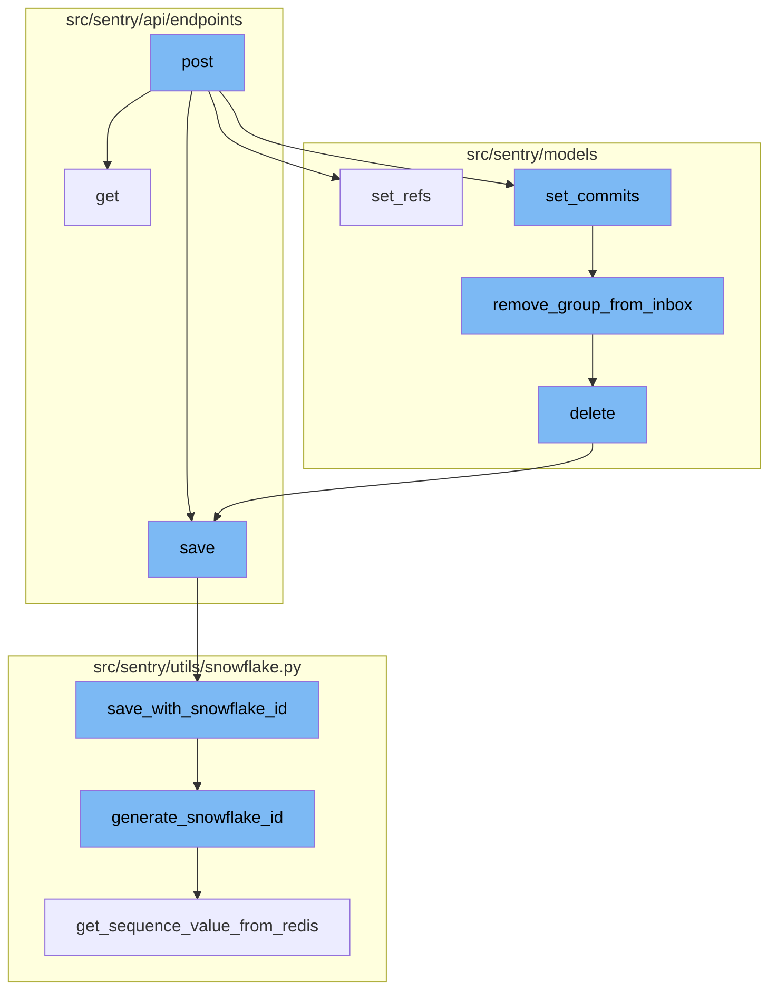
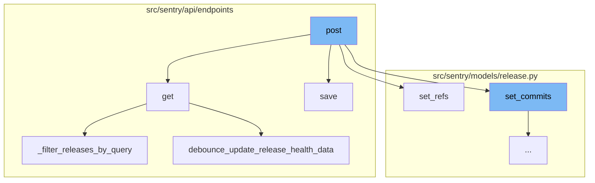
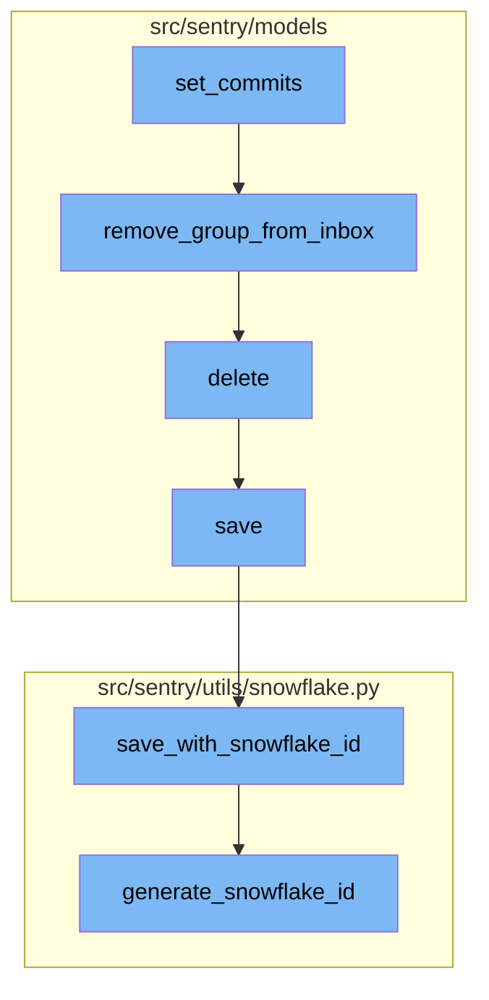

# Overview of the 'post' Functionality

The 'post' functionality in the Sentry application is a crucial part of the release management process. It is responsible for creating a new release for a given organization. The process begins by validating the data in the request. If the data is valid, it checks if the release already exists. If it doesn't, it creates a new release. If the release already exists and the status has changed, it updates the status of the release. The function also handles the addition of projects to the release and the creation of activities associated with the release. If the release data includes commits, it sets the commits for the release. If the release data includes refs, it sets the refs for the release. Finally, the function returns a response with the serialized release data.

# The 'get' Function

The 'get' function is another important part of the release management process. It is responsible for returning a list of releases for a given organization. The function first retrieves the filter parameters from the request. It then updates the release health data for the organization. The function then filters the queryset based on the status filter, environment, and query parameters from the request. It also sorts the queryset based on the sort parameter from the request. Finally, the function returns a paginated response with the serialized queryset.

# The 'save' Function

The 'save' function is used to save the changes made to an organization. It first retrieves the organization from the context. It then validates the data and updates the organization options, flags, and fields based on the validated data. If the data includes an avatar or avatar type, it saves the avatar for the organization. If the data requires 2FA or email verification, it handles the required 2FA or email verification. Finally, the function returns the organization and the changed data.

# The 'set_refs' Function

The 'set_refs' function is responsible for setting the refs for a release. It takes in refs, a user id, and a fetch flag as parameters. The function first retrieves the previous release. It then validates the repositories in the refs. The function then handles the commit ranges in the refs. For each ref, it creates or updates the head commit for the repo and the release. If the fetch flag is true, it fetches the commits.

# The 'delete' Function

The 'delete' function is used to delete a project. It removes the notification settings for the project and saves the project in the outbox before deleting it.

# The 'save_with_snowflake_id' Function

The 'save_with_snowflake_id' function is used to save an instance of a model with a snowflake ID. It generates a new snowflake ID for the instance if it doesn't have one and saves the instance.

# The 'generate_snowflake_id' Function

The 'generate_snowflake_id' function is used to generate a snowflake ID. It generates a unique ID based on the current time, region, and sequence value.



# Flow drill down

First, we'll zoom into this section of the flow:



<SwmSnippet path="/src/sentry/api/endpoints/organization_releases.py" line="417">

---

# Post Function

The `post` function is responsible for creating a new release for the given organization. It takes in a request and an organization as parameters. The function first validates the data in the request. If the data is valid, it checks if the release already exists. If it doesn't, it creates a new release. If the release already exists and the status has changed, it updates the status of the release. The function also handles the addition of projects to the release and the creation of activities associated with the release. If the release data includes commits, it sets the commits for the release. If the release data includes refs, it sets the refs for the release. Finally, the function returns a response with the serialized release data.

`````````````````````````````````````````python
    def post(self, request: Request, organization) -> Response:
        """
        Create a New Release for an Organization
        ````````````````````````````````````````
        Create a new release for the given Organization.  Releases are used by
        Sentry to improve its error reporting abilities by correlating
        first seen events with the release that might have introduced the
        problem.
        Releases are also necessary for sourcemaps and other debug features
        that require manual upload for functioning well.

        :pparam string organization_id_or_slug: the id or slug of the organization the
                                          release belongs to.
        :param string version: a version identifier for this release.  Can
                               be a version number, a commit hash etc.
        :param string ref: an optional commit reference.  This is useful if
                           a tagged version has been provided.
        :param url url: a URL that points to the release.  This can be the
                        path to an online interface to the sourcecode
                        for instance.
        :param array projects: a list of project slugs that are involved in
`````````````````````````````````````````

---

</SwmSnippet>

<SwmSnippet path="/src/sentry/api/endpoints/organization_releases.py" line="244">

---

# Get Function

The `get` function is responsible for returning a list of releases for a given organization. It takes in a request and an organization as parameters. The function first retrieves the filter parameters from the request. It then updates the release health data for the organization. The function then filters the queryset based on the status filter, environment, and query parameters from the request. It also sorts the queryset based on the sort parameter from the request. Finally, the function returns a paginated response with the serialized queryset.

````````````````````````````````python
    def get(self, request: Request, organization) -> Response:
        """
        List an Organization's Releases
        ```````````````````````````````
        Return a list of releases for a given organization.

        :pparam string organization_id_or_slug: the id or slug of the organization
        :qparam string query: this parameter can be used to create a
                              "starts with" filter for the version.
        """
        query = request.GET.get("query")
        with_health = request.GET.get("health") == "1"
        with_adoption_stages = request.GET.get("adoptionStages") == "1"
        status_filter = request.GET.get("status", "open")
        flatten = request.GET.get("flatten") == "1"
        sort = request.GET.get("sort") or "date"
        health_stat = request.GET.get("healthStat") or "sessions"
        summary_stats_period = request.GET.get("summaryStatsPeriod") or "14d"
        health_stats_period = request.GET.get("healthStatsPeriod") or ("24h" if with_health else "")
        if summary_stats_period not in STATS_PERIODS:
            raise ParseError(detail=get_stats_period_detail("summaryStatsPeriod", STATS_PERIODS))
````````````````````````````````

---

</SwmSnippet>

<SwmSnippet path="/src/sentry/api/endpoints/organization_details.py" line="449">

---

# Save Function

The `save` function is responsible for saving the changes made to an organization. It first retrieves the organization from the context. It then validates the data and updates the organization options, flags, and fields based on the validated data. If the data includes an avatar or avatar type, it saves the avatar for the organization. If the data requires 2FA or email verification, it handles the required 2FA or email verification. Finally, the function returns the organization and the changed data.

```python
    def save(self):
        from sentry import features

        org = self.context["organization"]
        changed_data = {}
        if not hasattr(org, "__data"):
            update_tracked_data(org)

        data = self.validated_data

        for key, option, type_, default_value in ORG_OPTIONS:
            if key not in data:
                continue
            try:
                option_inst = OrganizationOption.objects.get(organization=org, key=option)
                update_tracked_data(option_inst)
            except OrganizationOption.DoesNotExist:
                OrganizationOption.objects.set_value(
                    organization=org, key=option, value=type_(data[key])
                )

```

---

</SwmSnippet>

<SwmSnippet path="/src/sentry/models/release.py" line="593">

---

# Set Refs Function

The `set_refs` function is responsible for setting the refs for a release. It takes in refs, a user id, and a fetch flag as parameters. The function first retrieves the previous release. It then validates the repositories in the refs. The function then handles the commit ranges in the refs. For each ref, it creates or updates the head commit for the repo and the release. If the fetch flag is true, it fetches the commits.

```python
    def set_refs(self, refs, user_id, fetch=False):
        with sentry_sdk.start_span(op="set_refs"):
            from sentry.api.exceptions import InvalidRepository
            from sentry.models.commit import Commit
            from sentry.models.releaseheadcommit import ReleaseHeadCommit
            from sentry.models.repository import Repository
            from sentry.tasks.commits import fetch_commits

            # TODO: this does the wrong thing unless you are on the most
            # recent release.  Add a timestamp compare?
            prev_release = (
                type(self)
                .objects.filter(
                    organization_id=self.organization_id, projects__in=self.projects.all()
                )
                .extra(select={"sort": "COALESCE(date_released, date_added)"})
                .exclude(version=self.version)
                .order_by("-sort")
                .first()
            )

```

---

</SwmSnippet>

<SwmSnippet path="/src/sentry/api/endpoints/organization_releases.py" line="77">

---

# Filter Releases by Query Function

The `_filter_releases_by_query` function is responsible for filtering releases based on a query. It takes in a queryset, an organization, a query, and filter parameters as parameters. The function first parses the search query. It then filters the queryset based on the search filters from the parsed query.

```python
def _filter_releases_by_query(queryset, organization, query, filter_params):
    search_filters = parse_search_query(query)
    for search_filter in search_filters:
        if search_filter.key.name == RELEASE_FREE_TEXT_KEY:
            query_q = Q(version__icontains=query)
            suffix_match = _release_suffix.match(query)
            if suffix_match is not None:
                query_q |= Q(version__icontains="%s+%s" % suffix_match.groups())

            queryset = queryset.filter(query_q)

        if search_filter.key.name == RELEASE_ALIAS:
            query_q = Q()
            raw_value = search_filter.value.raw_value
            if search_filter.value.is_wildcard():
                if raw_value.endswith("*") and raw_value.startswith("*"):
                    query_q = Q(version__contains=raw_value[1:-1])
                elif raw_value.endswith("*"):
                    query_q = Q(version__startswith=raw_value[:-1])
                elif raw_value.startswith("*"):
                    query_q = Q(version__endswith=raw_value[1:])
```

---

</SwmSnippet>

<SwmSnippet path="/src/sentry/api/endpoints/organization_releases.py" line="150">

---

# Debounce Update Release Health Data Function

The `debounce_update_release_health_data` function is responsible for updating the release health data for an organization. It takes in an organization and a list of project ids as parameters. The function first checks which projects need to get updates from the cache. It then retrieves the projects from the cache. The function then retrieves the project releases that have changed. It then checks which project releases already have rows. For the project releases that do not have rows, it creates the rows. Finally, the function debounces the updates for a minute.

```python
def debounce_update_release_health_data(organization, project_ids: list[int]):
    """This causes a flush of snuba health data to the postgres tables once
    per minute for the given projects.
    """
    # Figure out which projects need to get updates from the snuba.
    should_update = {}
    cache_keys = ["debounce-health:%d" % id for id in project_ids]
    cache_data = cache.get_many(cache_keys)
    for project_id, cache_key in zip(project_ids, cache_keys):
        if cache_data.get(cache_key) is None:
            should_update[project_id] = cache_key

    if not should_update:
        return

    projects = {p.id: p for p in Project.objects.get_many_from_cache(should_update.keys())}

    # This gives us updates for all release-projects which have seen new
    # health data over the last days. It will miss releases where the last
    # date is longer than what `get_changed_project_release_model_adoptions`
    # considers recent.
```

---

</SwmSnippet>

Now, lets zoom into this section of the flow:



<SwmSnippet path="/src/sentry/models/release.py" line="648">

---

# set_commits Function

The `set_commits` function is responsible for binding a list of commits to a release. It sorts the commit list in reverse order and then clears any existing commit log and replaces it with the given commits. It also handles the creation of `Commit`, `CommitAuthor`, `ReleaseCommit`, and `ReleaseHeadCommit` objects, and updates the `GroupResolution` and `Group` objects accordingly.

```python
    def set_commits(self, commit_list):
        """
        Bind a list of commits to this release.

        This will clear any existing commit log and replace it with the given
        commits.
        """

        # Sort commit list in reverse order
        commit_list.sort(key=lambda commit: commit.get("timestamp", 0), reverse=True)

        # TODO(dcramer): this function could use some cleanup/refactoring as it's a bit unwieldy
        from sentry.models.commit import Commit
        from sentry.models.commitauthor import CommitAuthor
        from sentry.models.group import Group, GroupStatus
        from sentry.models.grouplink import GroupLink
        from sentry.models.groupresolution import GroupResolution
        from sentry.models.pullrequest import PullRequest
        from sentry.models.releasecommit import ReleaseCommit
        from sentry.models.releaseheadcommit import ReleaseHeadCommit
        from sentry.models.repository import Repository
```

---

</SwmSnippet>

<SwmSnippet path="/src/sentry/models/groupinbox.py" line="96">

---

# remove_group_from_inbox Function

The `remove_group_from_inbox` function is used to remove a group from the inbox. It deletes the `GroupInbox` object associated with the group and creates an `Activity` object if the action is `MARK_REVIEWED` and a user is provided.

```python
def remove_group_from_inbox(group, action=None, user=None, referrer=None):
    try:
        group_inbox = GroupInbox.objects.get(group=group)
        group_inbox.delete()

        if action is GroupInboxRemoveAction.MARK_REVIEWED and user is not None:
            Activity.objects.create(
                project_id=group_inbox.group.project_id,
                group_id=group_inbox.group_id,
                type=ActivityType.MARK_REVIEWED.value,
                user_id=user.id,
            )
            record_group_history(group, GroupHistoryStatus.REVIEWED, actor=user)
    except GroupInbox.DoesNotExist:
        pass
```

---

</SwmSnippet>

<SwmSnippet path="/src/sentry/models/project.py" line="722">

---

# delete Function

The `delete` function is used to delete a project. It removes the notification settings for the project and saves the project in the outbox before deleting it.

```python
    def delete(self, **kwargs):
        # There is no foreign key relationship so we have to manually cascade.
        notifications_service.remove_notification_settings_for_project(project_id=self.id)

        with outbox_context(transaction.atomic(router.db_for_write(Project))):
            Project.outbox_for_update(self.id, self.organization_id).save()
            return super().delete(**kwargs)
```

---

</SwmSnippet>

<SwmSnippet path="/src/sentry/models/project.py" line="365">

---

# save Function

The `save` function is used to save a project. It generates a slug for the project if it doesn't have one and saves the project with a snowflake ID if `SENTRY_USE_SNOWFLAKE` is true.

```python
    def save(self, *args, **kwargs):
        if not self.slug:
            lock = locks.get(
                f"slug:project:{self.organization_id}", duration=5, name="project_slug"
            )
            with TimedRetryPolicy(10)(lock.acquire):
                slugify_instance(
                    self,
                    self.name,
                    organization=self.organization,
                    reserved=RESERVED_PROJECT_SLUGS,
                    max_length=50,
                )

        if SENTRY_USE_SNOWFLAKE:
            snowflake_redis_key = "project_snowflake_key"
            save_with_snowflake_id(
                instance=self,
                snowflake_redis_key=snowflake_redis_key,
                save_callback=lambda: super(Project, self).save(*args, **kwargs),
            )
```

---

</SwmSnippet>

<SwmSnippet path="/src/sentry/utils/snowflake.py" line="47">

---

# save_with_snowflake_id Function

The `save_with_snowflake_id` function is used to save an instance of a model with a snowflake ID. It generates a new snowflake ID for the instance if it doesn't have one and saves the instance.

```python
def save_with_snowflake_id(
    instance: BaseModel, snowflake_redis_key: str, save_callback: Callable[[], object]
) -> None:
    assert uses_snowflake_id(
        instance.__class__
    ), "Only models decorated with uses_snowflake_id can be saved with save_with_snowflake_id()"

    for _ in range(settings.MAX_REDIS_SNOWFLAKE_RETRY_COUNTER):
        if not instance.id:
            instance.id = generate_snowflake_id(snowflake_redis_key)
        try:
            with enforce_constraints(transaction.atomic(using=router.db_for_write(type(instance)))):
                save_callback()
            return
        except IntegrityError:
            instance.id = None  # type: ignore[assignment]  # see typeddjango/django-stubs#2014
    raise MaxSnowflakeRetryError
```

---

</SwmSnippet>

<SwmSnippet path="/src/sentry/utils/snowflake.py" line="113">

---

# generate_snowflake_id Function

The `generate_snowflake_id` function is used to generate a snowflake ID. It generates a unique ID based on the current time, region, and sequence value.

```python
def generate_snowflake_id(redis_key: str) -> int:
    segment_values = {}

    segment_values[VERSION_ID] = msb_0_ordering(settings.SNOWFLAKE_VERSION_ID, VERSION_ID.length)

    try:
        segment_values[REGION_ID] = get_local_region().snowflake_id
    except RegionContextError:  # expected if running in monolith mode
        segment_values[REGION_ID] = NULL_REGION_ID

    current_time = datetime.now().timestamp()
    # supports up to 130 years
    segment_values[TIME_DIFFERENCE] = int(current_time - settings.SENTRY_SNOWFLAKE_EPOCH_START)

    snowflake_id = 0
    (
        segment_values[TIME_DIFFERENCE],
        segment_values[REGION_SEQUENCE],
    ) = get_sequence_value_from_redis(redis_key, segment_values[TIME_DIFFERENCE])

    for segment in BIT_SEGMENT_SCHEMA:
```

---

</SwmSnippet>

&nbsp;

*This is an auto-generated document by Swimm AI 🌊 and has not yet been verified by a human*

<SwmMeta version="3.0.0" repo-id="Z2l0aHViJTNBJTNBc2VudHJ5LWRlbW8lM0ElM0FTd2ltbS1EZW1v" repo-name="sentry-demo" doc-type="flows"><sup>Powered by [Swimm](/)</sup></SwmMeta>
