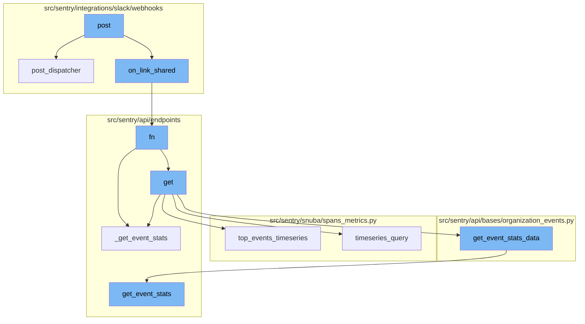
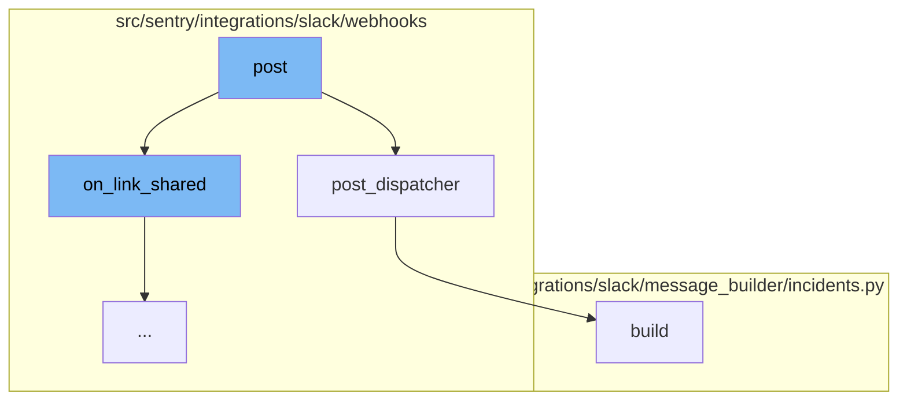
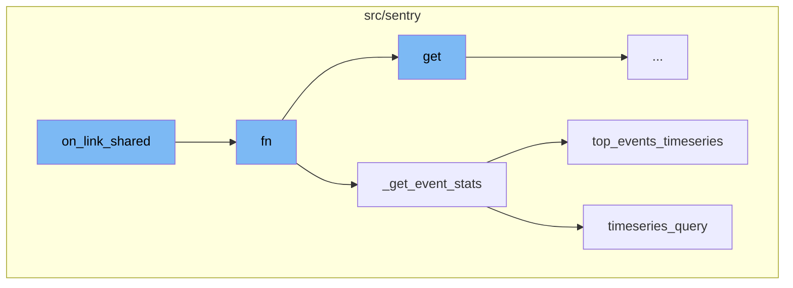
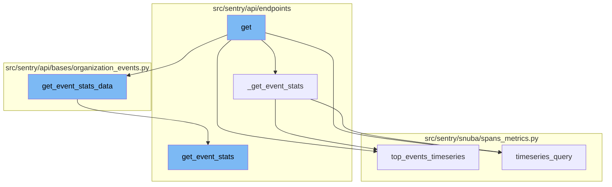

# Overview of 'post' Functionality

The 'post' functionality in the sentry-demo repository is a crucial part of the event handling process. It is primarily used to handle incoming requests and route them to the appropriate handlers based on the type of the request.

<SwmSnippet path="/src/sentry/integrations/slack/webhooks/event.py" line="263">

---

# 'post' Function

The `post` function is the entry point for handling requests. It validates the incoming request and routes it to the appropriate handler based on the type of the request. For example, if the request type is 'link_shared', it calls the `on_link_shared` function.

```python
    def post(self, request: Request) -> Response:
        try:
            slack_request = self.slack_request_class(request)
            slack_request.validate()
        except SlackRequestError as e:
            return self.respond(status=e.status)

        if slack_request.is_challenge():
            return self.on_url_verification(request, slack_request.data)
        if slack_request.type == "link_shared":
            if self.on_link_shared(request, slack_request):
                return self.respond()

        if slack_request.type == "message":
            if slack_request.is_bot():
                return self.respond()

            command, _ = slack_request.get_command_and_args()

            if command in COMMANDS:
                resp = super().post_dispatcher(slack_request)
```

---

</SwmSnippet>

<SwmSnippet path="/src/sentry/integrations/slack/webhooks/base.py" line="42">

---

# 'post_dispatcher' Function

The `post_dispatcher` function is responsible for handling Slack commands. It extracts the command and arguments from the request and dispatches them to the appropriate handler. If the command is not recognized, it responds with help text.

```python
    def post_dispatcher(self, request: SlackDMRequest) -> Response:
        """
        All Slack commands are handled by this endpoint. This block just
        validates the request and dispatches it to the right handler.
        """
        command, args = request.get_command_and_args()

        if command in ["help", "", "support", "docs"]:
            return self.respond(SlackHelpMessageBuilder(command=command).build())

        if command == "link":
            if not args:
                return self.link_user(request)

            if args[0] == "team":
                return self.link_team(request)

        if command == "unlink":
            if not args:
                return self.unlink_user(request)

```

---

</SwmSnippet>

<SwmSnippet path="/src/sentry/integrations/slack/message_builder/incidents.py" line="48">

---

# 'build' Function

The `build` function is used to construct the body of a Slack message. It uses information about an incident, such as its status and metric value, to create a formatted message with blocks of text and images.

```python
    def build(self) -> SlackBody:
        data = incident_attachment_info(
            self.incident,
            self.new_status,
            self.metric_value,
            self.notification_uuid,
            referrer="metric_alert_slack",
        )
        blocks = [
            self.get_markdown_block(text=f"{data['text']}\n{get_started_at(data['ts'])}"),
        ]
        alert_rule = self.action.alert_rule_trigger.alert_rule

        if (
            alert_rule.description
            and features.has(
                "organizations:slack-metric-alert-description", self.incident.organization
            )
            and not self.new_status == IncidentStatus.CLOSED
        ):
            description = self.get_markdown_block(text=f"*Notes*: {alert_rule.description}")
```

---

</SwmSnippet>

<SwmSnippet path="/src/sentry/integrations/slack/webhooks/event.py" line="152">

---

# 'on_link_shared' Function

The `on_link_shared` function is the starting point of the post flow. It handles the event when a link is shared in Slack. It parses the shared link and determines its type. If the link is of type `DISCOVER`, it triggers an analytics record and prompts the user with the shared link.

```python
    def on_link_shared(self, request: Request, slack_request: SlackDMRequest) -> bool:
        """Returns true on success"""
        matches: MutableMapping[LinkType, list[UnfurlableUrl]] = defaultdict(list)
        links_seen = set()

        data = slack_request.data.get("event", {})

        logger_params = {
            "integration_id": slack_request.integration.id,
            "team_id": slack_request.team_id,
            "channel_id": slack_request.channel_id,
            "user_id": slack_request.user_id,
            "channel": slack_request.channel_id,
            **data,
        }

        # An unfurl may have multiple links to unfurl
        for item in data.get("links", []):
            try:
                url = item["url"]
            except Exception:
```

---

</SwmSnippet>

<SwmSnippet path="/src/sentry/api/endpoints/organization_events_stats.py" line="316">

---

# 'fn' Function

The `fn` function is the next step in the post flow. It is responsible for fetching event statistics. It checks if the metrics are enhanced and if a dashboard widget ID is provided. If not, it calls the `_get_event_stats` function. If yes, it fetches the widget and checks if it has a split. Depending on the split type, it modifies the query and dataset and calls the `_get_event_stats` function.

```python
            def fn(
                query_columns: Sequence[str],
                query: str,
                params: dict[str, str],
                rollup: int,
                zerofill_results: bool,
                comparison_delta: datetime | None,
            ) -> SnubaTSResult | dict[str, SnubaTSResult]:

                if not (metrics_enhanced and dashboard_widget_id):
                    return _get_event_stats(
                        scoped_dataset,
                        query_columns,
                        query,
                        params,
                        rollup,
                        zerofill_results,
                        comparison_delta,
                    )

                try:
```

---

</SwmSnippet>

<SwmSnippet path="/src/sentry/api/endpoints/organization_events_stats.py" line="254">

---

# '\_get_event_stats' Function

The `_get_event_stats` function is called by the `fn` function. It checks if there are top events. If yes, it calls the `top_events_timeseries` function. If no, it calls the `timeseries_query` function.

```python
        def _get_event_stats(
            scoped_dataset: Any,
            query_columns: Sequence[str],
            query: str,
            params: dict[str, str],
            rollup: int,
            zerofill_results: bool,
            comparison_delta: datetime | None,
        ) -> SnubaTSResult | dict[str, SnubaTSResult]:
            if top_events > 0:
                return scoped_dataset.top_events_timeseries(
                    timeseries_columns=query_columns,
                    selected_columns=self.get_field_list(organization, request),
                    equations=self.get_equation_list(organization, request),
                    user_query=query,
                    params=params,
                    orderby=self.get_orderby(request),
                    rollup=rollup,
                    limit=top_events,
                    organization=organization,
                    referrer=referrer + ".find-topn",
```

---

</SwmSnippet>

<SwmSnippet path="/src/sentry/snuba/spans_metrics.py" line="138">

---

# 'top_events_timeseries' Function

The `top_events_timeseries` function is called by the `_get_event_stats` function when there are top events. It fetches the top events if not provided and then runs a query for each top event to fetch its timeseries data.

```python
def top_events_timeseries(
    timeseries_columns,
    selected_columns,
    user_query,
    params,
    orderby,
    rollup,
    limit,
    organization,
    equations=None,
    referrer=None,
    top_events=None,
    allow_empty=True,
    zerofill_results=True,
    include_other=False,
    functions_acl=None,
    on_demand_metrics_enabled=False,
    on_demand_metrics_type: MetricSpecType | None = None,
):
    """
    High-level API for doing arbitrary user timeseries queries for a limited number of top events
```

---

</SwmSnippet>

<SwmSnippet path="/src/sentry/snuba/spans_metrics.py" line="76">

---

# 'timeseries_query' Function

The `timeseries_query` function is called by the `_get_event_stats` function when there are no top events. It runs a timeseries query against events.

```python
def timeseries_query(
    selected_columns: Sequence[str],
    query: str,
    params: dict[str, str],
    rollup: int,
    referrer: str,
    zerofill_results: bool = True,
    allow_metric_aggregates=True,
    comparison_delta: timedelta | None = None,
    functions_acl: list[str] | None = None,
    has_metrics: bool = True,
    use_metrics_layer: bool = False,
    on_demand_metrics_enabled: bool = False,
    on_demand_metrics_type: MetricSpecType | None = None,
    groupby: Column | None = None,
) -> SnubaTSResult:
    """
    High-level API for doing arbitrary user timeseries queries against events.
    this API should match that of sentry.snuba.discover.timeseries_query
    """
    metrics_query = TimeseriesSpansMetricsQueryBuilder(
```

---

</SwmSnippet>

<SwmSnippet path="/src/sentry/api/endpoints/organization_events_stats.py" line="167">

---

# 'get' Function

The flow starts with the `post` function which triggers the `on_link_shared` function. This function then calls the `fn` function which is responsible for getting the event stats data by calling the `get` function. The `get` function is defined in the `organization_events_stats.py` file and it is responsible for getting the event stats data by calling the `get_event_stats_data` function.

```python
    def get(self, request: Request, organization: Organization) -> Response:
        with sentry_sdk.start_span(op="discover.endpoint", description="filter_params") as span:
            span.set_data("organization", organization)

            top_events = 0

            if "topEvents" in request.GET:
                try:
                    top_events = int(request.GET.get("topEvents", 0))
                except ValueError:
                    return Response({"detail": "topEvents must be an integer"}, status=400)
                if top_events > MAX_TOP_EVENTS:
                    return Response(
                        {"detail": f"Can only get up to {MAX_TOP_EVENTS} top events"},
                        status=400,
                    )
                elif top_events <= 0:
                    return Response({"detail": "If topEvents needs to be at least 1"}, status=400)

            comparison_delta = None
            if "comparisonDelta" in request.GET:
```

---

</SwmSnippet>

<SwmSnippet path="/src/sentry/api/bases/organization_events.py" line="421">

---

# 'get_event_stats_data' Function

The `get_event_stats_data` function is responsible for getting the event stats data. It takes in several parameters including the request, organization, and a callable `get_event_stats` function. This function is responsible for executing the event stats query and returning the results.

```python
    def get_event_stats_data(
        self,
        request: Request,
        organization: Organization,
        get_event_stats: Callable[
            [Sequence[str], str, dict[str, str], int, bool, timedelta | None], SnubaTSResult
        ],
        top_events: int = 0,
        query_column: str = "count()",
        params: ParamsType | None = None,
        query: str | None = None,
        allow_partial_buckets: bool = False,
        zerofill_results: bool = True,
        comparison_delta: timedelta | None = None,
        additional_query_column: str | None = None,
        dataset: Any | None = None,
    ) -> dict[str, Any]:
        with handle_query_errors():
            with sentry_sdk.start_span(
                op="discover.endpoint", description="base.stats_query_creation"
            ):
```

---

</SwmSnippet>

<SwmSnippet path="/src/sentry/api/endpoints/organization_profiling_functions.py" line="115">

---

# 'get_event_stats' Function

The `get_event_stats` function is responsible for getting the event stats. It does this by creating a `ProfileTopFunctionsTimeseriesQueryBuilder` for each chunk of top functions and running a query for each builder. The results are then formatted and returned.

```python
        def get_event_stats(_columns, query, params, _rollup, zerofill_results, _comparison_delta):
            rollup = get_rollup_from_range(params["end"] - params["start"])

            chunks = [
                top_functions["data"][i : i + FUNCTIONS_PER_QUERY]
                for i in range(0, len(top_functions["data"]), FUNCTIONS_PER_QUERY)
            ]

            builders = [
                ProfileTopFunctionsTimeseriesQueryBuilder(
                    dataset=Dataset.Functions,
                    params=params,
                    interval=rollup,
                    top_events=chunk,
                    other=False,
                    query=query,
                    selected_columns=["project.id", "fingerprint"],
                    # It's possible to override the columns via
                    # the `yAxis` qs. So we explicitly ignore the
                    # columns, and hard code in the columns we want.
                    timeseries_columns=[data["function"], "examples()"],
```

---

</SwmSnippet>

<SwmSnippet path="/src/sentry/snuba/spans_metrics.py" line="76">

---

# 'timeseries_query' Function

The `timeseries_query` function is a high-level API for doing arbitrary user timeseries queries against events. It creates a `TimeseriesSpansMetricsQueryBuilder`, runs the query, processes the results, and returns a `SnubaTSResult`.

```python
def timeseries_query(
    selected_columns: Sequence[str],
    query: str,
    params: dict[str, str],
    rollup: int,
    referrer: str,
    zerofill_results: bool = True,
    allow_metric_aggregates=True,
    comparison_delta: timedelta | None = None,
    functions_acl: list[str] | None = None,
    has_metrics: bool = True,
    use_metrics_layer: bool = False,
    on_demand_metrics_enabled: bool = False,
    on_demand_metrics_type: MetricSpecType | None = None,
    groupby: Column | None = None,
) -> SnubaTSResult:
    """
    High-level API for doing arbitrary user timeseries queries against events.
    this API should match that of sentry.snuba.discover.timeseries_query
    """
    metrics_query = TimeseriesSpansMetricsQueryBuilder(
```

---

</SwmSnippet>

<SwmSnippet path="/src/sentry/snuba/spans_metrics.py" line="138">

---

# 'top_events_timeseries' Function

The `top_events_timeseries` function is a high-level API for doing arbitrary user timeseries queries for a limited number of top events. It creates a `TopSpansMetricsQueryBuilder`, runs the query, processes the results, and returns a dictionary of `SnubaTSResult` objects.

```python
def top_events_timeseries(
    timeseries_columns,
    selected_columns,
    user_query,
    params,
    orderby,
    rollup,
    limit,
    organization,
    equations=None,
    referrer=None,
    top_events=None,
    allow_empty=True,
    zerofill_results=True,
    include_other=False,
    functions_acl=None,
    on_demand_metrics_enabled=False,
    on_demand_metrics_type: MetricSpecType | None = None,
):
    """
    High-level API for doing arbitrary user timeseries queries for a limited number of top events
```

---

</SwmSnippet>



# Flow drill down

First, we'll zoom into this section of the flow:



<SwmSnippet path="/src/sentry/integrations/slack/webhooks/event.py" line="263">

---

# Post Function

The `post` function is the entry point for handling requests. It validates the incoming request and routes it to the appropriate handler based on the type of the request. For example, if the request type is 'link_shared', it calls the `on_link_shared` function.

```python
    def post(self, request: Request) -> Response:
        try:
            slack_request = self.slack_request_class(request)
            slack_request.validate()
        except SlackRequestError as e:
            return self.respond(status=e.status)

        if slack_request.is_challenge():
            return self.on_url_verification(request, slack_request.data)
        if slack_request.type == "link_shared":
            if self.on_link_shared(request, slack_request):
                return self.respond()

        if slack_request.type == "message":
            if slack_request.is_bot():
                return self.respond()

            command, _ = slack_request.get_command_and_args()

            if command in COMMANDS:
                resp = super().post_dispatcher(slack_request)
```

---

</SwmSnippet>

<SwmSnippet path="/src/sentry/integrations/slack/webhooks/base.py" line="42">

---

# Post Dispatcher Function

The `post_dispatcher` function is responsible for handling Slack commands. It extracts the command and arguments from the request and dispatches them to the appropriate handler. If the command is not recognized, it responds with help text.

```python
    def post_dispatcher(self, request: SlackDMRequest) -> Response:
        """
        All Slack commands are handled by this endpoint. This block just
        validates the request and dispatches it to the right handler.
        """
        command, args = request.get_command_and_args()

        if command in ["help", "", "support", "docs"]:
            return self.respond(SlackHelpMessageBuilder(command=command).build())

        if command == "link":
            if not args:
                return self.link_user(request)

            if args[0] == "team":
                return self.link_team(request)

        if command == "unlink":
            if not args:
                return self.unlink_user(request)

```

---

</SwmSnippet>

<SwmSnippet path="/src/sentry/integrations/slack/message_builder/incidents.py" line="48">

---

# Build Function

The `build` function is used to construct the body of a Slack message. It uses information about an incident, such as its status and metric value, to create a formatted message with blocks of text and images.

```python
    def build(self) -> SlackBody:
        data = incident_attachment_info(
            self.incident,
            self.new_status,
            self.metric_value,
            self.notification_uuid,
            referrer="metric_alert_slack",
        )
        blocks = [
            self.get_markdown_block(text=f"{data['text']}\n{get_started_at(data['ts'])}"),
        ]
        alert_rule = self.action.alert_rule_trigger.alert_rule

        if (
            alert_rule.description
            and features.has(
                "organizations:slack-metric-alert-description", self.incident.organization
            )
            and not self.new_status == IncidentStatus.CLOSED
        ):
            description = self.get_markdown_block(text=f"*Notes*: {alert_rule.description}")
```

---

</SwmSnippet>

Now, lets zoom into this section of the flow:



<SwmSnippet path="/src/sentry/integrations/slack/webhooks/event.py" line="152">

---

# Post Flow

The `on_link_shared` function is the starting point of the post flow. It handles the event when a link is shared in Slack. It parses the shared link and determines its type. If the link is of type `DISCOVER`, it triggers an analytics record and prompts the user with the shared link.

```python
    def on_link_shared(self, request: Request, slack_request: SlackDMRequest) -> bool:
        """Returns true on success"""
        matches: MutableMapping[LinkType, list[UnfurlableUrl]] = defaultdict(list)
        links_seen = set()

        data = slack_request.data.get("event", {})

        logger_params = {
            "integration_id": slack_request.integration.id,
            "team_id": slack_request.team_id,
            "channel_id": slack_request.channel_id,
            "user_id": slack_request.user_id,
            "channel": slack_request.channel_id,
            **data,
        }

        # An unfurl may have multiple links to unfurl
        for item in data.get("links", []):
            try:
                url = item["url"]
            except Exception:
```

---

</SwmSnippet>

<SwmSnippet path="/src/sentry/api/endpoints/organization_events_stats.py" line="316">

---

The `fn` function is the next step in the post flow. It is responsible for fetching event statistics. It checks if the metrics are enhanced and if a dashboard widget ID is provided. If not, it calls the `_get_event_stats` function. If yes, it fetches the widget and checks if it has a split. Depending on the split type, it modifies the query and dataset and calls the `_get_event_stats` function.

```python
            def fn(
                query_columns: Sequence[str],
                query: str,
                params: dict[str, str],
                rollup: int,
                zerofill_results: bool,
                comparison_delta: datetime | None,
            ) -> SnubaTSResult | dict[str, SnubaTSResult]:

                if not (metrics_enhanced and dashboard_widget_id):
                    return _get_event_stats(
                        scoped_dataset,
                        query_columns,
                        query,
                        params,
                        rollup,
                        zerofill_results,
                        comparison_delta,
                    )

                try:
```

---

</SwmSnippet>

<SwmSnippet path="/src/sentry/api/endpoints/organization_events_stats.py" line="254">

---

The `_get_event_stats` function is called by the `fn` function. It checks if there are top events. If yes, it calls the `top_events_timeseries` function. If no, it calls the `timeseries_query` function.

```python
        def _get_event_stats(
            scoped_dataset: Any,
            query_columns: Sequence[str],
            query: str,
            params: dict[str, str],
            rollup: int,
            zerofill_results: bool,
            comparison_delta: datetime | None,
        ) -> SnubaTSResult | dict[str, SnubaTSResult]:
            if top_events > 0:
                return scoped_dataset.top_events_timeseries(
                    timeseries_columns=query_columns,
                    selected_columns=self.get_field_list(organization, request),
                    equations=self.get_equation_list(organization, request),
                    user_query=query,
                    params=params,
                    orderby=self.get_orderby(request),
                    rollup=rollup,
                    limit=top_events,
                    organization=organization,
                    referrer=referrer + ".find-topn",
```

---

</SwmSnippet>

<SwmSnippet path="/src/sentry/snuba/spans_metrics.py" line="138">

---

The `top_events_timeseries` function is called by the `_get_event_stats` function when there are top events. It fetches the top events if not provided and then runs a query for each top event to fetch its timeseries data.

```python
def top_events_timeseries(
    timeseries_columns,
    selected_columns,
    user_query,
    params,
    orderby,
    rollup,
    limit,
    organization,
    equations=None,
    referrer=None,
    top_events=None,
    allow_empty=True,
    zerofill_results=True,
    include_other=False,
    functions_acl=None,
    on_demand_metrics_enabled=False,
    on_demand_metrics_type: MetricSpecType | None = None,
):
    """
    High-level API for doing arbitrary user timeseries queries for a limited number of top events
```

---

</SwmSnippet>

<SwmSnippet path="/src/sentry/snuba/spans_metrics.py" line="76">

---

The `timeseries_query` function is called by the `_get_event_stats` function when there are no top events. It runs a timeseries query against events.

```python
def timeseries_query(
    selected_columns: Sequence[str],
    query: str,
    params: dict[str, str],
    rollup: int,
    referrer: str,
    zerofill_results: bool = True,
    allow_metric_aggregates=True,
    comparison_delta: timedelta | None = None,
    functions_acl: list[str] | None = None,
    has_metrics: bool = True,
    use_metrics_layer: bool = False,
    on_demand_metrics_enabled: bool = False,
    on_demand_metrics_type: MetricSpecType | None = None,
    groupby: Column | None = None,
) -> SnubaTSResult:
    """
    High-level API for doing arbitrary user timeseries queries against events.
    this API should match that of sentry.snuba.discover.timeseries_query
    """
    metrics_query = TimeseriesSpansMetricsQueryBuilder(
```

---

</SwmSnippet>

Now, lets zoom into this section of the flow:



<SwmSnippet path="/src/sentry/api/endpoints/organization_events_stats.py" line="167">

---

# Post Flow

The flow starts with the `post` function which triggers the `on_link_shared` function. This function then calls the `fn` function which is responsible for getting the event stats data by calling the `get` function. The `get` function is defined in the `organization_events_stats.py` file and it is responsible for getting the event stats data by calling the `get_event_stats_data` function.

```python
    def get(self, request: Request, organization: Organization) -> Response:
        with sentry_sdk.start_span(op="discover.endpoint", description="filter_params") as span:
            span.set_data("organization", organization)

            top_events = 0

            if "topEvents" in request.GET:
                try:
                    top_events = int(request.GET.get("topEvents", 0))
                except ValueError:
                    return Response({"detail": "topEvents must be an integer"}, status=400)
                if top_events > MAX_TOP_EVENTS:
                    return Response(
                        {"detail": f"Can only get up to {MAX_TOP_EVENTS} top events"},
                        status=400,
                    )
                elif top_events <= 0:
                    return Response({"detail": "If topEvents needs to be at least 1"}, status=400)

            comparison_delta = None
            if "comparisonDelta" in request.GET:
```

---

</SwmSnippet>

<SwmSnippet path="/src/sentry/api/bases/organization_events.py" line="421">

---

# Get Event Stats Data

The `get_event_stats_data` function is responsible for getting the event stats data. It takes in several parameters including the request, organization, and a callable `get_event_stats` function. This function is responsible for executing the event stats query and returning the results.

```python
    def get_event_stats_data(
        self,
        request: Request,
        organization: Organization,
        get_event_stats: Callable[
            [Sequence[str], str, dict[str, str], int, bool, timedelta | None], SnubaTSResult
        ],
        top_events: int = 0,
        query_column: str = "count()",
        params: ParamsType | None = None,
        query: str | None = None,
        allow_partial_buckets: bool = False,
        zerofill_results: bool = True,
        comparison_delta: timedelta | None = None,
        additional_query_column: str | None = None,
        dataset: Any | None = None,
    ) -> dict[str, Any]:
        with handle_query_errors():
            with sentry_sdk.start_span(
                op="discover.endpoint", description="base.stats_query_creation"
            ):
```

---

</SwmSnippet>

<SwmSnippet path="/src/sentry/api/endpoints/organization_profiling_functions.py" line="115">

---

# Get Event Stats

The `get_event_stats` function is responsible for getting the event stats. It does this by creating a `ProfileTopFunctionsTimeseriesQueryBuilder` for each chunk of top functions and running a query for each builder. The results are then formatted and returned.

```python
        def get_event_stats(_columns, query, params, _rollup, zerofill_results, _comparison_delta):
            rollup = get_rollup_from_range(params["end"] - params["start"])

            chunks = [
                top_functions["data"][i : i + FUNCTIONS_PER_QUERY]
                for i in range(0, len(top_functions["data"]), FUNCTIONS_PER_QUERY)
            ]

            builders = [
                ProfileTopFunctionsTimeseriesQueryBuilder(
                    dataset=Dataset.Functions,
                    params=params,
                    interval=rollup,
                    top_events=chunk,
                    other=False,
                    query=query,
                    selected_columns=["project.id", "fingerprint"],
                    # It's possible to override the columns via
                    # the `yAxis` qs. So we explicitly ignore the
                    # columns, and hard code in the columns we want.
                    timeseries_columns=[data["function"], "examples()"],
```

---

</SwmSnippet>

<SwmSnippet path="/src/sentry/snuba/spans_metrics.py" line="76">

---

# Timeseries Query

The `timeseries_query` function is a high-level API for doing arbitrary user timeseries queries against events. It creates a `TimeseriesSpansMetricsQueryBuilder`, runs the query, processes the results, and returns a `SnubaTSResult`.

```python
def timeseries_query(
    selected_columns: Sequence[str],
    query: str,
    params: dict[str, str],
    rollup: int,
    referrer: str,
    zerofill_results: bool = True,
    allow_metric_aggregates=True,
    comparison_delta: timedelta | None = None,
    functions_acl: list[str] | None = None,
    has_metrics: bool = True,
    use_metrics_layer: bool = False,
    on_demand_metrics_enabled: bool = False,
    on_demand_metrics_type: MetricSpecType | None = None,
    groupby: Column | None = None,
) -> SnubaTSResult:
    """
    High-level API for doing arbitrary user timeseries queries against events.
    this API should match that of sentry.snuba.discover.timeseries_query
    """
    metrics_query = TimeseriesSpansMetricsQueryBuilder(
```

---

</SwmSnippet>

<SwmSnippet path="/src/sentry/snuba/spans_metrics.py" line="138">

---

# Top Events Timeseries

The `top_events_timeseries` function is a high-level API for doing arbitrary user timeseries queries for a limited number of top events. It creates a `TopSpansMetricsQueryBuilder`, runs the query, processes the results, and returns a dictionary of `SnubaTSResult` objects.

```python
def top_events_timeseries(
    timeseries_columns,
    selected_columns,
    user_query,
    params,
    orderby,
    rollup,
    limit,
    organization,
    equations=None,
    referrer=None,
    top_events=None,
    allow_empty=True,
    zerofill_results=True,
    include_other=False,
    functions_acl=None,
    on_demand_metrics_enabled=False,
    on_demand_metrics_type: MetricSpecType | None = None,
):
    """
    High-level API for doing arbitrary user timeseries queries for a limited number of top events
```

---

</SwmSnippet>

&nbsp;

*This is an auto-generated document by Swimm AI 🌊 and has not yet been verified by a human*

<SwmMeta version="3.0.0" repo-id="Z2l0aHViJTNBJTNBc2VudHJ5LWRlbW8lM0ElM0FTd2ltbS1EZW1v" repo-name="sentry-demo" doc-type="flows"><sup>Powered by [Swimm](/)</sup></SwmMeta>
