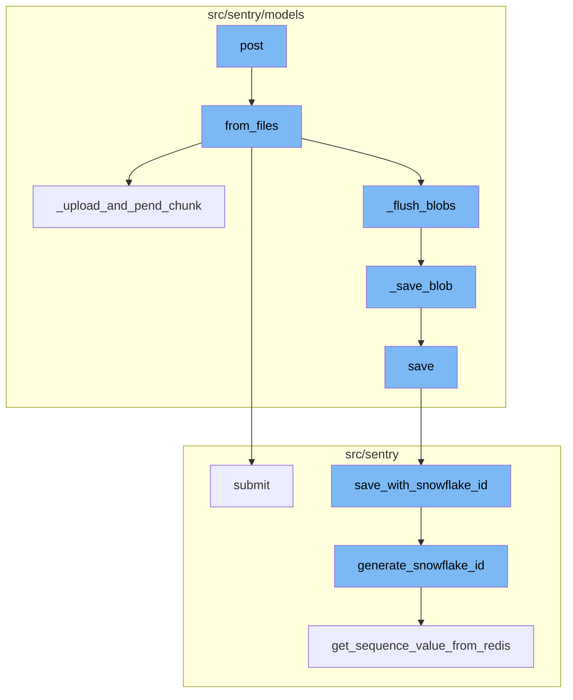
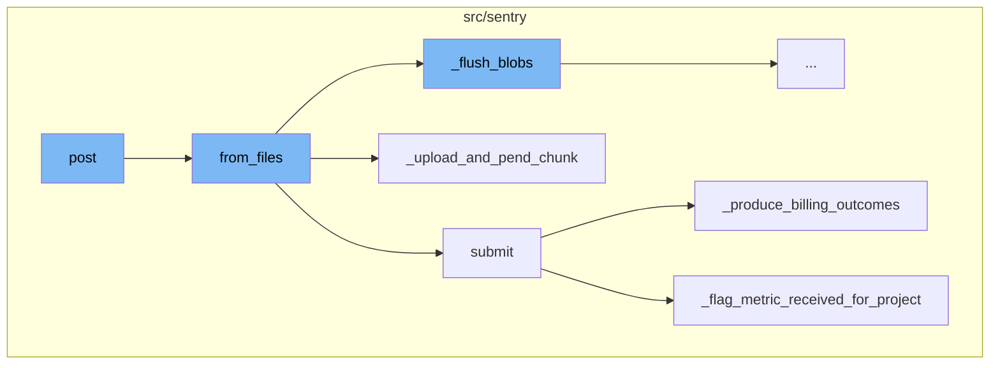
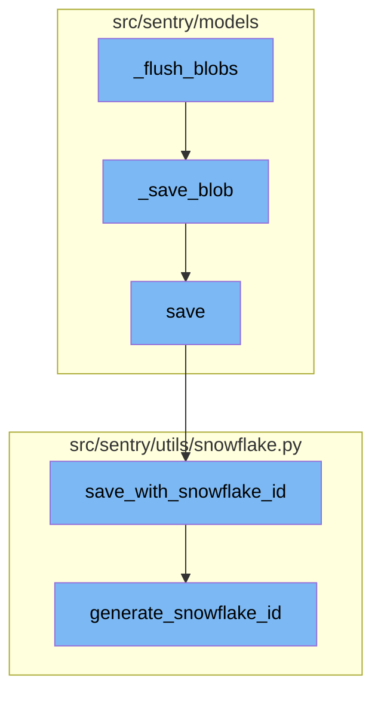

# Overview

The term 'post' in the sentry-demo repository refers to a process of handling and processing data. This process involves several steps, including uploading chunks of data, processing uploaded files, and saving the processed data.

<SwmSnippet path="/src/sentry/api/endpoints/chunk.py" line="121">

---

# Post Function

The `post` function is the entry point for the flow. It handles the upload of chunks and stores them as FileBlobs. It validates the file size and the number of chunks. If the validation passes, it calls the `from_files` function.

``````````````````````````````````````````python
    def post(self, request: Request, organization) -> Response:
        """
        Upload chunks and store them as FileBlobs
        `````````````````````````````````````````
        :pparam file file: The filename should be sha1 hash of the content.
                            Also not you can add up to MAX_CHUNKS_PER_REQUEST files
                            in this request.

        :auth: required
        """
        # Create a unique instance so our logger can be decoupled from the request
        # and used in threads.
        logger = logging.getLogger("sentry.files")
        logger.info("chunkupload.start")

        files = []
        if request.data:
            files = request.data.getlist("file")
            files += [GzipChunk(chunk) for chunk in request.data.getlist("file_gzip")]

        if len(files) == 0:
``````````````````````````````````````````

---

</SwmSnippet>

<SwmSnippet path="/src/sentry/models/files/abstractfileblob.py" line="51">

---

# From Files Function

The `from_files` function is called by the `post` function. It handles the processing of the uploaded files. It calls the `_upload_and_pend_chunk` function to upload and pend each chunk, and the `_flush_blobs` function to save the blobs.

```python
    def from_files(cls, files, organization=None, logger=nooplogger):
        """A faster version of `from_file` for multiple files at the time.
        If an organization is provided it will also create `FileBlobOwner`
        entries.  Files can be a list of files or tuples of file and checksum.
        If both are provided then a checksum check is performed.

        If the checksums mismatch an `IOError` is raised.
        """
        logger.debug("FileBlob.from_files.start")

        files_with_checksums = []
        for fileobj in files:
            if isinstance(fileobj, tuple):
                files_with_checksums.append(fileobj)
            else:
                files_with_checksums.append((fileobj, None))

        checksums_seen = set()
        blobs_to_save = []
        semaphore = Semaphore(value=MULTI_BLOB_UPLOAD_CONCURRENCY)

```

---

</SwmSnippet>

<SwmSnippet path="/src/sentry/ingest/billing_metrics_consumer.py" line="77">

---

# Submit Function

The `submit` function is part of the billing metrics consumer. It processes the payload and calls the `_produce_billing_outcomes` and `_flag_metric_received_for_project` functions.

```python
    def submit(self, message: Message[KafkaPayload]) -> None:
        assert not self.__closed

        payload = self._get_payload(message)

        self._produce_billing_outcomes(payload)
        self._flag_metric_received_for_project(payload)

        self.__next_step.submit(message)
```

---

</SwmSnippet>

<SwmSnippet path="/src/sentry/models/files/abstractfileblob.py" line="72">

---

# \_upload_and_pend_chunk Function

The `_upload_and_pend_chunk` function is called by the `from_files` function. It uploads a chunk and adds it to the blobs to save.

```python
        def _upload_and_pend_chunk(fileobj, size, checksum):
            logger.debug(
                "FileBlob.from_files._upload_and_pend_chunk.start",
                extra={"checksum": checksum, "size": size},
            )
            blob = cls(size=size, checksum=checksum)
            blob.path = cls.generate_unique_path()
            storage = get_storage(cls._storage_config())
            storage.save(blob.path, fileobj)
            blobs_to_save.append(blob)
            metrics.distribution(
                "filestore.blob-size", size, tags={"function": "from_files"}, unit="byte"
            )
            logger.debug(
                "FileBlob.from_files._upload_and_pend_chunk.end",
                extra={"checksum": checksum, "path": blob.path},
            )
```

---

</SwmSnippet>

<SwmSnippet path="/src/sentry/ingest/billing_metrics_consumer.py" line="124">

---

# \_produce_billing_outcomes Function

The `_produce_billing_outcomes` function is called by the `submit` function. It produces billing outcomes based on the processed items.

```python
    def _produce_billing_outcomes(self, generic_metric: GenericMetric) -> None:
        for category, quantity in self._count_processed_items(generic_metric).items():
            self._produce_billing_outcome(
                org_id=generic_metric["org_id"],
                project_id=generic_metric["project_id"],
                category=category,
                quantity=quantity,
            )
```

---

</SwmSnippet>

<SwmSnippet path="/src/sentry/ingest/billing_metrics_consumer.py" line="157">

---

# \_flag_metric_received_for_project Function

The `_flag_metric_received_for_project` function is called by the `submit` function. It flags that a metric has been received for a project.

```python
    def _flag_metric_received_for_project(self, generic_metric: GenericMetric) -> None:
        try:
            org_id = generic_metric["org_id"]
            project_id = generic_metric["project_id"]
            metric_mri = self._resolve(generic_metric["mapping_meta"], generic_metric["metric_id"])

            parsed_mri = parse_mri(metric_mri)
            if parsed_mri is None or not is_custom_metric(parsed_mri):
                return

            # If the cache key is present, it means that we have already updated the metric flag for this project.
            cache_key = _get_project_flag_updated_cache_key(org_id, project_id)
            if cache.get(cache_key) is not None:
                return

            project = Project.objects.get_from_cache(id=project_id)

            if not project.flags.has_custom_metrics:
                first_custom_metric_received.send_robust(project=project, sender=project)

            cache.set(cache_key, "1", CACHE_TTL_IN_SECONDS)
```

---

</SwmSnippet>

<SwmSnippet path="/src/sentry/models/files/abstractfileblob.py" line="121">

---

# \_flush_blobs Function

The `_flush_blobs` function is responsible for popping blobs from the `blobs_to_save` list and saving them using the `_save_blob` function. This function continues to pop and save blobs until the `blobs_to_save` list is empty.

```python
        def _flush_blobs():
            while True:
                try:
                    blob = blobs_to_save.pop()
                except IndexError:
                    break

                _save_blob(blob)
                semaphore.release()
```

---

</SwmSnippet>

<SwmSnippet path="/src/sentry/models/files/abstractfileblob.py" line="101">

---

# \_save_blob Function

The `_save_blob` function attempts to save a blob. If an `IntegrityError` is encountered, it means there was a race condition inserting a blob with this checksum. The function then fetches the other blob that was saved, and deletes the backing storage to avoid leaving orphaned chunks behind.

```python
        def _save_blob(blob):
            logger.debug("FileBlob.from_files._save_blob.start", extra={"path": blob.path})
            try:
                blob.save()
            except IntegrityError:
                # this means that there was a race inserting a blob
                # with this checksum. we will fetch the other blob that was
                # saved, and delete our backing storage to not leave orphaned
                # chunks behind.
                # we also won't have to worry about concurrent deletes, as deletions
                # are only happening for blobs older than 24h.
                metrics.incr("filestore.upload_race", sample_rate=1.0)
                saved_path = blob.path
                blob = cls.objects.get(checksum=blob.checksum)
                storage = get_storage(cls._storage_config())
                storage.delete(saved_path)

            _ensure_blob_owned(blob)
            logger.debug("FileBlob.from_files._save_blob.end", extra={"path": blob.path})
```

---

</SwmSnippet>

<SwmSnippet path="/src/sentry/models/project.py" line="365">

---

# save Function

The `save` function is responsible for saving a project. If the project does not have a slug, it generates one. If the `SENTRY_USE_SNOWFLAKE` setting is true, it saves the project with a snowflake ID using the `save_with_snowflake_id` function.

```python
    def save(self, *args, **kwargs):
        if not self.slug:
            lock = locks.get(
                f"slug:project:{self.organization_id}", duration=5, name="project_slug"
            )
            with TimedRetryPolicy(10)(lock.acquire):
                slugify_instance(
                    self,
                    self.name,
                    organization=self.organization,
                    reserved=RESERVED_PROJECT_SLUGS,
                    max_length=50,
                )

        if SENTRY_USE_SNOWFLAKE:
            snowflake_redis_key = "project_snowflake_key"
            save_with_snowflake_id(
                instance=self,
                snowflake_redis_key=snowflake_redis_key,
                save_callback=lambda: super(Project, self).save(*args, **kwargs),
            )
```

---

</SwmSnippet>

<SwmSnippet path="/src/sentry/utils/snowflake.py" line="47">

---

# save_with_snowflake_id Function

The `save_with_snowflake_id` function is used to save an instance with a snowflake ID. If the instance does not have an ID, it generates one using the `generate_snowflake_id` function. It then attempts to save the instance. If an `IntegrityError` is encountered, it resets the instance ID and raises a `MaxSnowflakeRetryError`.

```python
def save_with_snowflake_id(
    instance: BaseModel, snowflake_redis_key: str, save_callback: Callable[[], object]
) -> None:
    assert uses_snowflake_id(
        instance.__class__
    ), "Only models decorated with uses_snowflake_id can be saved with save_with_snowflake_id()"

    for _ in range(settings.MAX_REDIS_SNOWFLAKE_RETRY_COUNTER):
        if not instance.id:
            instance.id = generate_snowflake_id(snowflake_redis_key)
        try:
            with enforce_constraints(transaction.atomic(using=router.db_for_write(type(instance)))):
                save_callback()
            return
        except IntegrityError:
            instance.id = None  # type: ignore[assignment]  # see typeddjango/django-stubs#2014
    raise MaxSnowflakeRetryError
```

---

</SwmSnippet>

<SwmSnippet path="/src/sentry/utils/snowflake.py" line="113">

---

# generate_snowflake_id Function

The `generate_snowflake_id` function generates a snowflake ID. It first sets up segment values, then gets a sequence value from Redis. It validates each segment and combines them to form the snowflake ID, which it then returns.

```python
def generate_snowflake_id(redis_key: str) -> int:
    segment_values = {}

    segment_values[VERSION_ID] = msb_0_ordering(settings.SNOWFLAKE_VERSION_ID, VERSION_ID.length)

    try:
        segment_values[REGION_ID] = get_local_region().snowflake_id
    except RegionContextError:  # expected if running in monolith mode
        segment_values[REGION_ID] = NULL_REGION_ID

    current_time = datetime.now().timestamp()
    # supports up to 130 years
    segment_values[TIME_DIFFERENCE] = int(current_time - settings.SENTRY_SNOWFLAKE_EPOCH_START)

    snowflake_id = 0
    (
        segment_values[TIME_DIFFERENCE],
        segment_values[REGION_SEQUENCE],
    ) = get_sequence_value_from_redis(redis_key, segment_values[TIME_DIFFERENCE])

    for segment in BIT_SEGMENT_SCHEMA:
```

---

</SwmSnippet>



# Flow drill down

First, we'll zoom into this section of the flow:



<SwmSnippet path="/src/sentry/api/endpoints/chunk.py" line="121">

---

# Post Function

The `post` function is the entry point for the flow. It handles the upload of chunks and stores them as FileBlobs. It validates the file size and the number of chunks. If the validation passes, it calls the `from_files` function.

``````````````````````````````````````````python
    def post(self, request: Request, organization) -> Response:
        """
        Upload chunks and store them as FileBlobs
        `````````````````````````````````````````
        :pparam file file: The filename should be sha1 hash of the content.
                            Also not you can add up to MAX_CHUNKS_PER_REQUEST files
                            in this request.

        :auth: required
        """
        # Create a unique instance so our logger can be decoupled from the request
        # and used in threads.
        logger = logging.getLogger("sentry.files")
        logger.info("chunkupload.start")

        files = []
        if request.data:
            files = request.data.getlist("file")
            files += [GzipChunk(chunk) for chunk in request.data.getlist("file_gzip")]

        if len(files) == 0:
``````````````````````````````````````````

---

</SwmSnippet>

<SwmSnippet path="/src/sentry/models/files/abstractfileblob.py" line="51">

---

# From Files Function

The `from_files` function is called by the `post` function. It handles the processing of the uploaded files. It calls the `_upload_and_pend_chunk` function to upload and pend each chunk, and the `_flush_blobs` function to save the blobs.

```python
    def from_files(cls, files, organization=None, logger=nooplogger):
        """A faster version of `from_file` for multiple files at the time.
        If an organization is provided it will also create `FileBlobOwner`
        entries.  Files can be a list of files or tuples of file and checksum.
        If both are provided then a checksum check is performed.

        If the checksums mismatch an `IOError` is raised.
        """
        logger.debug("FileBlob.from_files.start")

        files_with_checksums = []
        for fileobj in files:
            if isinstance(fileobj, tuple):
                files_with_checksums.append(fileobj)
            else:
                files_with_checksums.append((fileobj, None))

        checksums_seen = set()
        blobs_to_save = []
        semaphore = Semaphore(value=MULTI_BLOB_UPLOAD_CONCURRENCY)

```

---

</SwmSnippet>

<SwmSnippet path="/src/sentry/ingest/billing_metrics_consumer.py" line="77">

---

# Submit Function

The `submit` function is part of the billing metrics consumer. It processes the payload and calls the `_produce_billing_outcomes` and `_flag_metric_received_for_project` functions.

```python
    def submit(self, message: Message[KafkaPayload]) -> None:
        assert not self.__closed

        payload = self._get_payload(message)

        self._produce_billing_outcomes(payload)
        self._flag_metric_received_for_project(payload)

        self.__next_step.submit(message)
```

---

</SwmSnippet>

<SwmSnippet path="/src/sentry/models/files/abstractfileblob.py" line="72">

---

# \_upload_and_pend_chunk Function

The `_upload_and_pend_chunk` function is called by the `from_files` function. It uploads a chunk and adds it to the blobs to save.

```python
        def _upload_and_pend_chunk(fileobj, size, checksum):
            logger.debug(
                "FileBlob.from_files._upload_and_pend_chunk.start",
                extra={"checksum": checksum, "size": size},
            )
            blob = cls(size=size, checksum=checksum)
            blob.path = cls.generate_unique_path()
            storage = get_storage(cls._storage_config())
            storage.save(blob.path, fileobj)
            blobs_to_save.append(blob)
            metrics.distribution(
                "filestore.blob-size", size, tags={"function": "from_files"}, unit="byte"
            )
            logger.debug(
                "FileBlob.from_files._upload_and_pend_chunk.end",
                extra={"checksum": checksum, "path": blob.path},
            )
```

---

</SwmSnippet>

<SwmSnippet path="/src/sentry/ingest/billing_metrics_consumer.py" line="124">

---

# \_produce_billing_outcomes Function

The `_produce_billing_outcomes` function is called by the `submit` function. It produces billing outcomes based on the processed items.

```python
    def _produce_billing_outcomes(self, generic_metric: GenericMetric) -> None:
        for category, quantity in self._count_processed_items(generic_metric).items():
            self._produce_billing_outcome(
                org_id=generic_metric["org_id"],
                project_id=generic_metric["project_id"],
                category=category,
                quantity=quantity,
            )
```

---

</SwmSnippet>

<SwmSnippet path="/src/sentry/ingest/billing_metrics_consumer.py" line="157">

---

# \_flag_metric_received_for_project Function

The `_flag_metric_received_for_project` function is called by the `submit` function. It flags that a metric has been received for a project.

```python
    def _flag_metric_received_for_project(self, generic_metric: GenericMetric) -> None:
        try:
            org_id = generic_metric["org_id"]
            project_id = generic_metric["project_id"]
            metric_mri = self._resolve(generic_metric["mapping_meta"], generic_metric["metric_id"])

            parsed_mri = parse_mri(metric_mri)
            if parsed_mri is None or not is_custom_metric(parsed_mri):
                return

            # If the cache key is present, it means that we have already updated the metric flag for this project.
            cache_key = _get_project_flag_updated_cache_key(org_id, project_id)
            if cache.get(cache_key) is not None:
                return

            project = Project.objects.get_from_cache(id=project_id)

            if not project.flags.has_custom_metrics:
                first_custom_metric_received.send_robust(project=project, sender=project)

            cache.set(cache_key, "1", CACHE_TTL_IN_SECONDS)
```

---

</SwmSnippet>

Now, lets zoom into this section of the flow:



<SwmSnippet path="/src/sentry/models/files/abstractfileblob.py" line="121">

---

# \_flush_blobs Function

The `_flush_blobs` function is responsible for popping blobs from the `blobs_to_save` list and saving them using the `_save_blob` function. This function continues to pop and save blobs until the `blobs_to_save` list is empty.

```python
        def _flush_blobs():
            while True:
                try:
                    blob = blobs_to_save.pop()
                except IndexError:
                    break

                _save_blob(blob)
                semaphore.release()
```

---

</SwmSnippet>

<SwmSnippet path="/src/sentry/models/files/abstractfileblob.py" line="101">

---

# \_save_blob Function

The `_save_blob` function attempts to save a blob. If an `IntegrityError` is encountered, it means there was a race condition inserting a blob with this checksum. The function then fetches the other blob that was saved, and deletes the backing storage to avoid leaving orphaned chunks behind.

```python
        def _save_blob(blob):
            logger.debug("FileBlob.from_files._save_blob.start", extra={"path": blob.path})
            try:
                blob.save()
            except IntegrityError:
                # this means that there was a race inserting a blob
                # with this checksum. we will fetch the other blob that was
                # saved, and delete our backing storage to not leave orphaned
                # chunks behind.
                # we also won't have to worry about concurrent deletes, as deletions
                # are only happening for blobs older than 24h.
                metrics.incr("filestore.upload_race", sample_rate=1.0)
                saved_path = blob.path
                blob = cls.objects.get(checksum=blob.checksum)
                storage = get_storage(cls._storage_config())
                storage.delete(saved_path)

            _ensure_blob_owned(blob)
            logger.debug("FileBlob.from_files._save_blob.end", extra={"path": blob.path})
```

---

</SwmSnippet>

<SwmSnippet path="/src/sentry/models/project.py" line="365">

---

# save Function

The `save` function is responsible for saving a project. If the project does not have a slug, it generates one. If the `SENTRY_USE_SNOWFLAKE` setting is true, it saves the project with a snowflake ID using the `save_with_snowflake_id` function.

```python
    def save(self, *args, **kwargs):
        if not self.slug:
            lock = locks.get(
                f"slug:project:{self.organization_id}", duration=5, name="project_slug"
            )
            with TimedRetryPolicy(10)(lock.acquire):
                slugify_instance(
                    self,
                    self.name,
                    organization=self.organization,
                    reserved=RESERVED_PROJECT_SLUGS,
                    max_length=50,
                )

        if SENTRY_USE_SNOWFLAKE:
            snowflake_redis_key = "project_snowflake_key"
            save_with_snowflake_id(
                instance=self,
                snowflake_redis_key=snowflake_redis_key,
                save_callback=lambda: super(Project, self).save(*args, **kwargs),
            )
```

---

</SwmSnippet>

<SwmSnippet path="/src/sentry/utils/snowflake.py" line="47">

---

# save_with_snowflake_id Function

The `save_with_snowflake_id` function is used to save an instance with a snowflake ID. If the instance does not have an ID, it generates one using the `generate_snowflake_id` function. It then attempts to save the instance. If an `IntegrityError` is encountered, it resets the instance ID and raises a `MaxSnowflakeRetryError`.

```python
def save_with_snowflake_id(
    instance: BaseModel, snowflake_redis_key: str, save_callback: Callable[[], object]
) -> None:
    assert uses_snowflake_id(
        instance.__class__
    ), "Only models decorated with uses_snowflake_id can be saved with save_with_snowflake_id()"

    for _ in range(settings.MAX_REDIS_SNOWFLAKE_RETRY_COUNTER):
        if not instance.id:
            instance.id = generate_snowflake_id(snowflake_redis_key)
        try:
            with enforce_constraints(transaction.atomic(using=router.db_for_write(type(instance)))):
                save_callback()
            return
        except IntegrityError:
            instance.id = None  # type: ignore[assignment]  # see typeddjango/django-stubs#2014
    raise MaxSnowflakeRetryError
```

---

</SwmSnippet>

<SwmSnippet path="/src/sentry/utils/snowflake.py" line="113">

---

# generate_snowflake_id Function

The `generate_snowflake_id` function generates a snowflake ID. It first sets up segment values, then gets a sequence value from Redis. It validates each segment and combines them to form the snowflake ID, which it then returns.

```python
def generate_snowflake_id(redis_key: str) -> int:
    segment_values = {}

    segment_values[VERSION_ID] = msb_0_ordering(settings.SNOWFLAKE_VERSION_ID, VERSION_ID.length)

    try:
        segment_values[REGION_ID] = get_local_region().snowflake_id
    except RegionContextError:  # expected if running in monolith mode
        segment_values[REGION_ID] = NULL_REGION_ID

    current_time = datetime.now().timestamp()
    # supports up to 130 years
    segment_values[TIME_DIFFERENCE] = int(current_time - settings.SENTRY_SNOWFLAKE_EPOCH_START)

    snowflake_id = 0
    (
        segment_values[TIME_DIFFERENCE],
        segment_values[REGION_SEQUENCE],
    ) = get_sequence_value_from_redis(redis_key, segment_values[TIME_DIFFERENCE])

    for segment in BIT_SEGMENT_SCHEMA:
```

---

</SwmSnippet>

&nbsp;

*This is an auto-generated document by Swimm AI 🌊 and has not yet been verified by a human*

<SwmMeta version="3.0.0" repo-id="Z2l0aHViJTNBJTNBc2VudHJ5LWRlbW8lM0ElM0FTd2ltbS1EZW1v" repo-name="sentry-demo" doc-type="flows"><sup>Powered by [Swimm](/)</sup></SwmMeta>
