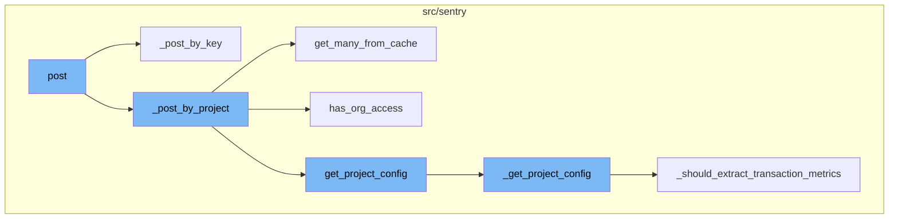
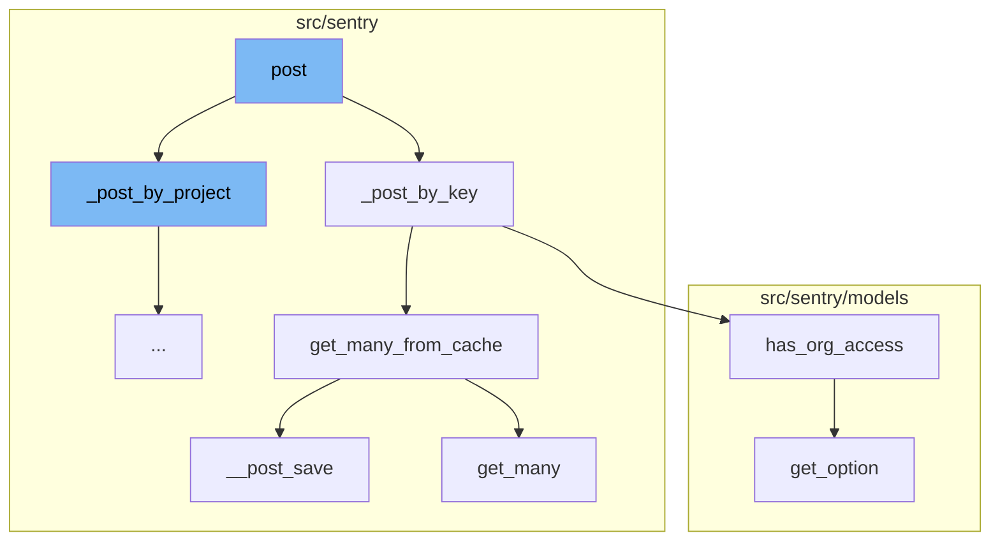
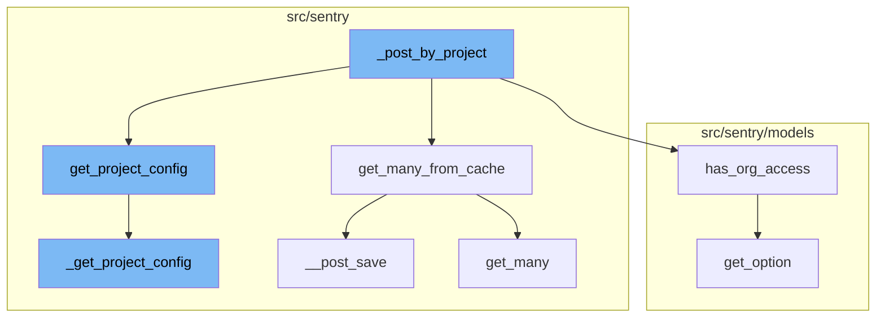

# Overview of the 'post' Process

The 'post' process in Sentry is a multi-step flow that handles incoming requests and processes them based on their version. It starts with the 'post' function, which determines the version of the request and calls the appropriate function to process it. If the request version is '2' or '3', the '\_post_by_key' function is called. This function retrieves the public keys from the request, fetches the corresponding project keys from the cache, fetches the projects and organizations associated with these keys, and generates the project configurations. If the objects are not found in the cache, they are fetched from the database and the cache is updated. The 'has_org_access' function checks if the relay has access to the organization. If the relay is internal, it always has access. Otherwise, it checks if the relay's public key is in the organization's list of trusted relays. The 'get_option' function retrieves the value of an option for a project. If the option is not set for the project, it checks the project's template. After an instance is saved, the '\__post_save' function updates the cache with the changes made to the instance and removes any invalid cache entries. The 'get_many' function retrieves multiple values from the cache based on their keys. If the values are not found in the cache, they are fetched from the database and the cache is updated.



# Flow drill down

First, we'll zoom into this section of the flow:



<SwmSnippet path="/src/sentry/api/endpoints/relay/project_configs.py" line="41">

---

# The `post` Function

The `post` function is the entry point for the flow. It handles the incoming request and determines the version of the request. Depending on the version, it either calls `_post_or_schedule_by_key` or `_post_by_project` to process the request.

```python
    def post(self, request: Request):
        relay = request.relay
        assert relay is not None  # should be provided during Authentication
        response = {}

        if not relay.is_internal:
            return Response("Relay unauthorized for config information", status=403)

        version = request.GET.get("version") or "1"
        set_tag("relay_protocol_version", version)

        if version == "3" and request.relay_request_data.get("global"):
            response["global"] = get_global_config()
            response["global_status"] = "ready"

        if self._should_post_or_schedule(version, request):
            # Always compute the full config. It's invalid to send partial
            # configs to processing relays, and these validate the requests they
            # get with permissions and trim configs down accordingly.
            response.update(self._post_or_schedule_by_key(request))
        elif version in ["2", "3"]:
```

---

</SwmSnippet>

<SwmSnippet path="/src/sentry/api/endpoints/relay/project_configs.py" line="146">

---

# The `_post_by_key` Function

The `_post_by_key` function is called when the request version is '2' or '3'. It retrieves the public keys from the request and fetches the corresponding project keys from the cache. It then fetches the projects and organizations associated with these keys. Finally, it generates the project configurations and updates the cache.

```python
    def _post_by_key(self, request: Request) -> MutableMapping[str, ProjectConfig]:
        public_keys = request.relay_request_data.get("publicKeys")
        public_keys = set(public_keys or ())

        project_keys: MutableMapping[str, ProjectKey] = {}
        project_ids: set[int] = set()

        with start_span(op="relay_fetch_keys"):
            with metrics.timer("relay_project_configs.fetching_keys.duration"):
                for key in ProjectKey.objects.get_many_from_cache(public_keys, key="public_key"):
                    if key.status != ProjectKeyStatus.ACTIVE:
                        continue

                    project_keys[key.public_key] = key
                    project_ids.add(key.project_id)

        projects: MutableMapping[int, Project] = {}
        organization_ids: set[int] = set()

        with start_span(op="relay_fetch_projects"):
            with metrics.timer("relay_project_configs.fetching_projects.duration"):
```

---

</SwmSnippet>

<SwmSnippet path="/src/sentry/db/models/manager/base.py" line="360">

---

# The `get_many_from_cache` Function

The `get_many_from_cache` function is used to fetch multiple objects from the cache based on their keys. If the objects are not found in the cache, it fetches them from the database and updates the cache.

```python
    def get_many_from_cache(self, values: Collection[str | int], key: str = "pk") -> Sequence[Any]:
        """
        Wrapper around `QuerySet.filter(pk__in=values)` which supports caching of
        the intermediate value.  Callee is responsible for making sure the
        cache key is cleared on save.

        NOTE: We can only query by primary key or some other unique identifier.
        It is not possible to e.g. run `Project.objects.get_many_from_cache([1,
        2, 3], key="organization_id")` and get back all projects belonging to
        those orgs. The length of the return value is bounded by the length of
        `values`.

        For most models, if one attempts to use a non-PK value this will just
        degrade to a DB query, like with `get_from_cache`.
        """

        pk_name = self.model._meta.pk.name

        if key == "pk":
            key = pk_name

```

---

</SwmSnippet>

<SwmSnippet path="/src/sentry/models/relay.py" line="63">

---

# The `has_org_access` Function

The `has_org_access` function checks if the relay has access to the organization. If the relay is internal, it always has access. Otherwise, it checks if the relay's public key is in the organization's list of trusted relays.

```python
    def has_org_access(self, org):
        # Internal relays always have access
        if self.is_internal:
            return True

        trusted_relays = org.get_option("sentry:trusted-relays", [])
        key = str(self.public_key_object)

        for relay_info in trusted_relays:
            if relay_info is not None and relay_info.get("public_key") == key:
                return True

        return False
```

---

</SwmSnippet>

<SwmSnippet path="/src/sentry/models/project.py" line="417">

---

# The `get_option` Function

The `get_option` function retrieves the value of an option for a project. If the option is not set for the project, it checks the project's template.

```python
    def get_option(
        self, key: str, default: Any | None = None, validate: Callable[[object], bool] | None = None
    ) -> Any:
        # if the option is not set, check the template
        if not self.option_manager.isset(self, key) and self.template is not None:
            return self.template_manager.get_value(self.template, key, default, validate)

        return self.option_manager.get_value(self, key, default, validate)
```

---

</SwmSnippet>

<SwmSnippet path="/src/sentry/db/models/manager/base.py" line="188">

---

# The `__post_save` Function

The `__post_save` function is called after an instance is saved. It updates the cache with the changes made to the instance and removes any invalid cache entries.

```python
    def __post_save(self, instance: M, **kwargs: Any) -> None:
        """
        Pushes changes to an instance into the cache, and removes invalid (changed)
        lookup values.
        """
        pk_name = instance._meta.pk.name
        pk_names = ("pk", pk_name)
        pk_val = instance.pk
        for key in self.cache_fields:
            if key in pk_names:
                continue
            # store pointers
            value = self.__value_for_field(instance, key)
            cache.set(
                key=self.__get_lookup_cache_key(**{key: value}),
                value=pk_val,
                timeout=self.cache_ttl,
                version=self.cache_version,
            )

        # Ensure we don't serialize the database into the cache
```

---

</SwmSnippet>

<SwmSnippet path="/src/sentry/sentry_metrics/indexer/cache.py" line="158">

---

# The `get_many` Function

The `get_many` function retrieves multiple values from the cache based on their keys. If the values are not found in the cache, it fetches them from the database and updates the cache.

```python
    def get_many(self, namespace: str, keys: Iterable[str]) -> MutableMapping[str, int | None]:
        if options.get(NAMESPACED_READ_FEAT_FLAG):
            metrics.incr(_INDEXER_CACHE_DOUBLE_READ_METRIC)
            cache_keys = {self._make_namespaced_cache_key(namespace, key): key for key in keys}
            namespaced_results: MutableMapping[str, int | None] = {
                k: self._validate_result(v)
                for k, v in self.cache.get_many(cache_keys.keys(), version=self.version).items()
            }
            return self._format_namespaced_results(
                namespace,
                keys,
                namespaced_results,
            )
        else:
            cache_keys = {self._make_cache_key(key): key for key in keys}
            results: Mapping[str, int | None] = self.cache.get_many(
                cache_keys.keys(), version=self.version
            )
            return self._format_results(keys, results)
```

---

</SwmSnippet>

Now, lets zoom into this section of the flow:



<SwmSnippet path="/src/sentry/api/endpoints/relay/project_configs.py" line="223">

---

# Post Flow

The `_post_by_project` function is the starting point of the post flow. It takes a request and returns a mapping of project configurations. It fetches projects and organizations from the cache, checks organization access, and gets project configurations.

```python
    def _post_by_project(self, request: Request) -> MutableMapping[str, ProjectConfig]:
        project_ids = set(request.relay_request_data.get("projects") or ())

        with start_span(op="relay_fetch_projects"):
            if project_ids:
                with metrics.timer("relay_project_configs.fetching_projects.duration"):
                    projects = {p.id: p for p in Project.objects.get_many_from_cache(project_ids)}
            else:
                projects = {}

        with start_span(op="relay_fetch_orgs"):
            # Preload all organizations and their options to prevent repeated
            # database access when computing the project configuration.
            org_ids: set[int] = {project.organization_id for project in projects.values()}
            if org_ids:
                with metrics.timer("relay_project_configs.fetching_orgs.duration"):
                    orgs_seq = Organization.objects.get_many_from_cache(org_ids)
                    orgs = {o.id: o for o in orgs_seq if request.relay.has_org_access(o)}
            else:
                orgs = {}

```

---

</SwmSnippet>

<SwmSnippet path="/src/sentry/db/models/manager/base.py" line="360">

---

`get_many_from_cache` is a function used in `_post_by_project` to fetch projects and organizations from the cache. It wraps around `QuerySet.filter(pk__in=values)` and supports caching of the intermediate value.

```python
    def get_many_from_cache(self, values: Collection[str | int], key: str = "pk") -> Sequence[Any]:
        """
        Wrapper around `QuerySet.filter(pk__in=values)` which supports caching of
        the intermediate value.  Callee is responsible for making sure the
        cache key is cleared on save.

        NOTE: We can only query by primary key or some other unique identifier.
        It is not possible to e.g. run `Project.objects.get_many_from_cache([1,
        2, 3], key="organization_id")` and get back all projects belonging to
        those orgs. The length of the return value is bounded by the length of
        `values`.

        For most models, if one attempts to use a non-PK value this will just
        degrade to a DB query, like with `get_from_cache`.
        """

        pk_name = self.model._meta.pk.name

        if key == "pk":
            key = pk_name

```

---

</SwmSnippet>

<SwmSnippet path="/src/sentry/models/relay.py" line="63">

---

`has_org_access` is a function used in `_post_by_project` to check if the relay has access to the organization. It returns true if the relay is internal or if the relay's public key is in the organization's trusted relays.

```python
    def has_org_access(self, org):
        # Internal relays always have access
        if self.is_internal:
            return True

        trusted_relays = org.get_option("sentry:trusted-relays", [])
        key = str(self.public_key_object)

        for relay_info in trusted_relays:
            if relay_info is not None and relay_info.get("public_key") == key:
                return True

        return False
```

---

</SwmSnippet>

<SwmSnippet path="/src/sentry/relay/config/__init__.py" line="302">

---

`get_project_config` is a function used in `_post_by_project` to get the project configuration. It constructs the ProjectConfig information for a given project.

```python
def get_project_config(
    project: Project, project_keys: Iterable[ProjectKey] | None = None
) -> ProjectConfig:
    """Constructs the ProjectConfig information.
    :param project: The project to load configuration for. Ensure that
        organization is bound on this object; otherwise it will be loaded from
        the database.
    :param project_keys: Pre-fetched project keys for performance. However, if
        no project keys are provided it is assumed that the config does not
        need to contain auth information (this is the case when used in
        python's StoreView)
    :return: a ProjectConfig object for the given project
    """
    with sentry_sdk.isolation_scope() as scope:
        scope.set_tag("project", project.id)
        with (
            sentry_sdk.start_transaction(name="get_project_config"),
            metrics.timer("relay.config.get_project_config.duration"),
        ):
            return _get_project_config(project, project_keys=project_keys)
```

---

</SwmSnippet>

<SwmSnippet path="/src/sentry/relay/config/__init__.py" line="1033">

---

`_get_project_config` is a function used in `get_project_config` to get the project configuration. It checks if the project is active, gets public key configurations, and sets various configuration options.

```python
def _get_project_config(
    project: Project, project_keys: Iterable[ProjectKey] | None = None
) -> ProjectConfig:
    if project.status != ObjectStatus.ACTIVE:
        return ProjectConfig(project, disabled=True)

    public_keys = get_public_key_configs(project_keys=project_keys)

    with sentry_sdk.start_span(op="get_public_config"):
        now = datetime.now(timezone.utc)
        cfg = {
            "disabled": False,
            "slug": project.slug,
            "lastFetch": now,
            "lastChange": project.get_option("sentry:relay-rev-lastchange", now),
            "rev": project.get_option("sentry:relay-rev", uuid.uuid4().hex),
            "publicKeys": public_keys,
            "config": {
                "allowedDomains": list(get_origins(project)),
                "trustedRelays": [
                    r["public_key"]
```

---

</SwmSnippet>

&nbsp;

*This is an auto-generated document by Swimm AI 🌊 and has not yet been verified by a human*

<SwmMeta version="3.0.0" repo-id="Z2l0aHViJTNBJTNBc2VudHJ5LWRlbW8lM0ElM0FTd2ltbS1EZW1v" repo-name="sentry-demo" doc-type="flows"><sup>Powered by [Swimm](/)</sup></SwmMeta>
