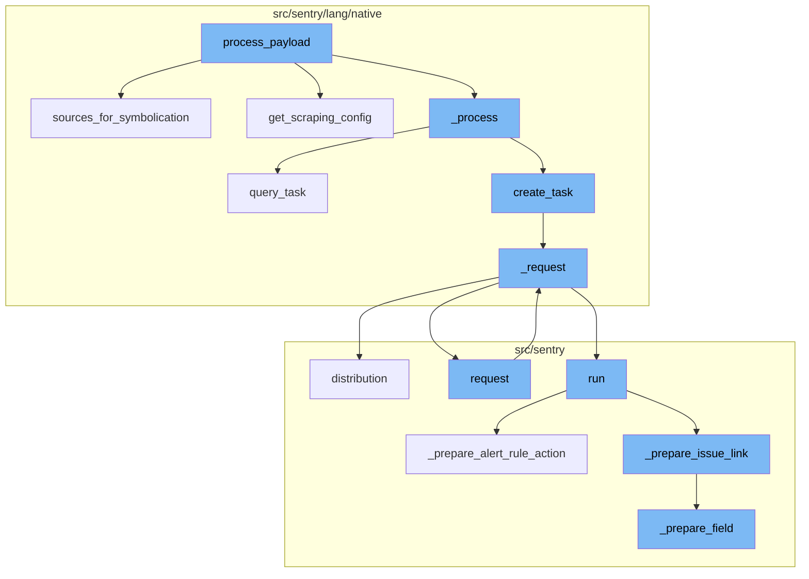
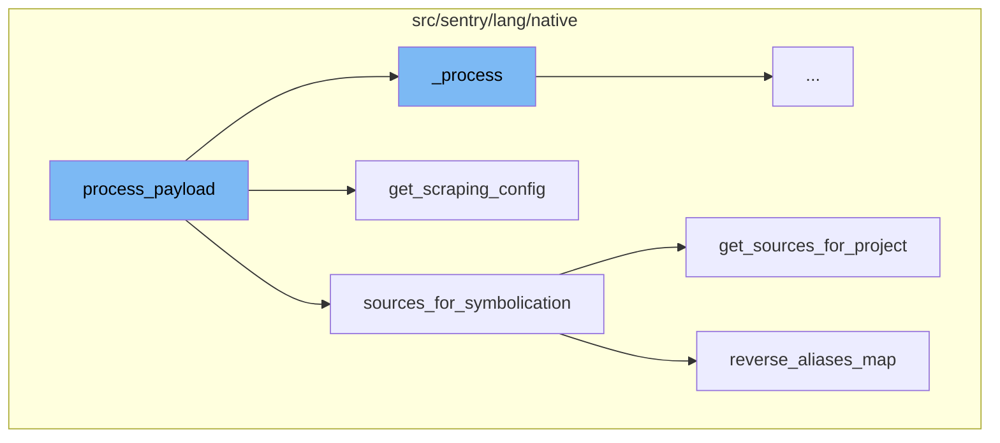
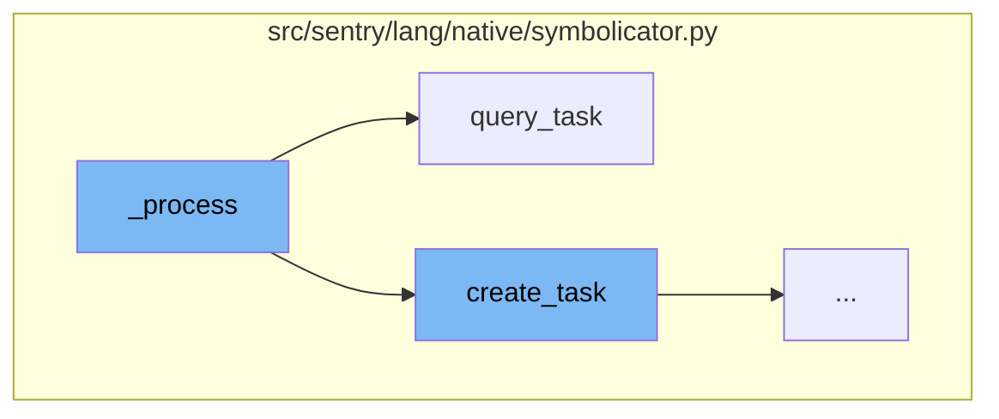
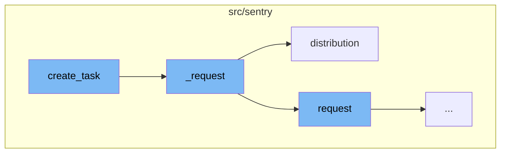
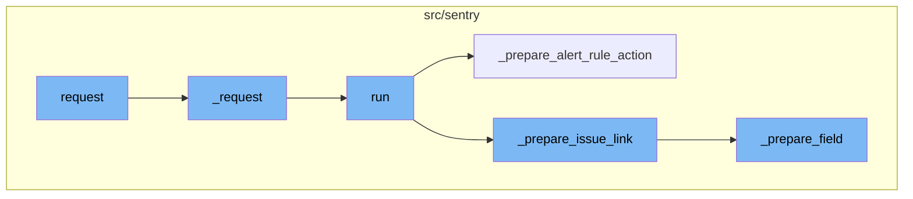
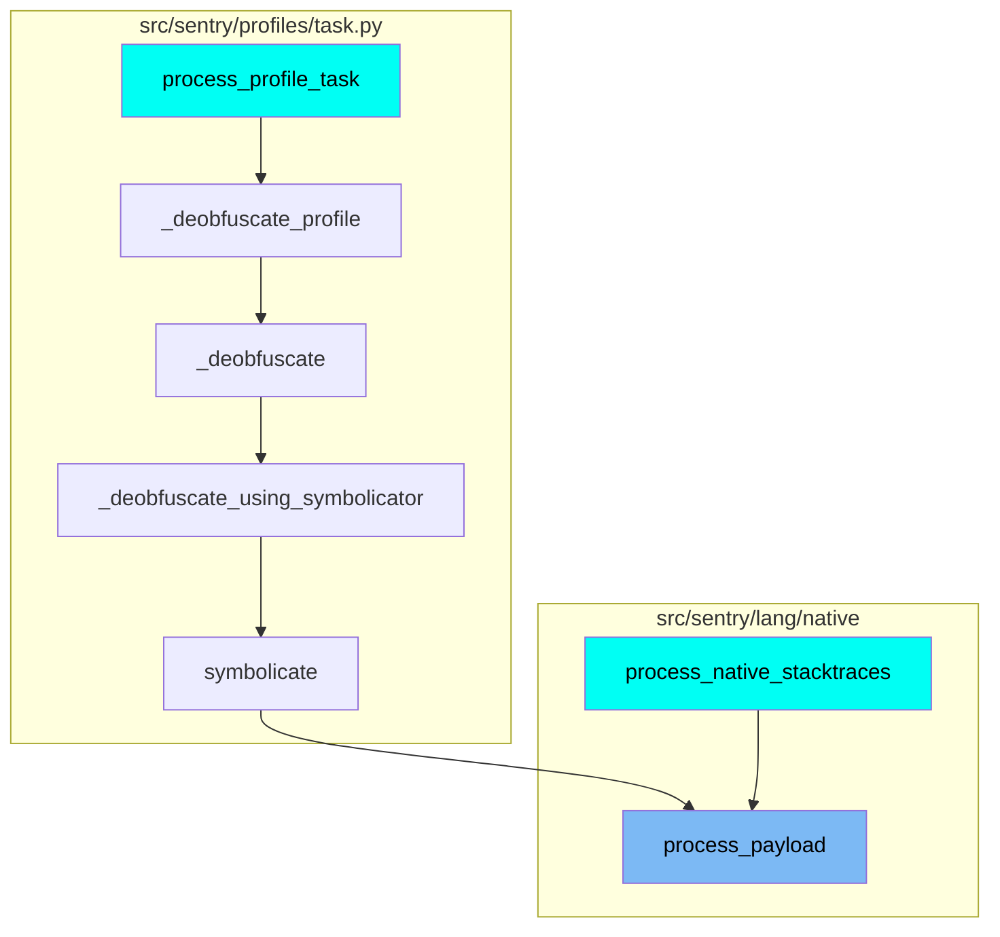

The `process_payload` function serves as the entry point for processing the payload. It accepts stacktraces, modules, and optional signal and apply_source_context parameters. The function then calls the `sources_for_symbolication` and `get_scraping_config` functions to gather the necessary data for processing.

The `sources_for_symbolication` function is invoked within `process_payload`. It returns a list of symbol sources to attach to a native symbolication request, as well as a closure to post-process the resulting JSON response. It also constructs maps for use in `_process_response()`.

The `get_sources_for_project` function is called within `sources_for_symbolication`. It returns a list of symbol sources for the project. It checks the organization's access to symbol sources and adds builtin sources last to ensure that custom sources have precedence over defaults.

The `reverse_aliases_map` function is called within `sources_for_symbolication`. It returns a map of source IDs to their original un-aliased source ID.

The `get_scraping_config` function is called within `process_payload`. It returns the scraping configuration for the project. It checks the organization and project level scraping permissions and returns the scraping configuration.

The `_process` function is the starting point of the flow. It submits a symbolication task to a Symbolicator and handles polling it using the `SymbolicatorSession`. It also handles `TaskIdNotFound` and `ServiceUnavailable` errors. If the task is not found, it resubmits the task. If the service is unavailable, it resets the worker id and resubmits the task.

The `query_task` function is called within the `_process` function. It is used to query the status of a task from the Symbolicator. It does this by making a GET request to the Symbolicator with the task id.

The `create_task` function is also called within the `_process` function. It is used to submit a new task to the Symbolicator. If the task is still pending after one timeout period, the task id is stored and the task is polled again.

The `create_task` function is used to create a new task. It sets up parameters for the task and then makes a request using the `_request` method. The `path` argument is used to specify the endpoint for the request.

The `_request` function is responsible for making the actual request. It checks if a session is open, constructs the URL for the request, and sets up headers for load balancing. The function then makes the request and handles various response scenarios, including retrying the request in case of network failures.

The `distribution` function is used to record metrics about the request. It takes a key and a value, along with optional parameters for instance, tags, sample rate, unit, and stack level. The function updates the current global tags with any provided tags, filters the tags, and then records the distribution.

The `request` function is the entry point for sending a cross-region request. It prepares the request by cleaning proxy headers and other parameters, then calls the `_request` method of the parent class to send the request.

The `_request` function is called next. It serializes the installation details and initiates the `run` method of the `SelectRequester` class.

The `run` function checks the type of the component and calls the appropriate function to prepare the component. For example, if the component type is 'issue-link', it calls the `_prepare_issue_link` function.

The `_prepare_issue_link` function prepares the issue link by getting the required and optional fields from the schema and calling the `_prepare_field` function for each field.

Similarly, the `_prepare_alert_rule_action` function prepares the alert rule action by getting the required and optional fields from the settings of the schema and calling the `_prepare_field` function for each field.

The `_prepare_field` function prepares a field by checking if it depends on other fields. If it does, it gets the dependent data and updates the choices of the field. If not, it simply gets the select choices for the field.

This flow is used multiple times in the codebase. For instance, it is used in the `process_profile_task` and `process_native_stacktraces` functions.



# Flow drill down

First, we'll zoom into this section of the flow:



<SwmSnippet path="/src/sentry/lang/native/symbolicator.py" line="199">

---

# process_payload Function

The `process_payload` function is the entry point for processing the payload. It takes in stacktraces, modules, and optional signal and apply_source_context parameters. It then calls the `sources_for_symbolication` and `get_scraping_config` functions to get the necessary data for processing.

```python
    def process_payload(self, stacktraces, modules, signal=None, apply_source_context=True):
        (sources, process_response) = sources_for_symbolication(self.project)
        scraping_config = get_scraping_config(self.project)
        json = {
            "sources": sources,
            "options": {
                "dif_candidates": True,
                "apply_source_context": apply_source_context,
            },
            "stacktraces": stacktraces,
            "modules": modules,
            "scraping": scraping_config,
        }

        if signal:
            json["signal"] = signal

        res = self._process("symbolicate_stacktraces", "symbolicate", json=json)
        return process_response(res)
```

---

</SwmSnippet>

<SwmSnippet path="/src/sentry/lang/native/sources.py" line="654">

---

## sources_for_symbolication Function

The `sources_for_symbolication` function is called within `process_payload`. It returns a list of symbol sources to attach to a native symbolication request, as well as a closure to post-process the resulting JSON response. It also builds maps for use in `_process_response()`.

```python
def sources_for_symbolication(project):
    """
    Returns a list of symbol sources to attach to a native symbolication request,
    as well as a closure to post-process the resulting JSON response.
    """

    sources = get_sources_for_project(project) or []

    # Build some maps for use in _process_response()
    reverse_source_aliases = reverse_aliases_map(settings.SENTRY_BUILTIN_SOURCES)
    source_names = {source["id"]: source.get("name", "unknown") for source in sources}

    # Add a name for the special "sentry:project" source.
    source_names[INTERNAL_SOURCE_NAME] = "Sentry"

    # Add names for aliased sources.
    for source in settings.SENTRY_BUILTIN_SOURCES.values():
        if source.get("type") == "alias":
            source_names[source["id"]] = source.get("name", "unknown")

    # Remove sources that should be ignored. This leaves a few extra entries in the alias
```

---

</SwmSnippet>

<SwmSnippet path="/src/sentry/lang/native/sources.py" line="471">

---

### get_sources_for_project Function

The `get_sources_for_project` function is called within `sources_for_symbolication`. It returns a list of symbol sources for the project. It checks the organization's access to symbol sources and adds builtin sources last to ensure that custom sources have precedence over defaults.

```python
def get_sources_for_project(project):
    """
    Returns a list of symbol sources for this project.
    """

    sources = []

    # The symbolicator evaluates sources in the order they are declared. Always
    # try to download symbols from Sentry first.
    project_source = get_internal_source(project)
    sources.append(project_source)

    # Check that the organization still has access to symbol sources. This
    # controls both builtin and external sources.
    organization = project.organization

    if not features.has("organizations:symbol-sources", organization):
        return sources

    # Custom sources have their own feature flag. Check them independently.
    if features.has("organizations:custom-symbol-sources", organization):
```

---

</SwmSnippet>

<SwmSnippet path="/src/sentry/lang/native/sources.py" line="537">

---

### reverse_aliases_map Function

The `reverse_aliases_map` function is called within `sources_for_symbolication`. It returns a map of source IDs to their original un-aliased source ID.

```python
def reverse_aliases_map(builtin_sources):
    """Returns a map of source IDs to their original un-aliased source ID.

    :param builtin_sources: The value of `settings.SENTRY_BUILTIN_SOURCES`.
    """
    reverse_aliases = dict()
    for key, source in builtin_sources.items():
        if source.get("type") != "alias":
            continue
        try:
            self_id = source["id"]
        except KeyError:
            continue
        for aliased_source in source.get("sources", []):
            try:
                aliased_source = builtin_sources[aliased_source]
                aliased_id = aliased_source["id"]
            except KeyError:
                continue
            reverse_aliases[aliased_id] = self_id
    return reverse_aliases
```

---

</SwmSnippet>

<SwmSnippet path="/src/sentry/lang/native/sources.py" line="290">

---

## get_scraping_config Function

The `get_scraping_config` function is called within `process_payload`. It returns the scraping configuration for the project. It checks the organization and project level scraping permissions and returns the scraping configuration.

```python
def get_scraping_config(project: Project) -> dict[str, Any]:
    allow_scraping_org_level = project.organization.get_option("sentry:scrape_javascript", True)
    allow_scraping_project_level = project.get_option("sentry:scrape_javascript", True)
    allow_scraping = allow_scraping_org_level and allow_scraping_project_level
    verify_ssl = project.get_option("sentry:verify_ssl", True)

    allowed_origins = []
    scraping_headers = {}
    if allow_scraping:
        allowed_origins = list(get_origins(project))

        token = project.get_option("sentry:token")
        if token:
            token_header = project.get_option("sentry:token_header") or "X-Sentry-Token"
            scraping_headers[token_header] = token

    return {
        "enabled": allow_scraping,
        "headers": scraping_headers,
        "allowed_origins": allowed_origins,
        "verify_ssl": verify_ssl,
```

---

</SwmSnippet>

Now, lets zoom into this section of the flow:



<SwmSnippet path="/src/sentry/lang/native/symbolicator.py" line="104">

---

# process_payload Flow

The `_process` function is the starting point of the flow. It submits a symbolication task to a Symbolicator and handles polling it using the `SymbolicatorSession`. It also handles `TaskIdNotFound` and `ServiceUnavailable` errors. If the task is not found, it resubmits the task. If the service is unavailable, it resets the worker id and resubmits the task.

```python
    def _process(self, task_name: str, path: str, **kwargs):
        """
        This function will submit a symbolication task to a Symbolicator and handle
        polling it using the `SymbolicatorSession`.
        It will also correctly handle `TaskIdNotFound` and `ServiceUnavailable` errors.
        """
        session = SymbolicatorSession(
            url=self.base_url,
            project_id=str(self.project.id),
            event_id=str(self.event_id),
            timeout=settings.SYMBOLICATOR_POLL_TIMEOUT,
        )

        task_id: str | None = None
        json_response = None

        with session:
            while True:
                try:
                    if not task_id:
                        # We are submitting a new task to Symbolicator
```

---

</SwmSnippet>

<SwmSnippet path="/src/sentry/lang/native/symbolicator.py" line="409">

---

## Querying the Task

The `query_task` function is called within the `_process` function. It is used to query the status of a task from the Symbolicator. It does this by making a GET request to the Symbolicator with the task id.

```python
    def query_task(self, task_id):
        params = {"timeout": self.timeout, "scope": self.project_id}
        task_url = f"requests/{task_id}"

        with metrics.timer("events.symbolicator.query_task"):
            return self._request("get", task_url, params=params)
```

---

</SwmSnippet>

<SwmSnippet path="/src/sentry/lang/native/symbolicator.py" line="104">

---

## Creating the Task

The `create_task` function is also called within the `_process` function. It is used to submit a new task to the Symbolicator. If the task is still pending after one timeout period, the task id is stored and the task is polled again.

```python
    def _process(self, task_name: str, path: str, **kwargs):
        """
        This function will submit a symbolication task to a Symbolicator and handle
        polling it using the `SymbolicatorSession`.
        It will also correctly handle `TaskIdNotFound` and `ServiceUnavailable` errors.
        """
        session = SymbolicatorSession(
            url=self.base_url,
            project_id=str(self.project.id),
            event_id=str(self.event_id),
            timeout=settings.SYMBOLICATOR_POLL_TIMEOUT,
        )

        task_id: str | None = None
        json_response = None

        with session:
            while True:
                try:
                    if not task_id:
                        # We are submitting a new task to Symbolicator
```

---

</SwmSnippet>

Now, lets zoom into this section of the flow:



<SwmSnippet path="/src/sentry/lang/native/symbolicator.py" line="400">

---

## Task Creation and Request

The `create_task` function is used to create a new task. It sets up parameters for the task and then makes a request using the `_request` method. The `path` argument is used to specify the endpoint for the request.

```python
    def create_task(self, path, **kwargs):
        params = {"timeout": self.timeout, "scope": self.project_id}

        with metrics.timer(
            "events.symbolicator.create_task",
            tags={"path": path},
        ):
            return self._request(method="post", path=path, params=params, **kwargs)
```

---

</SwmSnippet>

<SwmSnippet path="/src/sentry/lang/native/symbolicator.py" line="322">

---

## Request Handling

The `_request` function is responsible for making the actual request. It checks if a session is open, constructs the URL for the request, and sets up headers for load balancing. The function then makes the request and handles various response scenarios, including retrying the request in case of network failures.

```python
    def _request(self, method, path, **kwargs):
        if not self.session:
            raise RuntimeError("Session not opened")

        url = urljoin(self.url, path)

        # required for load balancing
        kwargs.setdefault("headers", {})["x-sentry-project-id"] = self.project_id
        kwargs.setdefault("headers", {})["x-sentry-event-id"] = self.event_id
        kwargs.setdefault("headers", {})["x-sentry-worker-id"] = self.worker_id

        attempts = 0
        wait = 0.5

        while True:
            try:
                with metrics.timer(
                    "events.symbolicator.session.request", tags={"attempt": attempts}
                ):
                    response = self.session.request(method, url, timeout=self.timeout + 1, **kwargs)

```

---

</SwmSnippet>

<SwmSnippet path="/src/sentry/metrics/middleware.py" line="174">

---

## Metrics Distribution

The `distribution` function is used to record metrics about the request. It takes a key and a value, along with optional parameters for instance, tags, sample rate, unit, and stack level. The function updates the current global tags with any provided tags, filters the tags, and then records the distribution.

```python
    def distribution(
        self,
        key: str,
        value: float,
        instance: str | None = None,
        tags: Tags | None = None,
        sample_rate: float = 1,
        unit: str | None = None,
        stacklevel: int = 0,
    ) -> None:
        current_tags = get_current_global_tags()
        if tags is not None:
            current_tags.update(tags)
        current_tags = _filter_tags(key, current_tags)

        return self.inner.distribution(
            key, value, instance, current_tags, sample_rate, unit, stacklevel + 1
        )
```

---

</SwmSnippet>

Now, lets zoom into this section of the flow:



<SwmSnippet path="/src/sentry/silo/client.py" line="101">

---

# Request and Response Flow

The `request` function is the entry point for sending a cross-region request. It prepares the request by cleaning proxy headers and other parameters, then calls the `_request` method of the parent class to send the request.

```python
    def request(
        self,
        method: str,
        path: str,
        headers: Mapping[str, Any] | None = None,
        data: Any | None = None,
        params: Mapping[str, Any] | None = None,
        json: bool = True,
        raw_response: bool = False,
    ) -> BaseApiResponseX:
        """
        Use the BaseApiClient interface to send a cross-region request.
        If the API is protected, auth may have to be provided manually.
        """
        # TODO: Establish a scheme to authorize requests across silos
        # (e.g. signing secrets, JWTs)
        client_response = super()._request(
            method,
            path,
            headers=clean_proxy_headers(headers),
            data=data,
```

---

</SwmSnippet>

<SwmSnippet path="/src/sentry/sentry_apps/components.py" line="104">

---

The `_request` function is called next. It serializes the installation details and initiates the `run` method of the `SelectRequester` class.

```python
    def _request(self, uri: str, dependent_data: str | None = None) -> Any:
        install = self.install
        if isinstance(install, SentryAppInstallation):
            install = serialize_sentry_app_installation(install, install.sentry_app)
        return SelectRequester.run(
            install=install,
            project_slug=self.project_slug,
            uri=uri,
            dependent_data=dependent_data,
        )
```

---

</SwmSnippet>

<SwmSnippet path="/src/sentry/sentry_apps/components.py" line="26">

---

# Component Type Handling

The `run` function checks the type of the component and calls the appropriate function to prepare the component. For example, if the component type is 'issue-link', it calls the `_prepare_issue_link` function.

```python
    def run(self) -> None:
        if self.component.type == "issue-link":
            self._prepare_issue_link()
        elif self.component.type == "stacktrace-link":
            self._prepare_stacktrace_link()
        elif self.component.type == "alert-rule-action":
            self._prepare_alert_rule_action()
```

---

</SwmSnippet>

<SwmSnippet path="/src/sentry/sentry_apps/components.py" line="49">

---

# Preparing Issue Link and Alert Rule Action

The `_prepare_issue_link` function prepares the issue link by getting the required and optional fields from the schema and calling the `_prepare_field` function for each field.

```python
    def _prepare_issue_link(self) -> None:
        schema = dict(**self.component.app_schema)

        link = schema.get("link", {})
        create = schema.get("create", {})

        for field in link.get("required_fields", []):
            self._prepare_field(field)

        for field in link.get("optional_fields", []):
            self._prepare_field(field)

        for field in create.get("required_fields", []):
            self._prepare_field(field)

        for field in create.get("optional_fields", []):
            self._prepare_field(field)
```

---

</SwmSnippet>

<SwmSnippet path="/src/sentry/sentry_apps/components.py" line="67">

---

Similarly, the `_prepare_alert_rule_action` function prepares the alert rule action by getting the required and optional fields from the settings of the schema and calling the `_prepare_field` function for each field.

```python
    def _prepare_alert_rule_action(self) -> None:
        schema = dict(**self.component.app_schema)
        settings = schema.get("settings", {})

        for field in settings.get("required_fields", []):
            self._prepare_field(field)

        for field in settings.get("optional_fields", []):
            self._prepare_field(field)
```

---

</SwmSnippet>

<SwmSnippet path="/src/sentry/sentry_apps/components.py" line="77">

---

# Preparing Fields

The `_prepare_field` function prepares a field by checking if it depends on other fields. If it does, it gets the dependent data and updates the choices of the field. If not, it simply gets the select choices for the field.

```python
    def _prepare_field(self, field: MutableMapping[str, Any]) -> None:
        if "depends_on" in field:
            dependant_data_list = list(
                filter(lambda val: val["name"] in field.get("depends_on", {}), self.values)
            )
            if len(dependant_data_list) != len(field.get("depends_on", {})):
                field.update({"choices": []})
                return

            dependant_data = json.dumps({x["name"]: x["value"] for x in dependant_data_list})

            self._get_select_choices(field, dependant_data)
            return

        self._get_select_choices(field)
```

---

</SwmSnippet>

# Where is this flow used?

This flow is used multiple times in the codebase as represented in the following diagram:



&nbsp;

*This is an auto-generated document by Swimm AI 🌊 and has not yet been verified by a human*

<SwmMeta version="3.0.0" repo-id="Z2l0aHViJTNBJTNBc2VudHJ5LWRlbW8lM0ElM0FTd2ltbS1EZW1v" repo-name="sentry-demo" doc-type="flows"><sup>Powered by [Swimm](/)</sup></SwmMeta>
