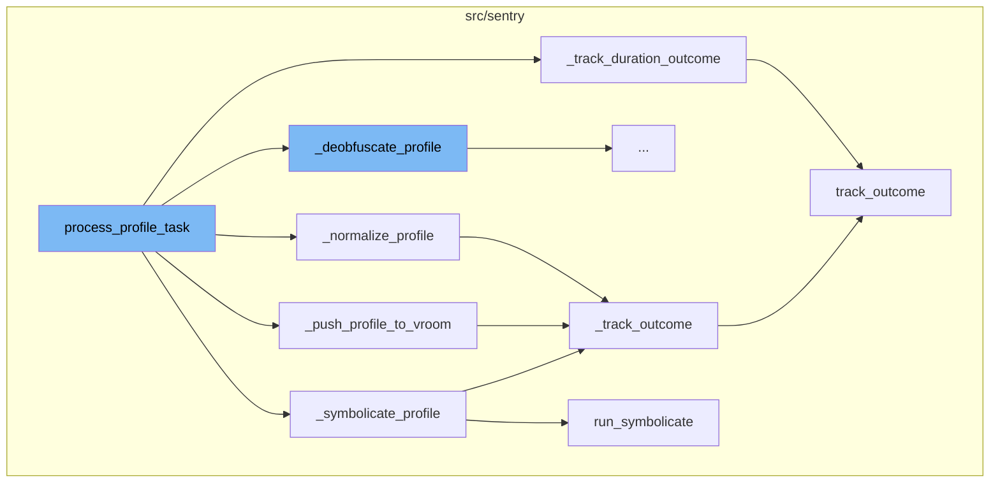
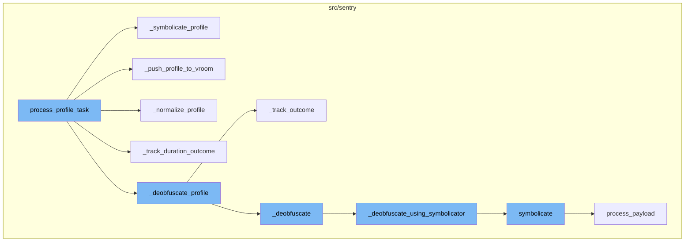
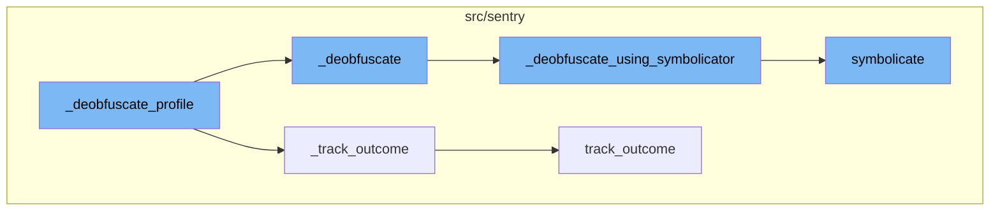

# process_profile_task Overview

The `process_profile_task` function is the entry point for processing a profile. It unpacks the payload, retrieves the organization and project details, sets the context and tags for the Sentry SDK, and then proceeds to symbolicate, deobfuscate, normalize, and push the profile to vroom. It also tracks the duration outcome.

## Symbolication

The `_symbolicate_profile` function is responsible for symbolication of the profile. It prepares the frames from the profile, runs the symbolication process, and processes the results. If symbolication fails, it tracks the outcome as invalid.

## Pushing to Vroom

The `_push_profile_to_vroom` function attempts to insert the profile into vroom. If the insertion fails, it tracks the outcome as invalid.

## Normalization

The `_normalize_profile` function normalizes the profile. If normalization fails, it tracks the outcome as invalid.

## Tracking Duration Outcome

The `_track_duration_outcome` function calculates the profile duration and tracks the outcome as accepted.

## Deobfuscating the Profile

The `_deobfuscate_profile` function is the first step in the process. It checks if the profile needs to be deobfuscated. If it does, it calls the `_deobfuscate` function and sets the `deobfuscated` flag in the profile to `True`. If an exception occurs during this process, it captures the exception and calls the `_track_outcome` function with the outcome set to `INVALID` and the reason set to `profiling_failed_deobfuscation`.

## Tracking the Outcome

The `_track_outcome` function is used to track the outcome of the deobfuscation process. It checks if the project has profiles and if it doesn't, it sends a `first_profile_received` signal. It then calls the `track_outcome` function with the organization id, project id, outcome, reason, timestamp, event id, data category, and quantity.

## Deobfuscating the Profile

The `_deobfuscate` function is used to deobfuscate the profile. It first checks if the project id is in the list of projects for which deobfuscation using symbolicator is enabled. If it is, it calls the `_deobfuscate_using_symbolicator` function. If not, it calls the `_deobfuscate_locally` function.

## Deobfuscating Using Symbolicator

The `_deobfuscate_using_symbolicator` function is used to deobfuscate the profile using the symbolicator. It creates a symbolicator instance and calls the `symbolicate` function. If the response from the symbolicator is successful, it merges the frames with the android methods and returns `True`. If the symbolication times out, it increments the `process_profile.symbolicate.timeout` metric and returns `False`.

## Symbolicating the Profile

The `symbolicate` function is used to symbolicate the profile. Depending on the platform, it calls the appropriate symbolicator process function (`process_js`, `process_jvm`, or `process_payload`).





# Flow drill down

First, we'll zoom into this section of the flow:


<SwmSnippet path="/src/sentry/profiles/task.py" line="65">

---

# process_profile_task

The `process_profile_task` function is the entry point for processing a profile. It unpacks the payload, retrieves the organization and project details, sets the context and tags for the Sentry SDK, and then proceeds to symbolicate, deobfuscate, normalize, and push the profile to vroom. It also tracks the duration outcome.

```python
def process_profile_task(
    profile: Profile | None = None,
    payload: Any = None,
    sampled: bool = True,
    **kwargs: Any,
) -> None:
    if not sampled and not options.get("profiling.profile_metrics.unsampled_profiles.enabled"):
        return

    if payload:
        message_dict = msgpack.unpackb(payload, use_list=False)
        profile = json.loads(message_dict["payload"], use_rapid_json=True)

        assert profile is not None

        profile.update(
            {
                "organization_id": message_dict["organization_id"],
                "project_id": message_dict["project_id"],
                "received": message_dict["received"],
                "sampled": sampled,
```

---

</SwmSnippet>

<SwmSnippet path="/src/sentry/profiles/task.py" line="228">

---

## \_symbolicate_profile

The `_symbolicate_profile` function is responsible for symbolication of the profile. It prepares the frames from the profile, runs the symbolication process, and processes the results. If symbolication fails, it tracks the outcome as invalid.

```python
def _symbolicate_profile(profile: Profile, project: Project) -> bool:
    if not _should_symbolicate(profile):
        return True

    with sentry_sdk.start_span(op="task.profiling.symbolicate"):
        try:
            if "debug_meta" not in profile or not profile["debug_meta"]:
                metrics.incr(
                    "process_profile.missing_keys.debug_meta",
                    tags={"platform": profile["platform"]},
                    sample_rate=1.0,
                )
                return True

            platforms = get_profile_platforms(profile)
            original_images = profile["debug_meta"]["images"]
            images = dict()
            for platform in platforms:
                images[platform] = get_debug_images_for_platform(profile, platform)

            for platform in platforms:
```

---

</SwmSnippet>

<SwmSnippet path="/src/sentry/profiles/task.py" line="1032">

---

## \_push_profile_to_vroom

The `_push_profile_to_vroom` function attempts to insert the profile into vroom. If the insertion fails, it tracks the outcome as invalid.

```python
def _push_profile_to_vroom(profile: Profile, project: Project) -> bool:
    if _insert_vroom_profile(profile=profile):
        return True
    _track_outcome(
        profile=profile,
        project=project,
        outcome=Outcome.INVALID,
        reason="profiling_failed_vroom_insertion",
    )
    return False
```

---

</SwmSnippet>

<SwmSnippet path="/src/sentry/profiles/task.py" line="326">

---

## \_normalize_profile

The `_normalize_profile` function normalizes the profile. If normalization fails, it tracks the outcome as invalid.

```python
def _normalize_profile(profile: Profile, organization: Organization, project: Project) -> bool:
    if profile.get("normalized", False):
        return True

    with sentry_sdk.start_span(op="task.profiling.normalize"):
        try:
            _normalize(profile=profile, organization=organization)
            profile["normalized"] = True
            return True
        except Exception as e:
            sentry_sdk.capture_exception(e)
            _track_outcome(
                profile=profile,
                project=project,
                outcome=Outcome.INVALID,
                reason="profiling_failed_normalization",
            )
            return False
```

---

</SwmSnippet>

<SwmSnippet path="/src/sentry/profiles/task.py" line="1084">

---

## \_track_duration_outcome

The `_track_duration_outcome` function calculates the profile duration and tracks the outcome as accepted.

```python
def _track_duration_outcome(
    profile: Profile,
    project: Project,
) -> None:
    duration_ms = _calculate_profile_duration_ms(profile)
    if duration_ms <= 0:
        return
    track_outcome(
        org_id=project.organization_id,
        project_id=project.id,
        key_id=None,
        outcome=Outcome.ACCEPTED,
        timestamp=datetime.now(timezone.utc),
        category=DataCategory.PROFILE_DURATION,
        quantity=duration_ms,
    )
```

---

</SwmSnippet>

<SwmSnippet path="/src/sentry/utils/outcomes.py" line="40">

---

## track_outcome

The `track_outcome` function is a central point to track org/project counters per incoming event. It sends the outcome message to Kafka which is used by Snuba to serve data for SnubaTSDB and RedisSnubaTSDB.

```python
def track_outcome(
    org_id: int,
    project_id: int,
    key_id: int | None,
    outcome: Outcome,
    reason: str | None = None,
    timestamp: datetime | None = None,
    event_id: str | None = None,
    category: DataCategory | None = None,
    quantity: int | None = None,
) -> None:
    """
    This is a central point to track org/project counters per incoming event.
    NB: This should only ever be called once per incoming event, which means
    it should only be called at the point we know the final outcome for the
    event (invalid, rate_limited, accepted, discarded, etc.)

    This sends the "outcome" message to Kafka which is used by Snuba to serve
    data for SnubaTSDB and RedisSnubaTSDB, such as # of rate-limited/filtered
    events.
    """
```

---

</SwmSnippet>

Now, lets zoom into this section of the flow:



<SwmSnippet path="/src/sentry/profiles/task.py" line="297">

---

## Deobfuscating the Profile

The `_deobfuscate_profile` function is the first step in the process. It checks if the profile needs to be deobfuscated. If it does, it calls the `_deobfuscate` function and sets the `deobfuscated` flag in the profile to `True`. If an exception occurs during this process, it captures the exception and calls the `_track_outcome` function with the outcome set to `INVALID` and the reason set to `profiling_failed_deobfuscation`.

```python
def _deobfuscate_profile(profile: Profile, project: Project) -> bool:
    if not _should_deobfuscate(profile):
        return True

    with sentry_sdk.start_span(op="task.profiling.deobfuscate"):
        try:
            if "profile" not in profile or not profile["profile"]:
                metrics.incr(
                    "process_profile.missing_keys.profile",
                    tags={"platform": profile["platform"]},
                    sample_rate=1.0,
                )
                return True

            _deobfuscate(profile=profile, project=project)

            profile["deobfuscated"] = True
            return True
        except Exception as e:
            sentry_sdk.capture_exception(e)
            _track_outcome(
```

---

</SwmSnippet>

<SwmSnippet path="/src/sentry/profiles/task.py" line="970">

---

## Tracking the Outcome

The `_track_outcome` function is used to track the outcome of the deobfuscation process. It checks if the project has profiles and if it doesn't, it sends a `first_profile_received` signal. It then calls the `track_outcome` function with the organization id, project id, outcome, reason, timestamp, event id, data category, and quantity.

```python
def _track_outcome(
    profile: Profile,
    project: Project,
    outcome: Outcome,
    reason: str | None = None,
) -> None:
    if not project.flags.has_profiles:
        first_profile_received.send_robust(project=project, sender=Project)

    track_outcome(
        org_id=project.organization_id,
        project_id=project.id,
        key_id=None,
        outcome=outcome,
        reason=reason,
        timestamp=datetime.now(timezone.utc),
        event_id=get_event_id(profile),
        category=get_data_category(profile),
        quantity=1,
    )
```

---

</SwmSnippet>

<SwmSnippet path="/src/sentry/profiles/task.py" line="838">

---

## Deobfuscating the Profile

The `_deobfuscate` function is used to deobfuscate the profile. It first checks if the project id is in the list of projects for which deobfuscation using symbolicator is enabled. If it is, it calls the `_deobfuscate_using_symbolicator` function. If not, it calls the `_deobfuscate_locally` function.

```python
def _deobfuscate(profile: Profile, project: Project) -> None:
    debug_file_id = profile.get("build_id")
    if debug_file_id is None or debug_file_id == "":
        # we still need to decode signatures
        for m in profile["profile"]["methods"]:
            if m.get("signature"):
                types = deobfuscate_signature(m["signature"])
                m["signature"] = format_signature(types)
        return

    # We re-use this option as a deny list before we remove it completely.
    if project.id not in options.get("profiling.deobfuscate-using-symbolicator.enable-for-project"):
        try:
            with sentry_sdk.start_span(op="deobfuscate_with_symbolicator"):
                success = _deobfuscate_using_symbolicator(
                    project=project,
                    profile=profile,
                    debug_file_id=debug_file_id,
                )
                sentry_sdk.set_tag("deobfuscated_with_symbolicator_with_success", success)
                if success:
```

---

</SwmSnippet>

<SwmSnippet path="/src/sentry/profiles/task.py" line="780">

---

## Deobfuscating Using Symbolicator

The `_deobfuscate_using_symbolicator` function is used to deobfuscate the profile using the symbolicator. It creates a symbolicator instance and calls the `symbolicate` function. If the response from the symbolicator is successful, it merges the frames with the android methods and returns `True`. If the symbolication times out, it increments the `process_profile.symbolicate.timeout` metric and returns `False`.

```python
def _deobfuscate_using_symbolicator(project: Project, profile: Profile, debug_file_id: str) -> bool:
    symbolication_start_time = time()

    def on_symbolicator_request() -> None:
        duration = time() - symbolication_start_time
        if duration > settings.SYMBOLICATOR_PROCESS_EVENT_HARD_TIMEOUT:
            raise SymbolicationTimeout

    symbolicator = Symbolicator(
        task_kind=SymbolicatorTaskKind(platform=SymbolicatorPlatform.jvm),
        on_request=on_symbolicator_request,
        project=project,
        event_id=get_event_id(profile),
    )

    try:
        with sentry_sdk.start_span(op="task.profiling.deobfuscate.process_payload"):
            response = symbolicate(
                symbolicator=symbolicator,
                profile=profile,
                modules=[
```

---

</SwmSnippet>

<SwmSnippet path="/src/sentry/utils/outcomes.py" line="40">

---

## Tracking the Outcome

The `track_outcome` function is used to track the outcome of the event. It sends the outcome message to Kafka which is used by Snuba to serve data for SnubaTSDB and RedisSnubaTSDB.

```python
def track_outcome(
    org_id: int,
    project_id: int,
    key_id: int | None,
    outcome: Outcome,
    reason: str | None = None,
    timestamp: datetime | None = None,
    event_id: str | None = None,
    category: DataCategory | None = None,
    quantity: int | None = None,
) -> None:
    """
    This is a central point to track org/project counters per incoming event.
    NB: This should only ever be called once per incoming event, which means
    it should only be called at the point we know the final outcome for the
    event (invalid, rate_limited, accepted, discarded, etc.)

    This sends the "outcome" message to Kafka which is used by Snuba to serve
    data for SnubaTSDB and RedisSnubaTSDB, such as # of rate-limited/filtered
    events.
    """
```

---

</SwmSnippet>

<SwmSnippet path="/src/sentry/profiles/task.py" line="470">

---

## Symbolicating the Profile

The `symbolicate` function is used to symbolicate the profile. Depending on the platform, it calls the appropriate symbolicator process function (`process_js`, `process_jvm`, or `process_payload`).

```python
def symbolicate(
    symbolicator: Symbolicator,
    profile: Profile,
    modules: list[Any],
    stacktraces: list[Any],
    platform: str,
) -> Any:
    if platform in SHOULD_SYMBOLICATE_JS:
        return symbolicator.process_js(
            stacktraces=stacktraces,
            modules=modules,
            release=profile.get("release"),
            dist=profile.get("dist"),
            apply_source_context=False,
        )
    elif platform == "android":
        return symbolicator.process_jvm(
            exceptions=[],
            stacktraces=stacktraces,
            modules=modules,
            release_package=profile.get("transaction_metadata", {}).get("app.identifier"),
```

---

</SwmSnippet>

&nbsp;

*This is an auto-generated document by Swimm AI 🌊 and has not yet been verified by a human*

<SwmMeta version="3.0.0" repo-id="Z2l0aHViJTNBJTNBc2VudHJ5LWRlbW8lM0ElM0FTd2ltbS1EZW1v" repo-name="sentry-demo" doc-type="flows"><sup>Powered by [Swimm](/)</sup></SwmMeta>
