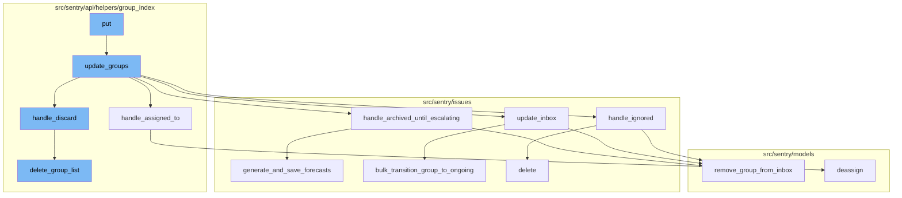

# Overview of 'put' Flow

The 'put' flow is a sequence of function calls that handle the bulk mutation of a list of issues. It starts with the 'put' function, which takes a list of issue IDs and a JSON object of attributes to modify. The 'put' function then calls 'update_groups' to perform the actual mutation.

<SwmSnippet path="/src/sentry/api/endpoints/project_group_index.py" line="188">

---

# The 'put' Function

The 'put' function is the entry point of the 'put' flow. It takes a request and a project as parameters. The function first prepares a search function, then calls 'update_groups' with the necessary parameters. The 'update_groups' function is where the bulk of the mutation logic happens.

`````````````````````````````python
    def put(self, request: Request, project) -> Response:
        """
        Bulk Mutate a List of Issues
        ````````````````````````````

        Bulk mutate various attributes on issues.  The list of issues
        to modify is given through the `id` query parameter.  It is repeated
        for each issue that should be modified.

        - For non-status updates, the `id` query parameter is required.
        - For status updates, the `id` query parameter may be omitted
          for a batch "update all" query.
        - An optional `status` query parameter may be used to restrict
          mutations to only events with the given status.

        The following attributes can be modified and are supplied as
        JSON object in the body:

        If any IDs are out of scope this operation will succeed without
        any data mutation.

`````````````````````````````

---

</SwmSnippet>

<SwmSnippet path="/src/sentry/api/helpers/group_index/update.py" line="166">

---

# The 'update_groups' Function

The 'update_groups' function is responsible for the actual mutation of the issues. It takes a request, a list of group IDs, a list of projects, an organization ID, and a search function as parameters. The function first validates the data, then performs various updates based on the validated data.

```python
def update_groups(
    request: Request,
    group_ids: Sequence[int] | None,
    projects: Sequence[Project],
    organization_id: int,
    search_fn: SearchFunction | None,
    user: User | None = None,
    data: Mapping[str, Any] | None = None,
) -> Response:
    # If `user` and `data` are passed as parameters then they should override
    # the values in `request`.
    user = user or request.user
    data = data or request.data

    if group_ids:
        group_list = Group.objects.filter(
            project__organization_id=organization_id, project__in=projects, id__in=group_ids
        )
        # filter down group ids to only valid matches
        group_ids = [g.id for g in group_list]
        if not group_ids:
```

---

</SwmSnippet>

<SwmSnippet path="/src/sentry/api/helpers/group_index/update.py" line="867">

---

# The 'handle_assigned_to' Function

The 'handle_assigned_to' function is called within 'update_groups' to handle the assignment of issues. It takes an assigned actor, an assigner, an integration, a list of groups, a project lookup, and an acting user as parameters. The function assigns the issues to the assigned actor and logs the assignment.

```python
def handle_assigned_to(
    assigned_actor: Actor,
    assigned_by: str | None,
    integration: str | None,
    group_list: list[Group],
    project_lookup: dict[int, Project],
    acting_user: User | None,
) -> ActorSerializerResponse | None:
    """
    Handle the assignedTo field on a group update.

    This sets a new assignee or removes existing assignees, and logs the
    manual.issue_assignment analytic.
    """
    assigned_by = (
        assigned_by if assigned_by in ["assignee_selector", "suggested_assignee"] else None
    )
    extra = (
        {"integration": integration}
        if integration in [ActivityIntegration.SLACK.value, ActivityIntegration.MSTEAMS.value]
        else dict()
```

---

</SwmSnippet>

<SwmSnippet path="/src/sentry/issues/ignored.py" line="79">

---

# The 'handle_ignored' Function

The 'handle_ignored' function is called within 'update_groups' to handle ignored issues. It takes a list of group IDs, a list of groups, a dictionary of status details, an acting user, and a user as parameters. The function creates a snooze for each ignored issue and updates the status of the issue.

```python
def handle_ignored(
    group_ids: Sequence[Group],
    group_list: Sequence[Group],
    status_details: dict[str, Any],
    acting_user: User | None,
    user: User | RpcUser,
) -> IgnoredStatusDetails:
    """
    Handle issues that are ignored and create a snooze for them.

    Evaluate ignored issues according to the statusDetails and create a snooze as needed.

    Returns: a dict with the statusDetails for ignore conditions.
    """
    metrics.incr("group.ignored", skip_internal=True)
    for group in group_ids:
        remove_group_from_inbox(group, action=GroupInboxRemoveAction.IGNORED, user=acting_user)

    new_status_details: IgnoredStatusDetails = {}
    ignore_duration = (
        status_details.pop("ignoreDuration", None) or status_details.pop("snoozeDuration", None)
```

---

</SwmSnippet>

<SwmSnippet path="/src/sentry/issues/update_inbox.py" line="19">

---

# The 'update_inbox' Function

The 'update_inbox' function is called within 'update_groups' to update the inbox status of the issues. It takes a boolean indicating whether the issues are in the inbox, a list of groups, a project lookup, an acting user, a referrer, and a sender as parameters. The function moves the issues in or out of the inbox based on the 'in_inbox' parameter.

```python
def update_inbox(
    in_inbox: bool,
    group_list: list[Group],
    project_lookup: dict[int, Project],
    acting_user: User | None,
    http_referrer: str,
    sender: Any,
) -> bool:
    """
    Support moving groups in or out of the inbox via the Mark Reviewed button.

    Returns a boolean indicating whether or not the groups are now in the inbox.
    """
    if not group_list:
        return in_inbox

    if in_inbox:
        for group in group_list:
            add_group_to_inbox(group, GroupInboxReason.MANUAL)
    elif not in_inbox:
        for group in group_list:
```

---

</SwmSnippet>

<SwmSnippet path="/src/sentry/issues/ignored.py" line="38">

---

# The 'handle_archived_until_escalating' Function

The 'handle_archived_until_escalating' function is called within 'update_groups' to handle issues that are archived until escalating. It takes a list of groups, an acting user, a list of projects, and a sender as parameters. The function creates a forecast for each issue and removes the issue from the inbox.

```python
def handle_archived_until_escalating(
    group_list: Sequence[Group],
    acting_user: User | None,
    projects: Sequence[Project],
    sender: Any,
) -> dict[str, bool]:
    """
    Handle issues that are archived until escalating and create a forecast for them.

    Issues that are marked as ignored with `archiveDuration: until_escalating`
    in the statusDetail are treated as `archived_until_escalating`.
    """
    metrics.incr("group.archived_until_escalating", skip_internal=True)
    for group in group_list:
        remove_group_from_inbox(group, action=GroupInboxRemoveAction.IGNORED, user=acting_user)
    generate_and_save_forecasts(group_list)
    logger.info(
        "archived_until_escalating.forecast_created",
        extra={
            "detail": "Created forecast for groups",
            "group_ids": [group.id for group in group_list],
```

---

</SwmSnippet>

<SwmSnippet path="/src/sentry/api/helpers/group_index/update.py" line="63">

---

# The 'handle_discard' Function

The 'handle_discard' function is called within 'update_groups' to handle discarded issues. It takes a request, a list of groups, a list of projects, and a user as parameters. The function permanently removes the issues and creates a tombstone for each issue.

```python
def handle_discard(
    request: Request,
    group_list: Sequence[Group],
    projects: Sequence[Project],
    user: User,
) -> Response:
    for project in projects:
        if not features.has("projects:discard-groups", project, actor=user):
            return Response({"detail": ["You do not have that feature enabled"]}, status=400)

    if any(group.issue_category != GroupCategory.ERROR for group in group_list):
        raise rest_framework.exceptions.ValidationError(
            detail="Only error issues can be discarded."
        )
    # grouped by project_id
    groups_to_delete = defaultdict(list)

    for group in group_list:
        with transaction.atomic(router.db_for_write(GroupTombstone)):
            try:
                tombstone = GroupTombstone.objects.create(
```

---

</SwmSnippet>

<SwmSnippet path="/src/sentry/api/helpers/group_index/delete.py" line="28">

---

# The 'delete_group_list' Function

The 'delete_group_list' function is called within 'handle_discard' to delete a list of groups. It takes a request, a project, a list of groups, and a delete type as parameters. The function updates the status of the groups to 'PENDING_DELETION', then schedules a task to delete the groups.

```python
def delete_group_list(
    request: Request,
    project: "Project",
    group_list: list["Group"],
    delete_type: str,
) -> None:
    if not group_list:
        return

    # deterministic sort for sanity, and for very large deletions we'll
    # delete the "smaller" groups first
    group_list.sort(key=lambda g: (g.times_seen, g.id))
    group_ids = [g.id for g in group_list]

    Group.objects.filter(id__in=group_ids).exclude(
        status__in=[GroupStatus.PENDING_DELETION, GroupStatus.DELETION_IN_PROGRESS]
    ).update(status=GroupStatus.PENDING_DELETION, substatus=None)

    eventstream_state = eventstream.backend.start_delete_groups(project.id, group_ids)
    transaction_id = uuid4().hex

```

---

</SwmSnippet>



# Flow drill down


# The 'put' Flow

The 'put' flow is a sequence of function calls that handle the bulk mutation of a list of issues. It starts with the 'put' function, which takes a list of issue IDs and a JSON object of attributes to modify. The 'put' function then calls 'update_groups' to perform the actual mutation.

<SwmSnippet path="/src/sentry/api/endpoints/project_group_index.py" line="188">

---

# The 'put' Function

The 'put' function is the entry point of the 'put' flow. It takes a request and a project as parameters. The function first prepares a search function, then calls 'update_groups' with the necessary parameters. The 'update_groups' function is where the bulk of the mutation logic happens.

`````````````````````````````python
    def put(self, request: Request, project) -> Response:
        """
        Bulk Mutate a List of Issues
        ````````````````````````````

        Bulk mutate various attributes on issues.  The list of issues
        to modify is given through the `id` query parameter.  It is repeated
        for each issue that should be modified.

        - For non-status updates, the `id` query parameter is required.
        - For status updates, the `id` query parameter may be omitted
          for a batch "update all" query.
        - An optional `status` query parameter may be used to restrict
          mutations to only events with the given status.

        The following attributes can be modified and are supplied as
        JSON object in the body:

        If any IDs are out of scope this operation will succeed without
        any data mutation.

`````````````````````````````

---

</SwmSnippet>

<SwmSnippet path="/src/sentry/api/helpers/group_index/update.py" line="166">

---

# The 'update_groups' Function

The 'update_groups' function is responsible for the actual mutation of the issues. It takes a request, a list of group IDs, a list of projects, an organization ID, and a search function as parameters. The function first validates the data, then performs various updates based on the validated data.

```python
def update_groups(
    request: Request,
    group_ids: Sequence[int] | None,
    projects: Sequence[Project],
    organization_id: int,
    search_fn: SearchFunction | None,
    user: User | None = None,
    data: Mapping[str, Any] | None = None,
) -> Response:
    # If `user` and `data` are passed as parameters then they should override
    # the values in `request`.
    user = user or request.user
    data = data or request.data

    if group_ids:
        group_list = Group.objects.filter(
            project__organization_id=organization_id, project__in=projects, id__in=group_ids
        )
        # filter down group ids to only valid matches
        group_ids = [g.id for g in group_list]
        if not group_ids:
```

---

</SwmSnippet>

<SwmSnippet path="/src/sentry/api/helpers/group_index/update.py" line="867">

---

# The 'handle_assigned_to' Function

The 'handle_assigned_to' function is called within 'update_groups' to handle the assignment of issues. It takes an assigned actor, an assigner, an integration, a list of groups, a project lookup, and an acting user as parameters. The function assigns the issues to the assigned actor and logs the assignment.

```python
def handle_assigned_to(
    assigned_actor: Actor,
    assigned_by: str | None,
    integration: str | None,
    group_list: list[Group],
    project_lookup: dict[int, Project],
    acting_user: User | None,
) -> ActorSerializerResponse | None:
    """
    Handle the assignedTo field on a group update.

    This sets a new assignee or removes existing assignees, and logs the
    manual.issue_assignment analytic.
    """
    assigned_by = (
        assigned_by if assigned_by in ["assignee_selector", "suggested_assignee"] else None
    )
    extra = (
        {"integration": integration}
        if integration in [ActivityIntegration.SLACK.value, ActivityIntegration.MSTEAMS.value]
        else dict()
```

---

</SwmSnippet>

<SwmSnippet path="/src/sentry/issues/ignored.py" line="79">

---

# The 'handle_ignored' Function

The 'handle_ignored' function is called within 'update_groups' to handle ignored issues. It takes a list of group IDs, a list of groups, a dictionary of status details, an acting user, and a user as parameters. The function creates a snooze for each ignored issue and updates the status of the issue.

```python
def handle_ignored(
    group_ids: Sequence[Group],
    group_list: Sequence[Group],
    status_details: dict[str, Any],
    acting_user: User | None,
    user: User | RpcUser,
) -> IgnoredStatusDetails:
    """
    Handle issues that are ignored and create a snooze for them.

    Evaluate ignored issues according to the statusDetails and create a snooze as needed.

    Returns: a dict with the statusDetails for ignore conditions.
    """
    metrics.incr("group.ignored", skip_internal=True)
    for group in group_ids:
        remove_group_from_inbox(group, action=GroupInboxRemoveAction.IGNORED, user=acting_user)

    new_status_details: IgnoredStatusDetails = {}
    ignore_duration = (
        status_details.pop("ignoreDuration", None) or status_details.pop("snoozeDuration", None)
```

---

</SwmSnippet>

<SwmSnippet path="/src/sentry/issues/update_inbox.py" line="19">

---

# The 'update_inbox' Function

The 'update_inbox' function is called within 'update_groups' to update the inbox status of the issues. It takes a boolean indicating whether the issues are in the inbox, a list of groups, a project lookup, an acting user, a referrer, and a sender as parameters. The function moves the issues in or out of the inbox based on the 'in_inbox' parameter.

```python
def update_inbox(
    in_inbox: bool,
    group_list: list[Group],
    project_lookup: dict[int, Project],
    acting_user: User | None,
    http_referrer: str,
    sender: Any,
) -> bool:
    """
    Support moving groups in or out of the inbox via the Mark Reviewed button.

    Returns a boolean indicating whether or not the groups are now in the inbox.
    """
    if not group_list:
        return in_inbox

    if in_inbox:
        for group in group_list:
            add_group_to_inbox(group, GroupInboxReason.MANUAL)
    elif not in_inbox:
        for group in group_list:
```

---

</SwmSnippet>

<SwmSnippet path="/src/sentry/issues/ignored.py" line="38">

---

# The 'handle_archived_until_escalating' Function

The 'handle_archived_until_escalating' function is called within 'update_groups' to handle issues that are archived until escalating. It takes a list of groups, an acting user, a list of projects, and a sender as parameters. The function creates a forecast for each issue and removes the issue from the inbox.

```python
def handle_archived_until_escalating(
    group_list: Sequence[Group],
    acting_user: User | None,
    projects: Sequence[Project],
    sender: Any,
) -> dict[str, bool]:
    """
    Handle issues that are archived until escalating and create a forecast for them.

    Issues that are marked as ignored with `archiveDuration: until_escalating`
    in the statusDetail are treated as `archived_until_escalating`.
    """
    metrics.incr("group.archived_until_escalating", skip_internal=True)
    for group in group_list:
        remove_group_from_inbox(group, action=GroupInboxRemoveAction.IGNORED, user=acting_user)
    generate_and_save_forecasts(group_list)
    logger.info(
        "archived_until_escalating.forecast_created",
        extra={
            "detail": "Created forecast for groups",
            "group_ids": [group.id for group in group_list],
```

---

</SwmSnippet>

<SwmSnippet path="/src/sentry/api/helpers/group_index/update.py" line="63">

---

# The 'handle_discard' Function

The 'handle_discard' function is called within 'update_groups' to handle discarded issues. It takes a request, a list of groups, a list of projects, and a user as parameters. The function permanently removes the issues and creates a tombstone for each issue.

```python
def handle_discard(
    request: Request,
    group_list: Sequence[Group],
    projects: Sequence[Project],
    user: User,
) -> Response:
    for project in projects:
        if not features.has("projects:discard-groups", project, actor=user):
            return Response({"detail": ["You do not have that feature enabled"]}, status=400)

    if any(group.issue_category != GroupCategory.ERROR for group in group_list):
        raise rest_framework.exceptions.ValidationError(
            detail="Only error issues can be discarded."
        )
    # grouped by project_id
    groups_to_delete = defaultdict(list)

    for group in group_list:
        with transaction.atomic(router.db_for_write(GroupTombstone)):
            try:
                tombstone = GroupTombstone.objects.create(
```

---

</SwmSnippet>

<SwmSnippet path="/src/sentry/api/helpers/group_index/delete.py" line="28">

---

# The 'delete_group_list' Function

The 'delete_group_list' function is called within 'handle_discard' to delete a list of groups. It takes a request, a project, a list of groups, and a delete type as parameters. The function updates the status of the groups to 'PENDING_DELETION', then schedules a task to delete the groups.

```python
def delete_group_list(
    request: Request,
    project: "Project",
    group_list: list["Group"],
    delete_type: str,
) -> None:
    if not group_list:
        return

    # deterministic sort for sanity, and for very large deletions we'll
    # delete the "smaller" groups first
    group_list.sort(key=lambda g: (g.times_seen, g.id))
    group_ids = [g.id for g in group_list]

    Group.objects.filter(id__in=group_ids).exclude(
        status__in=[GroupStatus.PENDING_DELETION, GroupStatus.DELETION_IN_PROGRESS]
    ).update(status=GroupStatus.PENDING_DELETION, substatus=None)

    eventstream_state = eventstream.backend.start_delete_groups(project.id, group_ids)
    transaction_id = uuid4().hex

```

---

</SwmSnippet>

&nbsp;

*This is an auto-generated document by Swimm AI 🌊 and has not yet been verified by a human*

<SwmMeta version="3.0.0" repo-id="Z2l0aHViJTNBJTNBc2VudHJ5LWRlbW8lM0ElM0FTd2ltbS1EZW1v" repo-name="sentry-demo" doc-type="flows"><sup>Powered by [Swimm](/)</sup></SwmMeta>
