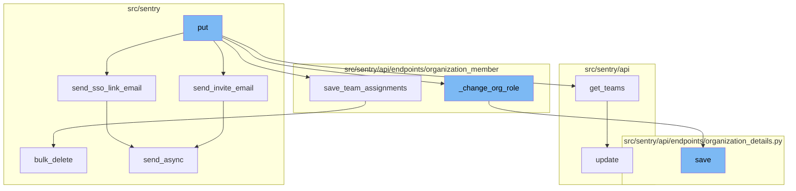

# Overview of 'put' Functionality

The 'put' function is a key part of the process of updating a member's roles within an organization and its teams. It is used to validate incoming data, send necessary emails, assign roles, and save changes.

<SwmSnippet path="/src/sentry/api/endpoints/organization_member/details.py" line="177">

---

# Updating Member Roles

The `put` function is used to update a member's organization and team-level roles. It first validates the incoming data and checks for any restrictions. If the member is pending, it sends an invite email or a SSO link email depending on the authentication provider. It then assigns the organization and team roles to the member and saves the changes.

```python
    def put(
        self,
        request: Request,
        organization: Organization,
        member: OrganizationMember,
    ) -> Response:
        """
        Update a member's organization and team-level roles.
        """
        allowed_roles = get_allowed_org_roles(request, organization)
        serializer = OrganizationMemberRequestSerializer(
            data=request.data,
            partial=True,
            context={
                "organization": organization,
                "allowed_roles": allowed_roles,
            },
        )

        if not serializer.is_valid():
            raise ValidationError(serializer.errors)
```

---

</SwmSnippet>

<SwmSnippet path="/src/sentry/models/organizationmember.py" line="349">

---

# Sending Emails

The `send_invite_email` function is used to send an invite email to the member. It creates a message with the member's email, organization, and invite link and sends it asynchronously.

```python
    def send_invite_email(self, referrer: str | None = None):
        from sentry.utils.email import MessageBuilder

        context = {
            "email": self.email,
            "organization": self.organization,
            "url": self.get_invite_link(referrer),
        }

        msg = MessageBuilder(
            subject="Join %s in using Sentry" % self.organization.name,
            template="sentry/emails/member-invite.txt",
            html_template="sentry/emails/member-invite.html",
            type="organization.invite",
            context=context,
        )

        try:
            msg.send_async([self.get_email()])
        except Exception as e:
            mail_logger = get_logger(name="sentry.mail")
```

---

</SwmSnippet>

<SwmSnippet path="/src/sentry/models/organizationmember.py" line="372">

---

The `send_sso_link_email` function is used to send a SSO link email to the member. It creates a message with the member's email, organization, and SSO link and sends it asynchronously.

```python
    def send_sso_link_email(self, sending_user_email: str, provider):
        from sentry.utils.email import MessageBuilder

        link_args = {"organization_slug": self.organization.slug}
        context = {
            "organization": self.organization,
            "actor_email": sending_user_email,
            "provider": provider,
            "url": absolute_uri(reverse("sentry-auth-organization", kwargs=link_args)),
        }

        msg = MessageBuilder(
            subject=f"Action Required for {self.organization.name}",
            template="sentry/emails/auth-link-identity.txt",
            html_template="sentry/emails/auth-link-identity.html",
            type="organization.auth_link",
            context=context,
        )
        msg.send_async([self.get_email()])
```

---

</SwmSnippet>

<SwmSnippet path="/src/sentry/api/helpers/teams.py" line="21">

---

# Team Assignments

The `get_teams` function retrieves the teams based on the request parameters. It verifies the team IDs and checks if the requester has access to the teams.

```python
def get_teams(request, organization, teams=None):
    # do normal teams lookup based on request params
    requested_teams = set(request.GET.getlist("team", []) if teams is None else teams)

    verified_ids: set[int] = set()

    if "myteams" in requested_teams:
        requested_teams.remove("myteams")
        if is_active_superuser(request):
            # retrieve all teams within the organization
            myteams = Team.objects.filter(
                organization=organization, status=TeamStatus.ACTIVE
            ).values_list("id", flat=True)
            verified_ids.update(myteams)
        else:
            myteams = request.access.team_ids_with_membership
            verified_ids.update(myteams)

    for team_id in requested_teams:  # Verify each passed Team id is numeric
        if not isinstance(team_id, int) and not team_id.isdigit():
            raise InvalidParams(f"Invalid Team ID: {team_id}")
```

---

</SwmSnippet>

<SwmSnippet path="/src/sentry/api/endpoints/organization_member/__init__.py" line="23">

---

The `save_team_assignments` function saves the team assignments for the member. It creates new assignments and deletes the existing ones.

```python
def save_team_assignments(
    organization_member: OrganizationMember,
    teams: list[Team] | None,
    teams_with_roles: list[tuple[Team, str]] | None = None,
):
    # https://github.com/getsentry/sentry/pull/6054/files/8edbdb181cf898146eda76d46523a21d69ab0ec7#r145798271
    lock = locks.get(
        f"org:member:{organization_member.id}", duration=5, name="save_team_assignment"
    )
    with TimedRetryPolicy(10)(lock.acquire):
        if teams_with_roles:
            # Map will avoid O(n * n) search later
            team_role_map = {team.slug: role_id for team, role_id in teams_with_roles}
            target_teams = [team for team, _ in teams_with_roles]
        elif teams:
            team_role_map = {}
            target_teams = teams
        else:
            team_role_map = {}
            target_teams = []

```

---

</SwmSnippet>

<SwmSnippet path="/src/sentry/api/endpoints/organization_member/details.py" line="330">

---

# Changing Organization Role

The `_change_org_role` function changes the organization role of the member. It updates the team roles and saves the new role.

```python
    def _change_org_role(member: OrganizationMember, role: str) -> None:
        new_minimum_team_role = roles.get_minimum_team_role(role)
        lesser_team_roles = [
            r.id for r in team_roles.get_all() if r.priority <= new_minimum_team_role.priority
        ]

        with transaction.atomic(router.db_for_write(OrganizationMemberTeam)):
            # If the member has any existing team roles that are less than or equal
            # to their new minimum role, overwrite the redundant team roles with
            # null. We do this because such a team role would be effectively
            # invisible in the UI, and would be surprising if it were left behind
            # after the user's org role is lowered again.
            omts: list[OrganizationMemberTeam] = []
            for omt in OrganizationMemberTeam.objects.filter(
                organizationmember=member, role__in=lesser_team_roles
            ):
                omt.role = None
            OrganizationMemberTeam.objects.bulk_update(omts, fields=["role"])
            omt_update_count = len(omts)
            member.role = role
            member.save()
```

---

</SwmSnippet>

<SwmSnippet path="/src/sentry/api/endpoints/organization_details.py" line="449">

---

# Saving Changes

The `save` function saves the changes made to the organization. It updates the organization options, flags, and avatar, and handles 2FA and email verification requirements.

```python
    def save(self):
        from sentry import features

        org = self.context["organization"]
        changed_data = {}
        if not hasattr(org, "__data"):
            update_tracked_data(org)

        data = self.validated_data

        for key, option, type_, default_value in ORG_OPTIONS:
            if key not in data:
                continue
            try:
                option_inst = OrganizationOption.objects.get(organization=org, key=option)
                update_tracked_data(option_inst)
            except OrganizationOption.DoesNotExist:
                OrganizationOption.objects.set_value(
                    organization=org, key=option, value=type_(data[key])
                )

```

---

</SwmSnippet>



# Flow drill down


<SwmSnippet path="/src/sentry/api/endpoints/organization_member/details.py" line="177">

---

# The `put` Function

The `put` function is used to update a member's organization and team-level roles. It first validates the incoming data and checks for any restrictions. If the member is pending, it sends an invite email or a SSO link email depending on the authentication provider. It then assigns the organization and team roles to the member and saves the changes.

```python
    def put(
        self,
        request: Request,
        organization: Organization,
        member: OrganizationMember,
    ) -> Response:
        """
        Update a member's organization and team-level roles.
        """
        allowed_roles = get_allowed_org_roles(request, organization)
        serializer = OrganizationMemberRequestSerializer(
            data=request.data,
            partial=True,
            context={
                "organization": organization,
                "allowed_roles": allowed_roles,
            },
        )

        if not serializer.is_valid():
            raise ValidationError(serializer.errors)
```

---

</SwmSnippet>

<SwmSnippet path="/src/sentry/models/organizationmember.py" line="349">

---

# Sending Emails

The `send_invite_email` function is used to send an invite email to the member. It creates a message with the member's email, organization, and invite link and sends it asynchronously.

```python
    def send_invite_email(self, referrer: str | None = None):
        from sentry.utils.email import MessageBuilder

        context = {
            "email": self.email,
            "organization": self.organization,
            "url": self.get_invite_link(referrer),
        }

        msg = MessageBuilder(
            subject="Join %s in using Sentry" % self.organization.name,
            template="sentry/emails/member-invite.txt",
            html_template="sentry/emails/member-invite.html",
            type="organization.invite",
            context=context,
        )

        try:
            msg.send_async([self.get_email()])
        except Exception as e:
            mail_logger = get_logger(name="sentry.mail")
```

---

</SwmSnippet>

<SwmSnippet path="/src/sentry/models/organizationmember.py" line="372">

---

The `send_sso_link_email` function is used to send a SSO link email to the member. It creates a message with the member's email, organization, and SSO link and sends it asynchronously.

```python
    def send_sso_link_email(self, sending_user_email: str, provider):
        from sentry.utils.email import MessageBuilder

        link_args = {"organization_slug": self.organization.slug}
        context = {
            "organization": self.organization,
            "actor_email": sending_user_email,
            "provider": provider,
            "url": absolute_uri(reverse("sentry-auth-organization", kwargs=link_args)),
        }

        msg = MessageBuilder(
            subject=f"Action Required for {self.organization.name}",
            template="sentry/emails/auth-link-identity.txt",
            html_template="sentry/emails/auth-link-identity.html",
            type="organization.auth_link",
            context=context,
        )
        msg.send_async([self.get_email()])
```

---

</SwmSnippet>

<SwmSnippet path="/src/sentry/api/helpers/teams.py" line="21">

---

# Team Assignments

The `get_teams` function retrieves the teams based on the request parameters. It verifies the team IDs and checks if the requester has access to the teams.

```python
def get_teams(request, organization, teams=None):
    # do normal teams lookup based on request params
    requested_teams = set(request.GET.getlist("team", []) if teams is None else teams)

    verified_ids: set[int] = set()

    if "myteams" in requested_teams:
        requested_teams.remove("myteams")
        if is_active_superuser(request):
            # retrieve all teams within the organization
            myteams = Team.objects.filter(
                organization=organization, status=TeamStatus.ACTIVE
            ).values_list("id", flat=True)
            verified_ids.update(myteams)
        else:
            myteams = request.access.team_ids_with_membership
            verified_ids.update(myteams)

    for team_id in requested_teams:  # Verify each passed Team id is numeric
        if not isinstance(team_id, int) and not team_id.isdigit():
            raise InvalidParams(f"Invalid Team ID: {team_id}")
```

---

</SwmSnippet>

<SwmSnippet path="/src/sentry/api/endpoints/organization_member/__init__.py" line="23">

---

The `save_team_assignments` function saves the team assignments for the member. It creates new assignments and deletes the existing ones.

```python
def save_team_assignments(
    organization_member: OrganizationMember,
    teams: list[Team] | None,
    teams_with_roles: list[tuple[Team, str]] | None = None,
):
    # https://github.com/getsentry/sentry/pull/6054/files/8edbdb181cf898146eda76d46523a21d69ab0ec7#r145798271
    lock = locks.get(
        f"org:member:{organization_member.id}", duration=5, name="save_team_assignment"
    )
    with TimedRetryPolicy(10)(lock.acquire):
        if teams_with_roles:
            # Map will avoid O(n * n) search later
            team_role_map = {team.slug: role_id for team, role_id in teams_with_roles}
            target_teams = [team for team, _ in teams_with_roles]
        elif teams:
            team_role_map = {}
            target_teams = teams
        else:
            team_role_map = {}
            target_teams = []

```

---

</SwmSnippet>

<SwmSnippet path="/src/sentry/api/endpoints/organization_member/details.py" line="330">

---

# Changing Organization Role

The `_change_org_role` function changes the organization role of the member. It updates the team roles and saves the new role.

```python
    def _change_org_role(member: OrganizationMember, role: str) -> None:
        new_minimum_team_role = roles.get_minimum_team_role(role)
        lesser_team_roles = [
            r.id for r in team_roles.get_all() if r.priority <= new_minimum_team_role.priority
        ]

        with transaction.atomic(router.db_for_write(OrganizationMemberTeam)):
            # If the member has any existing team roles that are less than or equal
            # to their new minimum role, overwrite the redundant team roles with
            # null. We do this because such a team role would be effectively
            # invisible in the UI, and would be surprising if it were left behind
            # after the user's org role is lowered again.
            omts: list[OrganizationMemberTeam] = []
            for omt in OrganizationMemberTeam.objects.filter(
                organizationmember=member, role__in=lesser_team_roles
            ):
                omt.role = None
            OrganizationMemberTeam.objects.bulk_update(omts, fields=["role"])
            omt_update_count = len(omts)
            member.role = role
            member.save()
```

---

</SwmSnippet>

<SwmSnippet path="/src/sentry/api/endpoints/organization_details.py" line="449">

---

# Saving Changes

The `save` function saves the changes made to the organization. It updates the organization options, flags, and avatar, and handles 2FA and email verification requirements.

```python
    def save(self):
        from sentry import features

        org = self.context["organization"]
        changed_data = {}
        if not hasattr(org, "__data"):
            update_tracked_data(org)

        data = self.validated_data

        for key, option, type_, default_value in ORG_OPTIONS:
            if key not in data:
                continue
            try:
                option_inst = OrganizationOption.objects.get(organization=org, key=option)
                update_tracked_data(option_inst)
            except OrganizationOption.DoesNotExist:
                OrganizationOption.objects.set_value(
                    organization=org, key=option, value=type_(data[key])
                )

```

---

</SwmSnippet>

&nbsp;

*This is an auto-generated document by Swimm AI 🌊 and has not yet been verified by a human*

<SwmMeta version="3.0.0" repo-id="Z2l0aHViJTNBJTNBc2VudHJ5LWRlbW8lM0ElM0FTd2ltbS1EZW1v" repo-name="sentry-demo" doc-type="flows"><sup>Powered by [Swimm](/)</sup></SwmMeta>
