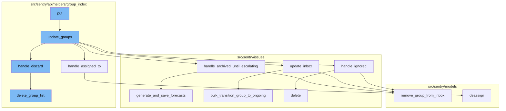

<SwmSnippet path="/src/sentry/api/endpoints/group_details.py" line="314">

---

# The 'put' Function

The `put` function is the entry point of the flow. It is responsible for updating an individual issue's attributes. The function takes in a request and a group as parameters. It first checks if the 'discard' attribute is present in the request data. If it is, or if the response status code is not 200, it returns the response. Otherwise, it fetches the updated group object and serializes it before returning it in the response.

````````````````python
    def put(self, request: Request, group) -> Response:
        """
        Update an Issue
        ```````````````

        Updates an individual issue's attributes. Only the attributes submitted
        are modified.

        :pparam string issue_id: the ID of the group to retrieve.
        :param string status: the new status for the issue.  Valid values
                              are ``"resolved"``, ``resolvedInNextRelease``,
                              ``"unresolved"``, and ``"ignored"``.
        :param string assignedTo: the user or team that should be assigned to
                                  this issue. Can be of the form ``"<user_id>"``,
                                  ``"user:<user_id>"``, ``"<username>"``,
                                  ``"<user_primary_email>"``, or ``"team:<team_id>"``.
        :param string assignedBy: ``"suggested_assignee"`` | ``"assignee_selector"``
        :param boolean hasSeen: in case this API call is invoked with a user
                                context this allows changing of the flag
                                that indicates if the user has seen the
                                event.
````````````````

---

</SwmSnippet>

<SwmSnippet path="/src/sentry/api/helpers/group_index/update.py" line="166">

---

# The 'update_groups' Function

The `update_groups` function is called within the `put` function. It updates the attributes of a list of groups. The function takes in a request, a list of group IDs, a list of projects, an organization ID, and a search function as parameters. It validates the data, checks if the group should be discarded, and updates the group's status and other attributes accordingly.

```python
def update_groups(
    request: Request,
    group_ids: Sequence[int] | None,
    projects: Sequence[Project],
    organization_id: int,
    search_fn: SearchFunction | None,
    user: User | None = None,
    data: Mapping[str, Any] | None = None,
) -> Response:
    # If `user` and `data` are passed as parameters then they should override
    # the values in `request`.
    user = user or request.user
    data = data or request.data

    if group_ids:
        group_list = Group.objects.filter(
            project__organization_id=organization_id, project__in=projects, id__in=group_ids
        )
        # filter down group ids to only valid matches
        group_ids = [g.id for g in group_list]
        if not group_ids:
```

---

</SwmSnippet>

<SwmSnippet path="/src/sentry/api/helpers/group_index/update.py" line="867">

---

# The 'handle_assigned_to' Function

The `handle_assigned_to` function is called within the `update_groups` function. It handles the 'assignedTo' field on a group update. It sets a new assignee or removes existing assignees, and logs the manual issue assignment.

```python
def handle_assigned_to(
    assigned_actor: Actor,
    assigned_by: str | None,
    integration: str | None,
    group_list: list[Group],
    project_lookup: dict[int, Project],
    acting_user: User | None,
) -> ActorSerializerResponse | None:
    """
    Handle the assignedTo field on a group update.

    This sets a new assignee or removes existing assignees, and logs the
    manual.issue_assignment analytic.
    """
    assigned_by = (
        assigned_by if assigned_by in ["assignee_selector", "suggested_assignee"] else None
    )
    extra = (
        {"integration": integration}
        if integration in [ActivityIntegration.SLACK.value, ActivityIntegration.MSTEAMS.value]
        else dict()
```

---

</SwmSnippet>

<SwmSnippet path="/src/sentry/issues/ignored.py" line="79">

---

# The 'handle_ignored' Function

The `handle_ignored` function is called within the `update_groups` function. It handles issues that are ignored and creates a snooze for them. It evaluates ignored issues according to the statusDetails and creates a snooze as needed.

```python
def handle_ignored(
    group_ids: Sequence[Group],
    group_list: Sequence[Group],
    status_details: dict[str, Any],
    acting_user: User | None,
    user: User | RpcUser,
) -> IgnoredStatusDetails:
    """
    Handle issues that are ignored and create a snooze for them.

    Evaluate ignored issues according to the statusDetails and create a snooze as needed.

    Returns: a dict with the statusDetails for ignore conditions.
    """
    metrics.incr("group.ignored", skip_internal=True)
    for group in group_ids:
        remove_group_from_inbox(group, action=GroupInboxRemoveAction.IGNORED, user=acting_user)

    new_status_details: IgnoredStatusDetails = {}
    ignore_duration = (
        status_details.pop("ignoreDuration", None) or status_details.pop("snoozeDuration", None)
```

---

</SwmSnippet>

<SwmSnippet path="/src/sentry/issues/update_inbox.py" line="19">

---

# The 'update_inbox' Function

The `update_inbox` function is called within the `update_groups` function. It supports moving groups in or out of the inbox via the Mark Reviewed button.

```python
def update_inbox(
    in_inbox: bool,
    group_list: list[Group],
    project_lookup: dict[int, Project],
    acting_user: User | None,
    http_referrer: str,
    sender: Any,
) -> bool:
    """
    Support moving groups in or out of the inbox via the Mark Reviewed button.

    Returns a boolean indicating whether or not the groups are now in the inbox.
    """
    if not group_list:
        return in_inbox

    if in_inbox:
        for group in group_list:
            add_group_to_inbox(group, GroupInboxReason.MANUAL)
    elif not in_inbox:
        for group in group_list:
```

---

</SwmSnippet>

<SwmSnippet path="/src/sentry/issues/ignored.py" line="38">

---

# The 'handle_archived_until_escalating' Function

The `handle_archived_until_escalating` function is called within the `update_groups` function. It handles issues that are archived until escalating and creates a forecast for them.

```python
def handle_archived_until_escalating(
    group_list: Sequence[Group],
    acting_user: User | None,
    projects: Sequence[Project],
    sender: Any,
) -> dict[str, bool]:
    """
    Handle issues that are archived until escalating and create a forecast for them.

    Issues that are marked as ignored with `archiveDuration: until_escalating`
    in the statusDetail are treated as `archived_until_escalating`.
    """
    metrics.incr("group.archived_until_escalating", skip_internal=True)
    for group in group_list:
        remove_group_from_inbox(group, action=GroupInboxRemoveAction.IGNORED, user=acting_user)
    generate_and_save_forecasts(group_list)
    logger.info(
        "archived_until_escalating.forecast_created",
        extra={
            "detail": "Created forecast for groups",
            "group_ids": [group.id for group in group_list],
```

---

</SwmSnippet>

<SwmSnippet path="/src/sentry/api/helpers/group_index/update.py" line="63">

---

# The 'handle_discard' Function

The `handle_discard` function is called within the `update_groups` function. It handles the removal of the given issues. It creates a tombstone for each group to be discarded and updates the group hashes accordingly.

```python
def handle_discard(
    request: Request,
    group_list: Sequence[Group],
    projects: Sequence[Project],
    user: User,
) -> Response:
    for project in projects:
        if not features.has("projects:discard-groups", project, actor=user):
            return Response({"detail": ["You do not have that feature enabled"]}, status=400)

    if any(group.issue_category != GroupCategory.ERROR for group in group_list):
        raise rest_framework.exceptions.ValidationError(
            detail="Only error issues can be discarded."
        )
    # grouped by project_id
    groups_to_delete = defaultdict(list)

    for group in group_list:
        with transaction.atomic(router.db_for_write(GroupTombstone)):
            try:
                tombstone = GroupTombstone.objects.create(
```

---

</SwmSnippet>

<SwmSnippet path="/src/sentry/api/helpers/group_index/delete.py" line="28">

---

# The 'delete_group_list' Function

The `delete_group_list` function is called within the `handle_discard` function. It permanently removes the given groups. It updates the status of the groups to 'PENDING_DELETION', starts the deletion process in the event stream, and schedules the `delete_groups_task` to be executed after a delay.

```python
def delete_group_list(
    request: Request,
    project: "Project",
    group_list: list["Group"],
    delete_type: str,
) -> None:
    if not group_list:
        return

    # deterministic sort for sanity, and for very large deletions we'll
    # delete the "smaller" groups first
    group_list.sort(key=lambda g: (g.times_seen, g.id))
    group_ids = [g.id for g in group_list]

    Group.objects.filter(id__in=group_ids).exclude(
        status__in=[GroupStatus.PENDING_DELETION, GroupStatus.DELETION_IN_PROGRESS]
    ).update(status=GroupStatus.PENDING_DELETION, substatus=None)

    eventstream_state = eventstream.backend.start_delete_groups(project.id, group_ids)
    transaction_id = uuid4().hex

```

---

</SwmSnippet>



# Flow drill down


<SwmSnippet path="/src/sentry/api/endpoints/group_details.py" line="314">

---

# The 'put' Function

The `put` function is the entry point of the flow. It is responsible for updating an individual issue's attributes. The function takes in a request and a group as parameters. It first checks if the 'discard' attribute is present in the request data. If it is, or if the response status code is not 200, it returns the response. Otherwise, it fetches the updated group object and serializes it before returning it in the response.

````````````````python
    def put(self, request: Request, group) -> Response:
        """
        Update an Issue
        ```````````````

        Updates an individual issue's attributes. Only the attributes submitted
        are modified.

        :pparam string issue_id: the ID of the group to retrieve.
        :param string status: the new status for the issue.  Valid values
                              are ``"resolved"``, ``resolvedInNextRelease``,
                              ``"unresolved"``, and ``"ignored"``.
        :param string assignedTo: the user or team that should be assigned to
                                  this issue. Can be of the form ``"<user_id>"``,
                                  ``"user:<user_id>"``, ``"<username>"``,
                                  ``"<user_primary_email>"``, or ``"team:<team_id>"``.
        :param string assignedBy: ``"suggested_assignee"`` | ``"assignee_selector"``
        :param boolean hasSeen: in case this API call is invoked with a user
                                context this allows changing of the flag
                                that indicates if the user has seen the
                                event.
````````````````

---

</SwmSnippet>

<SwmSnippet path="/src/sentry/api/helpers/group_index/update.py" line="166">

---

# The 'update_groups' Function

The `update_groups` function is called within the `put` function. It updates the attributes of a list of groups. The function takes in a request, a list of group IDs, a list of projects, an organization ID, and a search function as parameters. It validates the data, checks if the group should be discarded, and updates the group's status and other attributes accordingly.

```python
def update_groups(
    request: Request,
    group_ids: Sequence[int] | None,
    projects: Sequence[Project],
    organization_id: int,
    search_fn: SearchFunction | None,
    user: User | None = None,
    data: Mapping[str, Any] | None = None,
) -> Response:
    # If `user` and `data` are passed as parameters then they should override
    # the values in `request`.
    user = user or request.user
    data = data or request.data

    if group_ids:
        group_list = Group.objects.filter(
            project__organization_id=organization_id, project__in=projects, id__in=group_ids
        )
        # filter down group ids to only valid matches
        group_ids = [g.id for g in group_list]
        if not group_ids:
```

---

</SwmSnippet>

<SwmSnippet path="/src/sentry/api/helpers/group_index/update.py" line="867">

---

# The 'handle_assigned_to' Function

The `handle_assigned_to` function is called within the `update_groups` function. It handles the 'assignedTo' field on a group update. It sets a new assignee or removes existing assignees, and logs the manual issue assignment.

```python
def handle_assigned_to(
    assigned_actor: Actor,
    assigned_by: str | None,
    integration: str | None,
    group_list: list[Group],
    project_lookup: dict[int, Project],
    acting_user: User | None,
) -> ActorSerializerResponse | None:
    """
    Handle the assignedTo field on a group update.

    This sets a new assignee or removes existing assignees, and logs the
    manual.issue_assignment analytic.
    """
    assigned_by = (
        assigned_by if assigned_by in ["assignee_selector", "suggested_assignee"] else None
    )
    extra = (
        {"integration": integration}
        if integration in [ActivityIntegration.SLACK.value, ActivityIntegration.MSTEAMS.value]
        else dict()
```

---

</SwmSnippet>

<SwmSnippet path="/src/sentry/issues/ignored.py" line="79">

---

# The 'handle_ignored' Function

The `handle_ignored` function is called within the `update_groups` function. It handles issues that are ignored and creates a snooze for them. It evaluates ignored issues according to the statusDetails and creates a snooze as needed.

```python
def handle_ignored(
    group_ids: Sequence[Group],
    group_list: Sequence[Group],
    status_details: dict[str, Any],
    acting_user: User | None,
    user: User | RpcUser,
) -> IgnoredStatusDetails:
    """
    Handle issues that are ignored and create a snooze for them.

    Evaluate ignored issues according to the statusDetails and create a snooze as needed.

    Returns: a dict with the statusDetails for ignore conditions.
    """
    metrics.incr("group.ignored", skip_internal=True)
    for group in group_ids:
        remove_group_from_inbox(group, action=GroupInboxRemoveAction.IGNORED, user=acting_user)

    new_status_details: IgnoredStatusDetails = {}
    ignore_duration = (
        status_details.pop("ignoreDuration", None) or status_details.pop("snoozeDuration", None)
```

---

</SwmSnippet>

<SwmSnippet path="/src/sentry/issues/update_inbox.py" line="19">

---

# The 'update_inbox' Function

The `update_inbox` function is called within the `update_groups` function. It supports moving groups in or out of the inbox via the Mark Reviewed button.

```python
def update_inbox(
    in_inbox: bool,
    group_list: list[Group],
    project_lookup: dict[int, Project],
    acting_user: User | None,
    http_referrer: str,
    sender: Any,
) -> bool:
    """
    Support moving groups in or out of the inbox via the Mark Reviewed button.

    Returns a boolean indicating whether or not the groups are now in the inbox.
    """
    if not group_list:
        return in_inbox

    if in_inbox:
        for group in group_list:
            add_group_to_inbox(group, GroupInboxReason.MANUAL)
    elif not in_inbox:
        for group in group_list:
```

---

</SwmSnippet>

<SwmSnippet path="/src/sentry/issues/ignored.py" line="38">

---

# The 'handle_archived_until_escalating' Function

The `handle_archived_until_escalating` function is called within the `update_groups` function. It handles issues that are archived until escalating and creates a forecast for them.

```python
def handle_archived_until_escalating(
    group_list: Sequence[Group],
    acting_user: User | None,
    projects: Sequence[Project],
    sender: Any,
) -> dict[str, bool]:
    """
    Handle issues that are archived until escalating and create a forecast for them.

    Issues that are marked as ignored with `archiveDuration: until_escalating`
    in the statusDetail are treated as `archived_until_escalating`.
    """
    metrics.incr("group.archived_until_escalating", skip_internal=True)
    for group in group_list:
        remove_group_from_inbox(group, action=GroupInboxRemoveAction.IGNORED, user=acting_user)
    generate_and_save_forecasts(group_list)
    logger.info(
        "archived_until_escalating.forecast_created",
        extra={
            "detail": "Created forecast for groups",
            "group_ids": [group.id for group in group_list],
```

---

</SwmSnippet>

<SwmSnippet path="/src/sentry/api/helpers/group_index/update.py" line="63">

---

# The 'handle_discard' Function

The `handle_discard` function is called within the `update_groups` function. It handles the removal of the given issues. It creates a tombstone for each group to be discarded and updates the group hashes accordingly.

```python
def handle_discard(
    request: Request,
    group_list: Sequence[Group],
    projects: Sequence[Project],
    user: User,
) -> Response:
    for project in projects:
        if not features.has("projects:discard-groups", project, actor=user):
            return Response({"detail": ["You do not have that feature enabled"]}, status=400)

    if any(group.issue_category != GroupCategory.ERROR for group in group_list):
        raise rest_framework.exceptions.ValidationError(
            detail="Only error issues can be discarded."
        )
    # grouped by project_id
    groups_to_delete = defaultdict(list)

    for group in group_list:
        with transaction.atomic(router.db_for_write(GroupTombstone)):
            try:
                tombstone = GroupTombstone.objects.create(
```

---

</SwmSnippet>

<SwmSnippet path="/src/sentry/api/helpers/group_index/delete.py" line="28">

---

# The 'delete_group_list' Function

The `delete_group_list` function is called within the `handle_discard` function. It permanently removes the given groups. It updates the status of the groups to 'PENDING_DELETION', starts the deletion process in the event stream, and schedules the `delete_groups_task` to be executed after a delay.

```python
def delete_group_list(
    request: Request,
    project: "Project",
    group_list: list["Group"],
    delete_type: str,
) -> None:
    if not group_list:
        return

    # deterministic sort for sanity, and for very large deletions we'll
    # delete the "smaller" groups first
    group_list.sort(key=lambda g: (g.times_seen, g.id))
    group_ids = [g.id for g in group_list]

    Group.objects.filter(id__in=group_ids).exclude(
        status__in=[GroupStatus.PENDING_DELETION, GroupStatus.DELETION_IN_PROGRESS]
    ).update(status=GroupStatus.PENDING_DELETION, substatus=None)

    eventstream_state = eventstream.backend.start_delete_groups(project.id, group_ids)
    transaction_id = uuid4().hex

```

---

</SwmSnippet>

&nbsp;

*This is an auto-generated document by Swimm AI 🌊 and has not yet been verified by a human*

<SwmMeta version="3.0.0" repo-id="Z2l0aHViJTNBJTNBc2VudHJ5LWRlbW8lM0ElM0FTd2ltbS1EZW1v" repo-name="sentry-demo" doc-type="flows"><sup>Powered by [Swimm](/)</sup></SwmMeta>
