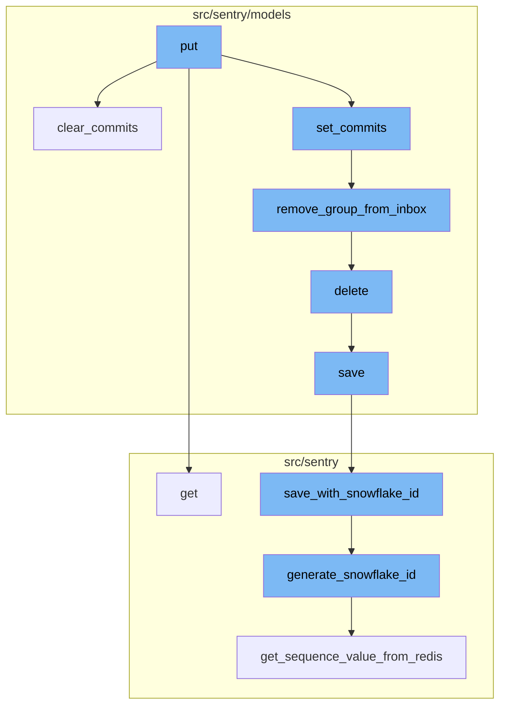
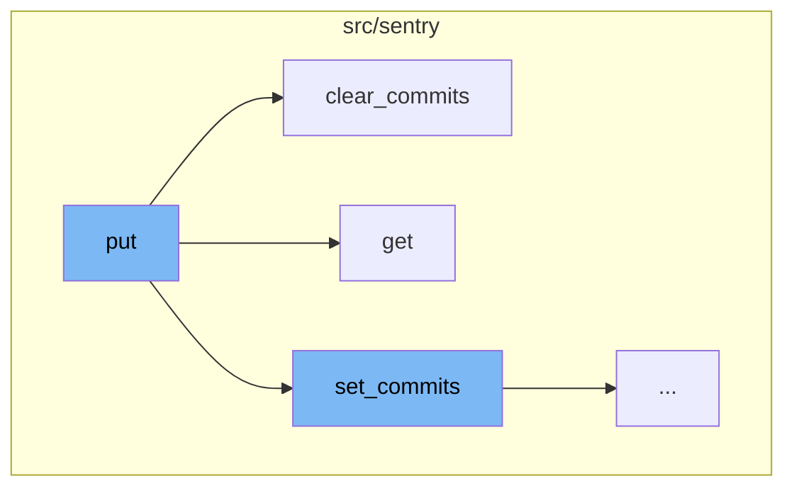
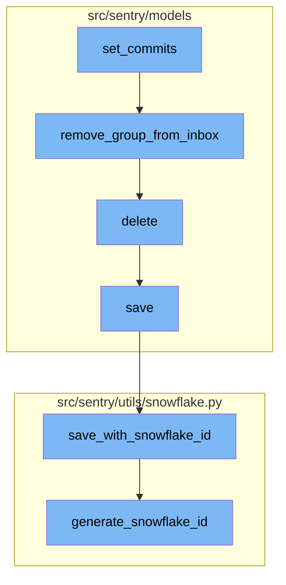

# Overview of 'put'

'Put' is a term used to describe the process of updating or replacing an existing resource with a new set of values. It is commonly used in the context of HTTP methods for RESTful APIs, where it signifies an idempotent request to update an existing resource at a specific URL with a new set of values.

<SwmSnippet path="/src/sentry/api/endpoints/organization_release_details.py" line="430">

---

# 'put' in the Codebase

In the codebase, the `put` function is used to update a release. It can change some metadata associated with the release such as the ref, url, and dates. It first binds the organization context and sets the version tag. It then tries to get the release and its associated projects. If the release does not exist, it raises a `ResourceDoesNotExist` error. The function then checks if the user has permission to update the release. If not, it raises a `ResourceDoesNotExist` error. The function then validates the data sent in the request. If the data is not valid, it returns a 400 response with the validation errors. If the data is valid, it updates the release with the new data.

```python
    def put(self, request: Request, organization, version) -> Response:
        """

        Update a release. This can change some metadata associated with
        the release (the ref, url, and dates).
        """
        bind_organization_context(organization)

        scope = Scope.get_isolation_scope()
        scope.set_tag("version", version)
        try:
            release = Release.objects.get(organization_id=organization, version=version)
            projects = release.projects.all()
        except Release.DoesNotExist:
            scope.set_tag("failure_reason", "Release.DoesNotExist")
            raise ResourceDoesNotExist

        if not self.has_release_permission(request, organization, release):
            scope.set_tag("failure_reason", "no_release_permission")
            raise ResourceDoesNotExist

```

---

</SwmSnippet>

<SwmSnippet path="/src/sentry/models/release.py" line="648">

---

# 'put' Flow

The `set_commits` function is the starting point of the `put` flow. It binds a list of commits to a release. It sorts the commit list in reverse order and then processes each commit. If a commit is not ignored by the `RepositoryProvider`, it is processed further. The function also handles the creation of `Commit`, `CommitAuthor`, `ReleaseCommit`, and `ReleaseHeadCommit` objects.

```python
    def set_commits(self, commit_list):
        """
        Bind a list of commits to this release.

        This will clear any existing commit log and replace it with the given
        commits.
        """

        # Sort commit list in reverse order
        commit_list.sort(key=lambda commit: commit.get("timestamp", 0), reverse=True)

        # TODO(dcramer): this function could use some cleanup/refactoring as it's a bit unwieldy
        from sentry.models.commit import Commit
        from sentry.models.commitauthor import CommitAuthor
        from sentry.models.group import Group, GroupStatus
        from sentry.models.grouplink import GroupLink
        from sentry.models.groupresolution import GroupResolution
        from sentry.models.pullrequest import PullRequest
        from sentry.models.releasecommit import ReleaseCommit
        from sentry.models.releaseheadcommit import ReleaseHeadCommit
        from sentry.models.repository import Repository
```

---

</SwmSnippet>

<SwmSnippet path="/src/sentry/models/groupinbox.py" line="96">

---

The `remove_group_from_inbox` function is the next step in the `put` flow. It removes a group from the inbox. If the action is `MARK_REVIEWED` and a user is provided, it creates an `Activity` object and records the group history.

```python
def remove_group_from_inbox(group, action=None, user=None, referrer=None):
    try:
        group_inbox = GroupInbox.objects.get(group=group)
        group_inbox.delete()

        if action is GroupInboxRemoveAction.MARK_REVIEWED and user is not None:
            Activity.objects.create(
                project_id=group_inbox.group.project_id,
                group_id=group_inbox.group_id,
                type=ActivityType.MARK_REVIEWED.value,
                user_id=user.id,
            )
            record_group_history(group, GroupHistoryStatus.REVIEWED, actor=user)
    except GroupInbox.DoesNotExist:
        pass
```

---

</SwmSnippet>

<SwmSnippet path="/src/sentry/models/project.py" line="722">

---

The `delete` function is the third step in the `put` flow. It removes notification settings for a project and then deletes the project.

```python
    def delete(self, **kwargs):
        # There is no foreign key relationship so we have to manually cascade.
        notifications_service.remove_notification_settings_for_project(project_id=self.id)

        with outbox_context(transaction.atomic(router.db_for_write(Project))):
            Project.outbox_for_update(self.id, self.organization_id).save()
            return super().delete(**kwargs)
```

---

</SwmSnippet>

<SwmSnippet path="/src/sentry/models/project.py" line="365">

---

The `save` function is the fourth step in the `put` flow. It saves a project. If the project doesn't have a slug, it generates one. If `SENTRY_USE_SNOWFLAKE` is true, it saves the project with a snowflake id.

```python
    def save(self, *args, **kwargs):
        if not self.slug:
            lock = locks.get(
                f"slug:project:{self.organization_id}", duration=5, name="project_slug"
            )
            with TimedRetryPolicy(10)(lock.acquire):
                slugify_instance(
                    self,
                    self.name,
                    organization=self.organization,
                    reserved=RESERVED_PROJECT_SLUGS,
                    max_length=50,
                )

        if SENTRY_USE_SNOWFLAKE:
            snowflake_redis_key = "project_snowflake_key"
            save_with_snowflake_id(
                instance=self,
                snowflake_redis_key=snowflake_redis_key,
                save_callback=lambda: super(Project, self).save(*args, **kwargs),
            )
```

---

</SwmSnippet>

<SwmSnippet path="/src/sentry/utils/snowflake.py" line="47">

---

The `save_with_snowflake_id` function is the fifth step in the `put` flow. It saves an instance with a snowflake id. If the instance doesn't have an id, it generates one.

```python
def save_with_snowflake_id(
    instance: BaseModel, snowflake_redis_key: str, save_callback: Callable[[], object]
) -> None:
    assert uses_snowflake_id(
        instance.__class__
    ), "Only models decorated with uses_snowflake_id can be saved with save_with_snowflake_id()"

    for _ in range(settings.MAX_REDIS_SNOWFLAKE_RETRY_COUNTER):
        if not instance.id:
            instance.id = generate_snowflake_id(snowflake_redis_key)
        try:
            with enforce_constraints(transaction.atomic(using=router.db_for_write(type(instance)))):
                save_callback()
            return
        except IntegrityError:
            instance.id = None  # type: ignore[assignment]  # see typeddjango/django-stubs#2014
    raise MaxSnowflakeRetryError
```

---

</SwmSnippet>

<SwmSnippet path="/src/sentry/utils/snowflake.py" line="113">

---

The `generate_snowflake_id` function is the final step in the `put` flow. It generates a snowflake id based on the current time and a sequence value from Redis.

```python
def generate_snowflake_id(redis_key: str) -> int:
    segment_values = {}

    segment_values[VERSION_ID] = msb_0_ordering(settings.SNOWFLAKE_VERSION_ID, VERSION_ID.length)

    try:
        segment_values[REGION_ID] = get_local_region().snowflake_id
    except RegionContextError:  # expected if running in monolith mode
        segment_values[REGION_ID] = NULL_REGION_ID

    current_time = datetime.now().timestamp()
    # supports up to 130 years
    segment_values[TIME_DIFFERENCE] = int(current_time - settings.SENTRY_SNOWFLAKE_EPOCH_START)

    snowflake_id = 0
    (
        segment_values[TIME_DIFFERENCE],
        segment_values[REGION_SEQUENCE],
    ) = get_sequence_value_from_redis(redis_key, segment_values[TIME_DIFFERENCE])

    for segment in BIT_SEGMENT_SCHEMA:
```

---

</SwmSnippet>



# Flow drill down

First, we'll zoom into this section of the flow:



<SwmSnippet path="/src/sentry/api/endpoints/organization_release_details.py" line="430">

---

# The `put` Function

The `put` function is used to update a release. It can change some metadata associated with the release such as the ref, url, and dates. It first binds the organization context and sets the version tag. It then tries to get the release and its associated projects. If the release does not exist, it raises a `ResourceDoesNotExist` error. The function then checks if the user has permission to update the release. If not, it raises a `ResourceDoesNotExist` error. The function then validates the data sent in the request. If the data is not valid, it returns a 400 response with the validation errors. If the data is valid, it updates the release with the new data.

```python
    def put(self, request: Request, organization, version) -> Response:
        """

        Update a release. This can change some metadata associated with
        the release (the ref, url, and dates).
        """
        bind_organization_context(organization)

        scope = Scope.get_isolation_scope()
        scope.set_tag("version", version)
        try:
            release = Release.objects.get(organization_id=organization, version=version)
            projects = release.projects.all()
        except Release.DoesNotExist:
            scope.set_tag("failure_reason", "Release.DoesNotExist")
            raise ResourceDoesNotExist

        if not self.has_release_permission(request, organization, release):
            scope.set_tag("failure_reason", "no_release_permission")
            raise ResourceDoesNotExist

```

---

</SwmSnippet>

<SwmSnippet path="/src/sentry/models/release.py" line="1005">

---

# The `clear_commits` Function

The `clear_commits` function is used to delete all release-specific commit data associated with a release. It does not delete the Commit model values because other releases may use these commits. It deletes the `ReleaseHeadCommit` and `ReleaseCommit` objects associated with the release and then resets the authors, commit count, and last commit id of the release.

```python
    def clear_commits(self):
        """
        Delete all release-specific commit data associated to this release. We will not delete the Commit model values because other releases may use these commits.
        """
        with sentry_sdk.start_span(op="clear_commits"):
            from sentry.models.releasecommit import ReleaseCommit
            from sentry.models.releaseheadcommit import ReleaseHeadCommit

            ReleaseHeadCommit.objects.get(
                organization_id=self.organization_id, release=self
            ).delete()
            ReleaseCommit.objects.filter(
                organization_id=self.organization_id, release=self
            ).delete()

            self.authors = []
            self.commit_count = 0
            self.last_commit_id = None
            self.save()
```

---

</SwmSnippet>

<SwmSnippet path="/src/sentry/api/endpoints/organization_release_details.py" line="328">

---

# The `get` Function

The `get` function is used to return details on an individual release. It first gets the release and checks if the user has permission to view it. If the user does not have permission, it raises a `ResourceDoesNotExist` error. The function then gets the health data and adoption stages for the release if requested. It also gets the previous and next releases to the current release. The function then returns a serialized version of the release.

```python
    def get(self, request: Request, organization, version) -> Response:
        """

        Return details on an individual release.
        """
        # Dictionary responsible for storing selected project meta data
        current_project_meta = {}
        project_id = request.GET.get("project")
        with_health = request.GET.get("health") == "1"
        with_adoption_stages = request.GET.get("adoptionStages") == "1"
        summary_stats_period = request.GET.get("summaryStatsPeriod") or "14d"
        health_stats_period = request.GET.get("healthStatsPeriod") or ("24h" if with_health else "")
        sort = request.GET.get("sort") or "date"
        status_filter = request.GET.get("status", "open")
        query = request.GET.get("query")

        if summary_stats_period not in STATS_PERIODS:
            raise ParseError(detail=get_stats_period_detail("summaryStatsPeriod", STATS_PERIODS))
        if health_stats_period and health_stats_period not in STATS_PERIODS:
            raise ParseError(detail=get_stats_period_detail("healthStatsPeriod", STATS_PERIODS))

```

---

</SwmSnippet>

Now, lets zoom into this section of the flow:



<SwmSnippet path="/src/sentry/models/release.py" line="648">

---

# The `put` Flow

The `set_commits` function is the starting point of the `put` flow. It binds a list of commits to a release. It sorts the commit list in reverse order and then processes each commit. If a commit is not ignored by the `RepositoryProvider`, it is processed further. The function also handles the creation of `Commit`, `CommitAuthor`, `ReleaseCommit`, and `ReleaseHeadCommit` objects.

```python
    def set_commits(self, commit_list):
        """
        Bind a list of commits to this release.

        This will clear any existing commit log and replace it with the given
        commits.
        """

        # Sort commit list in reverse order
        commit_list.sort(key=lambda commit: commit.get("timestamp", 0), reverse=True)

        # TODO(dcramer): this function could use some cleanup/refactoring as it's a bit unwieldy
        from sentry.models.commit import Commit
        from sentry.models.commitauthor import CommitAuthor
        from sentry.models.group import Group, GroupStatus
        from sentry.models.grouplink import GroupLink
        from sentry.models.groupresolution import GroupResolution
        from sentry.models.pullrequest import PullRequest
        from sentry.models.releasecommit import ReleaseCommit
        from sentry.models.releaseheadcommit import ReleaseHeadCommit
        from sentry.models.repository import Repository
```

---

</SwmSnippet>

<SwmSnippet path="/src/sentry/models/groupinbox.py" line="96">

---

The `remove_group_from_inbox` function is the next step in the `put` flow. It removes a group from the inbox. If the action is `MARK_REVIEWED` and a user is provided, it creates an `Activity` object and records the group history.

```python
def remove_group_from_inbox(group, action=None, user=None, referrer=None):
    try:
        group_inbox = GroupInbox.objects.get(group=group)
        group_inbox.delete()

        if action is GroupInboxRemoveAction.MARK_REVIEWED and user is not None:
            Activity.objects.create(
                project_id=group_inbox.group.project_id,
                group_id=group_inbox.group_id,
                type=ActivityType.MARK_REVIEWED.value,
                user_id=user.id,
            )
            record_group_history(group, GroupHistoryStatus.REVIEWED, actor=user)
    except GroupInbox.DoesNotExist:
        pass
```

---

</SwmSnippet>

<SwmSnippet path="/src/sentry/models/project.py" line="722">

---

The `delete` function is the third step in the `put` flow. It removes notification settings for a project and then deletes the project.

```python
    def delete(self, **kwargs):
        # There is no foreign key relationship so we have to manually cascade.
        notifications_service.remove_notification_settings_for_project(project_id=self.id)

        with outbox_context(transaction.atomic(router.db_for_write(Project))):
            Project.outbox_for_update(self.id, self.organization_id).save()
            return super().delete(**kwargs)
```

---

</SwmSnippet>

<SwmSnippet path="/src/sentry/models/project.py" line="365">

---

The `save` function is the fourth step in the `put` flow. It saves a project. If the project doesn't have a slug, it generates one. If `SENTRY_USE_SNOWFLAKE` is true, it saves the project with a snowflake id.

```python
    def save(self, *args, **kwargs):
        if not self.slug:
            lock = locks.get(
                f"slug:project:{self.organization_id}", duration=5, name="project_slug"
            )
            with TimedRetryPolicy(10)(lock.acquire):
                slugify_instance(
                    self,
                    self.name,
                    organization=self.organization,
                    reserved=RESERVED_PROJECT_SLUGS,
                    max_length=50,
                )

        if SENTRY_USE_SNOWFLAKE:
            snowflake_redis_key = "project_snowflake_key"
            save_with_snowflake_id(
                instance=self,
                snowflake_redis_key=snowflake_redis_key,
                save_callback=lambda: super(Project, self).save(*args, **kwargs),
            )
```

---

</SwmSnippet>

<SwmSnippet path="/src/sentry/utils/snowflake.py" line="47">

---

The `save_with_snowflake_id` function is the fifth step in the `put` flow. It saves an instance with a snowflake id. If the instance doesn't have an id, it generates one.

```python
def save_with_snowflake_id(
    instance: BaseModel, snowflake_redis_key: str, save_callback: Callable[[], object]
) -> None:
    assert uses_snowflake_id(
        instance.__class__
    ), "Only models decorated with uses_snowflake_id can be saved with save_with_snowflake_id()"

    for _ in range(settings.MAX_REDIS_SNOWFLAKE_RETRY_COUNTER):
        if not instance.id:
            instance.id = generate_snowflake_id(snowflake_redis_key)
        try:
            with enforce_constraints(transaction.atomic(using=router.db_for_write(type(instance)))):
                save_callback()
            return
        except IntegrityError:
            instance.id = None  # type: ignore[assignment]  # see typeddjango/django-stubs#2014
    raise MaxSnowflakeRetryError
```

---

</SwmSnippet>

<SwmSnippet path="/src/sentry/utils/snowflake.py" line="113">

---

The `generate_snowflake_id` function is the final step in the `put` flow. It generates a snowflake id based on the current time and a sequence value from Redis.

```python
def generate_snowflake_id(redis_key: str) -> int:
    segment_values = {}

    segment_values[VERSION_ID] = msb_0_ordering(settings.SNOWFLAKE_VERSION_ID, VERSION_ID.length)

    try:
        segment_values[REGION_ID] = get_local_region().snowflake_id
    except RegionContextError:  # expected if running in monolith mode
        segment_values[REGION_ID] = NULL_REGION_ID

    current_time = datetime.now().timestamp()
    # supports up to 130 years
    segment_values[TIME_DIFFERENCE] = int(current_time - settings.SENTRY_SNOWFLAKE_EPOCH_START)

    snowflake_id = 0
    (
        segment_values[TIME_DIFFERENCE],
        segment_values[REGION_SEQUENCE],
    ) = get_sequence_value_from_redis(redis_key, segment_values[TIME_DIFFERENCE])

    for segment in BIT_SEGMENT_SCHEMA:
```

---

</SwmSnippet>

&nbsp;

*This is an auto-generated document by Swimm AI 🌊 and has not yet been verified by a human*

<SwmMeta version="3.0.0" repo-id="Z2l0aHViJTNBJTNBc2VudHJ5LWRlbW8lM0ElM0FTd2ltbS1EZW1v" repo-name="sentry-demo" doc-type="flows"><sup>Powered by [Swimm](/)</sup></SwmMeta>
