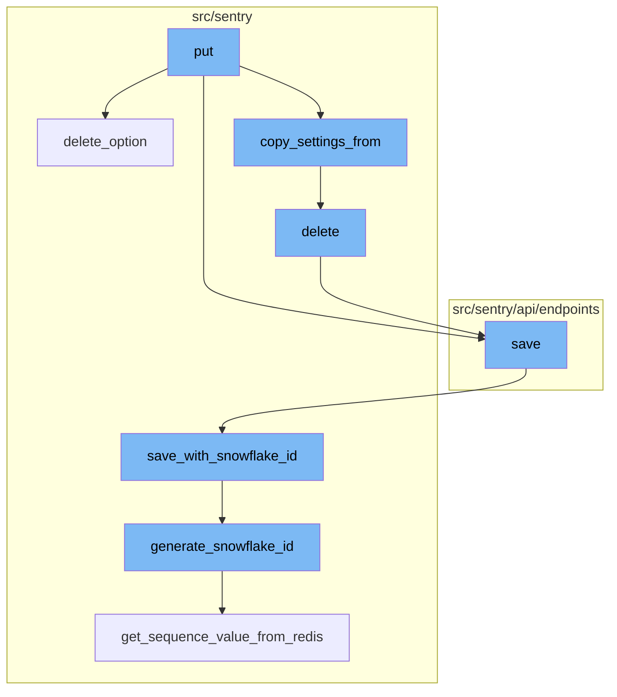
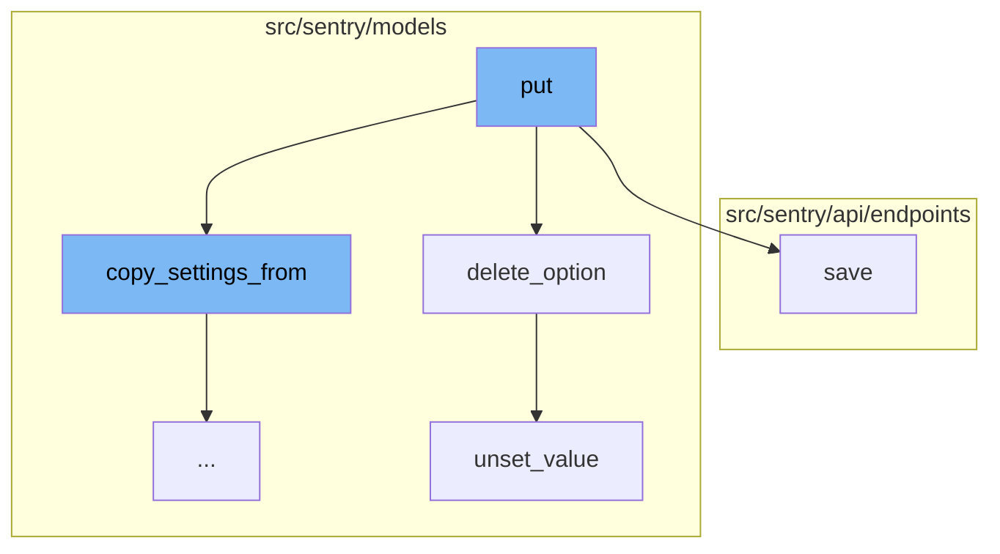
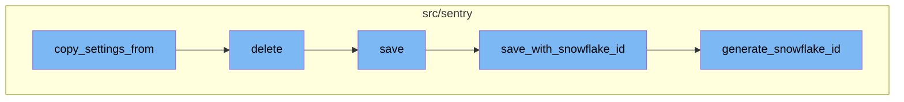

# Overview of 'put'

'put' is a function used to update various attributes and configurable settings for a given project. It checks the user's access level and serializes the request data accordingly. The serialized data is then validated and applied to the project. If the changes are successful, the project is saved with the new settings.

# 'delete_option' Function

'delete_option' is a function that removes a specific option from a project. It first updates the revision for the option and then uses the 'option_manager' to unset the value of the option.

# 'save' Function

'save' is a function that saves changes to an organization. It checks if the organization has any changes in its options. If there are changes, it updates the options and saves the organization with the new settings. The function also handles special cases like updating the avatar, requiring 2FA, and requiring email verification.

# 'unset_value' Function

'unset_value' is a function that removes a specific value from a group. It deletes the value from the group and removes it from the cache.

# 'copy_settings_from' Function

'copy_settings_from' is a function that copies project level settings from another project. It takes a project ID as input and copies over various settings such as General Settings, ProjectTeams, Alerts Settings and Rules, EnvironmentProjects, ProjectOwnership Rules and settings, and Project Inbound Data Filters. It returns a boolean indicating whether the settings have been successfully copied.

# 'delete' Function

'delete' is a function that deletes a project. It removes notification settings for the project and saves the state of the project in an outbox before deleting it.

# 'save' Function

'save' is a function that saves a project. If the project does not have a slug, it generates one. If the 'SENTRY_USE_SNOWFLAKE' setting is enabled, it saves the project with a snowflake ID.

# 'save_with_snowflake_id' Function

'save_with_snowflake_id' is a function that saves a model instance with a snowflake ID. It generates a new snowflake ID if the instance does not already have one and then attempts to save the instance.

# 'generate_snowflake_id' Function

'generate_snowflake_id' is a function that generates a unique snowflake ID. It generates a snowflake ID based on the current time, region, and a sequence value obtained from Redis.



# Flow drill down

First, we'll zoom into this section of the flow:



<SwmSnippet path="/src/sentry/api/endpoints/project_details.py" line="538">

---

# The `put` Function

The `put` function is used to update various attributes and configurable settings for a given project. It first checks if the user has elevated scopes (like `project:write` or `project:admin`). Depending on the user's access level, it uses either the `ProjectAdminSerializer` or `ProjectMemberSerializer` to serialize the request data. The function then validates the serialized data and applies the changes to the project. If the changes are successful, the project is saved with the new settings.

```python
    def put(self, request: Request, project) -> Response:
        """
        Update various attributes and configurable settings for the given project.

        Note that solely having the **`project:read`** scope restricts updatable settings to
        `isBookmarked`.
        """

        old_data = serialize(project, request.user, DetailedProjectSerializer())
        has_elevated_scopes = request.access and (
            request.access.has_scope("project:write")
            or request.access.has_scope("project:admin")
            or request.access.has_any_project_scope(project, ["project:write", "project:admin"])
        )

        if has_elevated_scopes:
            serializer_cls: type[ProjectMemberSerializer] = ProjectAdminSerializer
        else:
            serializer_cls = ProjectMemberSerializer

        serializer = serializer_cls(
```

---

</SwmSnippet>

<SwmSnippet path="/src/sentry/models/project.py" line="430">

---

# The `delete_option` Function

The `delete_option` function is used to remove a specific option from a project. It first updates the revision for the option and then uses the `option_manager` to unset the value of the option.

```python
    def delete_option(self, key: str) -> None:
        projectoptions.update_rev_for_option(self)
        self.option_manager.unset_value(self, key)
```

---

</SwmSnippet>

<SwmSnippet path="/src/sentry/api/endpoints/organization_details.py" line="449">

---

# The `save` Function

The `save` function is used to save changes to an organization. It first checks if the organization has any changes in its options. If there are changes, it updates the options and saves the organization with the new settings. The function also handles special cases like updating the avatar, requiring 2FA, and requiring email verification.

```python
    def save(self):
        from sentry import features

        org = self.context["organization"]
        changed_data = {}
        if not hasattr(org, "__data"):
            update_tracked_data(org)

        data = self.validated_data

        for key, option, type_, default_value in ORG_OPTIONS:
            if key not in data:
                continue
            try:
                option_inst = OrganizationOption.objects.get(organization=org, key=option)
                update_tracked_data(option_inst)
            except OrganizationOption.DoesNotExist:
                OrganizationOption.objects.set_value(
                    organization=org, key=option, value=type_(data[key])
                )

```

---

</SwmSnippet>

<SwmSnippet path="/src/sentry/models/groupmeta.py" line="76">

---

# The `unset_value` Function

The `unset_value` function is used to remove a specific value from a group. It deletes the value from the group and removes it from the cache.

```python
    def unset_value(self, instance, key):
        self.filter(group=instance, key=key).delete()
        try:
            del self.__cache[instance.id][key]
        except KeyError:
            pass
```

---

</SwmSnippet>

Now, lets zoom into this section of the flow:



<SwmSnippet path="/src/sentry/models/project.py" line="653">

---

# Copy Settings From

The `copy_settings_from` function is used to copy project level settings from another project. It takes a project ID as input and copies over various settings such as General Settings, ProjectTeams, Alerts Settings and Rules, EnvironmentProjects, ProjectOwnership Rules and settings, and Project Inbound Data Filters. It returns a boolean indicating whether the settings have been successfully copied.

```python
    def copy_settings_from(self, project_id: int) -> bool:
        """
        Copies project level settings of the inputted project
        - General Settings
        - ProjectTeams
        - Alerts Settings and Rules
        - EnvironmentProjects
        - ProjectOwnership Rules and settings
        - Project Inbound Data Filters

        Returns True if the settings have successfully been copied over
        Returns False otherwise
        """
        from sentry.models.environment import EnvironmentProject
        from sentry.models.options.project_option import ProjectOption
        from sentry.models.projectownership import ProjectOwnership
        from sentry.models.projectteam import ProjectTeam
        from sentry.models.rule import Rule

        # XXX: this type sucks but it helps the type checker understand
        model_list: tuple[type[EnvironmentProject | ProjectOwnership | ProjectTeam | Rule], ...] = (
```

---

</SwmSnippet>

<SwmSnippet path="/src/sentry/models/project.py" line="722">

---

# Delete

The `delete` function is used to delete a project. It removes notification settings for the project and saves the state of the project in an outbox before deleting it.

```python
    def delete(self, **kwargs):
        # There is no foreign key relationship so we have to manually cascade.
        notifications_service.remove_notification_settings_for_project(project_id=self.id)

        with outbox_context(transaction.atomic(router.db_for_write(Project))):
            Project.outbox_for_update(self.id, self.organization_id).save()
            return super().delete(**kwargs)
```

---

</SwmSnippet>

<SwmSnippet path="/src/sentry/models/project.py" line="365">

---

# Save

The `save` function is used to save a project. If the project does not have a slug, it generates one. If the `SENTRY_USE_SNOWFLAKE` setting is enabled, it saves the project with a snowflake ID.

```python
    def save(self, *args, **kwargs):
        if not self.slug:
            lock = locks.get(
                f"slug:project:{self.organization_id}", duration=5, name="project_slug"
            )
            with TimedRetryPolicy(10)(lock.acquire):
                slugify_instance(
                    self,
                    self.name,
                    organization=self.organization,
                    reserved=RESERVED_PROJECT_SLUGS,
                    max_length=50,
                )

        if SENTRY_USE_SNOWFLAKE:
            snowflake_redis_key = "project_snowflake_key"
            save_with_snowflake_id(
                instance=self,
                snowflake_redis_key=snowflake_redis_key,
                save_callback=lambda: super(Project, self).save(*args, **kwargs),
            )
```

---

</SwmSnippet>

<SwmSnippet path="/src/sentry/utils/snowflake.py" line="47">

---

# Save with Snowflake ID

The `save_with_snowflake_id` function is used to save a model instance with a snowflake ID. It generates a new snowflake ID if the instance does not already have one and then attempts to save the instance.

```python
def save_with_snowflake_id(
    instance: BaseModel, snowflake_redis_key: str, save_callback: Callable[[], object]
) -> None:
    assert uses_snowflake_id(
        instance.__class__
    ), "Only models decorated with uses_snowflake_id can be saved with save_with_snowflake_id()"

    for _ in range(settings.MAX_REDIS_SNOWFLAKE_RETRY_COUNTER):
        if not instance.id:
            instance.id = generate_snowflake_id(snowflake_redis_key)
        try:
            with enforce_constraints(transaction.atomic(using=router.db_for_write(type(instance)))):
                save_callback()
            return
        except IntegrityError:
            instance.id = None  # type: ignore[assignment]  # see typeddjango/django-stubs#2014
    raise MaxSnowflakeRetryError
```

---

</SwmSnippet>

<SwmSnippet path="/src/sentry/utils/snowflake.py" line="113">

---

# Generate Snowflake ID

The `generate_snowflake_id` function is used to generate a unique snowflake ID. It generates a snowflake ID based on the current time, region, and a sequence value obtained from Redis.

```python
def generate_snowflake_id(redis_key: str) -> int:
    segment_values = {}

    segment_values[VERSION_ID] = msb_0_ordering(settings.SNOWFLAKE_VERSION_ID, VERSION_ID.length)

    try:
        segment_values[REGION_ID] = get_local_region().snowflake_id
    except RegionContextError:  # expected if running in monolith mode
        segment_values[REGION_ID] = NULL_REGION_ID

    current_time = datetime.now().timestamp()
    # supports up to 130 years
    segment_values[TIME_DIFFERENCE] = int(current_time - settings.SENTRY_SNOWFLAKE_EPOCH_START)

    snowflake_id = 0
    (
        segment_values[TIME_DIFFERENCE],
        segment_values[REGION_SEQUENCE],
    ) = get_sequence_value_from_redis(redis_key, segment_values[TIME_DIFFERENCE])

    for segment in BIT_SEGMENT_SCHEMA:
```

---

</SwmSnippet>

&nbsp;

*This is an auto-generated document by Swimm AI 🌊 and has not yet been verified by a human*

<SwmMeta version="3.0.0" repo-id="Z2l0aHViJTNBJTNBc2VudHJ5LWRlbW8lM0ElM0FTd2ltbS1EZW1v" repo-name="sentry-demo" doc-type="flows"><sup>Powered by [Swimm](/)</sup></SwmMeta>
