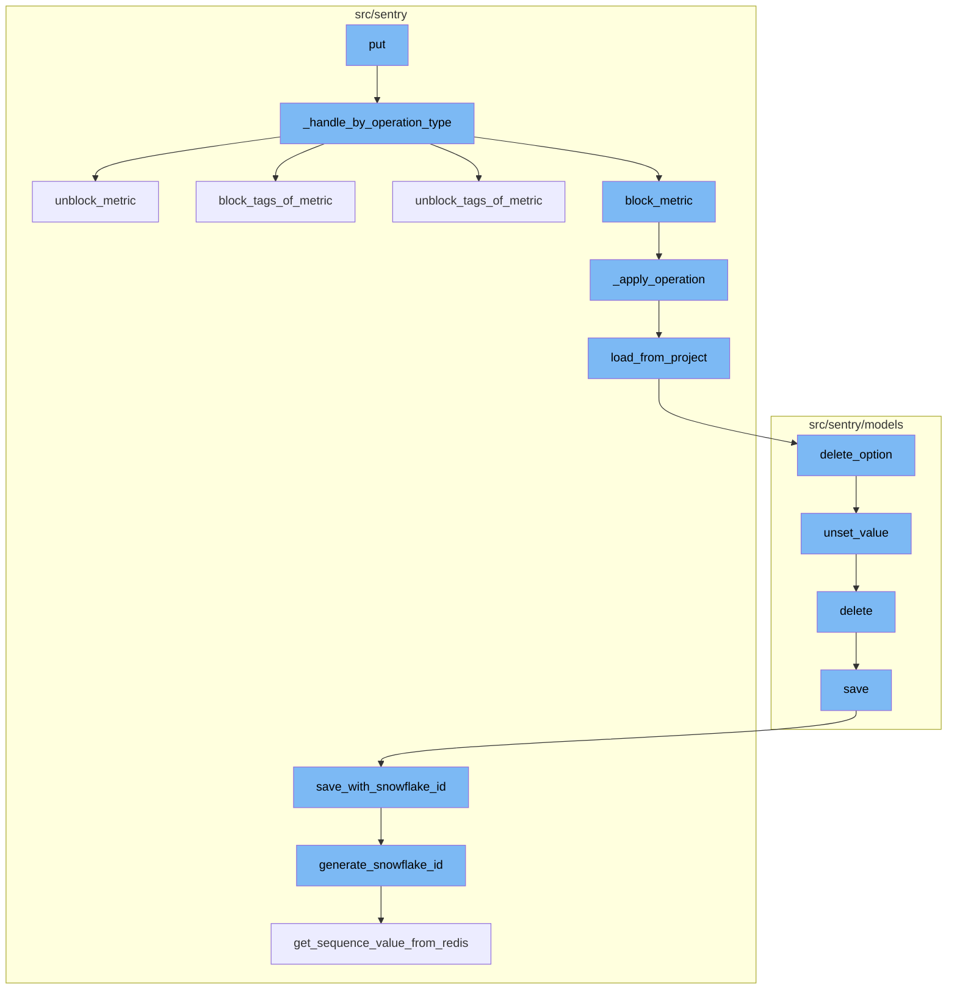
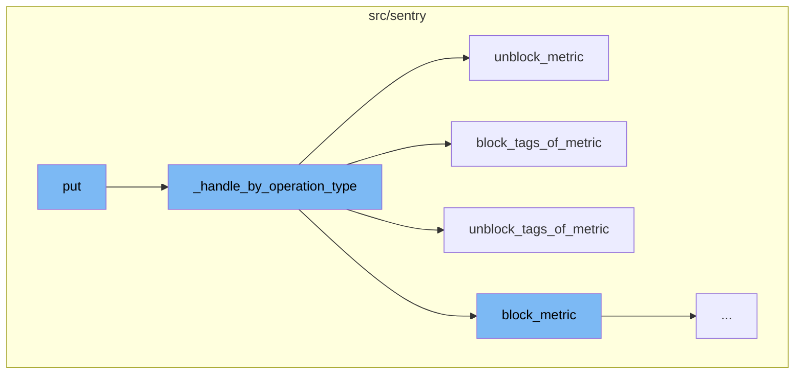
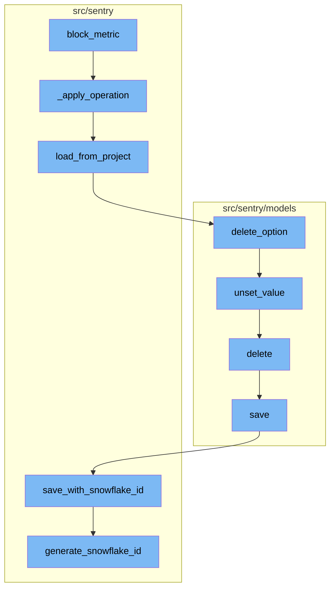

# Overview of 'put' Functionality

The 'put' function serves as the entry point for a flow that handles different types of metric operations. It takes a request and a project as parameters, extracts the 'metric_operation_type' from the request, and checks its validity. Depending on the operation type, it calls the appropriate function and creates an audit log entry. It increments a metrics counter and returns the patched metrics for the project.

# Handling Different Metric Operations

The '\_handle_by_operation_type' function is responsible for handling different types of metric operations. It extracts the 'metricMri' from the request data and checks its validity. Depending on the 'metric_operation_type', it calls the appropriate function ('block_metric', 'unblock_metric', 'block_tags_of_metric', 'unblock_tags_of_metric') and creates an audit log entry.

# Blocking and Unblocking Metrics

The 'block_metric' and 'unblock_metric' functions are called when the 'metric_operation_type' is 'BLOCK_METRIC' or 'UNBLOCK_METRIC' respectively. They increment a metrics counter and call the '\_apply_operation' function with a 'MetricOperation' object and the projects as arguments.

# Blocking and Unblocking Tags of Metrics

The 'block_tags_of_metric' and 'unblock_tags_of_metric' functions are called when the 'metric_operation_type' is 'BLOCK_TAGS' or 'UNBLOCK_TAGS' respectively. They increment a metrics counter and call the '\_apply_operation' function with a 'MetricOperation' object and the projects as arguments.

# Applying Metric Operations

The '\_apply_operation' function applies a metric operation to a sequence of projects. It loads the metrics blocking state from each project, applies the metric operation, and saves the updated state back to the project.

# Saving the Project

The 'save' function persists a project. If the project uses a snowflake ID, it saves the project with a snowflake ID. Otherwise, it saves the project normally.

# Generating Snowflake ID

The 'generate_snowflake_id' function generates a new snowflake ID. It uses a redis key to ensure uniqueness and includes a version ID, region ID, and time difference in the ID.



# Flow drill down

First, we'll zoom into this section of the flow:



<SwmSnippet path="/src/sentry/api/endpoints/project_metrics.py" line="113">

---

# The `put` Function

The `put` function is the entry point for this flow. It takes a request and a project as parameters. It extracts the `metric_operation_type` from the request and checks its validity. If the operation type is valid, it calls the `_handle_by_operation_type` function with the request, project, and operation type as arguments. If the operation type is invalid, it raises an `InvalidParams` exception. If the `_handle_by_operation_type` function throws a `MalformedBlockedMetricsPayloadError`, the `put` function returns a 500 response. Otherwise, it serializes the patched metric and returns a 200 response.

```python
    def put(self, request: Request, project: Project) -> Response:
        metric_operation_type = MetricOperationType.from_request(request)
        if not metric_operation_type:
            raise InvalidParams(
                f"You must supply a valid operation, which must be one of {MetricOperationType.available_ops()}"
            )

        try:
            patched_metric = self._handle_by_operation_type(request, project, metric_operation_type)
        except MalformedBlockedMetricsPayloadError:
            # In case one metric fails to be inserted, we abort the entire insertion since the project options are
            # likely to be corrupted.
            return Response(
                {"detail": "The blocked metrics settings are corrupted, try again"}, status=500
            )

        return Response(
            serialize(patched_metric, request.user, MetricBlockingSerializer()), status=200
        )
```

---

</SwmSnippet>

<SwmSnippet path="/src/sentry/api/endpoints/project_metrics.py" line="80">

---

# The `_handle_by_operation_type` Function

The `_handle_by_operation_type` function is responsible for handling different types of metric operations. It extracts the `metricMri` from the request data and checks its validity. If the `metricMri` is invalid, it raises an `InvalidParams` exception. Depending on the `metric_operation_type`, it calls the appropriate function (`block_metric`, `unblock_metric`, `block_tags_of_metric`, `unblock_tags_of_metric`) and creates an audit log entry. It increments a metrics counter and returns the patched metrics for the project.

```python
    def _handle_by_operation_type(
        self, request: Request, project: Project, metric_operation_type: MetricOperationType
    ) -> MetricBlocking:
        metric_mri = request.data.get("metricMri")
        if not is_mri(metric_mri):
            raise InvalidParams("You must supply a valid metric mri")

        metric_mri = cast(str, metric_mri)
        patched_metrics: Mapping[int, MetricBlocking] = {}

        if metric_operation_type == MetricOperationType.BLOCK_METRIC:
            patched_metrics = block_metric(metric_mri, [project])
            self._create_audit_log_entry("METRIC_BLOCK", metric_mri, None, project)
        elif metric_operation_type == MetricOperationType.UNBLOCK_METRIC:
            patched_metrics = unblock_metric(metric_mri, [project])
            self._create_audit_log_entry("METRIC_UNBLOCK", metric_mri, None, project)
        elif metric_operation_type == MetricOperationType.BLOCK_TAGS:
            tags = self._get_sanitized_tags(request)
            patched_metrics = block_tags_of_metric(metric_mri, set(tags), [project])
            self._create_audit_log_entry("METRIC_TAGS_BLOCK", metric_mri, tags, project)
        elif metric_operation_type == MetricOperationType.UNBLOCK_TAGS:
```

---

</SwmSnippet>

<SwmSnippet path="/src/sentry/sentry_metrics/visibility/metrics_blocking.py" line="183">

---

# The `block_metric` Function

The `block_metric` function is called when the `metric_operation_type` is `BLOCK_METRIC`. It increments a metrics counter and calls the `_apply_operation` function with a `MetricOperation` object and the projects as arguments. The `MetricOperation` object is created with the `metric_mri`, `block_metric` set to `False`, and empty sets for `block_tags` and `unblock_tags`.

```python
def unblock_metric(metric_mri: str, projects: Sequence[Project]) -> Mapping[int, MetricBlocking]:
    metrics.incr("ddm.metrics_api.unblocked_metrics_count")
    return _apply_operation(
        MetricOperation(
            metric_mri=metric_mri, block_metric=False, block_tags=set(), unblock_tags=set()
        ),
        projects,
    )
```

---

</SwmSnippet>

<SwmSnippet path="/src/sentry/sentry_metrics/visibility/metrics_blocking.py" line="183">

---

# The `unblock_metric` Function

The `unblock_metric` function is called when the `metric_operation_type` is `UNBLOCK_METRIC`. It increments a metrics counter and calls the `_apply_operation` function with a `MetricOperation` object and the projects as arguments. The `MetricOperation` object is created with the `metric_mri`, `block_metric` set to `False`, and empty sets for `block_tags` and `unblock_tags`.

```python
def unblock_metric(metric_mri: str, projects: Sequence[Project]) -> Mapping[int, MetricBlocking]:
    metrics.incr("ddm.metrics_api.unblocked_metrics_count")
    return _apply_operation(
        MetricOperation(
            metric_mri=metric_mri, block_metric=False, block_tags=set(), unblock_tags=set()
        ),
        projects,
    )
```

---

</SwmSnippet>

<SwmSnippet path="/src/sentry/sentry_metrics/visibility/metrics_blocking.py" line="193">

---

# The `block_tags_of_metric` Function

The `block_tags_of_metric` function is called when the `metric_operation_type` is `BLOCK_TAGS`. It increments a metrics counter and calls the `_apply_operation` function with a `MetricOperation` object and the projects as arguments. The `MetricOperation` object is created with the `metric_mri`, the tags to block, and an empty set for `unblock_tags`.

```python
def block_tags_of_metric(
    metric_mri: str, tags: set[str], projects: Sequence[Project]
) -> Mapping[int, MetricBlocking]:
    metrics.incr("ddm.metrics_api.blocked_metric_tags_count")
    return _apply_operation(
        MetricOperation(metric_mri=metric_mri, block_tags=tags, unblock_tags=set()), projects
    )
```

---

</SwmSnippet>

<SwmSnippet path="/src/sentry/sentry_metrics/visibility/metrics_blocking.py" line="202">

---

# The `unblock_tags_of_metric` Function

The `unblock_tags_of_metric` function is called when the `metric_operation_type` is `UNBLOCK_TAGS`. It increments a metrics counter and calls the `_apply_operation` function with a `MetricOperation` object and the projects as arguments. The `MetricOperation` object is created with the `metric_mri`, an empty set for `block_tags`, and the tags to unblock.

```python
def unblock_tags_of_metric(
    metric_mri: str, tags: set[str], projects: Sequence[Project]
) -> Mapping[int, MetricBlocking]:
    metrics.incr("ddm.metrics_api.unblocked_metric_tags_count")
    return _apply_operation(
        MetricOperation(metric_mri=metric_mri, block_tags=set(), unblock_tags=tags), projects
    )
```

---

</SwmSnippet>

Now, lets zoom into this section of the flow:



<SwmSnippet path="/src/sentry/sentry_metrics/visibility/metrics_blocking.py" line="173">

---

# Block Metric

The `block_metric` function is the starting point of the flow. It increments a counter for blocked metrics and applies an operation to block metrics for a sequence of projects.

```python
def block_metric(metric_mri: str, projects: Sequence[Project]) -> Mapping[int, MetricBlocking]:
    metrics.incr("ddm.metrics_api.blocked_metrics_count")
    return _apply_operation(
        MetricOperation(
            metric_mri=metric_mri, block_metric=True, block_tags=set(), unblock_tags=set()
        ),
        projects,
    )
```

---

</SwmSnippet>

<SwmSnippet path="/src/sentry/sentry_metrics/visibility/metrics_blocking.py" line="149">

---

# Apply Operation

The `_apply_operation` function applies a metric operation to a sequence of projects. It loads the metrics blocking state from each project, applies the metric operation, and saves the updated state back to the project.

```python
def _apply_operation(
    metric_operation: MetricOperation, projects: Sequence[Project]
) -> Mapping[int, MetricBlocking]:
    patched_metrics = {}

    for project in projects:
        metrics_blocking_state = MetricsBlockingState.load_from_project(
            project=project, repair=True
        )
        patched_blocking_metric = metrics_blocking_state.apply_metric_operation(
            metric_operation=metric_operation
        )
        metrics_blocking_state.save_to_project(project=project)

        # We store the newly patched state, or we default to empty state in case of an unblocking.
        patched_metrics[project.id] = patched_blocking_metric or MetricBlocking.empty(
            metric_mri=metric_operation.metric_mri
        )
        # We invalidate the project configuration once the updated settings were stored.
        schedule_invalidate_project_config(project_id=project.id, trigger="metrics_blocking")

```

---

</SwmSnippet>

<SwmSnippet path="/src/sentry/sentry_metrics/visibility/metrics_blocking.py" line="86">

---

# Load from Project

The `load_from_project` function retrieves the metrics blocking state from a project. If the payload is malformed, it can optionally repair it by deleting the invalid option.

```python
    def load_from_project(cls, project: Project, repair: bool = False) -> "MetricsBlockingState":
        json_payload = project.get_option(METRICS_BLOCKING_STATE_PROJECT_OPTION_KEY)
        if not json_payload:
            return MetricsBlockingState(metrics={})

        try:
            metrics_blocking_state_payload = json.loads(json_payload)
        except ValueError:
            if repair:
                project.delete_option(METRICS_BLOCKING_STATE_PROJECT_OPTION_KEY)

            raise MalformedBlockedMetricsPayloadError(
                f"Invalid metrics blocking state payload for project {project.id}"
            )

        if not isinstance(metrics_blocking_state_payload, list):
            if repair:
                project.delete_option(METRICS_BLOCKING_STATE_PROJECT_OPTION_KEY)

            raise MalformedBlockedMetricsPayloadError(
                f"The metrics blocking state payload is not a list for project {project.id}"
```

---

</SwmSnippet>

<SwmSnippet path="/src/sentry/models/project.py" line="430">

---

# Delete Option

The `delete_option` function removes an option from a project. It updates the revision for the option and unsets the value.

```python
    def delete_option(self, key: str) -> None:
        projectoptions.update_rev_for_option(self)
        self.option_manager.unset_value(self, key)
```

---

</SwmSnippet>

<SwmSnippet path="/src/sentry/models/groupmeta.py" line="76">

---

# Unset Value

The `unset_value` function removes a key-value pair from a group. It deletes the pair from the database and removes it from the cache.

```python
    def unset_value(self, instance, key):
        self.filter(group=instance, key=key).delete()
        try:
            del self.__cache[instance.id][key]
        except KeyError:
            pass
```

---

</SwmSnippet>

<SwmSnippet path="/src/sentry/models/project.py" line="722">

---

# Delete

The `delete` function removes a project. It also removes the associated notification settings.

```python
    def delete(self, **kwargs):
        # There is no foreign key relationship so we have to manually cascade.
        notifications_service.remove_notification_settings_for_project(project_id=self.id)

        with outbox_context(transaction.atomic(router.db_for_write(Project))):
            Project.outbox_for_update(self.id, self.organization_id).save()
            return super().delete(**kwargs)
```

---

</SwmSnippet>

<SwmSnippet path="/src/sentry/models/project.py" line="365">

---

# Save

The `save` function persists a project. If the project uses a snowflake ID, it saves the project with a snowflake ID. Otherwise, it saves the project normally.

```python
    def save(self, *args, **kwargs):
        if not self.slug:
            lock = locks.get(
                f"slug:project:{self.organization_id}", duration=5, name="project_slug"
            )
            with TimedRetryPolicy(10)(lock.acquire):
                slugify_instance(
                    self,
                    self.name,
                    organization=self.organization,
                    reserved=RESERVED_PROJECT_SLUGS,
                    max_length=50,
                )

        if SENTRY_USE_SNOWFLAKE:
            snowflake_redis_key = "project_snowflake_key"
            save_with_snowflake_id(
                instance=self,
                snowflake_redis_key=snowflake_redis_key,
                save_callback=lambda: super(Project, self).save(*args, **kwargs),
            )
```

---

</SwmSnippet>

<SwmSnippet path="/src/sentry/utils/snowflake.py" line="47">

---

# Save with Snowflake ID

The `save_with_snowflake_id` function saves a model instance with a snowflake ID. It generates a new snowflake ID if the instance does not have one and retries on integrity errors.

```python
def save_with_snowflake_id(
    instance: BaseModel, snowflake_redis_key: str, save_callback: Callable[[], object]
) -> None:
    assert uses_snowflake_id(
        instance.__class__
    ), "Only models decorated with uses_snowflake_id can be saved with save_with_snowflake_id()"

    for _ in range(settings.MAX_REDIS_SNOWFLAKE_RETRY_COUNTER):
        if not instance.id:
            instance.id = generate_snowflake_id(snowflake_redis_key)
        try:
            with enforce_constraints(transaction.atomic(using=router.db_for_write(type(instance)))):
                save_callback()
            return
        except IntegrityError:
            instance.id = None  # type: ignore[assignment]  # see typeddjango/django-stubs#2014
    raise MaxSnowflakeRetryError
```

---

</SwmSnippet>

<SwmSnippet path="/src/sentry/utils/snowflake.py" line="113">

---

# Generate Snowflake ID

The `generate_snowflake_id` function generates a new snowflake ID. It uses a redis key to ensure uniqueness and includes a version ID, region ID, and time difference in the ID.

```python
def generate_snowflake_id(redis_key: str) -> int:
    segment_values = {}

    segment_values[VERSION_ID] = msb_0_ordering(settings.SNOWFLAKE_VERSION_ID, VERSION_ID.length)

    try:
        segment_values[REGION_ID] = get_local_region().snowflake_id
    except RegionContextError:  # expected if running in monolith mode
        segment_values[REGION_ID] = NULL_REGION_ID

    current_time = datetime.now().timestamp()
    # supports up to 130 years
    segment_values[TIME_DIFFERENCE] = int(current_time - settings.SENTRY_SNOWFLAKE_EPOCH_START)

    snowflake_id = 0
    (
        segment_values[TIME_DIFFERENCE],
        segment_values[REGION_SEQUENCE],
    ) = get_sequence_value_from_redis(redis_key, segment_values[TIME_DIFFERENCE])

    for segment in BIT_SEGMENT_SCHEMA:
```

---

</SwmSnippet>

&nbsp;

*This is an auto-generated document by Swimm AI 🌊 and has not yet been verified by a human*

<SwmMeta version="3.0.0" repo-id="Z2l0aHViJTNBJTNBc2VudHJ5LWRlbW8lM0ElM0FTd2ltbS1EZW1v" repo-name="sentry-demo" doc-type="flows"><sup>Powered by [Swimm](/)</sup></SwmMeta>
