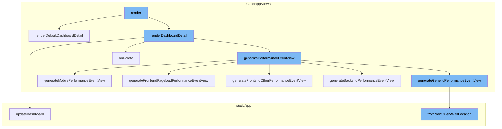
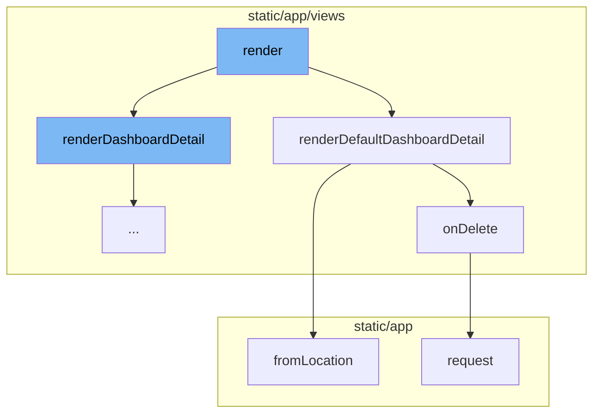
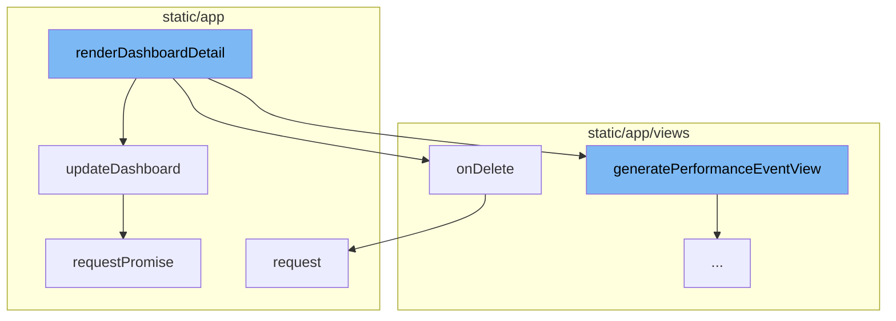
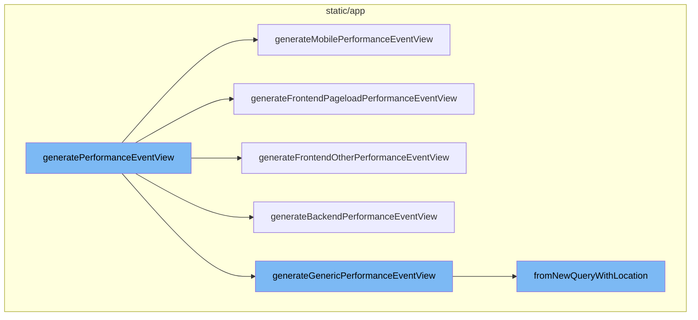

# Render Flow Overview

The render flow is a sequence of function calls that starts with the `render` function and ends with `fromNewQueryWithLocation`. This flow is responsible for rendering the dashboard details and updating them based on user interactions.

<SwmSnippet path="/static/app/views/dashboards/detail.tsx" line="1012">

---

# Render Function

The `render` function is the starting point of the render flow. It checks certain conditions and based on them, it decides which function to call next. It can either call `renderWidgetBuilder`, `renderDashboardDetail`, or `renderDefaultDashboardDetail`.

```tsx
  render() {
    const {organization} = this.props;

    if (this.isWidgetBuilderRouter) {
      return this.renderWidgetBuilder();
    }

    if (organization.features.includes('dashboards-edit')) {
      return this.renderDashboardDetail();
    }

    return this.renderDefaultDashboardDetail();
  }
```

---

</SwmSnippet>

<SwmSnippet path="/static/app/views/dashboards/detail.tsx" line="692">

---

# Render Default Dashboard Detail Function

The `renderDefaultDashboardDetail` function is responsible for rendering the default dashboard. It takes in various props and state variables and returns a JSX element. This function is called when the organization does not have the 'dashboards-edit' feature.

```tsx
  renderDefaultDashboardDetail() {
    const {organization, dashboard, dashboards, params, router, location} = this.props;
    const {modifiedDashboard, dashboardState, widgetLimitReached} = this.state;
    const {dashboardId} = params;

    return (
      <PageFiltersContainer
        disablePersistence
        defaultSelection={{
          datetime: {
            start: null,
            end: null,
            utc: false,
            period: DEFAULT_STATS_PERIOD,
          },
        }}
      >
        <Layout.Page withPadding>
          <OnDemandControlProvider location={location}>
            <MetricsResultsMetaProvider>
              <NoProjectMessage organization={organization}>
```

---

</SwmSnippet>

<SwmSnippet path="/static/app/views/admin/adminRelays.tsx" line="32">

---

# On Delete Method

The `onDelete` function is triggered when a delete action is performed. It sends a DELETE request to the server to delete a specific key. This function is used in `renderDefaultDashboardDetail` to handle the deletion of a dashboard.

```tsx
  onDelete(key: string) {
    this.setState({loading: true});
    this.props.api.request(`/relays/${key}/`, {
      method: 'DELETE',
      success: () => this.setState({loading: false}),
      error: () => this.setState({loading: false}),
    });
  }
```

---

</SwmSnippet>

<SwmSnippet path="/static/app/utils/discover/eventView.tsx" line="340">

---

# From Location Function

The `fromLocation` function is used to create an EventView object from the location. It decodes various parameters from the location query and uses them to initialize the EventView object. This function is used in `renderDefaultDashboardDetail` to create an EventView from the location.

```tsx
  static fromLocation(location: Location): EventView {
    const {start, end, statsPeriod} = normalizeDateTimeParams(location.query);

    return new EventView({
      id: decodeScalar(location.query.id),
      name: decodeScalar(location.query.name),
      fields: decodeFields(location),
      sorts: decodeSorts(location.query.sort),
      query: decodeQuery(location),
      team: decodeTeams(location),
      project: decodeProjects(location),
      start: decodeScalar(start),
      end: decodeScalar(end),
      statsPeriod: decodeScalar(statsPeriod),
      environment: collectQueryStringByKey(location.query, 'environment'),
      yAxis: decodeScalar(location.query.yAxis),
      display: decodeScalar(location.query.display),
      topEvents: decodeScalar(location.query.topEvents),
      interval: decodeScalar(location.query.interval),
      createdBy: undefined,
      additionalConditions: new MutableSearch([]),
```

---

</SwmSnippet>

<SwmSnippet path="/static/app/views/dashboards/detail.tsx" line="794">

---

# Render Dashboard Detail Function

The `renderDashboardDetail` function is the entry point of the render flow. It prepares the necessary data and state for rendering the dashboard details. It also generates the performance event view and checks if the dashboard is using transactions.

```tsx
  renderDashboardDetail() {
    const {
      api,
      organization,
      dashboard,
      dashboards,
      params,
      router,
      location,
      newWidget,
      onSetNewWidget,
      onDashboardUpdate,
      projects,
    } = this.props;
    const {modifiedDashboard, dashboardState, widgetLimitReached, seriesData, setData} =
      this.state;
    const {dashboardId} = params;

    const hasUnsavedFilters =
      dashboard.id !== 'default-overview' &&
      dashboardState !== DashboardState.CREATE &&
```

---

</SwmSnippet>

<SwmSnippet path="/static/app/actionCreators/dashboards.tsx" line="125">

---

# Update Dashboard Function

The `updateDashboard` function is called within `renderDashboardDetail`. It sends a PUT request to the server to update the dashboard details. The updated dashboard details are then returned as a promise.

```tsx
export function updateDashboard(
  api: Client,
  orgId: string,
  dashboard: DashboardDetails
): Promise<DashboardDetails> {
  const {title, widgets, projects, environment, period, start, end, filters, utc} =
    dashboard;
  const data = {
    title,
    widgets: widgets.map(widget => omit(widget, ['tempId'])),
    projects,
    environment,
    period,
    start,
    end,
    filters,
    utc,
  };

  const promise: Promise<DashboardDetails> = api.requestPromise(
    `/organizations/${orgId}/dashboards/${dashboard.id}/`,
```

---

</SwmSnippet>

<SwmSnippet path="/static/app/api.tsx" line="420">

---

# Request Method

The `request` method is a generic function for making API requests. It is used by both `updateDashboard` and `onDelete` to send requests to the server. It builds the request URL, prepares the request data, and handles the response.

```tsx
  request(path: string, options: Readonly<RequestOptions> = {}): Request {
    const method = options.method || (options.data ? 'POST' : 'GET');

    let fullUrl = buildRequestUrl(this.baseUrl, path, options);

    let data = options.data;

    if (data !== undefined && method !== 'GET' && !(data instanceof FormData)) {
      data = JSON.stringify(data);
    }

    // TODO(epurkhiser): Mimicking the old jQuery API, data could be a string /
    // object for GET requests. jQuery just sticks it onto the URL as query
    // parameters
    if (method === 'GET' && data) {
      const queryString = typeof data === 'string' ? data : qs.stringify(data);

      if (queryString.length > 0) {
        fullUrl = fullUrl + (fullUrl.includes('?') ? '&' : '?') + queryString;
      }
    }
```

---

</SwmSnippet>

<SwmSnippet path="/static/app/api.tsx" line="656">

---

# Request Promise Method

The `requestPromise` method is a wrapper around the `request` method that returns a promise. It is used by `updateDashboard` to handle the asynchronous nature of the API request.

```tsx
  requestPromise<IncludeAllArgsType extends boolean>(
    path: string,
    {
      includeAllArgs,
      ...options
    }: {includeAllArgs?: IncludeAllArgsType} & Readonly<RequestOptions> = {}
  ): Promise<IncludeAllArgsType extends true ? ApiResult : any> {
    // Create an error object here before we make any async calls so that we
    // have a helpful stack trace if it errors
    //
    // This *should* get logged to Sentry only if the promise rejection is not handled
    // (since SDK captures unhandled rejections). Ideally we explicitly ignore rejection
    // or handle with a user friendly error message
    const preservedError = new Error('API Request Error');

    return new Promise((resolve, reject) =>
      this.request(path, {
        ...options,
        preservedError,
        success: (data, textStatus, resp) => {
          if (includeAllArgs) {
```

---

</SwmSnippet>

<SwmSnippet path="/static/app/views/performance/data.tsx" line="720">

---

# Generate Performance Event View Function

The `generatePerformanceEventView` function is the entry point of the render flow. It generates a generic performance event view and then, based on the landing display field, it calls the appropriate function to generate a specific performance event view.

```tsx
export function generatePerformanceEventView(
  location: Location,
  projects: Project[],
  {isTrends = false, withStaticFilters = false} = {},
  organization: Organization
) {
  const eventView = generateGenericPerformanceEventView(
    location,
    withStaticFilters,
    organization
  );
  if (isTrends) {
    return eventView;
  }

  const display = getCurrentLandingDisplay(location, projects, eventView);
  switch (display?.field) {
    case LandingDisplayField.FRONTEND_PAGELOAD:
      return generateFrontendPageloadPerformanceEventView(
        location,
        withStaticFilters,
```

---

</SwmSnippet>

<SwmSnippet path="/static/app/views/performance/data.tsx" line="552">

---

# Generate Mobile Performance Event View Function

`generateMobilePerformanceEventView` is one of the specific performance event view generation functions. It creates a performance event view for mobile projects, adding additional fields if the organization has the 'mobile-vitals' feature. If all projects are react-native projects, it also adds the 'stall percentage' field.

```tsx
function generateMobilePerformanceEventView(
  location: Location,
  projects: Project[],
  genericEventView: EventView,
  withStaticFilters: boolean,
  organization: Organization
): EventView {
  const {query} = location;

  const fields = [
    'team_key_transaction',
    'transaction',
    'project',
    'transaction.op',
    'tpm()',
    'p75(measurements.frames_slow_rate)',
    'p75(measurements.frames_frozen_rate)',
  ];
  if (organization.features.includes('mobile-vitals')) {
    fields.push('p75(measurements.time_to_initial_display)');
  }
```

---

</SwmSnippet>

<SwmSnippet path="/static/app/views/performance/data.tsx" line="619">

---

# Generate Frontend Pageload Performance Event View Function

`generateFrontendPageloadPerformanceEventView` is another specific performance event view generation function. It creates a performance event view for frontend pageload transactions, adding fields related to web vitals.

```tsx
function generateFrontendPageloadPerformanceEventView(
  location: Location,
  withStaticFilters: boolean,
  organization: Organization
): EventView {
  const {query} = location;

  const fields = [
    'team_key_transaction',
    'transaction',
    'project',
    'tpm()',
    'p75(measurements.fcp)',
    'p75(measurements.lcp)',
    'p75(measurements.fid)',
    'p75(measurements.cls)',
    'count_unique(user)',
    'count_miserable(user)',
    'user_misery()',
  ];

```

---

</SwmSnippet>

<SwmSnippet path="/static/app/views/performance/data.tsx" line="670">

---

# Generate Frontend Other Performance Event View Function

`generateFrontendOtherPerformanceEventView` creates a performance event view for other frontend transactions, focusing on transaction duration metrics.

```tsx
function generateFrontendOtherPerformanceEventView(
  location: Location,
  withStaticFilters: boolean,
  organization: Organization
): EventView {
  const {query} = location;

  const fields = [
    'team_key_transaction',
    'transaction',
    'project',
    'transaction.op',
    'tpm()',
    'p50(transaction.duration)',
    'p75(transaction.duration)',
    'p95(transaction.duration)',
    'count_unique(user)',
    'count_miserable(user)',
    'user_misery()',
  ];

```

---

</SwmSnippet>

<SwmSnippet path="/static/app/views/performance/data.tsx" line="500">

---

# Generate Backend Performance Event View Function

`generateBackendPerformanceEventView` creates a performance event view for backend transactions, adding fields related to backend performance metrics.

```tsx
function generateBackendPerformanceEventView(
  location: Location,
  withStaticFilters: boolean,
  organization: Organization
): EventView {
  const {query} = location;

  const fields = [
    'team_key_transaction',
    'transaction',
    'project',
    'transaction.op',
    'http.method',
    'tpm()',
    'p50()',
    'p95()',
    'failure_rate()',
    'apdex()',
    'count_unique(user)',
    'count_miserable(user)',
    'user_misery()',
```

---

</SwmSnippet>

<SwmSnippet path="/static/app/views/performance/data.tsx" line="439">

---

# Generate Generic Performance Event View Function

`generateGenericPerformanceEventView` creates a generic performance event view, adding fields related to general performance metrics. It's used as a fallback when no specific performance event view generation function is applicable.

```tsx
function generateGenericPerformanceEventView(
  location: Location,
  withStaticFilters: boolean,
  organization: Organization
): EventView {
  const {query} = location;

  const fields = [
    'team_key_transaction',
    'transaction',
    'project',
    'tpm()',
    'p50()',
    'p95()',
    'failure_rate()',
    'apdex()',
    'count_unique(user)',
    'count_miserable(user)',
    'user_misery()',
  ];

```

---

</SwmSnippet>

<SwmSnippet path="/static/app/utils/discover/eventView.tsx" line="365">

---

# From New Query With Location Method

The `fromNewQueryWithLocation` method in the `EventView` class is used to create an `EventView` instance from a new query and location. It applies global selection header values from the location to the new query.

```tsx
  static fromNewQueryWithLocation(newQuery: NewQuery, location: Location): EventView {
    const query = location.query;

    // apply global selection header values from location whenever possible
    const environment: string[] =
      Array.isArray(newQuery.environment) && newQuery.environment.length > 0
        ? newQuery.environment
        : collectQueryStringByKey(query, 'environment');

    const project: number[] =
      Array.isArray(newQuery.projects) && newQuery.projects.length > 0
        ? newQuery.projects
        : decodeProjects(location);

    const saved: NewQuery = {
      ...newQuery,

      environment,
      projects: project,

      // datetime selection
```

---

</SwmSnippet>



# Flow drill down

First, we'll zoom into this section of the flow:



<SwmSnippet path="/static/app/views/dashboards/detail.tsx" line="1012">

---

# Render Flow

The `render` function is the starting point of the render flow. It checks certain conditions and based on them, it decides which function to call next. It can either call `renderWidgetBuilder`, `renderDashboardDetail`, or `renderDefaultDashboardDetail`.

```tsx
  render() {
    const {organization} = this.props;

    if (this.isWidgetBuilderRouter) {
      return this.renderWidgetBuilder();
    }

    if (organization.features.includes('dashboards-edit')) {
      return this.renderDashboardDetail();
    }

    return this.renderDefaultDashboardDetail();
  }
```

---

</SwmSnippet>

<SwmSnippet path="/static/app/views/dashboards/detail.tsx" line="692">

---

# Render Default Dashboard Detail

The `renderDefaultDashboardDetail` function is responsible for rendering the default dashboard. It takes in various props and state variables and returns a JSX element. This function is called when the organization does not have the 'dashboards-edit' feature.

```tsx
  renderDefaultDashboardDetail() {
    const {organization, dashboard, dashboards, params, router, location} = this.props;
    const {modifiedDashboard, dashboardState, widgetLimitReached} = this.state;
    const {dashboardId} = params;

    return (
      <PageFiltersContainer
        disablePersistence
        defaultSelection={{
          datetime: {
            start: null,
            end: null,
            utc: false,
            period: DEFAULT_STATS_PERIOD,
          },
        }}
      >
        <Layout.Page withPadding>
          <OnDemandControlProvider location={location}>
            <MetricsResultsMetaProvider>
              <NoProjectMessage organization={organization}>
```

---

</SwmSnippet>

<SwmSnippet path="/static/app/views/admin/adminRelays.tsx" line="32">

---

# On Delete

The `onDelete` function is triggered when a delete action is performed. It sends a DELETE request to the server to delete a specific key. This function is used in `renderDefaultDashboardDetail` to handle the deletion of a dashboard.

```tsx
  onDelete(key: string) {
    this.setState({loading: true});
    this.props.api.request(`/relays/${key}/`, {
      method: 'DELETE',
      success: () => this.setState({loading: false}),
      error: () => this.setState({loading: false}),
    });
  }
```

---

</SwmSnippet>

<SwmSnippet path="/static/app/utils/discover/eventView.tsx" line="340">

---

# From Location

The `fromLocation` function is used to create an EventView object from the location. It decodes various parameters from the location query and uses them to initialize the EventView object. This function is used in `renderDefaultDashboardDetail` to create an EventView from the location.

```tsx
  static fromLocation(location: Location): EventView {
    const {start, end, statsPeriod} = normalizeDateTimeParams(location.query);

    return new EventView({
      id: decodeScalar(location.query.id),
      name: decodeScalar(location.query.name),
      fields: decodeFields(location),
      sorts: decodeSorts(location.query.sort),
      query: decodeQuery(location),
      team: decodeTeams(location),
      project: decodeProjects(location),
      start: decodeScalar(start),
      end: decodeScalar(end),
      statsPeriod: decodeScalar(statsPeriod),
      environment: collectQueryStringByKey(location.query, 'environment'),
      yAxis: decodeScalar(location.query.yAxis),
      display: decodeScalar(location.query.display),
      topEvents: decodeScalar(location.query.topEvents),
      interval: decodeScalar(location.query.interval),
      createdBy: undefined,
      additionalConditions: new MutableSearch([]),
```

---

</SwmSnippet>

Now, lets zoom into this section of the flow:



# Render Flow

The render flow is a sequence of function calls that starts with the `render` function and ends with `fromNewQueryWithLocation`. This flow is responsible for rendering the dashboard details and updating them based on user interactions.

<SwmSnippet path="/static/app/views/dashboards/detail.tsx" line="794">

---

# renderDashboardDetail Function

The `renderDashboardDetail` function is the entry point of the render flow. It prepares the necessary data and state for rendering the dashboard details. It also generates the performance event view and checks if the dashboard is using transactions.

```tsx
  renderDashboardDetail() {
    const {
      api,
      organization,
      dashboard,
      dashboards,
      params,
      router,
      location,
      newWidget,
      onSetNewWidget,
      onDashboardUpdate,
      projects,
    } = this.props;
    const {modifiedDashboard, dashboardState, widgetLimitReached, seriesData, setData} =
      this.state;
    const {dashboardId} = params;

    const hasUnsavedFilters =
      dashboard.id !== 'default-overview' &&
      dashboardState !== DashboardState.CREATE &&
```

---

</SwmSnippet>

<SwmSnippet path="/static/app/actionCreators/dashboards.tsx" line="125">

---

# updateDashboard Function

The `updateDashboard` function is called within `renderDashboardDetail`. It sends a PUT request to the server to update the dashboard details. The updated dashboard details are then returned as a promise.

```tsx
export function updateDashboard(
  api: Client,
  orgId: string,
  dashboard: DashboardDetails
): Promise<DashboardDetails> {
  const {title, widgets, projects, environment, period, start, end, filters, utc} =
    dashboard;
  const data = {
    title,
    widgets: widgets.map(widget => omit(widget, ['tempId'])),
    projects,
    environment,
    period,
    start,
    end,
    filters,
    utc,
  };

  const promise: Promise<DashboardDetails> = api.requestPromise(
    `/organizations/${orgId}/dashboards/${dashboard.id}/`,
```

---

</SwmSnippet>

<SwmSnippet path="/static/app/views/admin/adminRelays.tsx" line="32">

---

# onDelete Method

The `onDelete` method is triggered when a user wants to delete a relay. It sends a DELETE request to the server and updates the component's state based on the response.

```tsx
  onDelete(key: string) {
    this.setState({loading: true});
    this.props.api.request(`/relays/${key}/`, {
      method: 'DELETE',
      success: () => this.setState({loading: false}),
      error: () => this.setState({loading: false}),
    });
  }
```

---

</SwmSnippet>

<SwmSnippet path="/static/app/api.tsx" line="420">

---

# request Method

The `request` method is a generic function for making API requests. It is used by both `updateDashboard` and `onDelete` to send requests to the server. It builds the request URL, prepares the request data, and handles the response.

```tsx
  request(path: string, options: Readonly<RequestOptions> = {}): Request {
    const method = options.method || (options.data ? 'POST' : 'GET');

    let fullUrl = buildRequestUrl(this.baseUrl, path, options);

    let data = options.data;

    if (data !== undefined && method !== 'GET' && !(data instanceof FormData)) {
      data = JSON.stringify(data);
    }

    // TODO(epurkhiser): Mimicking the old jQuery API, data could be a string /
    // object for GET requests. jQuery just sticks it onto the URL as query
    // parameters
    if (method === 'GET' && data) {
      const queryString = typeof data === 'string' ? data : qs.stringify(data);

      if (queryString.length > 0) {
        fullUrl = fullUrl + (fullUrl.includes('?') ? '&' : '?') + queryString;
      }
    }
```

---

</SwmSnippet>

<SwmSnippet path="/static/app/api.tsx" line="656">

---

# requestPromise Method

The `requestPromise` method is a wrapper around the `request` method that returns a promise. It is used by `updateDashboard` to handle the asynchronous nature of the API request.

```tsx
  requestPromise<IncludeAllArgsType extends boolean>(
    path: string,
    {
      includeAllArgs,
      ...options
    }: {includeAllArgs?: IncludeAllArgsType} & Readonly<RequestOptions> = {}
  ): Promise<IncludeAllArgsType extends true ? ApiResult : any> {
    // Create an error object here before we make any async calls so that we
    // have a helpful stack trace if it errors
    //
    // This *should* get logged to Sentry only if the promise rejection is not handled
    // (since SDK captures unhandled rejections). Ideally we explicitly ignore rejection
    // or handle with a user friendly error message
    const preservedError = new Error('API Request Error');

    return new Promise((resolve, reject) =>
      this.request(path, {
        ...options,
        preservedError,
        success: (data, textStatus, resp) => {
          if (includeAllArgs) {
```

---

</SwmSnippet>

Now, lets zoom into this section of the flow:



<SwmSnippet path="/static/app/views/performance/data.tsx" line="720">

---

# Render Flow

The `generatePerformanceEventView` function is the entry point of the render flow. It generates a generic performance event view and then, based on the landing display field, it calls the appropriate function to generate a specific performance event view.

```tsx
export function generatePerformanceEventView(
  location: Location,
  projects: Project[],
  {isTrends = false, withStaticFilters = false} = {},
  organization: Organization
) {
  const eventView = generateGenericPerformanceEventView(
    location,
    withStaticFilters,
    organization
  );
  if (isTrends) {
    return eventView;
  }

  const display = getCurrentLandingDisplay(location, projects, eventView);
  switch (display?.field) {
    case LandingDisplayField.FRONTEND_PAGELOAD:
      return generateFrontendPageloadPerformanceEventView(
        location,
        withStaticFilters,
```

---

</SwmSnippet>

<SwmSnippet path="/static/app/views/performance/data.tsx" line="552">

---

`generateMobilePerformanceEventView` is one of the specific performance event view generation functions. It creates a performance event view for mobile projects, adding additional fields if the organization has the 'mobile-vitals' feature. If all projects are react-native projects, it also adds the 'stall percentage' field.

```tsx
function generateMobilePerformanceEventView(
  location: Location,
  projects: Project[],
  genericEventView: EventView,
  withStaticFilters: boolean,
  organization: Organization
): EventView {
  const {query} = location;

  const fields = [
    'team_key_transaction',
    'transaction',
    'project',
    'transaction.op',
    'tpm()',
    'p75(measurements.frames_slow_rate)',
    'p75(measurements.frames_frozen_rate)',
  ];
  if (organization.features.includes('mobile-vitals')) {
    fields.push('p75(measurements.time_to_initial_display)');
  }
```

---

</SwmSnippet>

<SwmSnippet path="/static/app/views/performance/data.tsx" line="619">

---

`generateFrontendPageloadPerformanceEventView` is another specific performance event view generation function. It creates a performance event view for frontend pageload transactions, adding fields related to web vitals.

```tsx
function generateFrontendPageloadPerformanceEventView(
  location: Location,
  withStaticFilters: boolean,
  organization: Organization
): EventView {
  const {query} = location;

  const fields = [
    'team_key_transaction',
    'transaction',
    'project',
    'tpm()',
    'p75(measurements.fcp)',
    'p75(measurements.lcp)',
    'p75(measurements.fid)',
    'p75(measurements.cls)',
    'count_unique(user)',
    'count_miserable(user)',
    'user_misery()',
  ];

```

---

</SwmSnippet>

<SwmSnippet path="/static/app/views/performance/data.tsx" line="670">

---

`generateFrontendOtherPerformanceEventView` creates a performance event view for other frontend transactions, focusing on transaction duration metrics.

```tsx
function generateFrontendOtherPerformanceEventView(
  location: Location,
  withStaticFilters: boolean,
  organization: Organization
): EventView {
  const {query} = location;

  const fields = [
    'team_key_transaction',
    'transaction',
    'project',
    'transaction.op',
    'tpm()',
    'p50(transaction.duration)',
    'p75(transaction.duration)',
    'p95(transaction.duration)',
    'count_unique(user)',
    'count_miserable(user)',
    'user_misery()',
  ];

```

---

</SwmSnippet>

<SwmSnippet path="/static/app/views/performance/data.tsx" line="500">

---

`generateBackendPerformanceEventView` creates a performance event view for backend transactions, adding fields related to backend performance metrics.

```tsx
function generateBackendPerformanceEventView(
  location: Location,
  withStaticFilters: boolean,
  organization: Organization
): EventView {
  const {query} = location;

  const fields = [
    'team_key_transaction',
    'transaction',
    'project',
    'transaction.op',
    'http.method',
    'tpm()',
    'p50()',
    'p95()',
    'failure_rate()',
    'apdex()',
    'count_unique(user)',
    'count_miserable(user)',
    'user_misery()',
```

---

</SwmSnippet>

<SwmSnippet path="/static/app/views/performance/data.tsx" line="439">

---

`generateGenericPerformanceEventView` creates a generic performance event view, adding fields related to general performance metrics. It's used as a fallback when no specific performance event view generation function is applicable.

```tsx
function generateGenericPerformanceEventView(
  location: Location,
  withStaticFilters: boolean,
  organization: Organization
): EventView {
  const {query} = location;

  const fields = [
    'team_key_transaction',
    'transaction',
    'project',
    'tpm()',
    'p50()',
    'p95()',
    'failure_rate()',
    'apdex()',
    'count_unique(user)',
    'count_miserable(user)',
    'user_misery()',
  ];

```

---

</SwmSnippet>

<SwmSnippet path="/static/app/utils/discover/eventView.tsx" line="365">

---

The `fromNewQueryWithLocation` method in the `EventView` class is used to create an `EventView` instance from a new query and location. It applies global selection header values from the location to the new query.

```tsx
  static fromNewQueryWithLocation(newQuery: NewQuery, location: Location): EventView {
    const query = location.query;

    // apply global selection header values from location whenever possible
    const environment: string[] =
      Array.isArray(newQuery.environment) && newQuery.environment.length > 0
        ? newQuery.environment
        : collectQueryStringByKey(query, 'environment');

    const project: number[] =
      Array.isArray(newQuery.projects) && newQuery.projects.length > 0
        ? newQuery.projects
        : decodeProjects(location);

    const saved: NewQuery = {
      ...newQuery,

      environment,
      projects: project,

      // datetime selection
```

---

</SwmSnippet>

&nbsp;

*This is an auto-generated document by Swimm AI 🌊 and has not yet been verified by a human*

<SwmMeta version="3.0.0" repo-id="Z2l0aHViJTNBJTNBc2VudHJ5LWRlbW8lM0ElM0FTd2ltbS1EZW1v" repo-name="sentry-demo" doc-type="flows"><sup>Powered by [Swimm](/)</sup></SwmMeta>
