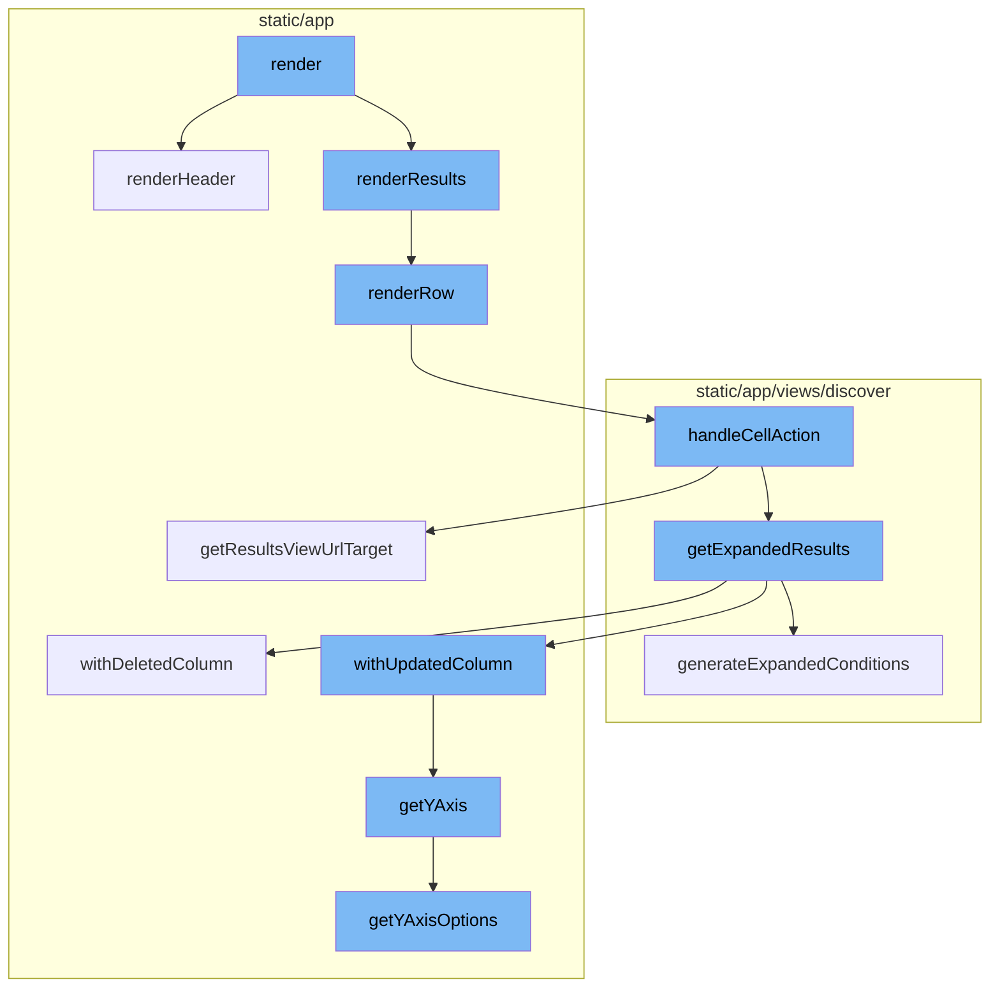
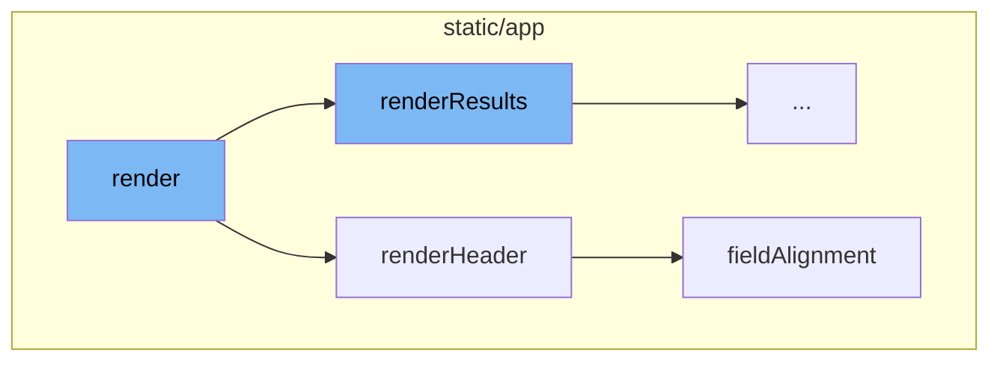
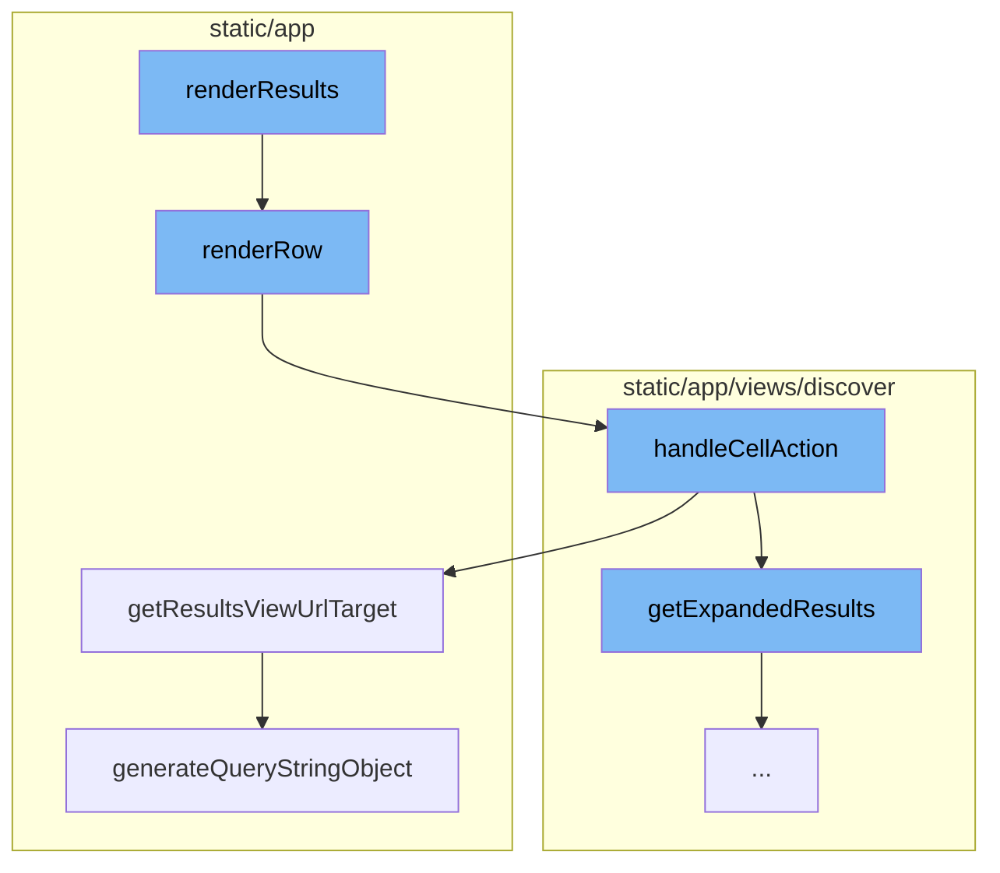
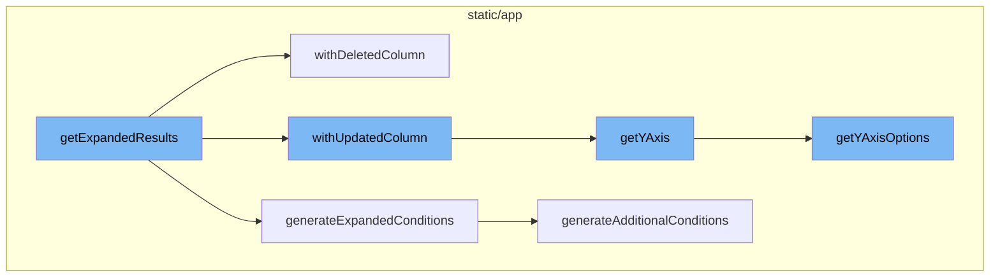

# Render Flow Overview

The render flow is a sequence of function calls that are made to display data on the screen. It begins with the `render` function, which is responsible for rendering the main component. This function uses the `isLoading` and `tableData` props to determine the state of the component. If data is available, it calls `renderHeader` and `renderResults` to render the table headers and results respectively.

<SwmSnippet path="/static/app/components/discover/transactionsTable.tsx" line="58">

---

# RenderHeader Function

The `renderHeader` function is called within the `render` function to generate the headers of the transactions table. It uses the `tableData` and `columnOrder` props to create the headers. For each column, it calls the `fieldAlignment` function to determine the alignment of the column.

```tsx
  renderHeader() {
    const {tableData, columnOrder} = this.props;

    const tableMeta = tableData?.meta;
    const generateSortLink = () => undefined;
    const tableTitles = this.getTitles();

    const headers = tableTitles.map((title, index) => {
      const column = columnOrder[index];
      const align: Alignments = fieldAlignment(column.name, column.type, tableMeta);

      if (column.key === 'span_ops_breakdown.relative') {
        return (
          <HeadCellContainer key={index}>
            <SortLink
              align={align}
              title={
                title === t('operation duration') ? (
                  <Fragment>
                    {title}
                    <StyledIconQuestion
```

---

</SwmSnippet>

<SwmSnippet path="/static/app/utils/discover/fields.tsx" line="1308">

---

# FieldAlignment Function

The `fieldAlignment` function is used to determine the alignment of a column in the transactions table. It takes the column name, column type, and metadata as parameters and returns the alignment ('left' or 'right').

```tsx
export function fieldAlignment(
  columnName: string,
  columnType?: undefined | ColumnValueType,
  metadata?: Record<string, ColumnValueType>
): Alignments {
  let align: Alignments = 'left';
  if (isMRIField(columnName)) {
    return 'right';
  }
  if (columnType) {
    align = alignedTypes.includes(columnType) ? 'right' : 'left';
  }
  if (columnType === undefined || columnType === 'never') {
    // fallback to align the column based on the table metadata
    const maybeType = metadata ? metadata[getAggregateAlias(columnName)] : undefined;

    if (maybeType !== undefined && alignedTypes.includes(maybeType)) {
      align = 'right';
    }
  }
  return align;
```

---

</SwmSnippet>

<SwmSnippet path="/static/app/components/discover/transactionsTable.tsx" line="200">

---

# RenderResults Function

The `renderResults` function is the starting point of the render flow. It checks if the data is loading or if there's no data available. If there's data, it iterates over each row of the data, calling the `renderRow` function for each row and concatenating the results.

```tsx
  renderResults() {
    const {isLoading, tableData, columnOrder} = this.props;
    let cells: React.ReactNode[] = [];

    if (isLoading) {
      return cells;
    }
    if (!tableData || !tableData.meta || !tableData.data) {
      return cells;
    }

    tableData.data.forEach((row, i: number) => {
      // Another check to appease tsc
      if (!tableData.meta) {
        return;
      }
      cells = cells.concat(this.renderRow(row, i, columnOrder, tableData.meta));
    });
    return cells;
  }
```

---

</SwmSnippet>

<SwmSnippet path="/static/app/components/discover/transactionsTable.tsx" line="114">

---

# RenderRow Function

The `renderRow` function is responsible for rendering each row of the table. It maps over each column in the row, rendering the appropriate field for each column. If a `handleCellAction` function is provided, it wraps the rendered cell in a `CellAction` component.

```tsx
  renderRow(
    row: TableDataRow,
    rowIndex: number,
    columnOrder: TableColumn<React.ReactText>[],
    tableMeta: MetaType
  ): React.ReactNode[] {
    const {
      eventView,
      organization,
      location,
      generateLink,
      handleCellAction,
      titles,
      useAggregateAlias,
      referrer,
    } = this.props;
    const fields = eventView.getFields();

    if (titles?.length) {
      // Slice to match length of given titles
      columnOrder = columnOrder.slice(0, titles.length);
```

---

</SwmSnippet>

<SwmSnippet path="/static/app/views/discover/table/tableView.tsx" line="526">

---

# HandleCellAction Function

The `handleCellAction` function is triggered when a cell action is performed. It handles different actions like `RELEASE` and `DRILLDOWN`, and updates the query accordingly. After updating the query, it redirects to the new URL using `browserHistory.push`.

```tsx
  function handleCellAction(
    dataRow: TableDataRow,
    column: TableColumn<keyof TableDataRow>
  ) {
    return (action: Actions, value: React.ReactText) => {
      const {eventView, organization, location, tableData, isHomepage} = props;

      const query = new MutableSearch(eventView.query);

      let nextView = eventView.clone();
      trackAnalytics('discover_v2.results.cellaction', {
        organization,
        action,
      });

      switch (action) {
        case Actions.RELEASE: {
          const maybeProject = projects.find(project => {
            return project.slug === dataRow.project;
          });

```

---

</SwmSnippet>

<SwmSnippet path="/static/app/utils/discover/eventView.tsx" line="1190">

---

# GetResultsViewUrlTarget Function

The `getResultsViewUrlTarget` function is used to generate the URL for the results view. It takes the organization slug and a boolean indicating if it's the homepage as parameters, and returns an object containing the pathname and query string.

```tsx
  getResultsViewUrlTarget(
    slug: string,
    isHomepage: boolean = false
  ): {pathname: string; query: Query} {
    const target = isHomepage ? 'homepage' : 'results';
    return {
      pathname: normalizeUrl(`/organizations/${slug}/discover/${target}/`),
      query: this.generateQueryStringObject(),
    };
  }
```

---

</SwmSnippet>

<SwmSnippet path="/static/app/utils/discover/eventView.tsx" line="672">

---

# GenerateQueryStringObject Function

The `generateQueryStringObject` function is used to generate the query string object for the URL. It includes all the necessary parameters like `id`, `name`, `field`, `sort`, `environment`, `project`, `query`, `yAxis`, `dataset`, `display`, `topEvents`, and `interval`.

```tsx
  generateQueryStringObject(): Query {
    const output = {
      id: this.id,
      name: this.name,
      field: this.getFields(),
      widths: this.getWidths(),
      sort: encodeSorts(this.sorts),
      environment: this.environment,
      project: this.project,
      query: this.query,
      yAxis: this.yAxis || this.getYAxis(),
      dataset: this.dataset,
      display: this.display,
      topEvents: this.topEvents,
      interval: this.interval,
    };

    for (const field of EXTERNAL_QUERY_STRING_KEYS) {
      if (this[field]?.length) {
        output[field] = this[field];
      }
```

---

</SwmSnippet>

<SwmSnippet path="/static/app/views/discover/utils.tsx" line="262">

---

# GetExpandedResults Function

The `getExpandedResults` function is used to convert an aggregated query into one that does not have aggregates. It also applies additional conditions defined in `additionalConditions` and generates conditions based on the `dataRow` parameter and the current fields in the `eventView`.

```tsx
export function getExpandedResults(
  eventView: EventView,
  additionalConditions: Record<string, string>,
  dataRow?: TableDataRow | Event
): EventView {
  const fieldSet = new Set();
  // Expand any functions in the resulting column, and dedupe the result.
  // Mark any column as null to remove it.
  const expandedColumns: (Column | null)[] = eventView.fields.map((field: Field) => {
    const exploded = explodeFieldString(field.field, field.alias);
    const column = exploded.kind === 'function' ? drilldownAggregate(exploded) : exploded;

    if (
      // if expanding the function failed
      column === null ||
      // the new column is already present
      fieldSet.has(column.field) ||
      // Skip aggregate equations, their functions will already be added so we just want to remove it
      isAggregateEquation(field.field)
    ) {
      return null;
```

---

</SwmSnippet>

<SwmSnippet path="/static/app/utils/discover/eventView.tsx" line="877">

---

# WithDeletedColumn Method

The `withDeletedColumn` method is used to remove a column from the event view. If the column to be deleted is one of the sorted columns, it is removed from the list of sorts.

```tsx
  withUpdatedColumn(
    columnIndex: number,
    updatedColumn: Column,
    tableMeta: MetaType | undefined
  ): EventView {
    const columnToBeUpdated = this.fields[columnIndex];
    const fieldAsString = generateFieldAsString(updatedColumn);

    const updateField = columnToBeUpdated.field !== fieldAsString;
    if (!updateField) {
      return this;
    }

    // ensure tableMeta is non-empty
    tableMeta = validateTableMeta(tableMeta);

    const newEventView = this.clone();

    const updatedField: Field = {
      field: fieldAsString,
      width: COL_WIDTH_UNDEFINED,
```

---

</SwmSnippet>

<SwmSnippet path="/static/app/views/discover/utils.tsx" line="423">

---

# GenerateExpandedConditions Function

The `generateExpandedConditions` function is used to create additional conditions based on the fields in an EventView and a datarow/event. It removes any aggregates from the search conditions to avoid leading to an invalid query result.

```tsx
function generateExpandedConditions(
  eventView: EventView,
  additionalConditions: Record<string, string>,
  dataRow?: TableDataRow | Event
): string {
  const parsedQuery = new MutableSearch(eventView.query);

  // Remove any aggregates from the search conditions.
  // otherwise, it'll lead to an invalid query result.
  for (const key in parsedQuery.filters) {
    const column = explodeFieldString(key);
    if (column.kind === 'function') {
      parsedQuery.removeFilter(key);
    }
  }

  const conditions: Record<string, string | string[]> = Object.assign(
    {},
    additionalConditions,
    generateAdditionalConditions(eventView, dataRow)
  );
```

---

</SwmSnippet>

<SwmSnippet path="/static/app/utils/discover/eventView.tsx" line="877">

---

# WithUpdatedColumn Method

The `withUpdatedColumn` method is used to update a column in the event view. If the updated column is one of the sorted columns, it may need to be removed from the list of sorts.

```tsx
  withUpdatedColumn(
    columnIndex: number,
    updatedColumn: Column,
    tableMeta: MetaType | undefined
  ): EventView {
    const columnToBeUpdated = this.fields[columnIndex];
    const fieldAsString = generateFieldAsString(updatedColumn);

    const updateField = columnToBeUpdated.field !== fieldAsString;
    if (!updateField) {
      return this;
    }

    // ensure tableMeta is non-empty
    tableMeta = validateTableMeta(tableMeta);

    const newEventView = this.clone();

    const updatedField: Field = {
      field: fieldAsString,
      width: COL_WIDTH_UNDEFINED,
```

---

</SwmSnippet>

<SwmSnippet path="/static/app/utils/discover/eventView.tsx" line="1319">

---

# GetYAxis Method

The `getYAxis` method is used to get the Y-axis of the event view. It ensures that the current selected Y-axis is one of the items in Y-axis options.

```tsx
  getYAxis(): string {
    const yAxisOptions = this.getYAxisOptions();

    const yAxis = this.yAxis;
    const defaultOption = yAxisOptions[0].value;

    if (!yAxis) {
      return defaultOption;
    }

    // ensure current selected yAxis is one of the items in yAxisOptions
    const result = yAxisOptions.findIndex(
      (option: SelectValue<string>) => option.value === yAxis
    );

    if (result >= 0) {
      return typeof yAxis === 'string' ? yAxis : yAxis[0];
    }

    return defaultOption;
  }
```

---

</SwmSnippet>

<SwmSnippet path="/static/app/utils/discover/eventView.tsx" line="1300">

---

# GetYAxisOptions Method

The `getYAxisOptions` method is used to get the Y-axis options of the event view. It only includes aggregates that make sense to be graphable.

```tsx
  getYAxisOptions(): SelectValue<string>[] {
    // Make option set and add the default options in.
    return uniqBy(
      this.getAggregateFields()
        // Only include aggregates that make sense to be graphable (eg. not string or date)
        .filter(
          (field: Field) =>
            isLegalYAxisType(aggregateOutputType(field.field)) ||
            isAggregateEquation(field.field)
        )
        .map((field: Field) => ({
          label: isEquation(field.field) ? getEquation(field.field) : field.field,
          value: field.field,
        }))
        .concat(CHART_AXIS_OPTIONS),
      'value'
    );
  }
```

---

</SwmSnippet>



# Flow drill down

First, we'll zoom into this section of the flow:



<SwmSnippet path="/static/app/components/discover/transactionsTable.tsx" line="221">

---

# Render Function

The `render` function is the main function responsible for rendering the transactions table. It uses the `isLoading` and `tableData` props to determine the state of the table. If data is available, it calls `renderHeader` and `renderResults` to render the table headers and results respectively.

```tsx
  render() {
    const {isLoading, tableData} = this.props;

    const hasResults = tableData?.meta && tableData.data?.length > 0;

    // Custom set the height so we don't have layout shift when results are loaded.
    const loader = <LoadingIndicator style={{margin: '70px auto'}} />;

    return (
      <VisuallyCompleteWithData
        id="TransactionsTable"
        hasData={hasResults}
        isLoading={isLoading}
      >
        <PanelTable
          data-test-id="transactions-table"
          isEmpty={!hasResults}
          emptyMessage={t('No transactions found')}
          headers={this.renderHeader()}
          isLoading={isLoading}
          disablePadding
```

---

</SwmSnippet>

<SwmSnippet path="/static/app/components/discover/transactionsTable.tsx" line="58">

---

# RenderHeader Function

The `renderHeader` function is called within the `render` function to generate the headers of the transactions table. It uses the `tableData` and `columnOrder` props to create the headers. For each column, it calls the `fieldAlignment` function to determine the alignment of the column.

```tsx
  renderHeader() {
    const {tableData, columnOrder} = this.props;

    const tableMeta = tableData?.meta;
    const generateSortLink = () => undefined;
    const tableTitles = this.getTitles();

    const headers = tableTitles.map((title, index) => {
      const column = columnOrder[index];
      const align: Alignments = fieldAlignment(column.name, column.type, tableMeta);

      if (column.key === 'span_ops_breakdown.relative') {
        return (
          <HeadCellContainer key={index}>
            <SortLink
              align={align}
              title={
                title === t('operation duration') ? (
                  <Fragment>
                    {title}
                    <StyledIconQuestion
```

---

</SwmSnippet>

<SwmSnippet path="/static/app/utils/discover/fields.tsx" line="1308">

---

# FieldAlignment Function

The `fieldAlignment` function is used to determine the alignment of a column in the transactions table. It takes the column name, column type, and metadata as parameters and returns the alignment ('left' or 'right').

```tsx
export function fieldAlignment(
  columnName: string,
  columnType?: undefined | ColumnValueType,
  metadata?: Record<string, ColumnValueType>
): Alignments {
  let align: Alignments = 'left';
  if (isMRIField(columnName)) {
    return 'right';
  }
  if (columnType) {
    align = alignedTypes.includes(columnType) ? 'right' : 'left';
  }
  if (columnType === undefined || columnType === 'never') {
    // fallback to align the column based on the table metadata
    const maybeType = metadata ? metadata[getAggregateAlias(columnName)] : undefined;

    if (maybeType !== undefined && alignedTypes.includes(maybeType)) {
      align = 'right';
    }
  }
  return align;
```

---

</SwmSnippet>

Now, lets zoom into this section of the flow:



<SwmSnippet path="/static/app/components/discover/transactionsTable.tsx" line="200">

---

# Render Flow

The `renderResults` function is the starting point of the render flow. It checks if the data is loading or if there's no data available. If there's data, it iterates over each row of the data, calling the `renderRow` function for each row and concatenating the results.

```tsx
  renderResults() {
    const {isLoading, tableData, columnOrder} = this.props;
    let cells: React.ReactNode[] = [];

    if (isLoading) {
      return cells;
    }
    if (!tableData || !tableData.meta || !tableData.data) {
      return cells;
    }

    tableData.data.forEach((row, i: number) => {
      // Another check to appease tsc
      if (!tableData.meta) {
        return;
      }
      cells = cells.concat(this.renderRow(row, i, columnOrder, tableData.meta));
    });
    return cells;
  }
```

---

</SwmSnippet>

<SwmSnippet path="/static/app/components/discover/transactionsTable.tsx" line="114">

---

The `renderRow` function is responsible for rendering each row of the table. It maps over each column in the row, rendering the appropriate field for each column. If a `handleCellAction` function is provided, it wraps the rendered cell in a `CellAction` component.

```tsx
  renderRow(
    row: TableDataRow,
    rowIndex: number,
    columnOrder: TableColumn<React.ReactText>[],
    tableMeta: MetaType
  ): React.ReactNode[] {
    const {
      eventView,
      organization,
      location,
      generateLink,
      handleCellAction,
      titles,
      useAggregateAlias,
      referrer,
    } = this.props;
    const fields = eventView.getFields();

    if (titles?.length) {
      // Slice to match length of given titles
      columnOrder = columnOrder.slice(0, titles.length);
```

---

</SwmSnippet>

<SwmSnippet path="/static/app/views/discover/table/tableView.tsx" line="526">

---

The `handleCellAction` function is triggered when a cell action is performed. It handles different actions like `RELEASE` and `DRILLDOWN`, and updates the query accordingly. After updating the query, it redirects to the new URL using `browserHistory.push`.

```tsx
  function handleCellAction(
    dataRow: TableDataRow,
    column: TableColumn<keyof TableDataRow>
  ) {
    return (action: Actions, value: React.ReactText) => {
      const {eventView, organization, location, tableData, isHomepage} = props;

      const query = new MutableSearch(eventView.query);

      let nextView = eventView.clone();
      trackAnalytics('discover_v2.results.cellaction', {
        organization,
        action,
      });

      switch (action) {
        case Actions.RELEASE: {
          const maybeProject = projects.find(project => {
            return project.slug === dataRow.project;
          });

```

---

</SwmSnippet>

<SwmSnippet path="/static/app/utils/discover/eventView.tsx" line="1190">

---

The `getResultsViewUrlTarget` function is used to generate the URL for the results view. It takes the organization slug and a boolean indicating if it's the homepage as parameters, and returns an object containing the pathname and query string.

```tsx
  getResultsViewUrlTarget(
    slug: string,
    isHomepage: boolean = false
  ): {pathname: string; query: Query} {
    const target = isHomepage ? 'homepage' : 'results';
    return {
      pathname: normalizeUrl(`/organizations/${slug}/discover/${target}/`),
      query: this.generateQueryStringObject(),
    };
  }
```

---

</SwmSnippet>

<SwmSnippet path="/static/app/utils/discover/eventView.tsx" line="672">

---

The `generateQueryStringObject` function is used to generate the query string object for the URL. It includes all the necessary parameters like `id`, `name`, `field`, `sort`, `environment`, `project`, `query`, `yAxis`, `dataset`, `display`, `topEvents`, and `interval`.

```tsx
  generateQueryStringObject(): Query {
    const output = {
      id: this.id,
      name: this.name,
      field: this.getFields(),
      widths: this.getWidths(),
      sort: encodeSorts(this.sorts),
      environment: this.environment,
      project: this.project,
      query: this.query,
      yAxis: this.yAxis || this.getYAxis(),
      dataset: this.dataset,
      display: this.display,
      topEvents: this.topEvents,
      interval: this.interval,
    };

    for (const field of EXTERNAL_QUERY_STRING_KEYS) {
      if (this[field]?.length) {
        output[field] = this[field];
      }
```

---

</SwmSnippet>

Now, lets zoom into this section of the flow:



# Render Flow

The render flow in this context refers to the sequence of function calls that are made to render the data. It starts with the `render` function, which then calls `renderResults`, `renderRow`, `handleCellAction`, `getExpandedResults`, `withUpdatedColumn`, `getYAxis`, and finally `getYAxisOptions`.

<SwmSnippet path="/static/app/views/discover/utils.tsx" line="262">

---

# getExpandedResults Function

The `getExpandedResults` function is used to convert an aggregated query into one that does not have aggregates. It also applies additional conditions defined in `additionalConditions` and generates conditions based on the `dataRow` parameter and the current fields in the `eventView`.

```tsx
export function getExpandedResults(
  eventView: EventView,
  additionalConditions: Record<string, string>,
  dataRow?: TableDataRow | Event
): EventView {
  const fieldSet = new Set();
  // Expand any functions in the resulting column, and dedupe the result.
  // Mark any column as null to remove it.
  const expandedColumns: (Column | null)[] = eventView.fields.map((field: Field) => {
    const exploded = explodeFieldString(field.field, field.alias);
    const column = exploded.kind === 'function' ? drilldownAggregate(exploded) : exploded;

    if (
      // if expanding the function failed
      column === null ||
      // the new column is already present
      fieldSet.has(column.field) ||
      // Skip aggregate equations, their functions will already be added so we just want to remove it
      isAggregateEquation(field.field)
    ) {
      return null;
```

---

</SwmSnippet>

<SwmSnippet path="/static/app/utils/discover/eventView.tsx" line="971">

---

# withDeletedColumn Method

The `withDeletedColumn` method is used to remove a column from the event view. If the column to be deleted is one of the sorted columns, it is removed from the list of sorts.

```tsx
  withDeletedColumn(columnIndex: number, tableMeta: MetaType | undefined): EventView {
    // Disallow removal of the orphan column, and check for out-of-bounds
    if (this.fields.length <= 1 || this.fields.length <= columnIndex || columnIndex < 0) {
      return this;
    }

    // ensure tableMeta is non-empty
    tableMeta = validateTableMeta(tableMeta);

    // delete the column
    const newEventView = this.clone();
    const fields = [...newEventView.fields];
    fields.splice(columnIndex, 1);
    newEventView.fields = fields;

    // Ensure there is at least one auto width column
    // To ensure a well formed table results.
    const hasAutoIndex = fields.find(field => field.width === COL_WIDTH_UNDEFINED);
    if (!hasAutoIndex) {
      newEventView.fields[0].width = COL_WIDTH_UNDEFINED;
    }
```

---

</SwmSnippet>

<SwmSnippet path="/static/app/views/discover/utils.tsx" line="423">

---

# generateExpandedConditions Function

The `generateExpandedConditions` function is used to create additional conditions based on the fields in an EventView and a datarow/event. It removes any aggregates from the search conditions to avoid leading to an invalid query result.

```tsx
function generateExpandedConditions(
  eventView: EventView,
  additionalConditions: Record<string, string>,
  dataRow?: TableDataRow | Event
): string {
  const parsedQuery = new MutableSearch(eventView.query);

  // Remove any aggregates from the search conditions.
  // otherwise, it'll lead to an invalid query result.
  for (const key in parsedQuery.filters) {
    const column = explodeFieldString(key);
    if (column.kind === 'function') {
      parsedQuery.removeFilter(key);
    }
  }

  const conditions: Record<string, string | string[]> = Object.assign(
    {},
    additionalConditions,
    generateAdditionalConditions(eventView, dataRow)
  );
```

---

</SwmSnippet>

<SwmSnippet path="/static/app/utils/discover/eventView.tsx" line="877">

---

# withUpdatedColumn Method

The `withUpdatedColumn` method is used to update a column in the event view. If the updated column is one of the sorted columns, it may need to be removed from the list of sorts.

```tsx
  withUpdatedColumn(
    columnIndex: number,
    updatedColumn: Column,
    tableMeta: MetaType | undefined
  ): EventView {
    const columnToBeUpdated = this.fields[columnIndex];
    const fieldAsString = generateFieldAsString(updatedColumn);

    const updateField = columnToBeUpdated.field !== fieldAsString;
    if (!updateField) {
      return this;
    }

    // ensure tableMeta is non-empty
    tableMeta = validateTableMeta(tableMeta);

    const newEventView = this.clone();

    const updatedField: Field = {
      field: fieldAsString,
      width: COL_WIDTH_UNDEFINED,
```

---

</SwmSnippet>

<SwmSnippet path="/static/app/utils/discover/eventView.tsx" line="1319">

---

# getYAxis Method

The `getYAxis` method is used to get the Y-axis of the event view. It ensures that the current selected Y-axis is one of the items in Y-axis options.

```tsx
  getYAxis(): string {
    const yAxisOptions = this.getYAxisOptions();

    const yAxis = this.yAxis;
    const defaultOption = yAxisOptions[0].value;

    if (!yAxis) {
      return defaultOption;
    }

    // ensure current selected yAxis is one of the items in yAxisOptions
    const result = yAxisOptions.findIndex(
      (option: SelectValue<string>) => option.value === yAxis
    );

    if (result >= 0) {
      return typeof yAxis === 'string' ? yAxis : yAxis[0];
    }

    return defaultOption;
  }
```

---

</SwmSnippet>

<SwmSnippet path="/static/app/utils/discover/eventView.tsx" line="1300">

---

# getYAxisOptions Method

The `getYAxisOptions` method is used to get the Y-axis options of the event view. It only includes aggregates that make sense to be graphable.

```tsx
  getYAxisOptions(): SelectValue<string>[] {
    // Make option set and add the default options in.
    return uniqBy(
      this.getAggregateFields()
        // Only include aggregates that make sense to be graphable (eg. not string or date)
        .filter(
          (field: Field) =>
            isLegalYAxisType(aggregateOutputType(field.field)) ||
            isAggregateEquation(field.field)
        )
        .map((field: Field) => ({
          label: isEquation(field.field) ? getEquation(field.field) : field.field,
          value: field.field,
        }))
        .concat(CHART_AXIS_OPTIONS),
      'value'
    );
  }
```

---

</SwmSnippet>

&nbsp;

*This is an auto-generated document by Swimm AI 🌊 and has not yet been verified by a human*

<SwmMeta version="3.0.0" repo-id="Z2l0aHViJTNBJTNBc2VudHJ5LWRlbW8lM0ElM0FTd2ltbS1EZW1v" repo-name="sentry-demo" doc-type="flows"><sup>Powered by [Swimm](/)</sup></SwmMeta>
