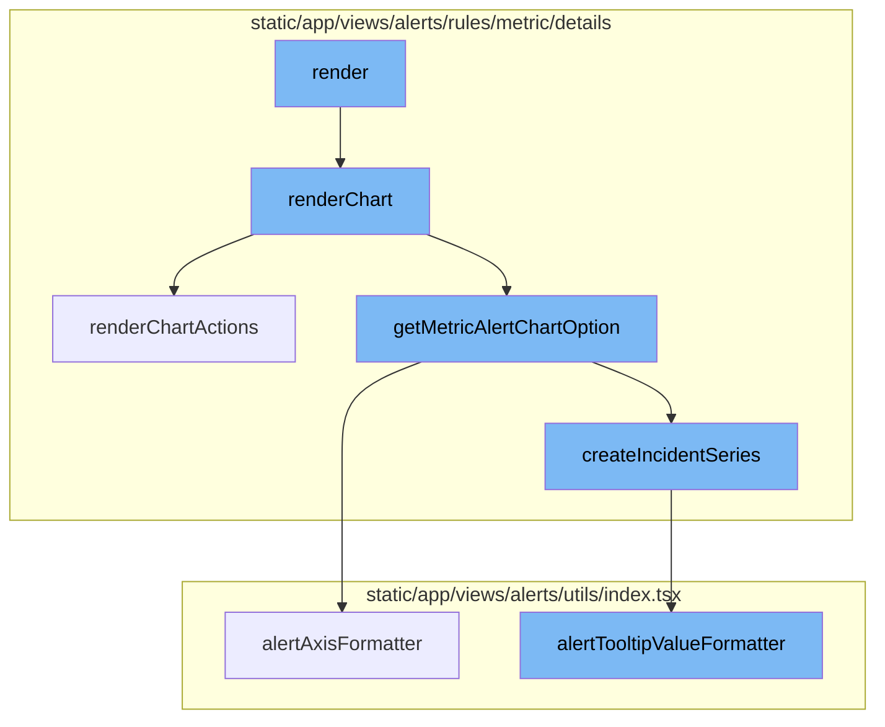
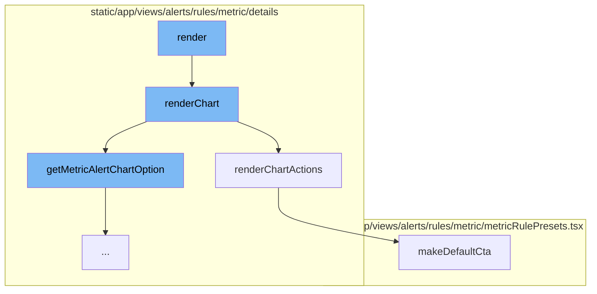
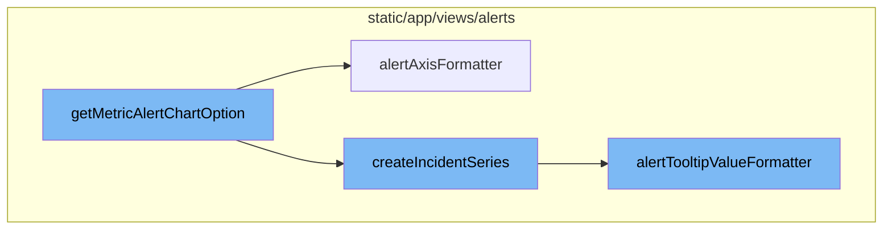

<SwmSnippet path="/static/app/views/alerts/rules/metric/details/metricChart.tsx" line="500">

---

# Render Flow

The `render` method is the starting point of the render flow. It prepares the necessary data and conditions for rendering the chart. Depending on the dataset, it either makes a `SessionsRequest` or an `EventsRequest`. The response from these requests is then passed to the `renderChart` method.

```tsx
  render() {
    const {
      api,
      rule,
      organization,
      timePeriod,
      project,
      interval,
      query,
      location,
      isOnDemandAlert,
      selectedIncident,
    } = this.props;
    const {aggregate, timeWindow, environment, dataset} = rule;

    // Fix for 7 days * 1m interval being over the max number of results from events api
    // 10k events is the current max
    if (
      timePeriod.usingPeriod &&
      timePeriod.period === TimePeriod.SEVEN_DAYS &&
      interval === '1m'
```

---

</SwmSnippet>

<SwmSnippet path="/static/app/views/alerts/rules/metric/details/metricChart.tsx" line="252">

---

The `renderChart` method is responsible for rendering the chart. It first checks if the data is loading or if there is no data, in which case it calls the `renderEmpty` method. If there is data, it prepares the chart options and additional series, and then renders the chart using the `AreaChart` component. It also prepares the tooltip formatter for the chart.

```tsx
  renderChart(
    loading: boolean,
    timeseriesData?: Series[],
    minutesThresholdToDisplaySeconds?: number,
    comparisonTimeseriesData?: Series[]
  ) {
    const {
      router,
      selectedIncident,
      interval,
      filter,
      incidents,
      rule,
      organization,
      timePeriod: {start, end},
    } = this.props;
    const {dateModified, timeWindow} = rule;

    if (loading || !timeseriesData) {
      return this.renderEmpty();
    }
```

---

</SwmSnippet>

<SwmSnippet path="/static/app/views/alerts/rules/metric/details/metricChart.tsx" line="168">

---

The `renderChartActions` method is responsible for rendering the chart actions. It calculates the percentages for resolved, warning, critical, and waiting for data durations. It then renders these percentages along with a button that links to either the Discover or Metrics page, depending on the aggregate of the rule.

```tsx
  renderChartActions(
    totalDuration: number,
    criticalDuration: number,
    warningDuration: number,
    waitingForDataDuration: number
  ) {
    const {rule, organization, project, timePeriod, query} = this.props;

    let dataset: DiscoverDatasets | undefined = undefined;
    if (shouldUseErrorsDataset(rule.dataset, query)) {
      dataset = DiscoverDatasets.ERRORS;
    }

    const {buttonText, ...props} = makeDefaultCta({
      orgSlug: organization.slug,
      projects: [project],
      rule,
      timePeriod,
      query,
      dataset,
    });
```

---

</SwmSnippet>

<SwmSnippet path="/static/app/views/alerts/rules/metric/metricRulePresets.tsx" line="34">

---

The `makeDefaultCta` function is used to create the default call to action for alert rules that do not have a preset. Depending on whether the rule aggregate is a custom metric field or not, it prepares the link to either the Metrics or Discover page.

```tsx
/**
 * Get the CTA used for alert rules that do not have a preset
 */
export function makeDefaultCta({
  orgSlug,
  projects,
  rule,
  timePeriod,
  query,
  dataset,
}: PresetCtaOpts): PresetCta {
  if (!rule) {
    return {
      buttonText: t('Open in Discover'),
      to: '',
    };
  }

  if (isCustomMetricField(rule.aggregate)) {
    const {mri, aggregation} = parseField(rule.aggregate) ?? {};
    return {
```

---

</SwmSnippet>

<SwmSnippet path="/static/app/views/alerts/rules/metric/details/metricChartOption.tsx" line="157">

---

# getMetricAlertChartOption Function

The `getMetricAlertChartOption` function is responsible for generating the chart options for the metric alert. It takes in an object of type `MetricChartData` as an argument and returns an object of type `MetricChartOption`. This function processes the data, identifies critical and warning triggers, and creates the series for the chart. It also handles the display of incidents on the chart.

```tsx
export function getMetricAlertChartOption({
  timeseriesData,
  rule,
  incidents,
  selectedIncident,
  handleIncidentClick,
  showWaitingForData,
}: MetricChartData): MetricChartOption {
  let criticalTrigger: Trigger | undefined;
  let warningTrigger: Trigger | undefined;

  for (const trigger of rule.triggers) {
    if (trigger.label === AlertRuleTriggerType.CRITICAL) {
      criticalTrigger ??= trigger;
    }
    if (trigger.label === AlertRuleTriggerType.WARNING) {
      warningTrigger ??= trigger;
    }
    if (criticalTrigger && warningTrigger) {
      break;
    }
```

---

</SwmSnippet>

<SwmSnippet path="/static/app/views/alerts/utils/index.tsx" line="138">

---

The `alertAxisFormatter` function is used to format the axis labels on the chart. It takes in a value, series name, and aggregate as arguments. Depending on the type of aggregate, it formats the value accordingly.

```tsx
export function alertAxisFormatter(value: number, seriesName: string, aggregate: string) {
  if (isSessionAggregate(aggregate)) {
    return defined(value) ? `${round(value, 2)}%` : '\u2015';
  }

  if (isCustomMetricAlert(aggregate)) {
    const {mri, aggregation} = parseField(aggregate)!;
    const {unit} = parseMRI(mri)!;
    return formatMetricUsingFixedUnit(value, unit, aggregation);
  }

  return axisLabelFormatter(value, aggregateOutputType(seriesName));
}
```

---

</SwmSnippet>

<SwmSnippet path="/static/app/views/alerts/rules/metric/details/metricChartOption.tsx" line="75">

---

The `createIncidentSeries` function is used to create a series for an incident on the chart. It takes in several arguments including the incident, line color, incident timestamp, and a callback function for handling incident clicks. It returns an object that represents a series on the chart.

```tsx
function createIncidentSeries(
  incident: Incident,
  lineColor: string,
  incidentTimestamp: number,
  dataPoint?: AreaChartSeries['data'][0],
  seriesName?: string,
  aggregate?: string,
  handleIncidentClick?: (incident: Incident) => void
): AreaChartSeries {
  const formatter = ({value, marker}: any) => {
    const time = formatTooltipDate(moment(value), 'MMM D, YYYY LT');
    return [
      `<div class="tooltip-series"><div>`,
      `<span class="tooltip-label">${marker} <strong>${t('Alert')} #${
        incident.identifier
      }</strong></span>${
        dataPoint?.value
          ? `${seriesName} ${alertTooltipValueFormatter(
              dataPoint.value,
              seriesName ?? '',
              aggregate ?? ''
```

---

</SwmSnippet>

<SwmSnippet path="/static/app/views/alerts/utils/index.tsx" line="152">

---

The `alertTooltipValueFormatter` function is used to format the tooltip values on the chart. It takes in a value, series name, and aggregate as arguments. Depending on the type of aggregate, it formats the value accordingly.

```tsx
export function alertTooltipValueFormatter(
  value: number,
  seriesName: string,
  aggregate: string
) {
  if (isSessionAggregate(aggregate)) {
    return defined(value) ? `${value}%` : '\u2015';
  }

  if (isCustomMetricAlert(aggregate)) {
    const {mri, aggregation} = parseField(aggregate)!;
    const {unit} = parseMRI(mri)!;
    return formatMetricUsingFixedUnit(value, unit, aggregation);
  }

  return tooltipFormatter(value, aggregateOutputType(seriesName));
}
```

---

</SwmSnippet>



# Flow drill down

First, we'll zoom into this section of the flow:



<SwmSnippet path="/static/app/views/alerts/rules/metric/details/metricChart.tsx" line="500">

---

# Render Flow

The `render` method is the starting point of the render flow. It prepares the necessary data and conditions for rendering the chart. Depending on the dataset, it either makes a `SessionsRequest` or an `EventsRequest`. The response from these requests is then passed to the `renderChart` method.

```tsx
  render() {
    const {
      api,
      rule,
      organization,
      timePeriod,
      project,
      interval,
      query,
      location,
      isOnDemandAlert,
      selectedIncident,
    } = this.props;
    const {aggregate, timeWindow, environment, dataset} = rule;

    // Fix for 7 days * 1m interval being over the max number of results from events api
    // 10k events is the current max
    if (
      timePeriod.usingPeriod &&
      timePeriod.period === TimePeriod.SEVEN_DAYS &&
      interval === '1m'
```

---

</SwmSnippet>

<SwmSnippet path="/static/app/views/alerts/rules/metric/details/metricChart.tsx" line="252">

---

The `renderChart` method is responsible for rendering the chart. It first checks if the data is loading or if there is no data, in which case it calls the `renderEmpty` method. If there is data, it prepares the chart options and additional series, and then renders the chart using the `AreaChart` component. It also prepares the tooltip formatter for the chart.

```tsx
  renderChart(
    loading: boolean,
    timeseriesData?: Series[],
    minutesThresholdToDisplaySeconds?: number,
    comparisonTimeseriesData?: Series[]
  ) {
    const {
      router,
      selectedIncident,
      interval,
      filter,
      incidents,
      rule,
      organization,
      timePeriod: {start, end},
    } = this.props;
    const {dateModified, timeWindow} = rule;

    if (loading || !timeseriesData) {
      return this.renderEmpty();
    }
```

---

</SwmSnippet>

<SwmSnippet path="/static/app/views/alerts/rules/metric/details/metricChart.tsx" line="168">

---

The `renderChartActions` method is responsible for rendering the chart actions. It calculates the percentages for resolved, warning, critical, and waiting for data durations. It then renders these percentages along with a button that links to either the Discover or Metrics page, depending on the aggregate of the rule.

```tsx
  renderChartActions(
    totalDuration: number,
    criticalDuration: number,
    warningDuration: number,
    waitingForDataDuration: number
  ) {
    const {rule, organization, project, timePeriod, query} = this.props;

    let dataset: DiscoverDatasets | undefined = undefined;
    if (shouldUseErrorsDataset(rule.dataset, query)) {
      dataset = DiscoverDatasets.ERRORS;
    }

    const {buttonText, ...props} = makeDefaultCta({
      orgSlug: organization.slug,
      projects: [project],
      rule,
      timePeriod,
      query,
      dataset,
    });
```

---

</SwmSnippet>

<SwmSnippet path="/static/app/views/alerts/rules/metric/metricRulePresets.tsx" line="34">

---

The `makeDefaultCta` function is used to create the default call to action for alert rules that do not have a preset. Depending on whether the rule aggregate is a custom metric field or not, it prepares the link to either the Metrics or Discover page.

```tsx
/**
 * Get the CTA used for alert rules that do not have a preset
 */
export function makeDefaultCta({
  orgSlug,
  projects,
  rule,
  timePeriod,
  query,
  dataset,
}: PresetCtaOpts): PresetCta {
  if (!rule) {
    return {
      buttonText: t('Open in Discover'),
      to: '',
    };
  }

  if (isCustomMetricField(rule.aggregate)) {
    const {mri, aggregation} = parseField(rule.aggregate) ?? {};
    return {
```

---

</SwmSnippet>

Now, lets zoom into this section of the flow:



<SwmSnippet path="/static/app/views/alerts/rules/metric/details/metricChartOption.tsx" line="157">

---

# getMetricAlertChartOption Function

The `getMetricAlertChartOption` function is responsible for generating the chart options for the metric alert. It takes in an object of type `MetricChartData` as an argument and returns an object of type `MetricChartOption`. This function processes the data, identifies critical and warning triggers, and creates the series for the chart. It also handles the display of incidents on the chart.

```tsx
export function getMetricAlertChartOption({
  timeseriesData,
  rule,
  incidents,
  selectedIncident,
  handleIncidentClick,
  showWaitingForData,
}: MetricChartData): MetricChartOption {
  let criticalTrigger: Trigger | undefined;
  let warningTrigger: Trigger | undefined;

  for (const trigger of rule.triggers) {
    if (trigger.label === AlertRuleTriggerType.CRITICAL) {
      criticalTrigger ??= trigger;
    }
    if (trigger.label === AlertRuleTriggerType.WARNING) {
      warningTrigger ??= trigger;
    }
    if (criticalTrigger && warningTrigger) {
      break;
    }
```

---

</SwmSnippet>

<SwmSnippet path="/static/app/views/alerts/utils/index.tsx" line="138">

---

# alertAxisFormatter Function

The `alertAxisFormatter` function is used to format the axis labels on the chart. It takes in a value, series name, and aggregate as arguments. Depending on the type of aggregate, it formats the value accordingly.

```tsx
export function alertAxisFormatter(value: number, seriesName: string, aggregate: string) {
  if (isSessionAggregate(aggregate)) {
    return defined(value) ? `${round(value, 2)}%` : '\u2015';
  }

  if (isCustomMetricAlert(aggregate)) {
    const {mri, aggregation} = parseField(aggregate)!;
    const {unit} = parseMRI(mri)!;
    return formatMetricUsingFixedUnit(value, unit, aggregation);
  }

  return axisLabelFormatter(value, aggregateOutputType(seriesName));
}
```

---

</SwmSnippet>

<SwmSnippet path="/static/app/views/alerts/rules/metric/details/metricChartOption.tsx" line="75">

---

# createIncidentSeries Function

The `createIncidentSeries` function is used to create a series for an incident on the chart. It takes in several arguments including the incident, line color, incident timestamp, and a callback function for handling incident clicks. It returns an object that represents a series on the chart.

```tsx
function createIncidentSeries(
  incident: Incident,
  lineColor: string,
  incidentTimestamp: number,
  dataPoint?: AreaChartSeries['data'][0],
  seriesName?: string,
  aggregate?: string,
  handleIncidentClick?: (incident: Incident) => void
): AreaChartSeries {
  const formatter = ({value, marker}: any) => {
    const time = formatTooltipDate(moment(value), 'MMM D, YYYY LT');
    return [
      `<div class="tooltip-series"><div>`,
      `<span class="tooltip-label">${marker} <strong>${t('Alert')} #${
        incident.identifier
      }</strong></span>${
        dataPoint?.value
          ? `${seriesName} ${alertTooltipValueFormatter(
              dataPoint.value,
              seriesName ?? '',
              aggregate ?? ''
```

---

</SwmSnippet>

<SwmSnippet path="/static/app/views/alerts/utils/index.tsx" line="152">

---

# alertTooltipValueFormatter Function

The `alertTooltipValueFormatter` function is used to format the tooltip values on the chart. It takes in a value, series name, and aggregate as arguments. Depending on the type of aggregate, it formats the value accordingly.

```tsx
export function alertTooltipValueFormatter(
  value: number,
  seriesName: string,
  aggregate: string
) {
  if (isSessionAggregate(aggregate)) {
    return defined(value) ? `${value}%` : '\u2015';
  }

  if (isCustomMetricAlert(aggregate)) {
    const {mri, aggregation} = parseField(aggregate)!;
    const {unit} = parseMRI(mri)!;
    return formatMetricUsingFixedUnit(value, unit, aggregation);
  }

  return tooltipFormatter(value, aggregateOutputType(seriesName));
}
```

---

</SwmSnippet>

&nbsp;

*This is an auto-generated document by Swimm AI 🌊 and has not yet been verified by a human*

<SwmMeta version="3.0.0" repo-id="Z2l0aHViJTNBJTNBc2VudHJ5LWRlbW8lM0ElM0FTd2ltbS1EZW1v" repo-name="sentry-demo" doc-type="flows"><sup>Powered by [Swimm](/)</sup></SwmMeta>
