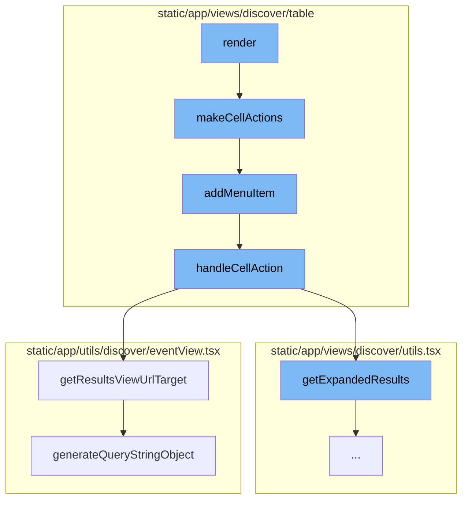
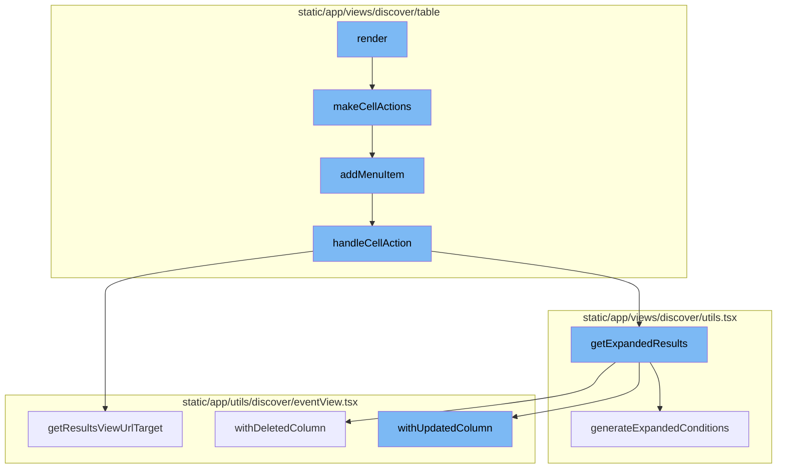
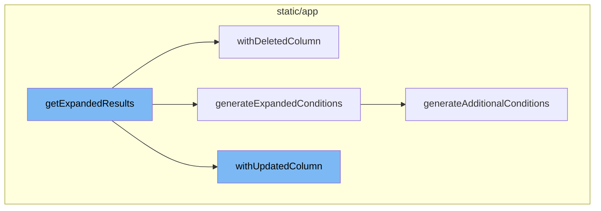

<SwmSnippet path="/static/app/views/discover/table/cellAction.tsx" line="252">

---

# Render Flow

The `render` method is the starting point of the flow. It takes the properties of the component and passes them to the `makeCellActions` function. The result is then used to render a container with the children and the cell actions.

```tsx
  render() {
    const {children} = this.props;
    const cellActions = makeCellActions(this.props);

    return (
      <Container
        data-test-id={cellActions === null ? undefined : 'cell-action-container'}
      >
        {children}
        {cellActions?.length && (
          <DropdownMenu
            items={cellActions}
            usePortal
            size="sm"
            offset={4}
            position="bottom"
            preventOverflowOptions={{padding: 4}}
            flipOptions={{
              fallbackPlacements: [
                'top',
                'right-start',
```

---

</SwmSnippet>

<SwmSnippet path="/static/app/views/discover/table/cellAction.tsx" line="151">

---

`makeCellActions` function takes the data row, column, and other parameters to create a list of actions. It checks the type of the column and the value in the data row to decide which actions to add. The `addMenuItem` function is used to add an action to the list.

```tsx
function makeCellActions({
  dataRow,
  column,
  handleCellAction,
  allowActions,
}: CellActionsOpts) {
  // Do not render context menu buttons for the span op breakdown field.
  if (isRelativeSpanOperationBreakdownField(column.name)) {
    return null;
  }

  // Do not render context menu buttons for the equation fields until we can query on them
  if (isEquationAlias(column.name)) {
    return null;
  }

  let value = dataRow[column.name];

  // error.handled is a strange field where null = true.
  if (
    Array.isArray(value) &&
```

---

</SwmSnippet>

<SwmSnippet path="/static/app/views/discover/table/cellAction.tsx" line="180">

---

`addMenuItem` function is used to add an action to the list of actions. It takes the action, label, and optional text value. If the action is allowed, it pushes a new item to the actions list with the key, label, text value, and an onAction function that calls `handleCellAction` with the action and value.

```tsx
  function addMenuItem(
    action: Actions,
    itemLabel: React.ReactNode,
    itemTextValue?: string
  ) {
    if ((Array.isArray(allowActions) && allowActions.includes(action)) || !allowActions) {
      actions.push({
        key: action,
        label: itemLabel,
        textValue: itemTextValue,
        onAction: () => handleCellAction(action, value),
      });
    }
  }
```

---

</SwmSnippet>

<SwmSnippet path="/static/app/views/discover/table/tableView.tsx" line="526">

---

`handleCellAction` function is used to handle the action when it is triggered. It takes the data row and column and returns a function that takes the action and value. Depending on the action, it updates the query and navigates to a new view.

```tsx
  function handleCellAction(
    dataRow: TableDataRow,
    column: TableColumn<keyof TableDataRow>
  ) {
    return (action: Actions, value: React.ReactText) => {
      const {eventView, organization, location, tableData, isHomepage} = props;

      const query = new MutableSearch(eventView.query);

      let nextView = eventView.clone();
      trackAnalytics('discover_v2.results.cellaction', {
        organization,
        action,
      });

      switch (action) {
        case Actions.RELEASE: {
          const maybeProject = projects.find(project => {
            return project.slug === dataRow.project;
          });

```

---

</SwmSnippet>

<SwmSnippet path="/static/app/utils/discover/eventView.tsx" line="1190">

---

`getResultsViewUrlTarget` method is used to get the URL target for the results view. It takes the organization slug and a flag indicating whether it is the homepage. It returns an object with the pathname and query.

```tsx
  getResultsViewUrlTarget(
    slug: string,
    isHomepage: boolean = false
  ): {pathname: string; query: Query} {
    const target = isHomepage ? 'homepage' : 'results';
    return {
      pathname: normalizeUrl(`/organizations/${slug}/discover/${target}/`),
      query: this.generateQueryStringObject(),
    };
  }
```

---

</SwmSnippet>

<SwmSnippet path="/static/app/utils/discover/eventView.tsx" line="672">

---

`generateQueryStringObject` method is used to generate the query string object for the URL. It takes the properties of the event view and returns an object with the query parameters.

```tsx
  generateQueryStringObject(): Query {
    const output = {
      id: this.id,
      name: this.name,
      field: this.getFields(),
      widths: this.getWidths(),
      sort: encodeSorts(this.sorts),
      environment: this.environment,
      project: this.project,
      query: this.query,
      yAxis: this.yAxis || this.getYAxis(),
      dataset: this.dataset,
      display: this.display,
      topEvents: this.topEvents,
      interval: this.interval,
    };

    for (const field of EXTERNAL_QUERY_STRING_KEYS) {
      if (this[field]?.length) {
        output[field] = this[field];
      }
```

---

</SwmSnippet>

<SwmSnippet path="/static/app/views/discover/utils.tsx" line="262">

---

# Expanded Results Flow

The `getExpandedResults` function is the starting point of the expanded results flow. It converts an aggregated query into one that does not have aggregates. It also applies additional conditions defined in `additionalConditions` and generates conditions based on the `dataRow` parameter and the current fields in the `eventView`.

```tsx
export function getExpandedResults(
  eventView: EventView,
  additionalConditions: Record<string, string>,
  dataRow?: TableDataRow | Event
): EventView {
  const fieldSet = new Set();
  // Expand any functions in the resulting column, and dedupe the result.
  // Mark any column as null to remove it.
  const expandedColumns: (Column | null)[] = eventView.fields.map((field: Field) => {
    const exploded = explodeFieldString(field.field, field.alias);
    const column = exploded.kind === 'function' ? drilldownAggregate(exploded) : exploded;

    if (
      // if expanding the function failed
      column === null ||
      // the new column is already present
      fieldSet.has(column.field) ||
      // Skip aggregate equations, their functions will already be added so we just want to remove it
      isAggregateEquation(field.field)
    ) {
      return null;
```

---

</SwmSnippet>

<SwmSnippet path="/static/app/utils/discover/eventView.tsx" line="971">

---

The `withDeletedColumn` method is part of the expanded results flow. It removes a column from the EventView. If the deleted column is one of the sorted columns, it is also removed from the list of sorts.

```tsx
  withDeletedColumn(columnIndex: number, tableMeta: MetaType | undefined): EventView {
    // Disallow removal of the orphan column, and check for out-of-bounds
    if (this.fields.length <= 1 || this.fields.length <= columnIndex || columnIndex < 0) {
      return this;
    }

    // ensure tableMeta is non-empty
    tableMeta = validateTableMeta(tableMeta);

    // delete the column
    const newEventView = this.clone();
    const fields = [...newEventView.fields];
    fields.splice(columnIndex, 1);
    newEventView.fields = fields;

    // Ensure there is at least one auto width column
    // To ensure a well formed table results.
    const hasAutoIndex = fields.find(field => field.width === COL_WIDTH_UNDEFINED);
    if (!hasAutoIndex) {
      newEventView.fields[0].width = COL_WIDTH_UNDEFINED;
    }
```

---

</SwmSnippet>

<SwmSnippet path="/static/app/views/discover/utils.tsx" line="423">

---

The `generateExpandedConditions` function is another part of the expanded results flow. It generates additional conditions for the EventView based on the `additionalConditions` and `dataRow` parameters. It removes any aggregates from the search conditions to avoid invalid query results.

```tsx
function generateExpandedConditions(
  eventView: EventView,
  additionalConditions: Record<string, string>,
  dataRow?: TableDataRow | Event
): string {
  const parsedQuery = new MutableSearch(eventView.query);

  // Remove any aggregates from the search conditions.
  // otherwise, it'll lead to an invalid query result.
  for (const key in parsedQuery.filters) {
    const column = explodeFieldString(key);
    if (column.kind === 'function') {
      parsedQuery.removeFilter(key);
    }
  }

  const conditions: Record<string, string | string[]> = Object.assign(
    {},
    additionalConditions,
    generateAdditionalConditions(eventView, dataRow)
  );
```

---

</SwmSnippet>

<SwmSnippet path="/static/app/utils/discover/eventView.tsx" line="877">

---

The `withUpdatedColumn` method updates a column in the EventView. If the updated column is one of the sorted columns, it may need to be removed from the list of sorts.

```tsx
  withUpdatedColumn(
    columnIndex: number,
    updatedColumn: Column,
    tableMeta: MetaType | undefined
  ): EventView {
    const columnToBeUpdated = this.fields[columnIndex];
    const fieldAsString = generateFieldAsString(updatedColumn);

    const updateField = columnToBeUpdated.field !== fieldAsString;
    if (!updateField) {
      return this;
    }

    // ensure tableMeta is non-empty
    tableMeta = validateTableMeta(tableMeta);

    const newEventView = this.clone();

    const updatedField: Field = {
      field: fieldAsString,
      width: COL_WIDTH_UNDEFINED,
```

---

</SwmSnippet>

<SwmSnippet path="/static/app/views/discover/utils.tsx" line="310">

---

The `generateAdditionalConditions` function creates additional conditions based on the fields in an EventView and a dataRow/event. It is used in the render flow to generate conditions for the EventView.

```tsx
/**
 * Create additional conditions based on the fields in an EventView
 * and a datarow/event
 */
function generateAdditionalConditions(
  eventView: EventView,
  dataRow?: TableDataRow | Event
): Record<string, string | string[]> {
  const specialKeys = Object.values(URL_PARAM);
  const conditions: Record<string, string | string[]> = {};

  if (!dataRow) {
    return conditions;
  }

  eventView.fields.forEach((field: Field) => {
    const column = explodeFieldString(field.field, field.alias);

    // Skip aggregate fields
    if (column.kind === 'function') {
      return;
```

---

</SwmSnippet>





# Flow drill down

First, we'll zoom into this section of the flow:


<SwmSnippet path="/static/app/views/discover/table/cellAction.tsx" line="252">

---

# Render Flow

The `render` method is the starting point of the flow. It takes the properties of the component and passes them to the `makeCellActions` function. The result is then used to render a container with the children and the cell actions.

```tsx
  render() {
    const {children} = this.props;
    const cellActions = makeCellActions(this.props);

    return (
      <Container
        data-test-id={cellActions === null ? undefined : 'cell-action-container'}
      >
        {children}
        {cellActions?.length && (
          <DropdownMenu
            items={cellActions}
            usePortal
            size="sm"
            offset={4}
            position="bottom"
            preventOverflowOptions={{padding: 4}}
            flipOptions={{
              fallbackPlacements: [
                'top',
                'right-start',
```

---

</SwmSnippet>

<SwmSnippet path="/static/app/views/discover/table/cellAction.tsx" line="151">

---

`makeCellActions` function takes the data row, column, and other parameters to create a list of actions. It checks the type of the column and the value in the data row to decide which actions to add. The `addMenuItem` function is used to add an action to the list.

```tsx
function makeCellActions({
  dataRow,
  column,
  handleCellAction,
  allowActions,
}: CellActionsOpts) {
  // Do not render context menu buttons for the span op breakdown field.
  if (isRelativeSpanOperationBreakdownField(column.name)) {
    return null;
  }

  // Do not render context menu buttons for the equation fields until we can query on them
  if (isEquationAlias(column.name)) {
    return null;
  }

  let value = dataRow[column.name];

  // error.handled is a strange field where null = true.
  if (
    Array.isArray(value) &&
```

---

</SwmSnippet>

<SwmSnippet path="/static/app/views/discover/table/cellAction.tsx" line="180">

---

`addMenuItem` function is used to add an action to the list of actions. It takes the action, label, and optional text value. If the action is allowed, it pushes a new item to the actions list with the key, label, text value, and an onAction function that calls `handleCellAction` with the action and value.

```tsx
  function addMenuItem(
    action: Actions,
    itemLabel: React.ReactNode,
    itemTextValue?: string
  ) {
    if ((Array.isArray(allowActions) && allowActions.includes(action)) || !allowActions) {
      actions.push({
        key: action,
        label: itemLabel,
        textValue: itemTextValue,
        onAction: () => handleCellAction(action, value),
      });
    }
  }
```

---

</SwmSnippet>

<SwmSnippet path="/static/app/views/discover/table/tableView.tsx" line="526">

---

`handleCellAction` function is used to handle the action when it is triggered. It takes the data row and column and returns a function that takes the action and value. Depending on the action, it updates the query and navigates to a new view.

```tsx
  function handleCellAction(
    dataRow: TableDataRow,
    column: TableColumn<keyof TableDataRow>
  ) {
    return (action: Actions, value: React.ReactText) => {
      const {eventView, organization, location, tableData, isHomepage} = props;

      const query = new MutableSearch(eventView.query);

      let nextView = eventView.clone();
      trackAnalytics('discover_v2.results.cellaction', {
        organization,
        action,
      });

      switch (action) {
        case Actions.RELEASE: {
          const maybeProject = projects.find(project => {
            return project.slug === dataRow.project;
          });

```

---

</SwmSnippet>

<SwmSnippet path="/static/app/utils/discover/eventView.tsx" line="1190">

---

`getResultsViewUrlTarget` method is used to get the URL target for the results view. It takes the organization slug and a flag indicating whether it is the homepage. It returns an object with the pathname and query.

```tsx
  getResultsViewUrlTarget(
    slug: string,
    isHomepage: boolean = false
  ): {pathname: string; query: Query} {
    const target = isHomepage ? 'homepage' : 'results';
    return {
      pathname: normalizeUrl(`/organizations/${slug}/discover/${target}/`),
      query: this.generateQueryStringObject(),
    };
  }
```

---

</SwmSnippet>

<SwmSnippet path="/static/app/utils/discover/eventView.tsx" line="672">

---

`generateQueryStringObject` method is used to generate the query string object for the URL. It takes the properties of the event view and returns an object with the query parameters.

```tsx
  generateQueryStringObject(): Query {
    const output = {
      id: this.id,
      name: this.name,
      field: this.getFields(),
      widths: this.getWidths(),
      sort: encodeSorts(this.sorts),
      environment: this.environment,
      project: this.project,
      query: this.query,
      yAxis: this.yAxis || this.getYAxis(),
      dataset: this.dataset,
      display: this.display,
      topEvents: this.topEvents,
      interval: this.interval,
    };

    for (const field of EXTERNAL_QUERY_STRING_KEYS) {
      if (this[field]?.length) {
        output[field] = this[field];
      }
```

---

</SwmSnippet>

Now, lets zoom into this section of the flow:



<SwmSnippet path="/static/app/views/discover/utils.tsx" line="262">

---

# Render Flow

The `getExpandedResults` function is the starting point of the render flow. It converts an aggregated query into one that does not have aggregates. It also applies additional conditions defined in `additionalConditions` and generates conditions based on the `dataRow` parameter and the current fields in the `eventView`.

```tsx
export function getExpandedResults(
  eventView: EventView,
  additionalConditions: Record<string, string>,
  dataRow?: TableDataRow | Event
): EventView {
  const fieldSet = new Set();
  // Expand any functions in the resulting column, and dedupe the result.
  // Mark any column as null to remove it.
  const expandedColumns: (Column | null)[] = eventView.fields.map((field: Field) => {
    const exploded = explodeFieldString(field.field, field.alias);
    const column = exploded.kind === 'function' ? drilldownAggregate(exploded) : exploded;

    if (
      // if expanding the function failed
      column === null ||
      // the new column is already present
      fieldSet.has(column.field) ||
      // Skip aggregate equations, their functions will already be added so we just want to remove it
      isAggregateEquation(field.field)
    ) {
      return null;
```

---

</SwmSnippet>

<SwmSnippet path="/static/app/utils/discover/eventView.tsx" line="971">

---

The `withDeletedColumn` method is part of the render flow. It removes a column from the EventView. If the deleted column is one of the sorted columns, it is also removed from the list of sorts.

```tsx
  withDeletedColumn(columnIndex: number, tableMeta: MetaType | undefined): EventView {
    // Disallow removal of the orphan column, and check for out-of-bounds
    if (this.fields.length <= 1 || this.fields.length <= columnIndex || columnIndex < 0) {
      return this;
    }

    // ensure tableMeta is non-empty
    tableMeta = validateTableMeta(tableMeta);

    // delete the column
    const newEventView = this.clone();
    const fields = [...newEventView.fields];
    fields.splice(columnIndex, 1);
    newEventView.fields = fields;

    // Ensure there is at least one auto width column
    // To ensure a well formed table results.
    const hasAutoIndex = fields.find(field => field.width === COL_WIDTH_UNDEFINED);
    if (!hasAutoIndex) {
      newEventView.fields[0].width = COL_WIDTH_UNDEFINED;
    }
```

---

</SwmSnippet>

<SwmSnippet path="/static/app/views/discover/utils.tsx" line="423">

---

The `generateExpandedConditions` function is another part of the render flow. It generates additional conditions for the EventView based on the `additionalConditions` and `dataRow` parameters. It removes any aggregates from the search conditions to avoid invalid query results.

```tsx
function generateExpandedConditions(
  eventView: EventView,
  additionalConditions: Record<string, string>,
  dataRow?: TableDataRow | Event
): string {
  const parsedQuery = new MutableSearch(eventView.query);

  // Remove any aggregates from the search conditions.
  // otherwise, it'll lead to an invalid query result.
  for (const key in parsedQuery.filters) {
    const column = explodeFieldString(key);
    if (column.kind === 'function') {
      parsedQuery.removeFilter(key);
    }
  }

  const conditions: Record<string, string | string[]> = Object.assign(
    {},
    additionalConditions,
    generateAdditionalConditions(eventView, dataRow)
  );
```

---

</SwmSnippet>

<SwmSnippet path="/static/app/utils/discover/eventView.tsx" line="877">

---

The `withUpdatedColumn` method updates a column in the EventView. If the updated column is one of the sorted columns, it may need to be removed from the list of sorts.

```tsx
  withUpdatedColumn(
    columnIndex: number,
    updatedColumn: Column,
    tableMeta: MetaType | undefined
  ): EventView {
    const columnToBeUpdated = this.fields[columnIndex];
    const fieldAsString = generateFieldAsString(updatedColumn);

    const updateField = columnToBeUpdated.field !== fieldAsString;
    if (!updateField) {
      return this;
    }

    // ensure tableMeta is non-empty
    tableMeta = validateTableMeta(tableMeta);

    const newEventView = this.clone();

    const updatedField: Field = {
      field: fieldAsString,
      width: COL_WIDTH_UNDEFINED,
```

---

</SwmSnippet>

<SwmSnippet path="/static/app/views/discover/utils.tsx" line="310">

---

The `generateAdditionalConditions` function creates additional conditions based on the fields in an EventView and a dataRow/event. It is used in the render flow to generate conditions for the EventView.

```tsx
/**
 * Create additional conditions based on the fields in an EventView
 * and a datarow/event
 */
function generateAdditionalConditions(
  eventView: EventView,
  dataRow?: TableDataRow | Event
): Record<string, string | string[]> {
  const specialKeys = Object.values(URL_PARAM);
  const conditions: Record<string, string | string[]> = {};

  if (!dataRow) {
    return conditions;
  }

  eventView.fields.forEach((field: Field) => {
    const column = explodeFieldString(field.field, field.alias);

    // Skip aggregate fields
    if (column.kind === 'function') {
      return;
```

---

</SwmSnippet>

&nbsp;

*This is an auto-generated document by Swimm AI 🌊 and has not yet been verified by a human*

<SwmMeta version="3.0.0" repo-id="Z2l0aHViJTNBJTNBc2VudHJ5LWRlbW8lM0ElM0FTd2ltbS1EZW1v" repo-name="sentry-demo" doc-type="flows"><sup>Powered by [Swimm](/)</sup></SwmMeta>
