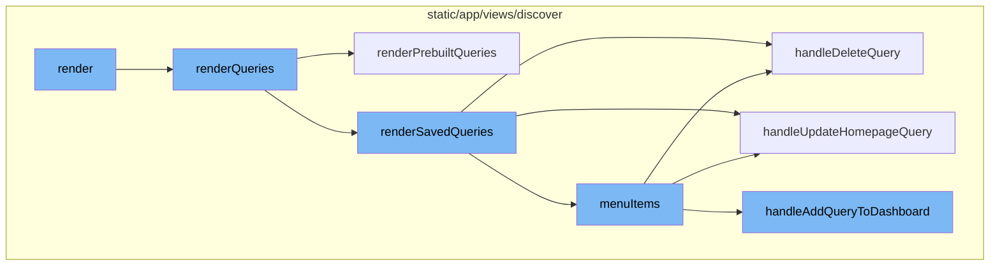
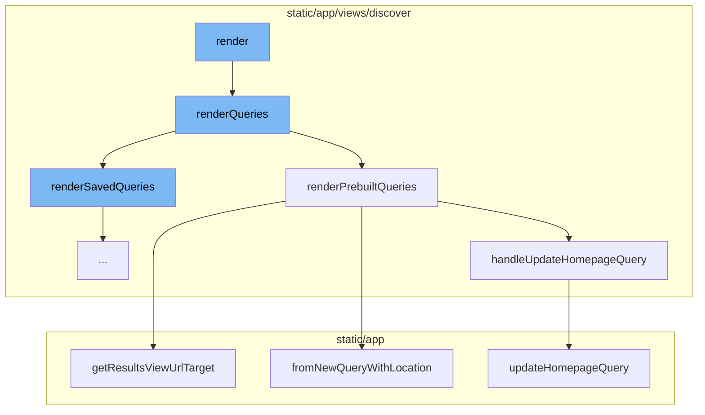
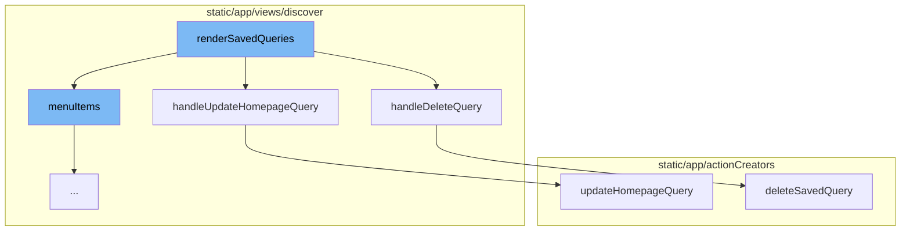
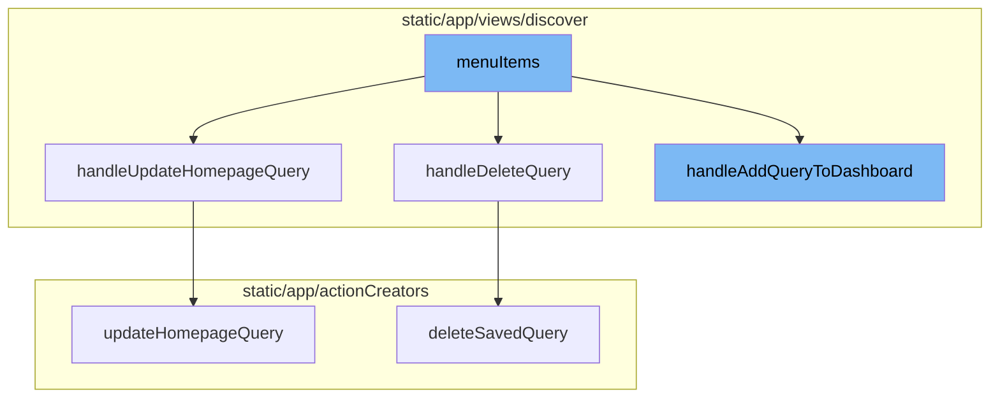

# Render Functionality

Render is a crucial part of the application flow. It is responsible for displaying the application's data to the user. In the context of this application, the render process begins with the `render` method, which returns a `Fragment` that contains a `QueryGrid` and a `PaginationRow`. The `QueryGrid` is populated by the `renderQueries` method.

## Render Queries

The `renderQueries` method is responsible for rendering both prebuilt and saved queries. It checks if we're on the first page and if so, includes the pre-built queries by calling `renderPrebuiltQueries`. It then adds the saved queries by calling `renderSavedQueries`.

### Render Prebuilt Queries

The `renderPrebuiltQueries` method maps over the prebuilt queries and creates an `EventView` for each one. It also checks if a search is performed on the list of queries and filters the pre-built queries accordingly. It then generates a list of menu items for each query, which includes options to add the query to the dashboard and set it as default.

### Render Saved Queries

The `renderSavedQueries` function is responsible for rendering saved queries. It takes the saved queries from the props and maps over them to create a list of QueryCard components. Each QueryCard represents a saved query and has a context menu with options to add the query to a dashboard, set it as default, duplicate the query, or delete the query. These actions are handled by the `handleAddQueryToDashboard`, `handleUpdateHomepageQuery`, `handleDuplicateQuery`, and `handleDeleteQuery` functions respectively.

## Menu Items

The `menuItems` function generates an array of menu items. Each item has a key, label, and an action that is triggered when the item is selected. The actions include adding the query to the dashboard, setting the query as default, duplicating the query, and deleting the query.

## Handle Delete Query

The `handleDeleteQuery` function is responsible for deleting a saved query. It tracks the delete request, calls the `deleteSavedQuery` function, and handles the response by displaying a success or error message.

## Handle Update Homepage Query

The `handleUpdateHomepageQuery` function updates the homepage query. It calls the `updateHomepageQuery` function and handles the response by displaying a success or error message.

## Handle Add Query To Dashboard

The `handleAddQueryToDashboard` function adds a query to the dashboard. It prepares the data for the widget, constructs the link for adding the query to the dashboard, and opens the modal for adding to the dashboard.



# Flow drill down

First, we'll zoom into this section of the flow:



<SwmSnippet path="/static/app/views/discover/queryList.tsx" line="329">

---

# Render Flow

The `render` method is the starting point of the render flow. It returns a `Fragment` that contains a `QueryGrid` and a `PaginationRow`. The `QueryGrid` is populated by the `renderQueries` method.

```tsx
  render() {
    const {pageLinks} = this.props;
    return (
      <Fragment>
        <QueryGrid>{this.renderQueries()}</QueryGrid>
        <PaginationRow
          pageLinks={pageLinks}
          onCursor={(cursor, path, query, direction) => {
            const offset = Number(cursor?.split(':')?.[1] ?? 0);

            const newQuery: Query & {cursor?: string} = {...query, cursor};
            const isPrevious = direction === -1;

            if (offset <= 0 && isPrevious) {
              delete newQuery.cursor;
            }

            browserHistory.push({
              pathname: path,
              query: newQuery,
            });
```

---

</SwmSnippet>

<SwmSnippet path="/static/app/views/discover/queryList.tsx" line="88">

---

The `renderQueries` method is responsible for rendering both prebuilt and saved queries. It checks if we're on the first page and if so, includes the pre-built queries by calling `renderPrebuiltQueries`. It then adds the saved queries by calling `renderSavedQueries`.

```tsx
  renderQueries() {
    const {pageLinks, renderPrebuilt} = this.props;
    const links = parseLinkHeader(pageLinks || '');
    let cards: React.ReactNode[] = [];

    // If we're on the first page (no-previous page exists)
    // include the pre-built queries.
    if (renderPrebuilt && (!links.previous || links.previous.results === false)) {
      cards = cards.concat(this.renderPrebuiltQueries());
    }
    cards = cards.concat(this.renderSavedQueries());

    if (cards.filter(x => x).length === 0) {
      return (
        <StyledEmptyStateWarning>
          <p>{t('No saved queries match that filter')}</p>
        </StyledEmptyStateWarning>
      );
    }

    return cards;
```

---

</SwmSnippet>

<SwmSnippet path="/static/app/views/discover/queryList.tsx" line="137">

---

The `renderPrebuiltQueries` method maps over the prebuilt queries and creates an `EventView` for each one. It also checks if a search is performed on the list of queries and filters the pre-built queries accordingly. It then generates a list of menu items for each query, which includes options to add the query to the dashboard and set it as default.

```tsx
  renderPrebuiltQueries() {
    const {api, location, organization, savedQuerySearchQuery, router} = this.props;
    const views = getPrebuiltQueries(organization);

    const hasSearchQuery =
      typeof savedQuerySearchQuery === 'string' && savedQuerySearchQuery.length > 0;
    const needleSearch = hasSearchQuery ? savedQuerySearchQuery.toLowerCase() : '';

    const list = views.map((view, index) => {
      const eventView = EventView.fromNewQueryWithLocation(view, location);

      // if a search is performed on the list of queries, we filter
      // on the pre-built queries
      if (
        hasSearchQuery &&
        eventView.name &&
        !eventView.name.toLowerCase().includes(needleSearch)
      ) {
        return null;
      }

```

---

</SwmSnippet>

<SwmSnippet path="/static/app/utils/discover/eventView.tsx" line="365">

---

`fromNewQueryWithLocation` is a static method in the `EventView` class that creates an `EventView` from a new query and a location. It applies global selection header values from location whenever possible.

```tsx
  static fromNewQueryWithLocation(newQuery: NewQuery, location: Location): EventView {
    const query = location.query;

    // apply global selection header values from location whenever possible
    const environment: string[] =
      Array.isArray(newQuery.environment) && newQuery.environment.length > 0
        ? newQuery.environment
        : collectQueryStringByKey(query, 'environment');

    const project: number[] =
      Array.isArray(newQuery.projects) && newQuery.projects.length > 0
        ? newQuery.projects
        : decodeProjects(location);

    const saved: NewQuery = {
      ...newQuery,

      environment,
      projects: project,

      // datetime selection
```

---

</SwmSnippet>

<SwmSnippet path="/static/app/views/discover/savedQuery/utils.tsx" line="188">

---

`handleUpdateHomepageQuery` is a function that updates the homepage query. It makes a request to update the homepage query and returns a promise that resolves to the saved query.

```tsx
export function handleUpdateHomepageQuery(
  api: Client,
  organization: Organization,
  query: NewQuery
) {
  const promise = updateHomepageQuery(api, organization.slug, query);

  return promise
    .then(savedQuery => {
      addSuccessMessage(t('Saved as Discover default'));
      return savedQuery;
    })
    .catch(() => {
      addErrorMessage(t('Unable to set query as Discover default'));
    });
}
```

---

</SwmSnippet>

Now, lets zoom into this section of the flow:



<SwmSnippet path="/static/app/views/discover/queryList.tsx" line="230">

---

# Render Flow

The `renderSavedQueries` function is responsible for rendering saved queries. It takes the saved queries from the props and maps over them to create a list of QueryCard components. Each QueryCard represents a saved query and has a context menu with options to add the query to a dashboard, set it as default, duplicate the query, or delete the query. These actions are handled by the `handleAddQueryToDashboard`, `handleUpdateHomepageQuery`, `handleDuplicateQuery`, and `handleDeleteQuery` functions respectively.

```tsx
  renderSavedQueries() {
    const {api, savedQueries, location, organization, router} = this.props;

    if (!savedQueries || !Array.isArray(savedQueries) || savedQueries.length === 0) {
      return [];
    }

    return savedQueries.map((query, index) => {
      const savedQuery = organization.features.includes(
        'performance-discover-dataset-selector'
      )
        ? (getSavedQueryWithDataset(query) as SavedQuery)
        : query;
      const eventView = EventView.fromSavedQuery(savedQuery);
      const recentTimeline = t('Last ') + eventView.statsPeriod;
      const customTimeline =
        moment(eventView.start).format('MMM D, YYYY h:mm A') +
        ' - ' +
        moment(eventView.end).format('MMM D, YYYY h:mm A');

      const to = eventView.getResultsViewShortUrlTarget(organization.slug);
```

---

</SwmSnippet>

<SwmSnippet path="/static/app/views/discover/savedQuery/utils.tsx" line="156">

---

# Deleting a Query

The `handleDeleteQuery` function is used to delete a saved query. It sends a delete request to the server and handles the response by either showing a success message if the query was deleted successfully or an error message if the deletion failed.

```tsx
export function handleDeleteQuery(
  api: Client,
  organization: Organization,
  eventView: EventView
): Promise<void> {
  trackAnalytics('discover_v2.delete_query_request', {
    organization,
    ...extractAnalyticsQueryFields(eventView.toNewQuery()),
  });

  const promise = deleteSavedQuery(api, organization.slug, eventView.id!);

  promise
    .then(() => {
      addSuccessMessage(t('Query deleted'));
      trackAnalytics('discover_v2.delete_query_success', {
        organization,
        ...extractAnalyticsQueryFields(eventView.toNewQuery()),
      });
    })
    .catch((err: Error) => {
```

---

</SwmSnippet>

<SwmSnippet path="/static/app/views/discover/savedQuery/utils.tsx" line="188">

---

# Updating the Homepage Query

The `handleUpdateHomepageQuery` function is used to set a saved query as the default query for the Discover homepage. It sends a request to the server to update the homepage query and handles the response by either showing a success message if the update was successful or an error message if the update failed.

```tsx
export function handleUpdateHomepageQuery(
  api: Client,
  organization: Organization,
  query: NewQuery
) {
  const promise = updateHomepageQuery(api, organization.slug, query);

  return promise
    .then(savedQuery => {
      addSuccessMessage(t('Saved as Discover default'));
      return savedQuery;
    })
    .catch(() => {
      addErrorMessage(t('Unable to set query as Discover default'));
    });
}
```

---

</SwmSnippet>

<SwmSnippet path="/static/app/actionCreators/discoverHomepageQueries.tsx" line="10">

---

The `updateHomepageQuery` function is the one that actually sends the request to the server to update the homepage query. It is called by the `handleUpdateHomepageQuery` function.

```tsx
export function updateHomepageQuery(
  api: Client,
  orgId: string,
  query: NewQuery
): Promise<SavedQuery> {
  return api.requestPromise(`/organizations/${orgId}/discover/homepage/`, {
    method: 'PUT',
    data: query,
  });
}
```

---

</SwmSnippet>

<SwmSnippet path="/static/app/actionCreators/discoverSavedQueries.tsx" line="97">

---

The `deleteSavedQuery` function is the one that actually sends the delete request to the server. It is called by the `handleDeleteQuery` function.

```tsx
export function deleteSavedQuery(
  api: Client,
  orgId: string,
  queryId: string
): Promise<void> {
  const promise: Promise<void> = api.requestPromise(
    `/organizations/${orgId}/discover/saved/${queryId}/`,
    {method: 'DELETE'}
  );

  promise.catch(() => {
    addErrorMessage(t('Unable to delete the saved query'));
  });
  return promise;
}
```

---

</SwmSnippet>

Now, lets zoom into this section of the flow:



<SwmSnippet path="/static/app/views/discover/queryList.tsx" line="254">

---

# Menu Items Function

The `menuItems` function generates an array of menu items. Each item has a key, label, and an action that is triggered when the item is selected. The actions include adding the query to the dashboard, setting the query as default, duplicating the query, and deleting the query.

```tsx
      const menuItems = (canAddToDashboard: boolean): MenuItemProps[] => [
        ...(canAddToDashboard
          ? [
              {
                key: 'add-to-dashboard',
                label: t('Add to Dashboard'),
                onAction: () =>
                  handleAddQueryToDashboard({
                    eventView,
                    location,
                    query: savedQuery,
                    organization,
                    yAxis: savedQuery?.yAxis ?? eventView.yAxis,
                    router,
                  }),
              },
            ]
          : []),
        {
          key: 'set-as-default',
          label: t('Set as Default'),
```

---

</SwmSnippet>

<SwmSnippet path="/static/app/views/discover/savedQuery/utils.tsx" line="156">

---

# Handle Delete Query Function

The `handleDeleteQuery` function is responsible for deleting a saved query. It tracks the delete request, calls the `deleteSavedQuery` function, and handles the response by displaying a success or error message.

```tsx
export function handleDeleteQuery(
  api: Client,
  organization: Organization,
  eventView: EventView
): Promise<void> {
  trackAnalytics('discover_v2.delete_query_request', {
    organization,
    ...extractAnalyticsQueryFields(eventView.toNewQuery()),
  });

  const promise = deleteSavedQuery(api, organization.slug, eventView.id!);

  promise
    .then(() => {
      addSuccessMessage(t('Query deleted'));
      trackAnalytics('discover_v2.delete_query_success', {
        organization,
        ...extractAnalyticsQueryFields(eventView.toNewQuery()),
      });
    })
    .catch((err: Error) => {
```

---

</SwmSnippet>

<SwmSnippet path="/static/app/views/discover/savedQuery/utils.tsx" line="188">

---

# Handle Update Homepage Query Function

The `handleUpdateHomepageQuery` function updates the homepage query. It calls the `updateHomepageQuery` function and handles the response by displaying a success or error message.

```tsx
export function handleUpdateHomepageQuery(
  api: Client,
  organization: Organization,
  query: NewQuery
) {
  const promise = updateHomepageQuery(api, organization.slug, query);

  return promise
    .then(savedQuery => {
      addSuccessMessage(t('Saved as Discover default'));
      return savedQuery;
    })
    .catch(() => {
      addErrorMessage(t('Unable to set query as Discover default'));
    });
}
```

---

</SwmSnippet>

<SwmSnippet path="/static/app/views/discover/utils.tsx" line="681">

---

# Handle Add Query To Dashboard Function

The `handleAddQueryToDashboard` function adds a query to the dashboard. It prepares the data for the widget, constructs the link for adding the query to the dashboard, and opens the modal for adding to the dashboard.

```tsx
export function handleAddQueryToDashboard({
  eventView,
  location,
  query,
  organization,
  router,
  yAxis,
}: {
  eventView: EventView;
  location: Location;
  organization: Organization;
  router: InjectedRouter;
  query?: NewQuery;
  yAxis?: string | string[];
}) {
  const displayType = displayModeToDisplayType(eventView.display as DisplayModes);
  const defaultWidgetQuery = eventViewToWidgetQuery({
    eventView,
    displayType,
    yAxis,
  });
```

---

</SwmSnippet>

<SwmSnippet path="/static/app/actionCreators/discoverHomepageQueries.tsx" line="10">

---

# Update Homepage Query Function

The `updateHomepageQuery` function sends a PUT request to the server to update the homepage query.

```tsx
export function updateHomepageQuery(
  api: Client,
  orgId: string,
  query: NewQuery
): Promise<SavedQuery> {
  return api.requestPromise(`/organizations/${orgId}/discover/homepage/`, {
    method: 'PUT',
    data: query,
  });
}
```

---

</SwmSnippet>

<SwmSnippet path="/static/app/actionCreators/discoverSavedQueries.tsx" line="97">

---

# Delete Saved Query Function

The `deleteSavedQuery` function sends a DELETE request to the server to delete a saved query and handles any errors that occur during the process.

```tsx
export function deleteSavedQuery(
  api: Client,
  orgId: string,
  queryId: string
): Promise<void> {
  const promise: Promise<void> = api.requestPromise(
    `/organizations/${orgId}/discover/saved/${queryId}/`,
    {method: 'DELETE'}
  );

  promise.catch(() => {
    addErrorMessage(t('Unable to delete the saved query'));
  });
  return promise;
}
```

---

</SwmSnippet>

&nbsp;

*This is an auto-generated document by Swimm AI 🌊 and has not yet been verified by a human*

<SwmMeta version="3.0.0" repo-id="Z2l0aHViJTNBJTNBc2VudHJ5LWRlbW8lM0ElM0FTd2ltbS1EZW1v" repo-name="sentry-demo" doc-type="flows"><sup>Powered by [Swimm](/)</sup></SwmMeta>
