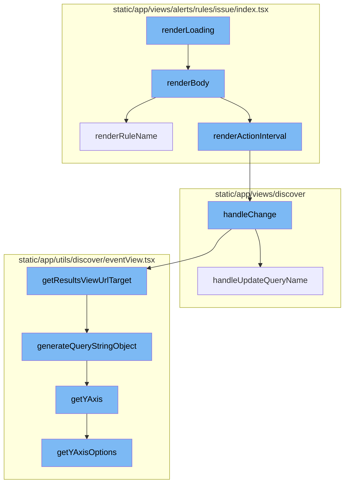
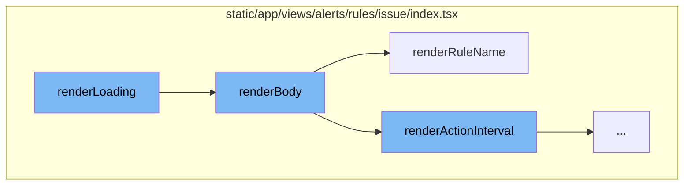
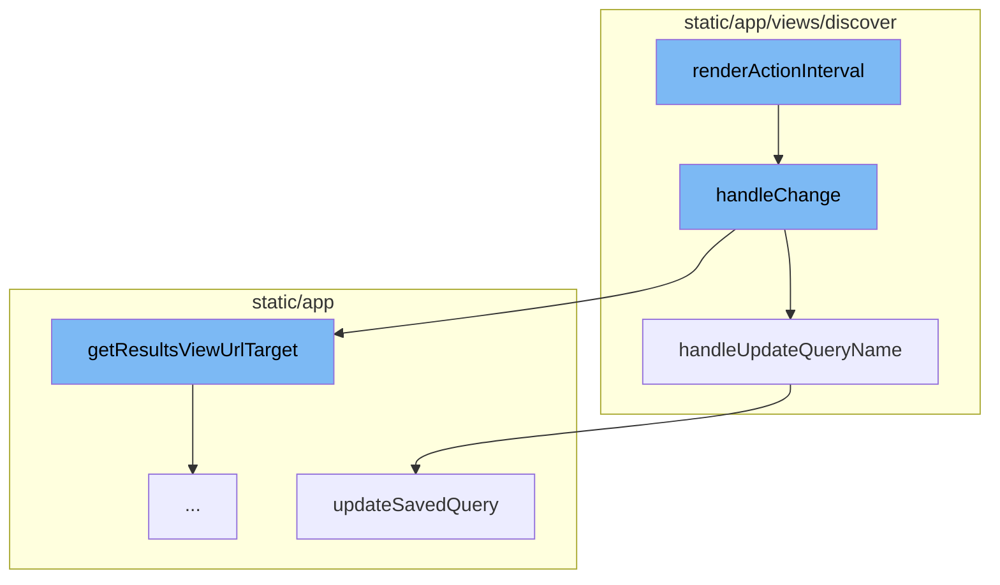
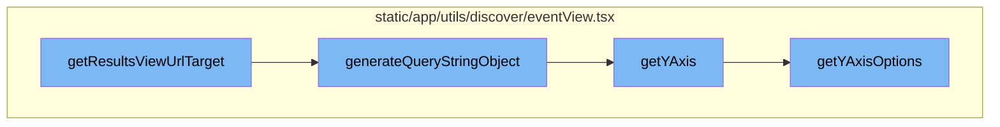

<SwmSnippet path="/static/app/views/alerts/rules/issue/index.tsx" line="831">

---

# renderLoading

`renderLoading` is a method that calls the `renderBody` method. It's used when the component is in a loading state and needs to display a loading screen.

```tsx
  renderLoading() {
    return this.renderBody();
  }
```

---

</SwmSnippet>

<SwmSnippet path="/static/app/views/alerts/rules/issue/index.tsx" line="1157">

---

# renderBody

`renderBody` is a comprehensive method that constructs the main body of the alert rule view. It handles the rendering of various parts of the alert rule form, including environment selection, condition setting, filter setting, and action setting. It also manages the loading state and error handling.

```tsx
  renderBody() {
    const {organization, members} = this.props;
    const {
      project,
      rule,
      detailedError,
      loading,
      sendingNotification,
      incompatibleConditions,
      incompatibleFilters,
    } = this.state;
    const {actions, filters, conditions, frequency} = rule || {};

    const environment =
      !rule || !rule.environment ? ALL_ENVIRONMENTS_KEY : rule.environment;

    const canCreateAlert = hasEveryAccess(['alerts:write'], {organization, project});
    const disabled = loading || !(canCreateAlert || isActiveSuperuser());
    const displayDuplicateError =
      detailedError?.name?.some(str => isExactDuplicateExp.test(str)) ?? false;

```

---

</SwmSnippet>

<SwmSnippet path="/static/app/views/alerts/rules/issue/index.tsx" line="845">

---

# renderRuleName

`renderRuleName` is a method that renders the input field for the alert rule name. It handles the validation and error display for the rule name input.

```tsx
  renderRuleName(disabled: boolean) {
    const {rule, detailedError} = this.state;
    const {name} = rule || {};

    // Duplicate errors display on the "name" field but we're showing them in a banner
    // Remove them from the name detailed error
    const filteredDetailedError =
      detailedError?.name?.filter(str => !isExactDuplicateExp.test(str)) ?? [];

    return (
      <StyledField
        label={null}
        help={null}
        error={filteredDetailedError[0]}
        disabled={disabled}
        required
        stacked
        flexibleControlStateSize
      >
        <Input
          type="text"
```

---

</SwmSnippet>

<SwmSnippet path="/static/app/views/alerts/rules/issue/index.tsx" line="1124">

---

# renderActionInterval

The `renderActionInterval` function is responsible for rendering a form field for frequency selection. It uses the `SelectControl` component to provide a dropdown menu with frequency options. When a frequency is selected, the `handleChange` function is invoked with 'frequency' and the selected value as arguments.

```tsx
  renderActionInterval(disabled: boolean) {
    const {rule} = this.state;
    const {frequency} = rule || {};

    return (
      <FormField
        name="frequency"
        inline={false}
        style={{padding: 0, border: 'none'}}
        label={null}
        help={null}
        className={this.hasError('frequency') ? ' error' : ''}
        required
        disabled={disabled}
        flexibleControlStateSize
      >
        {({onChange, onBlur}) => (
          <SelectControl
            clearable={false}
            disabled={disabled}
            value={`${frequency}`}
```

---

</SwmSnippet>

<SwmSnippet path="/static/app/views/discover/eventInputName.tsx" line="29">

---

# handleChange

The `handleChange` function is triggered when a new frequency is selected. It checks if the new query name is different from the old one and if it is, it creates a new `EventView` object with the updated name. It then calls `handleUpdateQueryName` to update the query name in the database.

```tsx
  function handleChange(nextQueryName: string) {
    // Do not update automatically if
    // 1) It is a new query
    // 2) The new name is same as the old name
    if (!savedQuery || savedQuery.name === nextQueryName) {
      return;
    }

    // This ensures that we are updating SavedQuery.name only.
    // Changes on QueryBuilder table will not be saved.
    const nextEventView = EventView.fromSavedQuery({
      ...savedQuery,
      name: nextQueryName,
    });

    handleUpdateQueryName(api, organization, nextEventView).then(
      (_updatedQuery: SavedQuery) => {
        // The current eventview may have changes that are not explicitly saved.
        // So, we just preserve them and change its name
        const renamedEventView = eventView.clone();
        renamedEventView.name = nextQueryName;
```

---

</SwmSnippet>

<SwmSnippet path="/static/app/views/discover/savedQuery/utils.tsx" line="117">

---

# handleUpdateQueryName

`handleUpdateQueryName` is a function that updates the name of a saved query. It sends a request to the server to update the saved query and handles the response. If the update is successful, it adds a success message. If the update fails, it adds an error message.

```tsx
/**
 * Essentially the same as handleUpdateQuery, but specifically for changing the
 * name of the query
 */
export function handleUpdateQueryName(
  api: Client,
  organization: Organization,
  eventView: EventView
) {
  const payload = eventView.toNewQuery();
  trackAnalytics('discover_v2.update_query_name_request', {
    organization,
    ...extractAnalyticsQueryFields(payload),
  });

  const promise = updateSavedQuery(api, organization.slug, payload);

  promise
    .then(_saved => {
      addSuccessMessage(t('Query name saved'));

```

---

</SwmSnippet>

<SwmSnippet path="/static/app/actionCreators/discoverSavedQueries.tsx" line="62">

---

# updateSavedQuery

`updateSavedQuery` is a function that sends a PUT request to the server to update a saved query. If the request fails, it adds an error message.

```tsx
export function updateSavedQuery(
  api: Client,
  orgId: string,
  query: NewQuery
): Promise<SavedQuery> {
  const promise: Promise<SavedQuery> = api.requestPromise(
    `/organizations/${orgId}/discover/saved/${query.id}/`,
    {
      method: 'PUT',
      data: query,
    }
  );

  promise.catch(() => {
    addErrorMessage(t('Unable to update your saved query'));
  });
  return promise;
}
```

---

</SwmSnippet>

<SwmSnippet path="/static/app/utils/discover/eventView.tsx" line="1190">

---

# getResultsViewUrlTarget

The `getResultsViewUrlTarget` function is used to generate a URL target for the results view. It takes a slug and a boolean indicating if it's the homepage. It returns an object containing the pathname and a query generated by the `generateQueryStringObject` function.

```tsx
  getResultsViewUrlTarget(
    slug: string,
    isHomepage: boolean = false
  ): {pathname: string; query: Query} {
    const target = isHomepage ? 'homepage' : 'results';
    return {
      pathname: normalizeUrl(`/organizations/${slug}/discover/${target}/`),
      query: this.generateQueryStringObject(),
    };
  }
```

---

</SwmSnippet>

<SwmSnippet path="/static/app/utils/discover/eventView.tsx" line="672">

---

# generateQueryStringObject

The `generateQueryStringObject` function is used to generate a query string object. It creates an object with various properties including `yAxis` which is either the current `yAxis` or the result of the `getYAxis` function.

```tsx
  generateQueryStringObject(): Query {
    const output = {
      id: this.id,
      name: this.name,
      field: this.getFields(),
      widths: this.getWidths(),
      sort: encodeSorts(this.sorts),
      environment: this.environment,
      project: this.project,
      query: this.query,
      yAxis: this.yAxis || this.getYAxis(),
      dataset: this.dataset,
      display: this.display,
      topEvents: this.topEvents,
      interval: this.interval,
    };

    for (const field of EXTERNAL_QUERY_STRING_KEYS) {
      if (this[field]?.length) {
        output[field] = this[field];
      }
```

---

</SwmSnippet>

<SwmSnippet path="/static/app/utils/discover/eventView.tsx" line="1319">

---

# getYAxis

The `getYAxis` function is used to get the `yAxis` value. It first gets the `yAxisOptions` using the `getYAxisOptions` function. If `yAxis` is not set, it returns the default option. If `yAxis` is set, it checks if it's one of the options in `yAxisOptions` and returns it if it is, otherwise it returns the default option.

```tsx
  getYAxis(): string {
    const yAxisOptions = this.getYAxisOptions();

    const yAxis = this.yAxis;
    const defaultOption = yAxisOptions[0].value;

    if (!yAxis) {
      return defaultOption;
    }

    // ensure current selected yAxis is one of the items in yAxisOptions
    const result = yAxisOptions.findIndex(
      (option: SelectValue<string>) => option.value === yAxis
    );

    if (result >= 0) {
      return typeof yAxis === 'string' ? yAxis : yAxis[0];
    }

    return defaultOption;
  }
```

---

</SwmSnippet>

<SwmSnippet path="/static/app/utils/discover/eventView.tsx" line="1300">

---

# getYAxisOptions

The `getYAxisOptions` function is used to get the options for the `yAxis`. It filters the aggregate fields to only include those that can be graphed and maps them to an object with a label and value. It then concatenates the result with the `CHART_AXIS_OPTIONS` and returns it.

```tsx
  getYAxisOptions(): SelectValue<string>[] {
    // Make option set and add the default options in.
    return uniqBy(
      this.getAggregateFields()
        // Only include aggregates that make sense to be graphable (eg. not string or date)
        .filter(
          (field: Field) =>
            isLegalYAxisType(aggregateOutputType(field.field)) ||
            isAggregateEquation(field.field)
        )
        .map((field: Field) => ({
          label: isEquation(field.field) ? getEquation(field.field) : field.field,
          value: field.field,
        }))
        .concat(CHART_AXIS_OPTIONS),
      'value'
    );
  }
```

---

</SwmSnippet>



# Flow drill down

First, we'll zoom into this section of the flow:



<SwmSnippet path="/static/app/views/alerts/rules/issue/index.tsx" line="831">

---

# renderLoading

`renderLoading` is a method that calls the `renderBody` method. It's used when the component is in a loading state and needs to display a loading screen.

```tsx
  renderLoading() {
    return this.renderBody();
  }
```

---

</SwmSnippet>

<SwmSnippet path="/static/app/views/alerts/rules/issue/index.tsx" line="1157">

---

# renderBody

`renderBody` is a comprehensive method that constructs the main body of the alert rule view. It handles the rendering of various parts of the alert rule form, including environment selection, condition setting, filter setting, and action setting. It also manages the loading state and error handling.

```tsx
  renderBody() {
    const {organization, members} = this.props;
    const {
      project,
      rule,
      detailedError,
      loading,
      sendingNotification,
      incompatibleConditions,
      incompatibleFilters,
    } = this.state;
    const {actions, filters, conditions, frequency} = rule || {};

    const environment =
      !rule || !rule.environment ? ALL_ENVIRONMENTS_KEY : rule.environment;

    const canCreateAlert = hasEveryAccess(['alerts:write'], {organization, project});
    const disabled = loading || !(canCreateAlert || isActiveSuperuser());
    const displayDuplicateError =
      detailedError?.name?.some(str => isExactDuplicateExp.test(str)) ?? false;

```

---

</SwmSnippet>

<SwmSnippet path="/static/app/views/alerts/rules/issue/index.tsx" line="845">

---

# renderRuleName

`renderRuleName` is a method that renders the input field for the alert rule name. It handles the validation and error display for the rule name input.

```tsx
  renderRuleName(disabled: boolean) {
    const {rule, detailedError} = this.state;
    const {name} = rule || {};

    // Duplicate errors display on the "name" field but we're showing them in a banner
    // Remove them from the name detailed error
    const filteredDetailedError =
      detailedError?.name?.filter(str => !isExactDuplicateExp.test(str)) ?? [];

    return (
      <StyledField
        label={null}
        help={null}
        error={filteredDetailedError[0]}
        disabled={disabled}
        required
        stacked
        flexibleControlStateSize
      >
        <Input
          type="text"
```

---

</SwmSnippet>

Now, lets zoom into this section of the flow:



<SwmSnippet path="/static/app/views/alerts/rules/issue/index.tsx" line="1124">

---

# renderActionInterval

The `renderActionInterval` function is responsible for rendering a form field for frequency selection. It uses the `SelectControl` component to provide a dropdown menu with frequency options. When a frequency is selected, the `handleChange` function is invoked with 'frequency' and the selected value as arguments.

```tsx
  renderActionInterval(disabled: boolean) {
    const {rule} = this.state;
    const {frequency} = rule || {};

    return (
      <FormField
        name="frequency"
        inline={false}
        style={{padding: 0, border: 'none'}}
        label={null}
        help={null}
        className={this.hasError('frequency') ? ' error' : ''}
        required
        disabled={disabled}
        flexibleControlStateSize
      >
        {({onChange, onBlur}) => (
          <SelectControl
            clearable={false}
            disabled={disabled}
            value={`${frequency}`}
```

---

</SwmSnippet>

<SwmSnippet path="/static/app/views/discover/eventInputName.tsx" line="29">

---

# handleChange

The `handleChange` function is triggered when a new frequency is selected. It checks if the new query name is different from the old one and if it is, it creates a new `EventView` object with the updated name. It then calls `handleUpdateQueryName` to update the query name in the database.

```tsx
  function handleChange(nextQueryName: string) {
    // Do not update automatically if
    // 1) It is a new query
    // 2) The new name is same as the old name
    if (!savedQuery || savedQuery.name === nextQueryName) {
      return;
    }

    // This ensures that we are updating SavedQuery.name only.
    // Changes on QueryBuilder table will not be saved.
    const nextEventView = EventView.fromSavedQuery({
      ...savedQuery,
      name: nextQueryName,
    });

    handleUpdateQueryName(api, organization, nextEventView).then(
      (_updatedQuery: SavedQuery) => {
        // The current eventview may have changes that are not explicitly saved.
        // So, we just preserve them and change its name
        const renamedEventView = eventView.clone();
        renamedEventView.name = nextQueryName;
```

---

</SwmSnippet>

<SwmSnippet path="/static/app/views/discover/savedQuery/utils.tsx" line="117">

---

# handleUpdateQueryName

`handleUpdateQueryName` is a function that updates the name of a saved query. It sends a request to the server to update the saved query and handles the response. If the update is successful, it adds a success message. If the update fails, it adds an error message.

```tsx
/**
 * Essentially the same as handleUpdateQuery, but specifically for changing the
 * name of the query
 */
export function handleUpdateQueryName(
  api: Client,
  organization: Organization,
  eventView: EventView
) {
  const payload = eventView.toNewQuery();
  trackAnalytics('discover_v2.update_query_name_request', {
    organization,
    ...extractAnalyticsQueryFields(payload),
  });

  const promise = updateSavedQuery(api, organization.slug, payload);

  promise
    .then(_saved => {
      addSuccessMessage(t('Query name saved'));

```

---

</SwmSnippet>

<SwmSnippet path="/static/app/actionCreators/discoverSavedQueries.tsx" line="62">

---

# updateSavedQuery

`updateSavedQuery` is a function that sends a PUT request to the server to update a saved query. If the request fails, it adds an error message.

```tsx
export function updateSavedQuery(
  api: Client,
  orgId: string,
  query: NewQuery
): Promise<SavedQuery> {
  const promise: Promise<SavedQuery> = api.requestPromise(
    `/organizations/${orgId}/discover/saved/${query.id}/`,
    {
      method: 'PUT',
      data: query,
    }
  );

  promise.catch(() => {
    addErrorMessage(t('Unable to update your saved query'));
  });
  return promise;
}
```

---

</SwmSnippet>

Now, lets zoom into this section of the flow:



<SwmSnippet path="/static/app/utils/discover/eventView.tsx" line="1190">

---

# getResultsViewUrlTarget

The `getResultsViewUrlTarget` function is used to generate a URL target for the results view. It takes a slug and a boolean indicating if it's the homepage. It returns an object containing the pathname and a query generated by the `generateQueryStringObject` function.

```tsx
  getResultsViewUrlTarget(
    slug: string,
    isHomepage: boolean = false
  ): {pathname: string; query: Query} {
    const target = isHomepage ? 'homepage' : 'results';
    return {
      pathname: normalizeUrl(`/organizations/${slug}/discover/${target}/`),
      query: this.generateQueryStringObject(),
    };
  }
```

---

</SwmSnippet>

<SwmSnippet path="/static/app/utils/discover/eventView.tsx" line="672">

---

# generateQueryStringObject

The `generateQueryStringObject` function is used to generate a query string object. It creates an object with various properties including `yAxis` which is either the current `yAxis` or the result of the `getYAxis` function.

```tsx
  generateQueryStringObject(): Query {
    const output = {
      id: this.id,
      name: this.name,
      field: this.getFields(),
      widths: this.getWidths(),
      sort: encodeSorts(this.sorts),
      environment: this.environment,
      project: this.project,
      query: this.query,
      yAxis: this.yAxis || this.getYAxis(),
      dataset: this.dataset,
      display: this.display,
      topEvents: this.topEvents,
      interval: this.interval,
    };

    for (const field of EXTERNAL_QUERY_STRING_KEYS) {
      if (this[field]?.length) {
        output[field] = this[field];
      }
```

---

</SwmSnippet>

<SwmSnippet path="/static/app/utils/discover/eventView.tsx" line="1319">

---

# getYAxis

The `getYAxis` function is used to get the `yAxis` value. It first gets the `yAxisOptions` using the `getYAxisOptions` function. If `yAxis` is not set, it returns the default option. If `yAxis` is set, it checks if it's one of the options in `yAxisOptions` and returns it if it is, otherwise it returns the default option.

```tsx
  getYAxis(): string {
    const yAxisOptions = this.getYAxisOptions();

    const yAxis = this.yAxis;
    const defaultOption = yAxisOptions[0].value;

    if (!yAxis) {
      return defaultOption;
    }

    // ensure current selected yAxis is one of the items in yAxisOptions
    const result = yAxisOptions.findIndex(
      (option: SelectValue<string>) => option.value === yAxis
    );

    if (result >= 0) {
      return typeof yAxis === 'string' ? yAxis : yAxis[0];
    }

    return defaultOption;
  }
```

---

</SwmSnippet>

<SwmSnippet path="/static/app/utils/discover/eventView.tsx" line="1300">

---

# getYAxisOptions

The `getYAxisOptions` function is used to get the options for the `yAxis`. It filters the aggregate fields to only include those that can be graphed and maps them to an object with a label and value. It then concatenates the result with the `CHART_AXIS_OPTIONS` and returns it.

```tsx
  getYAxisOptions(): SelectValue<string>[] {
    // Make option set and add the default options in.
    return uniqBy(
      this.getAggregateFields()
        // Only include aggregates that make sense to be graphable (eg. not string or date)
        .filter(
          (field: Field) =>
            isLegalYAxisType(aggregateOutputType(field.field)) ||
            isAggregateEquation(field.field)
        )
        .map((field: Field) => ({
          label: isEquation(field.field) ? getEquation(field.field) : field.field,
          value: field.field,
        }))
        .concat(CHART_AXIS_OPTIONS),
      'value'
    );
  }
```

---

</SwmSnippet>

&nbsp;

*This is an auto-generated document by Swimm AI 🌊 and has not yet been verified by a human*

<SwmMeta version="3.0.0" repo-id="Z2l0aHViJTNBJTNBc2VudHJ5LWRlbW8lM0ElM0FTd2ltbS1EZW1v" repo-name="sentry-demo" doc-type="flows"><sup>Powered by [Swimm](/)</sup></SwmMeta>
