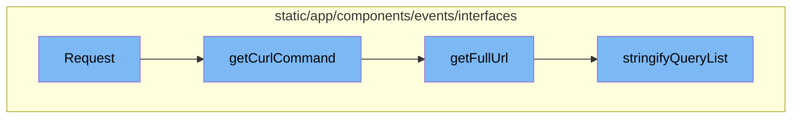
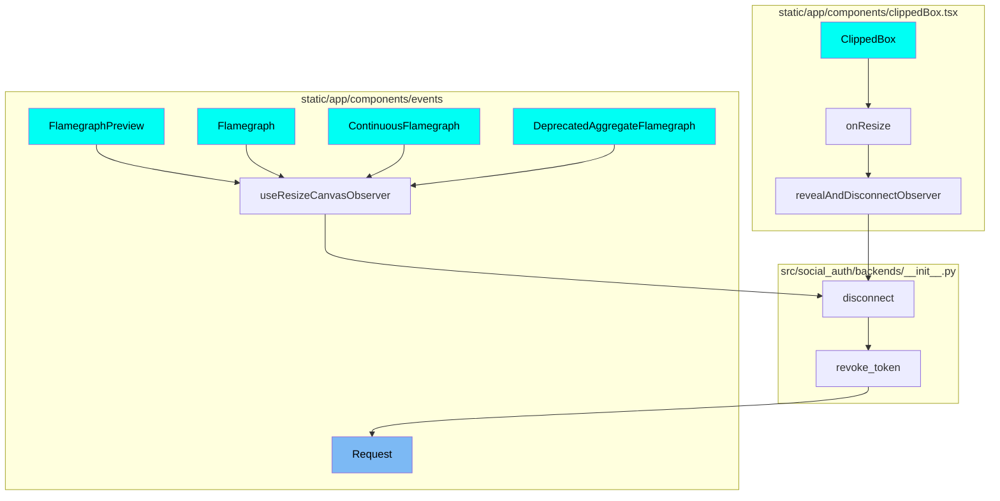

The Request flow is a sequence of operations that starts with the `Request` function. This function takes in data and an event as parameters. It checks if the data has a method and url, if not it's considered a partial request. It then calls `getFullUrl` function to get the full url of the request.

The next step in the flow is the `getCurlCommand` function. It takes the data from the request and constructs a curl command. It checks for the method, headers, and data in the request. It then calls `getFullUrl` function to get the full url of the request.

The `getFullUrl` function is the third step in the flow. It takes the data from the request and constructs the full url. It checks if the data has a query or fragment and appends it to the url. It then calls `stringifyQueryList` function to stringify the query list.

The final step in the flow is the `stringifyQueryList` function. It takes the query from the request and stringifies it. If the query is already a string, it returns it as is. If the query is an array, it converts it into a string.

# Flow drill down



<SwmSnippet path="/static/app/components/events/interfaces/request/index.tsx" line="53">

---

# Request Flow

The `Request` function is the starting point of the flow. It takes in data and event as parameters. It checks if the data has a method and url, if not it's considered a partial request. It then calls `getFullUrl` function to get the full url of the request.

```tsx
export function Request({data, event}: RequestProps) {
  const entryIndex = event.entries.findIndex(entry => entry.type === EntryType.REQUEST);
  const meta = event._meta?.entries?.[entryIndex]?.data;

  const [view, setView] = useState<View>('formatted');

  const isPartial =
    // We assume we only have a partial interface is we're missing
    // an HTTP method. This means we don't have enough information
    // to reliably construct a full HTTP request.
    !data.method || !data.url;

  let fullUrl = getFullUrl(data);

  if (!isUrl(fullUrl)) {
    // Check if the url passed in is a safe url to avoid XSS
    fullUrl = undefined;
  }

  let parsedUrl: HTMLAnchorElement | null = null;

```

---

</SwmSnippet>

<SwmSnippet path="/static/app/components/events/interfaces/utils.tsx" line="118">

---

The `getCurlCommand` function is the next step in the flow. It takes the data from the request and constructs a curl command. It checks for the method, headers, and data in the request. It then calls `getFullUrl` function to get the full url of the request.

```tsx
// TODO(dcramer): support cookies
export function getCurlCommand(data: EntryRequest['data']) {
  let result = 'curl';

  if (defined(data.method) && data.method !== 'GET') {
    result += ' \\\n -X ' + data.method;
  }

  data.headers = data.headers?.filter(defined);

  // TODO(benvinegar): just gzip? what about deflate?
  const compressed = data.headers?.find(
    h => h[0] === 'Accept-Encoding' && h[1].includes('gzip')
  );
  if (compressed) {
    result += ' \\\n --compressed';
  }

  // sort headers
  const headers =
    data.headers?.sort(function (a, b) {
```

---

</SwmSnippet>

<SwmSnippet path="/static/app/components/events/interfaces/utils.tsx" line="194">

---

The `getFullUrl` function is the third step in the flow. It takes the data from the request and constructs the full url. It checks if the data has a query or fragment and appends it to the url. It then calls `stringifyQueryList` function to stringify the query list.

```tsx
export function getFullUrl(data: EntryRequest['data']): string | undefined {
  let fullUrl = data?.url;
  if (!fullUrl) {
    return fullUrl;
  }

  if (data?.query?.length) {
    fullUrl += '?' + stringifyQueryList(data.query);
  }

  if (data.fragment) {
    fullUrl += '#' + data.fragment;
  }

  return escapeBashString(fullUrl);
}
```

---

</SwmSnippet>

<SwmSnippet path="/static/app/components/events/interfaces/utils.tsx" line="173">

---

The `stringifyQueryList` function is the final step in the flow. It takes the query from the request and stringifies it. If the query is already a string, it returns it as is. If the query is an array, it converts it into a string.

```tsx
export function stringifyQueryList(query: string | [key: string, value: string][]) {
  if (typeof query === 'string') {
    return query;
  }

  const queryObj: Record<string, string[]> = {};
  for (const kv of query) {
    if (kv !== null && kv.length === 2) {
      const [key, value] = kv;
      if (value !== null) {
        if (Array.isArray(queryObj[key])) {
          queryObj[key].push(value);
        } else {
          queryObj[key] = [value];
        }
      }
    }
  }
  return qs.stringify(queryObj);
}
```

---

</SwmSnippet>

# Where is this flow used?

This flow is used multiple times in the codebase as represented in the following diagram:

(Note - these are only some of the entry points of this flow)



&nbsp;

*This is an auto-generated document by Swimm AI 🌊 and has not yet been verified by a human*

<SwmMeta version="3.0.0" repo-id="Z2l0aHViJTNBJTNBc2VudHJ5LWRlbW8lM0ElM0FTd2ltbS1EZW1v" repo-name="sentry-demo" doc-type="flows"><sup>Powered by [Swimm](/)</sup></SwmMeta>
